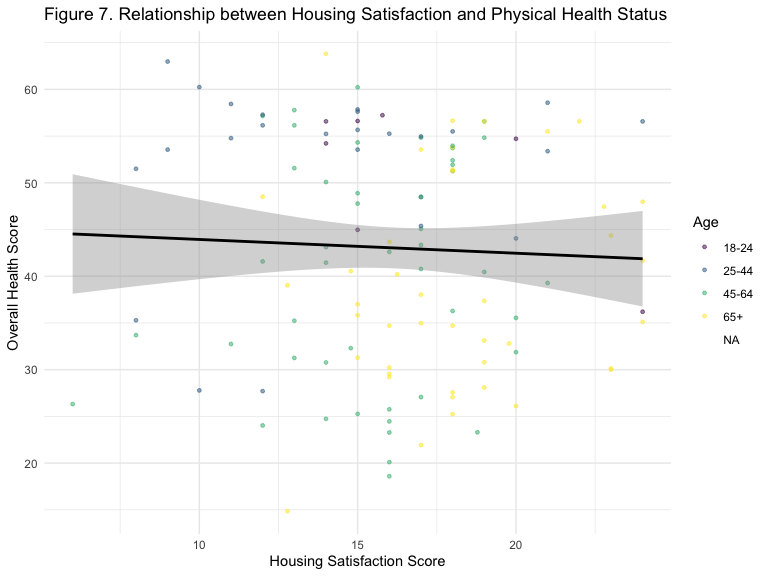
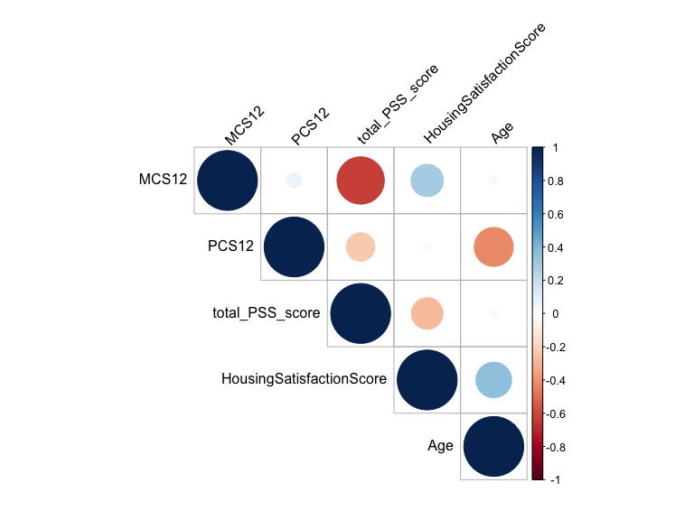

Data Cleaning, Preliminary Analysis, and Final Data Analysis
================
Dionna Attinson
2/7/2020

``` r
SurveyData = 
  readxl::read_xls('./SFH_Survey_CODED_CLEANED.xls') %>% 
  janitor::clean_names()
```

    ## New names:
    ## * PSS_8 -> PSS_8...108
    ## * PSS_8 -> PSS_8...109

### Data Cleaning and Recoding (Betances Data)

``` r
SurveyData =
 SurveyData %>% 
 rename(Gender = x1_to_which_gender_identity_do_you_most_identify_selected_choice,
        Education = x3_what_is_the_highest_level_of_education_you_have_completed_selected_choice,
        Race = x4_which_best_describes_your_race_ethnicity_check_all_that_apply_selected_choice,
        Income = x7_hand_participant_income_card_which_of_these_groups_on_this_card_is_closest_to_your_total_personal_income_before_taxes_during_the_last_year_please_include_income_from_all_sources_your_salaries_wages_and_any_benefits_including_social_security_welfare_gifts_or_any_other_income_please_do_not_include_food_stamps_or_rental_subsidies_tell_me_the_code_for_the_amount_you_got_last_year_or_the_code_for_the_amount_you_usually_get_per_month_if_necessary_work_with_resident_to_construct_a_monthly_personal_and_household_income)
```

##### In the code chunk below, a number of variables were recoded as binary.

  - `Smoke` was the variable that identified the smoking status of an
    individual. Those who responded that they smoke ANY products
    including marijuana, THC, hash, hookah, E-cigarettes, Cigarettes or
    Cigarillos were coded as `1` = Smoker. Those who responded that they
    did not smoke any products were coded as `0`, Non-smoker.
  - Evidence of mice/rats, cockroaches, and having a mildew odor present
    in the home were all coded as `1` = Yes, `0` = No.

<!-- end list -->

``` r
VariablesofInterest = 
  SurveyData %>% 
  select(age, Gender, Race, pss_5, pss_6, pss_8_108, pss_8_109, pss_10, sf36_1, sf36_4, 
        sf36_6, sf36_14, sf36_15, sf36_18, sf36_19, sf36_22, sf36_26, sf36_27, sf36_28,
        sf36_32, Education, Income, repairs_needed, asthma, anxiety, lungd, depression,
        heartdisease, cancer, diabetes,hypertension, products_used, neg_health_building, 
        micerats, cockroaches, mildew, homesat,buildsat, neighborhoodsat, propmansat, sumtempsat, wintempsat) %>% 
  
  rename(Smoke = products_used) %>% 
  rename(Age = age) %>% 
  mutate(Smoke = recode(Smoke, 
                    "Dont smoke" = "0",
                    "Cigarettes and/or Cigarillos (common brands are Marlboro, Black & Mild)" = "1",
                    "Hookah" = "1",
                    "Cigarettes and/or Cigarillos (common brands are Marlboro, Black & Mild) ,Marijuana, hash, THC, grass, pot, or weed" = "1",
                    "Cigarettes and/or Cigarillos (common brands are Marlboro, Black & Mild) ,E-cigarettes (look like regular cigarettes, but are battery-powered),Marijuana, hash, THC, grass, pot, or weed,Hookah" = "1",
                    "E-cigarettes (look like regular cigarettes, but are battery-powered)" = "1",
                   "Marijuana, hash, THC, grass, pot, or weed" = "1"),
        micerats = recode(micerats, 
                          "Yes" = "1", 
                          "No" = "0"),
        cockroaches = recode(cockroaches, 
                             "Yes" = "1", 
                             "No" = "0"),
        mildew = recode(mildew, 
                            "Yes" = "1",
                            "No" = "0"),
        neg_health_building = recode(neg_health_building, 
                                      "Yes" = "1",
                                      "No" = "0"),
        Race = recode(Race,
                      "Hispanic or Latino" = "Hispanic or Latinx",
                      "Other, specify:" = "Other",
                      "Hispanic or Latino,Native American/ Alaskan Native" = "Other",
                      "Non- Hispanic Black or African American,Asian or Pacific Islander" = "Other",
                      "Non- Hispanic Black or African American,Hispanic or Latino" = "Other",
                      "Non-Hispanic White,Non- Hispanic Black or African American,Hispanic or Latino,Native American/ Alaskan Native,Asian or Pacific Islander" = "Other"))
```

##### Below, I scored the Perceived Stress Scale (PSS-4) and the SF-12. The PSS coding instructions were as follows: code `0` - never, `1` - almost never, `2` - sometimes, `3` - fairly often, `4` - very often & reverse your scores for questions 4, 5, 7, and 8. On these 4 questions, change the scores to: 0 = 4, 1 = 3, 2 = 2, 3 = 1, 4 = 0.

``` r
##PSS Scale
CodedData_VariablesofInterest =
  VariablesofInterest %>% 
  mutate(
    pss_5_coded = pss_5,
    pss_6_coded = pss_6,
    pss_8_coded = pss_8_108,
    pss_9_coded = pss_8_109,
    pss_10_coded = pss_10, 
    gh1 = sf36_1,
    pf02 = sf36_4,  
    pf04 = sf36_6,
    rp2 = sf36_14,  
    rp3 = sf36_15,  
    re2 = sf36_18,
    re3 = sf36_19,
    bp2 = sf36_22,
    mh3 = sf36_26,
    vt2 = sf36_27,
    mh4 = sf36_28,
    sf2 = sf36_32) %>% 
    
  mutate(pss_5_coded = recode(pss_5_coded, 
                        "Never" = "4",
                        "Almost never" = "3",
                        "Sometimes" = "2", 
                        "Fairly often" = "1",
                        "Very often" = "0"), 
         pss_6_coded = recode(pss_6_coded, 
                        "Never" = "0",
                        "Almost never" = "1",
                        "Sometimes" = "2", 
                        "Fairly often" = "3",
                        "Very often" = "4"),
         pss_8_coded = recode(pss_8_coded, 
                        "Never" = "4",
                        "Almost never" = "3",
                        "Sometimes" = "2", 
                        "Fairly often" = "1",
                        "Very often" = "0"),
         pss_9_coded = recode(pss_9_coded, 
                        "Never" = "0",
                        "Almost never" = "1",
                        "Sometimes" = "2", 
                        "Fairly often" = "3",
                        "Very often" = "4"),
         pss_10_coded = recode(pss_10_coded, 
                        "Never" = "0",
                        "Almost never" = "1",
                        "Sometimes" = "2", 
                        "Fairly often" = "3",
                        "Very often" = "4"),
         gh1 = recode(gh1,
                         "Excellent" = "1",
                         "Very Good" = "2",
                         "Good" = "3",
                         "Fair" = "4",
                         "Poor" = "5"),
         pf02 = recode(pf02, 
                         "Yes, limited a lot" = "1",
                         "Yes, limited a little" = "2",
                         "No, not limited at all" = "3"),
         pf04 = recode(pf04, 
                         "Yes, limited a lot" = "1",
                         "Yes, limited a little" = "2",
                         "No, not limited at all" = "3"),
         rp2 = recode(rp2, 
                         "Yes" = "1",
                         "No" = "2"),
         rp3 = recode(rp3, 
                         "Yes" = "1",
                         "No" = "2"), 
         re2 = recode(re2, 
                         "Yes" = "1",
                         "No" = "2"), 
         re3 = recode(re3, 
                         "Yes" = "1",
                         "No" = "2"),
         bp2 = recode(bp2,
                         "Not at all" = "1",
                         "A little bit" = "2",
                         "Moderately" = "3",
                         "Quite a bit" = "4",
                         "Extremely" = "5"),
         mh3 =  recode(mh3,
                          "All of the time" = "1",
                          "Most of the time" = "2",
                          "A good bit of the time" = "3",
                          "Some of the time" = "4",
                          "A little of the time" = "5",
                          "None of the time" = "6"),
         vt2 = recode(vt2,
                          "All of the time" = "1",
                          "Most of the time" = "2",
                          "A good bit of the time" = "3",
                          "Some of the time" = "4",
                          "A little of the time" = "5",
                          "None of the time" = "6"),
         mh4 = recode(mh4,
                          "All of the time" = "1",
                          "Most of the time" = "2",
                          "A good bit of the time" = "3",
                          "Some of the time" = "4",
                          "A little of the time" = "5",
                          "None of the time" = "6"),
         sf2 = recode(sf2,
                         "All of the time" = "1",
                         "Most of the time" = "2",
                         "Some of the time" = "3",
                         "A little of the time" = "4",
                         "None of the time" = "5")) 
```

##### The code chunk below now represents the second step of scoring the SF-12. This requires reversing the scores of certain questions so that a higher SF-12 score means better health.

``` r
CodedData_VariablesofInterest = 
  CodedData_VariablesofInterest %>% 
  mutate(
     gh1 = recode(gh1,
                         "1" = "5",
                         "2" = "4",
                         "3" = "3",
                         "4" = "2",
                         "5" = "1"),
         bp2 = recode(bp2,
                          "1" = "6",
                          "2" = "5",
                          "3" = "4",
                          "4" = "3",
                          "5" = "2",
                          "6" = "1"),
         mh3 = recode(mh3,
                          "1" = "6",
                          "2" = "5",
                          "3" = "4",
                          "4" = "3",
                          "5" = "2",
                          "6" = "1"),
         vt2 = recode(vt2,
                          "1" = "6",
                          "2" = "5",
                          "3" = "4",
                          "4" = "3",
                          "5" = "2",
                          "6" = "1"))
```

##### Next, I created dummy variables for each of the SF-12 variables.

``` r
  CodedData_VariablesofInterest$pf02_1 <- as.numeric(CodedData_VariablesofInterest$pf02 == 1L) 
  CodedData_VariablesofInterest$pf02_2 <- as.numeric(CodedData_VariablesofInterest$pf02 == 2L) 
  CodedData_VariablesofInterest$pf04_1 <- as.numeric(CodedData_VariablesofInterest$pf04 == 1L) 
  CodedData_VariablesofInterest$pf04_2 <- as.numeric(CodedData_VariablesofInterest$pf04 == 2L) 
  CodedData_VariablesofInterest$rp2_1 <- as.numeric(CodedData_VariablesofInterest$rp2 == 1L) 
  CodedData_VariablesofInterest$rp3_1 <- as.numeric(CodedData_VariablesofInterest$rp3 == 1L) 
  CodedData_VariablesofInterest$bp2_1 <- as.numeric(CodedData_VariablesofInterest$bp2 == 1L) 
  CodedData_VariablesofInterest$bp2_2 <- as.numeric(CodedData_VariablesofInterest$bp2 == 2L) 
  CodedData_VariablesofInterest$bp2_3 <- as.numeric(CodedData_VariablesofInterest$bp2 == 3L) 
  CodedData_VariablesofInterest$bp2_4 <- as.numeric(CodedData_VariablesofInterest$bp2 == 4L) 
  CodedData_VariablesofInterest$gh1_1 <- as.numeric(CodedData_VariablesofInterest$gh1 == 1L) 
  CodedData_VariablesofInterest$gh1_2 <- as.numeric(CodedData_VariablesofInterest$gh1 == 2L) 
  CodedData_VariablesofInterest$gh1_3 <- as.numeric(CodedData_VariablesofInterest$gh1 == 3L) 
  CodedData_VariablesofInterest$gh1_4 <- as.numeric(CodedData_VariablesofInterest$gh1 == 4L) 
  CodedData_VariablesofInterest$vt2_1 <- as.numeric(CodedData_VariablesofInterest$vt2 == 1L) 
  CodedData_VariablesofInterest$vt2_2 <- as.numeric(CodedData_VariablesofInterest$vt2 == 2L) 
  CodedData_VariablesofInterest$vt2_3 <- as.numeric(CodedData_VariablesofInterest$vt2 == 3L) 
  CodedData_VariablesofInterest$vt2_4 <- as.numeric(CodedData_VariablesofInterest$vt2 == 4L) 
  CodedData_VariablesofInterest$vt2_5 <- as.numeric(CodedData_VariablesofInterest$vt2 == 5L) 
  CodedData_VariablesofInterest$sf2_1 <- as.numeric(CodedData_VariablesofInterest$sf2 == 1L) 
  CodedData_VariablesofInterest$sf2_2 <- as.numeric(CodedData_VariablesofInterest$sf2 == 2L) 
  CodedData_VariablesofInterest$sf2_3 <- as.numeric(CodedData_VariablesofInterest$sf2 == 3L) 
  CodedData_VariablesofInterest$sf2_4 <- as.numeric(CodedData_VariablesofInterest$sf2 == 4L) 
  CodedData_VariablesofInterest$re2_1 <- as.numeric(CodedData_VariablesofInterest$re2 == 1L) 
  CodedData_VariablesofInterest$re3_1 <- as.numeric(CodedData_VariablesofInterest$re3 == 1L) 
  CodedData_VariablesofInterest$mh3_1 <- as.numeric(CodedData_VariablesofInterest$mh3 == 1L) 
  CodedData_VariablesofInterest$mh3_2 <- as.numeric(CodedData_VariablesofInterest$mh3 == 2L) 
  CodedData_VariablesofInterest$mh3_3 <- as.numeric(CodedData_VariablesofInterest$mh3 == 3L) 
  CodedData_VariablesofInterest$mh3_4 <- as.numeric(CodedData_VariablesofInterest$mh3 == 4L) 
  CodedData_VariablesofInterest$mh3_5 <- as.numeric(CodedData_VariablesofInterest$mh3 == 5L) 
  CodedData_VariablesofInterest$mh4_1 <- as.numeric(CodedData_VariablesofInterest$mh4 == 1L) 
  CodedData_VariablesofInterest$mh4_2 <- as.numeric(CodedData_VariablesofInterest$mh4 == 2L) 
  CodedData_VariablesofInterest$mh4_3 <- as.numeric(CodedData_VariablesofInterest$mh4 == 3L) 
  CodedData_VariablesofInterest$mh4_4 <- as.numeric(CodedData_VariablesofInterest$mh4 == 4L) 
  CodedData_VariablesofInterest$mh4_5 <- as.numeric(CodedData_VariablesofInterest$mh4 == 5L) 
```

##### I then created SF-12 weights and aggregates of indicator variables using physical and mental regression weights.

``` r
CodedData_VariablesofInterest = 
  CodedData_VariablesofInterest %>% 
  mutate(RAWPCS12 =
                   (-7.23216*pf02_1) + (-3.45555*pf02_2) +
                   (-6.24397*pf04_1) + (-2.73557*pf04_2) +
                   (-4.61617*rp2_1) + 
                   (-5.51747*rp3_1) +
                   (-11.25544*bp2_1) + (-8.38063*bp2_2) +
                   (-6.50522*bp2_3) + (-3.80130*bp2_4) + (-8.37399*gh1_1) +
                   (-5.56461*gh1_2) + (-3.02396*gh1_3) + (-1.31872*gh1_4) +
                   (-2.44706*vt2_1) + (-2.02168*vt2_2) + (-1.6185*vt2_3) +
                   (-1.14387*vt2_4) + (-0.42251*vt2_5) + (-0.33682*sf2_1) +
                   (-0.94342*sf2_2) + (-0.18043*sf2_3) + (0.11038*sf2_4) +
                   (3.04365*re2_1) + (2.32091*re3_1) + (3.46638*mh3_1) +
                   (2.90426*mh3_2) + (2.37241*mh3_3) + (1.36689*mh3_4) +
                   (0.66514*mh3_5) + (4.61446*mh4_1) + (3.41593*mh4_2) +
                   (2.34247*mh4_3) + (1.28044*mh4_4) + (0.41188*mh4_5),

           RAWMCS12 =
                   (3.93115*pf02_1) + (1.8684*pf02_2) +
                   (2.68282*pf04_1) + (1.43103*pf04_2) + (1.4406*rp2_1) +
                   (1.66968*rp3_1) + (1.48619*bp2_1) + (1.76691*bp2_2) +
                   (1.49384*bp2_3) + (0.90384*bp2_4) + (-1.71175*gh1_1) +
                   (-0.16891*gh1_2) + (0.03482*gh1_3) + (-0.06064*gh1_4) +
                   (-6.02409*vt2_1) + (-4.88962*vt2_2) + (-3.29805*vt2_3) +
                   (-1.65178*vt2_4) + (-0.92057*vt2_5) + (-6.29724*sf2_1) +
                   (-8.26066*sf2_2) + (-5.63286*sf2_3) + (-3.13896*sf2_4) +
                   (-6.82672*re2_1) + (-5.69921*re3_1) + (-10.19085*mh3_1) +
                   (-7.92717*mh3_2) + (-6.31121*mh3_3) + (-4.09842*mh3_4) +
                   (-1.94949*mh3_5) + (-16.15395*mh4_1) + (-10.77911*mh4_2) +
                   (-8.09914*mh4_3) + (-4.59055*mh4_4) + (-1.95934*mh4_5))
```

##### We then computed a norm-based standardization to PCS12 and MCS12.

``` r
CodedData_VariablesofInterest = 
  CodedData_VariablesofInterest %>% 
  mutate(
  PCS12 = (RAWPCS12 + 56.57706),
  MCS12 = (RAWMCS12 + 60.75781))
```

``` r
CodedData_VariablesofInterest = 
  CodedData_VariablesofInterest %>% 
  mutate(
pss_5_coded =  as.numeric(pss_5_coded),
pss_6_coded =  as.numeric(pss_6_coded),
pss_8_coded = as.numeric(pss_8_coded),
pss_9_coded = as.numeric(pss_9_coded),
pss_10_coded = as.numeric(pss_10_coded))
```

##### For the SF-12 scale, a standardized SF-12 score was created for both physical and mental health for each participant. This resulted in the variables `PCS12` and `MCS12`. The higher the SF-12 scores, the better their overall health-related quality of life.

##### For the PSS scale, a total score was created from the questions which became the variable `total_PSS_score`. I then created stress categories for future categorical analysis:

  - Scores ranging from 0-6 would be considered low stress.
  - Scores ranging from 7-13 ould be considered moderate stress.
  - Scores ranging from 14-20 would be considered high perceived
stress.

##### Further, several other variables were transformed. Age was transformed to a categorical variable, creating the age groups of 18-24, 25-44, 45-64, and 65+. Gender was transformed into a binary variable (0 = male, 1 = female), and a Housing Satisfaction Score was created. A higher score indicates higher overall housing satisfaction. This score was created based off of the totals of four questions:

  - The participant’s satisfaction with their apartment
  - The participant’s satisfcation with their building
  - The participant’s satisfcation with their neighbhorhood
  - The participant’s satisfaction with their property management
  - The participant’s satisfcation with their apartment’s temperature in
    the summer
  - The participant’s satisfaction with their apartment’s temperature in
    the
winter

##### Lastly, a binary chronic disease outcome was created. If a participant responded that they or someone in their home have the following conditions, they were coded as `1`:

  - Cancer
  - Heart Disease
  - Diabetes
  - Hypertension
  - Asthma
  - Lung Disease
  - Anxiety
  - Depression

<!-- end list -->

``` r
CodedData_VariablesofInterest = 
CodedData_VariablesofInterest %>% 
  mutate(
    total_PSS_score = pss_5_coded + pss_6_coded + pss_8_coded + pss_9_coded + pss_10_coded,
    PSS_Category = total_PSS_score, 
    PSS_Category = 
          case_when(PSS_Category >= 14 ~ 'High Perceived Stress',
                    PSS_Category >= 7 ~ 'Moderate Stress',
                    PSS_Category >= 0  ~ 'Low Stress'),
    Age_Category = Age,
    Age_Category = 
          case_when(Age_Category >= 65  ~ '65+',
                    Age_Category >= 45  ~ '45-64',
                    Age_Category >= 25 ~ '25-44',
                    Age_Category >= 18 ~ '18-24'),
    Gender_Coded = Gender, 
    Gender_Coded = recode(Gender_Coded, 
                          "Male" = "0",
                          "Female" = "1",
                          `Other, please specify:` = "Null"),
    AptSat_Coded = homesat, 
    AptSat_Coded = recode(AptSat_Coded,
                          "Very Dissatisfied" = "1",
                          "Dissatisfied" = "2", 
                          "Satisfied" = "3",
                          "Very Satisfied" ="4"), 
    BuildingSat_Coded = buildsat, 
    BuildingSat_Coded = recode(BuildingSat_Coded,
                          "Very Dissatisfied" = "1",
                          "Dissatisfied" = "2", 
                          "Satisfied" = "3",
                          "Very Satisfied" ="4"),
    NeighborhoodSat_Coded = neighborhoodsat, 
    NeighborhoodSat_Coded = recode(NeighborhoodSat_Coded,
                          "Very Dissatisfied" = "1",
                          "Dissatisfied" = "2", 
                          "Satisfied" = "3",
                          "Very Satisfied" ="4"),
   PropertyManSat_Coded = propmansat,
   PropertyManSat_Coded = recode(PropertyManSat_Coded,
                          "Very Dissatisfied" = "1",
                          "Dissatisfied" = "2", 
                          "Satisfied" = "3",
                          "Very Satisfied" ="4"),
   WinTempSat_Coded = wintempsat, 
   WinTempSat_Coded = recode(WinTempSat_Coded,
                          "Very Dissatisfied" = "1",
                          "Dissatisfied" = "2", 
                          "Satisfied" = "3",
                          "Very Satisfied" ="4"), 
   SumTempSat_Coded = sumtempsat, 
   SumTempSat_Coded = recode(SumTempSat_Coded,
                          "Very Dissatisfied" = "1",
                          "Dissatisfied" = "2", 
                          "Satisfied" = "3",
                          "Very Satisfied" ="4"),
   WinTempSat_Coded = as.numeric(WinTempSat_Coded),
   SumTempSat_Coded = as.numeric(SumTempSat_Coded),
   AptSat_Coded = as.numeric(AptSat_Coded), 
   BuildingSat_Coded = as.numeric(BuildingSat_Coded),
   NeighborhoodSat_Coded = as.numeric(NeighborhoodSat_Coded),
   PropertyManSat_Coded = as.numeric(PropertyManSat_Coded),
   asthma = as.numeric(asthma),
   heartdisease = as.numeric(heartdisease),
   lungd = as.numeric(lungd),
   anxiety = as.numeric(anxiety),
   depression = as.numeric(depression),
   cancer = as.numeric(cancer),
   hypertension = as.numeric(hypertension),
   diabetes = as.numeric(diabetes),
   Chronic_Disease = asthma + heartdisease + lungd + anxiety + depression + cancer + hypertension + diabetes,
   Chronic_Disease = 
          case_when(Chronic_Disease >= 1 ~ '1',
                    Chronic_Disease == 0 ~ '0'))
```

``` r
CodedData_VariablesofInterest = 
  CodedData_VariablesofInterest %>% 
  mutate(
  PropertyManSat_Coded = na_mean(PropertyManSat_Coded),
  WinTempSat_Coded = na_mean(WinTempSat_Coded),
  HousingSatisfactionScore = AptSat_Coded + BuildingSat_Coded + NeighborhoodSat_Coded + PropertyManSat_Coded + WinTempSat_Coded + SumTempSat_Coded,
  Satisfaction_Category = HousingSatisfactionScore,
  Satisfaction_Category = 
          case_when(Satisfaction_Category >= 18 ~ 'High Satisfaction',
                    Satisfaction_Category >= 12 ~ 'Moderate Satisfaction',
                    Satisfaction_Category >= 6  ~ 'Low Satisfaction'))
```

##### Below, I changed variables into factors and numeric values.

``` r
CodedData_VariablesofInterest = 
  CodedData_VariablesofInterest %>% 
  mutate(
    Education = as.factor(Education),
    Gender_Coded = factor(Gender_Coded, levels = c("0","1")),
    Race = as.factor(Race),
    Age = as.numeric(Age),
    Income = factor(Income, levels = c("1", "2", "3", "4", "5", "6","7","8","9","10")),
    Smoke = factor(Smoke, levels = c("0", "1")),
    asthma = factor(asthma, levels = c("0","1")),
    lungd = factor(lungd, levels = c("0","1")),
    heartdisease = factor(heartdisease, levels = c("0","1")),
    anxiety = factor(anxiety, levels = c("0","1")),
    depression = factor(depression, levels = c("0","1")),
    cancer = factor(cancer,levels = c("0","1")),
    diabetes = factor(diabetes,levels = c("0","1")),
    micerats = factor(micerats,levels = c("0","1")),
    mildew = factor(mildew,levels = c("0","1")),
    cockroaches = factor(cockroaches,levels = c("0","1")),
    Chronic_Disease = factor(Chronic_Disease,levels = c("0","1"))
  )
```

##### In order to collapse education categories into fewer groups, education levels were finalized into three categories:

  - Less than high school (included those who never attended school, or
    did not complete a high school degree/G.E.D)
  - High school/G.E.D
  - Post High School Education (included those who attended vocational
    school, some college, 2-year/4-year college degree, and post
    graduate education)

<!-- end list -->

``` r
CodedData_VariablesofInterest = 
CodedData_VariablesofInterest %>% 
  mutate(Education = as.character(Education))
```

``` r
CodedData_VariablesofInterest[99, "Education"] = "Never Attended School"
CodedData_VariablesofInterest[33, "Education"] = "Some College"
CodedData_VariablesofInterest[20, "Education"] = "Some College"
CodedData_VariablesofInterest[53, "Education"] = NA
```

``` r
CodedData_VariablesofInterest = 
  CodedData_VariablesofInterest %>% 
  mutate(
  Education_Group = Education, 
  Education_Group = recode(Education_Group, 
                    "Never Attended School" = "Less than High School",
                    "Vocational School" = "Post High School Education",
                    "Some College" = "Post High School Education",
                    "2 Year Community College Degree" = "Post High School Education",
                    "4 Year College Degree" = "Post High School Education",
                    "Post-Graduate Degree" = "Post High School Education",
                    "High School/Secondary School Diploma" =    "High School/G.E.D.",
                    "G.E.D." = "High School/G.E.D."))
```

``` r
CodedData_VariablesofInterest = 
  CodedData_VariablesofInterest %>% 
  mutate(Education_Group = as.factor(Education_Group))
```

##### In order to collapse income categories into fewer groups, education levels were finalized into three categories:

  - `1` - Total personal income less than $10,000/year
  - `2` - Total personal income between $10,000 - $24,000/year
  - `3` - Total personal income $25,000k + /year

<!-- end list -->

``` r
CodedData_VariablesofInterest = 
  CodedData_VariablesofInterest %>% 
  mutate(
  Income_Group = Income, 
  Income_Group = recode(Income_Group, 
                    "2" = "1",
                    "3" = "1",
                    "4" = "2",
                    "5" = "2",
                    "6" = "3",
                    "7" = "3",
                    "8" = "3",
                    "9" = "3",
                    "10" = "3"),
  Income_Group = factor(Income_Group,levels= c("1","2","3")))
```

### Univariable/Descriptive Analyses

##### The tables below provide descriptive analyses of the independent and dependent variables.

#### Outcome Variables

##### Overall Physical Health Status (Outcome 1)

``` r
CodedData_VariablesofInterest %>% 
  select(PCS12) %>% 
  summary() %>% 
  knitr::kable(col.names = c("Summary of Self-Reported Physical Health"))
```

<table>

<thead>

<tr>

<th style="text-align:left;">

</th>

<th style="text-align:left;">

Summary of Self-Reported Physical Health

</th>

</tr>

</thead>

<tbody>

<tr>

<td style="text-align:left;">

</td>

<td style="text-align:left;">

Min. :14.86

</td>

</tr>

<tr>

<td style="text-align:left;">

</td>

<td style="text-align:left;">

1st Qu.:32.52

</td>

</tr>

<tr>

<td style="text-align:left;">

</td>

<td style="text-align:left;">

Median :44.05

</td>

</tr>

<tr>

<td style="text-align:left;">

</td>

<td style="text-align:left;">

Mean :43.03

</td>

</tr>

<tr>

<td style="text-align:left;">

</td>

<td style="text-align:left;">

3rd Qu.:54.75

</td>

</tr>

<tr>

<td style="text-align:left;">

</td>

<td style="text-align:left;">

Max. :63.81

</td>

</tr>

<tr>

<td style="text-align:left;">

</td>

<td style="text-align:left;">

NA’s :1

</td>

</tr>

</tbody>

</table>

``` r
CodedData_VariablesofInterest %>% 
  drop_na() %>% 
  group_by(PCS12, Age_Category, Gender) %>% 
  summarize(n = n()) %>% 
    ggplot(aes(x= Age_Category, y = PCS12)) + geom_boxplot() +
  geom_jitter() +  facet_grid(. ~ Gender)
```


##### Overall Mentall Health Status (Outcome 2)

``` r
CodedData_VariablesofInterest %>% 
  select(MCS12) %>% 
  summary() %>% 
  knitr::kable(col.names = c("Summary of Self-Reported Mental Health"))
```

<table>

<thead>

<tr>

<th style="text-align:left;">

</th>

<th style="text-align:left;">

Summary of Self-Reported Mental Health

</th>

</tr>

</thead>

<tbody>

<tr>

<td style="text-align:left;">

</td>

<td style="text-align:left;">

Min. :19.57

</td>

</tr>

<tr>

<td style="text-align:left;">

</td>

<td style="text-align:left;">

1st Qu.:43.25

</td>

</tr>

<tr>

<td style="text-align:left;">

</td>

<td style="text-align:left;">

Median :53.49

</td>

</tr>

<tr>

<td style="text-align:left;">

</td>

<td style="text-align:left;">

Mean :49.86

</td>

</tr>

<tr>

<td style="text-align:left;">

</td>

<td style="text-align:left;">

3rd Qu.:58.84

</td>

</tr>

<tr>

<td style="text-align:left;">

</td>

<td style="text-align:left;">

Max. :69.92

</td>

</tr>

<tr>

<td style="text-align:left;">

</td>

<td style="text-align:left;">

NA’s :1

</td>

</tr>

</tbody>

</table>

``` r
CodedData_VariablesofInterest %>% 
  drop_na() %>% 
  group_by(MCS12, Age_Category, Gender) %>% 
  summarize(n = n()) %>% 
    ggplot(aes(x= Age_Category, y = MCS12)) + geom_boxplot() +
  geom_jitter() +  facet_grid(. ~ Gender)
```


#### Independent Variables

``` r
CodedData_VariablesofInterest %>% 
  group_by(Smoke) %>% 
  summarize(n=n()) %>% 
  mutate(
    percent = n/124*100) %>% 
  mutate(
    Smoke = recode(Smoke,
                   "0" = "Non-smoker(s)",
                   "1" = "Smoker(s)")) %>% 
  knitr::kable(col.names=c("Smoking Status", "n", "Percent(%)"), digits = 2)
```

<table>

<thead>

<tr>

<th style="text-align:left;">

Smoking Status

</th>

<th style="text-align:right;">

n

</th>

<th style="text-align:right;">

Percent(%)

</th>

</tr>

</thead>

<tbody>

<tr>

<td style="text-align:left;">

Non-smoker(s)

</td>

<td style="text-align:right;">

97

</td>

<td style="text-align:right;">

78.23

</td>

</tr>

<tr>

<td style="text-align:left;">

Smoker(s)

</td>

<td style="text-align:right;">

27

</td>

<td style="text-align:right;">

21.77

</td>

</tr>

</tbody>

</table>

``` r
CodedData_VariablesofInterest %>% 
  group_by(Race) %>% 
  summarize(n=n()) %>%
   mutate(
  percent = n/124*100) %>% 
  mutate(
    Race = recode(Race,
                  "Other, specify:" = "Other")
  ) %>% 
  knitr::kable(col.names=c("Race/Ethnicity", "n", "Percent(%)"), digits = 2)
```

<table>

<thead>

<tr>

<th style="text-align:left;">

Race/Ethnicity

</th>

<th style="text-align:right;">

n

</th>

<th style="text-align:right;">

Percent(%)

</th>

</tr>

</thead>

<tbody>

<tr>

<td style="text-align:left;">

Hispanic or Latinx

</td>

<td style="text-align:right;">

87

</td>

<td style="text-align:right;">

70.16

</td>

</tr>

<tr>

<td style="text-align:left;">

Non- Hispanic Black or African American

</td>

<td style="text-align:right;">

26

</td>

<td style="text-align:right;">

20.97

</td>

</tr>

<tr>

<td style="text-align:left;">

Other

</td>

<td style="text-align:right;">

11

</td>

<td style="text-align:right;">

8.87

</td>

</tr>

</tbody>

</table>

``` r
CodedData_VariablesofInterest %>% 
  group_by(Age_Category) %>% 
  summarize(n=n()) %>%
  mutate(
  percent = n/124*100) %>% 
  knitr::kable(col.names=c("Age Group", "n", "Percent(%)"), digits = 2)
```

<table>

<thead>

<tr>

<th style="text-align:left;">

Age Group

</th>

<th style="text-align:right;">

n

</th>

<th style="text-align:right;">

Percent(%)

</th>

</tr>

</thead>

<tbody>

<tr>

<td style="text-align:left;">

18-24

</td>

<td style="text-align:right;">

7

</td>

<td style="text-align:right;">

5.65

</td>

</tr>

<tr>

<td style="text-align:left;">

25-44

</td>

<td style="text-align:right;">

25

</td>

<td style="text-align:right;">

20.16

</td>

</tr>

<tr>

<td style="text-align:left;">

45-64

</td>

<td style="text-align:right;">

47

</td>

<td style="text-align:right;">

37.90

</td>

</tr>

<tr>

<td style="text-align:left;">

65+

</td>

<td style="text-align:right;">

43

</td>

<td style="text-align:right;">

34.68

</td>

</tr>

<tr>

<td style="text-align:left;">

NA

</td>

<td style="text-align:right;">

2

</td>

<td style="text-align:right;">

1.61

</td>

</tr>

</tbody>

</table>

``` r
CodedData_VariablesofInterest %>% 
  group_by(Gender) %>% 
  summarize(n=n()) %>%
  mutate(
  percent = n/124*100) %>% 
  knitr::kable(col.names=c("Gender", "n", "Percent(%)"), digits = 2)
```

<table>

<thead>

<tr>

<th style="text-align:left;">

Gender

</th>

<th style="text-align:right;">

n

</th>

<th style="text-align:right;">

Percent(%)

</th>

</tr>

</thead>

<tbody>

<tr>

<td style="text-align:left;">

Female

</td>

<td style="text-align:right;">

97

</td>

<td style="text-align:right;">

78.23

</td>

</tr>

<tr>

<td style="text-align:left;">

Male

</td>

<td style="text-align:right;">

26

</td>

<td style="text-align:right;">

20.97

</td>

</tr>

<tr>

<td style="text-align:left;">

Other, please specify:

</td>

<td style="text-align:right;">

1

</td>

<td style="text-align:right;">

0.81

</td>

</tr>

</tbody>

</table>

``` r
CodedData_VariablesofInterest %>% 
  drop_na() %>% 
  group_by(Age, Gender) %>% 
  ggplot(aes(x=Gender, y=Age)) + geom_violin() +
  labs(x = "Gender",
      y = "Age",
      title = "Figure 1. Distribution of Age by Gender")
```


``` r
CodedData_VariablesofInterest %>% 
  drop_na() %>% 
  select(Gender, Age) %>% 
  group_by(Gender) %>% 
  summarize(Mean = mean(Age)) %>% 
  knitr::kable(col.names=c("Gender", "Mean Age"), digits = 2)
```

<table>

<thead>

<tr>

<th style="text-align:left;">

Gender

</th>

<th style="text-align:right;">

Mean Age

</th>

</tr>

</thead>

<tbody>

<tr>

<td style="text-align:left;">

Female

</td>

<td style="text-align:right;">

54.76

</td>

</tr>

<tr>

<td style="text-align:left;">

Male

</td>

<td style="text-align:right;">

54.75

</td>

</tr>

</tbody>

</table>

``` r
CodedData_VariablesofInterest %>% 
  group_by(PSS_Category) %>% 
  summarize(n=n()) %>%
   mutate(
  percent = n/124*100) %>% 
  knitr::kable(col.names=c("Perceived Stress Score", "n", "Percent(%)"), digits = 2)
```

<table>

<thead>

<tr>

<th style="text-align:left;">

Perceived Stress Score

</th>

<th style="text-align:right;">

n

</th>

<th style="text-align:right;">

Percent(%)

</th>

</tr>

</thead>

<tbody>

<tr>

<td style="text-align:left;">

High Perceived Stress

</td>

<td style="text-align:right;">

11

</td>

<td style="text-align:right;">

8.87

</td>

</tr>

<tr>

<td style="text-align:left;">

Low Stress

</td>

<td style="text-align:right;">

54

</td>

<td style="text-align:right;">

43.55

</td>

</tr>

<tr>

<td style="text-align:left;">

Moderate Stress

</td>

<td style="text-align:right;">

55

</td>

<td style="text-align:right;">

44.35

</td>

</tr>

<tr>

<td style="text-align:left;">

NA

</td>

<td style="text-align:right;">

4

</td>

<td style="text-align:right;">

3.23

</td>

</tr>

</tbody>

</table>

``` r
CodedData_VariablesofInterest %>% 
  group_by(Income) %>% 
  summarize(n=n()) %>%
  mutate(
  percent = n/124*100) %>% 
  knitr::kable(col.names=c("Income Category", "n", "Percent(%)"), digits = 2)
```

<table>

<thead>

<tr>

<th style="text-align:left;">

Income Category

</th>

<th style="text-align:right;">

n

</th>

<th style="text-align:right;">

Percent(%)

</th>

</tr>

</thead>

<tbody>

<tr>

<td style="text-align:left;">

1

</td>

<td style="text-align:right;">

16

</td>

<td style="text-align:right;">

12.90

</td>

</tr>

<tr>

<td style="text-align:left;">

2

</td>

<td style="text-align:right;">

9

</td>

<td style="text-align:right;">

7.26

</td>

</tr>

<tr>

<td style="text-align:left;">

3

</td>

<td style="text-align:right;">

28

</td>

<td style="text-align:right;">

22.58

</td>

</tr>

<tr>

<td style="text-align:left;">

4

</td>

<td style="text-align:right;">

24

</td>

<td style="text-align:right;">

19.35

</td>

</tr>

<tr>

<td style="text-align:left;">

5

</td>

<td style="text-align:right;">

29

</td>

<td style="text-align:right;">

23.39

</td>

</tr>

<tr>

<td style="text-align:left;">

6

</td>

<td style="text-align:right;">

3

</td>

<td style="text-align:right;">

2.42

</td>

</tr>

<tr>

<td style="text-align:left;">

7

</td>

<td style="text-align:right;">

5

</td>

<td style="text-align:right;">

4.03

</td>

</tr>

<tr>

<td style="text-align:left;">

8

</td>

<td style="text-align:right;">

3

</td>

<td style="text-align:right;">

2.42

</td>

</tr>

<tr>

<td style="text-align:left;">

9

</td>

<td style="text-align:right;">

2

</td>

<td style="text-align:right;">

1.61

</td>

</tr>

<tr>

<td style="text-align:left;">

10

</td>

<td style="text-align:right;">

2

</td>

<td style="text-align:right;">

1.61

</td>

</tr>

<tr>

<td style="text-align:left;">

NA

</td>

<td style="text-align:right;">

3

</td>

<td style="text-align:right;">

2.42

</td>

</tr>

</tbody>

</table>

``` r
CodedData_VariablesofInterest %>% 
  group_by(Education) %>% 
  summarize(n=n()) %>%
  mutate(
  percent = n/124*100) %>% 
  knitr::kable(col.names=c("Education Completed", "n", "Percent(%)"), digits = 2)
```

<table>

<thead>

<tr>

<th style="text-align:left;">

Education Completed

</th>

<th style="text-align:right;">

n

</th>

<th style="text-align:right;">

Percent(%)

</th>

</tr>

</thead>

<tbody>

<tr>

<td style="text-align:left;">

2 Year Community College Degree

</td>

<td style="text-align:right;">

7

</td>

<td style="text-align:right;">

5.65

</td>

</tr>

<tr>

<td style="text-align:left;">

4 Year College Degree

</td>

<td style="text-align:right;">

6

</td>

<td style="text-align:right;">

4.84

</td>

</tr>

<tr>

<td style="text-align:left;">

G.E.D.

</td>

<td style="text-align:right;">

5

</td>

<td style="text-align:right;">

4.03

</td>

</tr>

<tr>

<td style="text-align:left;">

High School/Secondary School Diploma

</td>

<td style="text-align:right;">

41

</td>

<td style="text-align:right;">

33.06

</td>

</tr>

<tr>

<td style="text-align:left;">

Less than High School

</td>

<td style="text-align:right;">

53

</td>

<td style="text-align:right;">

42.74

</td>

</tr>

<tr>

<td style="text-align:left;">

Never Attended School

</td>

<td style="text-align:right;">

1

</td>

<td style="text-align:right;">

0.81

</td>

</tr>

<tr>

<td style="text-align:left;">

Post-Graduate Degree

</td>

<td style="text-align:right;">

3

</td>

<td style="text-align:right;">

2.42

</td>

</tr>

<tr>

<td style="text-align:left;">

Some College

</td>

<td style="text-align:right;">

4

</td>

<td style="text-align:right;">

3.23

</td>

</tr>

<tr>

<td style="text-align:left;">

Vocational School

</td>

<td style="text-align:right;">

3

</td>

<td style="text-align:right;">

2.42

</td>

</tr>

<tr>

<td style="text-align:left;">

NA

</td>

<td style="text-align:right;">

1

</td>

<td style="text-align:right;">

0.81

</td>

</tr>

</tbody>

</table>

### 2x2 Tables and Visualizations

``` r
CodedData_VariablesofInterest %>% 
  group_by(Age_Category, Gender) %>% 
  summarize(n=n()) %>%
  pivot_wider(
    names_from = Gender,
    values_from = n) %>% 
  knitr::kable(col.names = c("Age Group","Female (n)", "Male (n)", "Other (n)"))
```

<table>

<thead>

<tr>

<th style="text-align:left;">

Age Group

</th>

<th style="text-align:right;">

Female (n)

</th>

<th style="text-align:right;">

Male (n)

</th>

<th style="text-align:right;">

Other (n)

</th>

</tr>

</thead>

<tbody>

<tr>

<td style="text-align:left;">

18-24

</td>

<td style="text-align:right;">

5

</td>

<td style="text-align:right;">

2

</td>

<td style="text-align:right;">

NA

</td>

</tr>

<tr>

<td style="text-align:left;">

25-44

</td>

<td style="text-align:right;">

19

</td>

<td style="text-align:right;">

6

</td>

<td style="text-align:right;">

NA

</td>

</tr>

<tr>

<td style="text-align:left;">

45-64

</td>

<td style="text-align:right;">

38

</td>

<td style="text-align:right;">

8

</td>

<td style="text-align:right;">

1

</td>

</tr>

<tr>

<td style="text-align:left;">

65+

</td>

<td style="text-align:right;">

33

</td>

<td style="text-align:right;">

10

</td>

<td style="text-align:right;">

NA

</td>

</tr>

<tr>

<td style="text-align:left;">

NA

</td>

<td style="text-align:right;">

2

</td>

<td style="text-align:right;">

NA

</td>

<td style="text-align:right;">

NA

</td>

</tr>

</tbody>

</table>

``` r
CodedData_VariablesofInterest %>%
  drop_na() %>% 
  group_by(Age_Category, Race) %>% 
  summarize(n=n()) %>%
  pivot_wider(
    names_from = Race,
    values_from = n
  ) %>% 
  knitr::kable(col.names = c("Age Group", "Hispanic or Latinx (n)", "Non-Hispanic Black or African American (n)", "Other (n)"))
```

<table>

<thead>

<tr>

<th style="text-align:left;">

Age Group

</th>

<th style="text-align:right;">

Hispanic or Latinx (n)

</th>

<th style="text-align:right;">

Non-Hispanic Black or African American (n)

</th>

<th style="text-align:right;">

Other (n)

</th>

</tr>

</thead>

<tbody>

<tr>

<td style="text-align:left;">

18-24

</td>

<td style="text-align:right;">

5

</td>

<td style="text-align:right;">

2

</td>

<td style="text-align:right;">

NA

</td>

</tr>

<tr>

<td style="text-align:left;">

25-44

</td>

<td style="text-align:right;">

14

</td>

<td style="text-align:right;">

7

</td>

<td style="text-align:right;">

4

</td>

</tr>

<tr>

<td style="text-align:left;">

45-64

</td>

<td style="text-align:right;">

27

</td>

<td style="text-align:right;">

11

</td>

<td style="text-align:right;">

6

</td>

</tr>

<tr>

<td style="text-align:left;">

65+

</td>

<td style="text-align:right;">

33

</td>

<td style="text-align:right;">

4

</td>

<td style="text-align:right;">

1

</td>

</tr>

</tbody>

</table>

``` r
CodedData_VariablesofInterest %>%
  group_by(Race, Smoke) %>% 
  summarize(n=n()) %>%
  mutate(
    Smoke = recode(Smoke,
                   "0" = "Non-smoker(s)",
                   "1" = "Smoker(s)")) %>% 
  pivot_wider(
    names_from = Race,
    values_from = n) %>% 
  knitr::kable(col.names = c("Smoking Status", "Hispanic or Latinx (n)", "Black or African American (n)", "Other (n)"))
```

<table>

<thead>

<tr>

<th style="text-align:left;">

Smoking Status

</th>

<th style="text-align:right;">

Hispanic or Latinx (n)

</th>

<th style="text-align:right;">

Black or African American (n)

</th>

<th style="text-align:right;">

Other (n)

</th>

</tr>

</thead>

<tbody>

<tr>

<td style="text-align:left;">

Non-smoker(s)

</td>

<td style="text-align:right;">

71

</td>

<td style="text-align:right;">

20

</td>

<td style="text-align:right;">

6

</td>

</tr>

<tr>

<td style="text-align:left;">

Smoker(s)

</td>

<td style="text-align:right;">

16

</td>

<td style="text-align:right;">

6

</td>

<td style="text-align:right;">

5

</td>

</tr>

</tbody>

</table>

``` r
CodedData_VariablesofInterest %>%
  group_by(Age_Category, Smoke) %>% 
  drop_na() %>% 
  summarize(n=n()) %>%
  mutate(
    Smoke = recode(Smoke,
                   "0" = "Non-smoker(s)",
                   "1" = "Smoker(s)")) %>% 
  pivot_wider(
    names_from = Age_Category,
    values_from = n) %>% 
  knitr::kable(col.names = c("Smoking Status", "18-24 (n)", "25-44 (n)", "45-64 (n)", "65+ (n)"))
```

<table>

<thead>

<tr>

<th style="text-align:left;">

Smoking Status

</th>

<th style="text-align:right;">

18-24 (n)

</th>

<th style="text-align:right;">

25-44 (n)

</th>

<th style="text-align:right;">

45-64 (n)

</th>

<th style="text-align:right;">

65+ (n)

</th>

</tr>

</thead>

<tbody>

<tr>

<td style="text-align:left;">

Non-smoker(s)

</td>

<td style="text-align:right;">

6

</td>

<td style="text-align:right;">

16

</td>

<td style="text-align:right;">

34

</td>

<td style="text-align:right;">

33

</td>

</tr>

<tr>

<td style="text-align:left;">

Smoker(s)

</td>

<td style="text-align:right;">

1

</td>

<td style="text-align:right;">

9

</td>

<td style="text-align:right;">

10

</td>

<td style="text-align:right;">

5

</td>

</tr>

</tbody>

</table>

``` r
CodedData_VariablesofInterest %>% 
  mutate(
    Smoke = recode(Smoke,
                   "0" = "Non-smoker(s)",
                   "1" = "Smoker(s)")
  ) %>% 
ggplot(aes(x=Smoke, y=Age)) + 
  geom_boxplot(outlier.shape=NA) + #avoid plotting outliers twice
  geom_jitter(position=position_jitter(width=.1, height=0)) + 
  labs(x = "Smoking Status",
      y = "Age",
      title = "Figure 4. Distribution of Age by Smoking Status")
```


``` r
CodedData_VariablesofInterest %>% 
  group_by(Age_Category, Education) %>% 
  drop_na() %>% 
  ggplot(aes(x= Age_Category, fill = Education)) + geom_bar() + coord_flip() +
  labs(x = "Age Group",
      y = "Count",
      color = "Education",
      title = "Figure 5. Education by Age Group") +
theme(legend.position = "bottom")
```


### Exploratory Analyses of Relationships between Variables

``` r
CodedData_VariablesofInterest %>%  
  group_by(total_PSS_score, PCS12, Age_Category) %>%
  summarize(n=n()) %>% 
  ggplot(aes(x = total_PSS_score, y = PCS12,  color = Age_Category)) +
  geom_point(size = 1.5, alpha = 0.8) +
  geom_smooth(method =lm, color = "black", linetype = 1) +
  labs(
      x = "Perceived Stress Score",
      y = "Overall Health Score",
      color = "Age",
      title = "Figure 6. Relationship between Perceived Stress and Physical Health Status") +
      theme(legend.position = "right") 
```


``` r
CodedData_VariablesofInterest %>%  
  group_by(HousingSatisfactionScore, PCS12, Age_Category) %>%
  summarize(n=n()) %>% 
  ggplot(aes(x = HousingSatisfactionScore, y = PCS12,  color = Age_Category)) +
  geom_point(size = 1, alpha = 0.5) +
  geom_smooth(method =lm, color = "black", linetype = 1) +
  labs(
      x = "Housing Satisfaction Score",
      y = "Overall Health Score",
      color = "Age",
      title = "Figure 7. Relationship between Housing Satisfaction and Physical Health Status") +
      theme(legend.position = "right")
```



``` r
CodedData_VariablesofInterest %>%  
  group_by(total_PSS_score, MCS12, Age_Category) %>%
  summarize(n=n()) %>% 
  ggplot(aes(x = total_PSS_score, y = MCS12,  color = Age_Category)) +
  geom_point(size = 1.5, alpha = 0.8) +
  geom_smooth(method =lm, color = "black", linetype = 1) +
  labs(
      x = "Perceived Stress Score",
      y = "Overall Mental Health Score",
      color = "Age",
      title = "Figure 8. Relationship between Perceived Stress and Mental Health Status") +
      theme(legend.position = "right") 
```


``` r
CodedData_VariablesofInterest %>%  
  group_by(HousingSatisfactionScore, MCS12, Age_Category) %>%
  summarize(n=n()) %>% 
  ggplot(aes(x = HousingSatisfactionScore, y = MCS12,  color = Age_Category)) +
  geom_point(size = 1, alpha = 0.5) +
  geom_smooth(method =lm, color = "black", linetype = 1) +
  labs(
      x = "Housing Satisfaction Score",
      y = "Overall Mental Health Score",
      color = "Age",
      title = "Figure 9. Relationship between Housing Satisfaction and Mental Health Status") +
      theme(legend.position = "right")
```


``` r
CodedData_VariablesofInterest %>%  
  group_by(HousingSatisfactionScore, total_PSS_score, Age_Category) %>%
  summarize(n=n()) %>% 
  ggplot(aes(x = HousingSatisfactionScore, y = total_PSS_score,  color = Age_Category)) +
  geom_point(size = 1.5, alpha = 0.8) +
  geom_smooth(method =lm, color = "black", linetype = 1) +
  labs(
      x = "Housing Satisfaction Score",
      y = "Perceived Stress Score",
      color = "Age",
      title = "Figure 10. Relationship between Housing Satisfaction and Perceived Stress") +
      theme(legend.position = "right")
```


### Initial bivariate analyses

##### Bivariate model 1 : PCS12 ~ b\_0 + b\_1 total\_PSS\_score\_i

``` r
bivariate1 = lm(PCS12 ~ total_PSS_score, data = CodedData_VariablesofInterest)
summary(bivariate1) 
```

    ## 
    ## Call:
    ## lm(formula = PCS12 ~ total_PSS_score, data = CodedData_VariablesofInterest)
    ## 
    ## Residuals:
    ##     Min      1Q  Median      3Q     Max 
    ## -30.424 -10.014   1.471  10.007  22.214 
    ## 
    ## Coefficients:
    ##                 Estimate Std. Error t value Pr(>|t|)    
    ## (Intercept)      47.8602     2.1033  22.755   <2e-16 ***
    ## total_PSS_score  -0.6450     0.2479  -2.602   0.0105 *  
    ## ---
    ## Signif. codes:  0 '***' 0.001 '**' 0.01 '*' 0.05 '.' 0.1 ' ' 1
    ## 
    ## Residual standard error: 12.01 on 118 degrees of freedom
    ##   (4 observations deleted due to missingness)
    ## Multiple R-squared:  0.05426,    Adjusted R-squared:  0.04624 
    ## F-statistic:  6.77 on 1 and 118 DF,  p-value: 0.01046

``` r
bivariate1 %>% 
  broom::tidy() %>% 
  mutate(
         High_CI = estimate + 1.96*std.error,
         Low_CI = estimate - 1.96*std.error) %>% 
  select(term, estimate, p.value, Low_CI, High_CI) %>% 
  knitr::kable(digits = 3)
```

<table>

<thead>

<tr>

<th style="text-align:left;">

term

</th>

<th style="text-align:right;">

estimate

</th>

<th style="text-align:right;">

p.value

</th>

<th style="text-align:right;">

Low\_CI

</th>

<th style="text-align:right;">

High\_CI

</th>

</tr>

</thead>

<tbody>

<tr>

<td style="text-align:left;">

(Intercept)

</td>

<td style="text-align:right;">

47.860

</td>

<td style="text-align:right;">

0.00

</td>

<td style="text-align:right;">

43.738

</td>

<td style="text-align:right;">

51.983

</td>

</tr>

<tr>

<td style="text-align:left;">

total\_PSS\_score

</td>

<td style="text-align:right;">

\-0.645

</td>

<td style="text-align:right;">

0.01

</td>

<td style="text-align:right;">

\-1.131

</td>

<td style="text-align:right;">

\-0.159

</td>

</tr>

</tbody>

</table>

##### Bivariate model 2 : PCS12 ~ b\_0 + b\_1 Age\_i

``` r
bivariate2 = lm(PCS12 ~ Age, data = CodedData_VariablesofInterest)
summary(bivariate2)
```

    ## 
    ## Call:
    ## lm(formula = PCS12 ~ Age, data = CodedData_VariablesofInterest)
    ## 
    ## Residuals:
    ##     Min      1Q  Median      3Q     Max 
    ## -26.751  -7.031   1.766   8.699  26.579 
    ## 
    ## Coefficients:
    ##             Estimate Std. Error t value Pr(>|t|)    
    ## (Intercept) 59.46012    3.33386  17.835  < 2e-16 ***
    ## Age         -0.30039    0.05738  -5.235 7.28e-07 ***
    ## ---
    ## Signif. codes:  0 '***' 0.001 '**' 0.01 '*' 0.05 '.' 0.1 ' ' 1
    ## 
    ## Residual standard error: 11.12 on 118 degrees of freedom
    ##   (4 observations deleted due to missingness)
    ## Multiple R-squared:  0.1885, Adjusted R-squared:  0.1816 
    ## F-statistic:  27.4 on 1 and 118 DF,  p-value: 7.278e-07

``` r
bivariate2 %>% 
  broom::tidy() %>% 
  mutate(
         High_CI = estimate + 1.96*std.error,
         Low_CI = estimate - 1.96*std.error) %>% 
  select(term, estimate, p.value, Low_CI, High_CI) %>% 
  knitr::kable(digits = 3)
```

<table>

<thead>

<tr>

<th style="text-align:left;">

term

</th>

<th style="text-align:right;">

estimate

</th>

<th style="text-align:right;">

p.value

</th>

<th style="text-align:right;">

Low\_CI

</th>

<th style="text-align:right;">

High\_CI

</th>

</tr>

</thead>

<tbody>

<tr>

<td style="text-align:left;">

(Intercept)

</td>

<td style="text-align:right;">

59.46

</td>

<td style="text-align:right;">

0

</td>

<td style="text-align:right;">

52.926

</td>

<td style="text-align:right;">

65.994

</td>

</tr>

<tr>

<td style="text-align:left;">

Age

</td>

<td style="text-align:right;">

\-0.30

</td>

<td style="text-align:right;">

0

</td>

<td style="text-align:right;">

\-0.413

</td>

<td style="text-align:right;">

\-0.188

</td>

</tr>

</tbody>

</table>

##### Bivariate model 3 : PCS12 ~ b\_0 + b\_1 Race\_i

``` r
bivariate3 = lm(PCS12 ~ Race, data = CodedData_VariablesofInterest)
summary(bivariate3)
```

    ## 
    ## Call:
    ## lm(formula = PCS12 ~ Race, data = CodedData_VariablesofInterest)
    ## 
    ## Residuals:
    ##     Min      1Q  Median      3Q     Max 
    ## -29.952 -10.621   1.232  11.313  21.376 
    ## 
    ## Coefficients:
    ##                                             Estimate Std. Error t value
    ## (Intercept)                                   42.434      1.323  32.064
    ## RaceNon- Hispanic Black or African American    2.373      2.747   0.864
    ## RaceOther                                      1.012      3.930   0.257
    ##                                             Pr(>|t|)    
    ## (Intercept)                                   <2e-16 ***
    ## RaceNon- Hispanic Black or African American    0.389    
    ## RaceOther                                      0.797    
    ## ---
    ## Signif. codes:  0 '***' 0.001 '**' 0.01 '*' 0.05 '.' 0.1 ' ' 1
    ## 
    ## Residual standard error: 12.27 on 120 degrees of freedom
    ##   (1 observation deleted due to missingness)
    ## Multiple R-squared:  0.006299,   Adjusted R-squared:  -0.01026 
    ## F-statistic: 0.3803 on 2 and 120 DF,  p-value: 0.6845

``` r
bivariate3 %>% 
  broom::tidy() %>% 
  mutate(
         High_CI = estimate + 1.96*std.error,
         Low_CI = estimate - 1.96*std.error) %>% 
  select(term, estimate, p.value, Low_CI, High_CI) %>% 
  knitr::kable(digits = 3)
```

<table>

<thead>

<tr>

<th style="text-align:left;">

term

</th>

<th style="text-align:right;">

estimate

</th>

<th style="text-align:right;">

p.value

</th>

<th style="text-align:right;">

Low\_CI

</th>

<th style="text-align:right;">

High\_CI

</th>

</tr>

</thead>

<tbody>

<tr>

<td style="text-align:left;">

(Intercept)

</td>

<td style="text-align:right;">

42.434

</td>

<td style="text-align:right;">

0.000

</td>

<td style="text-align:right;">

39.841

</td>

<td style="text-align:right;">

45.028

</td>

</tr>

<tr>

<td style="text-align:left;">

RaceNon- Hispanic Black or African
American

</td>

<td style="text-align:right;">

2.373

</td>

<td style="text-align:right;">

0.389

</td>

<td style="text-align:right;">

\-3.010

</td>

<td style="text-align:right;">

7.757

</td>

</tr>

<tr>

<td style="text-align:left;">

RaceOther

</td>

<td style="text-align:right;">

1.012

</td>

<td style="text-align:right;">

0.797

</td>

<td style="text-align:right;">

\-6.691

</td>

<td style="text-align:right;">

8.714

</td>

</tr>

</tbody>

</table>

##### Bivariate model 4 : PCS12 ~ b\_0 + b\_1 Income\_i

``` r
bivariate4 = lm(PCS12 ~ Income_Group, data = CodedData_VariablesofInterest)
summary(bivariate4)
```

    ## 
    ## Call:
    ## lm(formula = PCS12 ~ Income_Group, data = CodedData_VariablesofInterest)
    ## 
    ## Residuals:
    ##     Min      1Q  Median      3Q     Max 
    ## -30.310  -9.763   1.841  10.100  22.930 
    ## 
    ## Coefficients:
    ##               Estimate Std. Error t value Pr(>|t|)    
    ## (Intercept)     40.050      1.666  24.037   <2e-16 ***
    ## Income_Group2    5.117      2.345   2.182   0.0311 *  
    ## Income_Group3    7.058      3.521   2.004   0.0473 *  
    ## ---
    ## Signif. codes:  0 '***' 0.001 '**' 0.01 '*' 0.05 '.' 0.1 ' ' 1
    ## 
    ## Residual standard error: 12.01 on 117 degrees of freedom
    ##   (4 observations deleted due to missingness)
    ## Multiple R-squared:  0.05326,    Adjusted R-squared:  0.03707 
    ## F-statistic: 3.291 on 2 and 117 DF,  p-value: 0.0407

``` r
bivariate4 %>% 
  broom::tidy() %>% 
  mutate(
         High_CI = estimate + 1.96*std.error,
         Low_CI = estimate - 1.96*std.error) %>% 
  select(term, estimate, p.value, Low_CI, High_CI) %>% 
  knitr::kable(digits = 3)
```

<table>

<thead>

<tr>

<th style="text-align:left;">

term

</th>

<th style="text-align:right;">

estimate

</th>

<th style="text-align:right;">

p.value

</th>

<th style="text-align:right;">

Low\_CI

</th>

<th style="text-align:right;">

High\_CI

</th>

</tr>

</thead>

<tbody>

<tr>

<td style="text-align:left;">

(Intercept)

</td>

<td style="text-align:right;">

40.050

</td>

<td style="text-align:right;">

0.000

</td>

<td style="text-align:right;">

36.784

</td>

<td style="text-align:right;">

43.315

</td>

</tr>

<tr>

<td style="text-align:left;">

Income\_Group2

</td>

<td style="text-align:right;">

5.117

</td>

<td style="text-align:right;">

0.031

</td>

<td style="text-align:right;">

0.520

</td>

<td style="text-align:right;">

9.713

</td>

</tr>

<tr>

<td style="text-align:left;">

Income\_Group3

</td>

<td style="text-align:right;">

7.058

</td>

<td style="text-align:right;">

0.047

</td>

<td style="text-align:right;">

0.156

</td>

<td style="text-align:right;">

13.960

</td>

</tr>

</tbody>

</table>

##### Bivariate model 5 : PCS12 ~ b\_0 + b\_1 Smoke\_i

``` r
bivariate5 = lm(PCS12 ~ Smoke, data = CodedData_VariablesofInterest)
summary(bivariate5)
```

    ## 
    ## Call:
    ## lm(formula = PCS12 ~ Smoke, data = CodedData_VariablesofInterest)
    ## 
    ## Residuals:
    ##      Min       1Q   Median       3Q      Max 
    ## -28.3274 -10.4733   0.8781  11.5647  20.6273 
    ## 
    ## Coefficients:
    ##             Estimate Std. Error t value Pr(>|t|)    
    ## (Intercept)  43.1836     1.2510  34.519   <2e-16 ***
    ## Smoke1       -0.7149     2.6701  -0.268    0.789    
    ## ---
    ## Signif. codes:  0 '***' 0.001 '**' 0.01 '*' 0.05 '.' 0.1 ' ' 1
    ## 
    ## Residual standard error: 12.26 on 121 degrees of freedom
    ##   (1 observation deleted due to missingness)
    ## Multiple R-squared:  0.0005922,  Adjusted R-squared:  -0.007667 
    ## F-statistic: 0.0717 on 1 and 121 DF,  p-value: 0.7893

``` r
bivariate5 %>% 
  broom::tidy() %>% 
  mutate(
         High_CI = estimate + 1.96*std.error,
         Low_CI = estimate - 1.96*std.error) %>% 
  select(term, estimate, p.value, Low_CI, High_CI) %>% 
  knitr::kable(digits = 3)
```

<table>

<thead>

<tr>

<th style="text-align:left;">

term

</th>

<th style="text-align:right;">

estimate

</th>

<th style="text-align:right;">

p.value

</th>

<th style="text-align:right;">

Low\_CI

</th>

<th style="text-align:right;">

High\_CI

</th>

</tr>

</thead>

<tbody>

<tr>

<td style="text-align:left;">

(Intercept)

</td>

<td style="text-align:right;">

43.184

</td>

<td style="text-align:right;">

0.000

</td>

<td style="text-align:right;">

40.732

</td>

<td style="text-align:right;">

45.636

</td>

</tr>

<tr>

<td style="text-align:left;">

Smoke1

</td>

<td style="text-align:right;">

\-0.715

</td>

<td style="text-align:right;">

0.789

</td>

<td style="text-align:right;">

\-5.948

</td>

<td style="text-align:right;">

4.518

</td>

</tr>

</tbody>

</table>

##### Bivariate model 6 : PCS12 ~ b\_0 + b\_1 ChronicDisease\_i

``` r
bivariate6 = lm(PCS12 ~ Chronic_Disease, data = CodedData_VariablesofInterest)
summary(bivariate6)
```

    ## 
    ## Call:
    ## lm(formula = PCS12 ~ Chronic_Disease, data = CodedData_VariablesofInterest)
    ## 
    ## Residuals:
    ##      Min       1Q   Median       3Q      Max 
    ## -27.4921 -10.4746   0.3831   9.6609  22.0680 
    ## 
    ## Coefficients:
    ##                  Estimate Std. Error t value Pr(>|t|)    
    ## (Intercept)        47.591      2.312  20.581   <2e-16 ***
    ## Chronic_Disease1   -5.848      2.617  -2.234   0.0273 *  
    ## ---
    ## Signif. codes:  0 '***' 0.001 '**' 0.01 '*' 0.05 '.' 0.1 ' ' 1
    ## 
    ## Residual standard error: 12.02 on 121 degrees of freedom
    ##   (1 observation deleted due to missingness)
    ## Multiple R-squared:  0.03962,    Adjusted R-squared:  0.03169 
    ## F-statistic: 4.992 on 1 and 121 DF,  p-value: 0.0273

``` r
bivariate6 %>% 
  broom::tidy() %>% 
  mutate(
         High_CI = estimate + 1.96*std.error,
         Low_CI = estimate - 1.96*std.error) %>% 
  select(term, estimate, p.value, Low_CI, High_CI) %>% 
  knitr::kable(digits = 3)
```

<table>

<thead>

<tr>

<th style="text-align:left;">

term

</th>

<th style="text-align:right;">

estimate

</th>

<th style="text-align:right;">

p.value

</th>

<th style="text-align:right;">

Low\_CI

</th>

<th style="text-align:right;">

High\_CI

</th>

</tr>

</thead>

<tbody>

<tr>

<td style="text-align:left;">

(Intercept)

</td>

<td style="text-align:right;">

47.591

</td>

<td style="text-align:right;">

0.000

</td>

<td style="text-align:right;">

43.059

</td>

<td style="text-align:right;">

52.123

</td>

</tr>

<tr>

<td style="text-align:left;">

Chronic\_Disease1

</td>

<td style="text-align:right;">

\-5.848

</td>

<td style="text-align:right;">

0.027

</td>

<td style="text-align:right;">

\-10.978

</td>

<td style="text-align:right;">

\-0.718

</td>

</tr>

</tbody>

</table>

##### Bivariate model 7 : PCS12 ~ b\_0 + b\_1 TotalSatisfactionScore\_i

``` r
bivariate7 = lm(PCS12 ~ HousingSatisfactionScore, data = CodedData_VariablesofInterest)
summary(bivariate7)
```

    ## 
    ## Call:
    ## lm(formula = PCS12 ~ HousingSatisfactionScore, data = CodedData_VariablesofInterest)
    ## 
    ## Residuals:
    ##     Min      1Q  Median      3Q     Max 
    ## -28.670 -10.760   1.589  11.407  20.464 
    ## 
    ## Coefficients:
    ##                          Estimate Std. Error t value Pr(>|t|)    
    ## (Intercept)               45.4074     4.9511   9.171 1.52e-15 ***
    ## HousingSatisfactionScore  -0.1472     0.2984  -0.493    0.623    
    ## ---
    ## Signif. codes:  0 '***' 0.001 '**' 0.01 '*' 0.05 '.' 0.1 ' ' 1
    ## 
    ## Residual standard error: 12.25 on 121 degrees of freedom
    ##   (1 observation deleted due to missingness)
    ## Multiple R-squared:  0.002007,   Adjusted R-squared:  -0.006241 
    ## F-statistic: 0.2433 on 1 and 121 DF,  p-value: 0.6227

``` r
bivariate7 %>% 
  broom::tidy() %>% 
  mutate(
         High_CI = estimate + 1.96*std.error,
         Low_CI = estimate - 1.96*std.error) %>% 
  select(term, estimate, p.value, Low_CI, High_CI) %>% 
  knitr::kable(digits = 3)
```

<table>

<thead>

<tr>

<th style="text-align:left;">

term

</th>

<th style="text-align:right;">

estimate

</th>

<th style="text-align:right;">

p.value

</th>

<th style="text-align:right;">

Low\_CI

</th>

<th style="text-align:right;">

High\_CI

</th>

</tr>

</thead>

<tbody>

<tr>

<td style="text-align:left;">

(Intercept)

</td>

<td style="text-align:right;">

45.407

</td>

<td style="text-align:right;">

0.000

</td>

<td style="text-align:right;">

35.703

</td>

<td style="text-align:right;">

55.112

</td>

</tr>

<tr>

<td style="text-align:left;">

HousingSatisfactionScore

</td>

<td style="text-align:right;">

\-0.147

</td>

<td style="text-align:right;">

0.623

</td>

<td style="text-align:right;">

\-0.732

</td>

<td style="text-align:right;">

0.438

</td>

</tr>

</tbody>

</table>

##### Bivariate model 7a : PCS12 ~ b\_0 + b\_1 Education\_i

``` r
bivariate7a = lm(PCS12 ~ Education_Group, data = CodedData_VariablesofInterest)
summary(bivariate7a)
```

    ## 
    ## Call:
    ## lm(formula = PCS12 ~ Education_Group, data = CodedData_VariablesofInterest)
    ## 
    ## Residuals:
    ##     Min      1Q  Median      3Q     Max 
    ## -30.431  -9.648   1.824   9.935  24.011 
    ## 
    ## Coefficients:
    ##                                           Estimate Std. Error t value
    ## (Intercept)                                 45.612      1.773  25.722
    ## Education_GroupLess than High School        -5.813      2.424  -2.398
    ## Education_GroupPost High School Education   -0.325      3.071  -0.106
    ##                                           Pr(>|t|)    
    ## (Intercept)                                 <2e-16 ***
    ## Education_GroupLess than High School         0.018 *  
    ## Education_GroupPost High School Education    0.916    
    ## ---
    ## Signif. codes:  0 '***' 0.001 '**' 0.01 '*' 0.05 '.' 0.1 ' ' 1
    ## 
    ## Residual standard error: 12.03 on 119 degrees of freedom
    ##   (2 observations deleted due to missingness)
    ## Multiple R-squared:  0.05371,    Adjusted R-squared:  0.03781 
    ## F-statistic: 3.377 on 2 and 119 DF,  p-value: 0.03745

``` r
bivariate7a %>% 
  broom::tidy() %>% 
  mutate(
         High_CI = estimate + 1.96*std.error,
         Low_CI = estimate - 1.96*std.error) %>% 
  select(term, estimate, p.value, Low_CI, High_CI) %>% 
  knitr::kable(digits = 3)
```

<table>

<thead>

<tr>

<th style="text-align:left;">

term

</th>

<th style="text-align:right;">

estimate

</th>

<th style="text-align:right;">

p.value

</th>

<th style="text-align:right;">

Low\_CI

</th>

<th style="text-align:right;">

High\_CI

</th>

</tr>

</thead>

<tbody>

<tr>

<td style="text-align:left;">

(Intercept)

</td>

<td style="text-align:right;">

45.612

</td>

<td style="text-align:right;">

0.000

</td>

<td style="text-align:right;">

42.137

</td>

<td style="text-align:right;">

49.088

</td>

</tr>

<tr>

<td style="text-align:left;">

Education\_GroupLess than High School

</td>

<td style="text-align:right;">

\-5.813

</td>

<td style="text-align:right;">

0.018

</td>

<td style="text-align:right;">

\-10.563

</td>

<td style="text-align:right;">

\-1.062

</td>

</tr>

<tr>

<td style="text-align:left;">

Education\_GroupPost High School
Education

</td>

<td style="text-align:right;">

\-0.325

</td>

<td style="text-align:right;">

0.916

</td>

<td style="text-align:right;">

\-6.345

</td>

<td style="text-align:right;">

5.695

</td>

</tr>

</tbody>

</table>

##### Bivariate model 8 : MCS12 ~ b\_0 + b\_1 TotalSatisfactionScore\_i

``` r
bivariate8 = lm(MCS12 ~ HousingSatisfactionScore, data = CodedData_VariablesofInterest)
summary(bivariate8)
```

    ## 
    ## Call:
    ## lm(formula = MCS12 ~ HousingSatisfactionScore, data = CodedData_VariablesofInterest)
    ## 
    ## Residuals:
    ##     Min      1Q  Median      3Q     Max 
    ## -26.901  -7.542   1.526   8.117  21.061 
    ## 
    ## Coefficients:
    ##                          Estimate Std. Error t value Pr(>|t|)    
    ## (Intercept)               35.8398     4.5934   7.802 2.41e-12 ***
    ## HousingSatisfactionScore   0.8667     0.2768   3.131  0.00218 ** 
    ## ---
    ## Signif. codes:  0 '***' 0.001 '**' 0.01 '*' 0.05 '.' 0.1 ' ' 1
    ## 
    ## Residual standard error: 11.36 on 121 degrees of freedom
    ##   (1 observation deleted due to missingness)
    ## Multiple R-squared:  0.07494,    Adjusted R-squared:  0.0673 
    ## F-statistic: 9.803 on 1 and 121 DF,  p-value: 0.002185

``` r
bivariate8 %>% 
  broom::tidy() %>% 
  mutate(
         High_CI = estimate + 1.96*std.error,
         Low_CI = estimate - 1.96*std.error) %>% 
  select(term, estimate, p.value, Low_CI, High_CI) %>% 
  knitr::kable(digits = 3)
```

<table>

<thead>

<tr>

<th style="text-align:left;">

term

</th>

<th style="text-align:right;">

estimate

</th>

<th style="text-align:right;">

p.value

</th>

<th style="text-align:right;">

Low\_CI

</th>

<th style="text-align:right;">

High\_CI

</th>

</tr>

</thead>

<tbody>

<tr>

<td style="text-align:left;">

(Intercept)

</td>

<td style="text-align:right;">

35.840

</td>

<td style="text-align:right;">

0.000

</td>

<td style="text-align:right;">

26.837

</td>

<td style="text-align:right;">

44.843

</td>

</tr>

<tr>

<td style="text-align:left;">

HousingSatisfactionScore

</td>

<td style="text-align:right;">

0.867

</td>

<td style="text-align:right;">

0.002

</td>

<td style="text-align:right;">

0.324

</td>

<td style="text-align:right;">

1.409

</td>

</tr>

</tbody>

</table>

##### Bivariate model 9 : MCS12 ~ b\_0 + b\_1 Smoke\_i

``` r
bivariate9 = lm(MCS12 ~ Smoke, data = CodedData_VariablesofInterest)
summary(bivariate9)
```

    ## 
    ## Call:
    ## lm(formula = MCS12 ~ Smoke, data = CodedData_VariablesofInterest)
    ## 
    ## Residuals:
    ##     Min      1Q  Median      3Q     Max 
    ## -29.372  -6.867   3.373   9.002  19.806 
    ## 
    ## Coefficients:
    ##             Estimate Std. Error t value Pr(>|t|)    
    ## (Intercept)   50.117      1.205  41.596   <2e-16 ***
    ## Smoke1        -1.174      2.572  -0.456    0.649    
    ## ---
    ## Signif. codes:  0 '***' 0.001 '**' 0.01 '*' 0.05 '.' 0.1 ' ' 1
    ## 
    ## Residual standard error: 11.81 on 121 degrees of freedom
    ##   (1 observation deleted due to missingness)
    ## Multiple R-squared:  0.001719,   Adjusted R-squared:  -0.006531 
    ## F-statistic: 0.2083 on 1 and 121 DF,  p-value: 0.6489

``` r
bivariate9 %>% 
  broom::tidy() %>% 
  mutate(
         High_CI = estimate + 1.96*std.error,
         Low_CI = estimate - 1.96*std.error) %>% 
  select(term, estimate, p.value, Low_CI, High_CI) %>% 
  knitr::kable(digits = 3)
```

<table>

<thead>

<tr>

<th style="text-align:left;">

term

</th>

<th style="text-align:right;">

estimate

</th>

<th style="text-align:right;">

p.value

</th>

<th style="text-align:right;">

Low\_CI

</th>

<th style="text-align:right;">

High\_CI

</th>

</tr>

</thead>

<tbody>

<tr>

<td style="text-align:left;">

(Intercept)

</td>

<td style="text-align:right;">

50.117

</td>

<td style="text-align:right;">

0.000

</td>

<td style="text-align:right;">

47.756

</td>

<td style="text-align:right;">

52.479

</td>

</tr>

<tr>

<td style="text-align:left;">

Smoke1

</td>

<td style="text-align:right;">

\-1.174

</td>

<td style="text-align:right;">

0.649

</td>

<td style="text-align:right;">

\-6.214

</td>

<td style="text-align:right;">

3.867

</td>

</tr>

</tbody>

</table>

##### Bivariate model 10 : MCS12 ~ b\_0 + b\_1 ChronicDisease\_i

``` r
bivariate10 = lm(MCS12 ~ Chronic_Disease, data = CodedData_VariablesofInterest)
summary(bivariate10)
```

    ## 
    ## Call:
    ## lm(formula = MCS12 ~ Chronic_Disease, data = CodedData_VariablesofInterest)
    ## 
    ## Residuals:
    ##     Min      1Q  Median      3Q     Max 
    ## -28.195  -7.203   1.437   8.990  19.334 
    ## 
    ## Coefficients:
    ##                  Estimate Std. Error t value Pr(>|t|)    
    ## (Intercept)        57.301      2.141  26.763  < 2e-16 ***
    ## Chronic_Disease1   -9.534      2.423  -3.934  0.00014 ***
    ## ---
    ## Signif. codes:  0 '***' 0.001 '**' 0.01 '*' 0.05 '.' 0.1 ' ' 1
    ## 
    ## Residual standard error: 11.13 on 121 degrees of freedom
    ##   (1 observation deleted due to missingness)
    ## Multiple R-squared:  0.1134, Adjusted R-squared:  0.1061 
    ## F-statistic: 15.48 on 1 and 121 DF,  p-value: 0.0001398

``` r
bivariate10 %>% 
  broom::tidy() %>% 
  mutate(
         High_CI = estimate + 1.96*std.error,
         Low_CI = estimate - 1.96*std.error) %>% 
  select(term, estimate, p.value, Low_CI, High_CI) %>% 
  knitr::kable(digits = 3)
```

<table>

<thead>

<tr>

<th style="text-align:left;">

term

</th>

<th style="text-align:right;">

estimate

</th>

<th style="text-align:right;">

p.value

</th>

<th style="text-align:right;">

Low\_CI

</th>

<th style="text-align:right;">

High\_CI

</th>

</tr>

</thead>

<tbody>

<tr>

<td style="text-align:left;">

(Intercept)

</td>

<td style="text-align:right;">

57.301

</td>

<td style="text-align:right;">

0

</td>

<td style="text-align:right;">

53.104

</td>

<td style="text-align:right;">

61.497

</td>

</tr>

<tr>

<td style="text-align:left;">

Chronic\_Disease1

</td>

<td style="text-align:right;">

\-9.534

</td>

<td style="text-align:right;">

0

</td>

<td style="text-align:right;">

\-14.284

</td>

<td style="text-align:right;">

\-4.784

</td>

</tr>

</tbody>

</table>

##### Bivariate model 11 : MCS12 ~ b\_0 + b\_1 Income\_i

``` r
bivariate11 = lm(MCS12 ~ Income_Group, data = CodedData_VariablesofInterest)
summary(bivariate11)
```

    ## 
    ## Call:
    ## lm(formula = MCS12 ~ Income_Group, data = CodedData_VariablesofInterest)
    ## 
    ## Residuals:
    ##     Min      1Q  Median      3Q     Max 
    ## -31.196  -6.643   3.613   8.791  19.838 
    ## 
    ## Coefficients:
    ##               Estimate Std. Error t value Pr(>|t|)    
    ## (Intercept)    49.4975     1.6404  30.173   <2e-16 ***
    ## Income_Group2   0.5868     2.3090   0.254    0.800    
    ## Income_Group3   2.7711     3.4670   0.799    0.426    
    ## ---
    ## Signif. codes:  0 '***' 0.001 '**' 0.01 '*' 0.05 '.' 0.1 ' ' 1
    ## 
    ## Residual standard error: 11.83 on 117 degrees of freedom
    ##   (4 observations deleted due to missingness)
    ## Multiple R-squared:  0.005433,   Adjusted R-squared:  -0.01157 
    ## F-statistic: 0.3195 on 2 and 117 DF,  p-value: 0.7271

``` r
bivariate11 %>% 
  broom::tidy() %>% 
  mutate(
         High_CI = estimate + 1.96*std.error,
         Low_CI = estimate - 1.96*std.error) %>% 
  select(term, estimate, p.value, Low_CI, High_CI) %>% 
  knitr::kable(digits = 3)
```

<table>

<thead>

<tr>

<th style="text-align:left;">

term

</th>

<th style="text-align:right;">

estimate

</th>

<th style="text-align:right;">

p.value

</th>

<th style="text-align:right;">

Low\_CI

</th>

<th style="text-align:right;">

High\_CI

</th>

</tr>

</thead>

<tbody>

<tr>

<td style="text-align:left;">

(Intercept)

</td>

<td style="text-align:right;">

49.498

</td>

<td style="text-align:right;">

0.000

</td>

<td style="text-align:right;">

46.282

</td>

<td style="text-align:right;">

52.713

</td>

</tr>

<tr>

<td style="text-align:left;">

Income\_Group2

</td>

<td style="text-align:right;">

0.587

</td>

<td style="text-align:right;">

0.800

</td>

<td style="text-align:right;">

\-3.939

</td>

<td style="text-align:right;">

5.112

</td>

</tr>

<tr>

<td style="text-align:left;">

Income\_Group3

</td>

<td style="text-align:right;">

2.771

</td>

<td style="text-align:right;">

0.426

</td>

<td style="text-align:right;">

\-4.024

</td>

<td style="text-align:right;">

9.566

</td>

</tr>

</tbody>

</table>

##### Bivariate model 12 : MCS12 ~ b\_0 + b\_1 Race\_i

``` r
bivariate12 = lm(MCS12 ~ Race, data = CodedData_VariablesofInterest)
summary(bivariate12) 
```

    ## 
    ## Call:
    ## lm(formula = MCS12 ~ Race, data = CodedData_VariablesofInterest)
    ## 
    ## Residuals:
    ##     Min      1Q  Median      3Q     Max 
    ## -30.326  -6.017   3.545   8.950  19.817 
    ## 
    ## Coefficients:
    ##                                             Estimate Std. Error t value
    ## (Intercept)                                   50.106      1.277  39.250
    ## RaceNon- Hispanic Black or African American   -1.616      2.650  -0.610
    ## RaceOther                                      1.064      3.791   0.281
    ##                                             Pr(>|t|)    
    ## (Intercept)                                   <2e-16 ***
    ## RaceNon- Hispanic Black or African American    0.543    
    ## RaceOther                                      0.779    
    ## ---
    ## Signif. codes:  0 '***' 0.001 '**' 0.01 '*' 0.05 '.' 0.1 ' ' 1
    ## 
    ## Residual standard error: 11.84 on 120 degrees of freedom
    ##   (1 observation deleted due to missingness)
    ## Multiple R-squared:  0.004317,   Adjusted R-squared:  -0.01228 
    ## F-statistic: 0.2601 on 2 and 120 DF,  p-value: 0.7714

``` r
bivariate12 %>% 
  broom::tidy() %>% 
  mutate(
         High_CI = estimate + 1.96*std.error,
         Low_CI = estimate - 1.96*std.error) %>% 
  select(term, estimate, p.value, Low_CI, High_CI) %>% 
  knitr::kable(digits = 3)
```

<table>

<thead>

<tr>

<th style="text-align:left;">

term

</th>

<th style="text-align:right;">

estimate

</th>

<th style="text-align:right;">

p.value

</th>

<th style="text-align:right;">

Low\_CI

</th>

<th style="text-align:right;">

High\_CI

</th>

</tr>

</thead>

<tbody>

<tr>

<td style="text-align:left;">

(Intercept)

</td>

<td style="text-align:right;">

50.106

</td>

<td style="text-align:right;">

0.000

</td>

<td style="text-align:right;">

47.604

</td>

<td style="text-align:right;">

52.608

</td>

</tr>

<tr>

<td style="text-align:left;">

RaceNon- Hispanic Black or African American

</td>

<td style="text-align:right;">

\-1.616

</td>

<td style="text-align:right;">

0.543

</td>

<td style="text-align:right;">

\-6.809

</td>

<td style="text-align:right;">

3.577

</td>

</tr>

<tr>

<td style="text-align:left;">

RaceOther

</td>

<td style="text-align:right;">

1.064

</td>

<td style="text-align:right;">

0.779

</td>

<td style="text-align:right;">

\-6.366

</td>

<td style="text-align:right;">

8.495

</td>

</tr>

</tbody>

</table>

##### Bivariate model 13 : MCS12 ~ b\_0 + b\_1 Age\_i

``` r
bivariate13 = lm(MCS12 ~ Age, data = CodedData_VariablesofInterest)
summary(bivariate13)
```

    ## 
    ## Call:
    ## lm(formula = MCS12 ~ Age, data = CodedData_VariablesofInterest)
    ## 
    ## Residuals:
    ##     Min      1Q  Median      3Q     Max 
    ## -29.912  -6.851   3.309   9.257  20.192 
    ## 
    ## Coefficients:
    ##              Estimate Std. Error t value Pr(>|t|)    
    ## (Intercept) 49.145870   3.559180  13.808   <2e-16 ***
    ## Age          0.009129   0.061259   0.149    0.882    
    ## ---
    ## Signif. codes:  0 '***' 0.001 '**' 0.01 '*' 0.05 '.' 0.1 ' ' 1
    ## 
    ## Residual standard error: 11.87 on 118 degrees of freedom
    ##   (4 observations deleted due to missingness)
    ## Multiple R-squared:  0.0001882,  Adjusted R-squared:  -0.008285 
    ## F-statistic: 0.02221 on 1 and 118 DF,  p-value: 0.8818

``` r
bivariate13 %>% 
  broom::tidy() %>% 
  mutate(
         High_CI = estimate + 1.96*std.error,
         Low_CI = estimate - 1.96*std.error) %>% 
  select(term, estimate, p.value, Low_CI, High_CI) %>% 
  knitr::kable(digits = 3)
```

<table>

<thead>

<tr>

<th style="text-align:left;">

term

</th>

<th style="text-align:right;">

estimate

</th>

<th style="text-align:right;">

p.value

</th>

<th style="text-align:right;">

Low\_CI

</th>

<th style="text-align:right;">

High\_CI

</th>

</tr>

</thead>

<tbody>

<tr>

<td style="text-align:left;">

(Intercept)

</td>

<td style="text-align:right;">

49.146

</td>

<td style="text-align:right;">

0.000

</td>

<td style="text-align:right;">

42.170

</td>

<td style="text-align:right;">

56.122

</td>

</tr>

<tr>

<td style="text-align:left;">

Age

</td>

<td style="text-align:right;">

0.009

</td>

<td style="text-align:right;">

0.882

</td>

<td style="text-align:right;">

\-0.111

</td>

<td style="text-align:right;">

0.129

</td>

</tr>

</tbody>

</table>

##### Bivariate model 14 : MCS12 ~ b\_0 + b\_1 Gender\_i

``` r
bivariate14 = lm(MCS12 ~ Gender_Coded, data = CodedData_VariablesofInterest)
summary(bivariate14)
```

    ## 
    ## Call:
    ## lm(formula = MCS12 ~ Gender_Coded, data = CodedData_VariablesofInterest)
    ## 
    ## Residuals:
    ##     Min      1Q  Median      3Q     Max 
    ## -30.152  -6.215   3.086   8.645  18.992 
    ## 
    ## Coefficients:
    ##               Estimate Std. Error t value Pr(>|t|)    
    ## (Intercept)     52.224      2.313  22.581   <2e-16 ***
    ## Gender_Coded1   -3.044      2.607  -1.168    0.245    
    ## ---
    ## Signif. codes:  0 '***' 0.001 '**' 0.01 '*' 0.05 '.' 0.1 ' ' 1
    ## 
    ## Residual standard error: 11.79 on 120 degrees of freedom
    ##   (2 observations deleted due to missingness)
    ## Multiple R-squared:  0.01123,    Adjusted R-squared:  0.002994 
    ## F-statistic: 1.363 on 1 and 120 DF,  p-value: 0.2453

``` r
bivariate14 %>% 
  broom::tidy() %>% 
  mutate(
         High_CI = estimate + 1.96*std.error,
         Low_CI = estimate - 1.96*std.error) %>% 
  select(term, estimate, p.value, Low_CI, High_CI) %>% 
  knitr::kable(digits = 3)
```

<table>

<thead>

<tr>

<th style="text-align:left;">

term

</th>

<th style="text-align:right;">

estimate

</th>

<th style="text-align:right;">

p.value

</th>

<th style="text-align:right;">

Low\_CI

</th>

<th style="text-align:right;">

High\_CI

</th>

</tr>

</thead>

<tbody>

<tr>

<td style="text-align:left;">

(Intercept)

</td>

<td style="text-align:right;">

52.224

</td>

<td style="text-align:right;">

0.000

</td>

<td style="text-align:right;">

47.691

</td>

<td style="text-align:right;">

56.757

</td>

</tr>

<tr>

<td style="text-align:left;">

Gender\_Coded1

</td>

<td style="text-align:right;">

\-3.044

</td>

<td style="text-align:right;">

0.245

</td>

<td style="text-align:right;">

\-8.154

</td>

<td style="text-align:right;">

2.066

</td>

</tr>

</tbody>

</table>

##### Bivariate model 15 : PCS12 ~ b\_0 + b\_1 Gender\_i

``` r
bivariate15 = lm(PCS12 ~ Gender_Coded, data = CodedData_VariablesofInterest)
summary(bivariate15)
```

    ## 
    ## Call:
    ## lm(formula = PCS12 ~ Gender_Coded, data = CodedData_VariablesofInterest)
    ## 
    ## Residuals:
    ##     Min      1Q  Median      3Q     Max 
    ## -27.983 -10.079   1.049  11.267  20.140 
    ## 
    ## Coefficients:
    ##               Estimate Std. Error t value Pr(>|t|)    
    ## (Intercept)     44.189      2.402  18.397   <2e-16 ***
    ## Gender_Coded1   -1.349      2.708  -0.498    0.619    
    ## ---
    ## Signif. codes:  0 '***' 0.001 '**' 0.01 '*' 0.05 '.' 0.1 ' ' 1
    ## 
    ## Residual standard error: 12.25 on 120 degrees of freedom
    ##   (2 observations deleted due to missingness)
    ## Multiple R-squared:  0.002066,   Adjusted R-squared:  -0.006251 
    ## F-statistic: 0.2484 on 1 and 120 DF,  p-value: 0.6191

``` r
bivariate15 %>% 
  broom::tidy() %>% 
  mutate(
         High_CI = estimate + 1.96*std.error,
         Low_CI = estimate - 1.96*std.error) %>% 
  select(term, estimate, p.value, Low_CI, High_CI) %>% 
  knitr::kable(digits = 3)
```

<table>

<thead>

<tr>

<th style="text-align:left;">

term

</th>

<th style="text-align:right;">

estimate

</th>

<th style="text-align:right;">

p.value

</th>

<th style="text-align:right;">

Low\_CI

</th>

<th style="text-align:right;">

High\_CI

</th>

</tr>

</thead>

<tbody>

<tr>

<td style="text-align:left;">

(Intercept)

</td>

<td style="text-align:right;">

44.189

</td>

<td style="text-align:right;">

0.000

</td>

<td style="text-align:right;">

39.481

</td>

<td style="text-align:right;">

48.897

</td>

</tr>

<tr>

<td style="text-align:left;">

Gender\_Coded1

</td>

<td style="text-align:right;">

\-1.349

</td>

<td style="text-align:right;">

0.619

</td>

<td style="text-align:right;">

\-6.657

</td>

<td style="text-align:right;">

3.958

</td>

</tr>

</tbody>

</table>

##### Bivariate model 16 : MCS12 ~ b\_0 + b\_1 Education\_i

``` r
bivariate16 = lm(MCS12 ~ Education_Group, data = CodedData_VariablesofInterest)
summary(bivariate16)
```

    ## 
    ## Call:
    ## lm(formula = MCS12 ~ Education_Group, data = CodedData_VariablesofInterest)
    ## 
    ## Residuals:
    ##     Min      1Q  Median      3Q     Max 
    ## -31.638  -6.988   3.797   9.324  19.447 
    ## 
    ## Coefficients:
    ##                                           Estimate Std. Error t value
    ## (Intercept)                                 51.418      1.745  29.462
    ## Education_GroupLess than High School        -2.288      2.385  -0.959
    ## Education_GroupPost High School Education   -2.694      3.023  -0.891
    ##                                           Pr(>|t|)    
    ## (Intercept)                                 <2e-16 ***
    ## Education_GroupLess than High School         0.339    
    ## Education_GroupPost High School Education    0.375    
    ## ---
    ## Signif. codes:  0 '***' 0.001 '**' 0.01 '*' 0.05 '.' 0.1 ' ' 1
    ## 
    ## Residual standard error: 11.84 on 119 degrees of freedom
    ##   (2 observations deleted due to missingness)
    ## Multiple R-squared:  0.01005,    Adjusted R-squared:  -0.006592 
    ## F-statistic: 0.6038 on 2 and 119 DF,  p-value: 0.5484

``` r
bivariate16 %>% 
  broom::tidy() %>% 
  mutate(
         High_CI = estimate + 1.96*std.error,
         Low_CI = estimate - 1.96*std.error) %>% 
  select(term, estimate, p.value, Low_CI, High_CI) %>% 
  knitr::kable(digits = 3)
```

<table>

<thead>

<tr>

<th style="text-align:left;">

term

</th>

<th style="text-align:right;">

estimate

</th>

<th style="text-align:right;">

p.value

</th>

<th style="text-align:right;">

Low\_CI

</th>

<th style="text-align:right;">

High\_CI

</th>

</tr>

</thead>

<tbody>

<tr>

<td style="text-align:left;">

(Intercept)

</td>

<td style="text-align:right;">

51.418

</td>

<td style="text-align:right;">

0.000

</td>

<td style="text-align:right;">

47.998

</td>

<td style="text-align:right;">

54.839

</td>

</tr>

<tr>

<td style="text-align:left;">

Education\_GroupLess than High School

</td>

<td style="text-align:right;">

\-2.288

</td>

<td style="text-align:right;">

0.339

</td>

<td style="text-align:right;">

\-6.963

</td>

<td style="text-align:right;">

2.387

</td>

</tr>

<tr>

<td style="text-align:left;">

Education\_GroupPost High School
Education

</td>

<td style="text-align:right;">

\-2.694

</td>

<td style="text-align:right;">

0.375

</td>

<td style="text-align:right;">

\-8.619

</td>

<td style="text-align:right;">

3.230

</td>

</tr>

</tbody>

</table>

##### Bivariate model 17 : MCS12 ~ b\_0 + b\_1 total\_PSS\_score\_i

``` r
bivariate17 = lm(MCS12 ~ total_PSS_score, data = CodedData_VariablesofInterest)
summary(bivariate17)
```

    ## 
    ## Call:
    ## lm(formula = MCS12 ~ total_PSS_score, data = CodedData_VariablesofInterest)
    ## 
    ## Residuals:
    ##     Min      1Q  Median      3Q     Max 
    ## -27.473  -5.008  -0.154   6.978  19.391 
    ## 
    ## Coefficients:
    ##                 Estimate Std. Error t value Pr(>|t|)    
    ## (Intercept)      62.1067     1.6202  38.334  < 2e-16 ***
    ## total_PSS_score  -1.6736     0.1909  -8.765 1.64e-14 ***
    ## ---
    ## Signif. codes:  0 '***' 0.001 '**' 0.01 '*' 0.05 '.' 0.1 ' ' 1
    ## 
    ## Residual standard error: 9.249 on 118 degrees of freedom
    ##   (4 observations deleted due to missingness)
    ## Multiple R-squared:  0.3943, Adjusted R-squared:  0.3892 
    ## F-statistic: 76.82 on 1 and 118 DF,  p-value: 1.64e-14

``` r
bivariate17 %>% 
  broom::tidy() %>% 
  mutate(
         High_CI = estimate + 1.96*std.error,
         Low_CI = estimate - 1.96*std.error) %>% 
  select(term, estimate, p.value, Low_CI, High_CI) %>% 
  knitr::kable(digits = 3)
```

<table>

<thead>

<tr>

<th style="text-align:left;">

term

</th>

<th style="text-align:right;">

estimate

</th>

<th style="text-align:right;">

p.value

</th>

<th style="text-align:right;">

Low\_CI

</th>

<th style="text-align:right;">

High\_CI

</th>

</tr>

</thead>

<tbody>

<tr>

<td style="text-align:left;">

(Intercept)

</td>

<td style="text-align:right;">

62.107

</td>

<td style="text-align:right;">

0

</td>

<td style="text-align:right;">

58.931

</td>

<td style="text-align:right;">

65.282

</td>

</tr>

<tr>

<td style="text-align:left;">

total\_PSS\_score

</td>

<td style="text-align:right;">

\-1.674

</td>

<td style="text-align:right;">

0

</td>

<td style="text-align:right;">

\-2.048

</td>

<td style="text-align:right;">

\-1.299

</td>

</tr>

</tbody>

</table>

### Checking for multicollinearity

``` r
Correlation_Matrix = 
CodedData_VariablesofInterest %>% 
  select(HousingSatisfactionScore, total_PSS_score, Age, MCS12, PCS12) 
```

``` r
CM1 = cor(Correlation_Matrix, use = "complete.obs")
round(CM1,2)
```

    ##                          HousingSatisfactionScore total_PSS_score   Age
    ## HousingSatisfactionScore                     1.00           -0.28  0.36
    ## total_PSS_score                             -0.28            1.00 -0.02
    ## Age                                          0.36           -0.02  1.00
    ## MCS12                                        0.29           -0.63  0.02
    ## PCS12                                       -0.02           -0.23 -0.42
    ##                          MCS12 PCS12
    ## HousingSatisfactionScore  0.29 -0.02
    ## total_PSS_score          -0.63 -0.23
    ## Age                       0.02 -0.42
    ## MCS12                     1.00  0.06
    ## PCS12                     0.06  1.00

``` r
corrplot(CM1, type = "upper", order = "hclust", 
         tl.col = "black", tl.srt = 45)
```



### Final dataset

``` r
FinalBetancesData = 
  CodedData_VariablesofInterest %>% 
  select(Age, Age_Category, Gender, Gender_Coded, Education_Group, Income_Group, Race, Smoke, Chronic_Disease, HousingSatisfactionScore, MCS12, PCS12, total_PSS_score) 

FinalBetancesData %>% 
    rename(
    Smoking_Status = Smoke,
    Age_Group = Age_Category 
  )
```

    ## # A tibble: 124 x 13
    ##      Age Age_Group Gender Gender_Coded Education_Group Income_Group Race 
    ##    <dbl> <chr>     <chr>  <fct>        <fct>           <fct>        <fct>
    ##  1    72 65+       Female 1            High School/G.… 1            Hisp…
    ##  2    51 45-64     Female 1            High School/G.… 1            Hisp…
    ##  3    47 45-64     Female 1            Less than High… 1            Non-…
    ##  4    59 45-64     Other… <NA>         High School/G.… 1            Non-…
    ##  5    28 25-44     Female 1            High School/G.… 1            Non-…
    ##  6    49 45-64     Female 1            Less than High… 3            Hisp…
    ##  7    NA <NA>      Female 1            Less than High… 1            Hisp…
    ##  8    36 25-44     Female 1            High School/G.… 1            Hisp…
    ##  9    49 45-64     Female 1            Less than High… <NA>         Hisp…
    ## 10    61 45-64     Male   0            Post High Scho… 2            Hisp…
    ## # … with 114 more rows, and 6 more variables: Smoking_Status <fct>,
    ## #   Chronic_Disease <fct>, HousingSatisfactionScore <dbl>, MCS12 <dbl>,
    ## #   PCS12 <dbl>, total_PSS_score <dbl>

### Final Analysis (Regression Models)

``` r
linearregression1 = lm(PCS12 ~ HousingSatisfactionScore + total_PSS_score + Age + Income_Group + Race + Gender_Coded + Education_Group + Chronic_Disease, data = FinalBetancesData)
summary(linearregression1)
```

    ## 
    ## Call:
    ## lm(formula = PCS12 ~ HousingSatisfactionScore + total_PSS_score + 
    ##     Age + Income_Group + Race + Gender_Coded + Education_Group + 
    ##     Chronic_Disease, data = FinalBetancesData)
    ## 
    ## Residuals:
    ##      Min       1Q   Median       3Q      Max 
    ## -26.4373  -6.0826   0.4842   8.3104  27.0866 
    ## 
    ## Coefficients:
    ##                                             Estimate Std. Error t value
    ## (Intercept)                                 57.75364    6.70041   8.619
    ## HousingSatisfactionScore                     0.33524    0.32843   1.021
    ## total_PSS_score                             -0.47450    0.25973  -1.827
    ## Age                                         -0.30660    0.06459  -4.747
    ## Income_Group2                                4.62146    2.29360   2.015
    ## Income_Group3                                3.85962    3.39816   1.136
    ## RaceNon- Hispanic Black or African American -1.23430    2.77439  -0.445
    ## RaceOther                                   -2.52145    3.91293  -0.644
    ## Gender_Coded1                                0.71610    2.75861   0.260
    ## Education_GroupLess than High School        -2.41525    2.49959  -0.966
    ## Education_GroupPost High School Education    1.04356    2.98034   0.350
    ## Chronic_Disease1                            -1.91949    2.66590  -0.720
    ##                                             Pr(>|t|)    
    ## (Intercept)                                 9.10e-14 ***
    ## HousingSatisfactionScore                      0.3098    
    ## total_PSS_score                               0.0706 .  
    ## Age                                         6.75e-06 ***
    ## Income_Group2                                 0.0465 *  
    ## Income_Group3                                 0.2587    
    ## RaceNon- Hispanic Black or African American   0.6573    
    ## RaceOther                                     0.5208    
    ## Gender_Coded1                                 0.7957    
    ## Education_GroupLess than High School          0.3362    
    ## Education_GroupPost High School Education     0.7269    
    ## Chronic_Disease1                              0.4732    
    ## ---
    ## Signif. codes:  0 '***' 0.001 '**' 0.01 '*' 0.05 '.' 0.1 ' ' 1
    ## 
    ## Residual standard error: 10.88 on 102 degrees of freedom
    ##   (10 observations deleted due to missingness)
    ## Multiple R-squared:  0.3006, Adjusted R-squared:  0.2252 
    ## F-statistic: 3.986 on 11 and 102 DF,  p-value: 7.771e-05

``` r
linearregression1 %>% 
  broom::tidy() %>% 
  mutate(
         High_CI = estimate + 1.96*std.error,
         Low_CI = estimate - 1.96*std.error) %>% 
  select(term, estimate, p.value, Low_CI, High_CI) %>% 
  knitr::kable(digits = 3)
```

<table>

<thead>

<tr>

<th style="text-align:left;">

term

</th>

<th style="text-align:right;">

estimate

</th>

<th style="text-align:right;">

p.value

</th>

<th style="text-align:right;">

Low\_CI

</th>

<th style="text-align:right;">

High\_CI

</th>

</tr>

</thead>

<tbody>

<tr>

<td style="text-align:left;">

(Intercept)

</td>

<td style="text-align:right;">

57.754

</td>

<td style="text-align:right;">

0.000

</td>

<td style="text-align:right;">

44.621

</td>

<td style="text-align:right;">

70.886

</td>

</tr>

<tr>

<td style="text-align:left;">

HousingSatisfactionScore

</td>

<td style="text-align:right;">

0.335

</td>

<td style="text-align:right;">

0.310

</td>

<td style="text-align:right;">

\-0.308

</td>

<td style="text-align:right;">

0.979

</td>

</tr>

<tr>

<td style="text-align:left;">

total\_PSS\_score

</td>

<td style="text-align:right;">

\-0.474

</td>

<td style="text-align:right;">

0.071

</td>

<td style="text-align:right;">

\-0.984

</td>

<td style="text-align:right;">

0.035

</td>

</tr>

<tr>

<td style="text-align:left;">

Age

</td>

<td style="text-align:right;">

\-0.307

</td>

<td style="text-align:right;">

0.000

</td>

<td style="text-align:right;">

\-0.433

</td>

<td style="text-align:right;">

\-0.180

</td>

</tr>

<tr>

<td style="text-align:left;">

Income\_Group2

</td>

<td style="text-align:right;">

4.621

</td>

<td style="text-align:right;">

0.047

</td>

<td style="text-align:right;">

0.126

</td>

<td style="text-align:right;">

9.117

</td>

</tr>

<tr>

<td style="text-align:left;">

Income\_Group3

</td>

<td style="text-align:right;">

3.860

</td>

<td style="text-align:right;">

0.259

</td>

<td style="text-align:right;">

\-2.801

</td>

<td style="text-align:right;">

10.520

</td>

</tr>

<tr>

<td style="text-align:left;">

RaceNon- Hispanic Black or African American

</td>

<td style="text-align:right;">

\-1.234

</td>

<td style="text-align:right;">

0.657

</td>

<td style="text-align:right;">

\-6.672

</td>

<td style="text-align:right;">

4.203

</td>

</tr>

<tr>

<td style="text-align:left;">

RaceOther

</td>

<td style="text-align:right;">

\-2.521

</td>

<td style="text-align:right;">

0.521

</td>

<td style="text-align:right;">

\-10.191

</td>

<td style="text-align:right;">

5.148

</td>

</tr>

<tr>

<td style="text-align:left;">

Gender\_Coded1

</td>

<td style="text-align:right;">

0.716

</td>

<td style="text-align:right;">

0.796

</td>

<td style="text-align:right;">

\-4.691

</td>

<td style="text-align:right;">

6.123

</td>

</tr>

<tr>

<td style="text-align:left;">

Education\_GroupLess than High School

</td>

<td style="text-align:right;">

\-2.415

</td>

<td style="text-align:right;">

0.336

</td>

<td style="text-align:right;">

\-7.314

</td>

<td style="text-align:right;">

2.484

</td>

</tr>

<tr>

<td style="text-align:left;">

Education\_GroupPost High School
Education

</td>

<td style="text-align:right;">

1.044

</td>

<td style="text-align:right;">

0.727

</td>

<td style="text-align:right;">

\-4.798

</td>

<td style="text-align:right;">

6.885

</td>

</tr>

<tr>

<td style="text-align:left;">

Chronic\_Disease1

</td>

<td style="text-align:right;">

\-1.919

</td>

<td style="text-align:right;">

0.473

</td>

<td style="text-align:right;">

\-7.145

</td>

<td style="text-align:right;">

3.306

</td>

</tr>

</tbody>

</table>

##### Housing satisfaction was not signficantly associated with self-reported physical health score. For every year increase in age, physical health score decreased by 0.307 at the 5% level of signficance. Those who were in income group 2, had 4.621 higher physical health score, compared to those in income group 1, at a 5% level of signficance.

``` r
linearregression2 = lm(MCS12 ~ HousingSatisfactionScore + Age + Income_Group + Race + Gender_Coded + Education_Group + Chronic_Disease, data = FinalBetancesData)
summary(linearregression2)
```

    ## 
    ## Call:
    ## lm(formula = MCS12 ~ HousingSatisfactionScore + Age + Income_Group + 
    ##     Race + Gender_Coded + Education_Group + Chronic_Disease, 
    ##     data = FinalBetancesData)
    ## 
    ## Residuals:
    ##     Min      1Q  Median      3Q     Max 
    ## -26.396  -5.906   0.830   8.224  25.213 
    ## 
    ## Coefficients:
    ##                                             Estimate Std. Error t value
    ## (Intercept)                                 43.75479    6.40979   6.826
    ## HousingSatisfactionScore                     0.99015    0.31355   3.158
    ## Age                                         -0.02030    0.06422  -0.316
    ## Income_Group2                               -0.13103    2.26312  -0.058
    ## Income_Group3                                2.63585    3.38813   0.778
    ## RaceNon- Hispanic Black or African American -0.86504    2.77839  -0.311
    ## RaceOther                                   -1.27085    3.89809  -0.326
    ## Gender_Coded1                               -0.55263    2.62887  -0.210
    ## Education_GroupLess than High School        -2.80388    2.48292  -1.129
    ## Education_GroupPost High School Education   -1.58275    2.99027  -0.529
    ## Chronic_Disease1                            -8.91028    2.54430  -3.502
    ##                                             Pr(>|t|)    
    ## (Intercept)                                 5.81e-10 ***
    ## HousingSatisfactionScore                    0.002075 ** 
    ## Age                                         0.752526    
    ## Income_Group2                               0.953941    
    ## Income_Group3                               0.438339    
    ## RaceNon- Hispanic Black or African American 0.756154    
    ## RaceOther                                   0.745060    
    ## Gender_Coded1                               0.833907    
    ## Education_GroupLess than High School        0.261358    
    ## Education_GroupPost High School Education   0.597713    
    ## Chronic_Disease1                            0.000679 ***
    ## ---
    ## Signif. codes:  0 '***' 0.001 '**' 0.01 '*' 0.05 '.' 0.1 ' ' 1
    ## 
    ## Residual standard error: 10.92 on 105 degrees of freedom
    ##   (8 observations deleted due to missingness)
    ## Multiple R-squared:  0.2265, Adjusted R-squared:  0.1529 
    ## F-statistic: 3.075 on 10 and 105 DF,  p-value: 0.001828

``` r
linearregression2 %>% 
  broom::tidy() %>% 
  mutate(
         High_CI = estimate + 1.96*std.error,
         Low_CI = estimate - 1.96*std.error) %>% 
  select(term, estimate, p.value, Low_CI, High_CI) %>% 
  knitr::kable(digits = 3)
```

<table>

<thead>

<tr>

<th style="text-align:left;">

term

</th>

<th style="text-align:right;">

estimate

</th>

<th style="text-align:right;">

p.value

</th>

<th style="text-align:right;">

Low\_CI

</th>

<th style="text-align:right;">

High\_CI

</th>

</tr>

</thead>

<tbody>

<tr>

<td style="text-align:left;">

(Intercept)

</td>

<td style="text-align:right;">

43.755

</td>

<td style="text-align:right;">

0.000

</td>

<td style="text-align:right;">

31.192

</td>

<td style="text-align:right;">

56.318

</td>

</tr>

<tr>

<td style="text-align:left;">

HousingSatisfactionScore

</td>

<td style="text-align:right;">

0.990

</td>

<td style="text-align:right;">

0.002

</td>

<td style="text-align:right;">

0.376

</td>

<td style="text-align:right;">

1.605

</td>

</tr>

<tr>

<td style="text-align:left;">

Age

</td>

<td style="text-align:right;">

\-0.020

</td>

<td style="text-align:right;">

0.753

</td>

<td style="text-align:right;">

\-0.146

</td>

<td style="text-align:right;">

0.106

</td>

</tr>

<tr>

<td style="text-align:left;">

Income\_Group2

</td>

<td style="text-align:right;">

\-0.131

</td>

<td style="text-align:right;">

0.954

</td>

<td style="text-align:right;">

\-4.567

</td>

<td style="text-align:right;">

4.305

</td>

</tr>

<tr>

<td style="text-align:left;">

Income\_Group3

</td>

<td style="text-align:right;">

2.636

</td>

<td style="text-align:right;">

0.438

</td>

<td style="text-align:right;">

\-4.005

</td>

<td style="text-align:right;">

9.277

</td>

</tr>

<tr>

<td style="text-align:left;">

RaceNon- Hispanic Black or African American

</td>

<td style="text-align:right;">

\-0.865

</td>

<td style="text-align:right;">

0.756

</td>

<td style="text-align:right;">

\-6.311

</td>

<td style="text-align:right;">

4.581

</td>

</tr>

<tr>

<td style="text-align:left;">

RaceOther

</td>

<td style="text-align:right;">

\-1.271

</td>

<td style="text-align:right;">

0.745

</td>

<td style="text-align:right;">

\-8.911

</td>

<td style="text-align:right;">

6.369

</td>

</tr>

<tr>

<td style="text-align:left;">

Gender\_Coded1

</td>

<td style="text-align:right;">

\-0.553

</td>

<td style="text-align:right;">

0.834

</td>

<td style="text-align:right;">

\-5.705

</td>

<td style="text-align:right;">

4.600

</td>

</tr>

<tr>

<td style="text-align:left;">

Education\_GroupLess than High School

</td>

<td style="text-align:right;">

\-2.804

</td>

<td style="text-align:right;">

0.261

</td>

<td style="text-align:right;">

\-7.670

</td>

<td style="text-align:right;">

2.063

</td>

</tr>

<tr>

<td style="text-align:left;">

Education\_GroupPost High School
Education

</td>

<td style="text-align:right;">

\-1.583

</td>

<td style="text-align:right;">

0.598

</td>

<td style="text-align:right;">

\-7.444

</td>

<td style="text-align:right;">

4.278

</td>

</tr>

<tr>

<td style="text-align:left;">

Chronic\_Disease1

</td>

<td style="text-align:right;">

\-8.910

</td>

<td style="text-align:right;">

0.001

</td>

<td style="text-align:right;">

\-13.897

</td>

<td style="text-align:right;">

\-3.923

</td>

</tr>

</tbody>

</table>

##### Housing satisfaction was signficantly associated with self-reported mental health score at the 5% level of significance. For every one unit increase in Housing Satisfaction, mental health score increased by .99 at the 5% level of significance. In addition, those with a chronic disease’s mental health score was 8.91 lower compared to those without a chronic disease at a 5% level of significance.

``` r
estimates_full = tibble(
  outcome = c("Physical Health Score", "Mental Health Score"),
  Estimate = c(0.335, .990),
  pvalue = c(0.310, 0.002),
  Low_CI = c(-0.308, 0.376),
  High_CI = c(0.979, 1.605))
estimates_full %>% 
  ggplot(aes(x = Estimate, y = outcome, group = 1)) +
  geom_vline(aes(xintercept = 0), linetype = "dashed") +
  geom_errorbarh(aes(xmax = High_CI, xmin = Low_CI), size = 0.5, height = 0.2) +
  geom_point(size = 3.5, color = "orange") +
  ylab("") +
  xlab("Estimate") +
  ggtitle("Housing Satisfaction and estimates of select outcomes") +
  labs(
    caption = "Data from Smoke-free Housing Study (2019)"
  )
```


