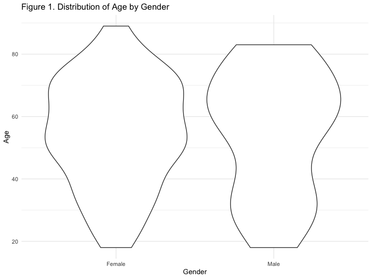

Data Cleaning and Preliminary Analysis
================
Dionna Attinson
2/7/2020

``` r
SurveyData = 
  readxl::read_xls('./SFH_Survey_CODED_CLEANED.xls') %>% 
  janitor::clean_names()
```

    ## New names:
    ## * PSS_8 -> PSS_8...108
    ## * PSS_8 -> PSS_8...109

### Data Cleaning and Recoding

``` r
SurveyData =
 SurveyData %>% 
 rename(Gender = x1_to_which_gender_identity_do_you_most_identify_selected_choice,
        Education = x3_what_is_the_highest_level_of_education_you_have_completed_selected_choice,
        Race = x4_which_best_describes_your_race_ethnicity_check_all_that_apply_selected_choice,
        Income = x7_hand_participant_income_card_which_of_these_groups_on_this_card_is_closest_to_your_total_personal_income_before_taxes_during_the_last_year_please_include_income_from_all_sources_your_salaries_wages_and_any_benefits_including_social_security_welfare_gifts_or_any_other_income_please_do_not_include_food_stamps_or_rental_subsidies_tell_me_the_code_for_the_amount_you_got_last_year_or_the_code_for_the_amount_you_usually_get_per_month_if_necessary_work_with_resident_to_construct_a_monthly_personal_and_household_income)
```

##### In the code chunk below, a number of variables were recoded as binary.

  - `Smoke` was the variable that identified the smoking status of an
    individual. Those who responded that they smoke ANY products
    including marijuana, THC, hash, hookah, E-cigarettes, Cigarettes or
    Cigarillos were coded as `1` = Smoker. Those who responded that they
    did not smoke any products were coded as `0`, Non-smoker.
  - Evidence of mice/rats, cockroaches, and having a mildew odor present
    in the home were all coded as `1` = Yes, `0` = No.

<!-- end list -->

``` r
VariablesofInterest = 
  SurveyData %>% 
  select(age, Gender, Race, pss_5, pss_6, pss_8_108, pss_8_109, pss_10, sf36_1, sf36_4, 
        sf36_6, sf36_14, sf36_15, sf36_18, sf36_19, sf36_22, sf36_26, sf36_27, sf36_28,
        sf36_32, Education, Income, repairs_needed, asthma, anxiety, lungd, depression,
        heartdisease, cancer, diabetes,hypertension, products_used, neg_health_building, 
        micerats, cockroaches, mildew, homesat,buildsat, neighborhoodsat, propmansat) %>% 
  
  rename(Smoke = products_used) %>% 
  rename(Age = age) %>% 
  mutate(Smoke = recode(Smoke, 
                    "Dont smoke" = "0",
                    "Cigarettes and/or Cigarillos (common brands are Marlboro, Black & Mild)" = "1",
                    "Hookah" = "1",
                    "Cigarettes and/or Cigarillos (common brands are Marlboro, Black & Mild) ,Marijuana, hash, THC, grass, pot, or weed" = "1",
                    "Cigarettes and/or Cigarillos (common brands are Marlboro, Black & Mild) ,E-cigarettes (look like regular cigarettes, but are battery-powered),Marijuana, hash, THC, grass, pot, or weed,Hookah" = "1",
                    "E-cigarettes (look like regular cigarettes, but are battery-powered)" = "1",
                   "Marijuana, hash, THC, grass, pot, or weed" = "1"),
        micerats = recode(micerats, 
                          "Yes" = "1", 
                          "No" = "0"),
        cockroaches = recode(cockroaches, 
                             "Yes" = "1", 
                             "No" = "0"),
        mildew = recode(mildew, 
                            "Yes" = "1",
                            "No" = "0"),
        neg_health_building = recode(neg_health_building, 
                                      "Yes" = "1",
                                      "No" = "0"),
        Race = recode(Race,
                      "Hispanic or Latino" = "Hispanic or Latinx",
                      "Other, specify:" = "Other",
                      "Hispanic or Latino,Native American/ Alaskan Native" = "Bi/Multiracial",
                      "Non- Hispanic Black or African American,Asian or Pacific Islander" = "Bi/Multiracial",
                      "Non- Hispanic Black or African American,Hispanic or Latino" = "Bi/Multiracial",
                      "Non-Hispanic White,Non- Hispanic Black or African American,Hispanic or Latino,Native American/ Alaskan Native,Asian or Pacific Islander" = "Bi/Multiracial"))
```

##### The two scales that will be used as the outcome variables include the Shortened Perceived Stress Scale and an adapted SF-36 scale. All of the qualitative responses in the dataset were recoded to correspond with their quantitative equivalent as identified by the authors of each scale.

  - The PSS coding instructions were as follows: code 0 - never, 1 -
    almost never, 2 - sometimes, 3 - fairly often, 4 - very often &
    reverse your scores for questions 4, 5, 7, and 8. On these 4
    questions, change the scores like this: 0 = 4, 1 = 3, 2 = 2, 3 = 1,
    4 = 0.
  - The SF-36 coding instructions include a two step process. The code
    chunk below represents the first step.

<!-- end list -->

``` r
##PSS Scale
CodedData_VariablesofInterest =
  VariablesofInterest %>% 
  mutate(
    pss_5_coded = pss_5,
    pss_6_coded = pss_6,
    pss_8_coded = pss_8_108,
    pss_9_coded = pss_8_109,
    pss_10_coded = pss_10, 
    sf36_1_coded = sf36_1,
    sf36_4_coded = sf36_4,  
    sf36_6_coded = sf36_6,
    sf36_14_coded = sf36_14,  
    sf36_15_coded = sf36_15,  
    sf36_18_coded = sf36_18,
    sf36_19_coded = sf36_19,
    sf36_22_coded = sf36_22,
    sf36_26_coded = sf36_26,
    sf36_27_coded = sf36_27,
    sf36_28_coded = sf36_28,
    sf36_32_coded = sf36_32) %>% 
    
  mutate(pss_5_coded = recode(pss_5_coded, 
                        "Never" = "4",
                        "Almost never" = "3",
                        "Sometimes" = "2", 
                        "Fairly often" = "1",
                        "Very often" = "0"), 
         pss_6_coded = recode(pss_6_coded, 
                        "Never" = "0",
                        "Almost never" = "1",
                        "Sometimes" = "2", 
                        "Fairly often" = "3",
                        "Very often" = "4"),
         pss_8_coded = recode(pss_8_coded, 
                        "Never" = "4",
                        "Almost never" = "3",
                        "Sometimes" = "2", 
                        "Fairly often" = "1",
                        "Very often" = "0"),
         pss_9_coded = recode(pss_9_coded, 
                        "Never" = "0",
                        "Almost never" = "1",
                        "Sometimes" = "2", 
                        "Fairly often" = "3",
                        "Very often" = "4"),
         pss_10_coded = recode(pss_10_coded, 
                        "Never" = "0",
                        "Almost never" = "1",
                        "Sometimes" = "2", 
                        "Fairly often" = "3",
                        "Very often" = "4"),
         sf36_1_coded = recode(sf36_1_coded,
                         "Excellent" = "1",
                         "Very Good" = "2",
                         "Good" = "3",
                         "Fair" = "4",
                         "Poor" = "5"),
         sf36_4_coded = recode(sf36_4_coded, 
                         "Yes, limited a lot" = "1",
                         "Yes, limited a little" = "2",
                         "No, not limited at all" = "3"),
         sf36_6_coded = recode(sf36_6_coded, 
                         "Yes, limited a lot" = "1",
                         "Yes, limited a little" = "2",
                         "No, not limited at all" = "3"),
         sf36_14_coded = recode(sf36_14_coded, 
                         "Yes" = "1",
                         "No" = "2"),
         sf36_15_coded = recode(sf36_15_coded, 
                         "Yes" = "1",
                         "No" = "2"), 
         sf36_18_coded = recode(sf36_18_coded, 
                         "Yes" = "1",
                         "No" = "2"), 
         sf36_19_coded = recode(sf36_19_coded, 
                         "Yes" = "1",
                         "No" = "2"),
         sf36_22_coded = recode(sf36_22_coded,
                         "Not at all" = "1",
                         "A little bit" = "2",
                         "Moderately" = "3",
                         "Quite a bit" = "4",
                         "Extremely" = "5"),
         sf36_26_coded =  recode(sf36_26_coded,
                          "All of the time" = "1",
                          "Most of the time" = "2",
                          "A good bit of the time" = "3",
                          "Some of the time" = "4",
                          "A little of the time" = "5",
                          "None of the time" = "6"),
         sf36_27_coded = recode(sf36_27_coded,
                          "All of the time" = "1",
                          "Most of the time" = "2",
                          "A good bit of the time" = "3",
                          "Some of the time" = "4",
                          "A little of the time" = "5",
                          "None of the time" = "6"),
         sf36_28_coded = recode(sf36_28_coded,
                          "All of the time" = "1",
                          "Most of the time" = "2",
                          "A good bit of the time" = "3",
                          "Some of the time" = "4",
                          "A little of the time" = "5",
                          "None of the time" = "6"),
         sf36_32_coded = recode(sf36_32_coded,
                         "All of the time" = "1",
                         "Most of the time" = "2",
                         "Some of the time" = "3",
                         "A little of the time" = "4",
                         "None of the time" = "5")) 
```

##### The code chunk below now represents the second step of scoring the SF-36. This requires transforming the original scale.

``` r
CodedData_VariablesofInterest = 
  CodedData_VariablesofInterest %>% 
  mutate(
     sf36_1_coded = recode(sf36_1_coded,
                         "1" = "100",
                         "2" = "75",
                         "3" = "50",
                         "4" = "25",
                         "5" = "0"),
        sf36_4_coded = recode(sf36_4_coded, 
                          "1" = "0",
                          "2" = "50",
                          "3" = "100"),
        sf36_6_coded = recode(sf36_6_coded, 
                          "1" = "0",
                          "2" = "50",
                          "3" = "100"),
         sf36_14_coded = recode(sf36_14_coded, 
                         "1" = "0",
                         "2" = "100"),
         sf36_15_coded = recode(sf36_15_coded, 
                         "1" = "0",
                         "2" = "100"),
         sf36_18_coded = recode(sf36_18_coded, 
                         "1" = "0",
                         "2" = "100"), 
         sf36_19_coded = recode(sf36_19_coded, 
                         "1" = "0",
                         "2" = "100"),
         sf36_22_coded = recode(sf36_22_coded,
                         "1" = "100",
                         "2" = "75",
                         "3" = "50",
                         "4" = "25",
                         "5" = "0"),
        sf36_26_coded =  recode(sf36_26_coded,
                          "1" = "100",
                          "2" = "80",
                          "3" = "60",
                          "4" = "40",
                          "5" = "20",
                          "6" = "0"),
         sf36_27_coded = recode(sf36_27_coded,
                          "1" = "100",
                          "2" = "80",
                          "3" = "60",
                          "4" = "40",
                          "5" = "20",
                          "6" = "0"),
         sf36_28_coded = recode(sf36_28_coded,
                          "1" = "0",
                          "2"= "20",
                          "3" = "40",
                          "4" = "60",
                          "5"= "80",
                          "6" = "100"),
         sf36_32_coded = recode(sf36_32_coded,
                         "1" = "0",
                         "2" = "25",
                         "3" = "50",
                         "4" = "75",
                         "5" = "100"))
```

##### Next, I transformed the PSS scale and SF-36 scale to numeric variables so that composite scores could be calculated for each individual.

``` r
CodedData_VariablesofInterest = 
  CodedData_VariablesofInterest %>% 
  mutate(
    sf36_1_coded = as.numeric(sf36_1_coded),
    sf36_4_coded = as.numeric(sf36_4_coded), 
    sf36_6_coded = as.numeric(sf36_6_coded),
    sf36_14_coded = as.numeric(sf36_14_coded),
    sf36_15_coded = as.numeric(sf36_15_coded),
    sf36_18_coded = as.numeric(sf36_18_coded),
    sf36_19_coded = as.numeric(sf36_19_coded),
    sf36_22_coded = as.numeric(sf36_22_coded),
    sf36_26_coded = as.numeric(sf36_26_coded),
    sf36_27_coded = as.numeric(sf36_27_coded),
    sf36_28_coded = as.numeric(sf36_28_coded),
    sf36_32_coded = as.numeric(sf36_32_coded), 
    pss_5_coded =  as.numeric(pss_5_coded),
    pss_6_coded =  as.numeric(pss_6_coded),
    pss_8_coded = as.numeric(pss_8_coded),
    pss_9_coded = as.numeric(pss_9_coded),
    pss_10_coded = as.numeric(pss_10_coded))
```

##### For the SF-36 scale, a total SF-36 score was created from the totals of each participant. This was then divided by 12 to get the composite SF-36 score (mean). This resulted in the variable `composite_sf36_score`. The higher the composite SF-36 score, the better their overall health status.

##### For the PSS scale, a total score was created from the questions which became the variable `total_PSS_score`. I then created stress categories for future categorical analysis:

  - Scores ranging from 0-6 would be considered low stress.
  - Scores ranging from 7-13 ould be considered moderate stress.
  - Scores ranging from 14-20 would be considered high perceived
stress.

##### Further, several other variables were transformed. Age was transformed to a categorical variable, creating the age groups of 18-24, 25-44, 45-64, and 65+. Gender was transformed into a binary variable (0 = male, 1 = female), and a Housing Satisfaction Score was created. A higher score indicates higher overall housing satisfaction. This score was created based off of the totals of four questions:

  - The participant’s satisfaction with their apartment
  - The participant’s satisfcation with their building
  - The participant’s satisfcation with their neighbhorhood
  - The participant’s satisfaction with their property
management

##### Lastly, a binary chronic disease outcome was created. If a participant responded that they or someone in their home have the following conditions, they were coded as `1`:

  - Cancer
  - Heart Disease
  - Diabetes
  - Hypertension
  - Asthma
  - Lung Disease
  - Anxiety
  - Depression

<!-- end list -->

``` r
CodedData_VariablesofInterest = 
CodedData_VariablesofInterest %>% 
  mutate(
    total_sf36_score = sf36_1_coded + sf36_4_coded + sf36_6_coded + sf36_14_coded +
    sf36_15_coded + sf36_18_coded + sf36_19_coded + sf36_22_coded + 
    sf36_26_coded + sf36_27_coded + sf36_28_coded + sf36_32_coded) %>% 
  mutate(composite_sf36_score = total_sf36_score/12) %>% 
  mutate(
    total_PSS_score = pss_5_coded + pss_6_coded + pss_8_coded + pss_9_coded + pss_10_coded,
    PSS_Category = total_PSS_score, 
    PSS_Category = 
          case_when(PSS_Category >= 14 ~ 'High Perceived Stress',
                    PSS_Category >= 7 ~ 'Moderate Stress',
                    PSS_Category >= 0  ~ 'Low Stress'),
    Age_Category = Age,
    Age_Category = 
          case_when(Age_Category >= 65  ~ '65+',
                    Age_Category >= 45  ~ '45-64',
                    Age_Category >= 25 ~ '25-44',
                    Age_Category >= 18 ~ '18-24'),
    Gender_Coded = Gender, 
    Gender_Coded = recode(Gender_Coded, 
                          "Male" = "0",
                          "Female" = "1",
                          `Other, please specify:` = "Null"),
    AptSat_Coded = homesat, 
    AptSat_Coded = recode(AptSat_Coded,
                          "Very Dissatisfied" = "1",
                          "Dissatisfied" = "2", 
                          "Satisfied" = "3",
                          "Very Satisfied" ="4"), 
    BuildingSat_Coded = buildsat, 
    BuildingSat_Coded = recode(BuildingSat_Coded,
                          "Very Dissatisfied" = "1",
                          "Dissatisfied" = "2", 
                          "Satisfied" = "3",
                          "Very Satisfied" ="4"),
    NeighborhoodSat_Coded = neighborhoodsat, 
    NeighborhoodSat_Coded = recode(NeighborhoodSat_Coded,
                          "Very Dissatisfied" = "1",
                          "Dissatisfied" = "2", 
                          "Satisfied" = "3",
                          "Very Satisfied" ="4"),
   PropertyManSat_Coded = propmansat,
   PropertyManSat_Coded = recode(PropertyManSat_Coded,
                          "Very Dissatisfied" = "1",
                          "Dissatisfied" = "2", 
                          "Satisfied" = "3",
                          "Very Satisfied" ="4"),
   AptSat_Coded = as.numeric(AptSat_Coded), 
   BuildingSat_Coded = as.numeric(BuildingSat_Coded),
   NeighborhoodSat_Coded = as.numeric(NeighborhoodSat_Coded),
   PropertyManSat_Coded = as.numeric(PropertyManSat_Coded),
   asthma = as.numeric(asthma),
   heartdisease = as.numeric(heartdisease),
   lungd = as.numeric(lungd),
   anxiety = as.numeric(anxiety),
   depression = as.numeric(depression),
   cancer = as.numeric(cancer),
   hypertension = as.numeric(hypertension),
   diabetes = as.numeric(diabetes),
   Chronic_Disease = asthma + heartdisease + lungd + anxiety + depression + cancer + hypertension + diabetes,
   Chronic_Disease = 
          case_when(Chronic_Disease >= 1 ~ '1',
                    Chronic_Disease == 0 ~ '0'))
```

``` r
CodedData_VariablesofInterest = 
  CodedData_VariablesofInterest %>% 
  mutate(
  PropertyManSat_Coded = replace_na(PropertyManSat_Coded, 0),
  HousingSatisfactionScore = AptSat_Coded + BuildingSat_Coded + NeighborhoodSat_Coded +
  PropertyManSat_Coded,
  Satisfaction_Category = HousingSatisfactionScore,
  Satisfaction_Category = 
          case_when(Satisfaction_Category >= 13 ~ 'High Satisfaction',
                    Satisfaction_Category >= 7 ~ 'Moderate Satisfaction',
                    Satisfaction_Category >= 4  ~ 'Low Satisfaction'))
```

##### Below, I changed variables into factors and numeric values.

``` r
CodedData_VariablesofInterest = 
  CodedData_VariablesofInterest %>% 
  mutate(
    Education = as.factor(Education),
    Gender_Coded = factor(Gender_Coded, levels = c("0","1")),
    Race = as.factor(Race),
    Age = as.numeric(Age),
    Income = as.numeric(Income),
    Smoke = factor(Smoke, levels = c("0", "1")),
    asthma = factor(asthma, levels = c("0","1")),
    lungd = factor(lungd, levels = c("0","1")),
    heartdisease = factor(heartdisease, levels = c("0","1")),
    anxiety = factor(anxiety, levels = c("0","1")),
    depression = factor(depression, levels = c("0","1")),
    cancer = factor(cancer,levels = c("0","1")),
    diabetes = factor(diabetes,levels = c("0","1")),
    micerats = factor(micerats,levels = c("0","1")),
    mildew = factor(mildew,levels = c("0","1")),
    cockroaches = factor(cockroaches,levels = c("0","1")),
    Chronic_Disease = factor(Chronic_Disease,levels = c("0","1"))
  )
```

### Univariable/Descriptive Analyses

##### The tables below provide descriptive analyses of the independent and dependent variables.

#### Outcome Variables

##### Perceived Stress Score

``` r
CodedData_VariablesofInterest %>% 
  group_by(PSS_Category) %>% 
  summarize(n=n()) %>%
   mutate(
  percent = n/124*100) %>% 
  knitr::kable(col.names=c("Perceived Stress Score", "n", "Percent(%)"), digits = 2)
```

| Perceived Stress Score |  n | Percent(%) |
| :--------------------- | -: | ---------: |
| High Perceived Stress  | 11 |       8.87 |
| Low Stress             | 54 |      43.55 |
| Moderate Stress        | 55 |      44.35 |
| NA                     |  4 |       3.23 |

##### Overall Health Status

``` r
CodedData_VariablesofInterest %>% 
  select(composite_sf36_score) %>% 
  summary() %>% 
  knitr::kable(col.names = c("Summary of Overall Health Score"))
```

|  | Summary of Overall Health Score |
|  | :------------------------------ |
|  | Min. : 1.667                    |
|  | 1st Qu.: 45.208                 |
|  | Median : 62.917                 |
|  | Mean : 63.394                   |
|  | 3rd Qu.: 88.958                 |
|  | Max. :100.000                   |
|  | NA’s :1                         |

``` r
CodedData_VariablesofInterest %>% 
  drop_na() %>% 
  group_by(composite_sf36_score) %>% 
  summarize(n = n()) %>% 
    ggplot(aes(x= composite_sf36_score)) +   geom_density() + 
  geom_vline(aes(xintercept = mean(composite_sf36_score)), 
             linetype = "dashed", size = 0.6,
             color = "#FC4E07")
```


#### Independent Variables

``` r
CodedData_VariablesofInterest %>% 
  group_by(Smoke) %>% 
  summarize(n=n()) %>% 
  mutate(
    percent = n/124*100) %>% 
  mutate(
    Smoke = recode(Smoke,
                   "0" = "Non-smoker(s)",
                   "1" = "Smoker(s)")) %>% 
  knitr::kable(col.names=c("Smoking Status", "n", "Percent(%)"), digits = 2)
```

| Smoking Status |  n | Percent(%) |
| :------------- | -: | ---------: |
| Non-smoker(s)  | 97 |      78.23 |
| Smoker(s)      | 27 |      21.77 |

``` r
CodedData_VariablesofInterest %>% 
  group_by(Race) %>% 
  summarize(n=n()) %>%
   mutate(
  percent = n/124*100) %>% 
  mutate(
    Race = recode(Race,
                  "Other, specify:" = "Other")
  ) %>% 
  knitr::kable(col.names=c("Race/Ethnicity", "n", "Percent(%)"), digits = 2)
```

| Race/Ethnicity                          |  n | Percent(%) |
| :-------------------------------------- | -: | ---------: |
| Bi/Multiracial                          |  5 |       4.03 |
| Hispanic or Latinx                      | 87 |      70.16 |
| Non- Hispanic Black or African American | 26 |      20.97 |
| Other                                   |  6 |       4.84 |

``` r
CodedData_VariablesofInterest %>% 
  group_by(Age_Category) %>% 
  summarize(n=n()) %>%
  mutate(
  percent = n/124*100) %>% 
  knitr::kable(col.names=c("Age Group", "n", "Percent(%)"), digits = 2)
```

| Age Group |  n | Percent(%) |
| :-------- | -: | ---------: |
| 18-24     |  7 |       5.65 |
| 25-44     | 25 |      20.16 |
| 45-64     | 47 |      37.90 |
| 65+       | 43 |      34.68 |
| NA        |  2 |       1.61 |

``` r
CodedData_VariablesofInterest %>% 
  drop_na() %>% 
  group_by(Age, Gender) %>% 
  ggplot(aes(x=Gender, y=Age)) + geom_violin() +
  labs(x = "Gender",
      y = "Age",
      title = "Figure 1. Distribution of Age by Gender")
```


``` r
CodedData_VariablesofInterest %>% 
  group_by(Gender) %>% 
  summarize(n=n()) %>%
  mutate(
  percent = n/124*100) %>% 
  knitr::kable(col.names=c("Gender", "n", "Percent(%)"), digits = 2)
```

| Gender                 |  n | Percent(%) |
| :--------------------- | -: | ---------: |
| Female                 | 97 |      78.23 |
| Male                   | 26 |      20.97 |
| Other, please specify: |  1 |       0.81 |

``` r
CodedData_VariablesofInterest %>% 
  drop_na() %>% 
  select(Gender, Age) %>% 
  group_by(Gender) %>% 
  summarize(Mean = mean(Age)) %>% 
  knitr::kable(col.names=c("Age Group", "Mean Age"), digits = 2)
```

| Age Group | Mean Age |
| :-------- | -------: |
| Female    |    54.76 |
| Male      |    54.75 |

``` r
CodedData_VariablesofInterest %>% 
  group_by(Income) %>% 
  summarize(n=n()) %>%
  mutate(
  percent = n/124*100) %>% 
  knitr::kable(col.names=c("Income Category", "n", "Percent(%)"), digits = 2)
```

| Income Category |  n | Percent(%) |
| --------------: | -: | ---------: |
|               1 | 16 |      12.90 |
|               2 |  9 |       7.26 |
|               3 | 28 |      22.58 |
|               4 | 24 |      19.35 |
|               5 | 29 |      23.39 |
|               6 |  3 |       2.42 |
|               7 |  5 |       4.03 |
|               8 |  3 |       2.42 |
|               9 |  2 |       1.61 |
|              10 |  2 |       1.61 |
|              NA |  3 |       2.42 |

``` r
CodedData_VariablesofInterest %>% 
  group_by(Education) %>% 
  summarize(n=n()) %>%
  mutate(
  percent = n/124*100) %>% 
  knitr::kable(col.names=c("Education Completed", "n", "Percent(%)"), digits = 2)
```

| Education Completed                  |  n | Percent(%) |
| :----------------------------------- | -: | ---------: |
| 2 Year Community College Degree      |  7 |       5.65 |
| 4 Year College Degree                |  6 |       4.84 |
| G.E.D.                               |  5 |       4.03 |
| High School/Secondary School Diploma | 41 |      33.06 |
| Less than High School                | 53 |      42.74 |
| Other, please specify:               |  4 |       3.23 |
| Post-Graduate Degree                 |  3 |       2.42 |
| Some College                         |  2 |       1.61 |
| Vocational School                    |  3 |       2.42 |

### 2x2 Tables and Visualizations

``` r
CodedData_VariablesofInterest %>% 
  group_by(Age_Category, Gender) %>% 
  summarize(n=n()) %>%
  pivot_wider(
    names_from = Gender,
    values_from = n) %>% 
  knitr::kable(col.names = c("Age Group","Female (n)", "Male (n)", "Other (n)"))
```

| Age Group | Female (n) | Male (n) | Other (n) |
| :-------- | ---------: | -------: | --------: |
| 18-24     |          5 |        2 |        NA |
| 25-44     |         19 |        6 |        NA |
| 45-64     |         38 |        8 |         1 |
| 65+       |         33 |       10 |        NA |
| NA        |          2 |       NA |        NA |

``` r
CodedData_VariablesofInterest %>% 
  drop_na() %>% 
  select(Income, Age_Category) %>% 
  group_by(Age_Category) %>% 
  summarize(Mean = mean(Income)) %>% 
  knitr::kable(col.names=c("Age Group", "Mean Income"),digits = 2)
```

| Age Group | Mean Income |
| :-------- | ----------: |
| 18-24     |        5.00 |
| 25-44     |        3.96 |
| 45-64     |        3.91 |
| 65+       |        3.87 |

``` r
CodedData_VariablesofInterest %>% 
  ggplot(aes(x=Age_Category, fill = Gender)) + geom_bar() +
  labs(x = "Age Group",
      y = "Count",
      color = "Gender",
      title = "Figure 2. Age Group by Gender")
```


``` r
CodedData_VariablesofInterest %>%
  drop_na() %>% 
  group_by(Age_Category, Race) %>% 
  summarize(n=n()) %>%
  pivot_wider(
    names_from = Race,
    values_from = n
  ) %>% 
  knitr::kable(col.names = c("Age Group", "Hispanic or Latinx (n)", "Non-Hispanic Black or African American (n)", "Bi/Multiracial (n)", "Other (n)"))
```

| Age Group | Hispanic or Latinx (n) | Non-Hispanic Black or African American (n) | Bi/Multiracial (n) | Other (n) |
| :-------- | ---------------------: | -----------------------------------------: | -----------------: | --------: |
| 18-24     |                      5 |                                          2 |                 NA |        NA |
| 25-44     |                     14 |                                          7 |                  3 |         1 |
| 45-64     |                     27 |                                         11 |                  1 |         5 |
| 65+       |                     33 |                                          4 |                  1 |        NA |

``` r
CodedData_VariablesofInterest %>% 
  group_by(Age_Category, Race) %>% 
  ggplot(aes(x= Age_Category, fill = Race)) + geom_bar() +
  labs(x = "Age Group",
      y = "Count",
      color = "Race/Ethnicity",
      title = "Figure 3. Age by Race/Ethnicity")
```


``` r
CodedData_VariablesofInterest %>%
  group_by(Race, Smoke) %>% 
  summarize(n=n()) %>%
  mutate(
    Smoke = recode(Smoke,
                   "0" = "Non-smoker(s)",
                   "1" = "Smoker(s)")) %>% 
  pivot_wider(
    names_from = Race,
    values_from = n) %>% 
  knitr::kable(col.names = c("Smoking Status", "Bi/Multiracial (n)", "Hispanic or Latinx (n)", "Black or African American (n)", "Other (n)"))
```

| Smoking Status | Bi/Multiracial (n) | Hispanic or Latinx (n) | Black or African American (n) | Other (n) |
| :------------- | -----------------: | ---------------------: | ----------------------------: | --------: |
| Non-smoker(s)  |                  3 |                     71 |                            20 |         3 |
| Smoker(s)      |                  2 |                     16 |                             6 |         3 |

``` r
CodedData_VariablesofInterest %>%
  group_by(Age_Category, Smoke) %>% 
  drop_na() %>% 
  summarize(n=n()) %>%
  mutate(
    Smoke = recode(Smoke,
                   "0" = "Non-smoker(s)",
                   "1" = "Smoker(s)")) %>% 
  pivot_wider(
    names_from = Age_Category,
    values_from = n) %>% 
  knitr::kable(col.names = c("Smoking Status", "18-24 (n)", "25-44 (n)", "45-64 (n)", "65+ (n)"))
```

| Smoking Status | 18-24 (n) | 25-44 (n) | 45-64 (n) | 65+ (n) |
| :------------- | --------: | --------: | --------: | ------: |
| Non-smoker(s)  |         6 |        16 |        34 |      33 |
| Smoker(s)      |         1 |         9 |        10 |       5 |

``` r
CodedData_VariablesofInterest %>% 
  mutate(
    Smoke = recode(Smoke,
                   "0" = "Non-smoker(s)",
                   "1" = "Smoker(s)")
  ) %>% 
ggplot(aes(x=Smoke, y=Age)) + 
  geom_boxplot(outlier.shape=NA) + #avoid plotting outliers twice
  geom_jitter(position=position_jitter(width=.1, height=0)) + 
  labs(x = "Smoking Status",
      y = "Age",
      title = "Figure 4. Distribution of Age by Smoking Status")
```


``` r
CodedData_VariablesofInterest %>% 
  group_by(Age_Category, Education) %>% 
  drop_na() %>% 
  ggplot(aes(x= Age_Category, fill = Education)) + geom_bar() + coord_flip() +
  labs(x = "Age Group",
      y = "Count",
      color = "Education",
      title = "Figure 5. Education by Age Group") +
theme(legend.position = "bottom")
```


### Exploratory Analyses of Relationships between Variables

``` r
#Part 1
CodedData_VariablesofInterest %>%  
  group_by(total_PSS_score, composite_sf36_score, Age_Category) %>%
  summarize(n=n()) %>% 
  ggplot(aes(x = total_PSS_score, y = composite_sf36_score,  color = Age_Category)) +
  geom_point(size = 1.5, alpha = 0.8) +
  geom_smooth(method =lm, color = "black", linetype = 1) +
  labs(
      x = "Perceived Stress Score",
      y = "Overall Health Score",
      color = "Age",
      title = "Figure 6. Relationship between Perceived Stress and Health Status") +
      theme(legend.position = "right") 
```



``` r
#Part 2
CodedData_VariablesofInterest %>%  
  group_by(HousingSatisfactionScore, composite_sf36_score, Age_Category) %>%
  summarize(n=n()) %>% 
  ggplot(aes(x = HousingSatisfactionScore, y = composite_sf36_score,  color = Age_Category)) +
  geom_point(size = 1, alpha = 0.5) +
  geom_smooth(method =lm, color = "black", linetype = 1) +
  labs(
      x = "Housing Satisfaction Score",
      y = "Overall Health Score",
      color = "Age",
      title = "Figure 7. Relationship between Housing Satisfaction and Health Status") +
      theme(legend.position = "right")
```


``` r
#Part 3
CodedData_VariablesofInterest %>%  
  group_by(HousingSatisfactionScore, total_PSS_score, Age_Category) %>%
  summarize(n=n()) %>% 
  ggplot(aes(x = HousingSatisfactionScore, y = total_PSS_score,  color = Age_Category)) +
  geom_point(size = 1.5, alpha = 0.8) +
  geom_smooth(method =lm, color = "black", linetype = 1) +
  labs(
      x = "Housing Satisfaction Score",
      y = "Perceived Stress Score",
      color = "Age",
      title = "Figure 8. Relationship between Housing Satisfaction and Perceived Stress") +
      theme(legend.position = "right")
```


### Initial bivariate analyses

##### Bivariate model 1 : composite\_sf36\_score ~ b\_0 + b\_1 total\_PSS\_score\_i

``` r
bivariate1 = lm(composite_sf36_score ~ total_PSS_score, data = CodedData_VariablesofInterest)
summary(bivariate1) 
```

    ## 
    ## Call:
    ## lm(formula = composite_sf36_score ~ total_PSS_score, data = CodedData_VariablesofInterest)
    ## 
    ## Residuals:
    ##     Min      1Q  Median      3Q     Max 
    ## -52.225 -14.892   2.345  17.752  45.795 
    ## 
    ## Coefficients:
    ##                 Estimate Std. Error t value Pr(>|t|)    
    ## (Intercept)      88.1490     3.8970  22.620  < 2e-16 ***
    ## total_PSS_score  -3.3462     0.4593  -7.286 3.92e-11 ***
    ## ---
    ## Signif. codes:  0 '***' 0.001 '**' 0.01 '*' 0.05 '.' 0.1 ' ' 1
    ## 
    ## Residual standard error: 22.25 on 118 degrees of freedom
    ##   (4 observations deleted due to missingness)
    ## Multiple R-squared:  0.3103, Adjusted R-squared:  0.3044 
    ## F-statistic: 53.08 on 1 and 118 DF,  p-value: 3.924e-11

``` r
bivariate1 %>% 
  broom::tidy() %>% 
  mutate(
         High_CI = exp(estimate + 1.96*std.error),
         Low_CI = exp(estimate - 1.96*std.error)) %>% 
  select(term, estimate, p.value, Low_CI, High_CI) %>% 
  knitr::kable(digits = 3)
```

| term              | estimate | p.value |      Low\_CI |     High\_CI |
| :---------------- | -------: | ------: | -----------: | -----------: |
| (Intercept)       |   88.149 |       0 | 9.234996e+34 | 3.979489e+41 |
| total\_PSS\_score |  \-3.346 |       0 | 1.400000e-02 | 8.700000e-02 |

##### Bivariate model 2 : composite\_sf36\_score ~ b\_0 + b\_1 Age\_i

``` r
bivariate2 = lm(composite_sf36_score ~ Age, data = CodedData_VariablesofInterest)
summary(bivariate2)
```

    ## 
    ## Call:
    ## lm(formula = composite_sf36_score ~ Age, data = CodedData_VariablesofInterest)
    ## 
    ## Residuals:
    ##     Min      1Q  Median      3Q     Max 
    ## -68.622 -17.200   1.028  20.986  43.485 
    ## 
    ## Coefficients:
    ##             Estimate Std. Error t value Pr(>|t|)    
    ## (Intercept)  86.5376     7.6771  11.272  < 2e-16 ***
    ## Age          -0.4289     0.1321  -3.246  0.00152 ** 
    ## ---
    ## Signif. codes:  0 '***' 0.001 '**' 0.01 '*' 0.05 '.' 0.1 ' ' 1
    ## 
    ## Residual standard error: 25.61 on 118 degrees of freedom
    ##   (4 observations deleted due to missingness)
    ## Multiple R-squared:  0.08197,    Adjusted R-squared:  0.07419 
    ## F-statistic: 10.54 on 1 and 118 DF,  p-value: 0.001524

``` r
bivariate2 %>% 
  broom::tidy() %>% 
  mutate(
         High_CI = exp(estimate + 1.96*std.error),
         Low_CI = exp(estimate - 1.96*std.error)) %>% 
  select(term, estimate, p.value, Low_CI, High_CI) %>% 
  knitr::kable(digits = 3)
```

| term        | estimate | p.value |      Low\_CI |     High\_CI |
| :---------- | -------: | ------: | -----------: | -----------: |
| (Intercept) |   86.538 |   0.000 | 1.116709e+31 | 1.311141e+44 |
| Age         |  \-0.429 |   0.002 | 5.030000e-01 | 8.440000e-01 |

##### Bivariate model 3 : composite\_sf36\_score ~ b\_0 + b\_1 Race\_i

``` r
bivariate3 = lm(composite_sf36_score ~ Race, data = CodedData_VariablesofInterest)
summary(bivariate3)
```

    ## 
    ## Call:
    ## lm(formula = composite_sf36_score ~ Race, data = CodedData_VariablesofInterest)
    ## 
    ## Residuals:
    ##     Min      1Q  Median      3Q     Max 
    ## -61.846 -18.304  -0.596  25.862  36.487 
    ## 
    ## Coefficients:
    ##                                             Estimate Std. Error t value
    ## (Intercept)                                  64.0000    12.0291   5.320
    ## RaceHispanic or Latinx                       -0.4874    12.3738  -0.039
    ## RaceNon- Hispanic Black or African American  -1.4038    13.1349  -0.107
    ## RaceOther                                     0.6528    16.2874   0.040
    ##                                             Pr(>|t|)    
    ## (Intercept)                                 4.93e-07 ***
    ## RaceHispanic or Latinx                         0.969    
    ## RaceNon- Hispanic Black or African American    0.915    
    ## RaceOther                                      0.968    
    ## ---
    ## Signif. codes:  0 '***' 0.001 '**' 0.01 '*' 0.05 '.' 0.1 ' ' 1
    ## 
    ## Residual standard error: 26.9 on 119 degrees of freedom
    ##   (1 observation deleted due to missingness)
    ## Multiple R-squared:  0.0003379,  Adjusted R-squared:  -0.02486 
    ## F-statistic: 0.01341 on 3 and 119 DF,  p-value: 0.9979

``` r
bivariate3 %>% 
  broom::tidy() %>% 
  mutate(
         High_CI = exp(estimate + 1.96*std.error),
         Low_CI = exp(estimate - 1.96*std.error)) %>% 
  select(term, estimate, p.value, Low_CI, High_CI) %>% 
  knitr::kable(digits = 3)
```

| term                                        | estimate | p.value |      Low\_CI |     High\_CI |
| :------------------------------------------ | -------: | ------: | -----------: | -----------: |
| (Intercept)                                 |   64.000 |   0.000 | 3.593409e+17 | 1.081900e+38 |
| RaceHispanic or Latinx                      |  \-0.487 |   0.969 | 0.000000e+00 | 2.094662e+10 |
| RaceNon- Hispanic Black or African American |  \-1.404 |   0.915 | 0.000000e+00 | 3.723437e+10 |
| RaceOther                                   |    0.653 |   0.968 | 0.000000e+00 | 1.404850e+14 |

##### Bivariate model 4 : composite\_sf36\_score ~ b\_0 + b\_1 Income\_i

``` r
bivariate4 = lm(composite_sf36_score ~ Income, data = CodedData_VariablesofInterest)
summary(bivariate4)
```

    ## 
    ## Call:
    ## lm(formula = composite_sf36_score ~ Income, data = CodedData_VariablesofInterest)
    ## 
    ## Residuals:
    ##     Min      1Q  Median      3Q     Max 
    ## -60.881 -18.872   2.036  23.379  41.378 
    ## 
    ## Coefficients:
    ##             Estimate Std. Error t value Pr(>|t|)    
    ## (Intercept)   53.030      5.295   10.02   <2e-16 ***
    ## Income         2.796      1.205    2.32   0.0221 *  
    ## ---
    ## Signif. codes:  0 '***' 0.001 '**' 0.01 '*' 0.05 '.' 0.1 ' ' 1
    ## 
    ## Residual standard error: 25.83 on 118 degrees of freedom
    ##   (4 observations deleted due to missingness)
    ## Multiple R-squared:  0.04363,    Adjusted R-squared:  0.03552 
    ## F-statistic: 5.383 on 1 and 118 DF,  p-value: 0.02205

``` r
bivariate4 %>% 
  broom::tidy() %>% 
  mutate(
         High_CI = exp(estimate + 1.96*std.error),
         Low_CI = exp(estimate - 1.96*std.error)) %>% 
  select(term, estimate, p.value, Low_CI, High_CI) %>% 
  knitr::kable(digits = 3)
```

| term        | estimate | p.value |      Low\_CI |     High\_CI |
| :---------- | -------: | ------: | -----------: | -----------: |
| (Intercept) |   53.030 |   0.000 | 3.339904e+18 | 3.445847e+27 |
| Income      |    2.796 |   0.022 | 1.543000e+00 | 1.738590e+02 |

##### Bivariate model 5 : composite\_sf36\_score ~ b\_0 + b\_1 Smoke\_i

``` r
bivariate5 = lm(composite_sf36_score ~ Smoke, data = CodedData_VariablesofInterest)
summary(bivariate5)
```

    ## 
    ## Call:
    ## lm(formula = composite_sf36_score ~ Smoke, data = CodedData_VariablesofInterest)
    ## 
    ## Residuals:
    ##     Min      1Q  Median      3Q     Max 
    ## -58.642 -18.845  -1.345  26.155  39.691 
    ## 
    ## Coefficients:
    ##             Estimate Std. Error t value Pr(>|t|)    
    ## (Intercept)   64.262      2.718  23.646   <2e-16 ***
    ## Smoke1        -3.954      5.801  -0.682    0.497    
    ## ---
    ## Signif. codes:  0 '***' 0.001 '**' 0.01 '*' 0.05 '.' 0.1 ' ' 1
    ## 
    ## Residual standard error: 26.63 on 121 degrees of freedom
    ##   (1 observation deleted due to missingness)
    ## Multiple R-squared:  0.003824,   Adjusted R-squared:  -0.004408 
    ## F-statistic: 0.4645 on 1 and 121 DF,  p-value: 0.4968

``` r
bivariate5 %>% 
  broom::tidy() %>% 
  mutate(
         High_CI = exp(estimate + 1.96*std.error),
         Low_CI = exp(estimate - 1.96*std.error)) %>% 
  select(term, estimate, p.value, Low_CI, High_CI) %>% 
  knitr::kable(digits = 3)
```

| term        | estimate | p.value |      Low\_CI |     High\_CI |
| :---------- | -------: | ------: | -----------: | -----------: |
| (Intercept) |   64.262 |   0.000 | 3.938555e+25 | 1.667477e+30 |
| Smoke1      |  \-3.954 |   0.497 | 0.000000e+00 | 1.661852e+03 |

##### Bivariate model 6 : composite\_sf36\_score ~ b\_0 + b\_1 ChronicDisease\_i

``` r
bivariate6 = lm(composite_sf36_score ~ Chronic_Disease, data = CodedData_VariablesofInterest)
summary(bivariate6)
```

    ## 
    ## Call:
    ## lm(formula = composite_sf36_score ~ Chronic_Disease, data = CodedData_VariablesofInterest)
    ## 
    ## Residuals:
    ##     Min      1Q  Median      3Q     Max 
    ## -56.775 -16.775   1.141  18.997  41.558 
    ## 
    ## Coefficients:
    ##                  Estimate Std. Error t value Pr(>|t|)    
    ## (Intercept)        81.003      4.804  16.861  < 2e-16 ***
    ## Chronic_Disease1  -22.561      5.438  -4.149 6.24e-05 ***
    ## ---
    ## Signif. codes:  0 '***' 0.001 '**' 0.01 '*' 0.05 '.' 0.1 ' ' 1
    ## 
    ## Residual standard error: 24.96 on 121 degrees of freedom
    ##   (1 observation deleted due to missingness)
    ## Multiple R-squared:  0.1245, Adjusted R-squared:  0.1173 
    ## F-statistic: 17.21 on 1 and 121 DF,  p-value: 6.238e-05

``` r
bivariate6 %>% 
  broom::tidy() %>% 
  mutate(
         High_CI = exp(estimate + 1.96*std.error),
         Low_CI = exp(estimate - 1.96*std.error)) %>% 
  select(term, estimate, p.value, Low_CI, High_CI) %>% 
  knitr::kable(digits = 3)
```

| term              | estimate | p.value |      Low\_CI |     High\_CI |
| :---------------- | -------: | ------: | -----------: | -----------: |
| (Intercept)       |   81.003 |       0 | 1.230046e+31 | 1.855519e+39 |
| Chronic\_Disease1 | \-22.561 |       0 | 0.000000e+00 | 0.000000e+00 |

##### Bivariate model 7 : composite\_sf36\_score ~ b\_0 + b\_1 TotalSatisfactionScore\_i

``` r
bivariate7 = lm(composite_sf36_score ~ HousingSatisfactionScore, data = CodedData_VariablesofInterest)
summary(bivariate7)
```

    ## 
    ## Call:
    ## lm(formula = composite_sf36_score ~ HousingSatisfactionScore, 
    ##     data = CodedData_VariablesofInterest)
    ## 
    ## Residuals:
    ##     Min      1Q  Median      3Q     Max 
    ## -55.101 -20.251  -1.139  25.528  39.599 
    ## 
    ## Coefficients:
    ##                          Estimate Std. Error t value Pr(>|t|)    
    ## (Intercept)               46.8490     9.2444   5.068 1.46e-06 ***
    ## HousingSatisfactionScore   1.5642     0.8447   1.852   0.0665 .  
    ## ---
    ## Signif. codes:  0 '***' 0.001 '**' 0.01 '*' 0.05 '.' 0.1 ' ' 1
    ## 
    ## Residual standard error: 26.31 on 121 degrees of freedom
    ##   (1 observation deleted due to missingness)
    ## Multiple R-squared:  0.02756,    Adjusted R-squared:  0.01952 
    ## F-statistic: 3.429 on 1 and 121 DF,  p-value: 0.06649

``` r
bivariate7 %>% 
  broom::tidy() %>% 
  mutate(
         High_CI = exp(estimate + 1.96*std.error),
         Low_CI = exp(estimate - 1.96*std.error)) %>% 
  select(term, estimate, p.value, Low_CI, High_CI) %>% 
  knitr::kable(digits = 3)
```

| term                     | estimate | p.value |      Low\_CI |     High\_CI |
| :----------------------- | -------: | ------: | -----------: | -----------: |
| (Intercept)              |   46.849 |   0.000 | 3.001251e+12 | 1.641372e+28 |
| HousingSatisfactionScore |    1.564 |   0.066 | 9.130000e-01 | 2.502500e+01 |

##### Bivariate model 8 : total\_PSS\_score ~ b\_0 + b\_1 TotalSatisfactionScore\_i

``` r
bivariate8 = lm(total_PSS_score ~ HousingSatisfactionScore, data = CodedData_VariablesofInterest)
summary(bivariate8)
```

    ## 
    ## Call:
    ## lm(formula = total_PSS_score ~ HousingSatisfactionScore, data = CodedData_VariablesofInterest)
    ## 
    ## Residuals:
    ##     Min      1Q  Median      3Q     Max 
    ## -8.0324 -3.2948 -0.1781  2.8484 10.3848 
    ## 
    ## Coefficients:
    ##                          Estimate Std. Error t value Pr(>|t|)    
    ## (Intercept)               11.7410     1.5261   7.693 4.78e-12 ***
    ## HousingSatisfactionScore  -0.4272     0.1400  -3.051  0.00282 ** 
    ## ---
    ## Signif. codes:  0 '***' 0.001 '**' 0.01 '*' 0.05 '.' 0.1 ' ' 1
    ## 
    ## Residual standard error: 4.293 on 118 degrees of freedom
    ##   (4 observations deleted due to missingness)
    ## Multiple R-squared:  0.0731, Adjusted R-squared:  0.06524 
    ## F-statistic: 9.306 on 1 and 118 DF,  p-value: 0.002821

``` r
bivariate8 %>% 
  broom::tidy() %>% 
  mutate(
         High_CI = exp(estimate + 1.96*std.error),
         Low_CI = exp(estimate - 1.96*std.error)) %>% 
  select(term, estimate, p.value, Low_CI, High_CI) %>% 
  knitr::kable(digits = 3)
```

| term                     | estimate | p.value |  Low\_CI |    High\_CI |
| :----------------------- | -------: | ------: | -------: | ----------: |
| (Intercept)              |   11.741 |   0.000 | 6309.730 | 2500923.201 |
| HousingSatisfactionScore |  \-0.427 |   0.003 |    0.496 |       0.858 |

##### Bivariate model 9 : total\_PSS\_score ~ b\_0 + b\_1 Smoke\_i

``` r
bivariate9 = lm(total_PSS_score ~ Smoke, data = CodedData_VariablesofInterest)
summary(bivariate9)
```

    ## 
    ## Call:
    ## lm(formula = total_PSS_score ~ Smoke, data = CodedData_VariablesofInterest)
    ## 
    ## Residuals:
    ##     Min      1Q  Median      3Q     Max 
    ## -7.2581 -3.2581 -0.2216  2.7419 10.7419 
    ## 
    ## Coefficients:
    ##             Estimate Std. Error t value Pr(>|t|)    
    ## (Intercept)  7.25806    0.46235  15.698   <2e-16 ***
    ## Smoke1      -0.07288    0.97472  -0.075    0.941    
    ## ---
    ## Signif. codes:  0 '***' 0.001 '**' 0.01 '*' 0.05 '.' 0.1 ' ' 1
    ## 
    ## Residual standard error: 4.459 on 118 degrees of freedom
    ##   (4 observations deleted due to missingness)
    ## Multiple R-squared:  4.737e-05,  Adjusted R-squared:  -0.008427 
    ## F-statistic: 0.00559 on 1 and 118 DF,  p-value: 0.9405

``` r
bivariate9 %>% 
  broom::tidy() %>% 
  mutate(
         High_CI = exp(estimate + 1.96*std.error),
         Low_CI = exp(estimate - 1.96*std.error)) %>% 
  select(term, estimate, p.value, Low_CI, High_CI) %>% 
  knitr::kable(digits = 3)
```

| term        | estimate | p.value | Low\_CI | High\_CI |
| :---------- | -------: | ------: | ------: | -------: |
| (Intercept) |    7.258 |   0.000 | 573.558 | 3513.155 |
| Smoke1      |  \-0.073 |   0.941 |   0.138 |    6.281 |

##### Bivariate model 10 : total\_PSS\_score ~ b\_0 + b\_1 ChronicDisease\_i

``` r
bivariate10 = lm(total_PSS_score ~ Chronic_Disease, data = CodedData_VariablesofInterest)
summary(bivariate10)
```

    ## 
    ## Call:
    ## lm(formula = total_PSS_score ~ Chronic_Disease, data = CodedData_VariablesofInterest)
    ## 
    ## Residuals:
    ##     Min      1Q  Median      3Q     Max 
    ## -7.9681 -2.9681  0.0319  3.0319 10.0319 
    ## 
    ## Coefficients:
    ##                  Estimate Std. Error t value Pr(>|t|)    
    ## (Intercept)        4.6154     0.8307   5.556 1.73e-07 ***
    ## Chronic_Disease1   3.3527     0.9386   3.572 0.000514 ***
    ## ---
    ## Signif. codes:  0 '***' 0.001 '**' 0.01 '*' 0.05 '.' 0.1 ' ' 1
    ## 
    ## Residual standard error: 4.236 on 118 degrees of freedom
    ##   (4 observations deleted due to missingness)
    ## Multiple R-squared:  0.09758,    Adjusted R-squared:  0.08994 
    ## F-statistic: 12.76 on 1 and 118 DF,  p-value: 0.0005136

``` r
bivariate10 %>% 
  broom::tidy() %>% 
  mutate(
         High_CI = exp(estimate + 1.96*std.error),
         Low_CI = exp(estimate - 1.96*std.error)) %>% 
  select(term, estimate, p.value, Low_CI, High_CI) %>% 
  knitr::kable(digits = 3)
```

| term              | estimate | p.value | Low\_CI | High\_CI |
| :---------------- | -------: | ------: | ------: | -------: |
| (Intercept)       |    4.615 |   0.000 |  19.831 |  514.675 |
| Chronic\_Disease1 |    3.353 |   0.001 |   4.541 |  179.880 |

##### Bivariate model 11 : total\_PSS\_score ~ b\_0 + b\_1 Income\_i

``` r
bivariate11 = lm(total_PSS_score ~ Income, data = CodedData_VariablesofInterest)
summary(bivariate11)
```

    ## 
    ## Call:
    ## lm(formula = total_PSS_score ~ Income, data = CodedData_VariablesofInterest)
    ## 
    ## Residuals:
    ##     Min      1Q  Median      3Q     Max 
    ## -7.8041 -2.8041 -0.0792  2.6943 10.9208 
    ## 
    ## Coefficients:
    ##             Estimate Std. Error t value Pr(>|t|)    
    ## (Intercept)   7.9853     0.9131   8.746 2.03e-14 ***
    ## Income       -0.1812     0.2072  -0.874    0.384    
    ## ---
    ## Signif. codes:  0 '***' 0.001 '**' 0.01 '*' 0.05 '.' 0.1 ' ' 1
    ## 
    ## Residual standard error: 4.438 on 116 degrees of freedom
    ##   (6 observations deleted due to missingness)
    ## Multiple R-squared:  0.006549,   Adjusted R-squared:  -0.002015 
    ## F-statistic: 0.7647 on 1 and 116 DF,  p-value: 0.3837

``` r
bivariate11 %>% 
  broom::tidy() %>% 
  mutate(
         High_CI = exp(estimate + 1.96*std.error),
         Low_CI = exp(estimate - 1.96*std.error)) %>% 
  select(term, estimate, p.value, Low_CI, High_CI) %>% 
  knitr::kable(digits = 3)
```

| term        | estimate | p.value | Low\_CI |  High\_CI |
| :---------- | -------: | ------: | ------: | --------: |
| (Intercept) |    7.985 |   0.000 | 490.618 | 17586.983 |
| Income      |  \-0.181 |   0.384 |   0.556 |     1.252 |

##### Bivariate model 12 : total\_PSS\_score ~ b\_0 + b\_1 Race\_i

``` r
bivariate12 = lm(total_PSS_score ~ Race, data = CodedData_VariablesofInterest)
summary(bivariate12) 
```

    ## 
    ## Call:
    ## lm(formula = total_PSS_score ~ Race, data = CodedData_VariablesofInterest)
    ## 
    ## Residuals:
    ##     Min      1Q  Median      3Q     Max 
    ## -7.5600 -3.2114 -0.0952  2.5562 10.9048 
    ## 
    ## Coefficients:
    ##                                             Estimate Std. Error t value
    ## (Intercept)                                   7.4000     2.0084   3.685
    ## RaceHispanic or Latinx                       -0.3048     2.0673  -0.147
    ## RaceNon- Hispanic Black or African American   0.1600     2.2000   0.073
    ## RaceOther                                     0.4333     2.7193   0.159
    ##                                             Pr(>|t|)    
    ## (Intercept)                                  0.00035 ***
    ## RaceHispanic or Latinx                       0.88305    
    ## RaceNon- Hispanic Black or African American  0.94215    
    ## RaceOther                                    0.87367    
    ## ---
    ## Signif. codes:  0 '***' 0.001 '**' 0.01 '*' 0.05 '.' 0.1 ' ' 1
    ## 
    ## Residual standard error: 4.491 on 116 degrees of freedom
    ##   (4 observations deleted due to missingness)
    ## Multiple R-squared:  0.002796,   Adjusted R-squared:  -0.02299 
    ## F-statistic: 0.1084 on 3 and 116 DF,  p-value: 0.955

``` r
bivariate12 %>% 
  broom::tidy() %>% 
  mutate(
         High_CI = exp(estimate + 1.96*std.error),
         Low_CI = exp(estimate - 1.96*std.error)) %>% 
  select(term, estimate, p.value, Low_CI, High_CI) %>% 
  knitr::kable(digits = 3)
```

| term                                        | estimate | p.value | Low\_CI |  High\_CI |
| :------------------------------------------ | -------: | ------: | ------: | --------: |
| (Intercept)                                 |    7.400 |   0.000 |  31.932 | 83816.233 |
| RaceHispanic or Latinx                      |  \-0.305 |   0.883 |   0.013 |    42.397 |
| RaceNon- Hispanic Black or African American |    0.160 |   0.942 |   0.016 |    87.540 |
| RaceOther                                   |    0.433 |   0.874 |   0.007 |   318.372 |

##### Bivariate model 13 : total\_PSS\_score ~ b\_0 + b\_1 Age\_i

``` r
bivariate13 = lm(total_PSS_score ~ Age, data = CodedData_VariablesofInterest)
summary(bivariate13)
```

    ## 
    ## Call:
    ## lm(formula = total_PSS_score ~ Age, data = CodedData_VariablesofInterest)
    ## 
    ## Residuals:
    ##     Min      1Q  Median      3Q     Max 
    ## -7.4928 -3.2455  0.5432  2.6463 10.7803 
    ## 
    ## Coefficients:
    ##              Estimate Std. Error t value Pr(>|t|)    
    ## (Intercept)  7.616530   1.348216   5.649 1.18e-07 ***
    ## Age         -0.005154   0.023359  -0.221    0.826    
    ## ---
    ## Signif. codes:  0 '***' 0.001 '**' 0.01 '*' 0.05 '.' 0.1 ' ' 1
    ## 
    ## Residual standard error: 4.461 on 115 degrees of freedom
    ##   (7 observations deleted due to missingness)
    ## Multiple R-squared:  0.0004231,  Adjusted R-squared:  -0.008269 
    ## F-statistic: 0.04868 on 1 and 115 DF,  p-value: 0.8258

``` r
bivariate13 %>% 
  broom::tidy() %>% 
  mutate(
         High_CI = exp(estimate + 1.96*std.error),
         Low_CI = exp(estimate - 1.96*std.error)) %>% 
  select(term, estimate, p.value, Low_CI, High_CI) %>% 
  knitr::kable(digits = 3)
```

| term        | estimate | p.value | Low\_CI |  High\_CI |
| :---------- | -------: | ------: | ------: | --------: |
| (Intercept) |    7.617 |   0.000 | 144.608 | 28539.184 |
| Age         |  \-0.005 |   0.826 |   0.950 |     1.041 |

##### Bivariate model 14 : total\_PSS\_score ~ b\_0 + b\_1 Gender\_i

``` r
bivariate14 = lm(total_PSS_score ~ Gender_Coded, data = CodedData_VariablesofInterest)
summary(bivariate14)
```

    ## 
    ## Call:
    ## lm(formula = total_PSS_score ~ Gender_Coded, data = CodedData_VariablesofInterest)
    ## 
    ## Residuals:
    ##     Min      1Q  Median      3Q     Max 
    ## -7.6105 -2.6667  0.3333  2.3895 10.3895 
    ## 
    ## Coefficients:
    ##               Estimate Std. Error t value Pr(>|t|)    
    ## (Intercept)     5.6667     0.8983   6.308 5.21e-09 ***
    ## Gender_Coded1   1.9439     1.0054   1.933   0.0556 .  
    ## ---
    ## Signif. codes:  0 '***' 0.001 '**' 0.01 '*' 0.05 '.' 0.1 ' ' 1
    ## 
    ## Residual standard error: 4.401 on 117 degrees of freedom
    ##   (5 observations deleted due to missingness)
    ## Multiple R-squared:  0.03096,    Adjusted R-squared:  0.02268 
    ## F-statistic: 3.738 on 1 and 117 DF,  p-value: 0.0556

``` r
bivariate14 %>% 
  broom::tidy() %>% 
  mutate(
         High_CI = exp(estimate + 1.96*std.error),
         Low_CI = exp(estimate - 1.96*std.error)) %>% 
  select(term, estimate, p.value, Low_CI, High_CI) %>% 
  knitr::kable(digits = 3)
```

| term           | estimate | p.value | Low\_CI | High\_CI |
| :------------- | -------: | ------: | ------: | -------: |
| (Intercept)    |    5.667 |   0.000 |  49.699 | 1681.338 |
| Gender\_Coded1 |    1.944 |   0.056 |   0.974 |   50.120 |

##### Bivariate model 15 : composite\_sf36\_score ~ b\_0 + b\_1 Gender\_i

``` r
bivariate15 = lm(composite_sf36_score ~ Gender_Coded, data = CodedData_VariablesofInterest)
summary(bivariate15)
```

    ## 
    ## Call:
    ## lm(formula = composite_sf36_score ~ Gender_Coded, data = CodedData_VariablesofInterest)
    ## 
    ## Residuals:
    ##     Min      1Q  Median      3Q     Max 
    ## -65.897 -18.955  -0.182  23.776  37.943 
    ## 
    ## Coefficients:
    ##               Estimate Std. Error t value Pr(>|t|)    
    ## (Intercept)     69.231      5.205  13.301   <2e-16 ***
    ## Gender_Coded1   -7.173      5.867  -1.223    0.224    
    ## ---
    ## Signif. codes:  0 '***' 0.001 '**' 0.01 '*' 0.05 '.' 0.1 ' ' 1
    ## 
    ## Residual standard error: 26.54 on 120 degrees of freedom
    ##   (2 observations deleted due to missingness)
    ## Multiple R-squared:  0.0123, Adjusted R-squared:  0.004072 
    ## F-statistic: 1.495 on 1 and 120 DF,  p-value: 0.2239

``` r
bivariate15 %>% 
  broom::tidy() %>% 
  mutate(
         High_CI = exp(estimate + 1.96*std.error),
         Low_CI = exp(estimate - 1.96*std.error)) %>% 
  select(term, estimate, p.value, Low_CI, High_CI) %>% 
  knitr::kable(digits = 3)
```

| term           | estimate | p.value |      Low\_CI |     High\_CI |
| :------------- | -------: | ------: | -----------: | -----------: |
| (Intercept)    |   69.231 |   0.000 | 4.326563e+25 | 3.140068e+34 |
| Gender\_Coded1 |  \-7.173 |   0.224 | 0.000000e+00 | 7.569000e+01 |

### Checking for multicollinearity

``` r
Correlation_Matrix = 
CodedData_VariablesofInterest %>% 
  select(HousingSatisfactionScore, total_PSS_score, Age, composite_sf36_score, Income) 
```

``` r
CM1 = cor(Correlation_Matrix, use = "complete.obs")
round(CM1,2)
```

    ##                          HousingSatisfactionScore total_PSS_score   Age
    ## HousingSatisfactionScore                     1.00           -0.28  0.28
    ## total_PSS_score                             -0.28            1.00  0.00
    ## Age                                          0.28            0.00  1.00
    ## composite_sf36_score                         0.20           -0.56 -0.29
    ## Income                                      -0.03           -0.09 -0.07
    ##                          composite_sf36_score Income
    ## HousingSatisfactionScore                 0.20  -0.03
    ## total_PSS_score                         -0.56  -0.09
    ## Age                                     -0.29  -0.07
    ## composite_sf36_score                     1.00   0.23
    ## Income                                   0.23   1.00

``` r
corrplot(CM1, type = "upper", order = "hclust", 
         tl.col = "black", tl.srt = 45)
```


