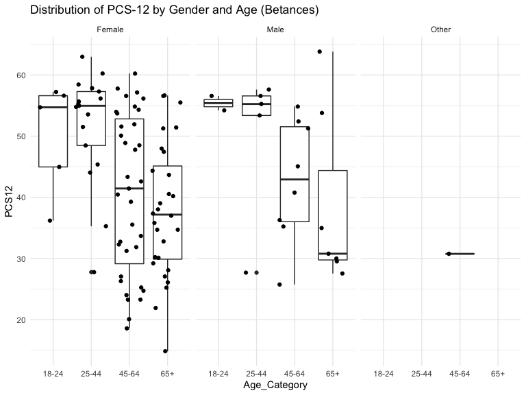
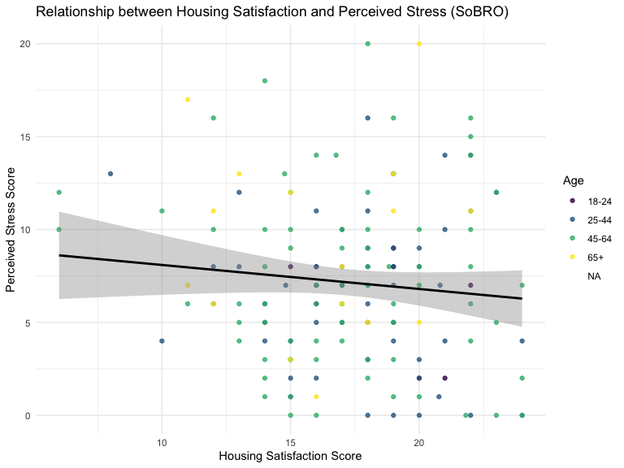

Data Cleaning, Preliminary Analysis, and Final Data Analysis
================
Dionna Attinson
2/7/2020

``` r
SurveyData = 
  readxl::read_xls('./SFH_Survey_CODED_CLEANED.xls') %>% 
  janitor::clean_names()
```

### Data Cleaning and Recoding (Betances Data)

``` r
SurveyData =
 SurveyData %>% 
 rename(Gender = x1_to_which_gender_identity_do_you_most_identify_selected_choice,
        Education = x3_what_is_the_highest_level_of_education_you_have_completed_selected_choice,
        Race = x4_which_best_describes_your_race_ethnicity_check_all_that_apply_selected_choice,
        Income = x7_hand_participant_income_card_which_of_these_groups_on_this_card_is_closest_to_your_total_personal_income_before_taxes_during_the_last_year_please_include_income_from_all_sources_your_salaries_wages_and_any_benefits_including_social_security_welfare_gifts_or_any_other_income_please_do_not_include_food_stamps_or_rental_subsidies_tell_me_the_code_for_the_amount_you_got_last_year_or_the_code_for_the_amount_you_usually_get_per_month_if_necessary_work_with_resident_to_construct_a_monthly_personal_and_household_income,
        
        DelayedRent = x11_during_the_past_12_months_was_there_any_month_when_you_your_family_delayed_paying_or_were_not_able_to_pay_your_rent)
```

##### In the code chunk below, a number of variables were recoded as binary.

  - `Smoke` was the variable that identified the smoking status of an
    individual. Those who responded that they smoke ANY products
    including marijuana, THC, hash, hookah, E-cigarettes, Cigarettes or
    Cigarillos were coded as `1` = Smoker. Those who responded that they
    did not smoke any products were coded as `0`, Non-smoker.
  - Evidence of mice/rats, cockroaches, and having a mildew odor present
    in the home were all coded as `1` = Yes, `0` = No.

<!-- end list -->

``` r
VariablesofInterest = 
  SurveyData %>% 
  select(age, Gender, Race, pss_5, pss_6, pss_8, pss_9, pss_10, sf36_1, sf36_4, 
        sf36_6, sf36_14, sf36_15, sf36_18, sf36_19, sf36_22, sf36_26, sf36_27, sf36_28,
        sf36_32, Education, Income, moved_in_last_5_years, DelayedRent, repairs_needed,
        asthma, anxiety, lungd, depression, heartdisease, cancer, diabetes,hypertension,       
        products_used, neg_health_building, micerats, cockroaches, mildew, homesat, buildsat,
        neighborhoodsat, propmansat, sumtempsat, wintempsat) %>% 
  
  rename(Smoke = products_used) %>% 
  rename(Age = age) %>% 
  mutate(Smoke = recode(Smoke, 
                    "Dont smoke" = "0",
                    "Cigarettes and/or Cigarillos (common brands are Marlboro, Black & Mild)" = "1",
                    "Hookah" = "1",
                    "Cigarettes and/or Cigarillos (common brands are Marlboro, Black & Mild) ,Marijuana, hash, THC, grass, pot, or weed" = "1",
                    "Cigarettes and/or Cigarillos (common brands are Marlboro, Black & Mild) ,E-cigarettes (look like regular cigarettes, but are battery-powered),Marijuana, hash, THC, grass, pot, or weed,Hookah" = "1",
                    "E-cigarettes (look like regular cigarettes, but are battery-powered)" = "1",
                   "Marijuana, hash, THC, grass, pot, or weed" = "1"),
        micerats = recode(micerats, 
                          "Yes" = "1", 
                          "No" = "0"),
        cockroaches = recode(cockroaches, 
                             "Yes" = "1", 
                             "No" = "0"),
        mildew = recode(mildew, 
                            "Yes" = "1",
                            "No" = "0"),
        neg_health_building = recode(neg_health_building, 
                                      "Yes" = "1",
                                      "No" = "0"),
        Race = recode(Race,
                      "Hispanic or Latino" = "Hispanic or Latinx",
                      "Other, specify:" = "Other",
                      "Hispanic or Latino,Native American/ Alaskan Native" = "Other",
                      "Non- Hispanic Black or African American,Asian or Pacific Islander" = "Other",
                      "Non- Hispanic Black or African American,Hispanic or Latino" = "Other",
                      "Non-Hispanic White,Non- Hispanic Black or African American,Hispanic or Latino,Native American/ Alaskan Native,Asian or Pacific Islander" = "Other"),
  DelayedRent = recode(DelayedRent, 
                             "Yes" = "1",
                             "No" = "0"))
```

##### Below, I scored the Perceived Stress Scale (PSS-4) and the SF-12. The PSS coding instructions were as follows: code `0` - never, `1` - almost never, `2` - sometimes, `3` - fairly often, `4` - very often & reverse your scores for questions 4, 5, 7, and 8. On these 4 questions, change the scores to: 0 = 4, 1 = 3, 2 = 2, 3 = 1, 4 = 0.

``` r
##PSS Scale
CodedData_VariablesofInterest =
  VariablesofInterest %>% 
  mutate(
    pss_5_coded = pss_5,
    pss_6_coded = pss_6,
    pss_8_coded = pss_8,
    pss_9_coded = pss_9,
    pss_10_coded = pss_10, 
    gh1 = sf36_1,
    pf02 = sf36_4,  
    pf04 = sf36_6,
    rp2 = sf36_14,  
    rp3 = sf36_15,  
    re2 = sf36_18,
    re3 = sf36_19,
    bp2 = sf36_22,
    mh3 = sf36_26,
    vt2 = sf36_27,
    mh4 = sf36_28,
    sf2 = sf36_32) %>% 
    
  mutate(pss_5_coded = recode(pss_5_coded, 
                        "Never" = "4",
                        "Almost never" = "3",
                        "Sometimes" = "2", 
                        "Fairly often" = "1",
                        "Very often" = "0"), 
         pss_6_coded = recode(pss_6_coded, 
                        "Never" = "0",
                        "Almost never" = "1",
                        "Sometimes" = "2", 
                        "Fairly often" = "3",
                        "Very often" = "4"),
         pss_8_coded = recode(pss_8_coded, 
                        "Never" = "4",
                        "Almost never" = "3",
                        "Sometimes" = "2", 
                        "Fairly often" = "1",
                        "Very often" = "0"),
         pss_9_coded = recode(pss_9_coded, 
                        "Never" = "0",
                        "Almost never" = "1",
                        "Sometimes" = "2", 
                        "Fairly often" = "3",
                        "Very often" = "4"),
         pss_10_coded = recode(pss_10_coded, 
                        "Never" = "0",
                        "Almost never" = "1",
                        "Sometimes" = "2", 
                        "Fairly often" = "3",
                        "Very often" = "4"),
         gh1 = recode(gh1,
                         "Excellent" = "1",
                         "Very Good" = "2",
                         "Good" = "3",
                         "Fair" = "4",
                         "Poor" = "5"),
         pf02 = recode(pf02, 
                         "Yes, limited a lot" = "1",
                         "Yes, limited a little" = "2",
                         "No, not limited at all" = "3"),
         pf04 = recode(pf04, 
                         "Yes, limited a lot" = "1",
                         "Yes, limited a little" = "2",
                         "No, not limited at all" = "3"),
         rp2 = recode(rp2, 
                         "Yes" = "1",
                         "No" = "2"),
         rp3 = recode(rp3, 
                         "Yes" = "1",
                         "No" = "2"), 
         re2 = recode(re2, 
                         "Yes" = "1",
                         "No" = "2"), 
         re3 = recode(re3, 
                         "Yes" = "1",
                         "No" = "2"),
         bp2 = recode(bp2,
                         "Not at all" = "1",
                         "A little bit" = "2",
                         "Moderately" = "3",
                         "Quite a bit" = "4",
                         "Extremely" = "5"),
         mh3 =  recode(mh3,
                          "All of the time" = "1",
                          "Most of the time" = "2",
                          "A good bit of the time" = "3",
                          "Some of the time" = "4",
                          "A little of the time" = "5",
                          "None of the time" = "6"),
         vt2 = recode(vt2,
                          "All of the time" = "1",
                          "Most of the time" = "2",
                          "A good bit of the time" = "3",
                          "Some of the time" = "4",
                          "A little of the time" = "5",
                          "None of the time" = "6"),
         mh4 = recode(mh4,
                          "All of the time" = "1",
                          "Most of the time" = "2",
                          "A good bit of the time" = "3",
                          "Some of the time" = "4",
                          "A little of the time" = "5",
                          "None of the time" = "6"),
         sf2 = recode(sf2,
                         "All of the time" = "1",
                         "Most of the time" = "2",
                         "Some of the time" = "3",
                         "A little of the time" = "4",
                         "None of the time" = "5")) 
```

##### The code chunk below now represents the second step of scoring the SF-12. This requires reversing the scores of certain questions so that a higher SF-12 score means better health.

``` r
CodedData_VariablesofInterest = 
  CodedData_VariablesofInterest %>% 
  mutate(
     gh1 = recode(gh1,
                         "1" = "5",
                         "2" = "4",
                         "3" = "3",
                         "4" = "2",
                         "5" = "1"),
         bp2 = recode(bp2,
                          "1" = "6",
                          "2" = "5",
                          "3" = "4",
                          "4" = "3",
                          "5" = "2",
                          "6" = "1"),
         mh3 = recode(mh3,
                          "1" = "6",
                          "2" = "5",
                          "3" = "4",
                          "4" = "3",
                          "5" = "2",
                          "6" = "1"),
         vt2 = recode(vt2,
                          "1" = "6",
                          "2" = "5",
                          "3" = "4",
                          "4" = "3",
                          "5" = "2",
                          "6" = "1"))
```

##### Next, I created dummy variables for each of the SF-12 variables.

``` r
  CodedData_VariablesofInterest$pf02_1 <- as.numeric(CodedData_VariablesofInterest$pf02 == 1L) 
  CodedData_VariablesofInterest$pf02_2 <- as.numeric(CodedData_VariablesofInterest$pf02 == 2L) 
  CodedData_VariablesofInterest$pf04_1 <- as.numeric(CodedData_VariablesofInterest$pf04 == 1L) 
  CodedData_VariablesofInterest$pf04_2 <- as.numeric(CodedData_VariablesofInterest$pf04 == 2L) 
  CodedData_VariablesofInterest$rp2_1 <- as.numeric(CodedData_VariablesofInterest$rp2 == 1L) 
  CodedData_VariablesofInterest$rp3_1 <- as.numeric(CodedData_VariablesofInterest$rp3 == 1L) 
  CodedData_VariablesofInterest$bp2_1 <- as.numeric(CodedData_VariablesofInterest$bp2 == 1L) 
  CodedData_VariablesofInterest$bp2_2 <- as.numeric(CodedData_VariablesofInterest$bp2 == 2L) 
  CodedData_VariablesofInterest$bp2_3 <- as.numeric(CodedData_VariablesofInterest$bp2 == 3L) 
  CodedData_VariablesofInterest$bp2_4 <- as.numeric(CodedData_VariablesofInterest$bp2 == 4L) 
  CodedData_VariablesofInterest$gh1_1 <- as.numeric(CodedData_VariablesofInterest$gh1 == 1L) 
  CodedData_VariablesofInterest$gh1_2 <- as.numeric(CodedData_VariablesofInterest$gh1 == 2L) 
  CodedData_VariablesofInterest$gh1_3 <- as.numeric(CodedData_VariablesofInterest$gh1 == 3L) 
  CodedData_VariablesofInterest$gh1_4 <- as.numeric(CodedData_VariablesofInterest$gh1 == 4L) 
  CodedData_VariablesofInterest$vt2_1 <- as.numeric(CodedData_VariablesofInterest$vt2 == 1L) 
  CodedData_VariablesofInterest$vt2_2 <- as.numeric(CodedData_VariablesofInterest$vt2 == 2L) 
  CodedData_VariablesofInterest$vt2_3 <- as.numeric(CodedData_VariablesofInterest$vt2 == 3L) 
  CodedData_VariablesofInterest$vt2_4 <- as.numeric(CodedData_VariablesofInterest$vt2 == 4L) 
  CodedData_VariablesofInterest$vt2_5 <- as.numeric(CodedData_VariablesofInterest$vt2 == 5L) 
  CodedData_VariablesofInterest$sf2_1 <- as.numeric(CodedData_VariablesofInterest$sf2 == 1L) 
  CodedData_VariablesofInterest$sf2_2 <- as.numeric(CodedData_VariablesofInterest$sf2 == 2L) 
  CodedData_VariablesofInterest$sf2_3 <- as.numeric(CodedData_VariablesofInterest$sf2 == 3L) 
  CodedData_VariablesofInterest$sf2_4 <- as.numeric(CodedData_VariablesofInterest$sf2 == 4L) 
  CodedData_VariablesofInterest$re2_1 <- as.numeric(CodedData_VariablesofInterest$re2 == 1L) 
  CodedData_VariablesofInterest$re3_1 <- as.numeric(CodedData_VariablesofInterest$re3 == 1L) 
  CodedData_VariablesofInterest$mh3_1 <- as.numeric(CodedData_VariablesofInterest$mh3 == 1L) 
  CodedData_VariablesofInterest$mh3_2 <- as.numeric(CodedData_VariablesofInterest$mh3 == 2L) 
  CodedData_VariablesofInterest$mh3_3 <- as.numeric(CodedData_VariablesofInterest$mh3 == 3L) 
  CodedData_VariablesofInterest$mh3_4 <- as.numeric(CodedData_VariablesofInterest$mh3 == 4L) 
  CodedData_VariablesofInterest$mh3_5 <- as.numeric(CodedData_VariablesofInterest$mh3 == 5L) 
  CodedData_VariablesofInterest$mh4_1 <- as.numeric(CodedData_VariablesofInterest$mh4 == 1L) 
  CodedData_VariablesofInterest$mh4_2 <- as.numeric(CodedData_VariablesofInterest$mh4 == 2L) 
  CodedData_VariablesofInterest$mh4_3 <- as.numeric(CodedData_VariablesofInterest$mh4 == 3L) 
  CodedData_VariablesofInterest$mh4_4 <- as.numeric(CodedData_VariablesofInterest$mh4 == 4L) 
  CodedData_VariablesofInterest$mh4_5 <- as.numeric(CodedData_VariablesofInterest$mh4 == 5L) 
```

##### I then created SF-12 weights and aggregates of indicator variables using physical and mental regression weights.

``` r
CodedData_VariablesofInterest = 
  CodedData_VariablesofInterest %>% 
  mutate(RAWPCS12 =
                   (-7.23216*pf02_1) + (-3.45555*pf02_2) +
                   (-6.24397*pf04_1) + (-2.73557*pf04_2) +
                   (-4.61617*rp2_1) + 
                   (-5.51747*rp3_1) +
                   (-11.25544*bp2_1) + (-8.38063*bp2_2) +
                   (-6.50522*bp2_3) + (-3.80130*bp2_4) + (-8.37399*gh1_1) +
                   (-5.56461*gh1_2) + (-3.02396*gh1_3) + (-1.31872*gh1_4) +
                   (-2.44706*vt2_1) + (-2.02168*vt2_2) + (-1.6185*vt2_3) +
                   (-1.14387*vt2_4) + (-0.42251*vt2_5) + (-0.33682*sf2_1) +
                   (-0.94342*sf2_2) + (-0.18043*sf2_3) + (0.11038*sf2_4) +
                   (3.04365*re2_1) + (2.32091*re3_1) + (3.46638*mh3_1) +
                   (2.90426*mh3_2) + (2.37241*mh3_3) + (1.36689*mh3_4) +
                   (0.66514*mh3_5) + (4.61446*mh4_1) + (3.41593*mh4_2) +
                   (2.34247*mh4_3) + (1.28044*mh4_4) + (0.41188*mh4_5),

           RAWMCS12 =
                   (3.93115*pf02_1) + (1.8684*pf02_2) +
                   (2.68282*pf04_1) + (1.43103*pf04_2) + (1.4406*rp2_1) +
                   (1.66968*rp3_1) + (1.48619*bp2_1) + (1.76691*bp2_2) +
                   (1.49384*bp2_3) + (0.90384*bp2_4) + (-1.71175*gh1_1) +
                   (-0.16891*gh1_2) + (0.03482*gh1_3) + (-0.06064*gh1_4) +
                   (-6.02409*vt2_1) + (-4.88962*vt2_2) + (-3.29805*vt2_3) +
                   (-1.65178*vt2_4) + (-0.92057*vt2_5) + (-6.29724*sf2_1) +
                   (-8.26066*sf2_2) + (-5.63286*sf2_3) + (-3.13896*sf2_4) +
                   (-6.82672*re2_1) + (-5.69921*re3_1) + (-10.19085*mh3_1) +
                   (-7.92717*mh3_2) + (-6.31121*mh3_3) + (-4.09842*mh3_4) +
                   (-1.94949*mh3_5) + (-16.15395*mh4_1) + (-10.77911*mh4_2) +
                   (-8.09914*mh4_3) + (-4.59055*mh4_4) + (-1.95934*mh4_5))
```

##### We then computed a norm-based standardization to PCS12 and MCS12.

``` r
CodedData_VariablesofInterest = 
  CodedData_VariablesofInterest %>% 
  mutate(
  PCS12 = (RAWPCS12 + 56.57706),
  MCS12 = (RAWMCS12 + 60.75781))
```

``` r
CodedData_VariablesofInterest = 
  CodedData_VariablesofInterest %>% 
  mutate(
pss_5_coded =  as.numeric(pss_5_coded),
pss_6_coded =  as.numeric(pss_6_coded),
pss_8_coded = as.numeric(pss_8_coded),
pss_9_coded = as.numeric(pss_9_coded),
pss_10_coded = as.numeric(pss_10_coded))
```

##### For the SF-12 scale, a standardized SF-12 score was created for both physical and mental health for each participant. This resulted in the variables `PCS12` and `MCS12`. The higher the SF-12 scores, the better their overall health-related quality of life.

##### For the PSS scale, a total score was created from the questions which became the variable `total_PSS_score`. I then created stress categories for future categorical analysis:

  - Scores ranging from 0-6 would be considered low stress.
  - Scores ranging from 7-13 ould be considered moderate stress.
  - Scores ranging from 14-20 would be considered high perceived
stress.

##### Further, several other variables were transformed. Age was transformed to a categorical variable, creating the age groups of 18-24, 25-44, 45-64, and 65+. Gender was transformed into a binary variable (0 = male, 1 = female), and a Housing Satisfaction Score was created. A higher score indicates higher overall housing satisfaction. This score was created based off of the totals of four questions:

  - The participant’s satisfaction with their apartment
  - The participant’s satisfcation with their building
  - The participant’s satisfcation with their neighbhorhood
  - The participant’s satisfaction with their property management
  - The participant’s satisfcation with their apartment’s temperature in
    the summer
  - The participant’s satisfaction with their apartment’s temperature in
    the
winter

##### Lastly, a binary chronic disease outcome was created. If a participant responded that they or someone in their home have the following conditions, they were coded as `1`:

  - Cancer
  - Heart Disease
  - Diabetes
  - Hypertension
  - Asthma
  - Lung Disease
  - Anxiety
  - Depression

<!-- end list -->

``` r
CodedData_VariablesofInterest = 
CodedData_VariablesofInterest %>% 
  mutate(
    total_PSS_score = pss_5_coded + pss_6_coded + pss_8_coded + pss_9_coded + pss_10_coded,
    PSS_Category = total_PSS_score, 
    PSS_Category = 
          case_when(PSS_Category >= 14 ~ 'High Perceived Stress',
                    PSS_Category >= 7 ~ 'Moderate Stress',
                    PSS_Category >= 0  ~ 'Low Stress'),
    Age_Category = Age,
    Age_Category = 
          case_when(Age_Category >= 65  ~ '65+',
                    Age_Category >= 45  ~ '45-64',
                    Age_Category >= 25 ~ '25-44',
                    Age_Category >= 18 ~ '18-24'),
    Gender = recode(Gender, 
                          `Other, please specify:` = "Other"),
    AptSat_Coded = homesat, 
    AptSat_Coded = recode(AptSat_Coded,
                          "Very Dissatisfied" = "1",
                          "Dissatisfied" = "2", 
                          "Satisfied" = "3",
                          "Very Satisfied" ="4"), 
    BuildingSat_Coded = buildsat, 
    BuildingSat_Coded = recode(BuildingSat_Coded,
                          "Very Dissatisfied" = "1",
                          "Dissatisfied" = "2", 
                          "Satisfied" = "3",
                          "Very Satisfied" ="4"),
    NeighborhoodSat_Coded = neighborhoodsat, 
    NeighborhoodSat_Coded = recode(NeighborhoodSat_Coded,
                          "Very Dissatisfied" = "1",
                          "Dissatisfied" = "2", 
                          "Satisfied" = "3",
                          "Very Satisfied" ="4"),
   PropertyManSat_Coded = propmansat,
   PropertyManSat_Coded = recode(PropertyManSat_Coded,
                          "Very Dissatisfied" = "1",
                          "Dissatisfied" = "2", 
                          "Satisfied" = "3",
                          "Very Satisfied" ="4"),
   WinTempSat_Coded = wintempsat, 
   WinTempSat_Coded = recode(WinTempSat_Coded,
                          "Very Dissatisfied" = "1",
                          "Dissatisfied" = "2", 
                          "Satisfied" = "3",
                          "Very Satisfied" ="4"), 
   SumTempSat_Coded = sumtempsat, 
   SumTempSat_Coded = recode(SumTempSat_Coded,
                          "Very Dissatisfied" = "1",
                          "Dissatisfied" = "2", 
                          "Satisfied" = "3",
                          "Very Satisfied" ="4"),
   WinTempSat_Coded = as.numeric(WinTempSat_Coded),
   SumTempSat_Coded = as.numeric(SumTempSat_Coded),
   AptSat_Coded = as.numeric(AptSat_Coded), 
   BuildingSat_Coded = as.numeric(BuildingSat_Coded),
   NeighborhoodSat_Coded = as.numeric(NeighborhoodSat_Coded),
   PropertyManSat_Coded = as.numeric(PropertyManSat_Coded),
   asthma = as.numeric(asthma),
   heartdisease = as.numeric(heartdisease),
   lungd = as.numeric(lungd),
   anxiety = as.numeric(anxiety),
   depression = as.numeric(depression),
   cancer = as.numeric(cancer),
   hypertension = as.numeric(hypertension),
   diabetes = as.numeric(diabetes),
   Chronic_Disease = asthma + heartdisease + lungd + anxiety + depression + cancer + hypertension + diabetes,
   Chronic_Disease = 
          case_when(Chronic_Disease >= 1 ~ '1',
                    Chronic_Disease == 0 ~ '0'))
```

``` r
CodedData_VariablesofInterest = 
  CodedData_VariablesofInterest %>% 
  mutate(
  PropertyManSat_Coded = na_mean(PropertyManSat_Coded),
  WinTempSat_Coded = na_mean(WinTempSat_Coded),
  HousingSatisfactionScore = AptSat_Coded + BuildingSat_Coded + NeighborhoodSat_Coded + PropertyManSat_Coded + WinTempSat_Coded + SumTempSat_Coded,
  Satisfaction_Category = HousingSatisfactionScore,
  Satisfaction_Category = 
          case_when(Satisfaction_Category >= 18 ~ 'High Satisfaction',
                    Satisfaction_Category >= 12 ~ 'Moderate Satisfaction',
                    Satisfaction_Category >= 6  ~ 'Low Satisfaction'))
```

##### Below, I changed variables into factors and numeric values.

``` r
CodedData_VariablesofInterest = 
  CodedData_VariablesofInterest %>% 
  mutate(
    Education = as.factor(Education),
    Gender = as.factor(Gender),
    Race = as.factor(Race),
    Chronic_Disease = as.factor(Chronic_Disease), 
    Age = as.numeric(Age),
    Income = factor(Income, levels = c("1", "2", "3", "4", "5", "6","7","8","9","10")),
    Smoke = factor(Smoke, levels = c("0", "1")),
    DelayedRent = factor(DelayedRent, levels = c("0","1")),
    asthma = factor(asthma, levels = c("0","1")),
    lungd = factor(lungd, levels = c("0","1")),
    heartdisease = factor(heartdisease, levels = c("0","1")),
    anxiety = factor(anxiety, levels = c("0","1")),
    depression = factor(depression, levels = c("0","1")),
    cancer = factor(cancer,levels = c("0","1")),
    diabetes = factor(diabetes,levels = c("0","1")),
    micerats = factor(micerats,levels = c("0","1")),
    mildew = factor(mildew,levels = c("0","1")),
    cockroaches = factor(cockroaches,levels = c("0","1")),
    repairs_needed = factor(repairs_needed,levels = c("0","1")),
    moved_in_last_5_years = factor(moved_in_last_5_years,levels = c("0","1")),
    Chronic_Disease = factor(Chronic_Disease,levels = c("0","1")),
    Education = factor(Education, levels = c("Less than High School", "High School/Secondary School Diploma", "G.E.D.", "Vocational School", "Some College", "2 Year Community College Degree", "4 Year College Degree", "Post-Graduate Degree"))
  )
```

##### In order to collapse education categories into fewer groups, education levels were finalized into three categories:

  - Less than high school (included those who never attended school, or
    did not complete a high school degree/G.E.D)
  - High school/G.E.D
  - Post High School Education (included those who attended vocational
    school, some college, 2-year/4-year college degree, and post
    graduate education)

<!-- end list -->

``` r
CodedData_VariablesofInterest = 
CodedData_VariablesofInterest %>% 
  mutate(Education = as.character(Education))
```

``` r
CodedData_VariablesofInterest[99, "Education"] = "Never Attended School"
CodedData_VariablesofInterest[33, "Education"] = "Some College"
CodedData_VariablesofInterest[20, "Education"] = "Some College"
CodedData_VariablesofInterest[53, "Education"] = NA
```

``` r
CodedData_VariablesofInterest = 
  CodedData_VariablesofInterest %>% 
  mutate(
  Education_Group = Education, 
  Education_Group = recode(Education_Group, 
                    "Never Attended School" = "Less than High School",
                    "Vocational School" = "Post High School Education",
                    "Some College" = "Post High School Education",
                    "2 Year Community College Degree" = "Post High School Education",
                    "4 Year College Degree" = "Post High School Education",
                    "Post-Graduate Degree" = "Post High School Education",
                    "High School/Secondary School Diploma" =    "High School/G.E.D.",
                    "G.E.D." = "High School/G.E.D."),
   Education_Group = factor(Education_Group, levels = c("Less than High School", "High School/G.E.D.", "Post High School Education")))
```

``` r
CodedData_VariablesofInterest = 
  CodedData_VariablesofInterest %>% 
  mutate(Education_Group = as.factor(Education_Group))
```

##### In order to collapse income categories into fewer groups, education levels were finalized into three categories:

  - `1` - Total personal income less than $10,000/year
  - `2` - Total personal income between $10,000 - $24,999/year
  - `3` - Total personal income $25,000k + /year

<!-- end list -->

``` r
CodedData_VariablesofInterest = 
  CodedData_VariablesofInterest %>% 
  mutate(
  Income_Group = Income, 
  Income_Group = recode(Income_Group, 
                    "2" = "1",
                    "3" = "1",
                    "4" = "2",
                    "5" = "2",
                    "6" = "3",
                    "7" = "3",
                    "8" = "3",
                    "9" = "3",
                    "10" = "3"),
  Income_Group = factor(Income_Group,levels= c("1","2","3")))
```

### Univariable/Descriptive Analyses

##### The tables below provide descriptive analyses of the independent and dependent variables.

#### Outcome Variables

##### Overall Physical Health Status (Outcome 1)

``` r
CodedData_VariablesofInterest %>% 
  select(PCS12) %>% 
  summary() %>% 
  knitr::kable(col.names = c("Summary of Self-Reported Physical Health"))
```

<table>

<thead>

<tr>

<th style="text-align:left;">

</th>

<th style="text-align:left;">

Summary of Self-Reported Physical Health

</th>

</tr>

</thead>

<tbody>

<tr>

<td style="text-align:left;">

</td>

<td style="text-align:left;">

Min. :14.86

</td>

</tr>

<tr>

<td style="text-align:left;">

</td>

<td style="text-align:left;">

1st Qu.:32.52

</td>

</tr>

<tr>

<td style="text-align:left;">

</td>

<td style="text-align:left;">

Median :44.05

</td>

</tr>

<tr>

<td style="text-align:left;">

</td>

<td style="text-align:left;">

Mean :43.03

</td>

</tr>

<tr>

<td style="text-align:left;">

</td>

<td style="text-align:left;">

3rd Qu.:54.75

</td>

</tr>

<tr>

<td style="text-align:left;">

</td>

<td style="text-align:left;">

Max. :63.81

</td>

</tr>

<tr>

<td style="text-align:left;">

</td>

<td style="text-align:left;">

NA’s :1

</td>

</tr>

</tbody>

</table>

``` r
CodedData_VariablesofInterest %>% 
  drop_na() %>% 
  group_by(PCS12, Age_Category, Gender) %>% 
  summarize(n = n()) %>% 
    ggplot(aes(x= Age_Category, y = PCS12)) + geom_boxplot() +
  geom_jitter() +  facet_grid(. ~ Gender)+ 
  labs(title = "Distribution of PCS-12 by Gender and Age (Betances)")
```



##### Overall Mentall Health Status (Outcome 2)

``` r
CodedData_VariablesofInterest %>% 
  select(MCS12) %>% 
  summary() %>% 
  knitr::kable(col.names = c("Summary of Self-Reported Mental Health"))
```

<table>

<thead>

<tr>

<th style="text-align:left;">

</th>

<th style="text-align:left;">

Summary of Self-Reported Mental Health

</th>

</tr>

</thead>

<tbody>

<tr>

<td style="text-align:left;">

</td>

<td style="text-align:left;">

Min. :19.57

</td>

</tr>

<tr>

<td style="text-align:left;">

</td>

<td style="text-align:left;">

1st Qu.:43.25

</td>

</tr>

<tr>

<td style="text-align:left;">

</td>

<td style="text-align:left;">

Median :53.49

</td>

</tr>

<tr>

<td style="text-align:left;">

</td>

<td style="text-align:left;">

Mean :49.86

</td>

</tr>

<tr>

<td style="text-align:left;">

</td>

<td style="text-align:left;">

3rd Qu.:58.84

</td>

</tr>

<tr>

<td style="text-align:left;">

</td>

<td style="text-align:left;">

Max. :69.92

</td>

</tr>

<tr>

<td style="text-align:left;">

</td>

<td style="text-align:left;">

NA’s :1

</td>

</tr>

</tbody>

</table>

``` r
CodedData_VariablesofInterest %>% 
  drop_na() %>% 
  group_by(MCS12, Age_Category, Gender) %>% 
  summarize(n = n()) %>% 
    ggplot(aes(x= Age_Category, y = MCS12)) + geom_boxplot() +
  geom_jitter() +  facet_grid(. ~ Gender) + 
  labs(title = "Distribution of MCS-12 by Gender and Age (Betances)")
```


#### Independent Variables

``` r
CodedData_VariablesofInterest %>% 
  group_by(Smoke) %>% 
  summarize(n=n()) %>% 
  mutate(
    percent = n/124*100) %>% 
  mutate(
    Smoke = recode(Smoke,
                   "0" = "Non-smoker(s)",
                   "1" = "Smoker(s)")) %>% 
  knitr::kable(col.names=c("Smoking Status", "n", "Percent(%)"), digits = 2)
```

<table>

<thead>

<tr>

<th style="text-align:left;">

Smoking Status

</th>

<th style="text-align:right;">

n

</th>

<th style="text-align:right;">

Percent(%)

</th>

</tr>

</thead>

<tbody>

<tr>

<td style="text-align:left;">

Non-smoker(s)

</td>

<td style="text-align:right;">

97

</td>

<td style="text-align:right;">

78.23

</td>

</tr>

<tr>

<td style="text-align:left;">

Smoker(s)

</td>

<td style="text-align:right;">

27

</td>

<td style="text-align:right;">

21.77

</td>

</tr>

</tbody>

</table>

``` r
CodedData_VariablesofInterest %>% 
  group_by(Race) %>% 
  summarize(n=n()) %>%
   mutate(
  percent = n/124*100) %>% 
  mutate(
    Race = recode(Race,
                  "Other, specify:" = "Other")
  ) %>% 
  knitr::kable(col.names=c("Race/Ethnicity", "n", "Percent(%)"), digits = 2)
```

<table>

<thead>

<tr>

<th style="text-align:left;">

Race/Ethnicity

</th>

<th style="text-align:right;">

n

</th>

<th style="text-align:right;">

Percent(%)

</th>

</tr>

</thead>

<tbody>

<tr>

<td style="text-align:left;">

Hispanic or Latinx

</td>

<td style="text-align:right;">

87

</td>

<td style="text-align:right;">

70.16

</td>

</tr>

<tr>

<td style="text-align:left;">

Non- Hispanic Black or African American

</td>

<td style="text-align:right;">

26

</td>

<td style="text-align:right;">

20.97

</td>

</tr>

<tr>

<td style="text-align:left;">

Other

</td>

<td style="text-align:right;">

11

</td>

<td style="text-align:right;">

8.87

</td>

</tr>

</tbody>

</table>

``` r
CodedData_VariablesofInterest %>% 
  group_by(Age_Category) %>% 
  summarize(n=n()) %>%
  mutate(
  percent = n/124*100) %>% 
  knitr::kable(col.names=c("Age Group", "n", "Percent(%)"), digits = 2)
```

<table>

<thead>

<tr>

<th style="text-align:left;">

Age Group

</th>

<th style="text-align:right;">

n

</th>

<th style="text-align:right;">

Percent(%)

</th>

</tr>

</thead>

<tbody>

<tr>

<td style="text-align:left;">

18-24

</td>

<td style="text-align:right;">

7

</td>

<td style="text-align:right;">

5.65

</td>

</tr>

<tr>

<td style="text-align:left;">

25-44

</td>

<td style="text-align:right;">

25

</td>

<td style="text-align:right;">

20.16

</td>

</tr>

<tr>

<td style="text-align:left;">

45-64

</td>

<td style="text-align:right;">

47

</td>

<td style="text-align:right;">

37.90

</td>

</tr>

<tr>

<td style="text-align:left;">

65+

</td>

<td style="text-align:right;">

43

</td>

<td style="text-align:right;">

34.68

</td>

</tr>

<tr>

<td style="text-align:left;">

NA

</td>

<td style="text-align:right;">

2

</td>

<td style="text-align:right;">

1.61

</td>

</tr>

</tbody>

</table>

``` r
CodedData_VariablesofInterest %>% 
  group_by(Gender) %>% 
  summarize(n=n()) %>%
  mutate(
  percent = n/124*100) %>% 
  knitr::kable(col.names=c("Gender", "n", "Percent(%)"), digits = 2)
```

<table>

<thead>

<tr>

<th style="text-align:left;">

Gender

</th>

<th style="text-align:right;">

n

</th>

<th style="text-align:right;">

Percent(%)

</th>

</tr>

</thead>

<tbody>

<tr>

<td style="text-align:left;">

Female

</td>

<td style="text-align:right;">

97

</td>

<td style="text-align:right;">

78.23

</td>

</tr>

<tr>

<td style="text-align:left;">

Male

</td>

<td style="text-align:right;">

26

</td>

<td style="text-align:right;">

20.97

</td>

</tr>

<tr>

<td style="text-align:left;">

Other

</td>

<td style="text-align:right;">

1

</td>

<td style="text-align:right;">

0.81

</td>

</tr>

</tbody>

</table>

``` r
CodedData_VariablesofInterest %>% 
  drop_na() %>% 
  group_by(Age, Gender) %>% 
  ggplot(aes(x=Gender, y=Age)) + geom_violin() +
  labs(x = "Gender",
      y = "Age",
      title = "Distribution of Age by Gender (Betances)")
```


``` r
CodedData_VariablesofInterest %>% 
  drop_na() %>% 
  select(Gender, Age) %>% 
  group_by(Gender) %>% 
  summarize(Mean = mean(Age),
            SD = sd(Age)) %>% 
  knitr::kable(col.names=c("Gender", "Mean Age", "SD"), digits = 2)
```

<table>

<thead>

<tr>

<th style="text-align:left;">

Gender

</th>

<th style="text-align:right;">

Mean Age

</th>

<th style="text-align:right;">

SD

</th>

</tr>

</thead>

<tbody>

<tr>

<td style="text-align:left;">

Female

</td>

<td style="text-align:right;">

54.87

</td>

<td style="text-align:right;">

17.43

</td>

</tr>

<tr>

<td style="text-align:left;">

Male

</td>

<td style="text-align:right;">

55.32

</td>

<td style="text-align:right;">

20.09

</td>

</tr>

<tr>

<td style="text-align:left;">

Other

</td>

<td style="text-align:right;">

59.00

</td>

<td style="text-align:right;">

NA

</td>

</tr>

</tbody>

</table>

``` r
CodedData_VariablesofInterest %>% 
  group_by(PSS_Category) %>% 
  summarize(n=n()) %>%
   mutate(
  percent = n/124*100) %>% 
  knitr::kable(col.names=c("Perceived Stress Score", "n", "Percent(%)"), digits = 2)
```

<table>

<thead>

<tr>

<th style="text-align:left;">

Perceived Stress Score

</th>

<th style="text-align:right;">

n

</th>

<th style="text-align:right;">

Percent(%)

</th>

</tr>

</thead>

<tbody>

<tr>

<td style="text-align:left;">

High Perceived Stress

</td>

<td style="text-align:right;">

11

</td>

<td style="text-align:right;">

8.87

</td>

</tr>

<tr>

<td style="text-align:left;">

Low Stress

</td>

<td style="text-align:right;">

54

</td>

<td style="text-align:right;">

43.55

</td>

</tr>

<tr>

<td style="text-align:left;">

Moderate Stress

</td>

<td style="text-align:right;">

55

</td>

<td style="text-align:right;">

44.35

</td>

</tr>

<tr>

<td style="text-align:left;">

NA

</td>

<td style="text-align:right;">

4

</td>

<td style="text-align:right;">

3.23

</td>

</tr>

</tbody>

</table>

``` r
CodedData_VariablesofInterest %>% 
  group_by(Income) %>% 
  summarize(n=n()) %>%
  mutate(
  percent = n/124*100) %>% 
  knitr::kable(col.names=c("Income Category", "n", "Percent(%)"), digits = 2)
```

<table>

<thead>

<tr>

<th style="text-align:left;">

Income Category

</th>

<th style="text-align:right;">

n

</th>

<th style="text-align:right;">

Percent(%)

</th>

</tr>

</thead>

<tbody>

<tr>

<td style="text-align:left;">

1

</td>

<td style="text-align:right;">

16

</td>

<td style="text-align:right;">

12.90

</td>

</tr>

<tr>

<td style="text-align:left;">

2

</td>

<td style="text-align:right;">

9

</td>

<td style="text-align:right;">

7.26

</td>

</tr>

<tr>

<td style="text-align:left;">

3

</td>

<td style="text-align:right;">

28

</td>

<td style="text-align:right;">

22.58

</td>

</tr>

<tr>

<td style="text-align:left;">

4

</td>

<td style="text-align:right;">

24

</td>

<td style="text-align:right;">

19.35

</td>

</tr>

<tr>

<td style="text-align:left;">

5

</td>

<td style="text-align:right;">

29

</td>

<td style="text-align:right;">

23.39

</td>

</tr>

<tr>

<td style="text-align:left;">

6

</td>

<td style="text-align:right;">

3

</td>

<td style="text-align:right;">

2.42

</td>

</tr>

<tr>

<td style="text-align:left;">

7

</td>

<td style="text-align:right;">

5

</td>

<td style="text-align:right;">

4.03

</td>

</tr>

<tr>

<td style="text-align:left;">

8

</td>

<td style="text-align:right;">

3

</td>

<td style="text-align:right;">

2.42

</td>

</tr>

<tr>

<td style="text-align:left;">

9

</td>

<td style="text-align:right;">

2

</td>

<td style="text-align:right;">

1.61

</td>

</tr>

<tr>

<td style="text-align:left;">

10

</td>

<td style="text-align:right;">

2

</td>

<td style="text-align:right;">

1.61

</td>

</tr>

<tr>

<td style="text-align:left;">

NA

</td>

<td style="text-align:right;">

3

</td>

<td style="text-align:right;">

2.42

</td>

</tr>

</tbody>

</table>

``` r
CodedData_VariablesofInterest %>% 
  group_by(Education) %>% 
  summarize(n=n()) %>%
  mutate(
  percent = n/124*100) %>% 
  knitr::kable(col.names=c("Education Completed", "n", "Percent(%)"), digits = 2)
```

<table>

<thead>

<tr>

<th style="text-align:left;">

Education Completed

</th>

<th style="text-align:right;">

n

</th>

<th style="text-align:right;">

Percent(%)

</th>

</tr>

</thead>

<tbody>

<tr>

<td style="text-align:left;">

2 Year Community College Degree

</td>

<td style="text-align:right;">

7

</td>

<td style="text-align:right;">

5.65

</td>

</tr>

<tr>

<td style="text-align:left;">

4 Year College Degree

</td>

<td style="text-align:right;">

6

</td>

<td style="text-align:right;">

4.84

</td>

</tr>

<tr>

<td style="text-align:left;">

G.E.D.

</td>

<td style="text-align:right;">

5

</td>

<td style="text-align:right;">

4.03

</td>

</tr>

<tr>

<td style="text-align:left;">

High School/Secondary School Diploma

</td>

<td style="text-align:right;">

41

</td>

<td style="text-align:right;">

33.06

</td>

</tr>

<tr>

<td style="text-align:left;">

Less than High School

</td>

<td style="text-align:right;">

53

</td>

<td style="text-align:right;">

42.74

</td>

</tr>

<tr>

<td style="text-align:left;">

Never Attended School

</td>

<td style="text-align:right;">

1

</td>

<td style="text-align:right;">

0.81

</td>

</tr>

<tr>

<td style="text-align:left;">

Post-Graduate Degree

</td>

<td style="text-align:right;">

3

</td>

<td style="text-align:right;">

2.42

</td>

</tr>

<tr>

<td style="text-align:left;">

Some College

</td>

<td style="text-align:right;">

4

</td>

<td style="text-align:right;">

3.23

</td>

</tr>

<tr>

<td style="text-align:left;">

Vocational School

</td>

<td style="text-align:right;">

3

</td>

<td style="text-align:right;">

2.42

</td>

</tr>

<tr>

<td style="text-align:left;">

NA

</td>

<td style="text-align:right;">

1

</td>

<td style="text-align:right;">

0.81

</td>

</tr>

</tbody>

</table>

``` r
CodedData_VariablesofInterest %>% 
  group_by(DelayedRent) %>% 
  summarize(n=n()) %>%
  mutate(
  percent = n/124*100) %>% 
  mutate(
    DelayedRent = recode(DelayedRent, 
                         "0" = "No",
                         "1" = "Yes")
  ) %>% 
  knitr::kable(col.names=c("Have Experienced Rent Burden", "n", "Percent(%)"), digits = 2)
```

<table>

<thead>

<tr>

<th style="text-align:left;">

Have Experienced Rent Burden

</th>

<th style="text-align:right;">

n

</th>

<th style="text-align:right;">

Percent(%)

</th>

</tr>

</thead>

<tbody>

<tr>

<td style="text-align:left;">

No

</td>

<td style="text-align:right;">

83

</td>

<td style="text-align:right;">

66.94

</td>

</tr>

<tr>

<td style="text-align:left;">

Yes

</td>

<td style="text-align:right;">

36

</td>

<td style="text-align:right;">

29.03

</td>

</tr>

<tr>

<td style="text-align:left;">

NA

</td>

<td style="text-align:right;">

5

</td>

<td style="text-align:right;">

4.03

</td>

</tr>

</tbody>

</table>

``` r
CodedData_VariablesofInterest %>% 
  group_by(repairs_needed) %>% 
  summarize(n=n()) %>%
  mutate(
  percent = n/124*100) %>% 
  mutate(
    repairs_needed = recode(repairs_needed, 
                         "0" = "No",
                         "1" = "Yes")
  ) %>% 
  knitr::kable(col.names=c("Repairs Needed", "n", "Percent(%)"), digits = 2)
```

<table>

<thead>

<tr>

<th style="text-align:left;">

Repairs Needed

</th>

<th style="text-align:right;">

n

</th>

<th style="text-align:right;">

Percent(%)

</th>

</tr>

</thead>

<tbody>

<tr>

<td style="text-align:left;">

No

</td>

<td style="text-align:right;">

8

</td>

<td style="text-align:right;">

6.45

</td>

</tr>

<tr>

<td style="text-align:left;">

Yes

</td>

<td style="text-align:right;">

116

</td>

<td style="text-align:right;">

93.55

</td>

</tr>

</tbody>

</table>

``` r
CodedData_VariablesofInterest %>% 
  group_by(moved_in_last_5_years) %>% 
  summarize(n=n()) %>%
  mutate(
  percent = n/124*100) %>% 
  mutate(
    moved_in_last_5_years = recode(moved_in_last_5_years, 
                         "0" = "No",
                         "1" = "Yes")
  ) %>% 
  knitr::kable(col.names=c("Moved in Last 5 Years", "n", "Percent(%)"), digits = 2)
```

<table>

<thead>

<tr>

<th style="text-align:left;">

Moved in Last 5 Years

</th>

<th style="text-align:right;">

n

</th>

<th style="text-align:right;">

Percent(%)

</th>

</tr>

</thead>

<tbody>

<tr>

<td style="text-align:left;">

No

</td>

<td style="text-align:right;">

100

</td>

<td style="text-align:right;">

80.65

</td>

</tr>

<tr>

<td style="text-align:left;">

Yes

</td>

<td style="text-align:right;">

23

</td>

<td style="text-align:right;">

18.55

</td>

</tr>

<tr>

<td style="text-align:left;">

NA

</td>

<td style="text-align:right;">

1

</td>

<td style="text-align:right;">

0.81

</td>

</tr>

</tbody>

</table>

### 2x2 Tables and Visualizations

``` r
CodedData_VariablesofInterest %>% 
  group_by(Age_Category, Gender) %>% 
  summarize(n=n()) %>%
  pivot_wider(
    names_from = Gender,
    values_from = n) %>% 
  knitr::kable(col.names = c("Age Group","Female (n)", "Male (n)", "Other (n)"))
```

<table>

<thead>

<tr>

<th style="text-align:left;">

Age Group

</th>

<th style="text-align:right;">

Female (n)

</th>

<th style="text-align:right;">

Male (n)

</th>

<th style="text-align:right;">

Other (n)

</th>

</tr>

</thead>

<tbody>

<tr>

<td style="text-align:left;">

18-24

</td>

<td style="text-align:right;">

5

</td>

<td style="text-align:right;">

2

</td>

<td style="text-align:right;">

NA

</td>

</tr>

<tr>

<td style="text-align:left;">

25-44

</td>

<td style="text-align:right;">

19

</td>

<td style="text-align:right;">

6

</td>

<td style="text-align:right;">

NA

</td>

</tr>

<tr>

<td style="text-align:left;">

45-64

</td>

<td style="text-align:right;">

38

</td>

<td style="text-align:right;">

8

</td>

<td style="text-align:right;">

1

</td>

</tr>

<tr>

<td style="text-align:left;">

65+

</td>

<td style="text-align:right;">

33

</td>

<td style="text-align:right;">

10

</td>

<td style="text-align:right;">

NA

</td>

</tr>

<tr>

<td style="text-align:left;">

NA

</td>

<td style="text-align:right;">

2

</td>

<td style="text-align:right;">

NA

</td>

<td style="text-align:right;">

NA

</td>

</tr>

</tbody>

</table>

``` r
CodedData_VariablesofInterest %>%
  drop_na() %>% 
  group_by(Age_Category, Race) %>% 
  summarize(n=n()) %>%
  pivot_wider(
    names_from = Race,
    values_from = n
  ) %>% 
  knitr::kable(col.names = c("Age Group", "Hispanic or Latinx (n)", "Non-Hispanic Black or African American (n)", "Other (n)"))
```

<table>

<thead>

<tr>

<th style="text-align:left;">

Age Group

</th>

<th style="text-align:right;">

Hispanic or Latinx (n)

</th>

<th style="text-align:right;">

Non-Hispanic Black or African American (n)

</th>

<th style="text-align:right;">

Other (n)

</th>

</tr>

</thead>

<tbody>

<tr>

<td style="text-align:left;">

18-24

</td>

<td style="text-align:right;">

5

</td>

<td style="text-align:right;">

2

</td>

<td style="text-align:right;">

NA

</td>

</tr>

<tr>

<td style="text-align:left;">

25-44

</td>

<td style="text-align:right;">

13

</td>

<td style="text-align:right;">

6

</td>

<td style="text-align:right;">

4

</td>

</tr>

<tr>

<td style="text-align:left;">

45-64

</td>

<td style="text-align:right;">

26

</td>

<td style="text-align:right;">

12

</td>

<td style="text-align:right;">

6

</td>

</tr>

<tr>

<td style="text-align:left;">

65+

</td>

<td style="text-align:right;">

31

</td>

<td style="text-align:right;">

4

</td>

<td style="text-align:right;">

1

</td>

</tr>

</tbody>

</table>

``` r
CodedData_VariablesofInterest %>%
  group_by(Race, Smoke) %>% 
  summarize(n=n()) %>%
  mutate(
    Smoke = recode(Smoke,
                   "0" = "Non-smoker(s)",
                   "1" = "Smoker(s)")) %>% 
  pivot_wider(
    names_from = Race,
    values_from = n) %>% 
  knitr::kable(col.names = c("Smoking Status", "Hispanic or Latinx (n)", "Black or African American (n)", "Other (n)"))
```

<table>

<thead>

<tr>

<th style="text-align:left;">

Smoking Status

</th>

<th style="text-align:right;">

Hispanic or Latinx (n)

</th>

<th style="text-align:right;">

Black or African American (n)

</th>

<th style="text-align:right;">

Other (n)

</th>

</tr>

</thead>

<tbody>

<tr>

<td style="text-align:left;">

Non-smoker(s)

</td>

<td style="text-align:right;">

71

</td>

<td style="text-align:right;">

20

</td>

<td style="text-align:right;">

6

</td>

</tr>

<tr>

<td style="text-align:left;">

Smoker(s)

</td>

<td style="text-align:right;">

16

</td>

<td style="text-align:right;">

6

</td>

<td style="text-align:right;">

5

</td>

</tr>

</tbody>

</table>

``` r
CodedData_VariablesofInterest %>%
  group_by(Age_Category, Smoke) %>% 
  drop_na() %>% 
  summarize(n=n()) %>%
  mutate(
    Smoke = recode(Smoke,
                   "0" = "Non-smoker(s)",
                   "1" = "Smoker(s)")) %>% 
  pivot_wider(
    names_from = Age_Category,
    values_from = n) %>% 
  knitr::kable(col.names = c("Smoking Status", "18-24 (n)", "25-44 (n)", "45-64 (n)", "65+ (n)"))
```

<table>

<thead>

<tr>

<th style="text-align:left;">

Smoking Status

</th>

<th style="text-align:right;">

18-24 (n)

</th>

<th style="text-align:right;">

25-44 (n)

</th>

<th style="text-align:right;">

45-64 (n)

</th>

<th style="text-align:right;">

65+ (n)

</th>

</tr>

</thead>

<tbody>

<tr>

<td style="text-align:left;">

Non-smoker(s)

</td>

<td style="text-align:right;">

6

</td>

<td style="text-align:right;">

14

</td>

<td style="text-align:right;">

34

</td>

<td style="text-align:right;">

32

</td>

</tr>

<tr>

<td style="text-align:left;">

Smoker(s)

</td>

<td style="text-align:right;">

1

</td>

<td style="text-align:right;">

9

</td>

<td style="text-align:right;">

10

</td>

<td style="text-align:right;">

4

</td>

</tr>

</tbody>

</table>

``` r
CodedData_VariablesofInterest %>% 
  mutate(
    Smoke = recode(Smoke,
                   "0" = "Non-smoker(s)",
                   "1" = "Smoker(s)")
  ) %>% 
ggplot(aes(x=Smoke, y=Age)) + 
  geom_boxplot(outlier.shape=NA) + #avoid plotting outliers twice
  geom_jitter(position=position_jitter(width=.1, height=0)) + 
  labs(x = "Smoking Status",
      y = "Age",
      title = "Distribution of Age by Smoking Status (Betances)")
```


``` r
CodedData_VariablesofInterest %>% 
  group_by(Age_Category, Education_Group) %>% 
  drop_na() %>% 
  ggplot(aes(x= Age_Category, fill = Education_Group)) + geom_bar() + coord_flip() +
  labs(x = "Age Group",
      y = "Count",
      color = "Education",
      title = "Education by Age Group (Betances)") +
theme(legend.position = "bottom")
```


### Exploratory Analyses of Relationships between Variables

``` r
CodedData_VariablesofInterest %>%  
  group_by(total_PSS_score, PCS12, Age_Category) %>%
  summarize(n=n()) %>% 
  ggplot(aes(x = total_PSS_score, y = PCS12,  color = Age_Category)) +
  geom_point(size = 1.5, alpha = 0.8) +
  geom_smooth(method =lm, color = "black", linetype = 1) +
  labs(
      x = "Perceived Stress Score",
      y = "Overall PCS-12 Score",
      color = "Age",
      title = "Relationship between Perceived Stress and PCS-12 (Betances") +
      theme(legend.position = "right") 
```


``` r
CodedData_VariablesofInterest %>%  
  group_by(HousingSatisfactionScore, PCS12, Age_Category) %>%
  summarize(n=n()) %>% 
  ggplot(aes(x = HousingSatisfactionScore, y = PCS12,  color = Age_Category)) +
  geom_point(size = 1, alpha = 0.5) +
  geom_smooth(method =lm, color = "black", linetype = 1) +
  labs(
      x = "Housing Satisfaction Score",
      y = "Overall Health Score",
      color = "Age",
      title = "Relationship between Housing Satisfaction and PCS-12 (Betances)") +
      theme(legend.position = "right")
```


``` r
CodedData_VariablesofInterest %>%  
  group_by(total_PSS_score, MCS12, Age_Category) %>%
  summarize(n=n()) %>% 
  ggplot(aes(x = total_PSS_score, y = MCS12,  color = Age_Category)) +
  geom_point(size = 1.5, alpha = 0.8) +
  geom_smooth(method =lm, color = "black", linetype = 1) +
  labs(
      x = "Perceived Stress Score",
      y = "Overall MCS-12 Score",
      color = "Age",
      title = "Relationship between Perceived Stress and MCS-12") +
      theme(legend.position = "right") 
```


``` r
CodedData_VariablesofInterest %>%  
  group_by(HousingSatisfactionScore, MCS12, Age_Category) %>%
  summarize(n=n()) %>% 
  ggplot(aes(x = HousingSatisfactionScore, y = MCS12,  color = Age_Category)) +
  geom_point(size = 1, alpha = 0.5) +
  geom_smooth(method =lm, color = "black", linetype = 1) +
  labs(
      x = "Housing Satisfaction Score",
      y = "Overall MCS-12 Score",
      color = "Age",
      title = "Relationship between Residential Satisfaction and MCS-12") +
      theme(legend.position = "right")
```


``` r
CodedData_VariablesofInterest %>%  
  group_by(HousingSatisfactionScore, total_PSS_score, Age_Category) %>%
  summarize(n=n()) %>% 
  ggplot(aes(x = HousingSatisfactionScore, y = total_PSS_score,  color = Age_Category)) +
  geom_point(size = 1.5, alpha = 0.8) +
  geom_smooth(method =lm, color = "black", linetype = 1) +
  labs(
      x = "Housing Satisfaction Score",
      y = "Perceived Stress Score",
      color = "Age",
      title = "Relationship between Housing Satisfaction and Perceived Stress") +
      theme(legend.position = "right")
```


### Initial bivariate analyses

##### Bivariate model 1 : PCS12 ~ b\_0 + b\_1 total\_PSS\_score\_i

``` r
bivariate1 = lm(PCS12 ~ total_PSS_score, data = CodedData_VariablesofInterest)
summary(bivariate1) 
```

    ## 
    ## Call:
    ## lm(formula = PCS12 ~ total_PSS_score, data = CodedData_VariablesofInterest)
    ## 
    ## Residuals:
    ##     Min      1Q  Median      3Q     Max 
    ## -30.424 -10.014   1.471  10.007  22.214 
    ## 
    ## Coefficients:
    ##                 Estimate Std. Error t value Pr(>|t|)    
    ## (Intercept)      47.8602     2.1033  22.755   <2e-16 ***
    ## total_PSS_score  -0.6450     0.2479  -2.602   0.0105 *  
    ## ---
    ## Signif. codes:  0 '***' 0.001 '**' 0.01 '*' 0.05 '.' 0.1 ' ' 1
    ## 
    ## Residual standard error: 12.01 on 118 degrees of freedom
    ##   (4 observations deleted due to missingness)
    ## Multiple R-squared:  0.05426,    Adjusted R-squared:  0.04624 
    ## F-statistic:  6.77 on 1 and 118 DF,  p-value: 0.01046

``` r
bivariate1 %>% 
  broom::tidy() %>% 
  mutate(
         High_CI = estimate + 1.96*std.error,
         Low_CI = estimate - 1.96*std.error) %>% 
  select(term, estimate, p.value, Low_CI, High_CI) %>% 
  knitr::kable(digits = 3)
```

<table>

<thead>

<tr>

<th style="text-align:left;">

term

</th>

<th style="text-align:right;">

estimate

</th>

<th style="text-align:right;">

p.value

</th>

<th style="text-align:right;">

Low\_CI

</th>

<th style="text-align:right;">

High\_CI

</th>

</tr>

</thead>

<tbody>

<tr>

<td style="text-align:left;">

(Intercept)

</td>

<td style="text-align:right;">

47.860

</td>

<td style="text-align:right;">

0.00

</td>

<td style="text-align:right;">

43.738

</td>

<td style="text-align:right;">

51.983

</td>

</tr>

<tr>

<td style="text-align:left;">

total\_PSS\_score

</td>

<td style="text-align:right;">

\-0.645

</td>

<td style="text-align:right;">

0.01

</td>

<td style="text-align:right;">

\-1.131

</td>

<td style="text-align:right;">

\-0.159

</td>

</tr>

</tbody>

</table>

##### Bivariate model 2 : PCS12 ~ b\_0 + b\_1 Age\_i

``` r
bivariate2 = lm(PCS12 ~ Age, data = CodedData_VariablesofInterest)
summary(bivariate2)
```

    ## 
    ## Call:
    ## lm(formula = PCS12 ~ Age, data = CodedData_VariablesofInterest)
    ## 
    ## Residuals:
    ##     Min      1Q  Median      3Q     Max 
    ## -26.751  -7.031   1.766   8.699  26.579 
    ## 
    ## Coefficients:
    ##             Estimate Std. Error t value Pr(>|t|)    
    ## (Intercept) 59.46012    3.33386  17.835  < 2e-16 ***
    ## Age         -0.30039    0.05738  -5.235 7.28e-07 ***
    ## ---
    ## Signif. codes:  0 '***' 0.001 '**' 0.01 '*' 0.05 '.' 0.1 ' ' 1
    ## 
    ## Residual standard error: 11.12 on 118 degrees of freedom
    ##   (4 observations deleted due to missingness)
    ## Multiple R-squared:  0.1885, Adjusted R-squared:  0.1816 
    ## F-statistic:  27.4 on 1 and 118 DF,  p-value: 7.278e-07

``` r
bivariate2 %>% 
  broom::tidy() %>% 
  mutate(
         High_CI = estimate + 1.96*std.error,
         Low_CI = estimate - 1.96*std.error) %>% 
  select(term, estimate, p.value, Low_CI, High_CI) %>% 
  knitr::kable(digits = 3)
```

<table>

<thead>

<tr>

<th style="text-align:left;">

term

</th>

<th style="text-align:right;">

estimate

</th>

<th style="text-align:right;">

p.value

</th>

<th style="text-align:right;">

Low\_CI

</th>

<th style="text-align:right;">

High\_CI

</th>

</tr>

</thead>

<tbody>

<tr>

<td style="text-align:left;">

(Intercept)

</td>

<td style="text-align:right;">

59.46

</td>

<td style="text-align:right;">

0

</td>

<td style="text-align:right;">

52.926

</td>

<td style="text-align:right;">

65.994

</td>

</tr>

<tr>

<td style="text-align:left;">

Age

</td>

<td style="text-align:right;">

\-0.30

</td>

<td style="text-align:right;">

0

</td>

<td style="text-align:right;">

\-0.413

</td>

<td style="text-align:right;">

\-0.188

</td>

</tr>

</tbody>

</table>

##### Bivariate model 3 : PCS12 ~ b\_0 + b\_1 Race\_i

``` r
bivariate3 = lm(PCS12 ~ Race, data = CodedData_VariablesofInterest)
summary(bivariate3)
```

    ## 
    ## Call:
    ## lm(formula = PCS12 ~ Race, data = CodedData_VariablesofInterest)
    ## 
    ## Residuals:
    ##     Min      1Q  Median      3Q     Max 
    ## -29.952 -10.621   1.232  11.313  21.376 
    ## 
    ## Coefficients:
    ##                                             Estimate Std. Error t value
    ## (Intercept)                                   42.434      1.323  32.064
    ## RaceNon- Hispanic Black or African American    2.373      2.747   0.864
    ## RaceOther                                      1.012      3.930   0.257
    ##                                             Pr(>|t|)    
    ## (Intercept)                                   <2e-16 ***
    ## RaceNon- Hispanic Black or African American    0.389    
    ## RaceOther                                      0.797    
    ## ---
    ## Signif. codes:  0 '***' 0.001 '**' 0.01 '*' 0.05 '.' 0.1 ' ' 1
    ## 
    ## Residual standard error: 12.27 on 120 degrees of freedom
    ##   (1 observation deleted due to missingness)
    ## Multiple R-squared:  0.006299,   Adjusted R-squared:  -0.01026 
    ## F-statistic: 0.3803 on 2 and 120 DF,  p-value: 0.6845

``` r
bivariate3 %>% 
  broom::tidy() %>% 
  mutate(
         High_CI = estimate + 1.96*std.error,
         Low_CI = estimate - 1.96*std.error) %>% 
  select(term, estimate, p.value, Low_CI, High_CI) %>% 
  knitr::kable(digits = 3)
```

<table>

<thead>

<tr>

<th style="text-align:left;">

term

</th>

<th style="text-align:right;">

estimate

</th>

<th style="text-align:right;">

p.value

</th>

<th style="text-align:right;">

Low\_CI

</th>

<th style="text-align:right;">

High\_CI

</th>

</tr>

</thead>

<tbody>

<tr>

<td style="text-align:left;">

(Intercept)

</td>

<td style="text-align:right;">

42.434

</td>

<td style="text-align:right;">

0.000

</td>

<td style="text-align:right;">

39.841

</td>

<td style="text-align:right;">

45.028

</td>

</tr>

<tr>

<td style="text-align:left;">

RaceNon- Hispanic Black or African
American

</td>

<td style="text-align:right;">

2.373

</td>

<td style="text-align:right;">

0.389

</td>

<td style="text-align:right;">

\-3.010

</td>

<td style="text-align:right;">

7.757

</td>

</tr>

<tr>

<td style="text-align:left;">

RaceOther

</td>

<td style="text-align:right;">

1.012

</td>

<td style="text-align:right;">

0.797

</td>

<td style="text-align:right;">

\-6.691

</td>

<td style="text-align:right;">

8.714

</td>

</tr>

</tbody>

</table>

##### Bivariate model 4 : PCS12 ~ b\_0 + b\_1 Income\_i

``` r
bivariate4 = lm(PCS12 ~ Income_Group, data = CodedData_VariablesofInterest)
summary(bivariate4)
```

    ## 
    ## Call:
    ## lm(formula = PCS12 ~ Income_Group, data = CodedData_VariablesofInterest)
    ## 
    ## Residuals:
    ##     Min      1Q  Median      3Q     Max 
    ## -30.310  -9.763   1.841  10.100  22.930 
    ## 
    ## Coefficients:
    ##               Estimate Std. Error t value Pr(>|t|)    
    ## (Intercept)     40.050      1.666  24.037   <2e-16 ***
    ## Income_Group2    5.117      2.345   2.182   0.0311 *  
    ## Income_Group3    7.058      3.521   2.004   0.0473 *  
    ## ---
    ## Signif. codes:  0 '***' 0.001 '**' 0.01 '*' 0.05 '.' 0.1 ' ' 1
    ## 
    ## Residual standard error: 12.01 on 117 degrees of freedom
    ##   (4 observations deleted due to missingness)
    ## Multiple R-squared:  0.05326,    Adjusted R-squared:  0.03707 
    ## F-statistic: 3.291 on 2 and 117 DF,  p-value: 0.0407

``` r
bivariate4 %>% 
  broom::tidy() %>% 
  mutate(
         High_CI = estimate + 1.96 *std.error,
         Low_CI = estimate - 1.96*std.error) %>% 
  select(term, estimate, p.value, Low_CI, High_CI) %>% 
  knitr::kable(digits = 3)
```

<table>

<thead>

<tr>

<th style="text-align:left;">

term

</th>

<th style="text-align:right;">

estimate

</th>

<th style="text-align:right;">

p.value

</th>

<th style="text-align:right;">

Low\_CI

</th>

<th style="text-align:right;">

High\_CI

</th>

</tr>

</thead>

<tbody>

<tr>

<td style="text-align:left;">

(Intercept)

</td>

<td style="text-align:right;">

40.050

</td>

<td style="text-align:right;">

0.000

</td>

<td style="text-align:right;">

36.784

</td>

<td style="text-align:right;">

43.315

</td>

</tr>

<tr>

<td style="text-align:left;">

Income\_Group2

</td>

<td style="text-align:right;">

5.117

</td>

<td style="text-align:right;">

0.031

</td>

<td style="text-align:right;">

0.520

</td>

<td style="text-align:right;">

9.713

</td>

</tr>

<tr>

<td style="text-align:left;">

Income\_Group3

</td>

<td style="text-align:right;">

7.058

</td>

<td style="text-align:right;">

0.047

</td>

<td style="text-align:right;">

0.156

</td>

<td style="text-align:right;">

13.960

</td>

</tr>

</tbody>

</table>

##### Bivariate model 5 : PCS12 ~ b\_0 + b\_1 Smoke\_i

``` r
bivariate5 = lm(PCS12 ~ Smoke, data = CodedData_VariablesofInterest)
summary(bivariate5)
```

    ## 
    ## Call:
    ## lm(formula = PCS12 ~ Smoke, data = CodedData_VariablesofInterest)
    ## 
    ## Residuals:
    ##      Min       1Q   Median       3Q      Max 
    ## -28.3274 -10.4733   0.8781  11.5647  20.6273 
    ## 
    ## Coefficients:
    ##             Estimate Std. Error t value Pr(>|t|)    
    ## (Intercept)  43.1836     1.2510  34.519   <2e-16 ***
    ## Smoke1       -0.7149     2.6701  -0.268    0.789    
    ## ---
    ## Signif. codes:  0 '***' 0.001 '**' 0.01 '*' 0.05 '.' 0.1 ' ' 1
    ## 
    ## Residual standard error: 12.26 on 121 degrees of freedom
    ##   (1 observation deleted due to missingness)
    ## Multiple R-squared:  0.0005922,  Adjusted R-squared:  -0.007667 
    ## F-statistic: 0.0717 on 1 and 121 DF,  p-value: 0.7893

``` r
bivariate5 %>% 
  broom::tidy() %>% 
  mutate(
         High_CI = estimate + 1.96*std.error,
         Low_CI = estimate - 1.96*std.error) %>% 
  select(term, estimate, p.value, Low_CI, High_CI) %>% 
  knitr::kable(digits = 3)
```

<table>

<thead>

<tr>

<th style="text-align:left;">

term

</th>

<th style="text-align:right;">

estimate

</th>

<th style="text-align:right;">

p.value

</th>

<th style="text-align:right;">

Low\_CI

</th>

<th style="text-align:right;">

High\_CI

</th>

</tr>

</thead>

<tbody>

<tr>

<td style="text-align:left;">

(Intercept)

</td>

<td style="text-align:right;">

43.184

</td>

<td style="text-align:right;">

0.000

</td>

<td style="text-align:right;">

40.732

</td>

<td style="text-align:right;">

45.636

</td>

</tr>

<tr>

<td style="text-align:left;">

Smoke1

</td>

<td style="text-align:right;">

\-0.715

</td>

<td style="text-align:right;">

0.789

</td>

<td style="text-align:right;">

\-5.948

</td>

<td style="text-align:right;">

4.518

</td>

</tr>

</tbody>

</table>

##### Bivariate model 6 : PCS12 ~ b\_0 + b\_1 ChronicDisease\_i

``` r
bivariate6 = lm(PCS12 ~ Chronic_Disease, data = CodedData_VariablesofInterest)
summary(bivariate6)
```

    ## 
    ## Call:
    ## lm(formula = PCS12 ~ Chronic_Disease, data = CodedData_VariablesofInterest)
    ## 
    ## Residuals:
    ##      Min       1Q   Median       3Q      Max 
    ## -27.4921 -10.4746   0.3831   9.6609  22.0680 
    ## 
    ## Coefficients:
    ##                  Estimate Std. Error t value Pr(>|t|)    
    ## (Intercept)        47.591      2.312  20.581   <2e-16 ***
    ## Chronic_Disease1   -5.848      2.617  -2.234   0.0273 *  
    ## ---
    ## Signif. codes:  0 '***' 0.001 '**' 0.01 '*' 0.05 '.' 0.1 ' ' 1
    ## 
    ## Residual standard error: 12.02 on 121 degrees of freedom
    ##   (1 observation deleted due to missingness)
    ## Multiple R-squared:  0.03962,    Adjusted R-squared:  0.03169 
    ## F-statistic: 4.992 on 1 and 121 DF,  p-value: 0.0273

``` r
bivariate6 %>% 
  broom::tidy() %>% 
  mutate(
         High_CI = estimate + 1.96*std.error,
         Low_CI = estimate - 1.96*std.error) %>% 
  select(term, estimate, p.value, Low_CI, High_CI) %>% 
  knitr::kable(digits = 3)
```

<table>

<thead>

<tr>

<th style="text-align:left;">

term

</th>

<th style="text-align:right;">

estimate

</th>

<th style="text-align:right;">

p.value

</th>

<th style="text-align:right;">

Low\_CI

</th>

<th style="text-align:right;">

High\_CI

</th>

</tr>

</thead>

<tbody>

<tr>

<td style="text-align:left;">

(Intercept)

</td>

<td style="text-align:right;">

47.591

</td>

<td style="text-align:right;">

0.000

</td>

<td style="text-align:right;">

43.059

</td>

<td style="text-align:right;">

52.123

</td>

</tr>

<tr>

<td style="text-align:left;">

Chronic\_Disease1

</td>

<td style="text-align:right;">

\-5.848

</td>

<td style="text-align:right;">

0.027

</td>

<td style="text-align:right;">

\-10.978

</td>

<td style="text-align:right;">

\-0.718

</td>

</tr>

</tbody>

</table>

##### Bivariate model 7 : PCS12 ~ b\_0 + b\_1 TotalSatisfactionScore\_i

``` r
bivariate7 = lm(PCS12 ~ HousingSatisfactionScore, data = CodedData_VariablesofInterest)
summary(bivariate7)
```

    ## 
    ## Call:
    ## lm(formula = PCS12 ~ HousingSatisfactionScore, data = CodedData_VariablesofInterest)
    ## 
    ## Residuals:
    ##     Min      1Q  Median      3Q     Max 
    ## -28.670 -10.760   1.589  11.407  20.464 
    ## 
    ## Coefficients:
    ##                          Estimate Std. Error t value Pr(>|t|)    
    ## (Intercept)               45.4074     4.9511   9.171 1.52e-15 ***
    ## HousingSatisfactionScore  -0.1472     0.2984  -0.493    0.623    
    ## ---
    ## Signif. codes:  0 '***' 0.001 '**' 0.01 '*' 0.05 '.' 0.1 ' ' 1
    ## 
    ## Residual standard error: 12.25 on 121 degrees of freedom
    ##   (1 observation deleted due to missingness)
    ## Multiple R-squared:  0.002007,   Adjusted R-squared:  -0.006241 
    ## F-statistic: 0.2433 on 1 and 121 DF,  p-value: 0.6227

``` r
bivariate7 %>% 
  broom::tidy() %>% 
  mutate(
         High_CI = estimate + 1.96*std.error,
         Low_CI = estimate - 1.96*std.error) %>% 
  select(term, estimate, p.value, Low_CI, High_CI) %>% 
  knitr::kable(digits = 3)
```

<table>

<thead>

<tr>

<th style="text-align:left;">

term

</th>

<th style="text-align:right;">

estimate

</th>

<th style="text-align:right;">

p.value

</th>

<th style="text-align:right;">

Low\_CI

</th>

<th style="text-align:right;">

High\_CI

</th>

</tr>

</thead>

<tbody>

<tr>

<td style="text-align:left;">

(Intercept)

</td>

<td style="text-align:right;">

45.407

</td>

<td style="text-align:right;">

0.000

</td>

<td style="text-align:right;">

35.703

</td>

<td style="text-align:right;">

55.112

</td>

</tr>

<tr>

<td style="text-align:left;">

HousingSatisfactionScore

</td>

<td style="text-align:right;">

\-0.147

</td>

<td style="text-align:right;">

0.623

</td>

<td style="text-align:right;">

\-0.732

</td>

<td style="text-align:right;">

0.438

</td>

</tr>

</tbody>

</table>

##### Bivariate model 7a : PCS12 ~ b\_0 + b\_1 Education\_i

``` r
bivariate7a = lm(PCS12 ~ Education_Group, data = CodedData_VariablesofInterest)
summary(bivariate7a)
```

    ## 
    ## Call:
    ## lm(formula = PCS12 ~ Education_Group, data = CodedData_VariablesofInterest)
    ## 
    ## Residuals:
    ##     Min      1Q  Median      3Q     Max 
    ## -30.431  -9.648   1.824   9.935  24.011 
    ## 
    ## Coefficients:
    ##                                           Estimate Std. Error t value
    ## (Intercept)                                 39.800      1.652  24.092
    ## Education_GroupHigh School/G.E.D.            5.813      2.424   2.398
    ## Education_GroupPost High School Education    5.488      3.003   1.827
    ##                                           Pr(>|t|)    
    ## (Intercept)                                 <2e-16 ***
    ## Education_GroupHigh School/G.E.D.           0.0180 *  
    ## Education_GroupPost High School Education   0.0701 .  
    ## ---
    ## Signif. codes:  0 '***' 0.001 '**' 0.01 '*' 0.05 '.' 0.1 ' ' 1
    ## 
    ## Residual standard error: 12.03 on 119 degrees of freedom
    ##   (2 observations deleted due to missingness)
    ## Multiple R-squared:  0.05371,    Adjusted R-squared:  0.03781 
    ## F-statistic: 3.377 on 2 and 119 DF,  p-value: 0.03745

``` r
bivariate7a %>% 
  broom::tidy() %>% 
  mutate(
         High_CI = estimate + 1.96*std.error,
         Low_CI = estimate - 1.96*std.error) %>% 
  select(term, estimate, p.value, Low_CI, High_CI) %>% 
  knitr::kable(digits = 3)
```

<table>

<thead>

<tr>

<th style="text-align:left;">

term

</th>

<th style="text-align:right;">

estimate

</th>

<th style="text-align:right;">

p.value

</th>

<th style="text-align:right;">

Low\_CI

</th>

<th style="text-align:right;">

High\_CI

</th>

</tr>

</thead>

<tbody>

<tr>

<td style="text-align:left;">

(Intercept)

</td>

<td style="text-align:right;">

39.800

</td>

<td style="text-align:right;">

0.000

</td>

<td style="text-align:right;">

36.562

</td>

<td style="text-align:right;">

43.038

</td>

</tr>

<tr>

<td style="text-align:left;">

Education\_GroupHigh School/G.E.D.

</td>

<td style="text-align:right;">

5.813

</td>

<td style="text-align:right;">

0.018

</td>

<td style="text-align:right;">

1.062

</td>

<td style="text-align:right;">

10.563

</td>

</tr>

<tr>

<td style="text-align:left;">

Education\_GroupPost High School
Education

</td>

<td style="text-align:right;">

5.488

</td>

<td style="text-align:right;">

0.070

</td>

<td style="text-align:right;">

\-0.398

</td>

<td style="text-align:right;">

11.374

</td>

</tr>

</tbody>

</table>

##### Bivariate model 8 : MCS12 ~ b\_0 + b\_1 TotalSatisfactionScore\_i

``` r
bivariate8 = lm(MCS12 ~ HousingSatisfactionScore, data = CodedData_VariablesofInterest)
summary(bivariate8)
```

    ## 
    ## Call:
    ## lm(formula = MCS12 ~ HousingSatisfactionScore, data = CodedData_VariablesofInterest)
    ## 
    ## Residuals:
    ##     Min      1Q  Median      3Q     Max 
    ## -26.901  -7.542   1.526   8.117  21.061 
    ## 
    ## Coefficients:
    ##                          Estimate Std. Error t value Pr(>|t|)    
    ## (Intercept)               35.8398     4.5934   7.802 2.41e-12 ***
    ## HousingSatisfactionScore   0.8667     0.2768   3.131  0.00218 ** 
    ## ---
    ## Signif. codes:  0 '***' 0.001 '**' 0.01 '*' 0.05 '.' 0.1 ' ' 1
    ## 
    ## Residual standard error: 11.36 on 121 degrees of freedom
    ##   (1 observation deleted due to missingness)
    ## Multiple R-squared:  0.07494,    Adjusted R-squared:  0.0673 
    ## F-statistic: 9.803 on 1 and 121 DF,  p-value: 0.002185

``` r
bivariate8 %>% 
  broom::tidy() %>% 
  mutate(
         High_CI = estimate + 1.96*std.error,
         Low_CI = estimate - 1.96*std.error) %>% 
  select(term, estimate, p.value, Low_CI, High_CI) %>% 
  knitr::kable(digits = 3)
```

<table>

<thead>

<tr>

<th style="text-align:left;">

term

</th>

<th style="text-align:right;">

estimate

</th>

<th style="text-align:right;">

p.value

</th>

<th style="text-align:right;">

Low\_CI

</th>

<th style="text-align:right;">

High\_CI

</th>

</tr>

</thead>

<tbody>

<tr>

<td style="text-align:left;">

(Intercept)

</td>

<td style="text-align:right;">

35.840

</td>

<td style="text-align:right;">

0.000

</td>

<td style="text-align:right;">

26.837

</td>

<td style="text-align:right;">

44.843

</td>

</tr>

<tr>

<td style="text-align:left;">

HousingSatisfactionScore

</td>

<td style="text-align:right;">

0.867

</td>

<td style="text-align:right;">

0.002

</td>

<td style="text-align:right;">

0.324

</td>

<td style="text-align:right;">

1.409

</td>

</tr>

</tbody>

</table>

##### Bivariate model 9 : MCS12 ~ b\_0 + b\_1 Smoke\_i

``` r
bivariate9 = lm(MCS12 ~ Smoke, data = CodedData_VariablesofInterest)
summary(bivariate9)
```

    ## 
    ## Call:
    ## lm(formula = MCS12 ~ Smoke, data = CodedData_VariablesofInterest)
    ## 
    ## Residuals:
    ##     Min      1Q  Median      3Q     Max 
    ## -29.372  -6.867   3.373   9.002  19.806 
    ## 
    ## Coefficients:
    ##             Estimate Std. Error t value Pr(>|t|)    
    ## (Intercept)   50.117      1.205  41.596   <2e-16 ***
    ## Smoke1        -1.174      2.572  -0.456    0.649    
    ## ---
    ## Signif. codes:  0 '***' 0.001 '**' 0.01 '*' 0.05 '.' 0.1 ' ' 1
    ## 
    ## Residual standard error: 11.81 on 121 degrees of freedom
    ##   (1 observation deleted due to missingness)
    ## Multiple R-squared:  0.001719,   Adjusted R-squared:  -0.006531 
    ## F-statistic: 0.2083 on 1 and 121 DF,  p-value: 0.6489

``` r
bivariate9 %>% 
  broom::tidy() %>% 
  mutate(
         High_CI = estimate + 1.96*std.error,
         Low_CI = estimate - 1.96*std.error) %>% 
  select(term, estimate, p.value, Low_CI, High_CI) %>% 
  knitr::kable(digits = 3)
```

<table>

<thead>

<tr>

<th style="text-align:left;">

term

</th>

<th style="text-align:right;">

estimate

</th>

<th style="text-align:right;">

p.value

</th>

<th style="text-align:right;">

Low\_CI

</th>

<th style="text-align:right;">

High\_CI

</th>

</tr>

</thead>

<tbody>

<tr>

<td style="text-align:left;">

(Intercept)

</td>

<td style="text-align:right;">

50.117

</td>

<td style="text-align:right;">

0.000

</td>

<td style="text-align:right;">

47.756

</td>

<td style="text-align:right;">

52.479

</td>

</tr>

<tr>

<td style="text-align:left;">

Smoke1

</td>

<td style="text-align:right;">

\-1.174

</td>

<td style="text-align:right;">

0.649

</td>

<td style="text-align:right;">

\-6.214

</td>

<td style="text-align:right;">

3.867

</td>

</tr>

</tbody>

</table>

##### Bivariate model 10 : MCS12 ~ b\_0 + b\_1 ChronicDisease\_i

``` r
bivariate10 = lm(MCS12 ~ Chronic_Disease, data = CodedData_VariablesofInterest)
summary(bivariate10)
```

    ## 
    ## Call:
    ## lm(formula = MCS12 ~ Chronic_Disease, data = CodedData_VariablesofInterest)
    ## 
    ## Residuals:
    ##     Min      1Q  Median      3Q     Max 
    ## -28.195  -7.203   1.437   8.990  19.334 
    ## 
    ## Coefficients:
    ##                  Estimate Std. Error t value Pr(>|t|)    
    ## (Intercept)        57.301      2.141  26.763  < 2e-16 ***
    ## Chronic_Disease1   -9.534      2.423  -3.934  0.00014 ***
    ## ---
    ## Signif. codes:  0 '***' 0.001 '**' 0.01 '*' 0.05 '.' 0.1 ' ' 1
    ## 
    ## Residual standard error: 11.13 on 121 degrees of freedom
    ##   (1 observation deleted due to missingness)
    ## Multiple R-squared:  0.1134, Adjusted R-squared:  0.1061 
    ## F-statistic: 15.48 on 1 and 121 DF,  p-value: 0.0001398

``` r
bivariate10 %>% 
  broom::tidy() %>% 
  mutate(
         High_CI = estimate + 1.96*std.error,
         Low_CI = estimate - 1.96*std.error) %>% 
  select(term, estimate, p.value, Low_CI, High_CI) %>% 
  knitr::kable(digits = 3)
```

<table>

<thead>

<tr>

<th style="text-align:left;">

term

</th>

<th style="text-align:right;">

estimate

</th>

<th style="text-align:right;">

p.value

</th>

<th style="text-align:right;">

Low\_CI

</th>

<th style="text-align:right;">

High\_CI

</th>

</tr>

</thead>

<tbody>

<tr>

<td style="text-align:left;">

(Intercept)

</td>

<td style="text-align:right;">

57.301

</td>

<td style="text-align:right;">

0

</td>

<td style="text-align:right;">

53.104

</td>

<td style="text-align:right;">

61.497

</td>

</tr>

<tr>

<td style="text-align:left;">

Chronic\_Disease1

</td>

<td style="text-align:right;">

\-9.534

</td>

<td style="text-align:right;">

0

</td>

<td style="text-align:right;">

\-14.284

</td>

<td style="text-align:right;">

\-4.784

</td>

</tr>

</tbody>

</table>

##### Bivariate model 11 : MCS12 ~ b\_0 + b\_1 Income\_i

``` r
bivariate11 = lm(MCS12 ~ Income_Group, data = CodedData_VariablesofInterest)
summary(bivariate11)
```

    ## 
    ## Call:
    ## lm(formula = MCS12 ~ Income_Group, data = CodedData_VariablesofInterest)
    ## 
    ## Residuals:
    ##     Min      1Q  Median      3Q     Max 
    ## -31.196  -6.643   3.613   8.791  19.838 
    ## 
    ## Coefficients:
    ##               Estimate Std. Error t value Pr(>|t|)    
    ## (Intercept)    49.4975     1.6404  30.173   <2e-16 ***
    ## Income_Group2   0.5868     2.3090   0.254    0.800    
    ## Income_Group3   2.7711     3.4670   0.799    0.426    
    ## ---
    ## Signif. codes:  0 '***' 0.001 '**' 0.01 '*' 0.05 '.' 0.1 ' ' 1
    ## 
    ## Residual standard error: 11.83 on 117 degrees of freedom
    ##   (4 observations deleted due to missingness)
    ## Multiple R-squared:  0.005433,   Adjusted R-squared:  -0.01157 
    ## F-statistic: 0.3195 on 2 and 117 DF,  p-value: 0.7271

``` r
bivariate11 %>% 
  broom::tidy() %>% 
  mutate(
         High_CI = estimate + 1.96*std.error,
         Low_CI = estimate - 1.96*std.error) %>% 
  select(term, estimate, p.value, Low_CI, High_CI) %>% 
  knitr::kable(digits = 3)
```

<table>

<thead>

<tr>

<th style="text-align:left;">

term

</th>

<th style="text-align:right;">

estimate

</th>

<th style="text-align:right;">

p.value

</th>

<th style="text-align:right;">

Low\_CI

</th>

<th style="text-align:right;">

High\_CI

</th>

</tr>

</thead>

<tbody>

<tr>

<td style="text-align:left;">

(Intercept)

</td>

<td style="text-align:right;">

49.498

</td>

<td style="text-align:right;">

0.000

</td>

<td style="text-align:right;">

46.282

</td>

<td style="text-align:right;">

52.713

</td>

</tr>

<tr>

<td style="text-align:left;">

Income\_Group2

</td>

<td style="text-align:right;">

0.587

</td>

<td style="text-align:right;">

0.800

</td>

<td style="text-align:right;">

\-3.939

</td>

<td style="text-align:right;">

5.112

</td>

</tr>

<tr>

<td style="text-align:left;">

Income\_Group3

</td>

<td style="text-align:right;">

2.771

</td>

<td style="text-align:right;">

0.426

</td>

<td style="text-align:right;">

\-4.024

</td>

<td style="text-align:right;">

9.566

</td>

</tr>

</tbody>

</table>

##### Bivariate model 12 : MCS12 ~ b\_0 + b\_1 Race\_i

``` r
bivariate12 = lm(MCS12 ~ Race, data = CodedData_VariablesofInterest)
summary(bivariate12) 
```

    ## 
    ## Call:
    ## lm(formula = MCS12 ~ Race, data = CodedData_VariablesofInterest)
    ## 
    ## Residuals:
    ##     Min      1Q  Median      3Q     Max 
    ## -30.326  -6.017   3.545   8.950  19.817 
    ## 
    ## Coefficients:
    ##                                             Estimate Std. Error t value
    ## (Intercept)                                   50.106      1.277  39.250
    ## RaceNon- Hispanic Black or African American   -1.616      2.650  -0.610
    ## RaceOther                                      1.064      3.791   0.281
    ##                                             Pr(>|t|)    
    ## (Intercept)                                   <2e-16 ***
    ## RaceNon- Hispanic Black or African American    0.543    
    ## RaceOther                                      0.779    
    ## ---
    ## Signif. codes:  0 '***' 0.001 '**' 0.01 '*' 0.05 '.' 0.1 ' ' 1
    ## 
    ## Residual standard error: 11.84 on 120 degrees of freedom
    ##   (1 observation deleted due to missingness)
    ## Multiple R-squared:  0.004317,   Adjusted R-squared:  -0.01228 
    ## F-statistic: 0.2601 on 2 and 120 DF,  p-value: 0.7714

``` r
bivariate12 %>% 
  broom::tidy() %>% 
  mutate(
         High_CI = estimate + 1.96*std.error,
         Low_CI = estimate - 1.96*std.error) %>% 
  select(term, estimate, p.value, Low_CI, High_CI) %>% 
  knitr::kable(digits = 3)
```

<table>

<thead>

<tr>

<th style="text-align:left;">

term

</th>

<th style="text-align:right;">

estimate

</th>

<th style="text-align:right;">

p.value

</th>

<th style="text-align:right;">

Low\_CI

</th>

<th style="text-align:right;">

High\_CI

</th>

</tr>

</thead>

<tbody>

<tr>

<td style="text-align:left;">

(Intercept)

</td>

<td style="text-align:right;">

50.106

</td>

<td style="text-align:right;">

0.000

</td>

<td style="text-align:right;">

47.604

</td>

<td style="text-align:right;">

52.608

</td>

</tr>

<tr>

<td style="text-align:left;">

RaceNon- Hispanic Black or African American

</td>

<td style="text-align:right;">

\-1.616

</td>

<td style="text-align:right;">

0.543

</td>

<td style="text-align:right;">

\-6.809

</td>

<td style="text-align:right;">

3.577

</td>

</tr>

<tr>

<td style="text-align:left;">

RaceOther

</td>

<td style="text-align:right;">

1.064

</td>

<td style="text-align:right;">

0.779

</td>

<td style="text-align:right;">

\-6.366

</td>

<td style="text-align:right;">

8.495

</td>

</tr>

</tbody>

</table>

##### Bivariate model 13 : MCS12 ~ b\_0 + b\_1 Age\_i

``` r
bivariate13 = lm(MCS12 ~ Age, data = CodedData_VariablesofInterest)
summary(bivariate13)
```

    ## 
    ## Call:
    ## lm(formula = MCS12 ~ Age, data = CodedData_VariablesofInterest)
    ## 
    ## Residuals:
    ##     Min      1Q  Median      3Q     Max 
    ## -29.912  -6.851   3.309   9.257  20.192 
    ## 
    ## Coefficients:
    ##              Estimate Std. Error t value Pr(>|t|)    
    ## (Intercept) 49.145870   3.559180  13.808   <2e-16 ***
    ## Age          0.009129   0.061259   0.149    0.882    
    ## ---
    ## Signif. codes:  0 '***' 0.001 '**' 0.01 '*' 0.05 '.' 0.1 ' ' 1
    ## 
    ## Residual standard error: 11.87 on 118 degrees of freedom
    ##   (4 observations deleted due to missingness)
    ## Multiple R-squared:  0.0001882,  Adjusted R-squared:  -0.008285 
    ## F-statistic: 0.02221 on 1 and 118 DF,  p-value: 0.8818

``` r
bivariate13 %>% 
  broom::tidy() %>% 
  mutate(
         High_CI = estimate + 1.96*std.error,
         Low_CI = estimate - 1.96*std.error) %>% 
  select(term, estimate, p.value, Low_CI, High_CI) %>% 
  knitr::kable(digits = 3)
```

<table>

<thead>

<tr>

<th style="text-align:left;">

term

</th>

<th style="text-align:right;">

estimate

</th>

<th style="text-align:right;">

p.value

</th>

<th style="text-align:right;">

Low\_CI

</th>

<th style="text-align:right;">

High\_CI

</th>

</tr>

</thead>

<tbody>

<tr>

<td style="text-align:left;">

(Intercept)

</td>

<td style="text-align:right;">

49.146

</td>

<td style="text-align:right;">

0.000

</td>

<td style="text-align:right;">

42.170

</td>

<td style="text-align:right;">

56.122

</td>

</tr>

<tr>

<td style="text-align:left;">

Age

</td>

<td style="text-align:right;">

0.009

</td>

<td style="text-align:right;">

0.882

</td>

<td style="text-align:right;">

\-0.111

</td>

<td style="text-align:right;">

0.129

</td>

</tr>

</tbody>

</table>

##### Bivariate model 14 : MCS12 ~ b\_0 + b\_1 Gender\_i

``` r
bivariate14 = lm(MCS12 ~ relevel(Gender, ref = "Other"), data = CodedData_VariablesofInterest) 
summary(bivariate14)
```

    ## 
    ## Call:
    ## lm(formula = MCS12 ~ relevel(Gender, ref = "Other"), data = CodedData_VariablesofInterest)
    ## 
    ## Residuals:
    ##     Min      1Q  Median      3Q     Max 
    ## -30.152  -6.118   2.727   8.643  18.992 
    ## 
    ## Coefficients:
    ##                                      Estimate Std. Error t value Pr(>|t|)
    ## (Intercept)                            53.648     11.792   4.549  1.3e-05
    ## relevel(Gender, ref = "Other")Female   -4.469     11.854  -0.377    0.707
    ## relevel(Gender, ref = "Other")Male     -1.425     12.017  -0.119    0.906
    ##                                         
    ## (Intercept)                          ***
    ## relevel(Gender, ref = "Other")Female    
    ## relevel(Gender, ref = "Other")Male      
    ## ---
    ## Signif. codes:  0 '***' 0.001 '**' 0.01 '*' 0.05 '.' 0.1 ' ' 1
    ## 
    ## Residual standard error: 11.79 on 120 degrees of freedom
    ##   (1 observation deleted due to missingness)
    ## Multiple R-squared:  0.01208,    Adjusted R-squared:  -0.004384 
    ## F-statistic: 0.7337 on 2 and 120 DF,  p-value: 0.4823

``` r
bivariate14 %>% 
  broom::tidy() %>% 
  mutate(
         High_CI = estimate + 1.96*std.error,
         Low_CI = estimate - 1.96*std.error) %>% 
  select(term, estimate, p.value, Low_CI, High_CI) %>% 
  knitr::kable(digits = 3)
```

<table>

<thead>

<tr>

<th style="text-align:left;">

term

</th>

<th style="text-align:right;">

estimate

</th>

<th style="text-align:right;">

p.value

</th>

<th style="text-align:right;">

Low\_CI

</th>

<th style="text-align:right;">

High\_CI

</th>

</tr>

</thead>

<tbody>

<tr>

<td style="text-align:left;">

(Intercept)

</td>

<td style="text-align:right;">

53.648

</td>

<td style="text-align:right;">

0.000

</td>

<td style="text-align:right;">

30.535

</td>

<td style="text-align:right;">

76.761

</td>

</tr>

<tr>

<td style="text-align:left;">

relevel(Gender, ref = “Other”)Female

</td>

<td style="text-align:right;">

\-4.469

</td>

<td style="text-align:right;">

0.707

</td>

<td style="text-align:right;">

\-27.702

</td>

<td style="text-align:right;">

18.764

</td>

</tr>

<tr>

<td style="text-align:left;">

relevel(Gender, ref =
“Other”)Male

</td>

<td style="text-align:right;">

\-1.425

</td>

<td style="text-align:right;">

0.906

</td>

<td style="text-align:right;">

\-24.978

</td>

<td style="text-align:right;">

22.129

</td>

</tr>

</tbody>

</table>

##### Bivariate model 15 : PCS12 ~ b\_0 + b\_1 Gender\_i

``` r
bivariate15 = lm(PCS12 ~ relevel(Gender, ref = "Other"), data = CodedData_VariablesofInterest)
summary(bivariate15)
```

    ## 
    ## Call:
    ## lm(formula = PCS12 ~ relevel(Gender, ref = "Other"), data = CodedData_VariablesofInterest)
    ## 
    ## Residuals:
    ##      Min       1Q   Median       3Q      Max 
    ## -27.9833 -10.0653   0.8839  11.2198  20.1398 
    ## 
    ## Coefficients:
    ##                                      Estimate Std. Error t value Pr(>|t|)
    ## (Intercept)                             30.77      12.25   2.513   0.0133
    ## relevel(Gender, ref = "Other")Female    12.07      12.31   0.980   0.3290
    ## relevel(Gender, ref = "Other")Male      13.42      12.48   1.075   0.2846
    ##                                       
    ## (Intercept)                          *
    ## relevel(Gender, ref = "Other")Female  
    ## relevel(Gender, ref = "Other")Male    
    ## ---
    ## Signif. codes:  0 '***' 0.001 '**' 0.01 '*' 0.05 '.' 0.1 ' ' 1
    ## 
    ## Residual standard error: 12.25 on 120 degrees of freedom
    ##   (1 observation deleted due to missingness)
    ## Multiple R-squared:  0.01037,    Adjusted R-squared:  -0.006124 
    ## F-statistic: 0.6287 on 2 and 120 DF,  p-value: 0.535

``` r
bivariate15 %>% 
  broom::tidy() %>% 
  mutate(
         High_CI = estimate + 1.96*std.error,
         Low_CI = estimate - 1.96*std.error) %>% 
  select(term, estimate, p.value, Low_CI, High_CI) %>% 
  knitr::kable(digits = 3)
```

<table>

<thead>

<tr>

<th style="text-align:left;">

term

</th>

<th style="text-align:right;">

estimate

</th>

<th style="text-align:right;">

p.value

</th>

<th style="text-align:right;">

Low\_CI

</th>

<th style="text-align:right;">

High\_CI

</th>

</tr>

</thead>

<tbody>

<tr>

<td style="text-align:left;">

(Intercept)

</td>

<td style="text-align:right;">

30.773

</td>

<td style="text-align:right;">

0.013

</td>

<td style="text-align:right;">

6.768

</td>

<td style="text-align:right;">

54.779

</td>

</tr>

<tr>

<td style="text-align:left;">

relevel(Gender, ref = “Other”)Female

</td>

<td style="text-align:right;">

12.066

</td>

<td style="text-align:right;">

0.329

</td>

<td style="text-align:right;">

\-12.064

</td>

<td style="text-align:right;">

36.197

</td>

</tr>

<tr>

<td style="text-align:left;">

relevel(Gender, ref =
“Other”)Male

</td>

<td style="text-align:right;">

13.416

</td>

<td style="text-align:right;">

0.285

</td>

<td style="text-align:right;">

\-11.048

</td>

<td style="text-align:right;">

37.879

</td>

</tr>

</tbody>

</table>

##### Bivariate model 16 : MCS12 ~ b\_0 + b\_1 Education\_i

``` r
bivariate16 = lm(MCS12 ~ Education_Group, data = CodedData_VariablesofInterest)
summary(bivariate16)
```

    ## 
    ## Call:
    ## lm(formula = MCS12 ~ Education_Group, data = CodedData_VariablesofInterest)
    ## 
    ## Residuals:
    ##     Min      1Q  Median      3Q     Max 
    ## -31.638  -6.988   3.797   9.324  19.447 
    ## 
    ## Coefficients:
    ##                                           Estimate Std. Error t value
    ## (Intercept)                                49.1308     1.6259  30.218
    ## Education_GroupHigh School/G.E.D.           2.2876     2.3852   0.959
    ## Education_GroupPost High School Education  -0.4069     2.9555  -0.138
    ##                                           Pr(>|t|)    
    ## (Intercept)                                 <2e-16 ***
    ## Education_GroupHigh School/G.E.D.            0.339    
    ## Education_GroupPost High School Education    0.891    
    ## ---
    ## Signif. codes:  0 '***' 0.001 '**' 0.01 '*' 0.05 '.' 0.1 ' ' 1
    ## 
    ## Residual standard error: 11.84 on 119 degrees of freedom
    ##   (2 observations deleted due to missingness)
    ## Multiple R-squared:  0.01005,    Adjusted R-squared:  -0.006592 
    ## F-statistic: 0.6038 on 2 and 119 DF,  p-value: 0.5484

``` r
bivariate16 %>% 
  broom::tidy() %>% 
  mutate(
         High_CI = estimate + 1.96*std.error,
         Low_CI = estimate - 1.96*std.error) %>% 
  select(term, estimate, p.value, Low_CI, High_CI) %>% 
  knitr::kable(digits = 3)
```

<table>

<thead>

<tr>

<th style="text-align:left;">

term

</th>

<th style="text-align:right;">

estimate

</th>

<th style="text-align:right;">

p.value

</th>

<th style="text-align:right;">

Low\_CI

</th>

<th style="text-align:right;">

High\_CI

</th>

</tr>

</thead>

<tbody>

<tr>

<td style="text-align:left;">

(Intercept)

</td>

<td style="text-align:right;">

49.131

</td>

<td style="text-align:right;">

0.000

</td>

<td style="text-align:right;">

45.944

</td>

<td style="text-align:right;">

52.318

</td>

</tr>

<tr>

<td style="text-align:left;">

Education\_GroupHigh School/G.E.D.

</td>

<td style="text-align:right;">

2.288

</td>

<td style="text-align:right;">

0.339

</td>

<td style="text-align:right;">

\-2.387

</td>

<td style="text-align:right;">

6.963

</td>

</tr>

<tr>

<td style="text-align:left;">

Education\_GroupPost High School
Education

</td>

<td style="text-align:right;">

\-0.407

</td>

<td style="text-align:right;">

0.891

</td>

<td style="text-align:right;">

\-6.200

</td>

<td style="text-align:right;">

5.386

</td>

</tr>

</tbody>

</table>

##### Bivariate model 17 : MCS12 ~ b\_0 + b\_1 total\_PSS\_score\_i

``` r
bivariate17 = lm(MCS12 ~ total_PSS_score, data = CodedData_VariablesofInterest)
summary(bivariate17)
```

    ## 
    ## Call:
    ## lm(formula = MCS12 ~ total_PSS_score, data = CodedData_VariablesofInterest)
    ## 
    ## Residuals:
    ##     Min      1Q  Median      3Q     Max 
    ## -27.473  -5.008  -0.154   6.978  19.391 
    ## 
    ## Coefficients:
    ##                 Estimate Std. Error t value Pr(>|t|)    
    ## (Intercept)      62.1067     1.6202  38.334  < 2e-16 ***
    ## total_PSS_score  -1.6736     0.1909  -8.765 1.64e-14 ***
    ## ---
    ## Signif. codes:  0 '***' 0.001 '**' 0.01 '*' 0.05 '.' 0.1 ' ' 1
    ## 
    ## Residual standard error: 9.249 on 118 degrees of freedom
    ##   (4 observations deleted due to missingness)
    ## Multiple R-squared:  0.3943, Adjusted R-squared:  0.3892 
    ## F-statistic: 76.82 on 1 and 118 DF,  p-value: 1.64e-14

``` r
bivariate17 %>% 
  broom::tidy() %>% 
  mutate(
         High_CI = estimate + 1.96*std.error,
         Low_CI = estimate - 1.96*std.error) %>% 
  select(term, estimate, p.value, Low_CI, High_CI) %>% 
  knitr::kable(digits = 3)
```

<table>

<thead>

<tr>

<th style="text-align:left;">

term

</th>

<th style="text-align:right;">

estimate

</th>

<th style="text-align:right;">

p.value

</th>

<th style="text-align:right;">

Low\_CI

</th>

<th style="text-align:right;">

High\_CI

</th>

</tr>

</thead>

<tbody>

<tr>

<td style="text-align:left;">

(Intercept)

</td>

<td style="text-align:right;">

62.107

</td>

<td style="text-align:right;">

0

</td>

<td style="text-align:right;">

58.931

</td>

<td style="text-align:right;">

65.282

</td>

</tr>

<tr>

<td style="text-align:left;">

total\_PSS\_score

</td>

<td style="text-align:right;">

\-1.674

</td>

<td style="text-align:right;">

0

</td>

<td style="text-align:right;">

\-2.048

</td>

<td style="text-align:right;">

\-1.299

</td>

</tr>

</tbody>

</table>

##### Bivariate model 18 : MCS12 ~ b\_0 + b\_1 DelayedRent\_i

``` r
bivariate18 = lm(MCS12 ~ DelayedRent, data = CodedData_VariablesofInterest)
summary(bivariate18)
```

    ## 
    ## Call:
    ## lm(formula = MCS12 ~ DelayedRent, data = CodedData_VariablesofInterest)
    ## 
    ## Residuals:
    ##     Min      1Q  Median      3Q     Max 
    ## -29.322  -6.673   2.754   8.927  19.856 
    ## 
    ## Coefficients:
    ##              Estimate Std. Error t value Pr(>|t|)    
    ## (Intercept)    50.931      1.305  39.042   <2e-16 ***
    ## DelayedRent1   -3.686      2.362  -1.561    0.121    
    ## ---
    ## Signif. codes:  0 '***' 0.001 '**' 0.01 '*' 0.05 '.' 0.1 ' ' 1
    ## 
    ## Residual standard error: 11.81 on 116 degrees of freedom
    ##   (6 observations deleted due to missingness)
    ## Multiple R-squared:  0.02057,    Adjusted R-squared:  0.01213 
    ## F-statistic: 2.436 on 1 and 116 DF,  p-value: 0.1213

``` r
bivariate18 %>% 
  broom::tidy() %>% 
  mutate(
         High_CI = estimate + 1.96*std.error,
         Low_CI = estimate - 1.96*std.error) %>% 
  select(term, estimate, p.value, Low_CI, High_CI) %>% 
  knitr::kable(digits = 3)
```

<table>

<thead>

<tr>

<th style="text-align:left;">

term

</th>

<th style="text-align:right;">

estimate

</th>

<th style="text-align:right;">

p.value

</th>

<th style="text-align:right;">

Low\_CI

</th>

<th style="text-align:right;">

High\_CI

</th>

</tr>

</thead>

<tbody>

<tr>

<td style="text-align:left;">

(Intercept)

</td>

<td style="text-align:right;">

50.931

</td>

<td style="text-align:right;">

0.000

</td>

<td style="text-align:right;">

48.374

</td>

<td style="text-align:right;">

53.488

</td>

</tr>

<tr>

<td style="text-align:left;">

DelayedRent1

</td>

<td style="text-align:right;">

\-3.686

</td>

<td style="text-align:right;">

0.121

</td>

<td style="text-align:right;">

\-8.315

</td>

<td style="text-align:right;">

0.943

</td>

</tr>

</tbody>

</table>

##### Bivariate model 19 : PCS12 ~ b\_0 + b\_1 DelayedRent\_i

``` r
bivariate19 = lm(PCS12 ~ DelayedRent, data = CodedData_VariablesofInterest)
summary(bivariate19)
```

    ## 
    ## Call:
    ## lm(formula = PCS12 ~ DelayedRent, data = CodedData_VariablesofInterest)
    ## 
    ## Residuals:
    ##     Min      1Q  Median      3Q     Max 
    ## -27.183 -11.130   1.467  10.768  21.771 
    ## 
    ## Coefficients:
    ##              Estimate Std. Error t value Pr(>|t|)    
    ## (Intercept)    42.040      1.354  31.058   <2e-16 ***
    ## DelayedRent1    2.437      2.451   0.995    0.322    
    ## ---
    ## Signif. codes:  0 '***' 0.001 '**' 0.01 '*' 0.05 '.' 0.1 ' ' 1
    ## 
    ## Residual standard error: 12.26 on 116 degrees of freedom
    ##   (6 observations deleted due to missingness)
    ## Multiple R-squared:  0.008456,   Adjusted R-squared:  -9.158e-05 
    ## F-statistic: 0.9893 on 1 and 116 DF,  p-value: 0.322

``` r
bivariate19 %>% 
  broom::tidy() %>% 
  mutate(
         High_CI = estimate + 1.96*std.error,
         Low_CI = estimate - 1.96*std.error) %>% 
  select(term, estimate, p.value, Low_CI, High_CI) %>% 
  knitr::kable(digits = 3)
```

<table>

<thead>

<tr>

<th style="text-align:left;">

term

</th>

<th style="text-align:right;">

estimate

</th>

<th style="text-align:right;">

p.value

</th>

<th style="text-align:right;">

Low\_CI

</th>

<th style="text-align:right;">

High\_CI

</th>

</tr>

</thead>

<tbody>

<tr>

<td style="text-align:left;">

(Intercept)

</td>

<td style="text-align:right;">

42.040

</td>

<td style="text-align:right;">

0.000

</td>

<td style="text-align:right;">

39.387

</td>

<td style="text-align:right;">

44.693

</td>

</tr>

<tr>

<td style="text-align:left;">

DelayedRent1

</td>

<td style="text-align:right;">

2.437

</td>

<td style="text-align:right;">

0.322

</td>

<td style="text-align:right;">

\-2.366

</td>

<td style="text-align:right;">

7.241

</td>

</tr>

</tbody>

</table>

##### Bivariate model 20 : PCS12 ~ b\_0 + b\_1 moved\_in\_last\_5\_years\_i

``` r
bivariate20 = lm(PCS12 ~ moved_in_last_5_years, data = CodedData_VariablesofInterest)
summary(bivariate20)
```

    ## 
    ## Call:
    ## lm(formula = PCS12 ~ moved_in_last_5_years, data = CodedData_VariablesofInterest)
    ## 
    ## Residuals:
    ##     Min      1Q  Median      3Q     Max 
    ## -28.250 -10.609   1.182  11.658  20.788 
    ## 
    ## Coefficients:
    ##                        Estimate Std. Error t value Pr(>|t|)    
    ## (Intercept)            43.02276    1.23731  34.771   <2e-16 ***
    ## moved_in_last_5_years1  0.08325    2.84968   0.029    0.977    
    ## ---
    ## Signif. codes:  0 '***' 0.001 '**' 0.01 '*' 0.05 '.' 0.1 ' ' 1
    ## 
    ## Residual standard error: 12.31 on 120 degrees of freedom
    ##   (2 observations deleted due to missingness)
    ## Multiple R-squared:  7.111e-06,  Adjusted R-squared:  -0.008326 
    ## F-statistic: 0.0008534 on 1 and 120 DF,  p-value: 0.9767

``` r
bivariate20 %>% 
  broom::tidy() %>% 
  mutate(
         High_CI = estimate + 1.96*std.error,
         Low_CI = estimate - 1.96*std.error) %>% 
  select(term, estimate, p.value, Low_CI, High_CI) %>% 
  knitr::kable(digits = 3)
```

<table>

<thead>

<tr>

<th style="text-align:left;">

term

</th>

<th style="text-align:right;">

estimate

</th>

<th style="text-align:right;">

p.value

</th>

<th style="text-align:right;">

Low\_CI

</th>

<th style="text-align:right;">

High\_CI

</th>

</tr>

</thead>

<tbody>

<tr>

<td style="text-align:left;">

(Intercept)

</td>

<td style="text-align:right;">

43.023

</td>

<td style="text-align:right;">

0.000

</td>

<td style="text-align:right;">

40.598

</td>

<td style="text-align:right;">

45.448

</td>

</tr>

<tr>

<td style="text-align:left;">

moved\_in\_last\_5\_years1

</td>

<td style="text-align:right;">

0.083

</td>

<td style="text-align:right;">

0.977

</td>

<td style="text-align:right;">

\-5.502

</td>

<td style="text-align:right;">

5.669

</td>

</tr>

</tbody>

</table>

##### Bivariate model 21 : MCS12 ~ b\_0 + b\_1 moved\_in\_last\_5\_years\_i

``` r
bivariate21 = lm(MCS12 ~ moved_in_last_5_years, data = CodedData_VariablesofInterest)
summary(bivariate21)
```

    ## 
    ## Call:
    ## lm(formula = MCS12 ~ moved_in_last_5_years, data = CodedData_VariablesofInterest)
    ## 
    ## Residuals:
    ##     Min      1Q  Median      3Q     Max 
    ## -30.190  -6.860   3.545   9.079  20.161 
    ## 
    ## Coefficients:
    ##                        Estimate Std. Error t value Pr(>|t|)    
    ## (Intercept)             49.7619     1.1919  41.750   <2e-16 ***
    ## moved_in_last_5_years1   0.6279     2.7451   0.229    0.819    
    ## ---
    ## Signif. codes:  0 '***' 0.001 '**' 0.01 '*' 0.05 '.' 0.1 ' ' 1
    ## 
    ## Residual standard error: 11.86 on 120 degrees of freedom
    ##   (2 observations deleted due to missingness)
    ## Multiple R-squared:  0.0004357,  Adjusted R-squared:  -0.007894 
    ## F-statistic: 0.05231 on 1 and 120 DF,  p-value: 0.8195

``` r
bivariate21 %>% 
  broom::tidy() %>% 
  mutate(
         High_CI = estimate + 1.96*std.error,
         Low_CI = estimate - 1.96*std.error) %>% 
  select(term, estimate, p.value, Low_CI, High_CI) %>% 
  knitr::kable(digits = 3)
```

<table>

<thead>

<tr>

<th style="text-align:left;">

term

</th>

<th style="text-align:right;">

estimate

</th>

<th style="text-align:right;">

p.value

</th>

<th style="text-align:right;">

Low\_CI

</th>

<th style="text-align:right;">

High\_CI

</th>

</tr>

</thead>

<tbody>

<tr>

<td style="text-align:left;">

(Intercept)

</td>

<td style="text-align:right;">

49.762

</td>

<td style="text-align:right;">

0.000

</td>

<td style="text-align:right;">

47.426

</td>

<td style="text-align:right;">

52.098

</td>

</tr>

<tr>

<td style="text-align:left;">

moved\_in\_last\_5\_years1

</td>

<td style="text-align:right;">

0.628

</td>

<td style="text-align:right;">

0.819

</td>

<td style="text-align:right;">

\-4.753

</td>

<td style="text-align:right;">

6.008

</td>

</tr>

</tbody>

</table>

##### Bivariate model 22 : PCS12 ~ b\_0 + b\_1 repairs\_needed\_i

``` r
bivariate22 = lm(PCS12 ~ repairs_needed, data = CodedData_VariablesofInterest)
summary(bivariate22)
```

    ## 
    ## Call:
    ## lm(formula = PCS12 ~ repairs_needed, data = CodedData_VariablesofInterest)
    ## 
    ## Residuals:
    ##      Min       1Q   Median       3Q      Max 
    ## -28.3774 -10.4593   0.8196  11.5312  20.5774 
    ## 
    ## Coefficients:
    ##                 Estimate Std. Error t value Pr(>|t|)    
    ## (Intercept)       40.053      4.326   9.259 9.39e-16 ***
    ## repairs_needed1    3.180      4.474   0.711    0.479    
    ## ---
    ## Signif. codes:  0 '***' 0.001 '**' 0.01 '*' 0.05 '.' 0.1 ' ' 1
    ## 
    ## Residual standard error: 12.24 on 121 degrees of freedom
    ##   (1 observation deleted due to missingness)
    ## Multiple R-squared:  0.004159,   Adjusted R-squared:  -0.004071 
    ## F-statistic: 0.5054 on 1 and 121 DF,  p-value: 0.4785

``` r
bivariate22 %>% 
  broom::tidy() %>% 
  mutate(
         High_CI = estimate + 1.96*std.error,
         Low_CI = estimate - 1.96*std.error) %>% 
  select(term, estimate, p.value, Low_CI, High_CI) %>% 
  knitr::kable(digits = 3)
```

<table>

<thead>

<tr>

<th style="text-align:left;">

term

</th>

<th style="text-align:right;">

estimate

</th>

<th style="text-align:right;">

p.value

</th>

<th style="text-align:right;">

Low\_CI

</th>

<th style="text-align:right;">

High\_CI

</th>

</tr>

</thead>

<tbody>

<tr>

<td style="text-align:left;">

(Intercept)

</td>

<td style="text-align:right;">

40.053

</td>

<td style="text-align:right;">

0.000

</td>

<td style="text-align:right;">

31.574

</td>

<td style="text-align:right;">

48.532

</td>

</tr>

<tr>

<td style="text-align:left;">

repairs\_needed1

</td>

<td style="text-align:right;">

3.180

</td>

<td style="text-align:right;">

0.479

</td>

<td style="text-align:right;">

\-5.588

</td>

<td style="text-align:right;">

11.949

</td>

</tr>

</tbody>

</table>

##### Bivariate model 23 : MCS12 ~ b\_0 + b\_1 repairs\_needed\_i

``` r
bivariate23 = lm(MCS12 ~ repairs_needed, data = CodedData_VariablesofInterest)
summary(bivariate23)
```

    ## 
    ## Call:
    ## lm(formula = MCS12 ~ repairs_needed, data = CodedData_VariablesofInterest)
    ## 
    ## Residuals:
    ##     Min      1Q  Median      3Q     Max 
    ## -30.175  -6.496   3.307   9.039  20.176 
    ## 
    ## Coefficients:
    ##                 Estimate Std. Error t value Pr(>|t|)    
    ## (Intercept)       51.484      4.174  12.333   <2e-16 ***
    ## repairs_needed1   -1.737      4.317  -0.402    0.688    
    ## ---
    ## Signif. codes:  0 '***' 0.001 '**' 0.01 '*' 0.05 '.' 0.1 ' ' 1
    ## 
    ## Residual standard error: 11.81 on 121 degrees of freedom
    ##   (1 observation deleted due to missingness)
    ## Multiple R-squared:  0.001336,   Adjusted R-squared:  -0.006917 
    ## F-statistic: 0.1619 on 1 and 121 DF,  p-value: 0.6881

``` r
bivariate23 %>% 
  broom::tidy() %>% 
  mutate(
         High_CI = estimate + 1.96*std.error,
         Low_CI = estimate - 1.96*std.error) %>% 
  select(term, estimate, p.value, Low_CI, High_CI) %>% 
  knitr::kable(digits = 3)
```

<table>

<thead>

<tr>

<th style="text-align:left;">

term

</th>

<th style="text-align:right;">

estimate

</th>

<th style="text-align:right;">

p.value

</th>

<th style="text-align:right;">

Low\_CI

</th>

<th style="text-align:right;">

High\_CI

</th>

</tr>

</thead>

<tbody>

<tr>

<td style="text-align:left;">

(Intercept)

</td>

<td style="text-align:right;">

51.484

</td>

<td style="text-align:right;">

0.000

</td>

<td style="text-align:right;">

43.302

</td>

<td style="text-align:right;">

59.666

</td>

</tr>

<tr>

<td style="text-align:left;">

repairs\_needed1

</td>

<td style="text-align:right;">

\-1.737

</td>

<td style="text-align:right;">

0.688

</td>

<td style="text-align:right;">

\-10.199

</td>

<td style="text-align:right;">

6.725

</td>

</tr>

</tbody>

</table>

### Checking for multicollinearity

``` r
Correlation_Matrix = 
CodedData_VariablesofInterest %>% 
  select(total_PSS_score, MCS12, PCS12) 
```

``` r
CM1 = cor(Correlation_Matrix, use = "complete.obs")
round(CM1,2)
```

    ##                 total_PSS_score MCS12 PCS12
    ## total_PSS_score            1.00 -0.63 -0.23
    ## MCS12                     -0.63  1.00  0.07
    ## PCS12                     -0.23  0.07  1.00

``` r
corrplot(CM1, type = "upper", order = "hclust", 
         tl.col = "black", tl.srt = 45)
```


### Final dataset

``` r
FinalBetancesData = 
  CodedData_VariablesofInterest %>% 
  select(Age, Age_Category, Gender, Education_Group, Income_Group, Race, Smoke, Chronic_Disease, HousingSatisfactionScore, MCS12, PCS12, total_PSS_score, DelayedRent, moved_in_last_5_years, repairs_needed) 

FinalBetancesData = 
  FinalBetancesData %>% 
  rename(
    Smoking_Status = Smoke,
    Age_Group = Age_Category)

FinalBetancesData = 
  FinalBetancesData %>% 
  mutate(
  Gender = relevel(Gender,"Other"),
  Race = relevel(Race, "Other"))

variable.names(FinalBetancesData)
```

    ##  [1] "Age"                      "Age_Group"               
    ##  [3] "Gender"                   "Education_Group"         
    ##  [5] "Income_Group"             "Race"                    
    ##  [7] "Smoking_Status"           "Chronic_Disease"         
    ##  [9] "HousingSatisfactionScore" "MCS12"                   
    ## [11] "PCS12"                    "total_PSS_score"         
    ## [13] "DelayedRent"              "moved_in_last_5_years"   
    ## [15] "repairs_needed"

``` r
FinalBetancesData = 
 FinalBetancesData %>%  
  janitor::clean_names() 
```

### Final Analysis (Regression Models)

``` r
linearregression1 = lm(pcs12 ~ housing_satisfaction_score + age + gender + race + income_group + education_group + delayed_rent + moved_in_last_5_years + repairs_needed, data= FinalBetancesData)
summary(linearregression1)
```

    ## 
    ## Call:
    ## lm(formula = pcs12 ~ housing_satisfaction_score + age + gender + 
    ##     race + income_group + education_group + delayed_rent + moved_in_last_5_years + 
    ##     repairs_needed, data = FinalBetancesData)
    ## 
    ## Residuals:
    ##     Min      1Q  Median      3Q     Max 
    ## -22.595  -7.561   1.213   8.280  27.286 
    ## 
    ## Coefficients:
    ##                                             Estimate Std. Error t value
    ## (Intercept)                                 41.43259   14.80396   2.799
    ## housing_satisfaction_score                   0.38643    0.33704   1.147
    ## age                                         -0.33760    0.06829  -4.944
    ## genderFemale                                 7.78486   11.58516   0.672
    ## genderMale                                   7.29661   11.98540   0.609
    ## raceHispanic or Latinx                       1.73210    4.01211   0.432
    ## raceNon- Hispanic Black or African American  1.00056    4.45245   0.225
    ## income_group2                                4.89779    2.36776   2.069
    ## income_group3                                3.56966    3.72087   0.959
    ## education_groupHigh School/G.E.D.            4.87358    2.67401   1.823
    ## education_groupPost High School Education    5.11050    3.40275   1.502
    ## delayed_rent1                               -2.76277    2.81112  -0.983
    ## moved_in_last_5_years1                      -4.14559    2.95747  -1.402
    ## repairs_needed1                              0.73795    4.63240   0.159
    ##                                             Pr(>|t|)    
    ## (Intercept)                                  0.00618 ** 
    ## housing_satisfaction_score                   0.25436    
    ## age                                         3.17e-06 ***
    ## genderFemale                                 0.50319    
    ## genderMale                                   0.54407    
    ## raceHispanic or Latinx                       0.66689    
    ## raceNon- Hispanic Black or African American  0.82266    
    ## income_group2                                0.04122 *  
    ## income_group3                                0.33974    
    ## education_groupHigh School/G.E.D.            0.07142 .  
    ## education_groupPost High School Education    0.13634    
    ## delayed_rent1                                0.32813    
    ## moved_in_last_5_years1                       0.16415    
    ## repairs_needed1                              0.87376    
    ## ---
    ## Signif. codes:  0 '***' 0.001 '**' 0.01 '*' 0.05 '.' 0.1 ' ' 1
    ## 
    ## Residual standard error: 11.05 on 98 degrees of freedom
    ##   (12 observations deleted due to missingness)
    ## Multiple R-squared:  0.2972, Adjusted R-squared:  0.204 
    ## F-statistic: 3.188 on 13 and 98 DF,  p-value: 0.00051

``` r
linearregression1 %>% 
  broom::tidy() %>% 
  mutate(
         High_CI = estimate + 1.96*std.error,
         Low_CI = estimate - 1.96*std.error) %>% 
  select(term, estimate, p.value, Low_CI, High_CI) %>% 
  knitr::kable(digits = 3)
```

<table>

<thead>

<tr>

<th style="text-align:left;">

term

</th>

<th style="text-align:right;">

estimate

</th>

<th style="text-align:right;">

p.value

</th>

<th style="text-align:right;">

Low\_CI

</th>

<th style="text-align:right;">

High\_CI

</th>

</tr>

</thead>

<tbody>

<tr>

<td style="text-align:left;">

(Intercept)

</td>

<td style="text-align:right;">

41.433

</td>

<td style="text-align:right;">

0.006

</td>

<td style="text-align:right;">

12.417

</td>

<td style="text-align:right;">

70.448

</td>

</tr>

<tr>

<td style="text-align:left;">

housing\_satisfaction\_score

</td>

<td style="text-align:right;">

0.386

</td>

<td style="text-align:right;">

0.254

</td>

<td style="text-align:right;">

\-0.274

</td>

<td style="text-align:right;">

1.047

</td>

</tr>

<tr>

<td style="text-align:left;">

age

</td>

<td style="text-align:right;">

\-0.338

</td>

<td style="text-align:right;">

0.000

</td>

<td style="text-align:right;">

\-0.471

</td>

<td style="text-align:right;">

\-0.204

</td>

</tr>

<tr>

<td style="text-align:left;">

genderFemale

</td>

<td style="text-align:right;">

7.785

</td>

<td style="text-align:right;">

0.503

</td>

<td style="text-align:right;">

\-14.922

</td>

<td style="text-align:right;">

30.492

</td>

</tr>

<tr>

<td style="text-align:left;">

genderMale

</td>

<td style="text-align:right;">

7.297

</td>

<td style="text-align:right;">

0.544

</td>

<td style="text-align:right;">

\-16.195

</td>

<td style="text-align:right;">

30.788

</td>

</tr>

<tr>

<td style="text-align:left;">

raceHispanic or Latinx

</td>

<td style="text-align:right;">

1.732

</td>

<td style="text-align:right;">

0.667

</td>

<td style="text-align:right;">

\-6.132

</td>

<td style="text-align:right;">

9.596

</td>

</tr>

<tr>

<td style="text-align:left;">

raceNon- Hispanic Black or African American

</td>

<td style="text-align:right;">

1.001

</td>

<td style="text-align:right;">

0.823

</td>

<td style="text-align:right;">

\-7.726

</td>

<td style="text-align:right;">

9.727

</td>

</tr>

<tr>

<td style="text-align:left;">

income\_group2

</td>

<td style="text-align:right;">

4.898

</td>

<td style="text-align:right;">

0.041

</td>

<td style="text-align:right;">

0.257

</td>

<td style="text-align:right;">

9.539

</td>

</tr>

<tr>

<td style="text-align:left;">

income\_group3

</td>

<td style="text-align:right;">

3.570

</td>

<td style="text-align:right;">

0.340

</td>

<td style="text-align:right;">

\-3.723

</td>

<td style="text-align:right;">

10.863

</td>

</tr>

<tr>

<td style="text-align:left;">

education\_groupHigh School/G.E.D.

</td>

<td style="text-align:right;">

4.874

</td>

<td style="text-align:right;">

0.071

</td>

<td style="text-align:right;">

\-0.367

</td>

<td style="text-align:right;">

10.115

</td>

</tr>

<tr>

<td style="text-align:left;">

education\_groupPost High School
Education

</td>

<td style="text-align:right;">

5.111

</td>

<td style="text-align:right;">

0.136

</td>

<td style="text-align:right;">

\-1.559

</td>

<td style="text-align:right;">

11.780

</td>

</tr>

<tr>

<td style="text-align:left;">

delayed\_rent1

</td>

<td style="text-align:right;">

\-2.763

</td>

<td style="text-align:right;">

0.328

</td>

<td style="text-align:right;">

\-8.273

</td>

<td style="text-align:right;">

2.747

</td>

</tr>

<tr>

<td style="text-align:left;">

moved\_in\_last\_5\_years1

</td>

<td style="text-align:right;">

\-4.146

</td>

<td style="text-align:right;">

0.164

</td>

<td style="text-align:right;">

\-9.942

</td>

<td style="text-align:right;">

1.651

</td>

</tr>

<tr>

<td style="text-align:left;">

repairs\_needed1

</td>

<td style="text-align:right;">

0.738

</td>

<td style="text-align:right;">

0.874

</td>

<td style="text-align:right;">

\-8.342

</td>

<td style="text-align:right;">

9.817

</td>

</tr>

</tbody>

</table>

##### Housing satisfaction was not signficantly associated with self-reported physical health score. For every year increase in age, physical health score decreased by 0.307 at the 5% level of signficance. Those who were in income group 2, had 4.621 higher physical health score, compared to those in income group 1, at a 5% level of signficance.

``` r
linearregression5 = lm(mcs12 ~ housing_satisfaction_score + age + income_group + race + gender + education_group + delayed_rent +  moved_in_last_5_years +  repairs_needed, data = FinalBetancesData)
summary(linearregression5)
```

    ## 
    ## Call:
    ## lm(formula = mcs12 ~ housing_satisfaction_score + age + income_group + 
    ##     race + gender + education_group + delayed_rent + moved_in_last_5_years + 
    ##     repairs_needed, data = FinalBetancesData)
    ## 
    ## Residuals:
    ##      Min       1Q   Median       3Q      Max 
    ## -27.0652  -5.7341   0.5911   7.9789  28.2596 
    ## 
    ## Coefficients:
    ##                                              Estimate Std. Error t value
    ## (Intercept)                                 39.791122  15.630216   2.546
    ## housing_satisfaction_score                   1.147760   0.355848   3.225
    ## age                                         -0.080597   0.072098  -1.118
    ## income_group2                                0.777718   2.499917   0.311
    ## income_group3                                1.967962   3.928548   0.501
    ## raceHispanic or Latinx                      -0.880210   4.236036  -0.208
    ## raceNon- Hispanic Black or African American  0.172990   4.700957   0.037
    ## genderFemale                                -6.983528  12.231770  -0.571
    ## genderMale                                  -6.474685  12.654348  -0.512
    ## education_groupHigh School/G.E.D.            4.153847   2.823251   1.471
    ## education_groupPost High School Education   -0.001616   3.592666   0.000
    ## delayed_rent1                               -3.818380   2.968017  -1.287
    ## moved_in_last_5_years1                       1.638609   3.122536   0.525
    ## repairs_needed1                              2.035370   4.890944   0.416
    ##                                             Pr(>|t|)   
    ## (Intercept)                                  0.01246 * 
    ## housing_satisfaction_score                   0.00171 **
    ## age                                          0.26634   
    ## income_group2                                0.75639   
    ## income_group3                                0.61754   
    ## raceHispanic or Latinx                       0.83582   
    ## raceNon- Hispanic Black or African American  0.97072   
    ## genderFemale                                 0.56935   
    ## genderMale                                   0.61004   
    ## education_groupHigh School/G.E.D.            0.14441   
    ## education_groupPost High School Education    0.99964   
    ## delayed_rent1                                0.20130   
    ## moved_in_last_5_years1                       0.60093   
    ## repairs_needed1                              0.67821   
    ## ---
    ## Signif. codes:  0 '***' 0.001 '**' 0.01 '*' 0.05 '.' 0.1 ' ' 1
    ## 
    ## Residual standard error: 11.66 on 98 degrees of freedom
    ##   (12 observations deleted due to missingness)
    ## Multiple R-squared:  0.161,  Adjusted R-squared:  0.04969 
    ## F-statistic: 1.446 on 13 and 98 DF,  p-value: 0.1522

``` r
linearregression5 %>% 
  broom::tidy() %>% 
  mutate(
         High_CI = estimate + 1.96*std.error,
         Low_CI = estimate - 1.96*std.error) %>% 
  select(term, estimate, p.value, Low_CI, High_CI) %>% 
  knitr::kable(digits = 3)
```

<table>

<thead>

<tr>

<th style="text-align:left;">

term

</th>

<th style="text-align:right;">

estimate

</th>

<th style="text-align:right;">

p.value

</th>

<th style="text-align:right;">

Low\_CI

</th>

<th style="text-align:right;">

High\_CI

</th>

</tr>

</thead>

<tbody>

<tr>

<td style="text-align:left;">

(Intercept)

</td>

<td style="text-align:right;">

39.791

</td>

<td style="text-align:right;">

0.012

</td>

<td style="text-align:right;">

9.156

</td>

<td style="text-align:right;">

70.426

</td>

</tr>

<tr>

<td style="text-align:left;">

housing\_satisfaction\_score

</td>

<td style="text-align:right;">

1.148

</td>

<td style="text-align:right;">

0.002

</td>

<td style="text-align:right;">

0.450

</td>

<td style="text-align:right;">

1.845

</td>

</tr>

<tr>

<td style="text-align:left;">

age

</td>

<td style="text-align:right;">

\-0.081

</td>

<td style="text-align:right;">

0.266

</td>

<td style="text-align:right;">

\-0.222

</td>

<td style="text-align:right;">

0.061

</td>

</tr>

<tr>

<td style="text-align:left;">

income\_group2

</td>

<td style="text-align:right;">

0.778

</td>

<td style="text-align:right;">

0.756

</td>

<td style="text-align:right;">

\-4.122

</td>

<td style="text-align:right;">

5.678

</td>

</tr>

<tr>

<td style="text-align:left;">

income\_group3

</td>

<td style="text-align:right;">

1.968

</td>

<td style="text-align:right;">

0.618

</td>

<td style="text-align:right;">

\-5.732

</td>

<td style="text-align:right;">

9.668

</td>

</tr>

<tr>

<td style="text-align:left;">

raceHispanic or Latinx

</td>

<td style="text-align:right;">

\-0.880

</td>

<td style="text-align:right;">

0.836

</td>

<td style="text-align:right;">

\-9.183

</td>

<td style="text-align:right;">

7.422

</td>

</tr>

<tr>

<td style="text-align:left;">

raceNon- Hispanic Black or African American

</td>

<td style="text-align:right;">

0.173

</td>

<td style="text-align:right;">

0.971

</td>

<td style="text-align:right;">

\-9.041

</td>

<td style="text-align:right;">

9.387

</td>

</tr>

<tr>

<td style="text-align:left;">

genderFemale

</td>

<td style="text-align:right;">

\-6.984

</td>

<td style="text-align:right;">

0.569

</td>

<td style="text-align:right;">

\-30.958

</td>

<td style="text-align:right;">

16.991

</td>

</tr>

<tr>

<td style="text-align:left;">

genderMale

</td>

<td style="text-align:right;">

\-6.475

</td>

<td style="text-align:right;">

0.610

</td>

<td style="text-align:right;">

\-31.277

</td>

<td style="text-align:right;">

18.328

</td>

</tr>

<tr>

<td style="text-align:left;">

education\_groupHigh School/G.E.D.

</td>

<td style="text-align:right;">

4.154

</td>

<td style="text-align:right;">

0.144

</td>

<td style="text-align:right;">

\-1.380

</td>

<td style="text-align:right;">

9.687

</td>

</tr>

<tr>

<td style="text-align:left;">

education\_groupPost High School
Education

</td>

<td style="text-align:right;">

\-0.002

</td>

<td style="text-align:right;">

1.000

</td>

<td style="text-align:right;">

\-7.043

</td>

<td style="text-align:right;">

7.040

</td>

</tr>

<tr>

<td style="text-align:left;">

delayed\_rent1

</td>

<td style="text-align:right;">

\-3.818

</td>

<td style="text-align:right;">

0.201

</td>

<td style="text-align:right;">

\-9.636

</td>

<td style="text-align:right;">

1.999

</td>

</tr>

<tr>

<td style="text-align:left;">

moved\_in\_last\_5\_years1

</td>

<td style="text-align:right;">

1.639

</td>

<td style="text-align:right;">

0.601

</td>

<td style="text-align:right;">

\-4.482

</td>

<td style="text-align:right;">

7.759

</td>

</tr>

<tr>

<td style="text-align:left;">

repairs\_needed1

</td>

<td style="text-align:right;">

2.035

</td>

<td style="text-align:right;">

0.678

</td>

<td style="text-align:right;">

\-7.551

</td>

<td style="text-align:right;">

11.622

</td>

</tr>

</tbody>

</table>

##### Housing satisfaction was signficantly associated with self-reported mental health score at the 5% level of significance. For every one unit increase in Housing Satisfaction, mental health score increased by .99 at the 5% level of significance. In addition, those with a chronic disease’s mental health score was 8.91 lower compared to those without a chronic disease at a 5% level of significance.

``` r
estimates_full = tibble(
  outcome = c("Physical Health Score", "Mental Health Score"),
  Estimate = c(0.335, .990),
  pvalue = c(0.310, 0.002),
  Low_CI = c(-0.308, 0.376),
  High_CI = c(0.979, 1.605))
estimates_full %>% 
  ggplot(aes(x = Estimate, y = outcome, group = 1)) +
  geom_vline(aes(xintercept = 0), linetype = "dashed") +
  geom_errorbarh(aes(xmax = High_CI, xmin = Low_CI), size = 0.5, height = 0.2) +
  geom_point(size = 3.5, color = "orange") +
  ylab("") +
  xlab("Estimate") +
  ggtitle("Housing Satisfaction and estimates of select outcomes") +
  labs(
    caption = "Data from Smoke-free Housing Study Betances Site (2019)"
  )
```


### Data Cleaning and Recoding (SoBRO Data)

``` r
SoBROData = 
  readxl::read_xls('./SOBRODATA.xls') %>% 
  janitor::clean_names()
```

##### In the code chunk below, a number of variables were recoded as binary.

  - `Smoke` was the variable that identified the smoking status of an
    individual. Those who responded that they smoke ANY products
    including marijuana, THC, hash, hookah, E-cigarettes, Cigarettes or
    Cigarillos were coded as `1` = Smoker. Those who responded that they
    did not smoke any products were coded as `0`, Non-smoker.
  - Evidence of mice/rats, cockroaches, and having a mildew odor present
    in the home were all coded as `1` = Yes, `0` = No.

<!-- end list -->

``` r
SoBROData = 
  SoBROData %>% 
  mutate(
        micerats = recode(micerats, 
                          "Yes" = "1", 
                          "No" = "0"),
        cockroach = recode(cockroach, 
                             "Yes" = "1", 
                             "No" = "0"),
        mildew = recode(mildew, 
                            "Yes" = "1",
                            "No" = "0"),
        buildingillhealth = recode(buildingillhealth, 
                                      "Yes" = "1",
                                      "No" = "0"),
        race = recode(race,
                      "Hispanic or Latino" = "Hispanic or Latinx",
                      "Other, specify:" = "Other"), 
        delayed_rent = recode(delayed_rent, 
                             "Yes" = "1",
                             "No" = "0"),
        gender = recode(gender, 
                        `Other, please specify:` = "Other"))
```

##### Below, I scored the Perceived Stress Scale (PSS-4) and the SF-12. The PSS coding instructions were as follows: code `0` - never, `1` - almost never, `2` - sometimes, `3` - fairly often, `4` - very often & reverse your scores for questions 4, 5, 7, and 8. On these 4 questions, change the scores to: 0 = 4, 1 = 3, 2 = 2, 3 = 1, 4 = 0.

``` r
##PSS Scale
SoBROData = 
  SoBROData %>% 
  mutate(
    pss_1_coded = pss1,
    pss_2_coded = pss2,
    pss_3_coded = pss3,
    pss_4_coded = pss4,
    pss_5_coded = pss5) %>% 
    
  mutate(pss_1_coded = recode(pss_1_coded, 
                        "Never" = "4",
                        "Almost never" = "3",
                        "Sometimes" = "2", 
                        "Fairly often" = "1",
                        "Very often" = "0"), 
         pss_2_coded = recode(pss_2_coded, 
                        "Never" = "0",
                        "Almost never" = "1",
                        "Sometimes" = "2", 
                        "Fairly often" = "3",
                        "Very often" = "4"),
         pss_3_coded = recode(pss_3_coded, 
                        "Never" = "4",
                        "Almost never" = "3",
                        "Sometimes" = "2", 
                        "Fairly often" = "1",
                        "Very often" = "0"),
         pss_4_coded = recode(pss_4_coded, 
                        "Never" = "0",
                        "Almost never" = "1",
                        "Sometimes" = "2", 
                        "Fairly often" = "3",
                        "Very often" = "4"),
         pss_5_coded = recode(pss_5_coded, 
                        "Never" = "0",
                        "Almost never" = "1",
                        "Sometimes" = "2", 
                        "Fairly often" = "3",
                        "Very often" = "4"),
         gh1 = recode(gh1,
                         "Excellent" = "1",
                         "Very Good" = "2",
                         "Good" = "3",
                         "Fair" = "4",
                         "Poor" = "5"),
         pf02 = recode(pf02, 
                         "Yes, limited a lot" = "1",
                         "Yes, limited a little" = "2",
                         "No, not limited at all" = "3"),
         pf04 = recode(pf04, 
                         "Yes, limited a lot" = "1",
                         "Yes, limited a little" = "2",
                         "No, not limited at all" = "3"),
         rp2 = recode(rp2, 
                         "Yes" = "1",
                         "No" = "2"),
         rp3 = recode(rp3, 
                         "Yes" = "1",
                         "No" = "2"), 
         re2 = recode(re2, 
                         "Yes" = "1",
                         "No" = "2"), 
         re3 = recode(re3, 
                         "Yes" = "1",
                         "No" = "2"),
         bp2 = recode(bp2,
                         "Not at all" = "1",
                         "A little bit" = "2",
                         "Moderately" = "3",
                         "Quite a bit" = "4",
                         "Extremely" = "5"),
         mh3 =  recode(mh3,
                          "All of the time" = "1",
                          "Most of the time" = "2",
                          "A good bit of the time" = "3",
                          "Some of the time" = "4",
                          "A little of the time" = "5",
                          "None of the time" = "6"),
         vt2 = recode(vt2,
                          "All of the time" = "1",
                          "Most of the time" = "2",
                          "A good bit of the time" = "3",
                          "Some of the time" = "4",
                          "A little of the time" = "5",
                          "None of the time" = "6"),
         mh4 = recode(mh4,
                          "All of the time" = "1",
                          "Most of the time" = "2",
                          "A good bit of the time" = "3",
                          "Some of the time" = "4",
                          "A little of the time" = "5",
                          "None of the time" = "6"),
         sf2 = recode(sf2,
                         "All of the time" = "1",
                         "Most of the time" = "2",
                         "Some of the time" = "3",
                         "A little of the time" = "4",
                         "None of the time" = "5")) 
```

##### The code chunk below now represents the second step of scoring the SF-12. This requires reversing the scores of certain questions so that a higher SF-12 score means better health.

``` r
SoBROData = 
  SoBROData %>% 
  mutate(
     gh1 = recode(gh1,
                         "1" = "5",
                         "2" = "4",
                         "3" = "3",
                         "4" = "2",
                         "5" = "1"),
         bp2 = recode(bp2,
                          "1" = "6",
                          "2" = "5",
                          "3" = "4",
                          "4" = "3",
                          "5" = "2",
                          "6" = "1"),
         mh3 = recode(mh3,
                          "1" = "6",
                          "2" = "5",
                          "3" = "4",
                          "4" = "3",
                          "5" = "2",
                          "6" = "1"),
         vt2 = recode(vt2,
                          "1" = "6",
                          "2" = "5",
                          "3" = "4",
                          "4" = "3",
                          "5" = "2",
                          "6" = "1"))
```

##### Next, I created dummy variables for each of the SF-12 variables.

``` r
  SoBROData$pf02_1 <- as.numeric(SoBROData$pf02 == 1L) 
  SoBROData$pf02_2 <- as.numeric(SoBROData$pf02 == 2L) 
  SoBROData$pf04_1 <- as.numeric(SoBROData$pf04 == 1L) 
  SoBROData$pf04_2 <- as.numeric(SoBROData$pf04 == 2L) 
  SoBROData$rp2_1 <- as.numeric(SoBROData$rp2 == 1L) 
  SoBROData$rp3_1 <- as.numeric(SoBROData$rp3 == 1L) 
  SoBROData$bp2_1 <- as.numeric(SoBROData$bp2 == 1L) 
  SoBROData$bp2_2 <- as.numeric(SoBROData$bp2 == 2L) 
  SoBROData$bp2_3 <- as.numeric(SoBROData$bp2 == 3L) 
  SoBROData$bp2_4 <- as.numeric(SoBROData$bp2 == 4L) 
  SoBROData$gh1_1 <- as.numeric(SoBROData$gh1 == 1L) 
  SoBROData$gh1_2 <- as.numeric(SoBROData$gh1 == 2L) 
  SoBROData$gh1_3 <- as.numeric(SoBROData$gh1 == 3L) 
  SoBROData$gh1_4 <- as.numeric(SoBROData$gh1 == 4L) 
  SoBROData$vt2_1 <- as.numeric(SoBROData$vt2 == 1L) 
  SoBROData$vt2_2 <- as.numeric(SoBROData$vt2 == 2L) 
  SoBROData$vt2_3 <- as.numeric(SoBROData$vt2 == 3L) 
  SoBROData$vt2_4 <- as.numeric(SoBROData$vt2 == 4L) 
  SoBROData$vt2_5 <- as.numeric(SoBROData$vt2 == 5L) 
  SoBROData$sf2_1 <- as.numeric(SoBROData$sf2 == 1L) 
  SoBROData$sf2_2 <- as.numeric(SoBROData$sf2 == 2L) 
  SoBROData$sf2_3 <- as.numeric(SoBROData$sf2 == 3L) 
  SoBROData$sf2_4 <- as.numeric(SoBROData$sf2 == 4L) 
  SoBROData$re2_1 <- as.numeric(SoBROData$re2 == 1L) 
  SoBROData$re3_1 <- as.numeric(SoBROData$re3 == 1L) 
  SoBROData$mh3_1 <- as.numeric(SoBROData$mh3 == 1L) 
  SoBROData$mh3_2 <- as.numeric(SoBROData$mh3 == 2L) 
  SoBROData$mh3_3 <- as.numeric(SoBROData$mh3 == 3L) 
  SoBROData$mh3_4 <- as.numeric(SoBROData$mh3 == 4L) 
  SoBROData$mh3_5 <- as.numeric(SoBROData$mh3 == 5L) 
  SoBROData$mh4_1 <- as.numeric(SoBROData$mh4 == 1L) 
  SoBROData$mh4_2 <- as.numeric(SoBROData$mh4 == 2L) 
  SoBROData$mh4_3 <- as.numeric(SoBROData$mh4 == 3L) 
  SoBROData$mh4_4 <- as.numeric(SoBROData$mh4 == 4L) 
  SoBROData$mh4_5 <- as.numeric(SoBROData$mh4 == 5L) 
```

##### I then created SF-12 weights and aggregates of indicator variables using physical and mental regression weights.

``` r
SoBROData = 
  SoBROData %>% 
  mutate(RAWPCS12 =
                   (-7.23216*pf02_1) + (-3.45555*pf02_2) +
                   (-6.24397*pf04_1) + (-2.73557*pf04_2) +
                   (-4.61617*rp2_1) + 
                   (-5.51747*rp3_1) +
                   (-11.25544*bp2_1) + (-8.38063*bp2_2) +
                   (-6.50522*bp2_3) + (-3.80130*bp2_4) + (-8.37399*gh1_1) +
                   (-5.56461*gh1_2) + (-3.02396*gh1_3) + (-1.31872*gh1_4) +
                   (-2.44706*vt2_1) + (-2.02168*vt2_2) + (-1.6185*vt2_3) +
                   (-1.14387*vt2_4) + (-0.42251*vt2_5) + (-0.33682*sf2_1) +
                   (-0.94342*sf2_2) + (-0.18043*sf2_3) + (0.11038*sf2_4) +
                   (3.04365*re2_1) + (2.32091*re3_1) + (3.46638*mh3_1) +
                   (2.90426*mh3_2) + (2.37241*mh3_3) + (1.36689*mh3_4) +
                   (0.66514*mh3_5) + (4.61446*mh4_1) + (3.41593*mh4_2) +
                   (2.34247*mh4_3) + (1.28044*mh4_4) + (0.41188*mh4_5),

           RAWMCS12 =
                   (3.93115*pf02_1) + (1.8684*pf02_2) +
                   (2.68282*pf04_1) + (1.43103*pf04_2) + (1.4406*rp2_1) +
                   (1.66968*rp3_1) + (1.48619*bp2_1) + (1.76691*bp2_2) +
                   (1.49384*bp2_3) + (0.90384*bp2_4) + (-1.71175*gh1_1) +
                   (-0.16891*gh1_2) + (0.03482*gh1_3) + (-0.06064*gh1_4) +
                   (-6.02409*vt2_1) + (-4.88962*vt2_2) + (-3.29805*vt2_3) +
                   (-1.65178*vt2_4) + (-0.92057*vt2_5) + (-6.29724*sf2_1) +
                   (-8.26066*sf2_2) + (-5.63286*sf2_3) + (-3.13896*sf2_4) +
                   (-6.82672*re2_1) + (-5.69921*re3_1) + (-10.19085*mh3_1) +
                   (-7.92717*mh3_2) + (-6.31121*mh3_3) + (-4.09842*mh3_4) +
                   (-1.94949*mh3_5) + (-16.15395*mh4_1) + (-10.77911*mh4_2) +
                   (-8.09914*mh4_3) + (-4.59055*mh4_4) + (-1.95934*mh4_5))
```

##### We then computed a norm-based standardization to PCS12 and MCS12.

``` r
SoBROData = 
  SoBROData %>% 
  mutate(
  PCS12 = (RAWPCS12 + 56.57706),
  MCS12 = (RAWMCS12 + 60.75781))
```

``` r
SoBROData = 
  SoBROData %>% 
  mutate(
pss_1_coded =  as.numeric(pss_1_coded),
pss_2_coded =  as.numeric(pss_2_coded),
pss_3_coded = as.numeric(pss_3_coded),
pss_4_coded = as.numeric(pss_4_coded),
pss_5_coded = as.numeric(pss_5_coded))
```

##### For the SF-12 scale, a standardized SF-12 score was created for both physical and mental health for each participant. This resulted in the variables `PCS12` and `MCS12`. The higher the SF-12 scores, the better their overall health-related quality of life.

##### For the PSS scale, a total score was created from the questions which became the variable `total_PSS_score`. I then created stress categories for future categorical analysis:

  - Scores ranging from 0-6 would be considered low stress.
  - Scores ranging from 7-13 ould be considered moderate stress.
  - Scores ranging from 14-20 would be considered high perceived
stress.

##### Further, several other variables were transformed. Age was transformed to a categorical variable, creating the age groups of 18-24, 25-44, 45-64, and 65+. Gender was transformed into a binary variable (0 = male, 1 = female), and a Housing Satisfaction Score was created. A higher score indicates higher overall housing satisfaction. This score was created based off of the totals of four questions:

  - The participant’s satisfaction with their apartment
  - The participant’s satisfcation with their building
  - The participant’s satisfcation with their neighbhorhood
  - The participant’s satisfaction with their property management
  - The participant’s satisfcation with their apartment’s temperature in
    the summer
  - The participant’s satisfaction with their apartment’s temperature in
    the
winter

##### Lastly, a binary chronic disease outcome was created. If a participant responded that they or someone in their home have the following conditions, they were coded as `1`:

  - Cancer
  - Heart Disease
  - Diabetes
  - Hypertension
  - Asthma
  - Lung Disease
  - Anxiety
  - Depression

<!-- end list -->

``` r
SoBROData = 
SoBROData %>% 
  mutate(
    total_PSS_score = pss_1_coded + pss_2_coded + pss_3_coded + pss_4_coded + pss_5_coded,
    PSS_Category = total_PSS_score, 
    PSS_Category = 
          case_when(PSS_Category >= 14 ~ 'High Stress',
                    PSS_Category >= 7 ~ 'Moderate Stress',
                    PSS_Category >= 0  ~ 'Low Stress'),
    Age_Category = age,
    Age_Category = 
          case_when(Age_Category >= 65  ~ '65+',
                    Age_Category >= 45  ~ '45-64',
                    Age_Category >= 25 ~ '25-44',
                    Age_Category >= 18 ~ '18-24'),
    Gender = recode(gender, 
                          `Other, please specify:` = "Other"),
    AptSat_Coded = aptsat, 
    AptSat_Coded = recode(AptSat_Coded,
                          "Very Dissatisfied" = "1",
                          "Dissatisfied" = "2", 
                          "Satisfied" = "3",
                          "Very Satisfied" ="4"), 
    BuildingSat_Coded = buildsat, 
    BuildingSat_Coded = recode(BuildingSat_Coded,
                          "Very Dissatisfied" = "1",
                          "Dissatisfied" = "2", 
                          "Satisfied" = "3",
                          "Very Satisfied" ="4"),
    NeighborhoodSat_Coded = neighsat, 
    NeighborhoodSat_Coded = recode(NeighborhoodSat_Coded,
                          "Very Dissatisfied" = "1",
                          "Dissatisfied" = "2", 
                          "Satisfied" = "3",
                          "Very Satisfied" ="4"),
   PropertyManSat_Coded = propertymansat,
   PropertyManSat_Coded = recode(PropertyManSat_Coded,
                          "Very Dissatisfied" = "1",
                          "Dissatisfied" = "2", 
                          "Satisfied" = "3",
                          "Very Satisfied" ="4"),
   WinTempSat_Coded = wintempsat, 
   WinTempSat_Coded = recode(WinTempSat_Coded,
                          "Very Dissatisfied" = "1",
                          "Dissatisfied" = "2", 
                          "Satisfied" = "3",
                          "Very Satisfied" ="4"), 
   SumTempSat_Coded = sumtempsat, 
   SumTempSat_Coded = recode(SumTempSat_Coded,
                          "Very Dissatisfied" = "1",
                          "Dissatisfied" = "2", 
                          "Satisfied" = "3",
                          "Very Satisfied" ="4"),
   WinTempSat_Coded = as.numeric(WinTempSat_Coded),
   SumTempSat_Coded = as.numeric(SumTempSat_Coded),
   AptSat_Coded = as.numeric(AptSat_Coded), 
   BuildingSat_Coded = as.numeric(BuildingSat_Coded),
   NeighborhoodSat_Coded = as.numeric(NeighborhoodSat_Coded),
   PropertyManSat_Coded = as.numeric(PropertyManSat_Coded))
```

``` r
SoBROData = 
  SoBROData %>% 
  mutate(
  PropertyManSat_Coded = na_mean(PropertyManSat_Coded),
  WinTempSat_Coded = na_mean(WinTempSat_Coded),
  SumTempSat_Coded = na_mean(SumTempSat_Coded),
  HousingSatisfactionScore = AptSat_Coded + BuildingSat_Coded + NeighborhoodSat_Coded + PropertyManSat_Coded + WinTempSat_Coded + SumTempSat_Coded,
  Satisfaction_Category = HousingSatisfactionScore,
  Satisfaction_Category = 
          case_when(Satisfaction_Category >= 18 ~ 'High Satisfaction',
                    Satisfaction_Category >= 12 ~ 'Moderate Satisfaction',
                    Satisfaction_Category >= 6  ~ 'Low Satisfaction'))
```

##### Below, I changed variables into factors and numeric values.

``` r
SoBROData = 
  SoBROData %>% 
  rename(housing_type = supportive_housing) %>% 
  mutate(
    education = as.factor(education),
    gender = as.factor(gender),
    race = as.factor(race),
    age = as.numeric(age),
    PSS_Category = factor(PSS_Category, levels = c("Low Stress", "Moderate Stress", "High Stress")),
    income = factor(income, levels = c("1", "2", "3", "4", "5", "6","7","8","9","10")),
    smoking_status = factor(smoking_status, levels = c("0", "1")),
    delayed_rent = factor(delayed_rent, levels = c("0", "1")),
    micerats = factor(micerats,levels = c("0","1")),
    mildew = factor(mildew,levels = c("0","1")),
    cockroach = factor(cockroach,levels = c("0","1")),
    chronic_disease = factor(chronic_disease,levels = c("0","1")),
    hiv = factor(hiv,levels = c("0","1")),
    housing_type = as.factor(housing_type),
    housing_type = recode(housing_type,
                          "0" = "LIHTC",
                          "1" = "Supportive"),
    repairs_needed = factor(repairs_needed,levels = c("0","1")),
    moved_in_last_5_years = factor(moved_in_last_5_years,levels = c("0","1")),
    education = factor(education, levels = c("Less than High School", "High School/Secondary School Diploma", "G.E.D.", "Vocational School", "Some College", "2 Year Community College Degree", "4 Year College Degree", "Post-Graduate Degree")))
```

##### In order to collapse education categories into fewer groups, education levels were finalized into three categories:

  - Less than high school (included those who never attended school, or
    did not complete a high school degree/G.E.D)
  - High school/G.E.D
  - Post High School Education (included those who attended vocational
    school, some college, 2-year/4-year college degree, and post
    graduate education)

<!-- end list -->

``` r
SoBROData = 
SoBROData %>% 
  mutate(education = as.character(education))
```

``` r
SoBROData = 
  SoBROData %>% 
  mutate(
  Education_Group = education, 
  Education_Group = recode(Education_Group, 
                    "Never Attended School" = "Less than High School",
                    "Vocational School" = "Post High School Education",
                    "Some College" = "Post High School Education",
                    "2 Year Community College Degree" = "Post High School Education",
                    "4 Year College Degree" = "Post High School Education",
                    "Post-Graduate Degree" = "Post High School Education",
                    "High School/Secondary School Diploma" =    "High School/G.E.D.",
                    "G.E.D." = "High School/G.E.D."), 
  Education_Group = factor(Education_Group, levels = c("Less than High School", "High School/G.E.D.", "Post High School Education")))
```

``` r
SoBROData = 
  SoBROData %>% 
  mutate(Education_Group = as.factor(Education_Group))
```

##### In order to collapse income categories into fewer groups, education levels were finalized into three categories:

  - `1` - Total personal income less than $10,000/year
  - `2` - Total personal income between $10,000 - $24,000/year
  - `3` - Total personal income $25,000k + /year

<!-- end list -->

``` r
SoBROData = 
  SoBROData %>% 
  mutate(
  Income_Group = income, 
  Income_Group = recode(Income_Group, 
                    "2" = "1",
                    "3" = "1",
                    "4" = "2",
                    "5" = "2",
                    "6" = "3",
                    "7" = "3",
                    "8" = "3",
                    "9" = "3",
                    "10" = "3"),
  Income_Group = factor(Income_Group,levels= c("1","2","3")))
```

#### In order to collapse racial categories into fewer groups, race/ethnicity was finalized into three categories:

  - Hispanic/Latinx
  - Non-Hispanic Black or African American
  - Other (Included bi-racial/multiracial, Native American/Alaskan
    Native, and non-hispanic White)

<!-- end list -->

``` r
SoBROData = 
  SoBROData %>% 
  mutate(
  Race = race,
  Race = recode(Race,
                "Native American/ Alaskan Native" = "Other",
                "Non- Hispanic Black or African American,Hispanic or Latino,Asian or Pacific Islander,Other" = "Other",
                "Non- Hispanic Black or African American,Hispanic or Latino" = "Other",
                "Non- Hispanic Black or African American,Other, specify:" = "Other",
                "Non-Hispanic White" = "Other",
                "Non-Hispanic White,Hispanic or Latino" = "Other",
                "Non-Hispanic White,Non- Hispanic Black or African American,Hispanic or Latino,Native American/ Alaskan Native,Asian or Pacific Islander" = "Other",
                "Non-Hispanic White,Non- Hispanic Black or African American,Native American/ Alaskan Native,Other, specify:" = "Other",
                "Non-Hispanic White,Non- Hispanic Black or African American,Other, specify:" = "Other",
                
                "Non- Hispanic Black or African American,Hispanic or Latino,Asian or Pacific Islander,Other, specify:" = "Other",
"Non- Hispanic Black or African American,Hispanic or Latino,Other, specify:" = "Other"
                ),
    Race = relevel(Race,"Other"),
    Gender = gender,
    Gender = relevel(Gender,"Other"))
```

### Univariable/Descriptive Analyses

##### The tables below provide descriptive analyses of the independent and dependent variables.

#### Outcome Variables

##### Overall Physical Health Status (Outcome 1)

``` r
SoBROData %>% 
  select(PCS12) %>% 
  summary() %>% 
  knitr::kable(col.names = c("Summary of Self-Reported Physical Health"))
```

<table>

<thead>

<tr>

<th style="text-align:left;">

</th>

<th style="text-align:left;">

Summary of Self-Reported Physical Health

</th>

</tr>

</thead>

<tbody>

<tr>

<td style="text-align:left;">

</td>

<td style="text-align:left;">

Min. :17.67

</td>

</tr>

<tr>

<td style="text-align:left;">

</td>

<td style="text-align:left;">

1st Qu.:41.51

</td>

</tr>

<tr>

<td style="text-align:left;">

</td>

<td style="text-align:left;">

Median :52.17

</td>

</tr>

<tr>

<td style="text-align:left;">

</td>

<td style="text-align:left;">

Mean :47.75

</td>

</tr>

<tr>

<td style="text-align:left;">

</td>

<td style="text-align:left;">

3rd Qu.:55.26

</td>

</tr>

<tr>

<td style="text-align:left;">

</td>

<td style="text-align:left;">

Max. :68.00

</td>

</tr>

</tbody>

</table>

``` r
SoBROData %>% 
  mutate(Gender = factor(Gender, levels = c("Female", "Male", "Other"))) %>% 
  group_by(PCS12, Age_Category, Gender) %>% 
  summarize(n = n()) %>% 
    ggplot(aes(x= Age_Category, y = PCS12)) + geom_boxplot() +
  geom_jitter() +  facet_grid(. ~ Gender) +
  labs(title = "Distribution of PCS-12 by Gender and Age (SoBRO)")
```


##### Overall Mentall Health Status (Outcome 2)

``` r
SoBROData %>% 
  select(MCS12) %>% 
  summary() %>% 
  knitr::kable(col.names = c("Summary of Self-Reported Mental Health"))
```

<table>

<thead>

<tr>

<th style="text-align:left;">

</th>

<th style="text-align:left;">

Summary of Self-Reported Mental Health

</th>

</tr>

</thead>

<tbody>

<tr>

<td style="text-align:left;">

</td>

<td style="text-align:left;">

Min. :12.46

</td>

</tr>

<tr>

<td style="text-align:left;">

</td>

<td style="text-align:left;">

1st Qu.:44.63

</td>

</tr>

<tr>

<td style="text-align:left;">

</td>

<td style="text-align:left;">

Median :53.26

</td>

</tr>

<tr>

<td style="text-align:left;">

</td>

<td style="text-align:left;">

Mean :50.19

</td>

</tr>

<tr>

<td style="text-align:left;">

</td>

<td style="text-align:left;">

3rd Qu.:59.07

</td>

</tr>

<tr>

<td style="text-align:left;">

</td>

<td style="text-align:left;">

Max. :67.95

</td>

</tr>

</tbody>

</table>

``` r
SoBROData %>% 
  mutate(Gender = factor(Gender, levels = c("Female", "Male", "Other"))) %>% 
  group_by(MCS12, Age_Category, Gender) %>% 
  summarize(n = n()) %>% 
    ggplot(aes(x= Age_Category, y = MCS12)) + geom_boxplot() +
  geom_jitter() +  facet_grid(. ~ Gender) + 
labs(title = "Distribution of MCS-12 by Gender and Age (SoBRO)")
```


#### Independent Variables

``` r
SoBROData %>% 
  group_by(smoking_status) %>% 
  summarize(n=n()) %>% 
  mutate(
    percent = n/180*100) %>% 
  mutate(
    smoking_status = recode(smoking_status,
                   "0" = "Non-smoker(s)",
                   "1" = "Smoker(s)")) %>% 
  knitr::kable(col.names=c("Smoking Status", "n", "Percent(%)"), digits = 2)
```

<table>

<thead>

<tr>

<th style="text-align:left;">

Smoking Status

</th>

<th style="text-align:right;">

n

</th>

<th style="text-align:right;">

Percent(%)

</th>

</tr>

</thead>

<tbody>

<tr>

<td style="text-align:left;">

Non-smoker(s)

</td>

<td style="text-align:right;">

83

</td>

<td style="text-align:right;">

46.11

</td>

</tr>

<tr>

<td style="text-align:left;">

Smoker(s)

</td>

<td style="text-align:right;">

89

</td>

<td style="text-align:right;">

49.44

</td>

</tr>

<tr>

<td style="text-align:left;">

NA

</td>

<td style="text-align:right;">

8

</td>

<td style="text-align:right;">

4.44

</td>

</tr>

</tbody>

</table>

``` r
SoBROData %>% 
  group_by(Race) %>% 
  summarize(n=n()) %>%
   mutate(
  percent = n/180*100) %>% 
  knitr::kable(col.names=c("Race/Ethnicity", "n", "Percent(%)"), digits = 2)
```

<table>

<thead>

<tr>

<th style="text-align:left;">

Race/Ethnicity

</th>

<th style="text-align:right;">

n

</th>

<th style="text-align:right;">

Percent(%)

</th>

</tr>

</thead>

<tbody>

<tr>

<td style="text-align:left;">

Other

</td>

<td style="text-align:right;">

24

</td>

<td style="text-align:right;">

13.33

</td>

</tr>

<tr>

<td style="text-align:left;">

Hispanic or Latinx

</td>

<td style="text-align:right;">

56

</td>

<td style="text-align:right;">

31.11

</td>

</tr>

<tr>

<td style="text-align:left;">

Non- Hispanic Black or African American

</td>

<td style="text-align:right;">

98

</td>

<td style="text-align:right;">

54.44

</td>

</tr>

<tr>

<td style="text-align:left;">

NA

</td>

<td style="text-align:right;">

2

</td>

<td style="text-align:right;">

1.11

</td>

</tr>

</tbody>

</table>

``` r
SoBROData %>% 
  group_by(Age_Category) %>% 
  summarize(n=n()) %>%
  mutate(
  percent = n/180*100) %>% 
  knitr::kable(col.names=c("Age Group", "n", "Percent(%)"), digits = 2)
```

<table>

<thead>

<tr>

<th style="text-align:left;">

Age Group

</th>

<th style="text-align:right;">

n

</th>

<th style="text-align:right;">

Percent(%)

</th>

</tr>

</thead>

<tbody>

<tr>

<td style="text-align:left;">

18-24

</td>

<td style="text-align:right;">

11

</td>

<td style="text-align:right;">

6.11

</td>

</tr>

<tr>

<td style="text-align:left;">

25-44

</td>

<td style="text-align:right;">

66

</td>

<td style="text-align:right;">

36.67

</td>

</tr>

<tr>

<td style="text-align:left;">

45-64

</td>

<td style="text-align:right;">

82

</td>

<td style="text-align:right;">

45.56

</td>

</tr>

<tr>

<td style="text-align:left;">

65+

</td>

<td style="text-align:right;">

19

</td>

<td style="text-align:right;">

10.56

</td>

</tr>

<tr>

<td style="text-align:left;">

NA

</td>

<td style="text-align:right;">

2

</td>

<td style="text-align:right;">

1.11

</td>

</tr>

</tbody>

</table>

``` r
SoBROData %>% 
  group_by(Gender) %>% 
  summarize(n=n()) %>%
  mutate(
  percent = n/180*100) %>% 
  knitr::kable(col.names=c("Gender", "n", "Percent(%)"), digits = 2)
```

<table>

<thead>

<tr>

<th style="text-align:left;">

Gender

</th>

<th style="text-align:right;">

n

</th>

<th style="text-align:right;">

Percent(%)

</th>

</tr>

</thead>

<tbody>

<tr>

<td style="text-align:left;">

Other

</td>

<td style="text-align:right;">

4

</td>

<td style="text-align:right;">

2.22

</td>

</tr>

<tr>

<td style="text-align:left;">

Female

</td>

<td style="text-align:right;">

106

</td>

<td style="text-align:right;">

58.89

</td>

</tr>

<tr>

<td style="text-align:left;">

Male

</td>

<td style="text-align:right;">

70

</td>

<td style="text-align:right;">

38.89

</td>

</tr>

</tbody>

</table>

``` r
SoBROData %>% 
  group_by(age, Gender) %>% 
  ggplot(aes(x=Gender, y=age)) + geom_violin() +
  labs(x = "Gender",
      y = "Age",
      title = "Distribution of Age by Gender (SoBRO)")
```


``` r
SoBROData %>% 
  select(Gender, age) %>% 
  group_by(Gender) %>% 
  drop_na() %>% 
  summarize(Mean = mean(age)) %>% 
  knitr::kable(col.names=c("Gender", "Mean Age"), digits = 2)
```

<table>

<thead>

<tr>

<th style="text-align:left;">

Gender

</th>

<th style="text-align:right;">

Mean Age

</th>

</tr>

</thead>

<tbody>

<tr>

<td style="text-align:left;">

Other

</td>

<td style="text-align:right;">

35.75

</td>

</tr>

<tr>

<td style="text-align:left;">

Female

</td>

<td style="text-align:right;">

43.99

</td>

</tr>

<tr>

<td style="text-align:left;">

Male

</td>

<td style="text-align:right;">

50.22

</td>

</tr>

</tbody>

</table>

``` r
SoBROData %>% 
  group_by(PSS_Category) %>% 
  summarize(n=n()) %>%
   mutate(
  percent = n/180*100) %>% 
  knitr::kable(col.names=c("Perceived Stress Score", "n", "Percent(%)"), digits = 2)
```

<table>

<thead>

<tr>

<th style="text-align:left;">

Perceived Stress Score

</th>

<th style="text-align:right;">

n

</th>

<th style="text-align:right;">

Percent(%)

</th>

</tr>

</thead>

<tbody>

<tr>

<td style="text-align:left;">

Low Stress

</td>

<td style="text-align:right;">

85

</td>

<td style="text-align:right;">

47.22

</td>

</tr>

<tr>

<td style="text-align:left;">

Moderate Stress

</td>

<td style="text-align:right;">

80

</td>

<td style="text-align:right;">

44.44

</td>

</tr>

<tr>

<td style="text-align:left;">

High Stress

</td>

<td style="text-align:right;">

14

</td>

<td style="text-align:right;">

7.78

</td>

</tr>

<tr>

<td style="text-align:left;">

NA

</td>

<td style="text-align:right;">

1

</td>

<td style="text-align:right;">

0.56

</td>

</tr>

</tbody>

</table>

``` r
SoBROData %>% 
  group_by(income) %>% 
  summarize(n=n()) %>%
  mutate(
  percent = n/180*100) %>% 
  knitr::kable(col.names=c("Income Category", "n", "Percent(%)"), digits = 2)
```

<table>

<thead>

<tr>

<th style="text-align:left;">

Income Category

</th>

<th style="text-align:right;">

n

</th>

<th style="text-align:right;">

Percent(%)

</th>

</tr>

</thead>

<tbody>

<tr>

<td style="text-align:left;">

1

</td>

<td style="text-align:right;">

23

</td>

<td style="text-align:right;">

12.78

</td>

</tr>

<tr>

<td style="text-align:left;">

2

</td>

<td style="text-align:right;">

18

</td>

<td style="text-align:right;">

10.00

</td>

</tr>

<tr>

<td style="text-align:left;">

3

</td>

<td style="text-align:right;">

35

</td>

<td style="text-align:right;">

19.44

</td>

</tr>

<tr>

<td style="text-align:left;">

4

</td>

<td style="text-align:right;">

19

</td>

<td style="text-align:right;">

10.56

</td>

</tr>

<tr>

<td style="text-align:left;">

5

</td>

<td style="text-align:right;">

29

</td>

<td style="text-align:right;">

16.11

</td>

</tr>

<tr>

<td style="text-align:left;">

6

</td>

<td style="text-align:right;">

11

</td>

<td style="text-align:right;">

6.11

</td>

</tr>

<tr>

<td style="text-align:left;">

7

</td>

<td style="text-align:right;">

5

</td>

<td style="text-align:right;">

2.78

</td>

</tr>

<tr>

<td style="text-align:left;">

8

</td>

<td style="text-align:right;">

9

</td>

<td style="text-align:right;">

5.00

</td>

</tr>

<tr>

<td style="text-align:left;">

9

</td>

<td style="text-align:right;">

7

</td>

<td style="text-align:right;">

3.89

</td>

</tr>

<tr>

<td style="text-align:left;">

10

</td>

<td style="text-align:right;">

3

</td>

<td style="text-align:right;">

1.67

</td>

</tr>

<tr>

<td style="text-align:left;">

NA

</td>

<td style="text-align:right;">

21

</td>

<td style="text-align:right;">

11.67

</td>

</tr>

</tbody>

</table>

``` r
SoBROData %>% 
  group_by(education) %>% 
  summarize(n=n()) %>%
  mutate(
  percent = n/180*100) %>% 
  knitr::kable(col.names=c("Education Completed", "n", "Percent(%)"), digits = 2)
```

<table>

<thead>

<tr>

<th style="text-align:left;">

Education Completed

</th>

<th style="text-align:right;">

n

</th>

<th style="text-align:right;">

Percent(%)

</th>

</tr>

</thead>

<tbody>

<tr>

<td style="text-align:left;">

2 Year Community College Degree

</td>

<td style="text-align:right;">

27

</td>

<td style="text-align:right;">

15.00

</td>

</tr>

<tr>

<td style="text-align:left;">

4 Year College Degree

</td>

<td style="text-align:right;">

23

</td>

<td style="text-align:right;">

12.78

</td>

</tr>

<tr>

<td style="text-align:left;">

G.E.D.

</td>

<td style="text-align:right;">

13

</td>

<td style="text-align:right;">

7.22

</td>

</tr>

<tr>

<td style="text-align:left;">

High School/Secondary School Diploma

</td>

<td style="text-align:right;">

51

</td>

<td style="text-align:right;">

28.33

</td>

</tr>

<tr>

<td style="text-align:left;">

Less than High School

</td>

<td style="text-align:right;">

40

</td>

<td style="text-align:right;">

22.22

</td>

</tr>

<tr>

<td style="text-align:left;">

Post-Graduate Degree

</td>

<td style="text-align:right;">

7

</td>

<td style="text-align:right;">

3.89

</td>

</tr>

<tr>

<td style="text-align:left;">

Some College

</td>

<td style="text-align:right;">

12

</td>

<td style="text-align:right;">

6.67

</td>

</tr>

<tr>

<td style="text-align:left;">

Vocational School

</td>

<td style="text-align:right;">

4

</td>

<td style="text-align:right;">

2.22

</td>

</tr>

<tr>

<td style="text-align:left;">

NA

</td>

<td style="text-align:right;">

3

</td>

<td style="text-align:right;">

1.67

</td>

</tr>

</tbody>

</table>

``` r
SoBROData %>% 
  group_by(delayed_rent) %>% 
  summarize(n=n()) %>%
  mutate(
  percent = n/180*100) %>% 
  mutate(
    delayed_rent = recode(delayed_rent, 
                         "0" = "No",
                         "1" = "Yes")
  ) %>% 
  knitr::kable(col.names=c("Have Experienced Rent Burden", "n", "Percent(%)"), digits = 2)
```

<table>

<thead>

<tr>

<th style="text-align:left;">

Have Experienced Rent Burden

</th>

<th style="text-align:right;">

n

</th>

<th style="text-align:right;">

Percent(%)

</th>

</tr>

</thead>

<tbody>

<tr>

<td style="text-align:left;">

No

</td>

<td style="text-align:right;">

108

</td>

<td style="text-align:right;">

60.00

</td>

</tr>

<tr>

<td style="text-align:left;">

Yes

</td>

<td style="text-align:right;">

49

</td>

<td style="text-align:right;">

27.22

</td>

</tr>

<tr>

<td style="text-align:left;">

NA

</td>

<td style="text-align:right;">

23

</td>

<td style="text-align:right;">

12.78

</td>

</tr>

</tbody>

</table>

``` r
SoBROData %>% 
  group_by(repairs_needed) %>% 
  summarize(n=n()) %>%
  mutate(
  percent = n/180*100) %>% 
  mutate(
    repairs_needed = recode(repairs_needed, 
                         "0" = "No",
                         "1" = "Yes")) %>% 
  knitr::kable(col.names=c("Repairs Needed", "n", "Percent(%)"), digits = 2)
```

<table>

<thead>

<tr>

<th style="text-align:left;">

Repairs Needed

</th>

<th style="text-align:right;">

n

</th>

<th style="text-align:right;">

Percent(%)

</th>

</tr>

</thead>

<tbody>

<tr>

<td style="text-align:left;">

No

</td>

<td style="text-align:right;">

79

</td>

<td style="text-align:right;">

43.89

</td>

</tr>

<tr>

<td style="text-align:left;">

Yes

</td>

<td style="text-align:right;">

101

</td>

<td style="text-align:right;">

56.11

</td>

</tr>

</tbody>

</table>

``` r
SoBROData %>% 
  group_by(housing_type) %>% 
  summarize(n=n()) %>%
  mutate(
  percent = n/180*100) %>% 
  mutate(
    housing_type = recode(housing_type, 
                         "LIHTC" = "No",
                         "Supportive" = "Yes")) %>% 
  knitr::kable(col.names=c("Living in Supportive Housing", "n", "Percent(%)"), digits = 2)
```

<table>

<thead>

<tr>

<th style="text-align:left;">

Living in Supportive Housing

</th>

<th style="text-align:right;">

n

</th>

<th style="text-align:right;">

Percent(%)

</th>

</tr>

</thead>

<tbody>

<tr>

<td style="text-align:left;">

No

</td>

<td style="text-align:right;">

118

</td>

<td style="text-align:right;">

65.56

</td>

</tr>

<tr>

<td style="text-align:left;">

Yes

</td>

<td style="text-align:right;">

62

</td>

<td style="text-align:right;">

34.44

</td>

</tr>

</tbody>

</table>

``` r
SoBROData %>% 
  group_by(moved_in_last_5_years) %>% 
  summarize(n=n()) %>%
  mutate(
  percent = n/180*100) %>% 
  mutate(
    moved_in_last_5_years = recode(moved_in_last_5_years, 
                         "0" = "No",
                         "1" = "Yes")) %>% 
  knitr::kable(col.names=c("Moved within the Last 5 years", "n", "Percent(%)"), digits = 2)
```

<table>

<thead>

<tr>

<th style="text-align:left;">

Moved within the Last 5 years

</th>

<th style="text-align:right;">

n

</th>

<th style="text-align:right;">

Percent(%)

</th>

</tr>

</thead>

<tbody>

<tr>

<td style="text-align:left;">

No

</td>

<td style="text-align:right;">

63

</td>

<td style="text-align:right;">

35

</td>

</tr>

<tr>

<td style="text-align:left;">

Yes

</td>

<td style="text-align:right;">

117

</td>

<td style="text-align:right;">

65

</td>

</tr>

</tbody>

</table>

``` r
SoBROData %>% 
  group_by(hiv) %>% 
  summarize(n=n()) %>%
  mutate(
  percent = n/180*100) %>% 
  mutate(
    hiv = recode(hiv, 
                         "0" = "No",
                         "1" = "Yes")) %>% 
  knitr::kable(col.names=c("HIV", "n", "Percent(%)"), digits = 2)
```

<table>

<thead>

<tr>

<th style="text-align:left;">

HIV

</th>

<th style="text-align:right;">

n

</th>

<th style="text-align:right;">

Percent(%)

</th>

</tr>

</thead>

<tbody>

<tr>

<td style="text-align:left;">

No

</td>

<td style="text-align:right;">

154

</td>

<td style="text-align:right;">

85.56

</td>

</tr>

<tr>

<td style="text-align:left;">

Yes

</td>

<td style="text-align:right;">

26

</td>

<td style="text-align:right;">

14.44

</td>

</tr>

</tbody>

</table>

``` r
SoBROData %>% 
  group_by(chronic_disease) %>% 
  summarize(n=n()) %>%
  mutate(
  percent = n/180*100) %>% 
  mutate(
    chronic_disease = recode(chronic_disease, 
                         "0" = "No",
                         "1" = "Yes")) %>% 
  knitr::kable(col.names=c("Chronic Disease", "n", "Percent(%)"), digits = 2) 
```

<table>

<thead>

<tr>

<th style="text-align:left;">

Chronic Disease

</th>

<th style="text-align:right;">

n

</th>

<th style="text-align:right;">

Percent(%)

</th>

</tr>

</thead>

<tbody>

<tr>

<td style="text-align:left;">

No

</td>

<td style="text-align:right;">

69

</td>

<td style="text-align:right;">

38.33

</td>

</tr>

<tr>

<td style="text-align:left;">

Yes

</td>

<td style="text-align:right;">

111

</td>

<td style="text-align:right;">

61.67

</td>

</tr>

</tbody>

</table>

### 2x2 Tables and Visualizations

``` r
SoBROData %>% 
  group_by(Age_Category, Gender) %>% 
  summarize(n=n()) %>%
  pivot_wider(
    names_from = Gender,
    values_from = n) %>% 
  knitr::kable(col.names = c("Age Group","Female (n)", "Male (n)", "Other (n)"))
```

<table>

<thead>

<tr>

<th style="text-align:left;">

Age Group

</th>

<th style="text-align:right;">

Female (n)

</th>

<th style="text-align:right;">

Male (n)

</th>

<th style="text-align:right;">

Other (n)

</th>

</tr>

</thead>

<tbody>

<tr>

<td style="text-align:left;">

18-24

</td>

<td style="text-align:right;">

10

</td>

<td style="text-align:right;">

1

</td>

<td style="text-align:right;">

NA

</td>

</tr>

<tr>

<td style="text-align:left;">

25-44

</td>

<td style="text-align:right;">

44

</td>

<td style="text-align:right;">

19

</td>

<td style="text-align:right;">

3

</td>

</tr>

<tr>

<td style="text-align:left;">

45-64

</td>

<td style="text-align:right;">

43

</td>

<td style="text-align:right;">

38

</td>

<td style="text-align:right;">

1

</td>

</tr>

<tr>

<td style="text-align:left;">

65+

</td>

<td style="text-align:right;">

9

</td>

<td style="text-align:right;">

10

</td>

<td style="text-align:right;">

NA

</td>

</tr>

<tr>

<td style="text-align:left;">

NA

</td>

<td style="text-align:right;">

NA

</td>

<td style="text-align:right;">

2

</td>

<td style="text-align:right;">

NA

</td>

</tr>

</tbody>

</table>

``` r
SoBROData %>%
  group_by(Age_Category, Race) %>% 
  summarize(n=n()) %>%
  pivot_wider(
    names_from = Race,
    values_from = n
  ) %>% 
  knitr::kable(col.names = c("Age Group", "Hispanic or Latinx (n)", "Other (n)", "Black/African American (n)", "NA"))
```

<table>

<thead>

<tr>

<th style="text-align:left;">

Age Group

</th>

<th style="text-align:right;">

Hispanic or Latinx (n)

</th>

<th style="text-align:right;">

Other (n)

</th>

<th style="text-align:right;">

Black/African American (n)

</th>

<th style="text-align:right;">

NA

</th>

</tr>

</thead>

<tbody>

<tr>

<td style="text-align:left;">

18-24

</td>

<td style="text-align:right;">

1

</td>

<td style="text-align:right;">

4

</td>

<td style="text-align:right;">

6

</td>

<td style="text-align:right;">

NA

</td>

</tr>

<tr>

<td style="text-align:left;">

25-44

</td>

<td style="text-align:right;">

10

</td>

<td style="text-align:right;">

17

</td>

<td style="text-align:right;">

37

</td>

<td style="text-align:right;">

2

</td>

</tr>

<tr>

<td style="text-align:left;">

45-64

</td>

<td style="text-align:right;">

10

</td>

<td style="text-align:right;">

26

</td>

<td style="text-align:right;">

46

</td>

<td style="text-align:right;">

NA

</td>

</tr>

<tr>

<td style="text-align:left;">

65+

</td>

<td style="text-align:right;">

3

</td>

<td style="text-align:right;">

8

</td>

<td style="text-align:right;">

8

</td>

<td style="text-align:right;">

NA

</td>

</tr>

<tr>

<td style="text-align:left;">

NA

</td>

<td style="text-align:right;">

NA

</td>

<td style="text-align:right;">

1

</td>

<td style="text-align:right;">

1

</td>

<td style="text-align:right;">

NA

</td>

</tr>

</tbody>

</table>

``` r
SoBROData %>%
  group_by(Race, smoking_status) %>% 
  summarize(n=n()) %>%
  mutate(
    smoking_status = recode(smoking_status,
                   "0" = "Non-smoker(s)",
                   "1" = "Smoker(s)")) %>% 
  pivot_wider(
    names_from = Race,
    values_from = n) %>% 
  knitr::kable(col.names = c("Smoking Status", "Hispanic or Latinx (n)", "Other (n)", "Black/African American (n)", "N/A"))
```

<table>

<thead>

<tr>

<th style="text-align:left;">

Smoking Status

</th>

<th style="text-align:right;">

Hispanic or Latinx (n)

</th>

<th style="text-align:right;">

Other (n)

</th>

<th style="text-align:right;">

Black/African American (n)

</th>

<th style="text-align:right;">

N/A

</th>

</tr>

</thead>

<tbody>

<tr>

<td style="text-align:left;">

Non-smoker(s)

</td>

<td style="text-align:right;">

9

</td>

<td style="text-align:right;">

26

</td>

<td style="text-align:right;">

48

</td>

<td style="text-align:right;">

NA

</td>

</tr>

<tr>

<td style="text-align:left;">

Smoker(s)

</td>

<td style="text-align:right;">

15

</td>

<td style="text-align:right;">

28

</td>

<td style="text-align:right;">

44

</td>

<td style="text-align:right;">

2

</td>

</tr>

<tr>

<td style="text-align:left;">

NA

</td>

<td style="text-align:right;">

NA

</td>

<td style="text-align:right;">

2

</td>

<td style="text-align:right;">

6

</td>

<td style="text-align:right;">

NA

</td>

</tr>

</tbody>

</table>

``` r
SoBROData %>%
  group_by(Age_Category, smoking_status) %>% 
  summarize(n=n()) %>%
  mutate(
    smoking_status = recode(smoking_status,
                   "0" = "Non-smoker(s)",
                   "1" = "Smoker(s)")) %>% 
  pivot_wider(
    names_from = Age_Category,
    values_from = n) %>% 
  knitr::kable(col.names = c("Smoking Status", "18-24 (n)", "25-44 (n)", "45-64 (n)", "65+ (n)", "N/A"))
```

<table>

<thead>

<tr>

<th style="text-align:left;">

Smoking Status

</th>

<th style="text-align:right;">

18-24 (n)

</th>

<th style="text-align:right;">

25-44 (n)

</th>

<th style="text-align:right;">

45-64 (n)

</th>

<th style="text-align:right;">

65+ (n)

</th>

<th style="text-align:right;">

N/A

</th>

</tr>

</thead>

<tbody>

<tr>

<td style="text-align:left;">

Non-smoker(s)

</td>

<td style="text-align:right;">

8

</td>

<td style="text-align:right;">

35

</td>

<td style="text-align:right;">

29

</td>

<td style="text-align:right;">

9

</td>

<td style="text-align:right;">

2

</td>

</tr>

<tr>

<td style="text-align:left;">

Smoker(s)

</td>

<td style="text-align:right;">

3

</td>

<td style="text-align:right;">

28

</td>

<td style="text-align:right;">

49

</td>

<td style="text-align:right;">

9

</td>

<td style="text-align:right;">

NA

</td>

</tr>

<tr>

<td style="text-align:left;">

NA

</td>

<td style="text-align:right;">

NA

</td>

<td style="text-align:right;">

3

</td>

<td style="text-align:right;">

4

</td>

<td style="text-align:right;">

1

</td>

<td style="text-align:right;">

NA

</td>

</tr>

</tbody>

</table>

``` r
SoBROData %>% 
  mutate(
    smoking_status = recode(smoking_status,
                   "0" = "Non-smoker(s)",
                   "1" = "Smoker(s)")
  ) %>% 
ggplot(aes(x=smoking_status, y=age)) + 
  geom_boxplot(outlier.shape=NA) + #avoid plotting outliers twice
  geom_jitter(position=position_jitter(width=.1, height=0)) + 
  labs(x = "Smoking Status",
      y = "Age",
      title = "Distribution of Age by Smoking Status (SoBRO)")
```


``` r
SoBROData %>% 
  group_by(Age_Category, Education_Group) %>% 
  ggplot(aes(x= Age_Category, fill = Education_Group)) + geom_bar() + coord_flip() +
  labs(x = "Age Group",
      y = "Count",
      color = "Education",
      title = "Education by Age Group (SoBRO)") +
theme(legend.position = "bottom")
```


### Exploratory Analyses of Relationships between Variables

``` r
SoBROData%>%  
  group_by(total_PSS_score, PCS12, Age_Category) %>%
  summarize(n=n()) %>% 
  ggplot(aes(x = total_PSS_score, y = PCS12,  color = Age_Category)) +
  geom_point(size = 1.5, alpha = 0.8) +
  geom_smooth(method =lm, color = "black", linetype = 1) +
  labs(
      x = "Perceived Stress Score",
      y = "Overall Health Score",
      color = "Age",
      title = "Relationship between Perceived Stress and PCS-12 (SoBRO)") +
      theme(legend.position = "right") 
```


``` r
SoBROData %>%  
  group_by(HousingSatisfactionScore, PCS12, Age_Category) %>%
  summarize(n=n()) %>% 
  ggplot(aes(x = HousingSatisfactionScore, y = PCS12,  color = Age_Category)) +
  geom_point(size = 1, alpha = 0.5) +
  geom_smooth(method =lm, color = "black", linetype = 1) +
  labs(
      x = "Housing Satisfaction Score",
      y = "Overall Health Score",
      color = "Age",
      title = "Relationship between Housing Satisfaction and PCS-12 (SoBRO)") +
      theme(legend.position = "right")
```


``` r
SoBROData %>%  
  group_by(total_PSS_score, MCS12, Age_Category) %>%
  summarize(n=n()) %>% 
  ggplot(aes(x = total_PSS_score, y = MCS12,  color = Age_Category)) +
  geom_point(size = 1.5, alpha = 0.8) +
  geom_smooth(method =lm, color = "black", linetype = 1) +
  labs(
      x = "Perceived Stress Score",
      y = "Overall MCS-12 Score",
      color = "Age",
      title = "Relationship between Perceived Stress and MCS-12 (SoBRO)") +
      theme(legend.position = "right") 
```


``` r
SoBROData %>%  
  group_by(HousingSatisfactionScore, MCS12, Age_Category) %>%
  summarize(n=n()) %>% 
  ggplot(aes(x = HousingSatisfactionScore, y = MCS12,  color = Age_Category)) +
  geom_point(size = 1, alpha = 0.5) +
  geom_smooth(method =lm, color = "black", linetype = 1) +
  labs(
      x = "Housing Satisfaction Score",
      y = "Overall MCS-12 Score",
      color = "Age",
      title = "Relationship between Housing Satisfaction and MCS-12 (SoBRO)") +
      theme(legend.position = "right")
```


``` r
SoBROData %>%  
  group_by(HousingSatisfactionScore, total_PSS_score, Age_Category) %>%
  summarize(n=n()) %>% 
  ggplot(aes(x = HousingSatisfactionScore, y = total_PSS_score,  color = Age_Category)) +
  geom_point(size = 1.5, alpha = 0.8) +
  geom_smooth(method =lm, color = "black", linetype = 1) +
  labs(
      x = "Housing Satisfaction Score",
      y = "Perceived Stress Score",
      color = "Age",
      title = "Relationship between Housing Satisfaction and Perceived Stress (SoBRO)") +
      theme(legend.position = "right")
```



### Initial bivariate analyses

##### Bivariate model 1(SOBRO) : PCS12 ~ b\_0 + b\_1 total\_PSS\_score\_i

``` r
bivariateSOBRO1 = lm(PCS12 ~ total_PSS_score, data = SoBROData)
summary(bivariateSOBRO1) 
```

    ## 
    ## Call:
    ## lm(formula = PCS12 ~ total_PSS_score, data = SoBROData)
    ## 
    ## Residuals:
    ##     Min      1Q  Median      3Q     Max 
    ## -29.610  -6.466   3.041   6.613  23.814 
    ## 
    ## Coefficients:
    ##                 Estimate Std. Error t value Pr(>|t|)    
    ## (Intercept)      51.8609     1.4716  35.241  < 2e-16 ***
    ## total_PSS_score  -0.5903     0.1788  -3.302  0.00116 ** 
    ## ---
    ## Signif. codes:  0 '***' 0.001 '**' 0.01 '*' 0.05 '.' 0.1 ' ' 1
    ## 
    ## Residual standard error: 10.33 on 177 degrees of freedom
    ##   (1 observation deleted due to missingness)
    ## Multiple R-squared:  0.05802,    Adjusted R-squared:  0.0527 
    ## F-statistic:  10.9 on 1 and 177 DF,  p-value: 0.001162

``` r
bivariateSOBRO1 %>% 
  broom::tidy() %>% 
  mutate(
         High_CI = estimate + 1.96*std.error,
         Low_CI = estimate - 1.96*std.error) %>% 
  select(term, estimate, p.value, Low_CI, High_CI) %>% 
  knitr::kable(digits = 3)
```

<table>

<thead>

<tr>

<th style="text-align:left;">

term

</th>

<th style="text-align:right;">

estimate

</th>

<th style="text-align:right;">

p.value

</th>

<th style="text-align:right;">

Low\_CI

</th>

<th style="text-align:right;">

High\_CI

</th>

</tr>

</thead>

<tbody>

<tr>

<td style="text-align:left;">

(Intercept)

</td>

<td style="text-align:right;">

51.861

</td>

<td style="text-align:right;">

0.000

</td>

<td style="text-align:right;">

48.977

</td>

<td style="text-align:right;">

54.745

</td>

</tr>

<tr>

<td style="text-align:left;">

total\_PSS\_score

</td>

<td style="text-align:right;">

\-0.590

</td>

<td style="text-align:right;">

0.001

</td>

<td style="text-align:right;">

\-0.941

</td>

<td style="text-align:right;">

\-0.240

</td>

</tr>

</tbody>

</table>

##### Bivariate model 2 : PCS12 ~ b\_0 + b\_1 Age\_i

``` r
bivariateSOBRO2 = lm(PCS12 ~ age, data = SoBROData)
summary(bivariateSOBRO2)
```

    ## 
    ## Call:
    ## lm(formula = PCS12 ~ age, data = SoBROData)
    ## 
    ## Residuals:
    ##     Min      1Q  Median      3Q     Max 
    ## -28.347  -5.517   2.885   6.797  21.011 
    ## 
    ## Coefficients:
    ##             Estimate Std. Error t value Pr(>|t|)    
    ## (Intercept) 59.71073    2.49904  23.893  < 2e-16 ***
    ## age         -0.25670    0.05171  -4.965 1.62e-06 ***
    ## ---
    ## Signif. codes:  0 '***' 0.001 '**' 0.01 '*' 0.05 '.' 0.1 ' ' 1
    ## 
    ## Residual standard error: 9.827 on 176 degrees of freedom
    ##   (2 observations deleted due to missingness)
    ## Multiple R-squared:  0.1228, Adjusted R-squared:  0.1179 
    ## F-statistic: 24.65 on 1 and 176 DF,  p-value: 1.617e-06

``` r
bivariateSOBRO2 %>% 
  broom::tidy() %>% 
  mutate(
         High_CI = estimate + 1.96*std.error,
         Low_CI = estimate - 1.96*std.error) %>% 
  select(term, estimate, p.value, Low_CI, High_CI) %>% 
  knitr::kable(digits = 3)
```

<table>

<thead>

<tr>

<th style="text-align:left;">

term

</th>

<th style="text-align:right;">

estimate

</th>

<th style="text-align:right;">

p.value

</th>

<th style="text-align:right;">

Low\_CI

</th>

<th style="text-align:right;">

High\_CI

</th>

</tr>

</thead>

<tbody>

<tr>

<td style="text-align:left;">

(Intercept)

</td>

<td style="text-align:right;">

59.711

</td>

<td style="text-align:right;">

0

</td>

<td style="text-align:right;">

54.813

</td>

<td style="text-align:right;">

64.609

</td>

</tr>

<tr>

<td style="text-align:left;">

age

</td>

<td style="text-align:right;">

\-0.257

</td>

<td style="text-align:right;">

0

</td>

<td style="text-align:right;">

\-0.358

</td>

<td style="text-align:right;">

\-0.155

</td>

</tr>

</tbody>

</table>

##### Bivariate model 3 : PCS12 ~ b\_0 + b\_1 Race\_i

``` r
bivariateSOBRO3 = lm(PCS12 ~ Race, data = SoBROData)

bivariateSOBRO3 %>% 
  broom::tidy() %>% 
  mutate(
         High_CI = estimate + 1.96*std.error,
         Low_CI = estimate - 1.96*std.error) %>% 
  select(term, estimate, p.value, Low_CI, High_CI) %>% 
  knitr::kable(digits = 3)
```

<table>

<thead>

<tr>

<th style="text-align:left;">

term

</th>

<th style="text-align:right;">

estimate

</th>

<th style="text-align:right;">

p.value

</th>

<th style="text-align:right;">

Low\_CI

</th>

<th style="text-align:right;">

High\_CI

</th>

</tr>

</thead>

<tbody>

<tr>

<td style="text-align:left;">

(Intercept)

</td>

<td style="text-align:right;">

49.393

</td>

<td style="text-align:right;">

0.000

</td>

<td style="text-align:right;">

45.148

</td>

<td style="text-align:right;">

53.637

</td>

</tr>

<tr>

<td style="text-align:left;">

RaceHispanic or Latinx

</td>

<td style="text-align:right;">

\-3.439

</td>

<td style="text-align:right;">

0.186

</td>

<td style="text-align:right;">

\-8.512

</td>

<td style="text-align:right;">

1.634

</td>

</tr>

<tr>

<td style="text-align:left;">

RaceNon- Hispanic Black or African American

</td>

<td style="text-align:right;">

\-1.182

</td>

<td style="text-align:right;">

0.625

</td>

<td style="text-align:right;">

\-5.918

</td>

<td style="text-align:right;">

3.554

</td>

</tr>

</tbody>

</table>

##### Bivariate model 4 : PCS12 ~ b\_0 + b\_1 Income\_i

``` r
bivariateSOBRO4 = lm(PCS12 ~ Income_Group, data = SoBROData)
summary(bivariateSOBRO4)
```

    ## 
    ## Call:
    ## lm(formula = PCS12 ~ Income_Group, data = SoBROData)
    ## 
    ## Residuals:
    ##     Min      1Q  Median      3Q     Max 
    ## -29.627  -5.233   3.844   7.655  18.655 
    ## 
    ## Coefficients:
    ##               Estimate Std. Error t value Pr(>|t|)    
    ## (Intercept)     45.897      1.222  37.551   <2e-16 ***
    ## Income_Group2    1.405      1.964   0.715    0.476    
    ## Income_Group3    3.029      2.177   1.392    0.166    
    ## ---
    ## Signif. codes:  0 '***' 0.001 '**' 0.01 '*' 0.05 '.' 0.1 ' ' 1
    ## 
    ## Residual standard error: 10.66 on 156 degrees of freedom
    ##   (21 observations deleted due to missingness)
    ## Multiple R-squared:  0.01264,    Adjusted R-squared:  -2.219e-05 
    ## F-statistic: 0.9982 on 2 and 156 DF,  p-value: 0.3709

``` r
bivariateSOBRO4 %>% 
  broom::tidy() %>% 
  mutate(
         High_CI = estimate + 1.96*std.error,
         Low_CI = estimate - 1.96*std.error) %>% 
  select(term, estimate, p.value, Low_CI, High_CI) %>% 
  knitr::kable(digits = 3)
```

<table>

<thead>

<tr>

<th style="text-align:left;">

term

</th>

<th style="text-align:right;">

estimate

</th>

<th style="text-align:right;">

p.value

</th>

<th style="text-align:right;">

Low\_CI

</th>

<th style="text-align:right;">

High\_CI

</th>

</tr>

</thead>

<tbody>

<tr>

<td style="text-align:left;">

(Intercept)

</td>

<td style="text-align:right;">

45.897

</td>

<td style="text-align:right;">

0.000

</td>

<td style="text-align:right;">

43.501

</td>

<td style="text-align:right;">

48.292

</td>

</tr>

<tr>

<td style="text-align:left;">

Income\_Group2

</td>

<td style="text-align:right;">

1.405

</td>

<td style="text-align:right;">

0.476

</td>

<td style="text-align:right;">

\-2.446

</td>

<td style="text-align:right;">

5.255

</td>

</tr>

<tr>

<td style="text-align:left;">

Income\_Group3

</td>

<td style="text-align:right;">

3.029

</td>

<td style="text-align:right;">

0.166

</td>

<td style="text-align:right;">

\-1.237

</td>

<td style="text-align:right;">

7.295

</td>

</tr>

</tbody>

</table>

##### Bivariate model 5 : PCS12 ~ b\_0 + b\_1 Smoke\_i

``` r
bivariateSOBRO5 = lm(PCS12 ~ smoking_status, data = SoBROData)
summary(bivariateSOBRO5)
```

    ## 
    ## Call:
    ## lm(formula = PCS12 ~ smoking_status, data = SoBROData)
    ## 
    ## Residuals:
    ##     Min      1Q  Median      3Q     Max 
    ## -28.476  -5.276   3.932   7.432  18.625 
    ## 
    ## Coefficients:
    ##                 Estimate Std. Error t value Pr(>|t|)    
    ## (Intercept)       49.376      1.147  43.040   <2e-16 ***
    ## smoking_status1   -3.227      1.595  -2.023   0.0446 *  
    ## ---
    ## Signif. codes:  0 '***' 0.001 '**' 0.01 '*' 0.05 '.' 0.1 ' ' 1
    ## 
    ## Residual standard error: 10.45 on 170 degrees of freedom
    ##   (8 observations deleted due to missingness)
    ## Multiple R-squared:  0.02352,    Adjusted R-squared:  0.01778 
    ## F-statistic: 4.095 on 1 and 170 DF,  p-value: 0.04459

``` r
bivariateSOBRO5 %>% 
  broom::tidy() %>% 
  mutate(
         High_CI = estimate + 1.96*std.error,
         Low_CI = estimate - 1.96*std.error) %>% 
  select(term, estimate, p.value, Low_CI, High_CI) %>% 
  knitr::kable(digits = 3)
```

<table>

<thead>

<tr>

<th style="text-align:left;">

term

</th>

<th style="text-align:right;">

estimate

</th>

<th style="text-align:right;">

p.value

</th>

<th style="text-align:right;">

Low\_CI

</th>

<th style="text-align:right;">

High\_CI

</th>

</tr>

</thead>

<tbody>

<tr>

<td style="text-align:left;">

(Intercept)

</td>

<td style="text-align:right;">

49.376

</td>

<td style="text-align:right;">

0.000

</td>

<td style="text-align:right;">

47.128

</td>

<td style="text-align:right;">

51.625

</td>

</tr>

<tr>

<td style="text-align:left;">

smoking\_status1

</td>

<td style="text-align:right;">

\-3.227

</td>

<td style="text-align:right;">

0.045

</td>

<td style="text-align:right;">

\-6.353

</td>

<td style="text-align:right;">

\-0.101

</td>

</tr>

</tbody>

</table>

##### Bivariate model 6 : PCS12 ~ b\_0 + b\_1 ChronicDisease\_i

``` r
bivariateSOBRO6 = lm(PCS12 ~ chronic_disease, data = SoBROData)
summary(bivariateSOBRO6)
```

    ## 
    ## Call:
    ## lm(formula = PCS12 ~ chronic_disease, data = SoBROData)
    ## 
    ## Residuals:
    ##     Min      1Q  Median      3Q     Max 
    ## -34.733  -4.528   2.430   6.746  21.915 
    ## 
    ## Coefficients:
    ##                  Estimate Std. Error t value Pr(>|t|)    
    ## (Intercept)        52.405      1.199  43.709  < 2e-16 ***
    ## chronic_disease1   -7.555      1.527  -4.948 1.73e-06 ***
    ## ---
    ## Signif. codes:  0 '***' 0.001 '**' 0.01 '*' 0.05 '.' 0.1 ' ' 1
    ## 
    ## Residual standard error: 9.959 on 178 degrees of freedom
    ## Multiple R-squared:  0.1209, Adjusted R-squared:  0.116 
    ## F-statistic: 24.48 on 1 and 178 DF,  p-value: 1.727e-06

``` r
bivariateSOBRO6 %>% 
  broom::tidy() %>% 
  mutate(
         High_CI = estimate + 1.96*std.error,
         Low_CI = estimate - 1.96*std.error) %>% 
  select(term, estimate, p.value, Low_CI, High_CI) %>% 
  knitr::kable(digits = 3)
```

<table>

<thead>

<tr>

<th style="text-align:left;">

term

</th>

<th style="text-align:right;">

estimate

</th>

<th style="text-align:right;">

p.value

</th>

<th style="text-align:right;">

Low\_CI

</th>

<th style="text-align:right;">

High\_CI

</th>

</tr>

</thead>

<tbody>

<tr>

<td style="text-align:left;">

(Intercept)

</td>

<td style="text-align:right;">

52.405

</td>

<td style="text-align:right;">

0

</td>

<td style="text-align:right;">

50.055

</td>

<td style="text-align:right;">

54.755

</td>

</tr>

<tr>

<td style="text-align:left;">

chronic\_disease1

</td>

<td style="text-align:right;">

\-7.555

</td>

<td style="text-align:right;">

0

</td>

<td style="text-align:right;">

\-10.547

</td>

<td style="text-align:right;">

\-4.562

</td>

</tr>

</tbody>

</table>

##### Bivariate model 7 : PCS12 ~ b\_0 + b\_1 TotalSatisfactionScore\_i

``` r
bivariateSOBRO7 = lm(PCS12 ~ HousingSatisfactionScore, data = SoBROData)
summary(bivariateSOBRO7)
```

    ## 
    ## Call:
    ## lm(formula = PCS12 ~ HousingSatisfactionScore, data = SoBROData)
    ## 
    ## Residuals:
    ##     Min      1Q  Median      3Q     Max 
    ## -30.133  -6.206   4.513   7.465  20.147 
    ## 
    ## Coefficients:
    ##                          Estimate Std. Error t value Pr(>|t|)    
    ## (Intercept)              46.94677    4.07645  11.517   <2e-16 ***
    ## HousingSatisfactionScore  0.04772    0.23196   0.206    0.837    
    ## ---
    ## Signif. codes:  0 '***' 0.001 '**' 0.01 '*' 0.05 '.' 0.1 ' ' 1
    ## 
    ## Residual standard error: 10.66 on 176 degrees of freedom
    ##   (2 observations deleted due to missingness)
    ## Multiple R-squared:  0.0002404,  Adjusted R-squared:  -0.00544 
    ## F-statistic: 0.04231 on 1 and 176 DF,  p-value: 0.8373

``` r
bivariateSOBRO7 %>% 
  broom::tidy() %>% 
  mutate(
         High_CI = estimate + 1.96*std.error,
         Low_CI = estimate - 1.96*std.error) %>% 
  select(term, estimate, p.value, Low_CI, High_CI) %>% 
  knitr::kable(digits = 3)
```

<table>

<thead>

<tr>

<th style="text-align:left;">

term

</th>

<th style="text-align:right;">

estimate

</th>

<th style="text-align:right;">

p.value

</th>

<th style="text-align:right;">

Low\_CI

</th>

<th style="text-align:right;">

High\_CI

</th>

</tr>

</thead>

<tbody>

<tr>

<td style="text-align:left;">

(Intercept)

</td>

<td style="text-align:right;">

46.947

</td>

<td style="text-align:right;">

0.000

</td>

<td style="text-align:right;">

38.957

</td>

<td style="text-align:right;">

54.937

</td>

</tr>

<tr>

<td style="text-align:left;">

HousingSatisfactionScore

</td>

<td style="text-align:right;">

0.048

</td>

<td style="text-align:right;">

0.837

</td>

<td style="text-align:right;">

\-0.407

</td>

<td style="text-align:right;">

0.502

</td>

</tr>

</tbody>

</table>

##### Bivariate model 7a : PCS12 ~ b\_0 + b\_1 Education\_i

``` r
bivariateSOBRO7a = lm(PCS12 ~ Education_Group, data = SoBROData)
summary(bivariateSOBRO7a)
```

    ## 
    ## Call:
    ## lm(formula = PCS12 ~ Education_Group, data = SoBROData)
    ## 
    ## Residuals:
    ##     Min      1Q  Median      3Q     Max 
    ## -30.149  -5.605   3.809   6.976  18.553 
    ## 
    ## Coefficients:
    ##                                           Estimate Std. Error t value
    ## (Intercept)                                 42.130      1.622  25.975
    ## Education_GroupHigh School/G.E.D.            6.795      2.068   3.286
    ## Education_GroupPost High School Education    7.318      2.018   3.626
    ##                                           Pr(>|t|)    
    ## (Intercept)                                < 2e-16 ***
    ## Education_GroupHigh School/G.E.D.         0.001228 ** 
    ## Education_GroupPost High School Education 0.000377 ***
    ## ---
    ## Signif. codes:  0 '***' 0.001 '**' 0.01 '*' 0.05 '.' 0.1 ' ' 1
    ## 
    ## Residual standard error: 10.26 on 174 degrees of freedom
    ##   (3 observations deleted due to missingness)
    ## Multiple R-squared:  0.07844,    Adjusted R-squared:  0.06784 
    ## F-statistic: 7.405 on 2 and 174 DF,  p-value: 0.0008199

``` r
bivariateSOBRO7a %>% 
  broom::tidy() %>% 
  mutate(
         High_CI = estimate + 1.96*std.error,
         Low_CI = estimate - 1.96*std.error) %>% 
  select(term, estimate, p.value, Low_CI, High_CI) %>% 
  knitr::kable(digits = 3)
```

<table>

<thead>

<tr>

<th style="text-align:left;">

term

</th>

<th style="text-align:right;">

estimate

</th>

<th style="text-align:right;">

p.value

</th>

<th style="text-align:right;">

Low\_CI

</th>

<th style="text-align:right;">

High\_CI

</th>

</tr>

</thead>

<tbody>

<tr>

<td style="text-align:left;">

(Intercept)

</td>

<td style="text-align:right;">

42.130

</td>

<td style="text-align:right;">

0.000

</td>

<td style="text-align:right;">

38.951

</td>

<td style="text-align:right;">

45.309

</td>

</tr>

<tr>

<td style="text-align:left;">

Education\_GroupHigh School/G.E.D.

</td>

<td style="text-align:right;">

6.795

</td>

<td style="text-align:right;">

0.001

</td>

<td style="text-align:right;">

2.742

</td>

<td style="text-align:right;">

10.847

</td>

</tr>

<tr>

<td style="text-align:left;">

Education\_GroupPost High School Education

</td>

<td style="text-align:right;">

7.318

</td>

<td style="text-align:right;">

0.000

</td>

<td style="text-align:right;">

3.363

</td>

<td style="text-align:right;">

11.273

</td>

</tr>

</tbody>

</table>

##### Bivariate model 8 : MCS12 ~ b\_0 + b\_1 TotalSatisfactionScore\_i

``` r
bivariateSOBRO8 = lm(MCS12 ~ HousingSatisfactionScore, data = SoBROData)
summary(bivariateSOBRO8)
```

    ## 
    ## Call:
    ## lm(formula = MCS12 ~ HousingSatisfactionScore, data = SoBROData)
    ## 
    ## Residuals:
    ##     Min      1Q  Median      3Q     Max 
    ## -35.856  -6.008   3.384   9.013  18.248 
    ## 
    ## Coefficients:
    ##                          Estimate Std. Error t value Pr(>|t|)    
    ## (Intercept)               44.1657     4.3954  10.048   <2e-16 ***
    ## HousingSatisfactionScore   0.3457     0.2501   1.382    0.169    
    ## ---
    ## Signif. codes:  0 '***' 0.001 '**' 0.01 '*' 0.05 '.' 0.1 ' ' 1
    ## 
    ## Residual standard error: 11.5 on 176 degrees of freedom
    ##   (2 observations deleted due to missingness)
    ## Multiple R-squared:  0.01074,    Adjusted R-squared:  0.005117 
    ## F-statistic:  1.91 on 1 and 176 DF,  p-value: 0.1687

``` r
bivariateSOBRO8 %>% 
  broom::tidy() %>% 
  mutate(
         High_CI = estimate + 1.96*std.error,
         Low_CI = estimate - 1.96*std.error) %>% 
  select(term, estimate, p.value, Low_CI, High_CI) %>% 
  knitr::kable(digits = 3)
```

<table>

<thead>

<tr>

<th style="text-align:left;">

term

</th>

<th style="text-align:right;">

estimate

</th>

<th style="text-align:right;">

p.value

</th>

<th style="text-align:right;">

Low\_CI

</th>

<th style="text-align:right;">

High\_CI

</th>

</tr>

</thead>

<tbody>

<tr>

<td style="text-align:left;">

(Intercept)

</td>

<td style="text-align:right;">

44.166

</td>

<td style="text-align:right;">

0.000

</td>

<td style="text-align:right;">

35.551

</td>

<td style="text-align:right;">

52.781

</td>

</tr>

<tr>

<td style="text-align:left;">

HousingSatisfactionScore

</td>

<td style="text-align:right;">

0.346

</td>

<td style="text-align:right;">

0.169

</td>

<td style="text-align:right;">

\-0.145

</td>

<td style="text-align:right;">

0.836

</td>

</tr>

</tbody>

</table>

##### Bivariate model 9 : MCS12 ~ b\_0 + b\_1 Smoke\_i

``` r
bivariateSOBRO9 = lm(MCS12 ~ smoking_status, data = SoBROData)
summary(bivariateSOBRO9)
```

    ## 
    ## Call:
    ## lm(formula = MCS12 ~ smoking_status, data = SoBROData)
    ## 
    ## Residuals:
    ##     Min      1Q  Median      3Q     Max 
    ## -39.551  -5.237   3.648   8.704  18.963 
    ## 
    ## Coefficients:
    ##                 Estimate Std. Error t value Pr(>|t|)    
    ## (Intercept)       52.009      1.241  41.897   <2e-16 ***
    ## smoking_status1   -3.027      1.726  -1.754   0.0812 .  
    ## ---
    ## Signif. codes:  0 '***' 0.001 '**' 0.01 '*' 0.05 '.' 0.1 ' ' 1
    ## 
    ## Residual standard error: 11.31 on 170 degrees of freedom
    ##   (8 observations deleted due to missingness)
    ## Multiple R-squared:  0.01778,    Adjusted R-squared:  0.012 
    ## F-statistic: 3.077 on 1 and 170 DF,  p-value: 0.08122

``` r
bivariateSOBRO9 %>% 
  broom::tidy() %>% 
  mutate(
         High_CI = estimate + 1.96*std.error,
         Low_CI = estimate - 1.96*std.error) %>% 
  select(term, estimate, p.value, Low_CI, High_CI) %>% 
  knitr::kable(digits = 3)
```

<table>

<thead>

<tr>

<th style="text-align:left;">

term

</th>

<th style="text-align:right;">

estimate

</th>

<th style="text-align:right;">

p.value

</th>

<th style="text-align:right;">

Low\_CI

</th>

<th style="text-align:right;">

High\_CI

</th>

</tr>

</thead>

<tbody>

<tr>

<td style="text-align:left;">

(Intercept)

</td>

<td style="text-align:right;">

52.009

</td>

<td style="text-align:right;">

0.000

</td>

<td style="text-align:right;">

49.576

</td>

<td style="text-align:right;">

54.442

</td>

</tr>

<tr>

<td style="text-align:left;">

smoking\_status1

</td>

<td style="text-align:right;">

\-3.027

</td>

<td style="text-align:right;">

0.081

</td>

<td style="text-align:right;">

\-6.409

</td>

<td style="text-align:right;">

0.355

</td>

</tr>

</tbody>

</table>

##### Bivariate model 10 : MCS12 ~ b\_0 + b\_1 ChronicDisease\_i

``` r
bivariateSOBRO10 = lm(MCS12 ~ chronic_disease, data = SoBROData)
summary(bivariateSOBRO10)
```

    ## 
    ## Call:
    ## lm(formula = MCS12 ~ chronic_disease, data = SoBROData)
    ## 
    ## Residuals:
    ##     Min      1Q  Median      3Q     Max 
    ## -36.570  -6.457   3.770   8.290  15.929 
    ## 
    ## Coefficients:
    ##                  Estimate Std. Error t value Pr(>|t|)    
    ## (Intercept)        52.468      1.370  38.294   <2e-16 ***
    ## chronic_disease1   -3.690      1.745  -2.115   0.0359 *  
    ## ---
    ## Signif. codes:  0 '***' 0.001 '**' 0.01 '*' 0.05 '.' 0.1 ' ' 1
    ## 
    ## Residual standard error: 11.38 on 178 degrees of freedom
    ## Multiple R-squared:  0.02451,    Adjusted R-squared:  0.01902 
    ## F-statistic: 4.472 on 1 and 178 DF,  p-value: 0.03586

``` r
bivariateSOBRO10 %>% 
  broom::tidy() %>% 
  mutate(
         High_CI = estimate + 1.96*std.error,
         Low_CI = estimate - 1.96*std.error) %>% 
  select(term, estimate, p.value, Low_CI, High_CI) %>% 
  knitr::kable(digits = 3)
```

<table>

<thead>

<tr>

<th style="text-align:left;">

term

</th>

<th style="text-align:right;">

estimate

</th>

<th style="text-align:right;">

p.value

</th>

<th style="text-align:right;">

Low\_CI

</th>

<th style="text-align:right;">

High\_CI

</th>

</tr>

</thead>

<tbody>

<tr>

<td style="text-align:left;">

(Intercept)

</td>

<td style="text-align:right;">

52.468

</td>

<td style="text-align:right;">

0.000

</td>

<td style="text-align:right;">

49.782

</td>

<td style="text-align:right;">

55.153

</td>

</tr>

<tr>

<td style="text-align:left;">

chronic\_disease1

</td>

<td style="text-align:right;">

\-3.690

</td>

<td style="text-align:right;">

0.036

</td>

<td style="text-align:right;">

\-7.109

</td>

<td style="text-align:right;">

\-0.270

</td>

</tr>

</tbody>

</table>

##### Bivariate model 11 : MCS12 ~ b\_0 + b\_1 Income\_i

``` r
bivariateSOBRO11 = lm(MCS12 ~ Income_Group, data = SoBROData)
summary(bivariateSOBRO11)
```

    ## 
    ## Call:
    ## lm(formula = MCS12 ~ Income_Group, data = SoBROData)
    ## 
    ## Residuals:
    ##     Min      1Q  Median      3Q     Max 
    ## -36.517  -6.462   3.086   7.472  18.970 
    ## 
    ## Coefficients:
    ##               Estimate Std. Error t value Pr(>|t|)    
    ## (Intercept)     48.975      1.287  38.056   <2e-16 ***
    ## Income_Group2   -1.486      2.068  -0.718   0.4737    
    ## Income_Group3    5.461      2.292   2.383   0.0184 *  
    ## ---
    ## Signif. codes:  0 '***' 0.001 '**' 0.01 '*' 0.05 '.' 0.1 ' ' 1
    ## 
    ## Residual standard error: 11.22 on 156 degrees of freedom
    ##   (21 observations deleted due to missingness)
    ## Multiple R-squared:  0.05119,    Adjusted R-squared:  0.03902 
    ## F-statistic: 4.208 on 2 and 156 DF,  p-value: 0.0166

``` r
bivariateSOBRO11 %>% 
  broom::tidy() %>% 
  mutate(
         High_CI = estimate + 1.96*std.error,
         Low_CI = estimate - 1.96*std.error) %>% 
  select(term, estimate, p.value, Low_CI, High_CI) %>% 
  knitr::kable(digits = 3)
```

<table>

<thead>

<tr>

<th style="text-align:left;">

term

</th>

<th style="text-align:right;">

estimate

</th>

<th style="text-align:right;">

p.value

</th>

<th style="text-align:right;">

Low\_CI

</th>

<th style="text-align:right;">

High\_CI

</th>

</tr>

</thead>

<tbody>

<tr>

<td style="text-align:left;">

(Intercept)

</td>

<td style="text-align:right;">

48.975

</td>

<td style="text-align:right;">

0.000

</td>

<td style="text-align:right;">

46.453

</td>

<td style="text-align:right;">

51.498

</td>

</tr>

<tr>

<td style="text-align:left;">

Income\_Group2

</td>

<td style="text-align:right;">

\-1.486

</td>

<td style="text-align:right;">

0.474

</td>

<td style="text-align:right;">

\-5.540

</td>

<td style="text-align:right;">

2.568

</td>

</tr>

<tr>

<td style="text-align:left;">

Income\_Group3

</td>

<td style="text-align:right;">

5.461

</td>

<td style="text-align:right;">

0.018

</td>

<td style="text-align:right;">

0.969

</td>

<td style="text-align:right;">

9.953

</td>

</tr>

</tbody>

</table>

##### Bivariate model 12 : MCS12 ~ b\_0 + b\_1 Race\_i

``` r
bivariateSOBRO12 = lm(MCS12 ~ Race, data = SoBROData)
summary(bivariateSOBRO12) 
```

    ## 
    ## Call:
    ## lm(formula = MCS12 ~ Race, data = SoBROData)
    ## 
    ## Residuals:
    ##     Min      1Q  Median      3Q     Max 
    ## -38.674  -5.594   3.627   8.158  18.991 
    ## 
    ## Coefficients:
    ##                                             Estimate Std. Error t value
    ## (Intercept)                                   52.516      2.350  22.350
    ## RaceHispanic or Latinx                        -1.384      2.808  -0.493
    ## RaceNon- Hispanic Black or African American   -3.562      2.622  -1.359
    ##                                             Pr(>|t|)    
    ## (Intercept)                                   <2e-16 ***
    ## RaceHispanic or Latinx                         0.623    
    ## RaceNon- Hispanic Black or African American    0.176    
    ## ---
    ## Signif. codes:  0 '***' 0.001 '**' 0.01 '*' 0.05 '.' 0.1 ' ' 1
    ## 
    ## Residual standard error: 11.51 on 175 degrees of freedom
    ##   (2 observations deleted due to missingness)
    ## Multiple R-squared:  0.01396,    Adjusted R-squared:  0.002693 
    ## F-statistic: 1.239 on 2 and 175 DF,  p-value: 0.2922

``` r
bivariateSOBRO12 %>% 
  broom::tidy() %>% 
  mutate(
         High_CI = estimate + 1.96*std.error,
         Low_CI = estimate - 1.96*std.error) %>% 
  select(term, estimate, p.value, Low_CI, High_CI) %>% 
  knitr::kable(digits = 3)
```

<table>

<thead>

<tr>

<th style="text-align:left;">

term

</th>

<th style="text-align:right;">

estimate

</th>

<th style="text-align:right;">

p.value

</th>

<th style="text-align:right;">

Low\_CI

</th>

<th style="text-align:right;">

High\_CI

</th>

</tr>

</thead>

<tbody>

<tr>

<td style="text-align:left;">

(Intercept)

</td>

<td style="text-align:right;">

52.516

</td>

<td style="text-align:right;">

0.000

</td>

<td style="text-align:right;">

47.911

</td>

<td style="text-align:right;">

57.122

</td>

</tr>

<tr>

<td style="text-align:left;">

RaceHispanic or Latinx

</td>

<td style="text-align:right;">

\-1.384

</td>

<td style="text-align:right;">

0.623

</td>

<td style="text-align:right;">

\-6.889

</td>

<td style="text-align:right;">

4.120

</td>

</tr>

<tr>

<td style="text-align:left;">

RaceNon- Hispanic Black or African American

</td>

<td style="text-align:right;">

\-3.562

</td>

<td style="text-align:right;">

0.176

</td>

<td style="text-align:right;">

\-8.701

</td>

<td style="text-align:right;">

1.577

</td>

</tr>

</tbody>

</table>

##### Bivariate model 13 : MCS12 ~ b\_0 + b\_1 Age\_i

``` r
bivariateSOBRO13 = lm(MCS12 ~ age, data = SoBROData)
summary(bivariateSOBRO13)
```

    ## 
    ## Call:
    ## lm(formula = MCS12 ~ age, data = SoBROData)
    ## 
    ## Residuals:
    ##     Min      1Q  Median      3Q     Max 
    ## -36.015  -5.800   2.976   8.219  17.080 
    ## 
    ## Coefficients:
    ##             Estimate Std. Error t value Pr(>|t|)    
    ## (Intercept) 55.94144    2.90094  19.284   <2e-16 ***
    ## age         -0.12659    0.06002  -2.109   0.0364 *  
    ## ---
    ## Signif. codes:  0 '***' 0.001 '**' 0.01 '*' 0.05 '.' 0.1 ' ' 1
    ## 
    ## Residual standard error: 11.41 on 176 degrees of freedom
    ##   (2 observations deleted due to missingness)
    ## Multiple R-squared:  0.02465,    Adjusted R-squared:  0.01911 
    ## F-statistic: 4.448 on 1 and 176 DF,  p-value: 0.03635

``` r
bivariateSOBRO13 %>% 
  broom::tidy() %>% 
  mutate(
         High_CI = estimate + 1.96*std.error,
         Low_CI = estimate - 1.96*std.error) %>% 
  select(term, estimate, p.value, Low_CI, High_CI) %>% 
  knitr::kable(digits = 3)
```

<table>

<thead>

<tr>

<th style="text-align:left;">

term

</th>

<th style="text-align:right;">

estimate

</th>

<th style="text-align:right;">

p.value

</th>

<th style="text-align:right;">

Low\_CI

</th>

<th style="text-align:right;">

High\_CI

</th>

</tr>

</thead>

<tbody>

<tr>

<td style="text-align:left;">

(Intercept)

</td>

<td style="text-align:right;">

55.941

</td>

<td style="text-align:right;">

0.000

</td>

<td style="text-align:right;">

50.256

</td>

<td style="text-align:right;">

61.627

</td>

</tr>

<tr>

<td style="text-align:left;">

age

</td>

<td style="text-align:right;">

\-0.127

</td>

<td style="text-align:right;">

0.036

</td>

<td style="text-align:right;">

\-0.244

</td>

<td style="text-align:right;">

\-0.009

</td>

</tr>

</tbody>

</table>

##### Bivariate model 14 : MCS12 ~ b\_0 + b\_1 Gender\_i

``` r
bivariateSOBRO14 = lm(MCS12 ~ Gender, data = SoBROData)
summary(bivariateSOBRO14)
```

    ## 
    ## Call:
    ## lm(formula = MCS12 ~ Gender, data = SoBROData)
    ## 
    ## Residuals:
    ##     Min      1Q  Median      3Q     Max 
    ## -37.957  -5.685   3.154   9.217  17.529 
    ## 
    ## Coefficients:
    ##              Estimate Std. Error t value Pr(>|t|)    
    ## (Intercept)    53.780      5.768   9.323   <2e-16 ***
    ## GenderFemale   -3.365      5.876  -0.573    0.568    
    ## GenderMale     -4.130      5.931  -0.696    0.487    
    ## ---
    ## Signif. codes:  0 '***' 0.001 '**' 0.01 '*' 0.05 '.' 0.1 ' ' 1
    ## 
    ## Residual standard error: 11.54 on 177 degrees of freedom
    ## Multiple R-squared:  0.003272,   Adjusted R-squared:  -0.007991 
    ## F-statistic: 0.2905 on 2 and 177 DF,  p-value: 0.7482

``` r
bivariateSOBRO14 %>% 
  broom::tidy() %>% 
  mutate(
         High_CI = estimate + 1.96*std.error,
         Low_CI = estimate - 1.96*std.error) %>% 
  select(term, estimate, p.value, Low_CI, High_CI) %>% 
  knitr::kable(digits = 3)
```

<table>

<thead>

<tr>

<th style="text-align:left;">

term

</th>

<th style="text-align:right;">

estimate

</th>

<th style="text-align:right;">

p.value

</th>

<th style="text-align:right;">

Low\_CI

</th>

<th style="text-align:right;">

High\_CI

</th>

</tr>

</thead>

<tbody>

<tr>

<td style="text-align:left;">

(Intercept)

</td>

<td style="text-align:right;">

53.780

</td>

<td style="text-align:right;">

0.000

</td>

<td style="text-align:right;">

42.474

</td>

<td style="text-align:right;">

65.086

</td>

</tr>

<tr>

<td style="text-align:left;">

GenderFemale

</td>

<td style="text-align:right;">

\-3.365

</td>

<td style="text-align:right;">

0.568

</td>

<td style="text-align:right;">

\-14.882

</td>

<td style="text-align:right;">

8.153

</td>

</tr>

<tr>

<td style="text-align:left;">

GenderMale

</td>

<td style="text-align:right;">

\-4.130

</td>

<td style="text-align:right;">

0.487

</td>

<td style="text-align:right;">

\-15.755

</td>

<td style="text-align:right;">

7.495

</td>

</tr>

</tbody>

</table>

##### Bivariate model 15 : PCS12 ~ b\_0 + b\_1 Gender\_i

``` r
bivariateSOBRO15 = lm(PCS12 ~ Gender, data = SoBROData)
summary(bivariateSOBRO15)
```

    ## 
    ## Call:
    ## lm(formula = PCS12 ~ Gender, data = SoBROData)
    ## 
    ## Residuals:
    ##     Min      1Q  Median      3Q     Max 
    ## -31.057  -6.069   3.801   7.847  19.923 
    ## 
    ## Coefficients:
    ##              Estimate Std. Error t value Pr(>|t|)    
    ## (Intercept)    54.483      5.281   10.32   <2e-16 ***
    ## GenderFemale   -7.640      5.380   -1.42    0.157    
    ## GenderMale     -5.753      5.430   -1.06    0.291    
    ## ---
    ## Signif. codes:  0 '***' 0.001 '**' 0.01 '*' 0.05 '.' 0.1 ' ' 1
    ## 
    ## Residual standard error: 10.56 on 177 degrees of freedom
    ## Multiple R-squared:  0.01671,    Adjusted R-squared:  0.005604 
    ## F-statistic: 1.504 on 2 and 177 DF,  p-value: 0.225

``` r
bivariateSOBRO15 %>% 
  broom::tidy() %>% 
  mutate(
         High_CI = estimate + 1.96*std.error,
         Low_CI = estimate - 1.96*std.error) %>% 
  select(term, estimate, p.value, Low_CI, High_CI) %>% 
  knitr::kable(digits = 3)
```

<table>

<thead>

<tr>

<th style="text-align:left;">

term

</th>

<th style="text-align:right;">

estimate

</th>

<th style="text-align:right;">

p.value

</th>

<th style="text-align:right;">

Low\_CI

</th>

<th style="text-align:right;">

High\_CI

</th>

</tr>

</thead>

<tbody>

<tr>

<td style="text-align:left;">

(Intercept)

</td>

<td style="text-align:right;">

54.483

</td>

<td style="text-align:right;">

0.000

</td>

<td style="text-align:right;">

44.132

</td>

<td style="text-align:right;">

64.835

</td>

</tr>

<tr>

<td style="text-align:left;">

GenderFemale

</td>

<td style="text-align:right;">

\-7.640

</td>

<td style="text-align:right;">

0.157

</td>

<td style="text-align:right;">

\-18.185

</td>

<td style="text-align:right;">

2.905

</td>

</tr>

<tr>

<td style="text-align:left;">

GenderMale

</td>

<td style="text-align:right;">

\-5.753

</td>

<td style="text-align:right;">

0.291

</td>

<td style="text-align:right;">

\-16.397

</td>

<td style="text-align:right;">

4.890

</td>

</tr>

</tbody>

</table>

##### Bivariate model 16 : MCS12 ~ b\_0 + b\_1 Education\_i

``` r
bivariateSOBRO16 = lm(MCS12 ~ Education_Group, data = SoBROData)
summary(bivariateSOBRO16)
```

    ## 
    ## Call:
    ## lm(formula = MCS12 ~ Education_Group, data = SoBROData)
    ## 
    ## Residuals:
    ##     Min      1Q  Median      3Q     Max 
    ## -35.545  -6.086   3.003   8.215  17.384 
    ## 
    ## Coefficients:
    ##                                           Estimate Std. Error t value
    ## (Intercept)                                 45.886      1.789  25.645
    ## Education_GroupHigh School/G.E.D.            4.004      2.281   1.756
    ## Education_GroupPost High School Education    6.656      2.226   2.990
    ##                                           Pr(>|t|)    
    ## (Intercept)                                < 2e-16 ***
    ## Education_GroupHigh School/G.E.D.          0.08093 .  
    ## Education_GroupPost High School Education  0.00319 ** 
    ## ---
    ## Signif. codes:  0 '***' 0.001 '**' 0.01 '*' 0.05 '.' 0.1 ' ' 1
    ## 
    ## Residual standard error: 11.32 on 174 degrees of freedom
    ##   (3 observations deleted due to missingness)
    ## Multiple R-squared:  0.04901,    Adjusted R-squared:  0.03808 
    ## F-statistic: 4.484 on 2 and 174 DF,  p-value: 0.01262

``` r
bivariateSOBRO16 %>% 
  broom::tidy() %>% 
  mutate(
         High_CI = estimate + 1.96*std.error,
         Low_CI = estimate - 1.96*std.error) %>% 
  select(term, estimate, p.value, Low_CI, High_CI) %>% 
  knitr::kable(digits = 3)
```

<table>

<thead>

<tr>

<th style="text-align:left;">

term

</th>

<th style="text-align:right;">

estimate

</th>

<th style="text-align:right;">

p.value

</th>

<th style="text-align:right;">

Low\_CI

</th>

<th style="text-align:right;">

High\_CI

</th>

</tr>

</thead>

<tbody>

<tr>

<td style="text-align:left;">

(Intercept)

</td>

<td style="text-align:right;">

45.886

</td>

<td style="text-align:right;">

0.000

</td>

<td style="text-align:right;">

42.379

</td>

<td style="text-align:right;">

49.393

</td>

</tr>

<tr>

<td style="text-align:left;">

Education\_GroupHigh School/G.E.D.

</td>

<td style="text-align:right;">

4.004

</td>

<td style="text-align:right;">

0.081

</td>

<td style="text-align:right;">

\-0.466

</td>

<td style="text-align:right;">

8.475

</td>

</tr>

<tr>

<td style="text-align:left;">

Education\_GroupPost High School Education

</td>

<td style="text-align:right;">

6.656

</td>

<td style="text-align:right;">

0.003

</td>

<td style="text-align:right;">

2.293

</td>

<td style="text-align:right;">

11.019

</td>

</tr>

</tbody>

</table>

##### Bivariate model 17 : MCS12 ~ b\_0 + b\_1 total\_PSS\_score\_i

``` r
bivariateSOBRO17 = lm(MCS12 ~ total_PSS_score, data = SoBROData)
summary(bivariateSOBRO17)
```

    ## 
    ## Call:
    ## lm(formula = MCS12 ~ total_PSS_score, data = SoBROData)
    ## 
    ## Residuals:
    ##     Min      1Q  Median      3Q     Max 
    ## -26.204  -5.373   1.045   5.351  20.065 
    ## 
    ## Coefficients:
    ##                 Estimate Std. Error t value Pr(>|t|)    
    ## (Intercept)      61.7388     1.2883   47.92   <2e-16 ***
    ## total_PSS_score  -1.6522     0.1565  -10.55   <2e-16 ***
    ## ---
    ## Signif. codes:  0 '***' 0.001 '**' 0.01 '*' 0.05 '.' 0.1 ' ' 1
    ## 
    ## Residual standard error: 9.048 on 177 degrees of freedom
    ##   (1 observation deleted due to missingness)
    ## Multiple R-squared:  0.3863, Adjusted R-squared:  0.3828 
    ## F-statistic: 111.4 on 1 and 177 DF,  p-value: < 2.2e-16

``` r
bivariateSOBRO17 %>% 
  broom::tidy() %>% 
  mutate(
         High_CI = estimate + 1.96*std.error,
         Low_CI = estimate - 1.96*std.error) %>% 
  select(term, estimate, p.value, Low_CI, High_CI) %>% 
  knitr::kable(digits = 3)
```

<table>

<thead>

<tr>

<th style="text-align:left;">

term

</th>

<th style="text-align:right;">

estimate

</th>

<th style="text-align:right;">

p.value

</th>

<th style="text-align:right;">

Low\_CI

</th>

<th style="text-align:right;">

High\_CI

</th>

</tr>

</thead>

<tbody>

<tr>

<td style="text-align:left;">

(Intercept)

</td>

<td style="text-align:right;">

61.739

</td>

<td style="text-align:right;">

0

</td>

<td style="text-align:right;">

59.214

</td>

<td style="text-align:right;">

64.264

</td>

</tr>

<tr>

<td style="text-align:left;">

total\_PSS\_score

</td>

<td style="text-align:right;">

\-1.652

</td>

<td style="text-align:right;">

0

</td>

<td style="text-align:right;">

\-1.959

</td>

<td style="text-align:right;">

\-1.345

</td>

</tr>

</tbody>

</table>

##### Bivariate model 18 : MCS12 ~ b\_0 + b\_1 delayed\_rent\_i

``` r
bivariateSOBRO18 = lm(MCS12 ~ delayed_rent, data = SoBROData)
summary(bivariateSOBRO18)
```

    ## 
    ## Call:
    ## lm(formula = MCS12 ~ delayed_rent, data = SoBROData)
    ## 
    ## Residuals:
    ##     Min      1Q  Median      3Q     Max 
    ## -37.438  -7.039   3.136   9.168  18.048 
    ## 
    ## Coefficients:
    ##               Estimate Std. Error t value Pr(>|t|)    
    ## (Intercept)     49.897      1.094  45.614   <2e-16 ***
    ## delayed_rent1   -1.142      1.958  -0.583     0.56    
    ## ---
    ## Signif. codes:  0 '***' 0.001 '**' 0.01 '*' 0.05 '.' 0.1 ' ' 1
    ## 
    ## Residual standard error: 11.37 on 155 degrees of freedom
    ##   (23 observations deleted due to missingness)
    ## Multiple R-squared:  0.002191,   Adjusted R-squared:  -0.004246 
    ## F-statistic: 0.3403 on 1 and 155 DF,  p-value: 0.5605

``` r
bivariateSOBRO18 %>% 
  broom::tidy() %>% 
  mutate(
         High_CI = estimate + 1.96*std.error,
         Low_CI = estimate - 1.96*std.error) %>% 
  select(term, estimate, p.value, Low_CI, High_CI) %>% 
  knitr::kable(digits = 3)
```

<table>

<thead>

<tr>

<th style="text-align:left;">

term

</th>

<th style="text-align:right;">

estimate

</th>

<th style="text-align:right;">

p.value

</th>

<th style="text-align:right;">

Low\_CI

</th>

<th style="text-align:right;">

High\_CI

</th>

</tr>

</thead>

<tbody>

<tr>

<td style="text-align:left;">

(Intercept)

</td>

<td style="text-align:right;">

49.897

</td>

<td style="text-align:right;">

0.00

</td>

<td style="text-align:right;">

47.753

</td>

<td style="text-align:right;">

52.041

</td>

</tr>

<tr>

<td style="text-align:left;">

delayed\_rent1

</td>

<td style="text-align:right;">

\-1.142

</td>

<td style="text-align:right;">

0.56

</td>

<td style="text-align:right;">

\-4.980

</td>

<td style="text-align:right;">

2.695

</td>

</tr>

</tbody>

</table>

##### Bivariate model 19 : PCS12 ~ b\_0 + b\_1 delayed\_rent\_i

``` r
bivariateSOBRO19 = lm(PCS12 ~ delayed_rent, data = SoBROData)
summary(bivariateSOBRO19)
```

    ## 
    ## Call:
    ## lm(formula = PCS12 ~ delayed_rent, data = SoBROData)
    ## 
    ## Residuals:
    ##     Min      1Q  Median      3Q     Max 
    ## -29.978  -6.797   4.476   7.674  19.115 
    ## 
    ## Coefficients:
    ##               Estimate Std. Error t value Pr(>|t|)    
    ## (Intercept)     47.651      1.042  45.723   <2e-16 ***
    ## delayed_rent1   -1.020      1.865  -0.547    0.585    
    ## ---
    ## Signif. codes:  0 '***' 0.001 '**' 0.01 '*' 0.05 '.' 0.1 ' ' 1
    ## 
    ## Residual standard error: 10.83 on 155 degrees of freedom
    ##   (23 observations deleted due to missingness)
    ## Multiple R-squared:  0.001924,   Adjusted R-squared:  -0.004516 
    ## F-statistic: 0.2987 on 1 and 155 DF,  p-value: 0.5855

``` r
bivariateSOBRO19 %>% 
  broom::tidy() %>% 
  mutate(
         High_CI = estimate + 1.96*std.error,
         Low_CI = estimate - 1.96*std.error) %>% 
  select(term, estimate, p.value, Low_CI, High_CI) %>% 
  knitr::kable(digits = 3)
```

<table>

<thead>

<tr>

<th style="text-align:left;">

term

</th>

<th style="text-align:right;">

estimate

</th>

<th style="text-align:right;">

p.value

</th>

<th style="text-align:right;">

Low\_CI

</th>

<th style="text-align:right;">

High\_CI

</th>

</tr>

</thead>

<tbody>

<tr>

<td style="text-align:left;">

(Intercept)

</td>

<td style="text-align:right;">

47.651

</td>

<td style="text-align:right;">

0.000

</td>

<td style="text-align:right;">

45.608

</td>

<td style="text-align:right;">

49.693

</td>

</tr>

<tr>

<td style="text-align:left;">

delayed\_rent1

</td>

<td style="text-align:right;">

\-1.020

</td>

<td style="text-align:right;">

0.585

</td>

<td style="text-align:right;">

\-4.676

</td>

<td style="text-align:right;">

2.637

</td>

</tr>

</tbody>

</table>

##### Bivariate model 20 : PCS12 ~ b\_0 + b\_1 housing\_type\_i

``` r
bivariateSOBRO20 = lm(PCS12 ~ housing_type, data = SoBROData)
summary(bivariateSOBRO20)
```

    ## 
    ## Call:
    ## lm(formula = PCS12 ~ housing_type, data = SoBROData)
    ## 
    ## Residuals:
    ##     Min      1Q  Median      3Q     Max 
    ## -29.652  -5.838   4.180   7.351  19.050 
    ## 
    ## Coefficients:
    ##                        Estimate Std. Error t value Pr(>|t|)    
    ## (Intercept)             48.9506     0.9657  50.690   <2e-16 ***
    ## housing_typeSupportive  -3.4954     1.6454  -2.124    0.035 *  
    ## ---
    ## Signif. codes:  0 '***' 0.001 '**' 0.01 '*' 0.05 '.' 0.1 ' ' 1
    ## 
    ## Residual standard error: 10.49 on 178 degrees of freedom
    ## Multiple R-squared:  0.02473,    Adjusted R-squared:  0.01925 
    ## F-statistic: 4.513 on 1 and 178 DF,  p-value: 0.03502

``` r
bivariateSOBRO20 %>% 
  broom::tidy() %>% 
  mutate(
         High_CI = estimate + 1.96*std.error,
         Low_CI = estimate - 1.96*std.error) %>% 
  select(term, estimate, p.value, Low_CI, High_CI) %>% 
  knitr::kable(digits = 3)
```

<table>

<thead>

<tr>

<th style="text-align:left;">

term

</th>

<th style="text-align:right;">

estimate

</th>

<th style="text-align:right;">

p.value

</th>

<th style="text-align:right;">

Low\_CI

</th>

<th style="text-align:right;">

High\_CI

</th>

</tr>

</thead>

<tbody>

<tr>

<td style="text-align:left;">

(Intercept)

</td>

<td style="text-align:right;">

48.951

</td>

<td style="text-align:right;">

0.000

</td>

<td style="text-align:right;">

47.058

</td>

<td style="text-align:right;">

50.843

</td>

</tr>

<tr>

<td style="text-align:left;">

housing\_typeSupportive

</td>

<td style="text-align:right;">

\-3.495

</td>

<td style="text-align:right;">

0.035

</td>

<td style="text-align:right;">

\-6.720

</td>

<td style="text-align:right;">

\-0.270

</td>

</tr>

</tbody>

</table>

##### Bivariate model 21 : MCS12 ~ b\_0 + b\_1 housing\_type\_i

``` r
bivariateSOBRO21 = lm(MCS12 ~ housing_type, data = SoBROData)
summary(bivariateSOBRO21)
```

    ## 
    ## Call:
    ## lm(formula = MCS12 ~ housing_type, data = SoBROData)
    ## 
    ## Residuals:
    ##     Min      1Q  Median      3Q     Max 
    ## -39.710  -5.256   2.756   8.371  16.030 
    ## 
    ## Coefficients:
    ##                        Estimate Std. Error t value Pr(>|t|)    
    ## (Intercept)              52.168      1.030  50.629  < 2e-16 ***
    ## housing_typeSupportive   -5.734      1.756  -3.266  0.00131 ** 
    ## ---
    ## Signif. codes:  0 '***' 0.001 '**' 0.01 '*' 0.05 '.' 0.1 ' ' 1
    ## 
    ## Residual standard error: 11.19 on 178 degrees of freedom
    ## Multiple R-squared:  0.05654,    Adjusted R-squared:  0.05124 
    ## F-statistic: 10.67 on 1 and 178 DF,  p-value: 0.001308

``` r
bivariateSOBRO21 %>% 
  broom::tidy() %>% 
  mutate(
         High_CI = estimate + 1.96*std.error,
         Low_CI = estimate - 1.96*std.error) %>% 
  select(term, estimate, p.value, Low_CI, High_CI) %>% 
  knitr::kable(digits = 3)
```

<table>

<thead>

<tr>

<th style="text-align:left;">

term

</th>

<th style="text-align:right;">

estimate

</th>

<th style="text-align:right;">

p.value

</th>

<th style="text-align:right;">

Low\_CI

</th>

<th style="text-align:right;">

High\_CI

</th>

</tr>

</thead>

<tbody>

<tr>

<td style="text-align:left;">

(Intercept)

</td>

<td style="text-align:right;">

52.168

</td>

<td style="text-align:right;">

0.000

</td>

<td style="text-align:right;">

50.148

</td>

<td style="text-align:right;">

54.187

</td>

</tr>

<tr>

<td style="text-align:left;">

housing\_typeSupportive

</td>

<td style="text-align:right;">

\-5.734

</td>

<td style="text-align:right;">

0.001

</td>

<td style="text-align:right;">

\-9.175

</td>

<td style="text-align:right;">

\-2.293

</td>

</tr>

</tbody>

</table>

##### Bivariate model 22 : PCS12 ~ b\_0 + b\_1 moved\_in\_last\_5\_years\_i

``` r
bivariateSOBRO22 = lm(PCS12 ~ moved_in_last_5_years, data = SoBROData)
summary(bivariateSOBRO22)
```

    ## 
    ## Call:
    ## lm(formula = PCS12 ~ moved_in_last_5_years, data = SoBROData)
    ## 
    ## Residuals:
    ##     Min      1Q  Median      3Q     Max 
    ## -26.408  -6.688   3.491   7.197  20.471 
    ## 
    ## Coefficients:
    ##                        Estimate Std. Error t value Pr(>|t|)    
    ## (Intercept)              44.080      1.294  34.062  < 2e-16 ***
    ## moved_in_last_5_years1    5.640      1.605   3.514  0.00056 ***
    ## ---
    ## Signif. codes:  0 '***' 0.001 '**' 0.01 '*' 0.05 '.' 0.1 ' ' 1
    ## 
    ## Residual standard error: 10.27 on 178 degrees of freedom
    ## Multiple R-squared:  0.06487,    Adjusted R-squared:  0.05961 
    ## F-statistic: 12.35 on 1 and 178 DF,  p-value: 0.00056

``` r
bivariateSOBRO22 %>% 
  broom::tidy() %>% 
  mutate(
         High_CI = estimate + 1.96*std.error,
         Low_CI = estimate - 1.96*std.error) %>% 
  select(term, estimate, p.value, Low_CI, High_CI) %>% 
  knitr::kable(digits = 3)
```

<table>

<thead>

<tr>

<th style="text-align:left;">

term

</th>

<th style="text-align:right;">

estimate

</th>

<th style="text-align:right;">

p.value

</th>

<th style="text-align:right;">

Low\_CI

</th>

<th style="text-align:right;">

High\_CI

</th>

</tr>

</thead>

<tbody>

<tr>

<td style="text-align:left;">

(Intercept)

</td>

<td style="text-align:right;">

44.08

</td>

<td style="text-align:right;">

0.000

</td>

<td style="text-align:right;">

41.544

</td>

<td style="text-align:right;">

46.617

</td>

</tr>

<tr>

<td style="text-align:left;">

moved\_in\_last\_5\_years1

</td>

<td style="text-align:right;">

5.64

</td>

<td style="text-align:right;">

0.001

</td>

<td style="text-align:right;">

2.494

</td>

<td style="text-align:right;">

8.787

</td>

</tr>

</tbody>

</table>

##### Bivariate model 23 : MCS12 ~ b\_0 + b\_1 moved\_in\_last\_5\_years\_i

``` r
bivariateSOBRO23 = lm(MCS12 ~ moved_in_last_5_years, data = SoBROData)
summary(bivariateSOBRO23)
```

    ## 
    ## Call:
    ## lm(formula = MCS12 ~ moved_in_last_5_years, data = SoBROData)
    ## 
    ## Residuals:
    ##     Min      1Q  Median      3Q     Max 
    ## -38.342  -5.945   3.628   9.000  17.145 
    ## 
    ## Coefficients:
    ##                        Estimate Std. Error t value Pr(>|t|)    
    ## (Intercept)              49.064      1.448  33.884   <2e-16 ***
    ## moved_in_last_5_years1    1.736      1.796   0.967    0.335    
    ## ---
    ## Signif. codes:  0 '***' 0.001 '**' 0.01 '*' 0.05 '.' 0.1 ' ' 1
    ## 
    ## Residual standard error: 11.49 on 178 degrees of freedom
    ## Multiple R-squared:  0.005222,   Adjusted R-squared:  -0.0003669 
    ## F-statistic: 0.9343 on 1 and 178 DF,  p-value: 0.335

``` r
bivariateSOBRO23 %>% 
  broom::tidy() %>% 
  mutate(
         High_CI = estimate + 1.96*std.error,
         Low_CI = estimate - 1.96*std.error) %>% 
  select(term, estimate, p.value, Low_CI, High_CI) %>% 
  knitr::kable(digits = 3)
```

<table>

<thead>

<tr>

<th style="text-align:left;">

term

</th>

<th style="text-align:right;">

estimate

</th>

<th style="text-align:right;">

p.value

</th>

<th style="text-align:right;">

Low\_CI

</th>

<th style="text-align:right;">

High\_CI

</th>

</tr>

</thead>

<tbody>

<tr>

<td style="text-align:left;">

(Intercept)

</td>

<td style="text-align:right;">

49.064

</td>

<td style="text-align:right;">

0.000

</td>

<td style="text-align:right;">

46.226

</td>

<td style="text-align:right;">

51.902

</td>

</tr>

<tr>

<td style="text-align:left;">

moved\_in\_last\_5\_years1

</td>

<td style="text-align:right;">

1.736

</td>

<td style="text-align:right;">

0.335

</td>

<td style="text-align:right;">

\-1.784

</td>

<td style="text-align:right;">

5.256

</td>

</tr>

</tbody>

</table>

##### Bivariate model 24 : PCS12 ~ b\_0 + b\_1 repairs\_needed\_i

``` r
bivariateSOBRO24 = lm(PCS12 ~ repairs_needed, data = SoBROData)
summary(bivariateSOBRO24)
```

    ## 
    ## Call:
    ## lm(formula = PCS12 ~ repairs_needed, data = SoBROData)
    ## 
    ## Residuals:
    ##     Min      1Q  Median      3Q     Max 
    ## -31.005  -6.169   4.230   7.765  20.983 
    ## 
    ## Coefficients:
    ##                 Estimate Std. Error t value Pr(>|t|)    
    ## (Intercept)       48.678      1.191  40.856   <2e-16 ***
    ## repairs_needed1   -1.660      1.591  -1.044    0.298    
    ## ---
    ## Signif. codes:  0 '***' 0.001 '**' 0.01 '*' 0.05 '.' 0.1 ' ' 1
    ## 
    ## Residual standard error: 10.59 on 178 degrees of freedom
    ## Multiple R-squared:  0.006081,   Adjusted R-squared:  0.0004975 
    ## F-statistic: 1.089 on 1 and 178 DF,  p-value: 0.2981

``` r
bivariateSOBRO24 %>% 
  broom::tidy() %>% 
  mutate(
         High_CI = estimate + 1.96*std.error,
         Low_CI = estimate - 1.96*std.error) %>% 
  select(term, estimate, p.value, Low_CI, High_CI) %>% 
  knitr::kable(digits = 3)
```

<table>

<thead>

<tr>

<th style="text-align:left;">

term

</th>

<th style="text-align:right;">

estimate

</th>

<th style="text-align:right;">

p.value

</th>

<th style="text-align:right;">

Low\_CI

</th>

<th style="text-align:right;">

High\_CI

</th>

</tr>

</thead>

<tbody>

<tr>

<td style="text-align:left;">

(Intercept)

</td>

<td style="text-align:right;">

48.678

</td>

<td style="text-align:right;">

0.000

</td>

<td style="text-align:right;">

46.343

</td>

<td style="text-align:right;">

51.013

</td>

</tr>

<tr>

<td style="text-align:left;">

repairs\_needed1

</td>

<td style="text-align:right;">

\-1.660

</td>

<td style="text-align:right;">

0.298

</td>

<td style="text-align:right;">

\-4.777

</td>

<td style="text-align:right;">

1.458

</td>

</tr>

</tbody>

</table>

##### Bivariate model 25 : MCS12 ~ b\_0 + b\_1 repairs\_needed\_i

``` r
bivariateSOBRO25 = lm(MCS12 ~ repairs_needed, data = SoBROData)
summary(bivariateSOBRO25)
```

    ## 
    ## Call:
    ## lm(formula = MCS12 ~ repairs_needed, data = SoBROData)
    ## 
    ## Residuals:
    ##     Min      1Q  Median      3Q     Max 
    ## -37.460  -5.673   3.007   9.050  18.027 
    ## 
    ## Coefficients:
    ##                 Estimate Std. Error t value Pr(>|t|)    
    ## (Intercept)      50.5443     1.2960  39.000   <2e-16 ***
    ## repairs_needed1  -0.6266     1.7301  -0.362    0.718    
    ## ---
    ## Signif. codes:  0 '***' 0.001 '**' 0.01 '*' 0.05 '.' 0.1 ' ' 1
    ## 
    ## Residual standard error: 11.52 on 178 degrees of freedom
    ## Multiple R-squared:  0.0007364,  Adjusted R-squared:  -0.004877 
    ## F-statistic: 0.1312 on 1 and 178 DF,  p-value: 0.7176

``` r
bivariateSOBRO25 %>% 
  broom::tidy() %>% 
  mutate(
         High_CI = estimate + 1.96*std.error,
         Low_CI = estimate - 1.96*std.error) %>% 
  select(term, estimate, p.value, Low_CI, High_CI) %>% 
  knitr::kable(digits = 3)
```

<table>

<thead>

<tr>

<th style="text-align:left;">

term

</th>

<th style="text-align:right;">

estimate

</th>

<th style="text-align:right;">

p.value

</th>

<th style="text-align:right;">

Low\_CI

</th>

<th style="text-align:right;">

High\_CI

</th>

</tr>

</thead>

<tbody>

<tr>

<td style="text-align:left;">

(Intercept)

</td>

<td style="text-align:right;">

50.544

</td>

<td style="text-align:right;">

0.000

</td>

<td style="text-align:right;">

48.004

</td>

<td style="text-align:right;">

53.085

</td>

</tr>

<tr>

<td style="text-align:left;">

repairs\_needed1

</td>

<td style="text-align:right;">

\-0.627

</td>

<td style="text-align:right;">

0.718

</td>

<td style="text-align:right;">

\-4.018

</td>

<td style="text-align:right;">

2.764

</td>

</tr>

</tbody>

</table>

### Checking for multicollinearity

``` r
Correlation_Matrix2 = 
SoBROData %>% 
  select(total_PSS_score, MCS12, PCS12) 
```

``` r
CM2 = cor(Correlation_Matrix2, use = "complete.obs")
round(CM2,2)
```

    ##                 total_PSS_score MCS12 PCS12
    ## total_PSS_score            1.00 -0.62 -0.24
    ## MCS12                     -0.62  1.00  0.13
    ## PCS12                     -0.24  0.13  1.00

``` r
corrplot(CM2, type = "upper", order = "hclust", 
         tl.col = "black", tl.srt = 45)
```


``` r
Correlation_Matrix = 
CodedData_VariablesofInterest %>% 
  select(total_PSS_score, MCS12, PCS12) 
```

##### Conducting a chi square test to see if there are statistically significant differences in the distribution of chronic disease between sites

``` r
mytab <- cbind(table(SoBROData$chronic_disease),table(FinalBetancesData$chronic_disease))
chisq.test(mytab) %>% 
broom::tidy()
```

    ## # A tibble: 1 x 4
    ##   statistic p.value parameter method                                       
    ##       <dbl>   <dbl>     <int> <chr>                                        
    ## 1      8.57 0.00342         1 Pearson's Chi-squared test with Yates' conti…

### Final Analysis (Regression Models)

``` r
linearregression1SOBRO = lm(PCS12 ~ HousingSatisfactionScore + age + Income_Group + Race + Gender + Education_Group + delayed_rent + housing_type + moved_in_last_5_years + repairs_needed, data = SoBROData)

summary(linearregression1SOBRO)
```

    ## 
    ## Call:
    ## lm(formula = PCS12 ~ HousingSatisfactionScore + age + Income_Group + 
    ##     Race + Gender + Education_Group + delayed_rent + housing_type + 
    ##     moved_in_last_5_years + repairs_needed, data = SoBROData)
    ## 
    ## Residuals:
    ##     Min      1Q  Median      3Q     Max 
    ## -27.339  -4.934   2.567   6.653  17.634 
    ## 
    ## Coefficients:
    ##                                             Estimate Std. Error t value
    ## (Intercept)                                 64.11494    9.49738   6.751
    ## HousingSatisfactionScore                    -0.28589    0.26355  -1.085
    ## age                                         -0.22659    0.07105  -3.189
    ## Income_Group2                               -0.48006    2.07588  -0.231
    ## Income_Group3                               -0.78532    2.56651  -0.306
    ## RaceHispanic or Latinx                       0.09895    2.79640   0.035
    ## RaceNon- Hispanic Black or African American  0.28945    2.60546   0.111
    ## GenderFemale                                -6.10999    5.95428  -1.026
    ## GenderMale                                  -3.10689    6.15459  -0.505
    ## Education_GroupHigh School/G.E.D.            4.21930    2.23373   1.889
    ## Education_GroupPost High School Education    4.82860    2.49539   1.935
    ## delayed_rent1                               -1.17673    1.84573  -0.638
    ## housing_typeSupportive                      -0.37396    2.06387  -0.181
    ## moved_in_last_5_years1                       3.13913    1.95780   1.603
    ## repairs_needed1                             -2.27708    1.87751  -1.213
    ##                                             Pr(>|t|)    
    ## (Intercept)                                 4.14e-10 ***
    ## HousingSatisfactionScore                     0.27999    
    ## age                                          0.00178 ** 
    ## Income_Group2                                0.81747    
    ## Income_Group3                                0.76009    
    ## RaceHispanic or Latinx                       0.97183    
    ## RaceNon- Hispanic Black or African American  0.91171    
    ## GenderFemale                                 0.30668    
    ## GenderMale                                   0.61453    
    ## Education_GroupHigh School/G.E.D.            0.06108 .  
    ## Education_GroupPost High School Education    0.05511 .  
    ## delayed_rent1                                0.52487    
    ## housing_typeSupportive                       0.85649    
    ## moved_in_last_5_years1                       0.11122    
    ## repairs_needed1                              0.22735    
    ## ---
    ## Signif. codes:  0 '***' 0.001 '**' 0.01 '*' 0.05 '.' 0.1 ' ' 1
    ## 
    ## Residual standard error: 9.896 on 133 degrees of freedom
    ##   (32 observations deleted due to missingness)
    ## Multiple R-squared:  0.2166, Adjusted R-squared:  0.1341 
    ## F-statistic: 2.626 on 14 and 133 DF,  p-value: 0.002145

``` r
linearregression1SOBRO %>% 
  broom::tidy() %>% 
  mutate(
         High_CI = estimate + 1.96*std.error,
         Low_CI = estimate - 1.96*std.error) %>% 
  select(term, estimate, p.value, Low_CI, High_CI) %>% 
  knitr::kable(digits = 3)
```

<table>

<thead>

<tr>

<th style="text-align:left;">

term

</th>

<th style="text-align:right;">

estimate

</th>

<th style="text-align:right;">

p.value

</th>

<th style="text-align:right;">

Low\_CI

</th>

<th style="text-align:right;">

High\_CI

</th>

</tr>

</thead>

<tbody>

<tr>

<td style="text-align:left;">

(Intercept)

</td>

<td style="text-align:right;">

64.115

</td>

<td style="text-align:right;">

0.000

</td>

<td style="text-align:right;">

45.500

</td>

<td style="text-align:right;">

82.730

</td>

</tr>

<tr>

<td style="text-align:left;">

HousingSatisfactionScore

</td>

<td style="text-align:right;">

\-0.286

</td>

<td style="text-align:right;">

0.280

</td>

<td style="text-align:right;">

\-0.802

</td>

<td style="text-align:right;">

0.231

</td>

</tr>

<tr>

<td style="text-align:left;">

age

</td>

<td style="text-align:right;">

\-0.227

</td>

<td style="text-align:right;">

0.002

</td>

<td style="text-align:right;">

\-0.366

</td>

<td style="text-align:right;">

\-0.087

</td>

</tr>

<tr>

<td style="text-align:left;">

Income\_Group2

</td>

<td style="text-align:right;">

\-0.480

</td>

<td style="text-align:right;">

0.817

</td>

<td style="text-align:right;">

\-4.549

</td>

<td style="text-align:right;">

3.589

</td>

</tr>

<tr>

<td style="text-align:left;">

Income\_Group3

</td>

<td style="text-align:right;">

\-0.785

</td>

<td style="text-align:right;">

0.760

</td>

<td style="text-align:right;">

\-5.816

</td>

<td style="text-align:right;">

4.245

</td>

</tr>

<tr>

<td style="text-align:left;">

RaceHispanic or Latinx

</td>

<td style="text-align:right;">

0.099

</td>

<td style="text-align:right;">

0.972

</td>

<td style="text-align:right;">

\-5.382

</td>

<td style="text-align:right;">

5.580

</td>

</tr>

<tr>

<td style="text-align:left;">

RaceNon- Hispanic Black or African American

</td>

<td style="text-align:right;">

0.289

</td>

<td style="text-align:right;">

0.912

</td>

<td style="text-align:right;">

\-4.817

</td>

<td style="text-align:right;">

5.396

</td>

</tr>

<tr>

<td style="text-align:left;">

GenderFemale

</td>

<td style="text-align:right;">

\-6.110

</td>

<td style="text-align:right;">

0.307

</td>

<td style="text-align:right;">

\-17.780

</td>

<td style="text-align:right;">

5.560

</td>

</tr>

<tr>

<td style="text-align:left;">

GenderMale

</td>

<td style="text-align:right;">

\-3.107

</td>

<td style="text-align:right;">

0.615

</td>

<td style="text-align:right;">

\-15.170

</td>

<td style="text-align:right;">

8.956

</td>

</tr>

<tr>

<td style="text-align:left;">

Education\_GroupHigh School/G.E.D.

</td>

<td style="text-align:right;">

4.219

</td>

<td style="text-align:right;">

0.061

</td>

<td style="text-align:right;">

\-0.159

</td>

<td style="text-align:right;">

8.597

</td>

</tr>

<tr>

<td style="text-align:left;">

Education\_GroupPost High School
Education

</td>

<td style="text-align:right;">

4.829

</td>

<td style="text-align:right;">

0.055

</td>

<td style="text-align:right;">

\-0.062

</td>

<td style="text-align:right;">

9.720

</td>

</tr>

<tr>

<td style="text-align:left;">

delayed\_rent1

</td>

<td style="text-align:right;">

\-1.177

</td>

<td style="text-align:right;">

0.525

</td>

<td style="text-align:right;">

\-4.794

</td>

<td style="text-align:right;">

2.441

</td>

</tr>

<tr>

<td style="text-align:left;">

housing\_typeSupportive

</td>

<td style="text-align:right;">

\-0.374

</td>

<td style="text-align:right;">

0.856

</td>

<td style="text-align:right;">

\-4.419

</td>

<td style="text-align:right;">

3.671

</td>

</tr>

<tr>

<td style="text-align:left;">

moved\_in\_last\_5\_years1

</td>

<td style="text-align:right;">

3.139

</td>

<td style="text-align:right;">

0.111

</td>

<td style="text-align:right;">

\-0.698

</td>

<td style="text-align:right;">

6.976

</td>

</tr>

<tr>

<td style="text-align:left;">

repairs\_needed1

</td>

<td style="text-align:right;">

\-2.277

</td>

<td style="text-align:right;">

0.227

</td>

<td style="text-align:right;">

\-5.957

</td>

<td style="text-align:right;">

1.403

</td>

</tr>

</tbody>

</table>

##### Housing satisfaction was not signficantly associated with self-reported physical health score. For every year increase in age, physical health score decreased by 0.254 at the 5% level of signficance. Those who had completed less than high school for their education, had lower physical health scores than those who graduated high school or received their G.E.D by 0.416 at a 5% level of signficance. Women had lower physical health scores by 4.857 when compared to men at a 5% level of signficance.

``` r
linearregression5SOBRO = lm(MCS12 ~ HousingSatisfactionScore + age + Income_Group + Race + Gender + Education_Group + housing_type + delayed_rent + moved_in_last_5_years + smoking_status + repairs_needed + HousingSatisfactionScore*repairs_needed, data = SoBROData)
summary(linearregression5SOBRO)
```

    ## 
    ## Call:
    ## lm(formula = MCS12 ~ HousingSatisfactionScore + age + Income_Group + 
    ##     Race + Gender + Education_Group + housing_type + delayed_rent + 
    ##     moved_in_last_5_years + smoking_status + repairs_needed + 
    ##     HousingSatisfactionScore * repairs_needed, data = SoBROData)
    ## 
    ## Residuals:
    ##     Min      1Q  Median      3Q     Max 
    ## -36.054  -6.298   2.372   7.354  19.188 
    ## 
    ## Coefficients:
    ##                                              Estimate Std. Error t value
    ## (Intercept)                                 38.398102  12.746947   3.012
    ## HousingSatisfactionScore                     0.590792   0.479133   1.233
    ## age                                         -0.003059   0.083428  -0.037
    ## Income_Group2                               -2.430006   2.461986  -0.987
    ## Income_Group3                                1.877679   2.968557   0.633
    ## RaceHispanic or Latinx                       0.224747   3.194221   0.070
    ## RaceNon- Hispanic Black or African American -1.148192   3.018872  -0.380
    ## GenderFemale                                -0.318376   6.736670  -0.047
    ## GenderMale                                   1.220512   6.982995   0.175
    ## Education_GroupHigh School/G.E.D.            3.568023   2.623888   1.360
    ## Education_GroupPost High School Education    5.633752   2.928675   1.924
    ## housing_typeSupportive                      -4.282108   2.500128  -1.713
    ## delayed_rent1                               -1.930992   2.134308  -0.905
    ## moved_in_last_5_years1                       1.052812   2.260681   0.466
    ## smoking_status1                             -0.586469   2.171132  -0.270
    ## repairs_needed1                              2.465650  10.804496   0.228
    ## HousingSatisfactionScore:repairs_needed1    -0.139572   0.597629  -0.234
    ##                                             Pr(>|t|)   
    ## (Intercept)                                  0.00314 **
    ## HousingSatisfactionScore                     0.21987   
    ## age                                          0.97081   
    ## Income_Group2                                0.32554   
    ## Income_Group3                                0.52820   
    ## RaceHispanic or Latinx                       0.94402   
    ## RaceNon- Hispanic Black or African American  0.70434   
    ## GenderFemale                                 0.96238   
    ## GenderMale                                   0.86153   
    ## Education_GroupHigh School/G.E.D.            0.17633   
    ## Education_GroupPost High School Education    0.05667 . 
    ## housing_typeSupportive                       0.08924 . 
    ## delayed_rent1                                0.36734   
    ## moved_in_last_5_years1                       0.64224   
    ## smoking_status1                              0.78751   
    ## repairs_needed1                              0.81986   
    ## HousingSatisfactionScore:repairs_needed1     0.81572   
    ## ---
    ## Signif. codes:  0 '***' 0.001 '**' 0.01 '*' 0.05 '.' 0.1 ' ' 1
    ## 
    ## Residual standard error: 11.18 on 125 degrees of freedom
    ##   (38 observations deleted due to missingness)
    ## Multiple R-squared:  0.1408, Adjusted R-squared:  0.03078 
    ## F-statistic:  1.28 on 16 and 125 DF,  p-value: 0.2202

``` r
linearregression5SOBRO %>% 
  broom::tidy() %>% 
  mutate(
         High_CI = estimate + 1.96*std.error,
         Low_CI = estimate - 1.96*std.error) %>% 
  select(term, estimate, p.value, Low_CI, High_CI) %>% 
  knitr::kable(digits = 3)
```

<table>

<thead>

<tr>

<th style="text-align:left;">

term

</th>

<th style="text-align:right;">

estimate

</th>

<th style="text-align:right;">

p.value

</th>

<th style="text-align:right;">

Low\_CI

</th>

<th style="text-align:right;">

High\_CI

</th>

</tr>

</thead>

<tbody>

<tr>

<td style="text-align:left;">

(Intercept)

</td>

<td style="text-align:right;">

38.398

</td>

<td style="text-align:right;">

0.003

</td>

<td style="text-align:right;">

13.414

</td>

<td style="text-align:right;">

63.382

</td>

</tr>

<tr>

<td style="text-align:left;">

HousingSatisfactionScore

</td>

<td style="text-align:right;">

0.591

</td>

<td style="text-align:right;">

0.220

</td>

<td style="text-align:right;">

\-0.348

</td>

<td style="text-align:right;">

1.530

</td>

</tr>

<tr>

<td style="text-align:left;">

age

</td>

<td style="text-align:right;">

\-0.003

</td>

<td style="text-align:right;">

0.971

</td>

<td style="text-align:right;">

\-0.167

</td>

<td style="text-align:right;">

0.160

</td>

</tr>

<tr>

<td style="text-align:left;">

Income\_Group2

</td>

<td style="text-align:right;">

\-2.430

</td>

<td style="text-align:right;">

0.326

</td>

<td style="text-align:right;">

\-7.255

</td>

<td style="text-align:right;">

2.395

</td>

</tr>

<tr>

<td style="text-align:left;">

Income\_Group3

</td>

<td style="text-align:right;">

1.878

</td>

<td style="text-align:right;">

0.528

</td>

<td style="text-align:right;">

\-3.941

</td>

<td style="text-align:right;">

7.696

</td>

</tr>

<tr>

<td style="text-align:left;">

RaceHispanic or Latinx

</td>

<td style="text-align:right;">

0.225

</td>

<td style="text-align:right;">

0.944

</td>

<td style="text-align:right;">

\-6.036

</td>

<td style="text-align:right;">

6.485

</td>

</tr>

<tr>

<td style="text-align:left;">

RaceNon- Hispanic Black or African American

</td>

<td style="text-align:right;">

\-1.148

</td>

<td style="text-align:right;">

0.704

</td>

<td style="text-align:right;">

\-7.065

</td>

<td style="text-align:right;">

4.769

</td>

</tr>

<tr>

<td style="text-align:left;">

GenderFemale

</td>

<td style="text-align:right;">

\-0.318

</td>

<td style="text-align:right;">

0.962

</td>

<td style="text-align:right;">

\-13.522

</td>

<td style="text-align:right;">

12.885

</td>

</tr>

<tr>

<td style="text-align:left;">

GenderMale

</td>

<td style="text-align:right;">

1.221

</td>

<td style="text-align:right;">

0.862

</td>

<td style="text-align:right;">

\-12.466

</td>

<td style="text-align:right;">

14.907

</td>

</tr>

<tr>

<td style="text-align:left;">

Education\_GroupHigh School/G.E.D.

</td>

<td style="text-align:right;">

3.568

</td>

<td style="text-align:right;">

0.176

</td>

<td style="text-align:right;">

\-1.575

</td>

<td style="text-align:right;">

8.711

</td>

</tr>

<tr>

<td style="text-align:left;">

Education\_GroupPost High School
Education

</td>

<td style="text-align:right;">

5.634

</td>

<td style="text-align:right;">

0.057

</td>

<td style="text-align:right;">

\-0.106

</td>

<td style="text-align:right;">

11.374

</td>

</tr>

<tr>

<td style="text-align:left;">

housing\_typeSupportive

</td>

<td style="text-align:right;">

\-4.282

</td>

<td style="text-align:right;">

0.089

</td>

<td style="text-align:right;">

\-9.182

</td>

<td style="text-align:right;">

0.618

</td>

</tr>

<tr>

<td style="text-align:left;">

delayed\_rent1

</td>

<td style="text-align:right;">

\-1.931

</td>

<td style="text-align:right;">

0.367

</td>

<td style="text-align:right;">

\-6.114

</td>

<td style="text-align:right;">

2.252

</td>

</tr>

<tr>

<td style="text-align:left;">

moved\_in\_last\_5\_years1

</td>

<td style="text-align:right;">

1.053

</td>

<td style="text-align:right;">

0.642

</td>

<td style="text-align:right;">

\-3.378

</td>

<td style="text-align:right;">

5.484

</td>

</tr>

<tr>

<td style="text-align:left;">

smoking\_status1

</td>

<td style="text-align:right;">

\-0.586

</td>

<td style="text-align:right;">

0.788

</td>

<td style="text-align:right;">

\-4.842

</td>

<td style="text-align:right;">

3.669

</td>

</tr>

<tr>

<td style="text-align:left;">

repairs\_needed1

</td>

<td style="text-align:right;">

2.466

</td>

<td style="text-align:right;">

0.820

</td>

<td style="text-align:right;">

\-18.711

</td>

<td style="text-align:right;">

23.642

</td>

</tr>

<tr>

<td style="text-align:left;">

HousingSatisfactionScore:repairs\_needed1

</td>

<td style="text-align:right;">

\-0.140

</td>

<td style="text-align:right;">

0.816

</td>

<td style="text-align:right;">

\-1.311

</td>

<td style="text-align:right;">

1.032

</td>

</tr>

</tbody>

</table>

##### Housing satisfaction was signficantly associated with self-reported mental health scores. Those who had completed less than high school for their education, had decreased mental health scores by 7.077 compared to those who graduated high school or received their G.E.D at a 5% level of signficance.

##### Below, I created the final SoBRO dataset, with the important variables of interest.

``` r
FinalSobroData = 
  SoBROData %>% 
  select(age, Age_Category, Gender, Education_Group, Income_Group, Race, smoking_status, chronic_disease, HousingSatisfactionScore, MCS12, PCS12, total_PSS_score, repairs_needed, moved_in_last_5_years, housing_type, delayed_rent) 
```

##### The code below demonstrates an independent t-test, comparing baseline MCS-12 between each housing site.

``` r
baselineMCS12 = t.test(FinalBetancesData$mcs12, FinalSobroData$MCS12, var.equal = TRUE)
summary(baselineMCS12) 
```

    ##             Length Class  Mode     
    ## statistic   1      -none- numeric  
    ## parameter   1      -none- numeric  
    ## p.value     1      -none- numeric  
    ## conf.int    2      -none- numeric  
    ## estimate    2      -none- numeric  
    ## null.value  1      -none- numeric  
    ## stderr      1      -none- numeric  
    ## alternative 1      -none- character
    ## method      1      -none- character
    ## data.name   1      -none- character

``` r
baselineMCS12 %>% 
  broom::tidy() %>%  
  select(estimate1, estimate2, statistic, p.value, conf.low, conf.high) %>% 
knitr::kable(col.names = c("Betances Mean MCS12 Score", "SoBRO Mean MCS12 Score", "t-statistic", "p-value", "Low CI", "High CI"), digits = 6)
```

<table>

<thead>

<tr>

<th style="text-align:right;">

Betances Mean MCS12 Score

</th>

<th style="text-align:right;">

SoBRO Mean MCS12 Score

</th>

<th style="text-align:right;">

t-statistic

</th>

<th style="text-align:right;">

p-value

</th>

<th style="text-align:right;">

Low CI

</th>

<th style="text-align:right;">

High
CI

</th>

</tr>

</thead>

<tbody>

<tr>

<td style="text-align:right;">

49.85936

</td>

<td style="text-align:right;">

50.19275

</td>

<td style="text-align:right;">

\-0.245598

</td>

<td style="text-align:right;">

0.806161

</td>

<td style="text-align:right;">

\-3.004689

</td>

<td style="text-align:right;">

2.337913

</td>

</tr>

</tbody>

</table>

##### The code below demonstrates an independent t-test, comparing baseline PCS-12 between each housing site.

``` r
baselinePCS12 = t.test(FinalBetancesData$pcs12, FinalSobroData$PCS12, var.equal = TRUE)
summary(baselinePCS12) %>% 
knitr::kable()
```

<table>

<thead>

<tr>

<th style="text-align:left;">

</th>

<th style="text-align:left;">

Length

</th>

<th style="text-align:left;">

Class

</th>

<th style="text-align:left;">

Mode

</th>

</tr>

</thead>

<tbody>

<tr>

<td style="text-align:left;">

statistic

</td>

<td style="text-align:left;">

1

</td>

<td style="text-align:left;">

\-none-

</td>

<td style="text-align:left;">

numeric

</td>

</tr>

<tr>

<td style="text-align:left;">

parameter

</td>

<td style="text-align:left;">

1

</td>

<td style="text-align:left;">

\-none-

</td>

<td style="text-align:left;">

numeric

</td>

</tr>

<tr>

<td style="text-align:left;">

p.value

</td>

<td style="text-align:left;">

1

</td>

<td style="text-align:left;">

\-none-

</td>

<td style="text-align:left;">

numeric

</td>

</tr>

<tr>

<td style="text-align:left;">

conf.int

</td>

<td style="text-align:left;">

2

</td>

<td style="text-align:left;">

\-none-

</td>

<td style="text-align:left;">

numeric

</td>

</tr>

<tr>

<td style="text-align:left;">

estimate

</td>

<td style="text-align:left;">

2

</td>

<td style="text-align:left;">

\-none-

</td>

<td style="text-align:left;">

numeric

</td>

</tr>

<tr>

<td style="text-align:left;">

null.value

</td>

<td style="text-align:left;">

1

</td>

<td style="text-align:left;">

\-none-

</td>

<td style="text-align:left;">

numeric

</td>

</tr>

<tr>

<td style="text-align:left;">

stderr

</td>

<td style="text-align:left;">

1

</td>

<td style="text-align:left;">

\-none-

</td>

<td style="text-align:left;">

numeric

</td>

</tr>

<tr>

<td style="text-align:left;">

alternative

</td>

<td style="text-align:left;">

1

</td>

<td style="text-align:left;">

\-none-

</td>

<td style="text-align:left;">

character

</td>

</tr>

<tr>

<td style="text-align:left;">

method

</td>

<td style="text-align:left;">

1

</td>

<td style="text-align:left;">

\-none-

</td>

<td style="text-align:left;">

character

</td>

</tr>

<tr>

<td style="text-align:left;">

data.name

</td>

<td style="text-align:left;">

1

</td>

<td style="text-align:left;">

\-none-

</td>

<td style="text-align:left;">

character

</td>

</tr>

</tbody>

</table>

``` r
baselinePCS12 %>% 
broom::tidy() %>% 
select(estimate1, estimate2, statistic, p.value, conf.low, conf.high) %>% 
knitr::kable(col.names = c("Betances Mean PCS12 Score", "SoBRO Mean PCS12 Score", "t-statistic", "p-value", "Low CI", "High CI"), digits = 6)
```

<table>

<thead>

<tr>

<th style="text-align:right;">

Betances Mean PCS12 Score

</th>

<th style="text-align:right;">

SoBRO Mean PCS12 Score

</th>

<th style="text-align:right;">

t-statistic

</th>

<th style="text-align:right;">

p-value

</th>

<th style="text-align:right;">

Low CI

</th>

<th style="text-align:right;">

High
CI

</th>

</tr>

</thead>

<tbody>

<tr>

<td style="text-align:right;">

43.02663

</td>

<td style="text-align:right;">

47.74663

</td>

<td style="text-align:right;">

\-3.578018

</td>

<td style="text-align:right;">

0.000403

</td>

<td style="text-align:right;">

\-7.315966

</td>

<td style="text-align:right;">

\-2.124047

</td>

</tr>

</tbody>

</table>

##### The code below demonstrates an independent t-test, comparing baseline PSS score between each housing site.

``` r
baselinePSS = t.test(FinalBetancesData$total_pss_score, FinalSobroData$total_PSS_score, var.equal = TRUE)
summary(baselinePSS) %>% 
knitr::kable()
```

<table>

<thead>

<tr>

<th style="text-align:left;">

</th>

<th style="text-align:left;">

Length

</th>

<th style="text-align:left;">

Class

</th>

<th style="text-align:left;">

Mode

</th>

</tr>

</thead>

<tbody>

<tr>

<td style="text-align:left;">

statistic

</td>

<td style="text-align:left;">

1

</td>

<td style="text-align:left;">

\-none-

</td>

<td style="text-align:left;">

numeric

</td>

</tr>

<tr>

<td style="text-align:left;">

parameter

</td>

<td style="text-align:left;">

1

</td>

<td style="text-align:left;">

\-none-

</td>

<td style="text-align:left;">

numeric

</td>

</tr>

<tr>

<td style="text-align:left;">

p.value

</td>

<td style="text-align:left;">

1

</td>

<td style="text-align:left;">

\-none-

</td>

<td style="text-align:left;">

numeric

</td>

</tr>

<tr>

<td style="text-align:left;">

conf.int

</td>

<td style="text-align:left;">

2

</td>

<td style="text-align:left;">

\-none-

</td>

<td style="text-align:left;">

numeric

</td>

</tr>

<tr>

<td style="text-align:left;">

estimate

</td>

<td style="text-align:left;">

2

</td>

<td style="text-align:left;">

\-none-

</td>

<td style="text-align:left;">

numeric

</td>

</tr>

<tr>

<td style="text-align:left;">

null.value

</td>

<td style="text-align:left;">

1

</td>

<td style="text-align:left;">

\-none-

</td>

<td style="text-align:left;">

numeric

</td>

</tr>

<tr>

<td style="text-align:left;">

stderr

</td>

<td style="text-align:left;">

1

</td>

<td style="text-align:left;">

\-none-

</td>

<td style="text-align:left;">

numeric

</td>

</tr>

<tr>

<td style="text-align:left;">

alternative

</td>

<td style="text-align:left;">

1

</td>

<td style="text-align:left;">

\-none-

</td>

<td style="text-align:left;">

character

</td>

</tr>

<tr>

<td style="text-align:left;">

method

</td>

<td style="text-align:left;">

1

</td>

<td style="text-align:left;">

\-none-

</td>

<td style="text-align:left;">

character

</td>

</tr>

<tr>

<td style="text-align:left;">

data.name

</td>

<td style="text-align:left;">

1

</td>

<td style="text-align:left;">

\-none-

</td>

<td style="text-align:left;">

character

</td>

</tr>

</tbody>

</table>

``` r
baselinePSS %>% 
broom::tidy() %>% 
 select(estimate1, estimate2, statistic, p.value, conf.low, conf.high) %>% 
knitr::kable(col.names = c("Betances Mean PSS Score", "SoBRO Mean PSS Score", "t-statistic", "p-value", "Low CI", "High CI"), digits = 6)
```

<table>

<thead>

<tr>

<th style="text-align:right;">

Betances Mean PSS Score

</th>

<th style="text-align:right;">

SoBRO Mean PSS Score

</th>

<th style="text-align:right;">

t-statistic

</th>

<th style="text-align:right;">

p-value

</th>

<th style="text-align:right;">

Low CI

</th>

<th style="text-align:right;">

High CI

</th>

</tr>

</thead>

<tbody>

<tr>

<td style="text-align:right;">

7.241667

</td>

<td style="text-align:right;">

7.005587

</td>

<td style="text-align:right;">

0.457276

</td>

<td style="text-align:right;">

0.647807

</td>

<td style="text-align:right;">

\-0.779941

</td>

<td style="text-align:right;">

1.252101

</td>

</tr>

</tbody>

</table>

``` r
SoBROData %>% 
  select(Income_Group) %>% 
  group_by(Income_Group) %>% 
  summarize(n = n(),
            Percent = n/180*100) %>% 
  knitr::kable(digits = 2)
```

<table>

<thead>

<tr>

<th style="text-align:left;">

Income\_Group

</th>

<th style="text-align:right;">

n

</th>

<th style="text-align:right;">

Percent

</th>

</tr>

</thead>

<tbody>

<tr>

<td style="text-align:left;">

1

</td>

<td style="text-align:right;">

76

</td>

<td style="text-align:right;">

42.22

</td>

</tr>

<tr>

<td style="text-align:left;">

2

</td>

<td style="text-align:right;">

48

</td>

<td style="text-align:right;">

26.67

</td>

</tr>

<tr>

<td style="text-align:left;">

3

</td>

<td style="text-align:right;">

35

</td>

<td style="text-align:right;">

19.44

</td>

</tr>

<tr>

<td style="text-align:left;">

NA

</td>

<td style="text-align:right;">

21

</td>

<td style="text-align:right;">

11.67

</td>

</tr>

</tbody>

</table>

``` r
SoBROData %>%  
  group_by(HousingSatisfactionScore, MCS12) %>%
  summarize(n=n()) %>% 
  ggplot(aes(x = HousingSatisfactionScore, y = MCS12)) +
  geom_point(size = 1.5, alpha = 0.8) +
  geom_smooth(method =lm, color = "black", linetype = 1) +
  labs(
      x = "Residential Satisfaction Score",
      y = "Overall MCS-12 Score",
      title = "Relationship between Residential Satisfaction and MCS-12 (SoBRO)") +
      theme(legend.position = "right")
```


``` r
FinalBetancesData %>%  
  group_by(housing_satisfaction_score, mcs12) %>%
  summarize(n=n()) %>% 
  ggplot(aes(x = housing_satisfaction_score, y = mcs12)) +
  geom_point(size = 1.5, alpha = 0.8) +
  geom_smooth(method = lm, color = "black", linetype = 1) +
  labs(
      x = "Residential Satisfaction Score",
      y = "Overall MCS-12 Score",
      title = "Relationship between Residential Satisfaction and MCS-12 (Betances)") +
      theme(legend.position = "right")
```


##### To explore housing risk, we joined the two datasets together, below.

``` r
variable.names(FinalBetancesData)
```

    ##  [1] "age"                        "age_group"                 
    ##  [3] "gender"                     "education_group"           
    ##  [5] "income_group"               "race"                      
    ##  [7] "smoking_status"             "chronic_disease"           
    ##  [9] "housing_satisfaction_score" "mcs12"                     
    ## [11] "pcs12"                      "total_pss_score"           
    ## [13] "delayed_rent"               "moved_in_last_5_years"     
    ## [15] "repairs_needed"

``` r
FinalBetancesData = 
 FinalBetancesData %>%  
  janitor::clean_names() 
```

``` r
variable.names(FinalSobroData)
```

    ##  [1] "age"                      "Age_Category"            
    ##  [3] "Gender"                   "Education_Group"         
    ##  [5] "Income_Group"             "Race"                    
    ##  [7] "smoking_status"           "chronic_disease"         
    ##  [9] "HousingSatisfactionScore" "MCS12"                   
    ## [11] "PCS12"                    "total_PSS_score"         
    ## [13] "repairs_needed"           "moved_in_last_5_years"   
    ## [15] "housing_type"             "delayed_rent"

``` r
FinalSobroData = 
  FinalSobroData %>% 
  janitor::clean_names() %>% 
  rename(age_group = age_category)
```

``` r
FinalBetancesData = 
  FinalBetancesData %>% 
  mutate(
    housing_type = "Betances"
  )
```

``` r
Joined_data = 
full_join(FinalBetancesData, FinalSobroData)
```

    ## Joining, by = c("age", "age_group", "gender", "education_group", "income_group", "race", "smoking_status", "chronic_disease", "housing_satisfaction_score", "mcs12", "pcs12", "total_pss_score", "delayed_rent", "moved_in_last_5_years", "repairs_needed", "housing_type")

``` r
summary(Joined_data)
```

    ##       age      age_group            gender   
    ##  Min.   :18   Length:304         Other :  5  
    ##  1st Qu.:35   Class :character   Female:203  
    ##  Median :51   Mode  :character   Male  : 96  
    ##  Mean   :50                                  
    ##  3rd Qu.:61                                  
    ##  Max.   :89                                  
    ##  NA's   :5                                   
    ##                    education_group income_group
    ##  Less than High School     : 94    1   :129    
    ##  High School/G.E.D.        :110    2   :101    
    ##  Post High School Education: 96    3   : 50    
    ##  NA's                      :  4    NA's: 24    
    ##                                                
    ##                                                
    ##                                                
    ##                                       race     smoking_status
    ##  Other                                  : 35   0   :180      
    ##  Hispanic or Latinx                     :143   1   :116      
    ##  Non- Hispanic Black or African American:124   NA's:  8      
    ##  NA's                                   :  2                 
    ##                                                              
    ##                                                              
    ##                                                              
    ##  chronic_disease housing_satisfaction_score     mcs12      
    ##  0: 96           Min.   : 6.00              Min.   :12.46  
    ##  1:208           1st Qu.:15.00              1st Qu.:43.94  
    ##                  Median :17.00              Median :53.38  
    ##                  Mean   :16.79              Mean   :50.06  
    ##                  3rd Qu.:19.00              3rd Qu.:59.02  
    ##                  Max.   :24.00              Max.   :69.92  
    ##                  NA's   :2                  NA's   :1      
    ##      pcs12       total_pss_score delayed_rent moved_in_last_5_years
    ##  Min.   :14.86   Min.   : 0.0    0   :191     0   :163             
    ##  1st Qu.:36.19   1st Qu.: 4.0    1   : 85     1   :140             
    ##  Median :49.53   Median : 7.0    NA's: 28     NA's:  1             
    ##  Mean   :45.83   Mean   : 7.1                                      
    ##  3rd Qu.:55.06   3rd Qu.:10.0                                      
    ##  Max.   :68.00   Max.   :20.0                                      
    ##  NA's   :1       NA's   :5                                         
    ##  repairs_needed housing_type      
    ##  0: 87          Length:304        
    ##  1:217          Class :character  
    ##                 Mode  :character  
    ##                                   
    ##                                   
    ##                                   
    ## 

``` r
### housing satisfaction score, minimum is 6, max is 24, with the higher the score, the higher the satisfaction. 
Joined_data = 
  Joined_data %>% 
mutate(
    delayed_rent = replace_na(delayed_rent, "0"),
    moved_in_last_5_years = replace_na(moved_in_last_5_years, "0"),
    satisfaction_cat = housing_satisfaction_score, 
    satisfaction_cat = 
          case_when(satisfaction_cat >= 15 ~ 'Satisfied',
                    satisfaction_cat >= 6  ~ 'Not Satisfied'),
    satisfaction_cat = recode(satisfaction_cat, 
                      "Not Satisfied" = "1",
                      "Satisfied" = "0"), 
    delayed_rent = recode(delayed_rent, 
                          "1" = "Yes",
                          "0" = "No"),
    moved_in_last_5_years = recode(moved_in_last_5_years, 
                          "1" = "Yes",
                          "0" = "No"), 
    repairs_needed = recode(repairs_needed, 
                           "1" = "Yes",
                           "0" = "No"),
    repairs_needed = as.character(repairs_needed),
    moved_in_last_5_years = as.character(moved_in_last_5_years),
    delayed_rent = as.character(delayed_rent))
```

``` r
Joined_data = 
  Joined_data %>% 
  mutate(
    delayed_rent = recode(delayed_rent, 
                           "Yes" = "1",
                           "No" = "0"),
    moved_in_last_5_years = recode(moved_in_last_5_years, 
                            "Yes" = "1",
                           "No" = "0"),
    repairs_needed = recode(repairs_needed, 
                             "Yes" = "1",
                             "No" = "0"))
```

``` r
Joined_data = 
  Joined_data %>% 
  mutate(
    satisfaction_cat = as.numeric(satisfaction_cat),
    repairs_needed = as.numeric(repairs_needed), 
    moved_in_last_5_years = as.numeric(moved_in_last_5_years),
    delayed_rent = as.numeric(delayed_rent),
  housing_risk = satisfaction_cat + repairs_needed + moved_in_last_5_years + delayed_rent)
```

``` r
Joined_data = 
Joined_data %>% 
  mutate(
  housing_risk = factor(housing_risk, levels = c("0", "1", "2", "3", "4")))
summary(Joined_data$housing_risk)
```

    ##    0    1    2    3    4 NA's 
    ##   22  125   90   51   14    2

##### Here, I split the groups of housing risk into separate data frames and performed anova tests to assess their significance. I then calculated the mean MCS-12, PCS-12 and PSS for each of the groups.

``` r
housing_risk_split = split(Joined_data, Joined_data$housing_risk) 

hr0 = housing_risk_split$`0`
hr1 = housing_risk_split$`1` 
hr2 = housing_risk_split$`2`
hr3 = housing_risk_split$`3`
hr4 = housing_risk_split$`4`

aov1 = aov(mcs12 ~ housing_risk, data = Joined_data)
summary(aov1)
```

    ##               Df Sum Sq Mean Sq F value Pr(>F)
    ## housing_risk   4    692   173.1   1.289  0.274
    ## Residuals    296  39728   134.2               
    ## 3 observations deleted due to missingness

``` r
aov2 = aov(pcs12 ~ housing_risk, data = Joined_data)
summary(aov2)
```

    ##               Df Sum Sq Mean Sq F value Pr(>F)
    ## housing_risk   4    216   54.11   0.404  0.806
    ## Residuals    296  39630  133.88               
    ## 3 observations deleted due to missingness

``` r
lmaov = lm(mcs12 ~ housing_risk, data = Joined_data)
summary(lmaov)
```

    ## 
    ## Call:
    ## lm(formula = mcs12 ~ housing_risk, data = Joined_data)
    ## 
    ## Residuals:
    ##     Min      1Q  Median      3Q     Max 
    ## -35.218  -6.648   3.368   9.117  19.425 
    ## 
    ## Coefficients:
    ##               Estimate Std. Error t value Pr(>|t|)    
    ## (Intercept)    50.9810     2.4700  20.640   <2e-16 ***
    ## housing_risk1   0.5996     2.6801   0.224    0.823    
    ## housing_risk2  -1.8792     2.7553  -0.682    0.496    
    ## housing_risk3  -3.3048     2.9551  -1.118    0.264    
    ## housing_risk4  -1.9545     3.9607  -0.493    0.622    
    ## ---
    ## Signif. codes:  0 '***' 0.001 '**' 0.01 '*' 0.05 '.' 0.1 ' ' 1
    ## 
    ## Residual standard error: 11.59 on 296 degrees of freedom
    ##   (3 observations deleted due to missingness)
    ## Multiple R-squared:  0.01713,    Adjusted R-squared:  0.003843 
    ## F-statistic: 1.289 on 4 and 296 DF,  p-value: 0.2742

``` r
lmaov2 = lm(pcs12 ~ housing_risk, data = Joined_data)
summary(lmaov2)
```

    ## 
    ## Call:
    ## lm(formula = pcs12 ~ housing_risk, data = Joined_data)
    ## 
    ## Residuals:
    ##     Min      1Q  Median      3Q     Max 
    ## -30.958  -9.468   4.202   9.149  21.556 
    ## 
    ## Coefficients:
    ##               Estimate Std. Error t value Pr(>|t|)    
    ## (Intercept)     44.338      2.467  17.973   <2e-16 ***
    ## housing_risk1    0.872      2.677   0.326    0.745    
    ## housing_risk2    2.605      2.752   0.947    0.345    
    ## housing_risk3    1.477      2.951   0.500    0.617    
    ## housing_risk4    2.257      3.956   0.571    0.569    
    ## ---
    ## Signif. codes:  0 '***' 0.001 '**' 0.01 '*' 0.05 '.' 0.1 ' ' 1
    ## 
    ## Residual standard error: 11.57 on 296 degrees of freedom
    ##   (3 observations deleted due to missingness)
    ## Multiple R-squared:  0.005431,   Adjusted R-squared:  -0.008009 
    ## F-statistic: 0.4041 on 4 and 296 DF,  p-value: 0.8056

``` r
summary(hr0$mcs12)
```

    ##    Min. 1st Qu.  Median    Mean 3rd Qu.    Max. 
    ##   15.90   48.37   54.36   50.98   59.60   63.70

``` r
summary(hr1$mcs12)
```

    ##    Min. 1st Qu.  Median    Mean 3rd Qu.    Max.    NA's 
    ##   28.03   45.09   53.60   51.58   59.29   69.92       1

``` r
summary(hr2$mcs12)
```

    ##    Min. 1st Qu.  Median    Mean 3rd Qu.    Max. 
    ##   17.00   41.11   53.04   49.10   58.81   67.95

``` r
summary(hr3$mcs12)
```

    ##    Min. 1st Qu.  Median    Mean 3rd Qu.    Max. 
    ##   12.46   38.44   51.72   47.68   59.09   67.10

``` r
summary(hr4$mcs12)
```

    ##    Min. 1st Qu.  Median    Mean 3rd Qu.    Max. 
    ##   21.07   46.05   52.29   49.03   57.71   61.45

``` r
summary(hr0$pcs12)
```

    ##    Min. 1st Qu.  Median    Mean 3rd Qu.    Max. 
    ##   17.67   33.91   51.01   44.34   55.26   64.55

``` r
summary(hr1$pcs12)
```

    ##    Min. 1st Qu.  Median    Mean 3rd Qu.    Max.    NA's 
    ##   20.10   35.50   48.00   45.21   54.46   66.77       1

``` r
summary(hr2$pcs12)
```

    ##    Min. 1st Qu.  Median    Mean 3rd Qu.    Max. 
    ##   21.93   38.51   51.31   46.94   55.11   68.00

``` r
summary(hr3$pcs12)
```

    ##    Min. 1st Qu.  Median    Mean 3rd Qu.    Max. 
    ##   14.86   35.26   51.50   45.81   55.70   62.98

``` r
summary(hr4$pcs12)
```

    ##    Min. 1st Qu.  Median    Mean 3rd Qu.    Max. 
    ##   27.70   36.73   53.60   46.60   54.76   56.15

``` r
summary(hr0$total_pss_score)
```

    ##    Min. 1st Qu.  Median    Mean 3rd Qu.    Max. 
    ##   0.000   3.250   6.500   6.955   9.000  20.000

``` r
summary(hr1$total_pss_score)
```

    ##    Min. 1st Qu.  Median    Mean 3rd Qu.    Max.    NA's 
    ##   0.000   3.000   6.000   6.421   9.000  16.000       4

``` r
summary(hr2$total_pss_score)
```

    ##    Min. 1st Qu.  Median    Mean 3rd Qu.    Max.    NA's 
    ##   0.000   4.000   7.000   7.393  10.000  20.000       1

``` r
summary(hr3$total_pss_score)
```

    ##    Min. 1st Qu.  Median    Mean 3rd Qu.    Max. 
    ##    0.00    4.00    7.00    7.98   12.00   18.00

``` r
summary(hr4$total_pss_score)
```

    ##    Min. 1st Qu.  Median    Mean 3rd Qu.    Max. 
    ##   2.000   6.000   8.500   8.214  10.000  16.000

##### Testing if housing risk is associated with PSS scores….but it’s not :(

``` r
testx = 
lm(total_pss_score ~ housing_risk, data = Joined_data)
summary(testx)
```

    ## 
    ## Call:
    ## lm(formula = total_pss_score ~ housing_risk, data = Joined_data)
    ## 
    ## Residuals:
    ##     Min      1Q  Median      3Q     Max 
    ## -7.9804 -3.4215 -0.3933  2.6067 13.0455 
    ## 
    ## Coefficients:
    ##               Estimate Std. Error t value Pr(>|t|)    
    ## (Intercept)     6.9545     0.9311   7.469 9.38e-13 ***
    ## housing_risk1  -0.5331     1.0122  -0.527    0.599    
    ## housing_risk2   0.4387     1.0398   0.422    0.673    
    ## housing_risk3   1.0258     1.1139   0.921    0.358    
    ## housing_risk4   1.2597     1.4930   0.844    0.400    
    ## ---
    ## Signif. codes:  0 '***' 0.001 '**' 0.01 '*' 0.05 '.' 0.1 ' ' 1
    ## 
    ## Residual standard error: 4.367 on 292 degrees of freedom
    ##   (7 observations deleted due to missingness)
    ## Multiple R-squared:  0.02122,    Adjusted R-squared:  0.007811 
    ## F-statistic: 1.583 on 4 and 292 DF,  p-value: 0.1789

##### Below, I conducted linear regression models with the joined dataset to see if there were any different conclusions.

``` r
joinedPCS12 = lm(pcs12 ~ housing_satisfaction_score + age + gender + race + income_group + education_group + delayed_rent + moved_in_last_5_years + repairs_needed + smoking_status + housing_type, data= Joined_data)
summary(joinedPCS12)
```

    ## 
    ## Call:
    ## lm(formula = pcs12 ~ housing_satisfaction_score + age + gender + 
    ##     race + income_group + education_group + delayed_rent + moved_in_last_5_years + 
    ##     repairs_needed + smoking_status + housing_type, data = Joined_data)
    ## 
    ## Residuals:
    ##     Min      1Q  Median      3Q     Max 
    ## -26.381  -6.683   1.523   6.925  24.405 
    ## 
    ## Coefficients:
    ##                                             Estimate Std. Error t value
    ## (Intercept)                                 55.19882    7.48106   7.378
    ## housing_satisfaction_score                   0.14962    0.19431   0.770
    ## age                                         -0.29389    0.04467  -6.580
    ## genderFemale                                -1.35991    5.26340  -0.258
    ## genderMale                                   1.22528    5.41411   0.226
    ## raceHispanic or Latinx                       0.09476    2.23280   0.042
    ## raceNon- Hispanic Black or African American -0.91590    2.21344  -0.414
    ## income_group2                                2.75895    1.49472   1.846
    ## income_group3                                2.16806    1.99678   1.086
    ## education_groupHigh School/G.E.D.            4.12631    1.64388   2.510
    ## education_groupPost High School Education    3.53313    1.91328   1.847
    ## delayed_rent                                -1.61733    1.48478  -1.089
    ## moved_in_last_5_years                        0.65776    1.53757   0.428
    ## repairs_needed                              -0.21920    1.64166  -0.134
    ## smoking_status1                             -3.36280    1.49845  -2.244
    ## housing_typeLIHTC                            0.67733    1.82676   0.371
    ## housing_typeSupportive                       3.20349    2.23988   1.430
    ##                                             Pr(>|t|)    
    ## (Intercept)                                 2.41e-12 ***
    ## housing_satisfaction_score                    0.4420    
    ## age                                         2.78e-10 ***
    ## genderFemale                                  0.7963    
    ## genderMale                                    0.8211    
    ## raceHispanic or Latinx                        0.9662    
    ## raceNon- Hispanic Black or African American   0.6794    
    ## income_group2                                 0.0661 .  
    ## income_group3                                 0.2786    
    ## education_groupHigh School/G.E.D.             0.0127 *  
    ## education_groupPost High School Education     0.0660 .  
    ## delayed_rent                                  0.2771    
    ## moved_in_last_5_years                         0.6692    
    ## repairs_needed                                0.8939    
    ## smoking_status1                               0.0257 *  
    ## housing_typeLIHTC                             0.7111    
    ## housing_typeSupportive                        0.1539    
    ## ---
    ## Signif. codes:  0 '***' 0.001 '**' 0.01 '*' 0.05 '.' 0.1 ' ' 1
    ## 
    ## Residual standard error: 10.23 on 248 degrees of freedom
    ##   (39 observations deleted due to missingness)
    ## Multiple R-squared:  0.2632, Adjusted R-squared:  0.2157 
    ## F-statistic: 5.537 on 16 and 248 DF,  p-value: 4.106e-10

``` r
joinedPCS12 %>% 
  broom::tidy() %>% 
  mutate(
         High_CI = estimate + 1.96*std.error,
         Low_CI = estimate - 1.96*std.error) %>% 
  select(term, estimate, p.value, Low_CI, High_CI) %>% 
  knitr::kable(digits = 3)
```

<table>

<thead>

<tr>

<th style="text-align:left;">

term

</th>

<th style="text-align:right;">

estimate

</th>

<th style="text-align:right;">

p.value

</th>

<th style="text-align:right;">

Low\_CI

</th>

<th style="text-align:right;">

High\_CI

</th>

</tr>

</thead>

<tbody>

<tr>

<td style="text-align:left;">

(Intercept)

</td>

<td style="text-align:right;">

55.199

</td>

<td style="text-align:right;">

0.000

</td>

<td style="text-align:right;">

40.536

</td>

<td style="text-align:right;">

69.862

</td>

</tr>

<tr>

<td style="text-align:left;">

housing\_satisfaction\_score

</td>

<td style="text-align:right;">

0.150

</td>

<td style="text-align:right;">

0.442

</td>

<td style="text-align:right;">

\-0.231

</td>

<td style="text-align:right;">

0.530

</td>

</tr>

<tr>

<td style="text-align:left;">

age

</td>

<td style="text-align:right;">

\-0.294

</td>

<td style="text-align:right;">

0.000

</td>

<td style="text-align:right;">

\-0.381

</td>

<td style="text-align:right;">

\-0.206

</td>

</tr>

<tr>

<td style="text-align:left;">

genderFemale

</td>

<td style="text-align:right;">

\-1.360

</td>

<td style="text-align:right;">

0.796

</td>

<td style="text-align:right;">

\-11.676

</td>

<td style="text-align:right;">

8.956

</td>

</tr>

<tr>

<td style="text-align:left;">

genderMale

</td>

<td style="text-align:right;">

1.225

</td>

<td style="text-align:right;">

0.821

</td>

<td style="text-align:right;">

\-9.386

</td>

<td style="text-align:right;">

11.837

</td>

</tr>

<tr>

<td style="text-align:left;">

raceHispanic or Latinx

</td>

<td style="text-align:right;">

0.095

</td>

<td style="text-align:right;">

0.966

</td>

<td style="text-align:right;">

\-4.282

</td>

<td style="text-align:right;">

4.471

</td>

</tr>

<tr>

<td style="text-align:left;">

raceNon- Hispanic Black or African American

</td>

<td style="text-align:right;">

\-0.916

</td>

<td style="text-align:right;">

0.679

</td>

<td style="text-align:right;">

\-5.254

</td>

<td style="text-align:right;">

3.422

</td>

</tr>

<tr>

<td style="text-align:left;">

income\_group2

</td>

<td style="text-align:right;">

2.759

</td>

<td style="text-align:right;">

0.066

</td>

<td style="text-align:right;">

\-0.171

</td>

<td style="text-align:right;">

5.689

</td>

</tr>

<tr>

<td style="text-align:left;">

income\_group3

</td>

<td style="text-align:right;">

2.168

</td>

<td style="text-align:right;">

0.279

</td>

<td style="text-align:right;">

\-1.746

</td>

<td style="text-align:right;">

6.082

</td>

</tr>

<tr>

<td style="text-align:left;">

education\_groupHigh School/G.E.D.

</td>

<td style="text-align:right;">

4.126

</td>

<td style="text-align:right;">

0.013

</td>

<td style="text-align:right;">

0.904

</td>

<td style="text-align:right;">

7.348

</td>

</tr>

<tr>

<td style="text-align:left;">

education\_groupPost High School
Education

</td>

<td style="text-align:right;">

3.533

</td>

<td style="text-align:right;">

0.066

</td>

<td style="text-align:right;">

\-0.217

</td>

<td style="text-align:right;">

7.283

</td>

</tr>

<tr>

<td style="text-align:left;">

delayed\_rent

</td>

<td style="text-align:right;">

\-1.617

</td>

<td style="text-align:right;">

0.277

</td>

<td style="text-align:right;">

\-4.527

</td>

<td style="text-align:right;">

1.293

</td>

</tr>

<tr>

<td style="text-align:left;">

moved\_in\_last\_5\_years

</td>

<td style="text-align:right;">

0.658

</td>

<td style="text-align:right;">

0.669

</td>

<td style="text-align:right;">

\-2.356

</td>

<td style="text-align:right;">

3.671

</td>

</tr>

<tr>

<td style="text-align:left;">

repairs\_needed

</td>

<td style="text-align:right;">

\-0.219

</td>

<td style="text-align:right;">

0.894

</td>

<td style="text-align:right;">

\-3.437

</td>

<td style="text-align:right;">

2.998

</td>

</tr>

<tr>

<td style="text-align:left;">

smoking\_status1

</td>

<td style="text-align:right;">

\-3.363

</td>

<td style="text-align:right;">

0.026

</td>

<td style="text-align:right;">

\-6.300

</td>

<td style="text-align:right;">

\-0.426

</td>

</tr>

<tr>

<td style="text-align:left;">

housing\_typeLIHTC

</td>

<td style="text-align:right;">

0.677

</td>

<td style="text-align:right;">

0.711

</td>

<td style="text-align:right;">

\-2.903

</td>

<td style="text-align:right;">

4.258

</td>

</tr>

<tr>

<td style="text-align:left;">

housing\_typeSupportive

</td>

<td style="text-align:right;">

3.203

</td>

<td style="text-align:right;">

0.154

</td>

<td style="text-align:right;">

\-1.187

</td>

<td style="text-align:right;">

7.594

</td>

</tr>

</tbody>

</table>

``` r
joinedMCS12 = lm(mcs12 ~ housing_satisfaction_score + age + gender + race + income_group + education_group + delayed_rent + moved_in_last_5_years + repairs_needed + smoking_status + housing_type, data= Joined_data)
summary(joinedMCS12)
```

    ## 
    ## Call:
    ## lm(formula = mcs12 ~ housing_satisfaction_score + age + gender + 
    ##     race + income_group + education_group + delayed_rent + moved_in_last_5_years + 
    ##     repairs_needed + smoking_status + housing_type, data = Joined_data)
    ## 
    ## Residuals:
    ##     Min      1Q  Median      3Q     Max 
    ## -36.438  -6.709   2.463   7.604  25.367 
    ## 
    ## Coefficients:
    ##                                             Estimate Std. Error t value
    ## (Intercept)                                 39.46967    8.15737   4.839
    ## housing_satisfaction_score                   0.76637    0.21188   3.617
    ## age                                         -0.04007    0.04871  -0.823
    ## genderFemale                                -2.06921    5.73923  -0.361
    ## genderMale                                  -0.94981    5.90356  -0.161
    ## raceHispanic or Latinx                       0.30433    2.43466   0.125
    ## raceNon- Hispanic Black or African American -1.14028    2.41354  -0.472
    ## income_group2                               -0.31958    1.62985  -0.196
    ## income_group3                                2.89696    2.17729   1.331
    ## education_groupHigh School/G.E.D.            3.88418    1.79250   2.167
    ## education_groupPost High School Education    3.31756    2.08625   1.590
    ## delayed_rent                                -2.49823    1.61901  -1.543
    ## moved_in_last_5_years                        0.88810    1.67658   0.530
    ## repairs_needed                               0.43277    1.79007   0.242
    ## smoking_status1                             -0.71716    1.63391  -0.439
    ## housing_typeLIHTC                           -0.24275    1.99190  -0.122
    ## housing_typeSupportive                      -4.55008    2.44238  -1.863
    ##                                             Pr(>|t|)    
    ## (Intercept)                                  2.3e-06 ***
    ## housing_satisfaction_score                  0.000361 ***
    ## age                                         0.411484    
    ## genderFemale                                0.718752    
    ## genderMale                                  0.872313    
    ## raceHispanic or Latinx                      0.900626    
    ## raceNon- Hispanic Black or African American 0.637021    
    ## income_group2                               0.844708    
    ## income_group3                               0.184565    
    ## education_groupHigh School/G.E.D.           0.031194 *  
    ## education_groupPost High School Education   0.113063    
    ## delayed_rent                                0.124090    
    ## moved_in_last_5_years                       0.596787    
    ## repairs_needed                              0.809167    
    ## smoking_status1                             0.661101    
    ## housing_typeLIHTC                           0.903101    
    ## housing_typeSupportive                      0.063648 .  
    ## ---
    ## Signif. codes:  0 '***' 0.001 '**' 0.01 '*' 0.05 '.' 0.1 ' ' 1
    ## 
    ## Residual standard error: 11.16 on 248 degrees of freedom
    ##   (39 observations deleted due to missingness)
    ## Multiple R-squared:  0.1318, Adjusted R-squared:  0.07581 
    ## F-statistic: 2.353 on 16 and 248 DF,  p-value: 0.002867

``` r
joinedMCS12 %>% 
  broom::tidy() %>% 
  mutate(
         High_CI = estimate + 1.96*std.error,
         Low_CI = estimate - 1.96*std.error) %>% 
  select(term, estimate, p.value, Low_CI, High_CI) %>% 
  knitr::kable(digits = 3)
```

<table>

<thead>

<tr>

<th style="text-align:left;">

term

</th>

<th style="text-align:right;">

estimate

</th>

<th style="text-align:right;">

p.value

</th>

<th style="text-align:right;">

Low\_CI

</th>

<th style="text-align:right;">

High\_CI

</th>

</tr>

</thead>

<tbody>

<tr>

<td style="text-align:left;">

(Intercept)

</td>

<td style="text-align:right;">

39.470

</td>

<td style="text-align:right;">

0.000

</td>

<td style="text-align:right;">

23.481

</td>

<td style="text-align:right;">

55.458

</td>

</tr>

<tr>

<td style="text-align:left;">

housing\_satisfaction\_score

</td>

<td style="text-align:right;">

0.766

</td>

<td style="text-align:right;">

0.000

</td>

<td style="text-align:right;">

0.351

</td>

<td style="text-align:right;">

1.182

</td>

</tr>

<tr>

<td style="text-align:left;">

age

</td>

<td style="text-align:right;">

\-0.040

</td>

<td style="text-align:right;">

0.411

</td>

<td style="text-align:right;">

\-0.136

</td>

<td style="text-align:right;">

0.055

</td>

</tr>

<tr>

<td style="text-align:left;">

genderFemale

</td>

<td style="text-align:right;">

\-2.069

</td>

<td style="text-align:right;">

0.719

</td>

<td style="text-align:right;">

\-13.318

</td>

<td style="text-align:right;">

9.180

</td>

</tr>

<tr>

<td style="text-align:left;">

genderMale

</td>

<td style="text-align:right;">

\-0.950

</td>

<td style="text-align:right;">

0.872

</td>

<td style="text-align:right;">

\-12.521

</td>

<td style="text-align:right;">

10.621

</td>

</tr>

<tr>

<td style="text-align:left;">

raceHispanic or Latinx

</td>

<td style="text-align:right;">

0.304

</td>

<td style="text-align:right;">

0.901

</td>

<td style="text-align:right;">

\-4.468

</td>

<td style="text-align:right;">

5.076

</td>

</tr>

<tr>

<td style="text-align:left;">

raceNon- Hispanic Black or African American

</td>

<td style="text-align:right;">

\-1.140

</td>

<td style="text-align:right;">

0.637

</td>

<td style="text-align:right;">

\-5.871

</td>

<td style="text-align:right;">

3.590

</td>

</tr>

<tr>

<td style="text-align:left;">

income\_group2

</td>

<td style="text-align:right;">

\-0.320

</td>

<td style="text-align:right;">

0.845

</td>

<td style="text-align:right;">

\-3.514

</td>

<td style="text-align:right;">

2.875

</td>

</tr>

<tr>

<td style="text-align:left;">

income\_group3

</td>

<td style="text-align:right;">

2.897

</td>

<td style="text-align:right;">

0.185

</td>

<td style="text-align:right;">

\-1.371

</td>

<td style="text-align:right;">

7.164

</td>

</tr>

<tr>

<td style="text-align:left;">

education\_groupHigh School/G.E.D.

</td>

<td style="text-align:right;">

3.884

</td>

<td style="text-align:right;">

0.031

</td>

<td style="text-align:right;">

0.371

</td>

<td style="text-align:right;">

7.397

</td>

</tr>

<tr>

<td style="text-align:left;">

education\_groupPost High School Education

</td>

<td style="text-align:right;">

3.318

</td>

<td style="text-align:right;">

0.113

</td>

<td style="text-align:right;">

\-0.771

</td>

<td style="text-align:right;">

7.407

</td>

</tr>

<tr>

<td style="text-align:left;">

delayed\_rent

</td>

<td style="text-align:right;">

\-2.498

</td>

<td style="text-align:right;">

0.124

</td>

<td style="text-align:right;">

\-5.671

</td>

<td style="text-align:right;">

0.675

</td>

</tr>

<tr>

<td style="text-align:left;">

moved\_in\_last\_5\_years

</td>

<td style="text-align:right;">

0.888

</td>

<td style="text-align:right;">

0.597

</td>

<td style="text-align:right;">

\-2.398

</td>

<td style="text-align:right;">

4.174

</td>

</tr>

<tr>

<td style="text-align:left;">

repairs\_needed

</td>

<td style="text-align:right;">

0.433

</td>

<td style="text-align:right;">

0.809

</td>

<td style="text-align:right;">

\-3.076

</td>

<td style="text-align:right;">

3.941

</td>

</tr>

<tr>

<td style="text-align:left;">

smoking\_status1

</td>

<td style="text-align:right;">

\-0.717

</td>

<td style="text-align:right;">

0.661

</td>

<td style="text-align:right;">

\-3.920

</td>

<td style="text-align:right;">

2.485

</td>

</tr>

<tr>

<td style="text-align:left;">

housing\_typeLIHTC

</td>

<td style="text-align:right;">

\-0.243

</td>

<td style="text-align:right;">

0.903

</td>

<td style="text-align:right;">

\-4.147

</td>

<td style="text-align:right;">

3.661

</td>

</tr>

<tr>

<td style="text-align:left;">

housing\_typeSupportive

</td>

<td style="text-align:right;">

\-4.550

</td>

<td style="text-align:right;">

0.064

</td>

<td style="text-align:right;">

\-9.337

</td>

<td style="text-align:right;">

0.237

</td>

</tr>

</tbody>

</table>

``` r
Joined_data %>%  
  group_by(housing_satisfaction_score, mcs12, housing_type) %>%
  summarize(n=n()) %>% 
  ggplot(aes(x = housing_satisfaction_score, y = mcs12)) +
  geom_point(size = 1.5, alpha = 0.8) +
  geom_smooth(method =lm, color = "black", linetype = 1) +
  labs(
      x = "Housing Satisfaction Score",
      y = "MCS12",
      title = "Overall Relationship between Housing Satisfaction and MCS12") +
      theme(legend.position = "right")
```


