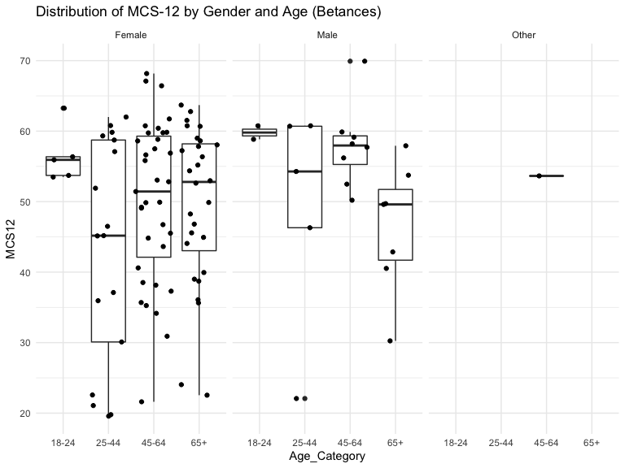
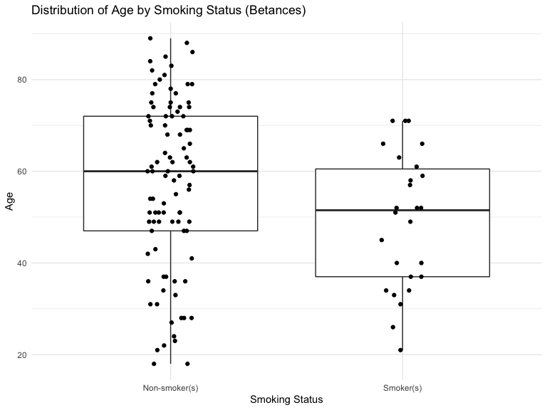

Data Cleaning, Preliminary Analysis, and Final Data Analysis
================
Dionna Attinson
2/7/2020

``` r
SurveyData = 
  readxl::read_xls('./SFH_Survey_CODED_CLEANED.xls') %>% 
  janitor::clean_names()
```

### Data Cleaning and Recoding (Betances Data)

``` r
SurveyData =
 SurveyData %>% 
 rename(Gender = x1_to_which_gender_identity_do_you_most_identify_selected_choice,
        Education = x3_what_is_the_highest_level_of_education_you_have_completed_selected_choice,
        Race = x4_which_best_describes_your_race_ethnicity_check_all_that_apply_selected_choice,
        Income = x7_hand_participant_income_card_which_of_these_groups_on_this_card_is_closest_to_your_total_personal_income_before_taxes_during_the_last_year_please_include_income_from_all_sources_your_salaries_wages_and_any_benefits_including_social_security_welfare_gifts_or_any_other_income_please_do_not_include_food_stamps_or_rental_subsidies_tell_me_the_code_for_the_amount_you_got_last_year_or_the_code_for_the_amount_you_usually_get_per_month_if_necessary_work_with_resident_to_construct_a_monthly_personal_and_household_income,
        
        DelayedRent = x11_during_the_past_12_months_was_there_any_month_when_you_your_family_delayed_paying_or_were_not_able_to_pay_your_rent)
```

##### In the code chunk below, a number of variables were recoded as binary.

  - `Smoke` was the variable that identified the smoking status of an
    individual. Those who responded that they smoke ANY products
    including marijuana, THC, hash, hookah, E-cigarettes, Cigarettes or
    Cigarillos were coded as `1` = Smoker. Those who responded that they
    did not smoke any products were coded as `0`, Non-smoker.
  - Evidence of mice/rats, cockroaches, and having a mildew odor present
    in the home were all coded as `1` = Yes, `0` = No.

<!-- end list -->

``` r
VariablesofInterest = 
  SurveyData %>% 
  select(age, Gender, Race, pss_5, pss_6, pss_8, pss_9, pss_10, sf36_1, sf36_4, 
        sf36_6, sf36_14, sf36_15, sf36_18, sf36_19, sf36_22, sf36_26, sf36_27, sf36_28,
        sf36_32, Education, Income, moved_in_last_5_years, DelayedRent, repairs_needed,
        asthma, anxiety, lungd, depression, heartdisease, cancer, diabetes,hypertension,       
        products_used, neg_health_building, micerats, cockroaches, mildew, homesat, buildsat,
        neighborhoodsat, propmansat, sumtempsat, wintempsat) %>% 
  
  rename(Smoke = products_used) %>% 
  rename(Age = age) %>% 
  mutate(Smoke = recode(Smoke, 
                    "Dont smoke" = "0",
                    "Cigarettes and/or Cigarillos (common brands are Marlboro, Black & Mild)" = "1",
                    "Hookah" = "1",
                    "Cigarettes and/or Cigarillos (common brands are Marlboro, Black & Mild) ,Marijuana, hash, THC, grass, pot, or weed" = "1",
                    "Cigarettes and/or Cigarillos (common brands are Marlboro, Black & Mild) ,E-cigarettes (look like regular cigarettes, but are battery-powered),Marijuana, hash, THC, grass, pot, or weed,Hookah" = "1",
                    "E-cigarettes (look like regular cigarettes, but are battery-powered)" = "1",
                   "Marijuana, hash, THC, grass, pot, or weed" = "1"),
        micerats = recode(micerats, 
                          "Yes" = "1", 
                          "No" = "0"),
        cockroaches = recode(cockroaches, 
                             "Yes" = "1", 
                             "No" = "0"),
        mildew = recode(mildew, 
                            "Yes" = "1",
                            "No" = "0"),
        neg_health_building = recode(neg_health_building, 
                                      "Yes" = "1",
                                      "No" = "0"),
        Race = recode(Race,
                      "Hispanic or Latino" = "Hispanic or Latinx",
                      "Other, specify:" = "Other",
                      "Hispanic or Latino,Native American/ Alaskan Native" = "Other",
                      "Non- Hispanic Black or African American,Asian or Pacific Islander" = "Other",
                      "Non- Hispanic Black or African American,Hispanic or Latino" = "Other",
                      "Non-Hispanic White,Non- Hispanic Black or African American,Hispanic or Latino,Native American/ Alaskan Native,Asian or Pacific Islander" = "Other"),
  DelayedRent = recode(DelayedRent, 
                             "Yes" = "1",
                             "No" = "0"))
```

##### Below, I scored the Perceived Stress Scale (PSS-4) and the SF-12. The PSS coding instructions were as follows: code `0` - never, `1` - almost never, `2` - sometimes, `3` - fairly often, `4` - very often & reverse your scores for questions 4, 5, 7, and 8. On these 4 questions, change the scores to: 0 = 4, 1 = 3, 2 = 2, 3 = 1, 4 = 0.

``` r
##PSS Scale
CodedData_VariablesofInterest =
  VariablesofInterest %>% 
  mutate(
    pss_5_coded = pss_5,
    pss_6_coded = pss_6,
    pss_8_coded = pss_8,
    pss_9_coded = pss_9,
    pss_10_coded = pss_10, 
    gh1 = sf36_1,
    pf02 = sf36_4,  
    pf04 = sf36_6,
    rp2 = sf36_14,  
    rp3 = sf36_15,  
    re2 = sf36_18,
    re3 = sf36_19,
    bp2 = sf36_22,
    mh3 = sf36_26,
    vt2 = sf36_27,
    mh4 = sf36_28,
    sf2 = sf36_32) %>% 
    
  mutate(pss_5_coded = recode(pss_5_coded, 
                        "Never" = "4",
                        "Almost never" = "3",
                        "Sometimes" = "2", 
                        "Fairly often" = "1",
                        "Very often" = "0"), 
         pss_6_coded = recode(pss_6_coded, 
                        "Never" = "0",
                        "Almost never" = "1",
                        "Sometimes" = "2", 
                        "Fairly often" = "3",
                        "Very often" = "4"),
         pss_8_coded = recode(pss_8_coded, 
                        "Never" = "4",
                        "Almost never" = "3",
                        "Sometimes" = "2", 
                        "Fairly often" = "1",
                        "Very often" = "0"),
         pss_9_coded = recode(pss_9_coded, 
                        "Never" = "0",
                        "Almost never" = "1",
                        "Sometimes" = "2", 
                        "Fairly often" = "3",
                        "Very often" = "4"),
         pss_10_coded = recode(pss_10_coded, 
                        "Never" = "0",
                        "Almost never" = "1",
                        "Sometimes" = "2", 
                        "Fairly often" = "3",
                        "Very often" = "4"),
         gh1 = recode(gh1,
                         "Excellent" = "1",
                         "Very Good" = "2",
                         "Good" = "3",
                         "Fair" = "4",
                         "Poor" = "5"),
         pf02 = recode(pf02, 
                         "Yes, limited a lot" = "1",
                         "Yes, limited a little" = "2",
                         "No, not limited at all" = "3"),
         pf04 = recode(pf04, 
                         "Yes, limited a lot" = "1",
                         "Yes, limited a little" = "2",
                         "No, not limited at all" = "3"),
         rp2 = recode(rp2, 
                         "Yes" = "1",
                         "No" = "2"),
         rp3 = recode(rp3, 
                         "Yes" = "1",
                         "No" = "2"), 
         re2 = recode(re2, 
                         "Yes" = "1",
                         "No" = "2"), 
         re3 = recode(re3, 
                         "Yes" = "1",
                         "No" = "2"),
         bp2 = recode(bp2,
                         "Not at all" = "1",
                         "A little bit" = "2",
                         "Moderately" = "3",
                         "Quite a bit" = "4",
                         "Extremely" = "5"),
         mh3 =  recode(mh3,
                          "All of the time" = "1",
                          "Most of the time" = "2",
                          "A good bit of the time" = "3",
                          "Some of the time" = "4",
                          "A little of the time" = "5",
                          "None of the time" = "6"),
         vt2 = recode(vt2,
                          "All of the time" = "1",
                          "Most of the time" = "2",
                          "A good bit of the time" = "3",
                          "Some of the time" = "4",
                          "A little of the time" = "5",
                          "None of the time" = "6"),
         mh4 = recode(mh4,
                          "All of the time" = "1",
                          "Most of the time" = "2",
                          "A good bit of the time" = "3",
                          "Some of the time" = "4",
                          "A little of the time" = "5",
                          "None of the time" = "6"),
         sf2 = recode(sf2,
                         "All of the time" = "1",
                         "Most of the time" = "2",
                         "Some of the time" = "3",
                         "A little of the time" = "4",
                         "None of the time" = "5")) 
```

##### The code chunk below now represents the second step of scoring the SF-12. This requires reversing the scores of certain questions so that a higher SF-12 score means better health.

``` r
CodedData_VariablesofInterest = 
  CodedData_VariablesofInterest %>% 
  mutate(
     gh1 = recode(gh1,
                         "1" = "5",
                         "2" = "4",
                         "3" = "3",
                         "4" = "2",
                         "5" = "1"),
         bp2 = recode(bp2,
                          "1" = "6",
                          "2" = "5",
                          "3" = "4",
                          "4" = "3",
                          "5" = "2",
                          "6" = "1"),
         mh3 = recode(mh3,
                          "1" = "6",
                          "2" = "5",
                          "3" = "4",
                          "4" = "3",
                          "5" = "2",
                          "6" = "1"),
         vt2 = recode(vt2,
                          "1" = "6",
                          "2" = "5",
                          "3" = "4",
                          "4" = "3",
                          "5" = "2",
                          "6" = "1"))
```

##### Next, I created dummy variables for each of the SF-12 variables.

``` r
  CodedData_VariablesofInterest$pf02_1 <- as.numeric(CodedData_VariablesofInterest$pf02 == 1L) 
  CodedData_VariablesofInterest$pf02_2 <- as.numeric(CodedData_VariablesofInterest$pf02 == 2L) 
  CodedData_VariablesofInterest$pf04_1 <- as.numeric(CodedData_VariablesofInterest$pf04 == 1L) 
  CodedData_VariablesofInterest$pf04_2 <- as.numeric(CodedData_VariablesofInterest$pf04 == 2L) 
  CodedData_VariablesofInterest$rp2_1 <- as.numeric(CodedData_VariablesofInterest$rp2 == 1L) 
  CodedData_VariablesofInterest$rp3_1 <- as.numeric(CodedData_VariablesofInterest$rp3 == 1L) 
  CodedData_VariablesofInterest$bp2_1 <- as.numeric(CodedData_VariablesofInterest$bp2 == 1L) 
  CodedData_VariablesofInterest$bp2_2 <- as.numeric(CodedData_VariablesofInterest$bp2 == 2L) 
  CodedData_VariablesofInterest$bp2_3 <- as.numeric(CodedData_VariablesofInterest$bp2 == 3L) 
  CodedData_VariablesofInterest$bp2_4 <- as.numeric(CodedData_VariablesofInterest$bp2 == 4L) 
  CodedData_VariablesofInterest$gh1_1 <- as.numeric(CodedData_VariablesofInterest$gh1 == 1L) 
  CodedData_VariablesofInterest$gh1_2 <- as.numeric(CodedData_VariablesofInterest$gh1 == 2L) 
  CodedData_VariablesofInterest$gh1_3 <- as.numeric(CodedData_VariablesofInterest$gh1 == 3L) 
  CodedData_VariablesofInterest$gh1_4 <- as.numeric(CodedData_VariablesofInterest$gh1 == 4L) 
  CodedData_VariablesofInterest$vt2_1 <- as.numeric(CodedData_VariablesofInterest$vt2 == 1L) 
  CodedData_VariablesofInterest$vt2_2 <- as.numeric(CodedData_VariablesofInterest$vt2 == 2L) 
  CodedData_VariablesofInterest$vt2_3 <- as.numeric(CodedData_VariablesofInterest$vt2 == 3L) 
  CodedData_VariablesofInterest$vt2_4 <- as.numeric(CodedData_VariablesofInterest$vt2 == 4L) 
  CodedData_VariablesofInterest$vt2_5 <- as.numeric(CodedData_VariablesofInterest$vt2 == 5L) 
  CodedData_VariablesofInterest$sf2_1 <- as.numeric(CodedData_VariablesofInterest$sf2 == 1L) 
  CodedData_VariablesofInterest$sf2_2 <- as.numeric(CodedData_VariablesofInterest$sf2 == 2L) 
  CodedData_VariablesofInterest$sf2_3 <- as.numeric(CodedData_VariablesofInterest$sf2 == 3L) 
  CodedData_VariablesofInterest$sf2_4 <- as.numeric(CodedData_VariablesofInterest$sf2 == 4L) 
  CodedData_VariablesofInterest$re2_1 <- as.numeric(CodedData_VariablesofInterest$re2 == 1L) 
  CodedData_VariablesofInterest$re3_1 <- as.numeric(CodedData_VariablesofInterest$re3 == 1L) 
  CodedData_VariablesofInterest$mh3_1 <- as.numeric(CodedData_VariablesofInterest$mh3 == 1L) 
  CodedData_VariablesofInterest$mh3_2 <- as.numeric(CodedData_VariablesofInterest$mh3 == 2L) 
  CodedData_VariablesofInterest$mh3_3 <- as.numeric(CodedData_VariablesofInterest$mh3 == 3L) 
  CodedData_VariablesofInterest$mh3_4 <- as.numeric(CodedData_VariablesofInterest$mh3 == 4L) 
  CodedData_VariablesofInterest$mh3_5 <- as.numeric(CodedData_VariablesofInterest$mh3 == 5L) 
  CodedData_VariablesofInterest$mh4_1 <- as.numeric(CodedData_VariablesofInterest$mh4 == 1L) 
  CodedData_VariablesofInterest$mh4_2 <- as.numeric(CodedData_VariablesofInterest$mh4 == 2L) 
  CodedData_VariablesofInterest$mh4_3 <- as.numeric(CodedData_VariablesofInterest$mh4 == 3L) 
  CodedData_VariablesofInterest$mh4_4 <- as.numeric(CodedData_VariablesofInterest$mh4 == 4L) 
  CodedData_VariablesofInterest$mh4_5 <- as.numeric(CodedData_VariablesofInterest$mh4 == 5L) 
```

##### I then created SF-12 weights and aggregates of indicator variables using physical and mental regression weights.

``` r
CodedData_VariablesofInterest = 
  CodedData_VariablesofInterest %>% 
  mutate(RAWPCS12 =
                   (-7.23216*pf02_1) + (-3.45555*pf02_2) +
                   (-6.24397*pf04_1) + (-2.73557*pf04_2) +
                   (-4.61617*rp2_1) + 
                   (-5.51747*rp3_1) +
                   (-11.25544*bp2_1) + (-8.38063*bp2_2) +
                   (-6.50522*bp2_3) + (-3.80130*bp2_4) + (-8.37399*gh1_1) +
                   (-5.56461*gh1_2) + (-3.02396*gh1_3) + (-1.31872*gh1_4) +
                   (-2.44706*vt2_1) + (-2.02168*vt2_2) + (-1.6185*vt2_3) +
                   (-1.14387*vt2_4) + (-0.42251*vt2_5) + (-0.33682*sf2_1) +
                   (-0.94342*sf2_2) + (-0.18043*sf2_3) + (0.11038*sf2_4) +
                   (3.04365*re2_1) + (2.32091*re3_1) + (3.46638*mh3_1) +
                   (2.90426*mh3_2) + (2.37241*mh3_3) + (1.36689*mh3_4) +
                   (0.66514*mh3_5) + (4.61446*mh4_1) + (3.41593*mh4_2) +
                   (2.34247*mh4_3) + (1.28044*mh4_4) + (0.41188*mh4_5),

           RAWMCS12 =
                   (3.93115*pf02_1) + (1.8684*pf02_2) +
                   (2.68282*pf04_1) + (1.43103*pf04_2) + (1.4406*rp2_1) +
                   (1.66968*rp3_1) + (1.48619*bp2_1) + (1.76691*bp2_2) +
                   (1.49384*bp2_3) + (0.90384*bp2_4) + (-1.71175*gh1_1) +
                   (-0.16891*gh1_2) + (0.03482*gh1_3) + (-0.06064*gh1_4) +
                   (-6.02409*vt2_1) + (-4.88962*vt2_2) + (-3.29805*vt2_3) +
                   (-1.65178*vt2_4) + (-0.92057*vt2_5) + (-6.29724*sf2_1) +
                   (-8.26066*sf2_2) + (-5.63286*sf2_3) + (-3.13896*sf2_4) +
                   (-6.82672*re2_1) + (-5.69921*re3_1) + (-10.19085*mh3_1) +
                   (-7.92717*mh3_2) + (-6.31121*mh3_3) + (-4.09842*mh3_4) +
                   (-1.94949*mh3_5) + (-16.15395*mh4_1) + (-10.77911*mh4_2) +
                   (-8.09914*mh4_3) + (-4.59055*mh4_4) + (-1.95934*mh4_5))
```

##### We then computed a norm-based standardization to PCS12 and MCS12.

``` r
CodedData_VariablesofInterest = 
  CodedData_VariablesofInterest %>% 
  mutate(
  PCS12 = (RAWPCS12 + 56.57706),
  MCS12 = (RAWMCS12 + 60.75781))
```

``` r
CodedData_VariablesofInterest = 
  CodedData_VariablesofInterest %>% 
  mutate(
pss_5_coded =  as.numeric(pss_5_coded),
pss_6_coded =  as.numeric(pss_6_coded),
pss_8_coded = as.numeric(pss_8_coded),
pss_9_coded = as.numeric(pss_9_coded),
pss_10_coded = as.numeric(pss_10_coded))
```

##### For the SF-12 scale, a standardized SF-12 score was created for both physical and mental health for each participant. This resulted in the variables `PCS12` and `MCS12`. The higher the SF-12 scores, the better their overall health-related quality of life.

##### For the PSS scale, a total score was created from the questions which became the variable `total_PSS_score`. I then created stress categories for future categorical analysis:

  - Scores ranging from 0-6 would be considered low stress.
  - Scores ranging from 7-13 ould be considered moderate stress.
  - Scores ranging from 14-20 would be considered high perceived
stress.

##### Further, several other variables were transformed. Age was transformed to a categorical variable, creating the age groups of 18-24, 25-44, 45-64, and 65+. Gender was transformed into a binary variable (0 = male, 1 = female), and a Housing Satisfaction Score was created. A higher score indicates higher overall housing satisfaction. This score was created based off of the totals of four questions:

  - The participant’s satisfaction with their apartment
  - The participant’s satisfcation with their building
  - The participant’s satisfcation with their neighbhorhood
  - The participant’s satisfaction with their property management
  - The participant’s satisfcation with their apartment’s temperature in
    the summer
  - The participant’s satisfaction with their apartment’s temperature in
    the
winter

##### Lastly, a binary chronic disease outcome was created. If a participant responded that they or someone in their home have the following conditions, they were coded as `1`:

  - Cancer
  - Heart Disease
  - Diabetes
  - Hypertension
  - Asthma
  - Lung Disease
  - Anxiety
  - Depression

<!-- end list -->

``` r
CodedData_VariablesofInterest = 
CodedData_VariablesofInterest %>% 
  mutate(
    total_PSS_score = pss_5_coded + pss_6_coded + pss_8_coded + pss_9_coded + pss_10_coded,
    PSS_Category = total_PSS_score, 
    PSS_Category = 
          case_when(PSS_Category >= 14 ~ 'High Perceived Stress',
                    PSS_Category >= 7 ~ 'Moderate Stress',
                    PSS_Category >= 0  ~ 'Low Stress'),
    Age_Category = Age,
    Age_Category = 
          case_when(Age_Category >= 65  ~ '65+',
                    Age_Category >= 45  ~ '45-64',
                    Age_Category >= 25 ~ '25-44',
                    Age_Category >= 18 ~ '18-24'),
    Gender = recode(Gender, 
                          `Other, please specify:` = "Other"),
    AptSat_Coded = homesat, 
    AptSat_Coded = recode(AptSat_Coded,
                          "Very Dissatisfied" = "1",
                          "Dissatisfied" = "2", 
                          "Satisfied" = "3",
                          "Very Satisfied" ="4"), 
    BuildingSat_Coded = buildsat, 
    BuildingSat_Coded = recode(BuildingSat_Coded,
                          "Very Dissatisfied" = "1",
                          "Dissatisfied" = "2", 
                          "Satisfied" = "3",
                          "Very Satisfied" ="4"),
    NeighborhoodSat_Coded = neighborhoodsat, 
    NeighborhoodSat_Coded = recode(NeighborhoodSat_Coded,
                          "Very Dissatisfied" = "1",
                          "Dissatisfied" = "2", 
                          "Satisfied" = "3",
                          "Very Satisfied" ="4"),
   PropertyManSat_Coded = propmansat,
   PropertyManSat_Coded = recode(PropertyManSat_Coded,
                          "Very Dissatisfied" = "1",
                          "Dissatisfied" = "2", 
                          "Satisfied" = "3",
                          "Very Satisfied" ="4"),
   WinTempSat_Coded = wintempsat, 
   WinTempSat_Coded = recode(WinTempSat_Coded,
                          "Very Dissatisfied" = "1",
                          "Dissatisfied" = "2", 
                          "Satisfied" = "3",
                          "Very Satisfied" ="4"), 
   SumTempSat_Coded = sumtempsat, 
   SumTempSat_Coded = recode(SumTempSat_Coded,
                          "Very Dissatisfied" = "1",
                          "Dissatisfied" = "2", 
                          "Satisfied" = "3",
                          "Very Satisfied" ="4"),
   WinTempSat_Coded = as.numeric(WinTempSat_Coded),
   SumTempSat_Coded = as.numeric(SumTempSat_Coded),
   AptSat_Coded = as.numeric(AptSat_Coded), 
   BuildingSat_Coded = as.numeric(BuildingSat_Coded),
   NeighborhoodSat_Coded = as.numeric(NeighborhoodSat_Coded),
   PropertyManSat_Coded = as.numeric(PropertyManSat_Coded),
   asthma = as.numeric(asthma),
   heartdisease = as.numeric(heartdisease),
   lungd = as.numeric(lungd),
   anxiety = as.numeric(anxiety),
   depression = as.numeric(depression),
   cancer = as.numeric(cancer),
   hypertension = as.numeric(hypertension),
   diabetes = as.numeric(diabetes),
   Chronic_Disease = asthma + heartdisease + lungd + anxiety + depression + cancer + hypertension + diabetes,
   Chronic_Disease = 
          case_when(Chronic_Disease >= 1 ~ '1',
                    Chronic_Disease == 0 ~ '0'))
```

``` r
CodedData_VariablesofInterest = 
  CodedData_VariablesofInterest %>% 
  mutate(
  PropertyManSat_Coded = na_mean(PropertyManSat_Coded),
  WinTempSat_Coded = na_mean(WinTempSat_Coded),
  HousingSatisfactionScore = AptSat_Coded + BuildingSat_Coded + NeighborhoodSat_Coded + PropertyManSat_Coded + WinTempSat_Coded + SumTempSat_Coded,
  Satisfaction_Category = HousingSatisfactionScore,
  Satisfaction_Category = 
          case_when(Satisfaction_Category >= 18 ~ 'High Satisfaction',
                    Satisfaction_Category >= 12 ~ 'Moderate Satisfaction',
                    Satisfaction_Category >= 6  ~ 'Low Satisfaction'))
```

##### Below, I changed variables into factors and numeric values.

``` r
CodedData_VariablesofInterest = 
  CodedData_VariablesofInterest %>% 
  mutate(
    Education = as.factor(Education),
    Gender = as.factor(Gender),
    Race = as.factor(Race),
    Chronic_Disease = as.factor(Chronic_Disease), 
    Age = as.numeric(Age),
    Income = factor(Income, levels = c("1", "2", "3", "4", "5", "6","7","8","9","10")),
    Smoke = factor(Smoke, levels = c("0", "1")),
    DelayedRent = factor(DelayedRent, levels = c("0","1")),
    asthma = factor(asthma, levels = c("0","1")),
    lungd = factor(lungd, levels = c("0","1")),
    heartdisease = factor(heartdisease, levels = c("0","1")),
    anxiety = factor(anxiety, levels = c("0","1")),
    depression = factor(depression, levels = c("0","1")),
    cancer = factor(cancer,levels = c("0","1")),
    diabetes = factor(diabetes,levels = c("0","1")),
    micerats = factor(micerats,levels = c("0","1")),
    mildew = factor(mildew,levels = c("0","1")),
    cockroaches = factor(cockroaches,levels = c("0","1")),
    repairs_needed = factor(repairs_needed,levels = c("0","1")),
    moved_in_last_5_years = factor(moved_in_last_5_years,levels = c("0","1")),
    Chronic_Disease = factor(Chronic_Disease,levels = c("0","1")),
    Education = factor(Education, levels = c("Less than High School", "High School/Secondary School Diploma", "G.E.D.", "Vocational School", "Some College", "2 Year Community College Degree", "4 Year College Degree", "Post-Graduate Degree"))
  )
```

##### In order to collapse education categories into fewer groups, education levels were finalized into three categories:

  - Less than high school (included those who never attended school, or
    did not complete a high school degree/G.E.D)
  - High school/G.E.D
  - Post High School Education (included those who attended vocational
    school, some college, 2-year/4-year college degree, and post
    graduate education)

<!-- end list -->

``` r
CodedData_VariablesofInterest = 
CodedData_VariablesofInterest %>% 
  mutate(Education = as.character(Education))
```

``` r
CodedData_VariablesofInterest[99, "Education"] = "Never Attended School"
CodedData_VariablesofInterest[33, "Education"] = "Some College"
CodedData_VariablesofInterest[20, "Education"] = "Some College"
CodedData_VariablesofInterest[53, "Education"] = NA
```

``` r
CodedData_VariablesofInterest = 
  CodedData_VariablesofInterest %>% 
  mutate(
  Education_Group = Education, 
  Education_Group = recode(Education_Group, 
                    "Never Attended School" = "Less than High School",
                    "Vocational School" = "Post High School Education",
                    "Some College" = "Post High School Education",
                    "2 Year Community College Degree" = "Post High School Education",
                    "4 Year College Degree" = "Post High School Education",
                    "Post-Graduate Degree" = "Post High School Education",
                    "High School/Secondary School Diploma" =    "High School/G.E.D.",
                    "G.E.D." = "High School/G.E.D."),
   Education_Group = factor(Education_Group, levels = c("Less than High School", "High School/G.E.D.", "Post High School Education")))
```

``` r
CodedData_VariablesofInterest = 
  CodedData_VariablesofInterest %>% 
  mutate(Education_Group = as.factor(Education_Group))
```

##### In order to collapse income categories into fewer groups, education levels were finalized into three categories:

  - `1` - Total personal income less than $10,000/year
  - `2` - Total personal income between $10,000 - $24,999/year
  - `3` - Total personal income $25,000k + /year

<!-- end list -->

``` r
CodedData_VariablesofInterest = 
  CodedData_VariablesofInterest %>% 
  mutate(
  Income_Group = Income, 
  Income_Group = recode(Income_Group, 
                    "2" = "1",
                    "3" = "1",
                    "4" = "2",
                    "5" = "2",
                    "6" = "3",
                    "7" = "3",
                    "8" = "3",
                    "9" = "3",
                    "10" = "3"),
  Income_Group = factor(Income_Group,levels= c("1","2","3")))
```

### Univariable/Descriptive Analyses

##### The tables below provide descriptive analyses of the independent and dependent variables.

#### Outcome Variables

##### Overall Physical Health Status (Outcome 1)

``` r
CodedData_VariablesofInterest %>% 
  select(PCS12) %>% 
  summary() %>% 
  knitr::kable(col.names = c("Summary of Self-Reported Physical Health"))
```

<table>

<thead>

<tr>

<th style="text-align:left;">

</th>

<th style="text-align:left;">

Summary of Self-Reported Physical Health

</th>

</tr>

</thead>

<tbody>

<tr>

<td style="text-align:left;">

</td>

<td style="text-align:left;">

Min. :14.86

</td>

</tr>

<tr>

<td style="text-align:left;">

</td>

<td style="text-align:left;">

1st Qu.:32.52

</td>

</tr>

<tr>

<td style="text-align:left;">

</td>

<td style="text-align:left;">

Median :44.05

</td>

</tr>

<tr>

<td style="text-align:left;">

</td>

<td style="text-align:left;">

Mean :43.03

</td>

</tr>

<tr>

<td style="text-align:left;">

</td>

<td style="text-align:left;">

3rd Qu.:54.75

</td>

</tr>

<tr>

<td style="text-align:left;">

</td>

<td style="text-align:left;">

Max. :63.81

</td>

</tr>

<tr>

<td style="text-align:left;">

</td>

<td style="text-align:left;">

NA’s :1

</td>

</tr>

</tbody>

</table>

``` r
CodedData_VariablesofInterest %>% 
  drop_na() %>% 
  group_by(PCS12, Age_Category, Gender) %>% 
  summarize(n = n()) %>% 
    ggplot(aes(x= Age_Category, y = PCS12)) + geom_boxplot() +
  geom_jitter() +  facet_grid(. ~ Gender)
```


##### Overall Mentall Health Status (Outcome 2)

``` r
CodedData_VariablesofInterest %>% 
  select(MCS12) %>% 
  summary() %>% 
  knitr::kable(col.names = c("Summary of Self-Reported Mental Health"))
```

<table>

<thead>

<tr>

<th style="text-align:left;">

</th>

<th style="text-align:left;">

Summary of Self-Reported Mental Health

</th>

</tr>

</thead>

<tbody>

<tr>

<td style="text-align:left;">

</td>

<td style="text-align:left;">

Min. :19.57

</td>

</tr>

<tr>

<td style="text-align:left;">

</td>

<td style="text-align:left;">

1st Qu.:43.25

</td>

</tr>

<tr>

<td style="text-align:left;">

</td>

<td style="text-align:left;">

Median :53.49

</td>

</tr>

<tr>

<td style="text-align:left;">

</td>

<td style="text-align:left;">

Mean :49.86

</td>

</tr>

<tr>

<td style="text-align:left;">

</td>

<td style="text-align:left;">

3rd Qu.:58.84

</td>

</tr>

<tr>

<td style="text-align:left;">

</td>

<td style="text-align:left;">

Max. :69.92

</td>

</tr>

<tr>

<td style="text-align:left;">

</td>

<td style="text-align:left;">

NA’s :1

</td>

</tr>

</tbody>

</table>

``` r
CodedData_VariablesofInterest %>% 
  drop_na() %>% 
  group_by(MCS12, Age_Category, Gender) %>% 
  summarize(n = n()) %>% 
    ggplot(aes(x= Age_Category, y = MCS12)) + geom_boxplot() +
  geom_jitter() +  facet_grid(. ~ Gender)
```



#### Independent Variables

``` r
CodedData_VariablesofInterest %>% 
  group_by(Smoke) %>% 
  summarize(n=n()) %>% 
  mutate(
    percent = n/124*100) %>% 
  mutate(
    Smoke = recode(Smoke,
                   "0" = "Non-smoker(s)",
                   "1" = "Smoker(s)")) %>% 
  knitr::kable(col.names=c("Smoking Status", "n", "Percent(%)"), digits = 2)
```

<table>

<thead>

<tr>

<th style="text-align:left;">

Smoking Status

</th>

<th style="text-align:right;">

n

</th>

<th style="text-align:right;">

Percent(%)

</th>

</tr>

</thead>

<tbody>

<tr>

<td style="text-align:left;">

Non-smoker(s)

</td>

<td style="text-align:right;">

97

</td>

<td style="text-align:right;">

78.23

</td>

</tr>

<tr>

<td style="text-align:left;">

Smoker(s)

</td>

<td style="text-align:right;">

27

</td>

<td style="text-align:right;">

21.77

</td>

</tr>

</tbody>

</table>

``` r
CodedData_VariablesofInterest %>% 
  group_by(Race) %>% 
  summarize(n=n()) %>%
   mutate(
  percent = n/124*100) %>% 
  mutate(
    Race = recode(Race,
                  "Other, specify:" = "Other")
  ) %>% 
  knitr::kable(col.names=c("Race/Ethnicity", "n", "Percent(%)"), digits = 2)
```

<table>

<thead>

<tr>

<th style="text-align:left;">

Race/Ethnicity

</th>

<th style="text-align:right;">

n

</th>

<th style="text-align:right;">

Percent(%)

</th>

</tr>

</thead>

<tbody>

<tr>

<td style="text-align:left;">

Hispanic or Latinx

</td>

<td style="text-align:right;">

87

</td>

<td style="text-align:right;">

70.16

</td>

</tr>

<tr>

<td style="text-align:left;">

Non- Hispanic Black or African American

</td>

<td style="text-align:right;">

26

</td>

<td style="text-align:right;">

20.97

</td>

</tr>

<tr>

<td style="text-align:left;">

Other

</td>

<td style="text-align:right;">

11

</td>

<td style="text-align:right;">

8.87

</td>

</tr>

</tbody>

</table>

``` r
CodedData_VariablesofInterest %>% 
  group_by(Age_Category) %>% 
  summarize(n=n()) %>%
  mutate(
  percent = n/124*100) %>% 
  knitr::kable(col.names=c("Age Group", "n", "Percent(%)"), digits = 2)
```

<table>

<thead>

<tr>

<th style="text-align:left;">

Age Group

</th>

<th style="text-align:right;">

n

</th>

<th style="text-align:right;">

Percent(%)

</th>

</tr>

</thead>

<tbody>

<tr>

<td style="text-align:left;">

18-24

</td>

<td style="text-align:right;">

7

</td>

<td style="text-align:right;">

5.65

</td>

</tr>

<tr>

<td style="text-align:left;">

25-44

</td>

<td style="text-align:right;">

25

</td>

<td style="text-align:right;">

20.16

</td>

</tr>

<tr>

<td style="text-align:left;">

45-64

</td>

<td style="text-align:right;">

47

</td>

<td style="text-align:right;">

37.90

</td>

</tr>

<tr>

<td style="text-align:left;">

65+

</td>

<td style="text-align:right;">

43

</td>

<td style="text-align:right;">

34.68

</td>

</tr>

<tr>

<td style="text-align:left;">

NA

</td>

<td style="text-align:right;">

2

</td>

<td style="text-align:right;">

1.61

</td>

</tr>

</tbody>

</table>

``` r
CodedData_VariablesofInterest %>% 
  group_by(Gender) %>% 
  summarize(n=n()) %>%
  mutate(
  percent = n/124*100) %>% 
  knitr::kable(col.names=c("Gender", "n", "Percent(%)"), digits = 2)
```

<table>

<thead>

<tr>

<th style="text-align:left;">

Gender

</th>

<th style="text-align:right;">

n

</th>

<th style="text-align:right;">

Percent(%)

</th>

</tr>

</thead>

<tbody>

<tr>

<td style="text-align:left;">

Female

</td>

<td style="text-align:right;">

97

</td>

<td style="text-align:right;">

78.23

</td>

</tr>

<tr>

<td style="text-align:left;">

Male

</td>

<td style="text-align:right;">

26

</td>

<td style="text-align:right;">

20.97

</td>

</tr>

<tr>

<td style="text-align:left;">

Other

</td>

<td style="text-align:right;">

1

</td>

<td style="text-align:right;">

0.81

</td>

</tr>

</tbody>

</table>

``` r
CodedData_VariablesofInterest %>% 
  drop_na() %>% 
  group_by(Age, Gender) %>% 
  ggplot(aes(x=Gender, y=Age)) + geom_violin() +
  labs(x = "Gender",
      y = "Age",
      title = "Figure 1. Distribution of Age by Gender")
```


``` r
CodedData_VariablesofInterest %>% 
  drop_na() %>% 
  select(Gender, Age) %>% 
  group_by(Gender) %>% 
  summarize(Mean = mean(Age),
            SD = sd(Age)) %>% 
  knitr::kable(col.names=c("Gender", "Mean Age", "SD"), digits = 2)
```

<table>

<thead>

<tr>

<th style="text-align:left;">

Gender

</th>

<th style="text-align:right;">

Mean Age

</th>

<th style="text-align:right;">

SD

</th>

</tr>

</thead>

<tbody>

<tr>

<td style="text-align:left;">

Female

</td>

<td style="text-align:right;">

54.87

</td>

<td style="text-align:right;">

17.43

</td>

</tr>

<tr>

<td style="text-align:left;">

Male

</td>

<td style="text-align:right;">

55.32

</td>

<td style="text-align:right;">

20.09

</td>

</tr>

<tr>

<td style="text-align:left;">

Other

</td>

<td style="text-align:right;">

59.00

</td>

<td style="text-align:right;">

NA

</td>

</tr>

</tbody>

</table>

``` r
CodedData_VariablesofInterest %>% 
  group_by(PSS_Category) %>% 
  summarize(n=n()) %>%
   mutate(
  percent = n/124*100) %>% 
  knitr::kable(col.names=c("Perceived Stress Score", "n", "Percent(%)"), digits = 2)
```

<table>

<thead>

<tr>

<th style="text-align:left;">

Perceived Stress Score

</th>

<th style="text-align:right;">

n

</th>

<th style="text-align:right;">

Percent(%)

</th>

</tr>

</thead>

<tbody>

<tr>

<td style="text-align:left;">

High Perceived Stress

</td>

<td style="text-align:right;">

11

</td>

<td style="text-align:right;">

8.87

</td>

</tr>

<tr>

<td style="text-align:left;">

Low Stress

</td>

<td style="text-align:right;">

54

</td>

<td style="text-align:right;">

43.55

</td>

</tr>

<tr>

<td style="text-align:left;">

Moderate Stress

</td>

<td style="text-align:right;">

55

</td>

<td style="text-align:right;">

44.35

</td>

</tr>

<tr>

<td style="text-align:left;">

NA

</td>

<td style="text-align:right;">

4

</td>

<td style="text-align:right;">

3.23

</td>

</tr>

</tbody>

</table>

``` r
CodedData_VariablesofInterest %>% 
  group_by(Income) %>% 
  summarize(n=n()) %>%
  mutate(
  percent = n/124*100) %>% 
  knitr::kable(col.names=c("Income Category", "n", "Percent(%)"), digits = 2)
```

<table>

<thead>

<tr>

<th style="text-align:left;">

Income Category

</th>

<th style="text-align:right;">

n

</th>

<th style="text-align:right;">

Percent(%)

</th>

</tr>

</thead>

<tbody>

<tr>

<td style="text-align:left;">

1

</td>

<td style="text-align:right;">

16

</td>

<td style="text-align:right;">

12.90

</td>

</tr>

<tr>

<td style="text-align:left;">

2

</td>

<td style="text-align:right;">

9

</td>

<td style="text-align:right;">

7.26

</td>

</tr>

<tr>

<td style="text-align:left;">

3

</td>

<td style="text-align:right;">

28

</td>

<td style="text-align:right;">

22.58

</td>

</tr>

<tr>

<td style="text-align:left;">

4

</td>

<td style="text-align:right;">

24

</td>

<td style="text-align:right;">

19.35

</td>

</tr>

<tr>

<td style="text-align:left;">

5

</td>

<td style="text-align:right;">

29

</td>

<td style="text-align:right;">

23.39

</td>

</tr>

<tr>

<td style="text-align:left;">

6

</td>

<td style="text-align:right;">

3

</td>

<td style="text-align:right;">

2.42

</td>

</tr>

<tr>

<td style="text-align:left;">

7

</td>

<td style="text-align:right;">

5

</td>

<td style="text-align:right;">

4.03

</td>

</tr>

<tr>

<td style="text-align:left;">

8

</td>

<td style="text-align:right;">

3

</td>

<td style="text-align:right;">

2.42

</td>

</tr>

<tr>

<td style="text-align:left;">

9

</td>

<td style="text-align:right;">

2

</td>

<td style="text-align:right;">

1.61

</td>

</tr>

<tr>

<td style="text-align:left;">

10

</td>

<td style="text-align:right;">

2

</td>

<td style="text-align:right;">

1.61

</td>

</tr>

<tr>

<td style="text-align:left;">

NA

</td>

<td style="text-align:right;">

3

</td>

<td style="text-align:right;">

2.42

</td>

</tr>

</tbody>

</table>

``` r
CodedData_VariablesofInterest %>% 
  group_by(Education) %>% 
  summarize(n=n()) %>%
  mutate(
  percent = n/124*100) %>% 
  knitr::kable(col.names=c("Education Completed", "n", "Percent(%)"), digits = 2)
```

<table>

<thead>

<tr>

<th style="text-align:left;">

Education Completed

</th>

<th style="text-align:right;">

n

</th>

<th style="text-align:right;">

Percent(%)

</th>

</tr>

</thead>

<tbody>

<tr>

<td style="text-align:left;">

2 Year Community College Degree

</td>

<td style="text-align:right;">

7

</td>

<td style="text-align:right;">

5.65

</td>

</tr>

<tr>

<td style="text-align:left;">

4 Year College Degree

</td>

<td style="text-align:right;">

6

</td>

<td style="text-align:right;">

4.84

</td>

</tr>

<tr>

<td style="text-align:left;">

G.E.D.

</td>

<td style="text-align:right;">

5

</td>

<td style="text-align:right;">

4.03

</td>

</tr>

<tr>

<td style="text-align:left;">

High School/Secondary School Diploma

</td>

<td style="text-align:right;">

41

</td>

<td style="text-align:right;">

33.06

</td>

</tr>

<tr>

<td style="text-align:left;">

Less than High School

</td>

<td style="text-align:right;">

53

</td>

<td style="text-align:right;">

42.74

</td>

</tr>

<tr>

<td style="text-align:left;">

Never Attended School

</td>

<td style="text-align:right;">

1

</td>

<td style="text-align:right;">

0.81

</td>

</tr>

<tr>

<td style="text-align:left;">

Post-Graduate Degree

</td>

<td style="text-align:right;">

3

</td>

<td style="text-align:right;">

2.42

</td>

</tr>

<tr>

<td style="text-align:left;">

Some College

</td>

<td style="text-align:right;">

4

</td>

<td style="text-align:right;">

3.23

</td>

</tr>

<tr>

<td style="text-align:left;">

Vocational School

</td>

<td style="text-align:right;">

3

</td>

<td style="text-align:right;">

2.42

</td>

</tr>

<tr>

<td style="text-align:left;">

NA

</td>

<td style="text-align:right;">

1

</td>

<td style="text-align:right;">

0.81

</td>

</tr>

</tbody>

</table>

``` r
CodedData_VariablesofInterest %>% 
  group_by(DelayedRent) %>% 
  summarize(n=n()) %>%
  mutate(
  percent = n/124*100) %>% 
  mutate(
    DelayedRent = recode(DelayedRent, 
                         "0" = "No",
                         "1" = "Yes")
  ) %>% 
  knitr::kable(col.names=c("Have Experienced Rent Burden", "n", "Percent(%)"), digits = 2)
```

<table>

<thead>

<tr>

<th style="text-align:left;">

Have Experienced Rent Burden

</th>

<th style="text-align:right;">

n

</th>

<th style="text-align:right;">

Percent(%)

</th>

</tr>

</thead>

<tbody>

<tr>

<td style="text-align:left;">

No

</td>

<td style="text-align:right;">

83

</td>

<td style="text-align:right;">

66.94

</td>

</tr>

<tr>

<td style="text-align:left;">

Yes

</td>

<td style="text-align:right;">

36

</td>

<td style="text-align:right;">

29.03

</td>

</tr>

<tr>

<td style="text-align:left;">

NA

</td>

<td style="text-align:right;">

5

</td>

<td style="text-align:right;">

4.03

</td>

</tr>

</tbody>

</table>

``` r
CodedData_VariablesofInterest %>% 
  group_by(repairs_needed) %>% 
  summarize(n=n()) %>%
  mutate(
  percent = n/124*100) %>% 
  mutate(
    repairs_needed = recode(repairs_needed, 
                         "0" = "No",
                         "1" = "Yes")
  ) %>% 
  knitr::kable(col.names=c("Repairs Needed", "n", "Percent(%)"), digits = 2)
```

<table>

<thead>

<tr>

<th style="text-align:left;">

Repairs Needed

</th>

<th style="text-align:right;">

n

</th>

<th style="text-align:right;">

Percent(%)

</th>

</tr>

</thead>

<tbody>

<tr>

<td style="text-align:left;">

No

</td>

<td style="text-align:right;">

8

</td>

<td style="text-align:right;">

6.45

</td>

</tr>

<tr>

<td style="text-align:left;">

Yes

</td>

<td style="text-align:right;">

116

</td>

<td style="text-align:right;">

93.55

</td>

</tr>

</tbody>

</table>

``` r
CodedData_VariablesofInterest %>% 
  group_by(moved_in_last_5_years) %>% 
  summarize(n=n()) %>%
  mutate(
  percent = n/124*100) %>% 
  mutate(
    moved_in_last_5_years = recode(moved_in_last_5_years, 
                         "0" = "No",
                         "1" = "Yes")
  ) %>% 
  knitr::kable(col.names=c("Moved in Last 5 Years", "n", "Percent(%)"), digits = 2)
```

<table>

<thead>

<tr>

<th style="text-align:left;">

Moved in Last 5 Years

</th>

<th style="text-align:right;">

n

</th>

<th style="text-align:right;">

Percent(%)

</th>

</tr>

</thead>

<tbody>

<tr>

<td style="text-align:left;">

No

</td>

<td style="text-align:right;">

100

</td>

<td style="text-align:right;">

80.65

</td>

</tr>

<tr>

<td style="text-align:left;">

Yes

</td>

<td style="text-align:right;">

23

</td>

<td style="text-align:right;">

18.55

</td>

</tr>

<tr>

<td style="text-align:left;">

NA

</td>

<td style="text-align:right;">

1

</td>

<td style="text-align:right;">

0.81

</td>

</tr>

</tbody>

</table>

### 2x2 Tables and Visualizations

``` r
CodedData_VariablesofInterest %>% 
  group_by(Age_Category, Gender) %>% 
  summarize(n=n()) %>%
  pivot_wider(
    names_from = Gender,
    values_from = n) %>% 
  knitr::kable(col.names = c("Age Group","Female (n)", "Male (n)", "Other (n)"))
```

<table>

<thead>

<tr>

<th style="text-align:left;">

Age Group

</th>

<th style="text-align:right;">

Female (n)

</th>

<th style="text-align:right;">

Male (n)

</th>

<th style="text-align:right;">

Other (n)

</th>

</tr>

</thead>

<tbody>

<tr>

<td style="text-align:left;">

18-24

</td>

<td style="text-align:right;">

5

</td>

<td style="text-align:right;">

2

</td>

<td style="text-align:right;">

NA

</td>

</tr>

<tr>

<td style="text-align:left;">

25-44

</td>

<td style="text-align:right;">

19

</td>

<td style="text-align:right;">

6

</td>

<td style="text-align:right;">

NA

</td>

</tr>

<tr>

<td style="text-align:left;">

45-64

</td>

<td style="text-align:right;">

38

</td>

<td style="text-align:right;">

8

</td>

<td style="text-align:right;">

1

</td>

</tr>

<tr>

<td style="text-align:left;">

65+

</td>

<td style="text-align:right;">

33

</td>

<td style="text-align:right;">

10

</td>

<td style="text-align:right;">

NA

</td>

</tr>

<tr>

<td style="text-align:left;">

NA

</td>

<td style="text-align:right;">

2

</td>

<td style="text-align:right;">

NA

</td>

<td style="text-align:right;">

NA

</td>

</tr>

</tbody>

</table>

``` r
CodedData_VariablesofInterest %>%
  drop_na() %>% 
  group_by(Age_Category, Race) %>% 
  summarize(n=n()) %>%
  pivot_wider(
    names_from = Race,
    values_from = n
  ) %>% 
  knitr::kable(col.names = c("Age Group", "Hispanic or Latinx (n)", "Non-Hispanic Black or African American (n)", "Other (n)"))
```

<table>

<thead>

<tr>

<th style="text-align:left;">

Age Group

</th>

<th style="text-align:right;">

Hispanic or Latinx (n)

</th>

<th style="text-align:right;">

Non-Hispanic Black or African American (n)

</th>

<th style="text-align:right;">

Other (n)

</th>

</tr>

</thead>

<tbody>

<tr>

<td style="text-align:left;">

18-24

</td>

<td style="text-align:right;">

5

</td>

<td style="text-align:right;">

2

</td>

<td style="text-align:right;">

NA

</td>

</tr>

<tr>

<td style="text-align:left;">

25-44

</td>

<td style="text-align:right;">

13

</td>

<td style="text-align:right;">

6

</td>

<td style="text-align:right;">

4

</td>

</tr>

<tr>

<td style="text-align:left;">

45-64

</td>

<td style="text-align:right;">

26

</td>

<td style="text-align:right;">

12

</td>

<td style="text-align:right;">

6

</td>

</tr>

<tr>

<td style="text-align:left;">

65+

</td>

<td style="text-align:right;">

31

</td>

<td style="text-align:right;">

4

</td>

<td style="text-align:right;">

1

</td>

</tr>

</tbody>

</table>

``` r
CodedData_VariablesofInterest %>%
  group_by(Race, Smoke) %>% 
  summarize(n=n()) %>%
  mutate(
    Smoke = recode(Smoke,
                   "0" = "Non-smoker(s)",
                   "1" = "Smoker(s)")) %>% 
  pivot_wider(
    names_from = Race,
    values_from = n) %>% 
  knitr::kable(col.names = c("Smoking Status", "Hispanic or Latinx (n)", "Black or African American (n)", "Other (n)"))
```

<table>

<thead>

<tr>

<th style="text-align:left;">

Smoking Status

</th>

<th style="text-align:right;">

Hispanic or Latinx (n)

</th>

<th style="text-align:right;">

Black or African American (n)

</th>

<th style="text-align:right;">

Other (n)

</th>

</tr>

</thead>

<tbody>

<tr>

<td style="text-align:left;">

Non-smoker(s)

</td>

<td style="text-align:right;">

71

</td>

<td style="text-align:right;">

20

</td>

<td style="text-align:right;">

6

</td>

</tr>

<tr>

<td style="text-align:left;">

Smoker(s)

</td>

<td style="text-align:right;">

16

</td>

<td style="text-align:right;">

6

</td>

<td style="text-align:right;">

5

</td>

</tr>

</tbody>

</table>

``` r
CodedData_VariablesofInterest %>%
  group_by(Age_Category, Smoke) %>% 
  drop_na() %>% 
  summarize(n=n()) %>%
  mutate(
    Smoke = recode(Smoke,
                   "0" = "Non-smoker(s)",
                   "1" = "Smoker(s)")) %>% 
  pivot_wider(
    names_from = Age_Category,
    values_from = n) %>% 
  knitr::kable(col.names = c("Smoking Status", "18-24 (n)", "25-44 (n)", "45-64 (n)", "65+ (n)"))
```

<table>

<thead>

<tr>

<th style="text-align:left;">

Smoking Status

</th>

<th style="text-align:right;">

18-24 (n)

</th>

<th style="text-align:right;">

25-44 (n)

</th>

<th style="text-align:right;">

45-64 (n)

</th>

<th style="text-align:right;">

65+ (n)

</th>

</tr>

</thead>

<tbody>

<tr>

<td style="text-align:left;">

Non-smoker(s)

</td>

<td style="text-align:right;">

6

</td>

<td style="text-align:right;">

14

</td>

<td style="text-align:right;">

34

</td>

<td style="text-align:right;">

32

</td>

</tr>

<tr>

<td style="text-align:left;">

Smoker(s)

</td>

<td style="text-align:right;">

1

</td>

<td style="text-align:right;">

9

</td>

<td style="text-align:right;">

10

</td>

<td style="text-align:right;">

4

</td>

</tr>

</tbody>

</table>

``` r
CodedData_VariablesofInterest %>% 
  mutate(
    Smoke = recode(Smoke,
                   "0" = "Non-smoker(s)",
                   "1" = "Smoker(s)")
  ) %>% 
ggplot(aes(x=Smoke, y=Age)) + 
  geom_boxplot(outlier.shape=NA) + #avoid plotting outliers twice
  geom_jitter(position=position_jitter(width=.1, height=0)) + 
  labs(x = "Smoking Status",
      y = "Age",
      title = "Figure 4. Distribution of Age by Smoking Status")
```



``` r
CodedData_VariablesofInterest %>% 
  group_by(Age_Category, Education_Group) %>% 
  drop_na() %>% 
  ggplot(aes(x= Age_Category, fill = Education_Group)) + geom_bar() + coord_flip() +
  labs(x = "Age Group",
      y = "Count",
      color = "Education",
      title = "Figure 5. Education by Age Group") +
theme(legend.position = "bottom")
```


### Exploratory Analyses of Relationships between Variables

``` r
CodedData_VariablesofInterest %>%  
  group_by(total_PSS_score, PCS12, Age_Category) %>%
  summarize(n=n()) %>% 
  ggplot(aes(x = total_PSS_score, y = PCS12,  color = Age_Category)) +
  geom_point(size = 1.5, alpha = 0.8) +
  geom_smooth(method =lm, color = "black", linetype = 1) +
  labs(
      x = "Perceived Stress Score",
      y = "Overall Health Score",
      color = "Age",
      title = "Figure 6. Relationship between Perceived Stress and Physical Health Status") +
      theme(legend.position = "right") 
```


``` r
CodedData_VariablesofInterest %>%  
  group_by(HousingSatisfactionScore, PCS12, Age_Category) %>%
  summarize(n=n()) %>% 
  ggplot(aes(x = HousingSatisfactionScore, y = PCS12,  color = Age_Category)) +
  geom_point(size = 1, alpha = 0.5) +
  geom_smooth(method =lm, color = "black", linetype = 1) +
  labs(
      x = "Housing Satisfaction Score",
      y = "Overall Health Score",
      color = "Age",
      title = "Figure 7. Relationship between Housing Satisfaction and Physical Health Status") +
      theme(legend.position = "right")
```


``` r
CodedData_VariablesofInterest %>%  
  group_by(total_PSS_score, MCS12, Age_Category) %>%
  summarize(n=n()) %>% 
  ggplot(aes(x = total_PSS_score, y = MCS12,  color = Age_Category)) +
  geom_point(size = 1.5, alpha = 0.8) +
  geom_smooth(method =lm, color = "black", linetype = 1) +
  labs(
      x = "Perceived Stress Score",
      y = "Overall Mental Health Score",
      color = "Age",
      title = "Figure 8. Relationship between Perceived Stress and Mental Health Status") +
      theme(legend.position = "right") 
```


``` r
CodedData_VariablesofInterest %>%  
  group_by(HousingSatisfactionScore, MCS12, Age_Category) %>%
  summarize(n=n()) %>% 
  ggplot(aes(x = HousingSatisfactionScore, y = MCS12,  color = Age_Category)) +
  geom_point(size = 1, alpha = 0.5) +
  geom_smooth(method =lm, color = "black", linetype = 1) +
  labs(
      x = "Housing Satisfaction Score",
      y = "Overall Mental Health Score",
      color = "Age",
      title = "Figure 9. Relationship between Housing Satisfaction and Mental Health Status") +
      theme(legend.position = "right")
```


``` r
CodedData_VariablesofInterest %>%  
  group_by(HousingSatisfactionScore, total_PSS_score, Age_Category) %>%
  summarize(n=n()) %>% 
  ggplot(aes(x = HousingSatisfactionScore, y = total_PSS_score,  color = Age_Category)) +
  geom_point(size = 1.5, alpha = 0.8) +
  geom_smooth(method =lm, color = "black", linetype = 1) +
  labs(
      x = "Housing Satisfaction Score",
      y = "Perceived Stress Score",
      color = "Age",
      title = "Figure 10. Relationship between Housing Satisfaction and Perceived Stress") +
      theme(legend.position = "right")
```


### Initial bivariate analyses

##### Bivariate model 1 : PCS12 ~ b\_0 + b\_1 total\_PSS\_score\_i

``` r
bivariate1 = lm(PCS12 ~ total_PSS_score, data = CodedData_VariablesofInterest)
summary(bivariate1) 
```

    ## 
    ## Call:
    ## lm(formula = PCS12 ~ total_PSS_score, data = CodedData_VariablesofInterest)
    ## 
    ## Residuals:
    ##     Min      1Q  Median      3Q     Max 
    ## -30.424 -10.014   1.471  10.007  22.214 
    ## 
    ## Coefficients:
    ##                 Estimate Std. Error t value Pr(>|t|)    
    ## (Intercept)      47.8602     2.1033  22.755   <2e-16 ***
    ## total_PSS_score  -0.6450     0.2479  -2.602   0.0105 *  
    ## ---
    ## Signif. codes:  0 '***' 0.001 '**' 0.01 '*' 0.05 '.' 0.1 ' ' 1
    ## 
    ## Residual standard error: 12.01 on 118 degrees of freedom
    ##   (4 observations deleted due to missingness)
    ## Multiple R-squared:  0.05426,    Adjusted R-squared:  0.04624 
    ## F-statistic:  6.77 on 1 and 118 DF,  p-value: 0.01046

``` r
bivariate1 %>% 
  broom::tidy() %>% 
  mutate(
         High_CI = estimate + 1.96*std.error,
         Low_CI = estimate - 1.96*std.error) %>% 
  select(term, estimate, p.value, Low_CI, High_CI) %>% 
  knitr::kable(digits = 3)
```

<table>

<thead>

<tr>

<th style="text-align:left;">

term

</th>

<th style="text-align:right;">

estimate

</th>

<th style="text-align:right;">

p.value

</th>

<th style="text-align:right;">

Low\_CI

</th>

<th style="text-align:right;">

High\_CI

</th>

</tr>

</thead>

<tbody>

<tr>

<td style="text-align:left;">

(Intercept)

</td>

<td style="text-align:right;">

47.860

</td>

<td style="text-align:right;">

0.00

</td>

<td style="text-align:right;">

43.738

</td>

<td style="text-align:right;">

51.983

</td>

</tr>

<tr>

<td style="text-align:left;">

total\_PSS\_score

</td>

<td style="text-align:right;">

\-0.645

</td>

<td style="text-align:right;">

0.01

</td>

<td style="text-align:right;">

\-1.131

</td>

<td style="text-align:right;">

\-0.159

</td>

</tr>

</tbody>

</table>

##### Bivariate model 2 : PCS12 ~ b\_0 + b\_1 Age\_i

``` r
bivariate2 = lm(PCS12 ~ Age, data = CodedData_VariablesofInterest)
summary(bivariate2)
```

    ## 
    ## Call:
    ## lm(formula = PCS12 ~ Age, data = CodedData_VariablesofInterest)
    ## 
    ## Residuals:
    ##     Min      1Q  Median      3Q     Max 
    ## -26.751  -7.031   1.766   8.699  26.579 
    ## 
    ## Coefficients:
    ##             Estimate Std. Error t value Pr(>|t|)    
    ## (Intercept) 59.46012    3.33386  17.835  < 2e-16 ***
    ## Age         -0.30039    0.05738  -5.235 7.28e-07 ***
    ## ---
    ## Signif. codes:  0 '***' 0.001 '**' 0.01 '*' 0.05 '.' 0.1 ' ' 1
    ## 
    ## Residual standard error: 11.12 on 118 degrees of freedom
    ##   (4 observations deleted due to missingness)
    ## Multiple R-squared:  0.1885, Adjusted R-squared:  0.1816 
    ## F-statistic:  27.4 on 1 and 118 DF,  p-value: 7.278e-07

``` r
bivariate2 %>% 
  broom::tidy() %>% 
  mutate(
         High_CI = estimate + 1.96*std.error,
         Low_CI = estimate - 1.96*std.error) %>% 
  select(term, estimate, p.value, Low_CI, High_CI) %>% 
  knitr::kable(digits = 3)
```

<table>

<thead>

<tr>

<th style="text-align:left;">

term

</th>

<th style="text-align:right;">

estimate

</th>

<th style="text-align:right;">

p.value

</th>

<th style="text-align:right;">

Low\_CI

</th>

<th style="text-align:right;">

High\_CI

</th>

</tr>

</thead>

<tbody>

<tr>

<td style="text-align:left;">

(Intercept)

</td>

<td style="text-align:right;">

59.46

</td>

<td style="text-align:right;">

0

</td>

<td style="text-align:right;">

52.926

</td>

<td style="text-align:right;">

65.994

</td>

</tr>

<tr>

<td style="text-align:left;">

Age

</td>

<td style="text-align:right;">

\-0.30

</td>

<td style="text-align:right;">

0

</td>

<td style="text-align:right;">

\-0.413

</td>

<td style="text-align:right;">

\-0.188

</td>

</tr>

</tbody>

</table>

##### Bivariate model 3 : PCS12 ~ b\_0 + b\_1 Race\_i

``` r
bivariate3 = lm(PCS12 ~ Race, data = CodedData_VariablesofInterest)
summary(bivariate3)
```

    ## 
    ## Call:
    ## lm(formula = PCS12 ~ Race, data = CodedData_VariablesofInterest)
    ## 
    ## Residuals:
    ##     Min      1Q  Median      3Q     Max 
    ## -29.952 -10.621   1.232  11.313  21.376 
    ## 
    ## Coefficients:
    ##                                             Estimate Std. Error t value
    ## (Intercept)                                   42.434      1.323  32.064
    ## RaceNon- Hispanic Black or African American    2.373      2.747   0.864
    ## RaceOther                                      1.012      3.930   0.257
    ##                                             Pr(>|t|)    
    ## (Intercept)                                   <2e-16 ***
    ## RaceNon- Hispanic Black or African American    0.389    
    ## RaceOther                                      0.797    
    ## ---
    ## Signif. codes:  0 '***' 0.001 '**' 0.01 '*' 0.05 '.' 0.1 ' ' 1
    ## 
    ## Residual standard error: 12.27 on 120 degrees of freedom
    ##   (1 observation deleted due to missingness)
    ## Multiple R-squared:  0.006299,   Adjusted R-squared:  -0.01026 
    ## F-statistic: 0.3803 on 2 and 120 DF,  p-value: 0.6845

``` r
bivariate3 %>% 
  broom::tidy() %>% 
  mutate(
         High_CI = estimate + 1.96*std.error,
         Low_CI = estimate - 1.96*std.error) %>% 
  select(term, estimate, p.value, Low_CI, High_CI) %>% 
  knitr::kable(digits = 3)
```

<table>

<thead>

<tr>

<th style="text-align:left;">

term

</th>

<th style="text-align:right;">

estimate

</th>

<th style="text-align:right;">

p.value

</th>

<th style="text-align:right;">

Low\_CI

</th>

<th style="text-align:right;">

High\_CI

</th>

</tr>

</thead>

<tbody>

<tr>

<td style="text-align:left;">

(Intercept)

</td>

<td style="text-align:right;">

42.434

</td>

<td style="text-align:right;">

0.000

</td>

<td style="text-align:right;">

39.841

</td>

<td style="text-align:right;">

45.028

</td>

</tr>

<tr>

<td style="text-align:left;">

RaceNon- Hispanic Black or African
American

</td>

<td style="text-align:right;">

2.373

</td>

<td style="text-align:right;">

0.389

</td>

<td style="text-align:right;">

\-3.010

</td>

<td style="text-align:right;">

7.757

</td>

</tr>

<tr>

<td style="text-align:left;">

RaceOther

</td>

<td style="text-align:right;">

1.012

</td>

<td style="text-align:right;">

0.797

</td>

<td style="text-align:right;">

\-6.691

</td>

<td style="text-align:right;">

8.714

</td>

</tr>

</tbody>

</table>

##### Bivariate model 4 : PCS12 ~ b\_0 + b\_1 Income\_i

``` r
bivariate4 = lm(PCS12 ~ Income_Group, data = CodedData_VariablesofInterest)
summary(bivariate4)
```

    ## 
    ## Call:
    ## lm(formula = PCS12 ~ Income_Group, data = CodedData_VariablesofInterest)
    ## 
    ## Residuals:
    ##     Min      1Q  Median      3Q     Max 
    ## -30.310  -9.763   1.841  10.100  22.930 
    ## 
    ## Coefficients:
    ##               Estimate Std. Error t value Pr(>|t|)    
    ## (Intercept)     40.050      1.666  24.037   <2e-16 ***
    ## Income_Group2    5.117      2.345   2.182   0.0311 *  
    ## Income_Group3    7.058      3.521   2.004   0.0473 *  
    ## ---
    ## Signif. codes:  0 '***' 0.001 '**' 0.01 '*' 0.05 '.' 0.1 ' ' 1
    ## 
    ## Residual standard error: 12.01 on 117 degrees of freedom
    ##   (4 observations deleted due to missingness)
    ## Multiple R-squared:  0.05326,    Adjusted R-squared:  0.03707 
    ## F-statistic: 3.291 on 2 and 117 DF,  p-value: 0.0407

``` r
bivariate4 %>% 
  broom::tidy() %>% 
  mutate(
         High_CI = estimate + 1.96*std.error,
         Low_CI = estimate - 1.96*std.error) %>% 
  select(term, estimate, p.value, Low_CI, High_CI) %>% 
  knitr::kable(digits = 3)
```

<table>

<thead>

<tr>

<th style="text-align:left;">

term

</th>

<th style="text-align:right;">

estimate

</th>

<th style="text-align:right;">

p.value

</th>

<th style="text-align:right;">

Low\_CI

</th>

<th style="text-align:right;">

High\_CI

</th>

</tr>

</thead>

<tbody>

<tr>

<td style="text-align:left;">

(Intercept)

</td>

<td style="text-align:right;">

40.050

</td>

<td style="text-align:right;">

0.000

</td>

<td style="text-align:right;">

36.784

</td>

<td style="text-align:right;">

43.315

</td>

</tr>

<tr>

<td style="text-align:left;">

Income\_Group2

</td>

<td style="text-align:right;">

5.117

</td>

<td style="text-align:right;">

0.031

</td>

<td style="text-align:right;">

0.520

</td>

<td style="text-align:right;">

9.713

</td>

</tr>

<tr>

<td style="text-align:left;">

Income\_Group3

</td>

<td style="text-align:right;">

7.058

</td>

<td style="text-align:right;">

0.047

</td>

<td style="text-align:right;">

0.156

</td>

<td style="text-align:right;">

13.960

</td>

</tr>

</tbody>

</table>

##### Bivariate model 5 : PCS12 ~ b\_0 + b\_1 Smoke\_i

``` r
bivariate5 = lm(PCS12 ~ Smoke, data = CodedData_VariablesofInterest)
summary(bivariate5)
```

    ## 
    ## Call:
    ## lm(formula = PCS12 ~ Smoke, data = CodedData_VariablesofInterest)
    ## 
    ## Residuals:
    ##      Min       1Q   Median       3Q      Max 
    ## -28.3274 -10.4733   0.8781  11.5647  20.6273 
    ## 
    ## Coefficients:
    ##             Estimate Std. Error t value Pr(>|t|)    
    ## (Intercept)  43.1836     1.2510  34.519   <2e-16 ***
    ## Smoke1       -0.7149     2.6701  -0.268    0.789    
    ## ---
    ## Signif. codes:  0 '***' 0.001 '**' 0.01 '*' 0.05 '.' 0.1 ' ' 1
    ## 
    ## Residual standard error: 12.26 on 121 degrees of freedom
    ##   (1 observation deleted due to missingness)
    ## Multiple R-squared:  0.0005922,  Adjusted R-squared:  -0.007667 
    ## F-statistic: 0.0717 on 1 and 121 DF,  p-value: 0.7893

``` r
bivariate5 %>% 
  broom::tidy() %>% 
  mutate(
         High_CI = estimate + 1.96*std.error,
         Low_CI = estimate - 1.96*std.error) %>% 
  select(term, estimate, p.value, Low_CI, High_CI) %>% 
  knitr::kable(digits = 3)
```

<table>

<thead>

<tr>

<th style="text-align:left;">

term

</th>

<th style="text-align:right;">

estimate

</th>

<th style="text-align:right;">

p.value

</th>

<th style="text-align:right;">

Low\_CI

</th>

<th style="text-align:right;">

High\_CI

</th>

</tr>

</thead>

<tbody>

<tr>

<td style="text-align:left;">

(Intercept)

</td>

<td style="text-align:right;">

43.184

</td>

<td style="text-align:right;">

0.000

</td>

<td style="text-align:right;">

40.732

</td>

<td style="text-align:right;">

45.636

</td>

</tr>

<tr>

<td style="text-align:left;">

Smoke1

</td>

<td style="text-align:right;">

\-0.715

</td>

<td style="text-align:right;">

0.789

</td>

<td style="text-align:right;">

\-5.948

</td>

<td style="text-align:right;">

4.518

</td>

</tr>

</tbody>

</table>

##### Bivariate model 6 : PCS12 ~ b\_0 + b\_1 ChronicDisease\_i

``` r
bivariate6 = lm(PCS12 ~ Chronic_Disease, data = CodedData_VariablesofInterest)
summary(bivariate6)
```

    ## 
    ## Call:
    ## lm(formula = PCS12 ~ Chronic_Disease, data = CodedData_VariablesofInterest)
    ## 
    ## Residuals:
    ##      Min       1Q   Median       3Q      Max 
    ## -27.4921 -10.4746   0.3831   9.6609  22.0680 
    ## 
    ## Coefficients:
    ##                  Estimate Std. Error t value Pr(>|t|)    
    ## (Intercept)        47.591      2.312  20.581   <2e-16 ***
    ## Chronic_Disease1   -5.848      2.617  -2.234   0.0273 *  
    ## ---
    ## Signif. codes:  0 '***' 0.001 '**' 0.01 '*' 0.05 '.' 0.1 ' ' 1
    ## 
    ## Residual standard error: 12.02 on 121 degrees of freedom
    ##   (1 observation deleted due to missingness)
    ## Multiple R-squared:  0.03962,    Adjusted R-squared:  0.03169 
    ## F-statistic: 4.992 on 1 and 121 DF,  p-value: 0.0273

``` r
bivariate6 %>% 
  broom::tidy() %>% 
  mutate(
         High_CI = estimate + 1.96*std.error,
         Low_CI = estimate - 1.96*std.error) %>% 
  select(term, estimate, p.value, Low_CI, High_CI) %>% 
  knitr::kable(digits = 3)
```

<table>

<thead>

<tr>

<th style="text-align:left;">

term

</th>

<th style="text-align:right;">

estimate

</th>

<th style="text-align:right;">

p.value

</th>

<th style="text-align:right;">

Low\_CI

</th>

<th style="text-align:right;">

High\_CI

</th>

</tr>

</thead>

<tbody>

<tr>

<td style="text-align:left;">

(Intercept)

</td>

<td style="text-align:right;">

47.591

</td>

<td style="text-align:right;">

0.000

</td>

<td style="text-align:right;">

43.059

</td>

<td style="text-align:right;">

52.123

</td>

</tr>

<tr>

<td style="text-align:left;">

Chronic\_Disease1

</td>

<td style="text-align:right;">

\-5.848

</td>

<td style="text-align:right;">

0.027

</td>

<td style="text-align:right;">

\-10.978

</td>

<td style="text-align:right;">

\-0.718

</td>

</tr>

</tbody>

</table>

##### Bivariate model 7 : PCS12 ~ b\_0 + b\_1 TotalSatisfactionScore\_i

``` r
bivariate7 = lm(PCS12 ~ HousingSatisfactionScore, data = CodedData_VariablesofInterest)
summary(bivariate7)
```

    ## 
    ## Call:
    ## lm(formula = PCS12 ~ HousingSatisfactionScore, data = CodedData_VariablesofInterest)
    ## 
    ## Residuals:
    ##     Min      1Q  Median      3Q     Max 
    ## -28.670 -10.760   1.589  11.407  20.464 
    ## 
    ## Coefficients:
    ##                          Estimate Std. Error t value Pr(>|t|)    
    ## (Intercept)               45.4074     4.9511   9.171 1.52e-15 ***
    ## HousingSatisfactionScore  -0.1472     0.2984  -0.493    0.623    
    ## ---
    ## Signif. codes:  0 '***' 0.001 '**' 0.01 '*' 0.05 '.' 0.1 ' ' 1
    ## 
    ## Residual standard error: 12.25 on 121 degrees of freedom
    ##   (1 observation deleted due to missingness)
    ## Multiple R-squared:  0.002007,   Adjusted R-squared:  -0.006241 
    ## F-statistic: 0.2433 on 1 and 121 DF,  p-value: 0.6227

``` r
bivariate7 %>% 
  broom::tidy() %>% 
  mutate(
         High_CI = estimate + 1.96*std.error,
         Low_CI = estimate - 1.96*std.error) %>% 
  select(term, estimate, p.value, Low_CI, High_CI) %>% 
  knitr::kable(digits = 3)
```

<table>

<thead>

<tr>

<th style="text-align:left;">

term

</th>

<th style="text-align:right;">

estimate

</th>

<th style="text-align:right;">

p.value

</th>

<th style="text-align:right;">

Low\_CI

</th>

<th style="text-align:right;">

High\_CI

</th>

</tr>

</thead>

<tbody>

<tr>

<td style="text-align:left;">

(Intercept)

</td>

<td style="text-align:right;">

45.407

</td>

<td style="text-align:right;">

0.000

</td>

<td style="text-align:right;">

35.703

</td>

<td style="text-align:right;">

55.112

</td>

</tr>

<tr>

<td style="text-align:left;">

HousingSatisfactionScore

</td>

<td style="text-align:right;">

\-0.147

</td>

<td style="text-align:right;">

0.623

</td>

<td style="text-align:right;">

\-0.732

</td>

<td style="text-align:right;">

0.438

</td>

</tr>

</tbody>

</table>

##### Bivariate model 7a : PCS12 ~ b\_0 + b\_1 Education\_i

``` r
bivariate7a = lm(PCS12 ~ Education_Group, data = CodedData_VariablesofInterest)
summary(bivariate7a)
```

    ## 
    ## Call:
    ## lm(formula = PCS12 ~ Education_Group, data = CodedData_VariablesofInterest)
    ## 
    ## Residuals:
    ##     Min      1Q  Median      3Q     Max 
    ## -30.431  -9.648   1.824   9.935  24.011 
    ## 
    ## Coefficients:
    ##                                           Estimate Std. Error t value
    ## (Intercept)                                 39.800      1.652  24.092
    ## Education_GroupHigh School/G.E.D.            5.813      2.424   2.398
    ## Education_GroupPost High School Education    5.488      3.003   1.827
    ##                                           Pr(>|t|)    
    ## (Intercept)                                 <2e-16 ***
    ## Education_GroupHigh School/G.E.D.           0.0180 *  
    ## Education_GroupPost High School Education   0.0701 .  
    ## ---
    ## Signif. codes:  0 '***' 0.001 '**' 0.01 '*' 0.05 '.' 0.1 ' ' 1
    ## 
    ## Residual standard error: 12.03 on 119 degrees of freedom
    ##   (2 observations deleted due to missingness)
    ## Multiple R-squared:  0.05371,    Adjusted R-squared:  0.03781 
    ## F-statistic: 3.377 on 2 and 119 DF,  p-value: 0.03745

``` r
bivariate7a %>% 
  broom::tidy() %>% 
  mutate(
         High_CI = estimate + 1.96*std.error,
         Low_CI = estimate - 1.96*std.error) %>% 
  select(term, estimate, p.value, Low_CI, High_CI) %>% 
  knitr::kable(digits = 3)
```

<table>

<thead>

<tr>

<th style="text-align:left;">

term

</th>

<th style="text-align:right;">

estimate

</th>

<th style="text-align:right;">

p.value

</th>

<th style="text-align:right;">

Low\_CI

</th>

<th style="text-align:right;">

High\_CI

</th>

</tr>

</thead>

<tbody>

<tr>

<td style="text-align:left;">

(Intercept)

</td>

<td style="text-align:right;">

39.800

</td>

<td style="text-align:right;">

0.000

</td>

<td style="text-align:right;">

36.562

</td>

<td style="text-align:right;">

43.038

</td>

</tr>

<tr>

<td style="text-align:left;">

Education\_GroupHigh School/G.E.D.

</td>

<td style="text-align:right;">

5.813

</td>

<td style="text-align:right;">

0.018

</td>

<td style="text-align:right;">

1.062

</td>

<td style="text-align:right;">

10.563

</td>

</tr>

<tr>

<td style="text-align:left;">

Education\_GroupPost High School
Education

</td>

<td style="text-align:right;">

5.488

</td>

<td style="text-align:right;">

0.070

</td>

<td style="text-align:right;">

\-0.398

</td>

<td style="text-align:right;">

11.374

</td>

</tr>

</tbody>

</table>

##### Bivariate model 8 : MCS12 ~ b\_0 + b\_1 TotalSatisfactionScore\_i

``` r
bivariate8 = lm(MCS12 ~ HousingSatisfactionScore, data = CodedData_VariablesofInterest)
summary(bivariate8)
```

    ## 
    ## Call:
    ## lm(formula = MCS12 ~ HousingSatisfactionScore, data = CodedData_VariablesofInterest)
    ## 
    ## Residuals:
    ##     Min      1Q  Median      3Q     Max 
    ## -26.901  -7.542   1.526   8.117  21.061 
    ## 
    ## Coefficients:
    ##                          Estimate Std. Error t value Pr(>|t|)    
    ## (Intercept)               35.8398     4.5934   7.802 2.41e-12 ***
    ## HousingSatisfactionScore   0.8667     0.2768   3.131  0.00218 ** 
    ## ---
    ## Signif. codes:  0 '***' 0.001 '**' 0.01 '*' 0.05 '.' 0.1 ' ' 1
    ## 
    ## Residual standard error: 11.36 on 121 degrees of freedom
    ##   (1 observation deleted due to missingness)
    ## Multiple R-squared:  0.07494,    Adjusted R-squared:  0.0673 
    ## F-statistic: 9.803 on 1 and 121 DF,  p-value: 0.002185

``` r
bivariate8 %>% 
  broom::tidy() %>% 
  mutate(
         High_CI = estimate + 1.96*std.error,
         Low_CI = estimate - 1.96*std.error) %>% 
  select(term, estimate, p.value, Low_CI, High_CI) %>% 
  knitr::kable(digits = 3)
```

<table>

<thead>

<tr>

<th style="text-align:left;">

term

</th>

<th style="text-align:right;">

estimate

</th>

<th style="text-align:right;">

p.value

</th>

<th style="text-align:right;">

Low\_CI

</th>

<th style="text-align:right;">

High\_CI

</th>

</tr>

</thead>

<tbody>

<tr>

<td style="text-align:left;">

(Intercept)

</td>

<td style="text-align:right;">

35.840

</td>

<td style="text-align:right;">

0.000

</td>

<td style="text-align:right;">

26.837

</td>

<td style="text-align:right;">

44.843

</td>

</tr>

<tr>

<td style="text-align:left;">

HousingSatisfactionScore

</td>

<td style="text-align:right;">

0.867

</td>

<td style="text-align:right;">

0.002

</td>

<td style="text-align:right;">

0.324

</td>

<td style="text-align:right;">

1.409

</td>

</tr>

</tbody>

</table>

##### Bivariate model 9 : MCS12 ~ b\_0 + b\_1 Smoke\_i

``` r
bivariate9 = lm(MCS12 ~ Smoke, data = CodedData_VariablesofInterest)
summary(bivariate9)
```

    ## 
    ## Call:
    ## lm(formula = MCS12 ~ Smoke, data = CodedData_VariablesofInterest)
    ## 
    ## Residuals:
    ##     Min      1Q  Median      3Q     Max 
    ## -29.372  -6.867   3.373   9.002  19.806 
    ## 
    ## Coefficients:
    ##             Estimate Std. Error t value Pr(>|t|)    
    ## (Intercept)   50.117      1.205  41.596   <2e-16 ***
    ## Smoke1        -1.174      2.572  -0.456    0.649    
    ## ---
    ## Signif. codes:  0 '***' 0.001 '**' 0.01 '*' 0.05 '.' 0.1 ' ' 1
    ## 
    ## Residual standard error: 11.81 on 121 degrees of freedom
    ##   (1 observation deleted due to missingness)
    ## Multiple R-squared:  0.001719,   Adjusted R-squared:  -0.006531 
    ## F-statistic: 0.2083 on 1 and 121 DF,  p-value: 0.6489

``` r
bivariate9 %>% 
  broom::tidy() %>% 
  mutate(
         High_CI = estimate + 1.96*std.error,
         Low_CI = estimate - 1.96*std.error) %>% 
  select(term, estimate, p.value, Low_CI, High_CI) %>% 
  knitr::kable(digits = 3)
```

<table>

<thead>

<tr>

<th style="text-align:left;">

term

</th>

<th style="text-align:right;">

estimate

</th>

<th style="text-align:right;">

p.value

</th>

<th style="text-align:right;">

Low\_CI

</th>

<th style="text-align:right;">

High\_CI

</th>

</tr>

</thead>

<tbody>

<tr>

<td style="text-align:left;">

(Intercept)

</td>

<td style="text-align:right;">

50.117

</td>

<td style="text-align:right;">

0.000

</td>

<td style="text-align:right;">

47.756

</td>

<td style="text-align:right;">

52.479

</td>

</tr>

<tr>

<td style="text-align:left;">

Smoke1

</td>

<td style="text-align:right;">

\-1.174

</td>

<td style="text-align:right;">

0.649

</td>

<td style="text-align:right;">

\-6.214

</td>

<td style="text-align:right;">

3.867

</td>

</tr>

</tbody>

</table>

##### Bivariate model 10 : MCS12 ~ b\_0 + b\_1 ChronicDisease\_i

``` r
bivariate10 = lm(MCS12 ~ Chronic_Disease, data = CodedData_VariablesofInterest)
summary(bivariate10)
```

    ## 
    ## Call:
    ## lm(formula = MCS12 ~ Chronic_Disease, data = CodedData_VariablesofInterest)
    ## 
    ## Residuals:
    ##     Min      1Q  Median      3Q     Max 
    ## -28.195  -7.203   1.437   8.990  19.334 
    ## 
    ## Coefficients:
    ##                  Estimate Std. Error t value Pr(>|t|)    
    ## (Intercept)        57.301      2.141  26.763  < 2e-16 ***
    ## Chronic_Disease1   -9.534      2.423  -3.934  0.00014 ***
    ## ---
    ## Signif. codes:  0 '***' 0.001 '**' 0.01 '*' 0.05 '.' 0.1 ' ' 1
    ## 
    ## Residual standard error: 11.13 on 121 degrees of freedom
    ##   (1 observation deleted due to missingness)
    ## Multiple R-squared:  0.1134, Adjusted R-squared:  0.1061 
    ## F-statistic: 15.48 on 1 and 121 DF,  p-value: 0.0001398

``` r
bivariate10 %>% 
  broom::tidy() %>% 
  mutate(
         High_CI = estimate + 1.96*std.error,
         Low_CI = estimate - 1.96*std.error) %>% 
  select(term, estimate, p.value, Low_CI, High_CI) %>% 
  knitr::kable(digits = 3)
```

<table>

<thead>

<tr>

<th style="text-align:left;">

term

</th>

<th style="text-align:right;">

estimate

</th>

<th style="text-align:right;">

p.value

</th>

<th style="text-align:right;">

Low\_CI

</th>

<th style="text-align:right;">

High\_CI

</th>

</tr>

</thead>

<tbody>

<tr>

<td style="text-align:left;">

(Intercept)

</td>

<td style="text-align:right;">

57.301

</td>

<td style="text-align:right;">

0

</td>

<td style="text-align:right;">

53.104

</td>

<td style="text-align:right;">

61.497

</td>

</tr>

<tr>

<td style="text-align:left;">

Chronic\_Disease1

</td>

<td style="text-align:right;">

\-9.534

</td>

<td style="text-align:right;">

0

</td>

<td style="text-align:right;">

\-14.284

</td>

<td style="text-align:right;">

\-4.784

</td>

</tr>

</tbody>

</table>

##### Bivariate model 11 : MCS12 ~ b\_0 + b\_1 Income\_i

``` r
bivariate11 = lm(MCS12 ~ Income_Group, data = CodedData_VariablesofInterest)
summary(bivariate11)
```

    ## 
    ## Call:
    ## lm(formula = MCS12 ~ Income_Group, data = CodedData_VariablesofInterest)
    ## 
    ## Residuals:
    ##     Min      1Q  Median      3Q     Max 
    ## -31.196  -6.643   3.613   8.791  19.838 
    ## 
    ## Coefficients:
    ##               Estimate Std. Error t value Pr(>|t|)    
    ## (Intercept)    49.4975     1.6404  30.173   <2e-16 ***
    ## Income_Group2   0.5868     2.3090   0.254    0.800    
    ## Income_Group3   2.7711     3.4670   0.799    0.426    
    ## ---
    ## Signif. codes:  0 '***' 0.001 '**' 0.01 '*' 0.05 '.' 0.1 ' ' 1
    ## 
    ## Residual standard error: 11.83 on 117 degrees of freedom
    ##   (4 observations deleted due to missingness)
    ## Multiple R-squared:  0.005433,   Adjusted R-squared:  -0.01157 
    ## F-statistic: 0.3195 on 2 and 117 DF,  p-value: 0.7271

``` r
bivariate11 %>% 
  broom::tidy() %>% 
  mutate(
         High_CI = estimate + 1.96*std.error,
         Low_CI = estimate - 1.96*std.error) %>% 
  select(term, estimate, p.value, Low_CI, High_CI) %>% 
  knitr::kable(digits = 3)
```

<table>

<thead>

<tr>

<th style="text-align:left;">

term

</th>

<th style="text-align:right;">

estimate

</th>

<th style="text-align:right;">

p.value

</th>

<th style="text-align:right;">

Low\_CI

</th>

<th style="text-align:right;">

High\_CI

</th>

</tr>

</thead>

<tbody>

<tr>

<td style="text-align:left;">

(Intercept)

</td>

<td style="text-align:right;">

49.498

</td>

<td style="text-align:right;">

0.000

</td>

<td style="text-align:right;">

46.282

</td>

<td style="text-align:right;">

52.713

</td>

</tr>

<tr>

<td style="text-align:left;">

Income\_Group2

</td>

<td style="text-align:right;">

0.587

</td>

<td style="text-align:right;">

0.800

</td>

<td style="text-align:right;">

\-3.939

</td>

<td style="text-align:right;">

5.112

</td>

</tr>

<tr>

<td style="text-align:left;">

Income\_Group3

</td>

<td style="text-align:right;">

2.771

</td>

<td style="text-align:right;">

0.426

</td>

<td style="text-align:right;">

\-4.024

</td>

<td style="text-align:right;">

9.566

</td>

</tr>

</tbody>

</table>

##### Bivariate model 12 : MCS12 ~ b\_0 + b\_1 Race\_i

``` r
bivariate12 = lm(MCS12 ~ Race, data = CodedData_VariablesofInterest)
summary(bivariate12) 
```

    ## 
    ## Call:
    ## lm(formula = MCS12 ~ Race, data = CodedData_VariablesofInterest)
    ## 
    ## Residuals:
    ##     Min      1Q  Median      3Q     Max 
    ## -30.326  -6.017   3.545   8.950  19.817 
    ## 
    ## Coefficients:
    ##                                             Estimate Std. Error t value
    ## (Intercept)                                   50.106      1.277  39.250
    ## RaceNon- Hispanic Black or African American   -1.616      2.650  -0.610
    ## RaceOther                                      1.064      3.791   0.281
    ##                                             Pr(>|t|)    
    ## (Intercept)                                   <2e-16 ***
    ## RaceNon- Hispanic Black or African American    0.543    
    ## RaceOther                                      0.779    
    ## ---
    ## Signif. codes:  0 '***' 0.001 '**' 0.01 '*' 0.05 '.' 0.1 ' ' 1
    ## 
    ## Residual standard error: 11.84 on 120 degrees of freedom
    ##   (1 observation deleted due to missingness)
    ## Multiple R-squared:  0.004317,   Adjusted R-squared:  -0.01228 
    ## F-statistic: 0.2601 on 2 and 120 DF,  p-value: 0.7714

``` r
bivariate12 %>% 
  broom::tidy() %>% 
  mutate(
         High_CI = estimate + 1.96*std.error,
         Low_CI = estimate - 1.96*std.error) %>% 
  select(term, estimate, p.value, Low_CI, High_CI) %>% 
  knitr::kable(digits = 3)
```

<table>

<thead>

<tr>

<th style="text-align:left;">

term

</th>

<th style="text-align:right;">

estimate

</th>

<th style="text-align:right;">

p.value

</th>

<th style="text-align:right;">

Low\_CI

</th>

<th style="text-align:right;">

High\_CI

</th>

</tr>

</thead>

<tbody>

<tr>

<td style="text-align:left;">

(Intercept)

</td>

<td style="text-align:right;">

50.106

</td>

<td style="text-align:right;">

0.000

</td>

<td style="text-align:right;">

47.604

</td>

<td style="text-align:right;">

52.608

</td>

</tr>

<tr>

<td style="text-align:left;">

RaceNon- Hispanic Black or African American

</td>

<td style="text-align:right;">

\-1.616

</td>

<td style="text-align:right;">

0.543

</td>

<td style="text-align:right;">

\-6.809

</td>

<td style="text-align:right;">

3.577

</td>

</tr>

<tr>

<td style="text-align:left;">

RaceOther

</td>

<td style="text-align:right;">

1.064

</td>

<td style="text-align:right;">

0.779

</td>

<td style="text-align:right;">

\-6.366

</td>

<td style="text-align:right;">

8.495

</td>

</tr>

</tbody>

</table>

##### Bivariate model 13 : MCS12 ~ b\_0 + b\_1 Age\_i

``` r
bivariate13 = lm(MCS12 ~ Age, data = CodedData_VariablesofInterest)
summary(bivariate13)
```

    ## 
    ## Call:
    ## lm(formula = MCS12 ~ Age, data = CodedData_VariablesofInterest)
    ## 
    ## Residuals:
    ##     Min      1Q  Median      3Q     Max 
    ## -29.912  -6.851   3.309   9.257  20.192 
    ## 
    ## Coefficients:
    ##              Estimate Std. Error t value Pr(>|t|)    
    ## (Intercept) 49.145870   3.559180  13.808   <2e-16 ***
    ## Age          0.009129   0.061259   0.149    0.882    
    ## ---
    ## Signif. codes:  0 '***' 0.001 '**' 0.01 '*' 0.05 '.' 0.1 ' ' 1
    ## 
    ## Residual standard error: 11.87 on 118 degrees of freedom
    ##   (4 observations deleted due to missingness)
    ## Multiple R-squared:  0.0001882,  Adjusted R-squared:  -0.008285 
    ## F-statistic: 0.02221 on 1 and 118 DF,  p-value: 0.8818

``` r
bivariate13 %>% 
  broom::tidy() %>% 
  mutate(
         High_CI = estimate + 1.96*std.error,
         Low_CI = estimate - 1.96*std.error) %>% 
  select(term, estimate, p.value, Low_CI, High_CI) %>% 
  knitr::kable(digits = 3)
```

<table>

<thead>

<tr>

<th style="text-align:left;">

term

</th>

<th style="text-align:right;">

estimate

</th>

<th style="text-align:right;">

p.value

</th>

<th style="text-align:right;">

Low\_CI

</th>

<th style="text-align:right;">

High\_CI

</th>

</tr>

</thead>

<tbody>

<tr>

<td style="text-align:left;">

(Intercept)

</td>

<td style="text-align:right;">

49.146

</td>

<td style="text-align:right;">

0.000

</td>

<td style="text-align:right;">

42.170

</td>

<td style="text-align:right;">

56.122

</td>

</tr>

<tr>

<td style="text-align:left;">

Age

</td>

<td style="text-align:right;">

0.009

</td>

<td style="text-align:right;">

0.882

</td>

<td style="text-align:right;">

\-0.111

</td>

<td style="text-align:right;">

0.129

</td>

</tr>

</tbody>

</table>

##### Bivariate model 14 : MCS12 ~ b\_0 + b\_1 Gender\_i

``` r
bivariate14 = lm(MCS12 ~ relevel(Gender, ref = "Other"), data = CodedData_VariablesofInterest) 
summary(bivariate14)
```

    ## 
    ## Call:
    ## lm(formula = MCS12 ~ relevel(Gender, ref = "Other"), data = CodedData_VariablesofInterest)
    ## 
    ## Residuals:
    ##     Min      1Q  Median      3Q     Max 
    ## -30.152  -6.118   2.727   8.643  18.992 
    ## 
    ## Coefficients:
    ##                                      Estimate Std. Error t value Pr(>|t|)
    ## (Intercept)                            53.648     11.792   4.549  1.3e-05
    ## relevel(Gender, ref = "Other")Female   -4.469     11.854  -0.377    0.707
    ## relevel(Gender, ref = "Other")Male     -1.425     12.017  -0.119    0.906
    ##                                         
    ## (Intercept)                          ***
    ## relevel(Gender, ref = "Other")Female    
    ## relevel(Gender, ref = "Other")Male      
    ## ---
    ## Signif. codes:  0 '***' 0.001 '**' 0.01 '*' 0.05 '.' 0.1 ' ' 1
    ## 
    ## Residual standard error: 11.79 on 120 degrees of freedom
    ##   (1 observation deleted due to missingness)
    ## Multiple R-squared:  0.01208,    Adjusted R-squared:  -0.004384 
    ## F-statistic: 0.7337 on 2 and 120 DF,  p-value: 0.4823

``` r
bivariate14 %>% 
  broom::tidy() %>% 
  mutate(
         High_CI = estimate + 1.96*std.error,
         Low_CI = estimate - 1.96*std.error) %>% 
  select(term, estimate, p.value, Low_CI, High_CI) %>% 
  knitr::kable(digits = 3)
```

<table>

<thead>

<tr>

<th style="text-align:left;">

term

</th>

<th style="text-align:right;">

estimate

</th>

<th style="text-align:right;">

p.value

</th>

<th style="text-align:right;">

Low\_CI

</th>

<th style="text-align:right;">

High\_CI

</th>

</tr>

</thead>

<tbody>

<tr>

<td style="text-align:left;">

(Intercept)

</td>

<td style="text-align:right;">

53.648

</td>

<td style="text-align:right;">

0.000

</td>

<td style="text-align:right;">

30.535

</td>

<td style="text-align:right;">

76.761

</td>

</tr>

<tr>

<td style="text-align:left;">

relevel(Gender, ref = “Other”)Female

</td>

<td style="text-align:right;">

\-4.469

</td>

<td style="text-align:right;">

0.707

</td>

<td style="text-align:right;">

\-27.702

</td>

<td style="text-align:right;">

18.764

</td>

</tr>

<tr>

<td style="text-align:left;">

relevel(Gender, ref =
“Other”)Male

</td>

<td style="text-align:right;">

\-1.425

</td>

<td style="text-align:right;">

0.906

</td>

<td style="text-align:right;">

\-24.978

</td>

<td style="text-align:right;">

22.129

</td>

</tr>

</tbody>

</table>

##### Bivariate model 15 : PCS12 ~ b\_0 + b\_1 Gender\_i

``` r
bivariate15 = lm(PCS12 ~ relevel(Gender, ref = "Other"), data = CodedData_VariablesofInterest)
summary(bivariate15)
```

    ## 
    ## Call:
    ## lm(formula = PCS12 ~ relevel(Gender, ref = "Other"), data = CodedData_VariablesofInterest)
    ## 
    ## Residuals:
    ##      Min       1Q   Median       3Q      Max 
    ## -27.9833 -10.0653   0.8839  11.2198  20.1398 
    ## 
    ## Coefficients:
    ##                                      Estimate Std. Error t value Pr(>|t|)
    ## (Intercept)                             30.77      12.25   2.513   0.0133
    ## relevel(Gender, ref = "Other")Female    12.07      12.31   0.980   0.3290
    ## relevel(Gender, ref = "Other")Male      13.42      12.48   1.075   0.2846
    ##                                       
    ## (Intercept)                          *
    ## relevel(Gender, ref = "Other")Female  
    ## relevel(Gender, ref = "Other")Male    
    ## ---
    ## Signif. codes:  0 '***' 0.001 '**' 0.01 '*' 0.05 '.' 0.1 ' ' 1
    ## 
    ## Residual standard error: 12.25 on 120 degrees of freedom
    ##   (1 observation deleted due to missingness)
    ## Multiple R-squared:  0.01037,    Adjusted R-squared:  -0.006124 
    ## F-statistic: 0.6287 on 2 and 120 DF,  p-value: 0.535

``` r
bivariate15 %>% 
  broom::tidy() %>% 
  mutate(
         High_CI = estimate + 1.96*std.error,
         Low_CI = estimate - 1.96*std.error) %>% 
  select(term, estimate, p.value, Low_CI, High_CI) %>% 
  knitr::kable(digits = 3)
```

<table>

<thead>

<tr>

<th style="text-align:left;">

term

</th>

<th style="text-align:right;">

estimate

</th>

<th style="text-align:right;">

p.value

</th>

<th style="text-align:right;">

Low\_CI

</th>

<th style="text-align:right;">

High\_CI

</th>

</tr>

</thead>

<tbody>

<tr>

<td style="text-align:left;">

(Intercept)

</td>

<td style="text-align:right;">

30.773

</td>

<td style="text-align:right;">

0.013

</td>

<td style="text-align:right;">

6.768

</td>

<td style="text-align:right;">

54.779

</td>

</tr>

<tr>

<td style="text-align:left;">

relevel(Gender, ref = “Other”)Female

</td>

<td style="text-align:right;">

12.066

</td>

<td style="text-align:right;">

0.329

</td>

<td style="text-align:right;">

\-12.064

</td>

<td style="text-align:right;">

36.197

</td>

</tr>

<tr>

<td style="text-align:left;">

relevel(Gender, ref =
“Other”)Male

</td>

<td style="text-align:right;">

13.416

</td>

<td style="text-align:right;">

0.285

</td>

<td style="text-align:right;">

\-11.048

</td>

<td style="text-align:right;">

37.879

</td>

</tr>

</tbody>

</table>

##### Bivariate model 16 : MCS12 ~ b\_0 + b\_1 Education\_i

``` r
bivariate16 = lm(MCS12 ~ Education_Group, data = CodedData_VariablesofInterest)
summary(bivariate16)
```

    ## 
    ## Call:
    ## lm(formula = MCS12 ~ Education_Group, data = CodedData_VariablesofInterest)
    ## 
    ## Residuals:
    ##     Min      1Q  Median      3Q     Max 
    ## -31.638  -6.988   3.797   9.324  19.447 
    ## 
    ## Coefficients:
    ##                                           Estimate Std. Error t value
    ## (Intercept)                                49.1308     1.6259  30.218
    ## Education_GroupHigh School/G.E.D.           2.2876     2.3852   0.959
    ## Education_GroupPost High School Education  -0.4069     2.9555  -0.138
    ##                                           Pr(>|t|)    
    ## (Intercept)                                 <2e-16 ***
    ## Education_GroupHigh School/G.E.D.            0.339    
    ## Education_GroupPost High School Education    0.891    
    ## ---
    ## Signif. codes:  0 '***' 0.001 '**' 0.01 '*' 0.05 '.' 0.1 ' ' 1
    ## 
    ## Residual standard error: 11.84 on 119 degrees of freedom
    ##   (2 observations deleted due to missingness)
    ## Multiple R-squared:  0.01005,    Adjusted R-squared:  -0.006592 
    ## F-statistic: 0.6038 on 2 and 119 DF,  p-value: 0.5484

``` r
bivariate16 %>% 
  broom::tidy() %>% 
  mutate(
         High_CI = estimate + 1.96*std.error,
         Low_CI = estimate - 1.96*std.error) %>% 
  select(term, estimate, p.value, Low_CI, High_CI) %>% 
  knitr::kable(digits = 3)
```

<table>

<thead>

<tr>

<th style="text-align:left;">

term

</th>

<th style="text-align:right;">

estimate

</th>

<th style="text-align:right;">

p.value

</th>

<th style="text-align:right;">

Low\_CI

</th>

<th style="text-align:right;">

High\_CI

</th>

</tr>

</thead>

<tbody>

<tr>

<td style="text-align:left;">

(Intercept)

</td>

<td style="text-align:right;">

49.131

</td>

<td style="text-align:right;">

0.000

</td>

<td style="text-align:right;">

45.944

</td>

<td style="text-align:right;">

52.318

</td>

</tr>

<tr>

<td style="text-align:left;">

Education\_GroupHigh School/G.E.D.

</td>

<td style="text-align:right;">

2.288

</td>

<td style="text-align:right;">

0.339

</td>

<td style="text-align:right;">

\-2.387

</td>

<td style="text-align:right;">

6.963

</td>

</tr>

<tr>

<td style="text-align:left;">

Education\_GroupPost High School
Education

</td>

<td style="text-align:right;">

\-0.407

</td>

<td style="text-align:right;">

0.891

</td>

<td style="text-align:right;">

\-6.200

</td>

<td style="text-align:right;">

5.386

</td>

</tr>

</tbody>

</table>

##### Bivariate model 17 : MCS12 ~ b\_0 + b\_1 total\_PSS\_score\_i

``` r
bivariate17 = lm(MCS12 ~ total_PSS_score, data = CodedData_VariablesofInterest)
summary(bivariate17)
```

    ## 
    ## Call:
    ## lm(formula = MCS12 ~ total_PSS_score, data = CodedData_VariablesofInterest)
    ## 
    ## Residuals:
    ##     Min      1Q  Median      3Q     Max 
    ## -27.473  -5.008  -0.154   6.978  19.391 
    ## 
    ## Coefficients:
    ##                 Estimate Std. Error t value Pr(>|t|)    
    ## (Intercept)      62.1067     1.6202  38.334  < 2e-16 ***
    ## total_PSS_score  -1.6736     0.1909  -8.765 1.64e-14 ***
    ## ---
    ## Signif. codes:  0 '***' 0.001 '**' 0.01 '*' 0.05 '.' 0.1 ' ' 1
    ## 
    ## Residual standard error: 9.249 on 118 degrees of freedom
    ##   (4 observations deleted due to missingness)
    ## Multiple R-squared:  0.3943, Adjusted R-squared:  0.3892 
    ## F-statistic: 76.82 on 1 and 118 DF,  p-value: 1.64e-14

``` r
bivariate17 %>% 
  broom::tidy() %>% 
  mutate(
         High_CI = estimate + 1.96*std.error,
         Low_CI = estimate - 1.96*std.error) %>% 
  select(term, estimate, p.value, Low_CI, High_CI) %>% 
  knitr::kable(digits = 3)
```

<table>

<thead>

<tr>

<th style="text-align:left;">

term

</th>

<th style="text-align:right;">

estimate

</th>

<th style="text-align:right;">

p.value

</th>

<th style="text-align:right;">

Low\_CI

</th>

<th style="text-align:right;">

High\_CI

</th>

</tr>

</thead>

<tbody>

<tr>

<td style="text-align:left;">

(Intercept)

</td>

<td style="text-align:right;">

62.107

</td>

<td style="text-align:right;">

0

</td>

<td style="text-align:right;">

58.931

</td>

<td style="text-align:right;">

65.282

</td>

</tr>

<tr>

<td style="text-align:left;">

total\_PSS\_score

</td>

<td style="text-align:right;">

\-1.674

</td>

<td style="text-align:right;">

0

</td>

<td style="text-align:right;">

\-2.048

</td>

<td style="text-align:right;">

\-1.299

</td>

</tr>

</tbody>

</table>

##### Bivariate model 18 : MCS12 ~ b\_0 + b\_1 DelayedRent\_i

``` r
bivariate18 = lm(MCS12 ~ DelayedRent, data = CodedData_VariablesofInterest)
summary(bivariate18)
```

    ## 
    ## Call:
    ## lm(formula = MCS12 ~ DelayedRent, data = CodedData_VariablesofInterest)
    ## 
    ## Residuals:
    ##     Min      1Q  Median      3Q     Max 
    ## -29.322  -6.673   2.754   8.927  19.856 
    ## 
    ## Coefficients:
    ##              Estimate Std. Error t value Pr(>|t|)    
    ## (Intercept)    50.931      1.305  39.042   <2e-16 ***
    ## DelayedRent1   -3.686      2.362  -1.561    0.121    
    ## ---
    ## Signif. codes:  0 '***' 0.001 '**' 0.01 '*' 0.05 '.' 0.1 ' ' 1
    ## 
    ## Residual standard error: 11.81 on 116 degrees of freedom
    ##   (6 observations deleted due to missingness)
    ## Multiple R-squared:  0.02057,    Adjusted R-squared:  0.01213 
    ## F-statistic: 2.436 on 1 and 116 DF,  p-value: 0.1213

``` r
bivariate18 %>% 
  broom::tidy() %>% 
  mutate(
         High_CI = estimate + 1.96*std.error,
         Low_CI = estimate - 1.96*std.error) %>% 
  select(term, estimate, p.value, Low_CI, High_CI) %>% 
  knitr::kable(digits = 3)
```

<table>

<thead>

<tr>

<th style="text-align:left;">

term

</th>

<th style="text-align:right;">

estimate

</th>

<th style="text-align:right;">

p.value

</th>

<th style="text-align:right;">

Low\_CI

</th>

<th style="text-align:right;">

High\_CI

</th>

</tr>

</thead>

<tbody>

<tr>

<td style="text-align:left;">

(Intercept)

</td>

<td style="text-align:right;">

50.931

</td>

<td style="text-align:right;">

0.000

</td>

<td style="text-align:right;">

48.374

</td>

<td style="text-align:right;">

53.488

</td>

</tr>

<tr>

<td style="text-align:left;">

DelayedRent1

</td>

<td style="text-align:right;">

\-3.686

</td>

<td style="text-align:right;">

0.121

</td>

<td style="text-align:right;">

\-8.315

</td>

<td style="text-align:right;">

0.943

</td>

</tr>

</tbody>

</table>

##### Bivariate model 19 : PCS12 ~ b\_0 + b\_1 DelayedRent\_i

``` r
bivariate19 = lm(PCS12 ~ DelayedRent, data = CodedData_VariablesofInterest)
summary(bivariate19)
```

    ## 
    ## Call:
    ## lm(formula = PCS12 ~ DelayedRent, data = CodedData_VariablesofInterest)
    ## 
    ## Residuals:
    ##     Min      1Q  Median      3Q     Max 
    ## -27.183 -11.130   1.467  10.768  21.771 
    ## 
    ## Coefficients:
    ##              Estimate Std. Error t value Pr(>|t|)    
    ## (Intercept)    42.040      1.354  31.058   <2e-16 ***
    ## DelayedRent1    2.437      2.451   0.995    0.322    
    ## ---
    ## Signif. codes:  0 '***' 0.001 '**' 0.01 '*' 0.05 '.' 0.1 ' ' 1
    ## 
    ## Residual standard error: 12.26 on 116 degrees of freedom
    ##   (6 observations deleted due to missingness)
    ## Multiple R-squared:  0.008456,   Adjusted R-squared:  -9.158e-05 
    ## F-statistic: 0.9893 on 1 and 116 DF,  p-value: 0.322

``` r
bivariate19 %>% 
  broom::tidy() %>% 
  mutate(
         High_CI = estimate + 1.96*std.error,
         Low_CI = estimate - 1.96*std.error) %>% 
  select(term, estimate, p.value, Low_CI, High_CI) %>% 
  knitr::kable(digits = 3)
```

<table>

<thead>

<tr>

<th style="text-align:left;">

term

</th>

<th style="text-align:right;">

estimate

</th>

<th style="text-align:right;">

p.value

</th>

<th style="text-align:right;">

Low\_CI

</th>

<th style="text-align:right;">

High\_CI

</th>

</tr>

</thead>

<tbody>

<tr>

<td style="text-align:left;">

(Intercept)

</td>

<td style="text-align:right;">

42.040

</td>

<td style="text-align:right;">

0.000

</td>

<td style="text-align:right;">

39.387

</td>

<td style="text-align:right;">

44.693

</td>

</tr>

<tr>

<td style="text-align:left;">

DelayedRent1

</td>

<td style="text-align:right;">

2.437

</td>

<td style="text-align:right;">

0.322

</td>

<td style="text-align:right;">

\-2.366

</td>

<td style="text-align:right;">

7.241

</td>

</tr>

</tbody>

</table>

##### Bivariate model 20 : PCS12 ~ b\_0 + b\_1 moved\_in\_last\_5\_years\_i

``` r
bivariate20 = lm(PCS12 ~ moved_in_last_5_years, data = CodedData_VariablesofInterest)
summary(bivariate20)
```

    ## 
    ## Call:
    ## lm(formula = PCS12 ~ moved_in_last_5_years, data = CodedData_VariablesofInterest)
    ## 
    ## Residuals:
    ##     Min      1Q  Median      3Q     Max 
    ## -28.250 -10.609   1.182  11.658  20.788 
    ## 
    ## Coefficients:
    ##                        Estimate Std. Error t value Pr(>|t|)    
    ## (Intercept)            43.02276    1.23731  34.771   <2e-16 ***
    ## moved_in_last_5_years1  0.08325    2.84968   0.029    0.977    
    ## ---
    ## Signif. codes:  0 '***' 0.001 '**' 0.01 '*' 0.05 '.' 0.1 ' ' 1
    ## 
    ## Residual standard error: 12.31 on 120 degrees of freedom
    ##   (2 observations deleted due to missingness)
    ## Multiple R-squared:  7.111e-06,  Adjusted R-squared:  -0.008326 
    ## F-statistic: 0.0008534 on 1 and 120 DF,  p-value: 0.9767

``` r
bivariate20 %>% 
  broom::tidy() %>% 
  mutate(
         High_CI = estimate + 1.96*std.error,
         Low_CI = estimate - 1.96*std.error) %>% 
  select(term, estimate, p.value, Low_CI, High_CI) %>% 
  knitr::kable(digits = 3)
```

<table>

<thead>

<tr>

<th style="text-align:left;">

term

</th>

<th style="text-align:right;">

estimate

</th>

<th style="text-align:right;">

p.value

</th>

<th style="text-align:right;">

Low\_CI

</th>

<th style="text-align:right;">

High\_CI

</th>

</tr>

</thead>

<tbody>

<tr>

<td style="text-align:left;">

(Intercept)

</td>

<td style="text-align:right;">

43.023

</td>

<td style="text-align:right;">

0.000

</td>

<td style="text-align:right;">

40.598

</td>

<td style="text-align:right;">

45.448

</td>

</tr>

<tr>

<td style="text-align:left;">

moved\_in\_last\_5\_years1

</td>

<td style="text-align:right;">

0.083

</td>

<td style="text-align:right;">

0.977

</td>

<td style="text-align:right;">

\-5.502

</td>

<td style="text-align:right;">

5.669

</td>

</tr>

</tbody>

</table>

##### Bivariate model 21 : MCS12 ~ b\_0 + b\_1 moved\_in\_last\_5\_years\_i

``` r
bivariate21 = lm(MCS12 ~ moved_in_last_5_years, data = CodedData_VariablesofInterest)
summary(bivariate21)
```

    ## 
    ## Call:
    ## lm(formula = MCS12 ~ moved_in_last_5_years, data = CodedData_VariablesofInterest)
    ## 
    ## Residuals:
    ##     Min      1Q  Median      3Q     Max 
    ## -30.190  -6.860   3.545   9.079  20.161 
    ## 
    ## Coefficients:
    ##                        Estimate Std. Error t value Pr(>|t|)    
    ## (Intercept)             49.7619     1.1919  41.750   <2e-16 ***
    ## moved_in_last_5_years1   0.6279     2.7451   0.229    0.819    
    ## ---
    ## Signif. codes:  0 '***' 0.001 '**' 0.01 '*' 0.05 '.' 0.1 ' ' 1
    ## 
    ## Residual standard error: 11.86 on 120 degrees of freedom
    ##   (2 observations deleted due to missingness)
    ## Multiple R-squared:  0.0004357,  Adjusted R-squared:  -0.007894 
    ## F-statistic: 0.05231 on 1 and 120 DF,  p-value: 0.8195

``` r
bivariate21 %>% 
  broom::tidy() %>% 
  mutate(
         High_CI = estimate + 1.96*std.error,
         Low_CI = estimate - 1.96*std.error) %>% 
  select(term, estimate, p.value, Low_CI, High_CI) %>% 
  knitr::kable(digits = 3)
```

<table>

<thead>

<tr>

<th style="text-align:left;">

term

</th>

<th style="text-align:right;">

estimate

</th>

<th style="text-align:right;">

p.value

</th>

<th style="text-align:right;">

Low\_CI

</th>

<th style="text-align:right;">

High\_CI

</th>

</tr>

</thead>

<tbody>

<tr>

<td style="text-align:left;">

(Intercept)

</td>

<td style="text-align:right;">

49.762

</td>

<td style="text-align:right;">

0.000

</td>

<td style="text-align:right;">

47.426

</td>

<td style="text-align:right;">

52.098

</td>

</tr>

<tr>

<td style="text-align:left;">

moved\_in\_last\_5\_years1

</td>

<td style="text-align:right;">

0.628

</td>

<td style="text-align:right;">

0.819

</td>

<td style="text-align:right;">

\-4.753

</td>

<td style="text-align:right;">

6.008

</td>

</tr>

</tbody>

</table>

##### Bivariate model 22 : PCS12 ~ b\_0 + b\_1 repairs\_needed\_i

``` r
bivariate22 = lm(PCS12 ~ repairs_needed, data = CodedData_VariablesofInterest)
summary(bivariate22)
```

    ## 
    ## Call:
    ## lm(formula = PCS12 ~ repairs_needed, data = CodedData_VariablesofInterest)
    ## 
    ## Residuals:
    ##      Min       1Q   Median       3Q      Max 
    ## -28.3774 -10.4593   0.8196  11.5312  20.5774 
    ## 
    ## Coefficients:
    ##                 Estimate Std. Error t value Pr(>|t|)    
    ## (Intercept)       40.053      4.326   9.259 9.39e-16 ***
    ## repairs_needed1    3.180      4.474   0.711    0.479    
    ## ---
    ## Signif. codes:  0 '***' 0.001 '**' 0.01 '*' 0.05 '.' 0.1 ' ' 1
    ## 
    ## Residual standard error: 12.24 on 121 degrees of freedom
    ##   (1 observation deleted due to missingness)
    ## Multiple R-squared:  0.004159,   Adjusted R-squared:  -0.004071 
    ## F-statistic: 0.5054 on 1 and 121 DF,  p-value: 0.4785

``` r
bivariate22 %>% 
  broom::tidy() %>% 
  mutate(
         High_CI = estimate + 1.96*std.error,
         Low_CI = estimate - 1.96*std.error) %>% 
  select(term, estimate, p.value, Low_CI, High_CI) %>% 
  knitr::kable(digits = 3)
```

<table>

<thead>

<tr>

<th style="text-align:left;">

term

</th>

<th style="text-align:right;">

estimate

</th>

<th style="text-align:right;">

p.value

</th>

<th style="text-align:right;">

Low\_CI

</th>

<th style="text-align:right;">

High\_CI

</th>

</tr>

</thead>

<tbody>

<tr>

<td style="text-align:left;">

(Intercept)

</td>

<td style="text-align:right;">

40.053

</td>

<td style="text-align:right;">

0.000

</td>

<td style="text-align:right;">

31.574

</td>

<td style="text-align:right;">

48.532

</td>

</tr>

<tr>

<td style="text-align:left;">

repairs\_needed1

</td>

<td style="text-align:right;">

3.180

</td>

<td style="text-align:right;">

0.479

</td>

<td style="text-align:right;">

\-5.588

</td>

<td style="text-align:right;">

11.949

</td>

</tr>

</tbody>

</table>

##### Bivariate model 23 : MCS12 ~ b\_0 + b\_1 repairs\_needed\_i

``` r
bivariate23 = lm(MCS12 ~ repairs_needed, data = CodedData_VariablesofInterest)
summary(bivariate23)
```

    ## 
    ## Call:
    ## lm(formula = MCS12 ~ repairs_needed, data = CodedData_VariablesofInterest)
    ## 
    ## Residuals:
    ##     Min      1Q  Median      3Q     Max 
    ## -30.175  -6.496   3.307   9.039  20.176 
    ## 
    ## Coefficients:
    ##                 Estimate Std. Error t value Pr(>|t|)    
    ## (Intercept)       51.484      4.174  12.333   <2e-16 ***
    ## repairs_needed1   -1.737      4.317  -0.402    0.688    
    ## ---
    ## Signif. codes:  0 '***' 0.001 '**' 0.01 '*' 0.05 '.' 0.1 ' ' 1
    ## 
    ## Residual standard error: 11.81 on 121 degrees of freedom
    ##   (1 observation deleted due to missingness)
    ## Multiple R-squared:  0.001336,   Adjusted R-squared:  -0.006917 
    ## F-statistic: 0.1619 on 1 and 121 DF,  p-value: 0.6881

``` r
bivariate23 %>% 
  broom::tidy() %>% 
  mutate(
         High_CI = estimate + 1.96*std.error,
         Low_CI = estimate - 1.96*std.error) %>% 
  select(term, estimate, p.value, Low_CI, High_CI) %>% 
  knitr::kable(digits = 3)
```

<table>

<thead>

<tr>

<th style="text-align:left;">

term

</th>

<th style="text-align:right;">

estimate

</th>

<th style="text-align:right;">

p.value

</th>

<th style="text-align:right;">

Low\_CI

</th>

<th style="text-align:right;">

High\_CI

</th>

</tr>

</thead>

<tbody>

<tr>

<td style="text-align:left;">

(Intercept)

</td>

<td style="text-align:right;">

51.484

</td>

<td style="text-align:right;">

0.000

</td>

<td style="text-align:right;">

43.302

</td>

<td style="text-align:right;">

59.666

</td>

</tr>

<tr>

<td style="text-align:left;">

repairs\_needed1

</td>

<td style="text-align:right;">

\-1.737

</td>

<td style="text-align:right;">

0.688

</td>

<td style="text-align:right;">

\-10.199

</td>

<td style="text-align:right;">

6.725

</td>

</tr>

</tbody>

</table>

### Checking for multicollinearity

``` r
Correlation_Matrix = 
CodedData_VariablesofInterest %>% 
  select(HousingSatisfactionScore, total_PSS_score, Age, MCS12, PCS12) 
```

``` r
CM1 = cor(Correlation_Matrix, use = "complete.obs")
round(CM1,2)
```

    ##                          HousingSatisfactionScore total_PSS_score   Age
    ## HousingSatisfactionScore                     1.00           -0.28  0.36
    ## total_PSS_score                             -0.28            1.00 -0.02
    ## Age                                          0.36           -0.02  1.00
    ## MCS12                                        0.29           -0.63  0.02
    ## PCS12                                       -0.02           -0.23 -0.42
    ##                          MCS12 PCS12
    ## HousingSatisfactionScore  0.29 -0.02
    ## total_PSS_score          -0.63 -0.23
    ## Age                       0.02 -0.42
    ## MCS12                     1.00  0.06
    ## PCS12                     0.06  1.00

``` r
corrplot(CM1, type = "upper", order = "hclust", 
         tl.col = "black", tl.srt = 45)
```


### Final dataset

``` r
FinalBetancesData = 
  CodedData_VariablesofInterest %>% 
  select(Age, Age_Category, Gender, Education_Group, Income_Group, Race, Smoke, Chronic_Disease, HousingSatisfactionScore, MCS12, PCS12, total_PSS_score, DelayedRent, moved_in_last_5_years, repairs_needed) 

FinalBetancesData = 
  FinalBetancesData %>% 
  rename(
    Smoking_Status = Smoke,
    Age_Group = Age_Category)

FinalBetancesData = 
  FinalBetancesData %>% 
  mutate(
  Gender = relevel(Gender,"Other"),
  Race = relevel(Race, "Other"))
```

### Final Analysis (Regression Models)

``` r
linearregression1 = lm(PCS12 ~ HousingSatisfactionScore + Age + Gender + Race + Income_Group + Education_Group + Chronic_Disease + DelayedRent + moved_in_last_5_years + Smoking_Status + repairs_needed, data= FinalBetancesData)
summary(linearregression1)
```

    ## 
    ## Call:
    ## lm(formula = PCS12 ~ HousingSatisfactionScore + Age + Gender + 
    ##     Race + Income_Group + Education_Group + Chronic_Disease + 
    ##     DelayedRent + moved_in_last_5_years + Smoking_Status + repairs_needed, 
    ##     data = FinalBetancesData)
    ## 
    ## Residuals:
    ##      Min       1Q   Median       3Q      Max 
    ## -22.7809  -7.5329   0.2048   8.4520  27.4201 
    ## 
    ## Coefficients:
    ##                                             Estimate Std. Error t value
    ## (Intercept)                                 47.14350   15.12832   3.116
    ## HousingSatisfactionScore                     0.30180    0.33944   0.889
    ## Age                                         -0.33288    0.06955  -4.786
    ## GenderFemale                                 7.12921   11.55982   0.617
    ## GenderMale                                   6.39003   11.97014   0.534
    ## RaceHispanic or Latinx                       2.00198    4.08140   0.491
    ## RaceNon- Hispanic Black or African American  0.96969    4.47699   0.217
    ## Income_Group2                                4.76152    2.36800   2.011
    ## Income_Group3                                3.52217    3.71437   0.948
    ## Education_GroupHigh School/G.E.D.            4.05356    2.72465   1.488
    ## Education_GroupPost High School Education    5.34454    3.39502   1.574
    ## Chronic_Disease1                            -3.78260    2.69922  -1.401
    ## DelayedRent1                                -2.48023    2.80659  -0.884
    ## moved_in_last_5_years1                      -4.10357    2.94876  -1.392
    ## Smoking_Status1                             -1.98786    2.74187  -0.725
    ## repairs_needed1                              0.28400    4.63468   0.061
    ##                                             Pr(>|t|)    
    ## (Intercept)                                  0.00242 ** 
    ## HousingSatisfactionScore                     0.37617    
    ## Age                                         6.16e-06 ***
    ## GenderFemale                                 0.53888    
    ## GenderMale                                   0.59469    
    ## RaceHispanic or Latinx                       0.62489    
    ## RaceNon- Hispanic Black or African American  0.82898    
    ## Income_Group2                                0.04715 *  
    ## Income_Group3                                0.34538    
    ## Education_GroupHigh School/G.E.D.            0.14010    
    ## Education_GroupPost High School Education    0.11872    
    ## Chronic_Disease1                             0.16433    
    ## DelayedRent1                                 0.37906    
    ## moved_in_last_5_years1                       0.16725    
    ## Smoking_Status1                              0.47022    
    ## repairs_needed1                              0.95127    
    ## ---
    ## Signif. codes:  0 '***' 0.001 '**' 0.01 '*' 0.05 '.' 0.1 ' ' 1
    ## 
    ## Residual standard error: 11 on 96 degrees of freedom
    ##   (12 observations deleted due to missingness)
    ## Multiple R-squared:  0.3174, Adjusted R-squared:  0.2108 
    ## F-statistic: 2.976 on 15 and 96 DF,  p-value: 0.0006348

``` r
linearregression1 %>% 
  broom::tidy() %>% 
  mutate(
         High_CI = estimate + 1.96*std.error,
         Low_CI = estimate - 1.96*std.error) %>% 
  select(term, estimate, p.value, Low_CI, High_CI) %>% 
  knitr::kable(digits = 3)
```

<table>

<thead>

<tr>

<th style="text-align:left;">

term

</th>

<th style="text-align:right;">

estimate

</th>

<th style="text-align:right;">

p.value

</th>

<th style="text-align:right;">

Low\_CI

</th>

<th style="text-align:right;">

High\_CI

</th>

</tr>

</thead>

<tbody>

<tr>

<td style="text-align:left;">

(Intercept)

</td>

<td style="text-align:right;">

47.143

</td>

<td style="text-align:right;">

0.002

</td>

<td style="text-align:right;">

17.492

</td>

<td style="text-align:right;">

76.795

</td>

</tr>

<tr>

<td style="text-align:left;">

HousingSatisfactionScore

</td>

<td style="text-align:right;">

0.302

</td>

<td style="text-align:right;">

0.376

</td>

<td style="text-align:right;">

\-0.364

</td>

<td style="text-align:right;">

0.967

</td>

</tr>

<tr>

<td style="text-align:left;">

Age

</td>

<td style="text-align:right;">

\-0.333

</td>

<td style="text-align:right;">

0.000

</td>

<td style="text-align:right;">

\-0.469

</td>

<td style="text-align:right;">

\-0.197

</td>

</tr>

<tr>

<td style="text-align:left;">

GenderFemale

</td>

<td style="text-align:right;">

7.129

</td>

<td style="text-align:right;">

0.539

</td>

<td style="text-align:right;">

\-15.528

</td>

<td style="text-align:right;">

29.786

</td>

</tr>

<tr>

<td style="text-align:left;">

GenderMale

</td>

<td style="text-align:right;">

6.390

</td>

<td style="text-align:right;">

0.595

</td>

<td style="text-align:right;">

\-17.071

</td>

<td style="text-align:right;">

29.851

</td>

</tr>

<tr>

<td style="text-align:left;">

RaceHispanic or Latinx

</td>

<td style="text-align:right;">

2.002

</td>

<td style="text-align:right;">

0.625

</td>

<td style="text-align:right;">

\-5.998

</td>

<td style="text-align:right;">

10.002

</td>

</tr>

<tr>

<td style="text-align:left;">

RaceNon- Hispanic Black or African American

</td>

<td style="text-align:right;">

0.970

</td>

<td style="text-align:right;">

0.829

</td>

<td style="text-align:right;">

\-7.805

</td>

<td style="text-align:right;">

9.745

</td>

</tr>

<tr>

<td style="text-align:left;">

Income\_Group2

</td>

<td style="text-align:right;">

4.762

</td>

<td style="text-align:right;">

0.047

</td>

<td style="text-align:right;">

0.120

</td>

<td style="text-align:right;">

9.403

</td>

</tr>

<tr>

<td style="text-align:left;">

Income\_Group3

</td>

<td style="text-align:right;">

3.522

</td>

<td style="text-align:right;">

0.345

</td>

<td style="text-align:right;">

\-3.758

</td>

<td style="text-align:right;">

10.802

</td>

</tr>

<tr>

<td style="text-align:left;">

Education\_GroupHigh School/G.E.D.

</td>

<td style="text-align:right;">

4.054

</td>

<td style="text-align:right;">

0.140

</td>

<td style="text-align:right;">

\-1.287

</td>

<td style="text-align:right;">

9.394

</td>

</tr>

<tr>

<td style="text-align:left;">

Education\_GroupPost High School Education

</td>

<td style="text-align:right;">

5.345

</td>

<td style="text-align:right;">

0.119

</td>

<td style="text-align:right;">

\-1.310

</td>

<td style="text-align:right;">

11.999

</td>

</tr>

<tr>

<td style="text-align:left;">

Chronic\_Disease1

</td>

<td style="text-align:right;">

\-3.783

</td>

<td style="text-align:right;">

0.164

</td>

<td style="text-align:right;">

\-9.073

</td>

<td style="text-align:right;">

1.508

</td>

</tr>

<tr>

<td style="text-align:left;">

DelayedRent1

</td>

<td style="text-align:right;">

\-2.480

</td>

<td style="text-align:right;">

0.379

</td>

<td style="text-align:right;">

\-7.981

</td>

<td style="text-align:right;">

3.021

</td>

</tr>

<tr>

<td style="text-align:left;">

moved\_in\_last\_5\_years1

</td>

<td style="text-align:right;">

\-4.104

</td>

<td style="text-align:right;">

0.167

</td>

<td style="text-align:right;">

\-9.883

</td>

<td style="text-align:right;">

1.676

</td>

</tr>

<tr>

<td style="text-align:left;">

Smoking\_Status1

</td>

<td style="text-align:right;">

\-1.988

</td>

<td style="text-align:right;">

0.470

</td>

<td style="text-align:right;">

\-7.362

</td>

<td style="text-align:right;">

3.386

</td>

</tr>

<tr>

<td style="text-align:left;">

repairs\_needed1

</td>

<td style="text-align:right;">

0.284

</td>

<td style="text-align:right;">

0.951

</td>

<td style="text-align:right;">

\-8.800

</td>

<td style="text-align:right;">

9.368

</td>

</tr>

</tbody>

</table>

Housing Conditions and
Quality

``` r
linearregression2 = lm(PCS12 ~ HousingSatisfactionScore +  Age + Income_Group + Race + Gender + Education_Group + Chronic_Disease + repairs_needed, data = FinalBetancesData)
summary(linearregression2)
```

    ## 
    ## Call:
    ## lm(formula = PCS12 ~ HousingSatisfactionScore + Age + Income_Group + 
    ##     Race + Gender + Education_Group + Chronic_Disease + repairs_needed, 
    ##     data = FinalBetancesData)
    ## 
    ## Residuals:
    ##     Min      1Q  Median      3Q     Max 
    ## -24.360  -6.882   0.616   7.523  27.752 
    ## 
    ## Coefficients:
    ##                                             Estimate Std. Error t value
    ## (Intercept)                                 39.20183   14.24816   2.751
    ## HousingSatisfactionScore                     0.48603    0.31439   1.546
    ## Age                                         -0.31184    0.06436  -4.845
    ## Income_Group2                                4.09115    2.29095   1.786
    ## Income_Group3                                4.37413    3.39637   1.288
    ## RaceHispanic or Latinx                       3.12716    3.90881   0.800
    ## RaceNon- Hispanic Black or African American  2.12122    4.33847   0.489
    ## GenderFemale                                 7.46361   11.38101   0.656
    ## GenderMale                                   7.61393   11.74266   0.648
    ## Education_GroupHigh School/G.E.D.            2.74748    2.49349   1.102
    ## Education_GroupPost High School Education    3.53508    3.14305   1.125
    ## Chronic_Disease1                            -3.42398    2.55015  -1.343
    ## repairs_needed1                              1.72082    4.18462   0.411
    ##                                             Pr(>|t|)    
    ## (Intercept)                                    0.007 ** 
    ## HousingSatisfactionScore                       0.125    
    ## Age                                         4.44e-06 ***
    ## Income_Group2                                  0.077 .  
    ## Income_Group3                                  0.201    
    ## RaceHispanic or Latinx                         0.426    
    ## RaceNon- Hispanic Black or African American    0.626    
    ## GenderFemale                                   0.513    
    ## GenderMale                                     0.518    
    ## Education_GroupHigh School/G.E.D.              0.273    
    ## Education_GroupPost High School Education      0.263    
    ## Chronic_Disease1                               0.182    
    ## repairs_needed1                                0.682    
    ## ---
    ## Signif. codes:  0 '***' 0.001 '**' 0.01 '*' 0.05 '.' 0.1 ' ' 1
    ## 
    ## Residual standard error: 10.95 on 104 degrees of freedom
    ##   (7 observations deleted due to missingness)
    ## Multiple R-squared:  0.293,  Adjusted R-squared:  0.2115 
    ## F-statistic: 3.592 on 12 and 104 DF,  p-value: 0.00017

``` r
linearregression2 %>% 
  broom::tidy() %>% 
  mutate(
         High_CI = estimate + 1.96*std.error,
         Low_CI = estimate - 1.96*std.error) %>% 
  select(term, estimate, p.value, Low_CI, High_CI) %>% 
  knitr::kable(digits = 3)
```

<table>

<thead>

<tr>

<th style="text-align:left;">

term

</th>

<th style="text-align:right;">

estimate

</th>

<th style="text-align:right;">

p.value

</th>

<th style="text-align:right;">

Low\_CI

</th>

<th style="text-align:right;">

High\_CI

</th>

</tr>

</thead>

<tbody>

<tr>

<td style="text-align:left;">

(Intercept)

</td>

<td style="text-align:right;">

39.202

</td>

<td style="text-align:right;">

0.007

</td>

<td style="text-align:right;">

11.275

</td>

<td style="text-align:right;">

67.128

</td>

</tr>

<tr>

<td style="text-align:left;">

HousingSatisfactionScore

</td>

<td style="text-align:right;">

0.486

</td>

<td style="text-align:right;">

0.125

</td>

<td style="text-align:right;">

\-0.130

</td>

<td style="text-align:right;">

1.102

</td>

</tr>

<tr>

<td style="text-align:left;">

Age

</td>

<td style="text-align:right;">

\-0.312

</td>

<td style="text-align:right;">

0.000

</td>

<td style="text-align:right;">

\-0.438

</td>

<td style="text-align:right;">

\-0.186

</td>

</tr>

<tr>

<td style="text-align:left;">

Income\_Group2

</td>

<td style="text-align:right;">

4.091

</td>

<td style="text-align:right;">

0.077

</td>

<td style="text-align:right;">

\-0.399

</td>

<td style="text-align:right;">

8.581

</td>

</tr>

<tr>

<td style="text-align:left;">

Income\_Group3

</td>

<td style="text-align:right;">

4.374

</td>

<td style="text-align:right;">

0.201

</td>

<td style="text-align:right;">

\-2.283

</td>

<td style="text-align:right;">

11.031

</td>

</tr>

<tr>

<td style="text-align:left;">

RaceHispanic or Latinx

</td>

<td style="text-align:right;">

3.127

</td>

<td style="text-align:right;">

0.426

</td>

<td style="text-align:right;">

\-4.534

</td>

<td style="text-align:right;">

10.788

</td>

</tr>

<tr>

<td style="text-align:left;">

RaceNon- Hispanic Black or African American

</td>

<td style="text-align:right;">

2.121

</td>

<td style="text-align:right;">

0.626

</td>

<td style="text-align:right;">

\-6.382

</td>

<td style="text-align:right;">

10.625

</td>

</tr>

<tr>

<td style="text-align:left;">

GenderFemale

</td>

<td style="text-align:right;">

7.464

</td>

<td style="text-align:right;">

0.513

</td>

<td style="text-align:right;">

\-14.843

</td>

<td style="text-align:right;">

29.770

</td>

</tr>

<tr>

<td style="text-align:left;">

GenderMale

</td>

<td style="text-align:right;">

7.614

</td>

<td style="text-align:right;">

0.518

</td>

<td style="text-align:right;">

\-15.402

</td>

<td style="text-align:right;">

30.630

</td>

</tr>

<tr>

<td style="text-align:left;">

Education\_GroupHigh School/G.E.D.

</td>

<td style="text-align:right;">

2.747

</td>

<td style="text-align:right;">

0.273

</td>

<td style="text-align:right;">

\-2.140

</td>

<td style="text-align:right;">

7.635

</td>

</tr>

<tr>

<td style="text-align:left;">

Education\_GroupPost High School Education

</td>

<td style="text-align:right;">

3.535

</td>

<td style="text-align:right;">

0.263

</td>

<td style="text-align:right;">

\-2.625

</td>

<td style="text-align:right;">

9.695

</td>

</tr>

<tr>

<td style="text-align:left;">

Chronic\_Disease1

</td>

<td style="text-align:right;">

\-3.424

</td>

<td style="text-align:right;">

0.182

</td>

<td style="text-align:right;">

\-8.422

</td>

<td style="text-align:right;">

1.574

</td>

</tr>

<tr>

<td style="text-align:left;">

repairs\_needed1

</td>

<td style="text-align:right;">

1.721

</td>

<td style="text-align:right;">

0.682

</td>

<td style="text-align:right;">

\-6.481

</td>

<td style="text-align:right;">

9.923

</td>

</tr>

</tbody>

</table>

Housing
Affordability

``` r
linearregression3 = lm(PCS12 ~ Age + Income_Group + Race + Gender + Education_Group + Chronic_Disease + DelayedRent, data = FinalBetancesData)
summary(linearregression3)
```

    ## 
    ## Call:
    ## lm(formula = PCS12 ~ Age + Income_Group + Race + Gender + Education_Group + 
    ##     Chronic_Disease + DelayedRent, data = FinalBetancesData)
    ## 
    ## Residuals:
    ##      Min       1Q   Median       3Q      Max 
    ## -26.1148  -6.5642   0.2871   8.0461  26.5665 
    ## 
    ## Coefficients:
    ##                                             Estimate Std. Error t value
    ## (Intercept)                                  52.1659    13.1448   3.969
    ## Age                                          -0.2946     0.0653  -4.511
    ## Income_Group2                                 5.0662     2.3264   2.178
    ## Income_Group3                                 4.0449     3.5183   1.150
    ## RaceHispanic or Latinx                        1.8809     3.9243   0.479
    ## RaceNon- Hispanic Black or African American   0.2287     4.3285   0.053
    ## GenderFemale                                  5.3664    11.4430   0.469
    ## GenderMale                                    4.3750    11.8020   0.371
    ## Education_GroupHigh School/G.E.D.             3.4861     2.5605   1.361
    ## Education_GroupPost High School Education     3.7982     3.1343   1.212
    ## Chronic_Disease1                             -4.4449     2.6133  -1.701
    ## DelayedRent1                                 -3.2823     2.5952  -1.265
    ##                                             Pr(>|t|)    
    ## (Intercept)                                 0.000135 ***
    ## Age                                         1.75e-05 ***
    ## Income_Group2                               0.031752 *  
    ## Income_Group3                               0.252995    
    ## RaceHispanic or Latinx                      0.632760    
    ## RaceNon- Hispanic Black or African American 0.957965    
    ## GenderFemale                                0.640106    
    ## GenderMale                                  0.711637    
    ## Education_GroupHigh School/G.E.D.           0.176392    
    ## Education_GroupPost High School Education   0.228400    
    ## Chronic_Disease1                            0.092047 .  
    ## DelayedRent1                                0.208863    
    ## ---
    ## Signif. codes:  0 '***' 0.001 '**' 0.01 '*' 0.05 '.' 0.1 ' ' 1
    ## 
    ## Residual standard error: 10.93 on 101 degrees of freedom
    ##   (11 observations deleted due to missingness)
    ## Multiple R-squared:  0.2915, Adjusted R-squared:  0.2143 
    ## F-statistic: 3.778 on 11 and 101 DF,  p-value: 0.000151

``` r
linearregression3 %>% 
  broom::tidy() %>% 
  mutate(
         High_CI = estimate + 1.96*std.error,
         Low_CI = estimate - 1.96*std.error) %>% 
  select(term, estimate, p.value, Low_CI, High_CI) %>% 
  knitr::kable(digits = 3)
```

<table>

<thead>

<tr>

<th style="text-align:left;">

term

</th>

<th style="text-align:right;">

estimate

</th>

<th style="text-align:right;">

p.value

</th>

<th style="text-align:right;">

Low\_CI

</th>

<th style="text-align:right;">

High\_CI

</th>

</tr>

</thead>

<tbody>

<tr>

<td style="text-align:left;">

(Intercept)

</td>

<td style="text-align:right;">

52.166

</td>

<td style="text-align:right;">

0.000

</td>

<td style="text-align:right;">

26.402

</td>

<td style="text-align:right;">

77.930

</td>

</tr>

<tr>

<td style="text-align:left;">

Age

</td>

<td style="text-align:right;">

\-0.295

</td>

<td style="text-align:right;">

0.000

</td>

<td style="text-align:right;">

\-0.423

</td>

<td style="text-align:right;">

\-0.167

</td>

</tr>

<tr>

<td style="text-align:left;">

Income\_Group2

</td>

<td style="text-align:right;">

5.066

</td>

<td style="text-align:right;">

0.032

</td>

<td style="text-align:right;">

0.507

</td>

<td style="text-align:right;">

9.626

</td>

</tr>

<tr>

<td style="text-align:left;">

Income\_Group3

</td>

<td style="text-align:right;">

4.045

</td>

<td style="text-align:right;">

0.253

</td>

<td style="text-align:right;">

\-2.851

</td>

<td style="text-align:right;">

10.941

</td>

</tr>

<tr>

<td style="text-align:left;">

RaceHispanic or Latinx

</td>

<td style="text-align:right;">

1.881

</td>

<td style="text-align:right;">

0.633

</td>

<td style="text-align:right;">

\-5.811

</td>

<td style="text-align:right;">

9.573

</td>

</tr>

<tr>

<td style="text-align:left;">

RaceNon- Hispanic Black or African American

</td>

<td style="text-align:right;">

0.229

</td>

<td style="text-align:right;">

0.958

</td>

<td style="text-align:right;">

\-8.255

</td>

<td style="text-align:right;">

8.712

</td>

</tr>

<tr>

<td style="text-align:left;">

GenderFemale

</td>

<td style="text-align:right;">

5.366

</td>

<td style="text-align:right;">

0.640

</td>

<td style="text-align:right;">

\-17.062

</td>

<td style="text-align:right;">

27.795

</td>

</tr>

<tr>

<td style="text-align:left;">

GenderMale

</td>

<td style="text-align:right;">

4.375

</td>

<td style="text-align:right;">

0.712

</td>

<td style="text-align:right;">

\-18.757

</td>

<td style="text-align:right;">

27.507

</td>

</tr>

<tr>

<td style="text-align:left;">

Education\_GroupHigh School/G.E.D.

</td>

<td style="text-align:right;">

3.486

</td>

<td style="text-align:right;">

0.176

</td>

<td style="text-align:right;">

\-1.533

</td>

<td style="text-align:right;">

8.505

</td>

</tr>

<tr>

<td style="text-align:left;">

Education\_GroupPost High School Education

</td>

<td style="text-align:right;">

3.798

</td>

<td style="text-align:right;">

0.228

</td>

<td style="text-align:right;">

\-2.345

</td>

<td style="text-align:right;">

9.941

</td>

</tr>

<tr>

<td style="text-align:left;">

Chronic\_Disease1

</td>

<td style="text-align:right;">

\-4.445

</td>

<td style="text-align:right;">

0.092

</td>

<td style="text-align:right;">

\-9.567

</td>

<td style="text-align:right;">

0.677

</td>

</tr>

<tr>

<td style="text-align:left;">

DelayedRent1

</td>

<td style="text-align:right;">

\-3.282

</td>

<td style="text-align:right;">

0.209

</td>

<td style="text-align:right;">

\-8.369

</td>

<td style="text-align:right;">

1.804

</td>

</tr>

</tbody>

</table>

Residential
Stability

``` r
linearregression4 = lm(PCS12 ~ Age + Income_Group + Race + Gender + Education_Group + Chronic_Disease + moved_in_last_5_years, data = FinalBetancesData)
summary(linearregression4)
```

    ## 
    ## Call:
    ## lm(formula = PCS12 ~ Age + Income_Group + Race + Gender + Education_Group + 
    ##     Chronic_Disease + moved_in_last_5_years, data = FinalBetancesData)
    ## 
    ## Residuals:
    ##     Min      1Q  Median      3Q     Max 
    ## -22.404  -7.296   1.500   8.480  25.287 
    ## 
    ## Coefficients:
    ##                                             Estimate Std. Error t value
    ## (Intercept)                                 48.37044   12.80733   3.777
    ## Age                                         -0.29324    0.06213  -4.720
    ## Income_Group2                                4.16204    2.28116   1.825
    ## Income_Group3                                5.12169    3.52030   1.455
    ## RaceHispanic or Latinx                       2.30582    3.89043   0.593
    ## RaceNon- Hispanic Black or African American  1.37615    4.31547   0.319
    ## GenderFemale                                 8.48483   11.44052   0.742
    ## GenderMale                                   9.34723   11.79598   0.792
    ## Education_GroupHigh School/G.E.D.            2.29023    2.48310   0.922
    ## Education_GroupPost High School Education    3.60470    3.16474   1.139
    ## Chronic_Disease1                            -3.96236    2.52696  -1.568
    ## moved_in_last_5_years1                      -3.66215    2.83980  -1.290
    ##                                             Pr(>|t|)    
    ## (Intercept)                                 0.000265 ***
    ## Age                                         7.39e-06 ***
    ## Income_Group2                               0.070943 .  
    ## Income_Group3                               0.148708    
    ## RaceHispanic or Latinx                      0.554675    
    ## RaceNon- Hispanic Black or African American 0.750452    
    ## GenderFemale                                0.459972    
    ## GenderMale                                  0.429926    
    ## Education_GroupHigh School/G.E.D.           0.358495    
    ## Education_GroupPost High School Education   0.257312    
    ## Chronic_Disease1                            0.119911    
    ## moved_in_last_5_years1                      0.200056    
    ## ---
    ## Signif. codes:  0 '***' 0.001 '**' 0.01 '*' 0.05 '.' 0.1 ' ' 1
    ## 
    ## Residual standard error: 10.99 on 104 degrees of freedom
    ##   (8 observations deleted due to missingness)
    ## Multiple R-squared:  0.288,  Adjusted R-squared:  0.2127 
    ## F-statistic: 3.824 on 11 and 104 DF,  p-value: 0.0001248

``` r
linearregression4 %>% 
  broom::tidy() %>% 
  mutate(
         High_CI = estimate + 1.96*std.error,
         Low_CI = estimate - 1.96*std.error) %>% 
  select(term, estimate, p.value, Low_CI, High_CI) %>% 
  knitr::kable(digits = 3)
```

<table>

<thead>

<tr>

<th style="text-align:left;">

term

</th>

<th style="text-align:right;">

estimate

</th>

<th style="text-align:right;">

p.value

</th>

<th style="text-align:right;">

Low\_CI

</th>

<th style="text-align:right;">

High\_CI

</th>

</tr>

</thead>

<tbody>

<tr>

<td style="text-align:left;">

(Intercept)

</td>

<td style="text-align:right;">

48.370

</td>

<td style="text-align:right;">

0.000

</td>

<td style="text-align:right;">

23.268

</td>

<td style="text-align:right;">

73.473

</td>

</tr>

<tr>

<td style="text-align:left;">

Age

</td>

<td style="text-align:right;">

\-0.293

</td>

<td style="text-align:right;">

0.000

</td>

<td style="text-align:right;">

\-0.415

</td>

<td style="text-align:right;">

\-0.171

</td>

</tr>

<tr>

<td style="text-align:left;">

Income\_Group2

</td>

<td style="text-align:right;">

4.162

</td>

<td style="text-align:right;">

0.071

</td>

<td style="text-align:right;">

\-0.309

</td>

<td style="text-align:right;">

8.633

</td>

</tr>

<tr>

<td style="text-align:left;">

Income\_Group3

</td>

<td style="text-align:right;">

5.122

</td>

<td style="text-align:right;">

0.149

</td>

<td style="text-align:right;">

\-1.778

</td>

<td style="text-align:right;">

12.021

</td>

</tr>

<tr>

<td style="text-align:left;">

RaceHispanic or Latinx

</td>

<td style="text-align:right;">

2.306

</td>

<td style="text-align:right;">

0.555

</td>

<td style="text-align:right;">

\-5.319

</td>

<td style="text-align:right;">

9.931

</td>

</tr>

<tr>

<td style="text-align:left;">

RaceNon- Hispanic Black or African American

</td>

<td style="text-align:right;">

1.376

</td>

<td style="text-align:right;">

0.750

</td>

<td style="text-align:right;">

\-7.082

</td>

<td style="text-align:right;">

9.834

</td>

</tr>

<tr>

<td style="text-align:left;">

GenderFemale

</td>

<td style="text-align:right;">

8.485

</td>

<td style="text-align:right;">

0.460

</td>

<td style="text-align:right;">

\-13.939

</td>

<td style="text-align:right;">

30.908

</td>

</tr>

<tr>

<td style="text-align:left;">

GenderMale

</td>

<td style="text-align:right;">

9.347

</td>

<td style="text-align:right;">

0.430

</td>

<td style="text-align:right;">

\-13.773

</td>

<td style="text-align:right;">

32.467

</td>

</tr>

<tr>

<td style="text-align:left;">

Education\_GroupHigh School/G.E.D.

</td>

<td style="text-align:right;">

2.290

</td>

<td style="text-align:right;">

0.358

</td>

<td style="text-align:right;">

\-2.577

</td>

<td style="text-align:right;">

7.157

</td>

</tr>

<tr>

<td style="text-align:left;">

Education\_GroupPost High School
Education

</td>

<td style="text-align:right;">

3.605

</td>

<td style="text-align:right;">

0.257

</td>

<td style="text-align:right;">

\-2.598

</td>

<td style="text-align:right;">

9.808

</td>

</tr>

<tr>

<td style="text-align:left;">

Chronic\_Disease1

</td>

<td style="text-align:right;">

\-3.962

</td>

<td style="text-align:right;">

0.120

</td>

<td style="text-align:right;">

\-8.915

</td>

<td style="text-align:right;">

0.990

</td>

</tr>

<tr>

<td style="text-align:left;">

moved\_in\_last\_5\_years1

</td>

<td style="text-align:right;">

\-3.662

</td>

<td style="text-align:right;">

0.200

</td>

<td style="text-align:right;">

\-9.228

</td>

<td style="text-align:right;">

1.904

</td>

</tr>

</tbody>

</table>

##### Housing satisfaction was not signficantly associated with self-reported physical health score. For every year increase in age, physical health score decreased by 0.307 at the 5% level of signficance. Those who were in income group 2, had 4.621 higher physical health score, compared to those in income group 1, at a 5% level of signficance.

``` r
linearregression5 = lm(MCS12 ~ HousingSatisfactionScore + Age + Income_Group + Race + Gender + Education_Group + Chronic_Disease + DelayedRent + moved_in_last_5_years + repairs_needed, data = FinalBetancesData)
summary(linearregression5)
```

    ## 
    ## Call:
    ## lm(formula = MCS12 ~ HousingSatisfactionScore + Age + Income_Group + 
    ##     Race + Gender + Education_Group + Chronic_Disease + DelayedRent + 
    ##     moved_in_last_5_years + repairs_needed, data = FinalBetancesData)
    ## 
    ## Residuals:
    ##      Min       1Q   Median       3Q      Max 
    ## -24.8636  -6.0418   0.4123   8.1569  28.0770 
    ## 
    ## Coefficients:
    ##                                             Estimate Std. Error t value
    ## (Intercept)                                 50.36019   15.25632   3.301
    ## HousingSatisfactionScore                     0.98563    0.34305   2.873
    ## Age                                         -0.05180    0.06934  -0.747
    ## Income_Group2                                0.24365    2.39032   0.102
    ## Income_Group3                                1.51059    3.75016   0.403
    ## RaceHispanic or Latinx                       0.76431    4.07204   0.188
    ## RaceNon- Hispanic Black or African American  1.00410    4.49157   0.224
    ## GenderFemale                                -9.05105   11.68533  -0.775
    ## GenderMale                                  -9.15375   12.09909  -0.757
    ## Education_GroupHigh School/G.E.D.            3.14597    2.71075   1.161
    ## Education_GroupPost High School Education    0.64614    3.43286   0.188
    ## Chronic_Disease1                            -8.83513    2.70160  -3.270
    ## DelayedRent1                                -3.48490    2.83311  -1.230
    ## moved_in_last_5_years1                       1.49982    2.97897   0.503
    ## repairs_needed1                              0.71529    4.68303   0.153
    ##                                             Pr(>|t|)   
    ## (Intercept)                                  0.00135 **
    ## HousingSatisfactionScore                     0.00499 **
    ## Age                                          0.45686   
    ## Income_Group2                                0.91902   
    ## Income_Group3                                0.68798   
    ## RaceHispanic or Latinx                       0.85151   
    ## RaceNon- Hispanic Black or African American  0.82358   
    ## GenderFemale                                 0.44048   
    ## GenderMale                                   0.45114   
    ## Education_GroupHigh School/G.E.D.            0.24867   
    ## Education_GroupPost High School Education    0.85110   
    ## Chronic_Disease1                             0.00149 **
    ## DelayedRent1                                 0.22165   
    ## moved_in_last_5_years1                       0.61578   
    ## repairs_needed1                              0.87892   
    ## ---
    ## Signif. codes:  0 '***' 0.001 '**' 0.01 '*' 0.05 '.' 0.1 ' ' 1
    ## 
    ## Residual standard error: 11.13 on 97 degrees of freedom
    ##   (12 observations deleted due to missingness)
    ## Multiple R-squared:  0.2443, Adjusted R-squared:  0.1352 
    ## F-statistic:  2.24 on 14 and 97 DF,  p-value: 0.01115

``` r
linearregression5 %>% 
  broom::tidy() %>% 
  mutate(
         High_CI = estimate + 1.96*std.error,
         Low_CI = estimate - 1.96*std.error) %>% 
  select(term, estimate, p.value, Low_CI, High_CI) %>% 
  knitr::kable(digits = 3)
```

<table>

<thead>

<tr>

<th style="text-align:left;">

term

</th>

<th style="text-align:right;">

estimate

</th>

<th style="text-align:right;">

p.value

</th>

<th style="text-align:right;">

Low\_CI

</th>

<th style="text-align:right;">

High\_CI

</th>

</tr>

</thead>

<tbody>

<tr>

<td style="text-align:left;">

(Intercept)

</td>

<td style="text-align:right;">

50.360

</td>

<td style="text-align:right;">

0.001

</td>

<td style="text-align:right;">

20.458

</td>

<td style="text-align:right;">

80.263

</td>

</tr>

<tr>

<td style="text-align:left;">

HousingSatisfactionScore

</td>

<td style="text-align:right;">

0.986

</td>

<td style="text-align:right;">

0.005

</td>

<td style="text-align:right;">

0.313

</td>

<td style="text-align:right;">

1.658

</td>

</tr>

<tr>

<td style="text-align:left;">

Age

</td>

<td style="text-align:right;">

\-0.052

</td>

<td style="text-align:right;">

0.457

</td>

<td style="text-align:right;">

\-0.188

</td>

<td style="text-align:right;">

0.084

</td>

</tr>

<tr>

<td style="text-align:left;">

Income\_Group2

</td>

<td style="text-align:right;">

0.244

</td>

<td style="text-align:right;">

0.919

</td>

<td style="text-align:right;">

\-4.441

</td>

<td style="text-align:right;">

4.929

</td>

</tr>

<tr>

<td style="text-align:left;">

Income\_Group3

</td>

<td style="text-align:right;">

1.511

</td>

<td style="text-align:right;">

0.688

</td>

<td style="text-align:right;">

\-5.840

</td>

<td style="text-align:right;">

8.861

</td>

</tr>

<tr>

<td style="text-align:left;">

RaceHispanic or Latinx

</td>

<td style="text-align:right;">

0.764

</td>

<td style="text-align:right;">

0.852

</td>

<td style="text-align:right;">

\-7.217

</td>

<td style="text-align:right;">

8.745

</td>

</tr>

<tr>

<td style="text-align:left;">

RaceNon- Hispanic Black or African American

</td>

<td style="text-align:right;">

1.004

</td>

<td style="text-align:right;">

0.824

</td>

<td style="text-align:right;">

\-7.799

</td>

<td style="text-align:right;">

9.808

</td>

</tr>

<tr>

<td style="text-align:left;">

GenderFemale

</td>

<td style="text-align:right;">

\-9.051

</td>

<td style="text-align:right;">

0.440

</td>

<td style="text-align:right;">

\-31.954

</td>

<td style="text-align:right;">

13.852

</td>

</tr>

<tr>

<td style="text-align:left;">

GenderMale

</td>

<td style="text-align:right;">

\-9.154

</td>

<td style="text-align:right;">

0.451

</td>

<td style="text-align:right;">

\-32.868

</td>

<td style="text-align:right;">

14.560

</td>

</tr>

<tr>

<td style="text-align:left;">

Education\_GroupHigh School/G.E.D.

</td>

<td style="text-align:right;">

3.146

</td>

<td style="text-align:right;">

0.249

</td>

<td style="text-align:right;">

\-2.167

</td>

<td style="text-align:right;">

8.459

</td>

</tr>

<tr>

<td style="text-align:left;">

Education\_GroupPost High School Education

</td>

<td style="text-align:right;">

0.646

</td>

<td style="text-align:right;">

0.851

</td>

<td style="text-align:right;">

\-6.082

</td>

<td style="text-align:right;">

7.375

</td>

</tr>

<tr>

<td style="text-align:left;">

Chronic\_Disease1

</td>

<td style="text-align:right;">

\-8.835

</td>

<td style="text-align:right;">

0.001

</td>

<td style="text-align:right;">

\-14.130

</td>

<td style="text-align:right;">

\-3.540

</td>

</tr>

<tr>

<td style="text-align:left;">

DelayedRent1

</td>

<td style="text-align:right;">

\-3.485

</td>

<td style="text-align:right;">

0.222

</td>

<td style="text-align:right;">

\-9.038

</td>

<td style="text-align:right;">

2.068

</td>

</tr>

<tr>

<td style="text-align:left;">

moved\_in\_last\_5\_years1

</td>

<td style="text-align:right;">

1.500

</td>

<td style="text-align:right;">

0.616

</td>

<td style="text-align:right;">

\-4.339

</td>

<td style="text-align:right;">

7.339

</td>

</tr>

<tr>

<td style="text-align:left;">

repairs\_needed1

</td>

<td style="text-align:right;">

0.715

</td>

<td style="text-align:right;">

0.879

</td>

<td style="text-align:right;">

\-8.463

</td>

<td style="text-align:right;">

9.894

</td>

</tr>

</tbody>

</table>

Housing Conditions and
Quality

``` r
linearregression6 = lm(MCS12 ~ HousingSatisfactionScore + Age + Income_Group + Race + Gender + Education_Group + Chronic_Disease + repairs_needed, data = FinalBetancesData)
summary(linearregression6)
```

    ## 
    ## Call:
    ## lm(formula = MCS12 ~ HousingSatisfactionScore + Age + Income_Group + 
    ##     Race + Gender + Education_Group + Chronic_Disease + repairs_needed, 
    ##     data = FinalBetancesData)
    ## 
    ## Residuals:
    ##      Min       1Q   Median       3Q      Max 
    ## -26.3947  -5.7630   0.5895   7.9540  25.2520 
    ## 
    ## Coefficients:
    ##                                             Estimate Std. Error t value
    ## (Intercept)                                 47.10539   14.28304   3.298
    ## HousingSatisfactionScore                     0.98927    0.31516   3.139
    ## Age                                         -0.02026    0.06452  -0.314
    ## Income_Group2                               -0.09839    2.29656  -0.043
    ## Income_Group3                                2.64158    3.40469   0.776
    ## RaceHispanic or Latinx                       1.28285    3.91838   0.327
    ## RaceNon- Hispanic Black or African American  0.40478    4.34909   0.093
    ## GenderFemale                                -7.59612   11.40887  -0.666
    ## GenderMale                                  -7.10008   11.77141  -0.603
    ## Education_GroupHigh School/G.E.D.            2.81971    2.49959   1.128
    ## Education_GroupPost High School Education    1.26951    3.15074   0.403
    ## Chronic_Disease1                            -8.91111    2.55639  -3.486
    ## repairs_needed1                             -0.42507    4.19487  -0.101
    ##                                             Pr(>|t|)    
    ## (Intercept)                                  0.00133 ** 
    ## HousingSatisfactionScore                     0.00221 ** 
    ## Age                                          0.75418    
    ## Income_Group2                                0.96591    
    ## Income_Group3                                0.43959    
    ## RaceHispanic or Latinx                       0.74403    
    ## RaceNon- Hispanic Black or African American  0.92603    
    ## GenderFemale                                 0.50701    
    ## GenderMale                                   0.54771    
    ## Education_GroupHigh School/G.E.D.            0.26189    
    ## Education_GroupPost High School Education    0.68783    
    ## Chronic_Disease1                             0.00072 ***
    ## repairs_needed1                              0.91948    
    ## ---
    ## Signif. codes:  0 '***' 0.001 '**' 0.01 '*' 0.05 '.' 0.1 ' ' 1
    ## 
    ## Residual standard error: 10.98 on 104 degrees of freedom
    ##   (7 observations deleted due to missingness)
    ## Multiple R-squared:  0.2273, Adjusted R-squared:  0.1381 
    ## F-statistic: 2.549 on 12 and 104 DF,  p-value: 0.005416

``` r
linearregression6 %>% 
  broom::tidy() %>% 
  mutate(
         High_CI = estimate + 1.96*std.error,
         Low_CI = estimate - 1.96*std.error) %>% 
  select(term, estimate, p.value, Low_CI, High_CI) %>% 
  knitr::kable(digits = 3)
```

<table>

<thead>

<tr>

<th style="text-align:left;">

term

</th>

<th style="text-align:right;">

estimate

</th>

<th style="text-align:right;">

p.value

</th>

<th style="text-align:right;">

Low\_CI

</th>

<th style="text-align:right;">

High\_CI

</th>

</tr>

</thead>

<tbody>

<tr>

<td style="text-align:left;">

(Intercept)

</td>

<td style="text-align:right;">

47.105

</td>

<td style="text-align:right;">

0.001

</td>

<td style="text-align:right;">

19.111

</td>

<td style="text-align:right;">

75.100

</td>

</tr>

<tr>

<td style="text-align:left;">

HousingSatisfactionScore

</td>

<td style="text-align:right;">

0.989

</td>

<td style="text-align:right;">

0.002

</td>

<td style="text-align:right;">

0.372

</td>

<td style="text-align:right;">

1.607

</td>

</tr>

<tr>

<td style="text-align:left;">

Age

</td>

<td style="text-align:right;">

\-0.020

</td>

<td style="text-align:right;">

0.754

</td>

<td style="text-align:right;">

\-0.147

</td>

<td style="text-align:right;">

0.106

</td>

</tr>

<tr>

<td style="text-align:left;">

Income\_Group2

</td>

<td style="text-align:right;">

\-0.098

</td>

<td style="text-align:right;">

0.966

</td>

<td style="text-align:right;">

\-4.600

</td>

<td style="text-align:right;">

4.403

</td>

</tr>

<tr>

<td style="text-align:left;">

Income\_Group3

</td>

<td style="text-align:right;">

2.642

</td>

<td style="text-align:right;">

0.440

</td>

<td style="text-align:right;">

\-4.032

</td>

<td style="text-align:right;">

9.315

</td>

</tr>

<tr>

<td style="text-align:left;">

RaceHispanic or Latinx

</td>

<td style="text-align:right;">

1.283

</td>

<td style="text-align:right;">

0.744

</td>

<td style="text-align:right;">

\-6.397

</td>

<td style="text-align:right;">

8.963

</td>

</tr>

<tr>

<td style="text-align:left;">

RaceNon- Hispanic Black or African American

</td>

<td style="text-align:right;">

0.405

</td>

<td style="text-align:right;">

0.926

</td>

<td style="text-align:right;">

\-8.119

</td>

<td style="text-align:right;">

8.929

</td>

</tr>

<tr>

<td style="text-align:left;">

GenderFemale

</td>

<td style="text-align:right;">

\-7.596

</td>

<td style="text-align:right;">

0.507

</td>

<td style="text-align:right;">

\-29.957

</td>

<td style="text-align:right;">

14.765

</td>

</tr>

<tr>

<td style="text-align:left;">

GenderMale

</td>

<td style="text-align:right;">

\-7.100

</td>

<td style="text-align:right;">

0.548

</td>

<td style="text-align:right;">

\-30.172

</td>

<td style="text-align:right;">

15.972

</td>

</tr>

<tr>

<td style="text-align:left;">

Education\_GroupHigh School/G.E.D.

</td>

<td style="text-align:right;">

2.820

</td>

<td style="text-align:right;">

0.262

</td>

<td style="text-align:right;">

\-2.079

</td>

<td style="text-align:right;">

7.719

</td>

</tr>

<tr>

<td style="text-align:left;">

Education\_GroupPost High School Education

</td>

<td style="text-align:right;">

1.270

</td>

<td style="text-align:right;">

0.688

</td>

<td style="text-align:right;">

\-4.906

</td>

<td style="text-align:right;">

7.445

</td>

</tr>

<tr>

<td style="text-align:left;">

Chronic\_Disease1

</td>

<td style="text-align:right;">

\-8.911

</td>

<td style="text-align:right;">

0.001

</td>

<td style="text-align:right;">

\-13.922

</td>

<td style="text-align:right;">

\-3.901

</td>

</tr>

<tr>

<td style="text-align:left;">

repairs\_needed1

</td>

<td style="text-align:right;">

\-0.425

</td>

<td style="text-align:right;">

0.919

</td>

<td style="text-align:right;">

\-8.647

</td>

<td style="text-align:right;">

7.797

</td>

</tr>

</tbody>

</table>

Housing
Affordability

``` r
linearregression7 = lm(MCS12 ~ Age + Income_Group + Race + Gender + Education_Group + Chronic_Disease + DelayedRent, data = FinalBetancesData)
summary(linearregression7)
```

    ## 
    ## Call:
    ## lm(formula = MCS12 ~ Age + Income_Group + Race + Gender + Education_Group + 
    ##     Chronic_Disease + DelayedRent, data = FinalBetancesData)
    ## 
    ## Residuals:
    ##      Min       1Q   Median       3Q      Max 
    ## -26.0169  -6.3715   0.8403   8.7268  24.3494 
    ## 
    ## Coefficients:
    ##                                              Estimate Std. Error t value
    ## (Intercept)                                 68.769838  13.675083   5.029
    ## Age                                         -0.006884   0.067939  -0.101
    ## Income_Group2                                0.863704   2.420213   0.357
    ## Income_Group3                                3.017893   3.660252   0.825
    ## RaceHispanic or Latinx                      -1.259346   4.082628  -0.308
    ## RaceNon- Hispanic Black or African American -1.238634   4.503091  -0.275
    ## GenderFemale                                -9.541629  11.904703  -0.802
    ## GenderMale                                  -8.868824  12.278166  -0.722
    ## Education_GroupHigh School/G.E.D.            2.013884   2.663839   0.756
    ## Education_GroupPost High School Education   -0.778624   3.260713  -0.239
    ## Chronic_Disease1                            -9.985160   2.718770  -3.673
    ## DelayedRent1                                -5.505424   2.699890  -2.039
    ##                                             Pr(>|t|)    
    ## (Intercept)                                 2.15e-06 ***
    ## Age                                         0.919491    
    ## Income_Group2                               0.721933    
    ## Income_Group3                               0.411596    
    ## RaceHispanic or Latinx                      0.758364    
    ## RaceNon- Hispanic Black or African American 0.783830    
    ## GenderFemale                                0.424723    
    ## GenderMale                                  0.471764    
    ## Education_GroupHigh School/G.E.D.           0.451404    
    ## Education_GroupPost High School Education   0.811753    
    ## Chronic_Disease1                            0.000386 ***
    ## DelayedRent1                                0.044049 *  
    ## ---
    ## Signif. codes:  0 '***' 0.001 '**' 0.01 '*' 0.05 '.' 0.1 ' ' 1
    ## 
    ## Residual standard error: 11.37 on 101 degrees of freedom
    ##   (11 observations deleted due to missingness)
    ## Multiple R-squared:  0.179,  Adjusted R-squared:  0.08963 
    ## F-statistic: 2.002 on 11 and 101 DF,  p-value: 0.03561

``` r
linearregression7 %>% 
  broom::tidy() %>% 
  mutate(
         High_CI = estimate + 1.96*std.error,
         Low_CI = estimate - 1.96*std.error) %>% 
  select(term, estimate, p.value, Low_CI, High_CI) %>% 
  knitr::kable(digits = 3)
```

<table>

<thead>

<tr>

<th style="text-align:left;">

term

</th>

<th style="text-align:right;">

estimate

</th>

<th style="text-align:right;">

p.value

</th>

<th style="text-align:right;">

Low\_CI

</th>

<th style="text-align:right;">

High\_CI

</th>

</tr>

</thead>

<tbody>

<tr>

<td style="text-align:left;">

(Intercept)

</td>

<td style="text-align:right;">

68.770

</td>

<td style="text-align:right;">

0.000

</td>

<td style="text-align:right;">

41.967

</td>

<td style="text-align:right;">

95.573

</td>

</tr>

<tr>

<td style="text-align:left;">

Age

</td>

<td style="text-align:right;">

\-0.007

</td>

<td style="text-align:right;">

0.919

</td>

<td style="text-align:right;">

\-0.140

</td>

<td style="text-align:right;">

0.126

</td>

</tr>

<tr>

<td style="text-align:left;">

Income\_Group2

</td>

<td style="text-align:right;">

0.864

</td>

<td style="text-align:right;">

0.722

</td>

<td style="text-align:right;">

\-3.880

</td>

<td style="text-align:right;">

5.607

</td>

</tr>

<tr>

<td style="text-align:left;">

Income\_Group3

</td>

<td style="text-align:right;">

3.018

</td>

<td style="text-align:right;">

0.412

</td>

<td style="text-align:right;">

\-4.156

</td>

<td style="text-align:right;">

10.192

</td>

</tr>

<tr>

<td style="text-align:left;">

RaceHispanic or Latinx

</td>

<td style="text-align:right;">

\-1.259

</td>

<td style="text-align:right;">

0.758

</td>

<td style="text-align:right;">

\-9.261

</td>

<td style="text-align:right;">

6.743

</td>

</tr>

<tr>

<td style="text-align:left;">

RaceNon- Hispanic Black or African American

</td>

<td style="text-align:right;">

\-1.239

</td>

<td style="text-align:right;">

0.784

</td>

<td style="text-align:right;">

\-10.065

</td>

<td style="text-align:right;">

7.587

</td>

</tr>

<tr>

<td style="text-align:left;">

GenderFemale

</td>

<td style="text-align:right;">

\-9.542

</td>

<td style="text-align:right;">

0.425

</td>

<td style="text-align:right;">

\-32.875

</td>

<td style="text-align:right;">

13.792

</td>

</tr>

<tr>

<td style="text-align:left;">

GenderMale

</td>

<td style="text-align:right;">

\-8.869

</td>

<td style="text-align:right;">

0.472

</td>

<td style="text-align:right;">

\-32.934

</td>

<td style="text-align:right;">

15.196

</td>

</tr>

<tr>

<td style="text-align:left;">

Education\_GroupHigh School/G.E.D.

</td>

<td style="text-align:right;">

2.014

</td>

<td style="text-align:right;">

0.451

</td>

<td style="text-align:right;">

\-3.207

</td>

<td style="text-align:right;">

7.235

</td>

</tr>

<tr>

<td style="text-align:left;">

Education\_GroupPost High School Education

</td>

<td style="text-align:right;">

\-0.779

</td>

<td style="text-align:right;">

0.812

</td>

<td style="text-align:right;">

\-7.170

</td>

<td style="text-align:right;">

5.612

</td>

</tr>

<tr>

<td style="text-align:left;">

Chronic\_Disease1

</td>

<td style="text-align:right;">

\-9.985

</td>

<td style="text-align:right;">

0.000

</td>

<td style="text-align:right;">

\-15.314

</td>

<td style="text-align:right;">

\-4.656

</td>

</tr>

<tr>

<td style="text-align:left;">

DelayedRent1

</td>

<td style="text-align:right;">

\-5.505

</td>

<td style="text-align:right;">

0.044

</td>

<td style="text-align:right;">

\-10.797

</td>

<td style="text-align:right;">

\-0.214

</td>

</tr>

</tbody>

</table>

Residential
Stability

``` r
linearregression8 = lm(MCS12 ~ Age + Income_Group + Race + Gender + Education_Group + Chronic_Disease + moved_in_last_5_years, data = FinalBetancesData)
summary(linearregression4)
```

    ## 
    ## Call:
    ## lm(formula = PCS12 ~ Age + Income_Group + Race + Gender + Education_Group + 
    ##     Chronic_Disease + moved_in_last_5_years, data = FinalBetancesData)
    ## 
    ## Residuals:
    ##     Min      1Q  Median      3Q     Max 
    ## -22.404  -7.296   1.500   8.480  25.287 
    ## 
    ## Coefficients:
    ##                                             Estimate Std. Error t value
    ## (Intercept)                                 48.37044   12.80733   3.777
    ## Age                                         -0.29324    0.06213  -4.720
    ## Income_Group2                                4.16204    2.28116   1.825
    ## Income_Group3                                5.12169    3.52030   1.455
    ## RaceHispanic or Latinx                       2.30582    3.89043   0.593
    ## RaceNon- Hispanic Black or African American  1.37615    4.31547   0.319
    ## GenderFemale                                 8.48483   11.44052   0.742
    ## GenderMale                                   9.34723   11.79598   0.792
    ## Education_GroupHigh School/G.E.D.            2.29023    2.48310   0.922
    ## Education_GroupPost High School Education    3.60470    3.16474   1.139
    ## Chronic_Disease1                            -3.96236    2.52696  -1.568
    ## moved_in_last_5_years1                      -3.66215    2.83980  -1.290
    ##                                             Pr(>|t|)    
    ## (Intercept)                                 0.000265 ***
    ## Age                                         7.39e-06 ***
    ## Income_Group2                               0.070943 .  
    ## Income_Group3                               0.148708    
    ## RaceHispanic or Latinx                      0.554675    
    ## RaceNon- Hispanic Black or African American 0.750452    
    ## GenderFemale                                0.459972    
    ## GenderMale                                  0.429926    
    ## Education_GroupHigh School/G.E.D.           0.358495    
    ## Education_GroupPost High School Education   0.257312    
    ## Chronic_Disease1                            0.119911    
    ## moved_in_last_5_years1                      0.200056    
    ## ---
    ## Signif. codes:  0 '***' 0.001 '**' 0.01 '*' 0.05 '.' 0.1 ' ' 1
    ## 
    ## Residual standard error: 10.99 on 104 degrees of freedom
    ##   (8 observations deleted due to missingness)
    ## Multiple R-squared:  0.288,  Adjusted R-squared:  0.2127 
    ## F-statistic: 3.824 on 11 and 104 DF,  p-value: 0.0001248

``` r
linearregression8 %>% 
  broom::tidy() %>% 
  mutate(
         High_CI = estimate + 1.96*std.error,
         Low_CI = estimate - 1.96*std.error) %>% 
  select(term, estimate, p.value, Low_CI, High_CI) %>% 
  knitr::kable(digits = 3)
```

<table>

<thead>

<tr>

<th style="text-align:left;">

term

</th>

<th style="text-align:right;">

estimate

</th>

<th style="text-align:right;">

p.value

</th>

<th style="text-align:right;">

Low\_CI

</th>

<th style="text-align:right;">

High\_CI

</th>

</tr>

</thead>

<tbody>

<tr>

<td style="text-align:left;">

(Intercept)

</td>

<td style="text-align:right;">

62.118

</td>

<td style="text-align:right;">

0.000

</td>

<td style="text-align:right;">

35.913

</td>

<td style="text-align:right;">

88.323

</td>

</tr>

<tr>

<td style="text-align:left;">

Age

</td>

<td style="text-align:right;">

0.045

</td>

<td style="text-align:right;">

0.486

</td>

<td style="text-align:right;">

\-0.082

</td>

<td style="text-align:right;">

0.172

</td>

</tr>

<tr>

<td style="text-align:left;">

Income\_Group2

</td>

<td style="text-align:right;">

0.119

</td>

<td style="text-align:right;">

0.960

</td>

<td style="text-align:right;">

\-4.548

</td>

<td style="text-align:right;">

4.787

</td>

</tr>

<tr>

<td style="text-align:left;">

Income\_Group3

</td>

<td style="text-align:right;">

3.438

</td>

<td style="text-align:right;">

0.352

</td>

<td style="text-align:right;">

\-3.765

</td>

<td style="text-align:right;">

10.641

</td>

</tr>

<tr>

<td style="text-align:left;">

RaceHispanic or Latinx

</td>

<td style="text-align:right;">

\-0.302

</td>

<td style="text-align:right;">

0.941

</td>

<td style="text-align:right;">

\-8.263

</td>

<td style="text-align:right;">

7.658

</td>

</tr>

<tr>

<td style="text-align:left;">

RaceNon- Hispanic Black or African American

</td>

<td style="text-align:right;">

\-1.816

</td>

<td style="text-align:right;">

0.688

</td>

<td style="text-align:right;">

\-10.646

</td>

<td style="text-align:right;">

7.014

</td>

</tr>

<tr>

<td style="text-align:left;">

GenderFemale

</td>

<td style="text-align:right;">

\-7.433

</td>

<td style="text-align:right;">

0.535

</td>

<td style="text-align:right;">

\-30.842

</td>

<td style="text-align:right;">

15.975

</td>

</tr>

<tr>

<td style="text-align:left;">

GenderMale

</td>

<td style="text-align:right;">

\-6.113

</td>

<td style="text-align:right;">

0.621

</td>

<td style="text-align:right;">

\-30.248

</td>

<td style="text-align:right;">

18.023

</td>

</tr>

<tr>

<td style="text-align:left;">

Education\_GroupHigh School/G.E.D.

</td>

<td style="text-align:right;">

0.915

</td>

<td style="text-align:right;">

0.725

</td>

<td style="text-align:right;">

\-4.166

</td>

<td style="text-align:right;">

5.995

</td>

</tr>

<tr>

<td style="text-align:left;">

Education\_GroupPost High School
Education

</td>

<td style="text-align:right;">

\-0.840

</td>

<td style="text-align:right;">

0.800

</td>

<td style="text-align:right;">

\-7.316

</td>

<td style="text-align:right;">

5.635

</td>

</tr>

<tr>

<td style="text-align:left;">

Chronic\_Disease1

</td>

<td style="text-align:right;">

\-10.241

</td>

<td style="text-align:right;">

0.000

</td>

<td style="text-align:right;">

\-15.411

</td>

<td style="text-align:right;">

\-5.070

</td>

</tr>

<tr>

<td style="text-align:left;">

moved\_in\_last\_5\_years1

</td>

<td style="text-align:right;">

1.437

</td>

<td style="text-align:right;">

0.629

</td>

<td style="text-align:right;">

\-4.374

</td>

<td style="text-align:right;">

7.247

</td>

</tr>

</tbody>

</table>

##### Housing satisfaction was signficantly associated with self-reported mental health score at the 5% level of significance. For every one unit increase in Housing Satisfaction, mental health score increased by .99 at the 5% level of significance. In addition, those with a chronic disease’s mental health score was 8.91 lower compared to those without a chronic disease at a 5% level of significance.

``` r
estimates_full = tibble(
  outcome = c("Physical Health Score", "Mental Health Score"),
  Estimate = c(0.335, .990),
  pvalue = c(0.310, 0.002),
  Low_CI = c(-0.308, 0.376),
  High_CI = c(0.979, 1.605))
estimates_full %>% 
  ggplot(aes(x = Estimate, y = outcome, group = 1)) +
  geom_vline(aes(xintercept = 0), linetype = "dashed") +
  geom_errorbarh(aes(xmax = High_CI, xmin = Low_CI), size = 0.5, height = 0.2) +
  geom_point(size = 3.5, color = "orange") +
  ylab("") +
  xlab("Estimate") +
  ggtitle("Housing Satisfaction and estimates of select outcomes") +
  labs(
    caption = "Data from Smoke-free Housing Study Betances Site (2019)"
  )
```


### Data Cleaning and Recoding (SoBRO Data)

``` r
SoBROData = 
  readxl::read_xls('./SOBRODATA.xls') %>% 
  janitor::clean_names()
```

##### In the code chunk below, a number of variables were recoded as binary.

  - `Smoke` was the variable that identified the smoking status of an
    individual. Those who responded that they smoke ANY products
    including marijuana, THC, hash, hookah, E-cigarettes, Cigarettes or
    Cigarillos were coded as `1` = Smoker. Those who responded that they
    did not smoke any products were coded as `0`, Non-smoker.
  - Evidence of mice/rats, cockroaches, and having a mildew odor present
    in the home were all coded as `1` = Yes, `0` = No.

<!-- end list -->

``` r
SoBROData = 
  SoBROData %>% 
  mutate(
        micerats = recode(micerats, 
                          "Yes" = "1", 
                          "No" = "0"),
        cockroach = recode(cockroach, 
                             "Yes" = "1", 
                             "No" = "0"),
        mildew = recode(mildew, 
                            "Yes" = "1",
                            "No" = "0"),
        buildingillhealth = recode(buildingillhealth, 
                                      "Yes" = "1",
                                      "No" = "0"),
        race = recode(race,
                      "Hispanic or Latino" = "Hispanic or Latinx",
                      "Other, specify:" = "Other"), 
        delayed_rent = recode(delayed_rent, 
                             "Yes" = "1",
                             "No" = "0"),
        gender = recode(gender, 
                        `Other, please specify:` = "Other"))
```

##### Below, I scored the Perceived Stress Scale (PSS-4) and the SF-12. The PSS coding instructions were as follows: code `0` - never, `1` - almost never, `2` - sometimes, `3` - fairly often, `4` - very often & reverse your scores for questions 4, 5, 7, and 8. On these 4 questions, change the scores to: 0 = 4, 1 = 3, 2 = 2, 3 = 1, 4 = 0.

``` r
##PSS Scale
SoBROData = 
  SoBROData %>% 
  mutate(
    pss_1_coded = pss1,
    pss_2_coded = pss2,
    pss_3_coded = pss3,
    pss_4_coded = pss4,
    pss_5_coded = pss5) %>% 
    
  mutate(pss_1_coded = recode(pss_1_coded, 
                        "Never" = "4",
                        "Almost never" = "3",
                        "Sometimes" = "2", 
                        "Fairly often" = "1",
                        "Very often" = "0"), 
         pss_2_coded = recode(pss_2_coded, 
                        "Never" = "0",
                        "Almost never" = "1",
                        "Sometimes" = "2", 
                        "Fairly often" = "3",
                        "Very often" = "4"),
         pss_3_coded = recode(pss_3_coded, 
                        "Never" = "4",
                        "Almost never" = "3",
                        "Sometimes" = "2", 
                        "Fairly often" = "1",
                        "Very often" = "0"),
         pss_4_coded = recode(pss_4_coded, 
                        "Never" = "0",
                        "Almost never" = "1",
                        "Sometimes" = "2", 
                        "Fairly often" = "3",
                        "Very often" = "4"),
         pss_5_coded = recode(pss_5_coded, 
                        "Never" = "0",
                        "Almost never" = "1",
                        "Sometimes" = "2", 
                        "Fairly often" = "3",
                        "Very often" = "4"),
         gh1 = recode(gh1,
                         "Excellent" = "1",
                         "Very Good" = "2",
                         "Good" = "3",
                         "Fair" = "4",
                         "Poor" = "5"),
         pf02 = recode(pf02, 
                         "Yes, limited a lot" = "1",
                         "Yes, limited a little" = "2",
                         "No, not limited at all" = "3"),
         pf04 = recode(pf04, 
                         "Yes, limited a lot" = "1",
                         "Yes, limited a little" = "2",
                         "No, not limited at all" = "3"),
         rp2 = recode(rp2, 
                         "Yes" = "1",
                         "No" = "2"),
         rp3 = recode(rp3, 
                         "Yes" = "1",
                         "No" = "2"), 
         re2 = recode(re2, 
                         "Yes" = "1",
                         "No" = "2"), 
         re3 = recode(re3, 
                         "Yes" = "1",
                         "No" = "2"),
         bp2 = recode(bp2,
                         "Not at all" = "1",
                         "A little bit" = "2",
                         "Moderately" = "3",
                         "Quite a bit" = "4",
                         "Extremely" = "5"),
         mh3 =  recode(mh3,
                          "All of the time" = "1",
                          "Most of the time" = "2",
                          "A good bit of the time" = "3",
                          "Some of the time" = "4",
                          "A little of the time" = "5",
                          "None of the time" = "6"),
         vt2 = recode(vt2,
                          "All of the time" = "1",
                          "Most of the time" = "2",
                          "A good bit of the time" = "3",
                          "Some of the time" = "4",
                          "A little of the time" = "5",
                          "None of the time" = "6"),
         mh4 = recode(mh4,
                          "All of the time" = "1",
                          "Most of the time" = "2",
                          "A good bit of the time" = "3",
                          "Some of the time" = "4",
                          "A little of the time" = "5",
                          "None of the time" = "6"),
         sf2 = recode(sf2,
                         "All of the time" = "1",
                         "Most of the time" = "2",
                         "Some of the time" = "3",
                         "A little of the time" = "4",
                         "None of the time" = "5")) 
```

##### The code chunk below now represents the second step of scoring the SF-12. This requires reversing the scores of certain questions so that a higher SF-12 score means better health.

``` r
SoBROData = 
  SoBROData %>% 
  mutate(
     gh1 = recode(gh1,
                         "1" = "5",
                         "2" = "4",
                         "3" = "3",
                         "4" = "2",
                         "5" = "1"),
         bp2 = recode(bp2,
                          "1" = "6",
                          "2" = "5",
                          "3" = "4",
                          "4" = "3",
                          "5" = "2",
                          "6" = "1"),
         mh3 = recode(mh3,
                          "1" = "6",
                          "2" = "5",
                          "3" = "4",
                          "4" = "3",
                          "5" = "2",
                          "6" = "1"),
         vt2 = recode(vt2,
                          "1" = "6",
                          "2" = "5",
                          "3" = "4",
                          "4" = "3",
                          "5" = "2",
                          "6" = "1"))
```

##### Next, I created dummy variables for each of the SF-12 variables.

``` r
  SoBROData$pf02_1 <- as.numeric(SoBROData$pf02 == 1L) 
  SoBROData$pf02_2 <- as.numeric(SoBROData$pf02 == 2L) 
  SoBROData$pf04_1 <- as.numeric(SoBROData$pf04 == 1L) 
  SoBROData$pf04_2 <- as.numeric(SoBROData$pf04 == 2L) 
  SoBROData$rp2_1 <- as.numeric(SoBROData$rp2 == 1L) 
  SoBROData$rp3_1 <- as.numeric(SoBROData$rp3 == 1L) 
  SoBROData$bp2_1 <- as.numeric(SoBROData$bp2 == 1L) 
  SoBROData$bp2_2 <- as.numeric(SoBROData$bp2 == 2L) 
  SoBROData$bp2_3 <- as.numeric(SoBROData$bp2 == 3L) 
  SoBROData$bp2_4 <- as.numeric(SoBROData$bp2 == 4L) 
  SoBROData$gh1_1 <- as.numeric(SoBROData$gh1 == 1L) 
  SoBROData$gh1_2 <- as.numeric(SoBROData$gh1 == 2L) 
  SoBROData$gh1_3 <- as.numeric(SoBROData$gh1 == 3L) 
  SoBROData$gh1_4 <- as.numeric(SoBROData$gh1 == 4L) 
  SoBROData$vt2_1 <- as.numeric(SoBROData$vt2 == 1L) 
  SoBROData$vt2_2 <- as.numeric(SoBROData$vt2 == 2L) 
  SoBROData$vt2_3 <- as.numeric(SoBROData$vt2 == 3L) 
  SoBROData$vt2_4 <- as.numeric(SoBROData$vt2 == 4L) 
  SoBROData$vt2_5 <- as.numeric(SoBROData$vt2 == 5L) 
  SoBROData$sf2_1 <- as.numeric(SoBROData$sf2 == 1L) 
  SoBROData$sf2_2 <- as.numeric(SoBROData$sf2 == 2L) 
  SoBROData$sf2_3 <- as.numeric(SoBROData$sf2 == 3L) 
  SoBROData$sf2_4 <- as.numeric(SoBROData$sf2 == 4L) 
  SoBROData$re2_1 <- as.numeric(SoBROData$re2 == 1L) 
  SoBROData$re3_1 <- as.numeric(SoBROData$re3 == 1L) 
  SoBROData$mh3_1 <- as.numeric(SoBROData$mh3 == 1L) 
  SoBROData$mh3_2 <- as.numeric(SoBROData$mh3 == 2L) 
  SoBROData$mh3_3 <- as.numeric(SoBROData$mh3 == 3L) 
  SoBROData$mh3_4 <- as.numeric(SoBROData$mh3 == 4L) 
  SoBROData$mh3_5 <- as.numeric(SoBROData$mh3 == 5L) 
  SoBROData$mh4_1 <- as.numeric(SoBROData$mh4 == 1L) 
  SoBROData$mh4_2 <- as.numeric(SoBROData$mh4 == 2L) 
  SoBROData$mh4_3 <- as.numeric(SoBROData$mh4 == 3L) 
  SoBROData$mh4_4 <- as.numeric(SoBROData$mh4 == 4L) 
  SoBROData$mh4_5 <- as.numeric(SoBROData$mh4 == 5L) 
```

##### I then created SF-12 weights and aggregates of indicator variables using physical and mental regression weights.

``` r
SoBROData = 
  SoBROData %>% 
  mutate(RAWPCS12 =
                   (-7.23216*pf02_1) + (-3.45555*pf02_2) +
                   (-6.24397*pf04_1) + (-2.73557*pf04_2) +
                   (-4.61617*rp2_1) + 
                   (-5.51747*rp3_1) +
                   (-11.25544*bp2_1) + (-8.38063*bp2_2) +
                   (-6.50522*bp2_3) + (-3.80130*bp2_4) + (-8.37399*gh1_1) +
                   (-5.56461*gh1_2) + (-3.02396*gh1_3) + (-1.31872*gh1_4) +
                   (-2.44706*vt2_1) + (-2.02168*vt2_2) + (-1.6185*vt2_3) +
                   (-1.14387*vt2_4) + (-0.42251*vt2_5) + (-0.33682*sf2_1) +
                   (-0.94342*sf2_2) + (-0.18043*sf2_3) + (0.11038*sf2_4) +
                   (3.04365*re2_1) + (2.32091*re3_1) + (3.46638*mh3_1) +
                   (2.90426*mh3_2) + (2.37241*mh3_3) + (1.36689*mh3_4) +
                   (0.66514*mh3_5) + (4.61446*mh4_1) + (3.41593*mh4_2) +
                   (2.34247*mh4_3) + (1.28044*mh4_4) + (0.41188*mh4_5),

           RAWMCS12 =
                   (3.93115*pf02_1) + (1.8684*pf02_2) +
                   (2.68282*pf04_1) + (1.43103*pf04_2) + (1.4406*rp2_1) +
                   (1.66968*rp3_1) + (1.48619*bp2_1) + (1.76691*bp2_2) +
                   (1.49384*bp2_3) + (0.90384*bp2_4) + (-1.71175*gh1_1) +
                   (-0.16891*gh1_2) + (0.03482*gh1_3) + (-0.06064*gh1_4) +
                   (-6.02409*vt2_1) + (-4.88962*vt2_2) + (-3.29805*vt2_3) +
                   (-1.65178*vt2_4) + (-0.92057*vt2_5) + (-6.29724*sf2_1) +
                   (-8.26066*sf2_2) + (-5.63286*sf2_3) + (-3.13896*sf2_4) +
                   (-6.82672*re2_1) + (-5.69921*re3_1) + (-10.19085*mh3_1) +
                   (-7.92717*mh3_2) + (-6.31121*mh3_3) + (-4.09842*mh3_4) +
                   (-1.94949*mh3_5) + (-16.15395*mh4_1) + (-10.77911*mh4_2) +
                   (-8.09914*mh4_3) + (-4.59055*mh4_4) + (-1.95934*mh4_5))
```

##### We then computed a norm-based standardization to PCS12 and MCS12.

``` r
SoBROData = 
  SoBROData %>% 
  mutate(
  PCS12 = (RAWPCS12 + 56.57706),
  MCS12 = (RAWMCS12 + 60.75781))
```

``` r
SoBROData = 
  SoBROData %>% 
  mutate(
pss_1_coded =  as.numeric(pss_1_coded),
pss_2_coded =  as.numeric(pss_2_coded),
pss_3_coded = as.numeric(pss_3_coded),
pss_4_coded = as.numeric(pss_4_coded),
pss_5_coded = as.numeric(pss_5_coded))
```

##### For the SF-12 scale, a standardized SF-12 score was created for both physical and mental health for each participant. This resulted in the variables `PCS12` and `MCS12`. The higher the SF-12 scores, the better their overall health-related quality of life.

##### For the PSS scale, a total score was created from the questions which became the variable `total_PSS_score`. I then created stress categories for future categorical analysis:

  - Scores ranging from 0-6 would be considered low stress.
  - Scores ranging from 7-13 ould be considered moderate stress.
  - Scores ranging from 14-20 would be considered high perceived
stress.

##### Further, several other variables were transformed. Age was transformed to a categorical variable, creating the age groups of 18-24, 25-44, 45-64, and 65+. Gender was transformed into a binary variable (0 = male, 1 = female), and a Housing Satisfaction Score was created. A higher score indicates higher overall housing satisfaction. This score was created based off of the totals of four questions:

  - The participant’s satisfaction with their apartment
  - The participant’s satisfcation with their building
  - The participant’s satisfcation with their neighbhorhood
  - The participant’s satisfaction with their property management
  - The participant’s satisfcation with their apartment’s temperature in
    the summer
  - The participant’s satisfaction with their apartment’s temperature in
    the
winter

##### Lastly, a binary chronic disease outcome was created. If a participant responded that they or someone in their home have the following conditions, they were coded as `1`:

  - Cancer
  - Heart Disease
  - Diabetes
  - Hypertension
  - Asthma
  - Lung Disease
  - Anxiety
  - Depression

<!-- end list -->

``` r
SoBROData = 
SoBROData %>% 
  mutate(
    total_PSS_score = pss_1_coded + pss_2_coded + pss_3_coded + pss_4_coded + pss_5_coded,
    PSS_Category = total_PSS_score, 
    PSS_Category = 
          case_when(PSS_Category >= 14 ~ 'High Stress',
                    PSS_Category >= 7 ~ 'Moderate Stress',
                    PSS_Category >= 0  ~ 'Low Stress'),
    Age_Category = age,
    Age_Category = 
          case_when(Age_Category >= 65  ~ '65+',
                    Age_Category >= 45  ~ '45-64',
                    Age_Category >= 25 ~ '25-44',
                    Age_Category >= 18 ~ '18-24'),
    Gender = recode(gender, 
                          `Other, please specify:` = "Other"),
    AptSat_Coded = aptsat, 
    AptSat_Coded = recode(AptSat_Coded,
                          "Very Dissatisfied" = "1",
                          "Dissatisfied" = "2", 
                          "Satisfied" = "3",
                          "Very Satisfied" ="4"), 
    BuildingSat_Coded = buildsat, 
    BuildingSat_Coded = recode(BuildingSat_Coded,
                          "Very Dissatisfied" = "1",
                          "Dissatisfied" = "2", 
                          "Satisfied" = "3",
                          "Very Satisfied" ="4"),
    NeighborhoodSat_Coded = neighsat, 
    NeighborhoodSat_Coded = recode(NeighborhoodSat_Coded,
                          "Very Dissatisfied" = "1",
                          "Dissatisfied" = "2", 
                          "Satisfied" = "3",
                          "Very Satisfied" ="4"),
   PropertyManSat_Coded = propertymansat,
   PropertyManSat_Coded = recode(PropertyManSat_Coded,
                          "Very Dissatisfied" = "1",
                          "Dissatisfied" = "2", 
                          "Satisfied" = "3",
                          "Very Satisfied" ="4"),
   WinTempSat_Coded = wintempsat, 
   WinTempSat_Coded = recode(WinTempSat_Coded,
                          "Very Dissatisfied" = "1",
                          "Dissatisfied" = "2", 
                          "Satisfied" = "3",
                          "Very Satisfied" ="4"), 
   SumTempSat_Coded = sumtempsat, 
   SumTempSat_Coded = recode(SumTempSat_Coded,
                          "Very Dissatisfied" = "1",
                          "Dissatisfied" = "2", 
                          "Satisfied" = "3",
                          "Very Satisfied" ="4"),
   WinTempSat_Coded = as.numeric(WinTempSat_Coded),
   SumTempSat_Coded = as.numeric(SumTempSat_Coded),
   AptSat_Coded = as.numeric(AptSat_Coded), 
   BuildingSat_Coded = as.numeric(BuildingSat_Coded),
   NeighborhoodSat_Coded = as.numeric(NeighborhoodSat_Coded),
   PropertyManSat_Coded = as.numeric(PropertyManSat_Coded))
```

``` r
SoBROData = 
  SoBROData %>% 
  mutate(
  PropertyManSat_Coded = na_mean(PropertyManSat_Coded),
  WinTempSat_Coded = na_mean(WinTempSat_Coded),
  SumTempSat_Coded = na_mean(SumTempSat_Coded),
  HousingSatisfactionScore = AptSat_Coded + BuildingSat_Coded + NeighborhoodSat_Coded + PropertyManSat_Coded + WinTempSat_Coded + SumTempSat_Coded,
  Satisfaction_Category = HousingSatisfactionScore,
  Satisfaction_Category = 
          case_when(Satisfaction_Category >= 18 ~ 'High Satisfaction',
                    Satisfaction_Category >= 12 ~ 'Moderate Satisfaction',
                    Satisfaction_Category >= 6  ~ 'Low Satisfaction'))
```

##### Below, I changed variables into factors and numeric values.

``` r
SoBROData = 
  SoBROData %>% 
  mutate(
    education = as.factor(education),
    gender = as.factor(gender),
    race = as.factor(race),
    age = as.numeric(age),
    PSS_Category = factor(PSS_Category, levels = c("Low Stress", "Moderate Stress", "High Stress")),
    income = factor(income, levels = c("1", "2", "3", "4", "5", "6","7","8","9","10")),
    smoking_status = factor(smoking_status, levels = c("0", "1")),
    delayed_rent = factor(delayed_rent, levels = c("0", "1")),
    micerats = factor(micerats,levels = c("0","1")),
    mildew = factor(mildew,levels = c("0","1")),
    cockroach = factor(cockroach,levels = c("0","1")),
    chronic_disease = factor(chronic_disease,levels = c("0","1")),
    hiv = factor(hiv,levels = c("0","1")),
    supportive_housing = factor(supportive_housing ,levels = c("0","1")),
    repairs_needed = factor(repairs_needed,levels = c("0","1")),
    moved_in_last_5_years = factor(moved_in_last_5_years,levels = c("0","1")),
    education = factor(education, levels = c("Less than High School", "High School/Secondary School Diploma", "G.E.D.", "Vocational School", "Some College", "2 Year Community College Degree", "4 Year College Degree", "Post-Graduate Degree")))
```

##### In order to collapse education categories into fewer groups, education levels were finalized into three categories:

  - Less than high school (included those who never attended school, or
    did not complete a high school degree/G.E.D)
  - High school/G.E.D
  - Post High School Education (included those who attended vocational
    school, some college, 2-year/4-year college degree, and post
    graduate education)

<!-- end list -->

``` r
SoBROData = 
SoBROData %>% 
  mutate(education = as.character(education))
```

``` r
SoBROData = 
  SoBROData %>% 
  mutate(
  Education_Group = education, 
  Education_Group = recode(Education_Group, 
                    "Never Attended School" = "Less than High School",
                    "Vocational School" = "Post High School Education",
                    "Some College" = "Post High School Education",
                    "2 Year Community College Degree" = "Post High School Education",
                    "4 Year College Degree" = "Post High School Education",
                    "Post-Graduate Degree" = "Post High School Education",
                    "High School/Secondary School Diploma" =    "High School/G.E.D.",
                    "G.E.D." = "High School/G.E.D."), 
  Education_Group = factor(Education_Group, levels = c("Less than High School", "High School/G.E.D.", "Post High School Education")))
```

``` r
SoBROData = 
  SoBROData %>% 
  mutate(Education_Group = as.factor(Education_Group))
```

##### In order to collapse income categories into fewer groups, education levels were finalized into three categories:

  - `1` - Total personal income less than $10,000/year
  - `2` - Total personal income between $10,000 - $24,000/year
  - `3` - Total personal income $25,000k + /year

<!-- end list -->

``` r
SoBROData = 
  SoBROData %>% 
  mutate(
  Income_Group = income, 
  Income_Group = recode(Income_Group, 
                    "2" = "1",
                    "3" = "1",
                    "4" = "2",
                    "5" = "2",
                    "6" = "3",
                    "7" = "3",
                    "8" = "3",
                    "9" = "3",
                    "10" = "3"),
  Income_Group = factor(Income_Group,levels= c("1","2","3")))
```

#### In order to collapse racial categories into fewer groups, race/ethnicity was finalized into three categories:

  - Hispanic/Latinx
  - Non-Hispanic Black or African American
  - Other (Included bi-racial/multiracial, Native American/Alaskan
    Native, and non-hispanic White)

<!-- end list -->

``` r
SoBROData = 
  SoBROData %>% 
  mutate(
  Race = race,
  Race = recode(Race,
                "Native American/ Alaskan Native" = "Other",
                "Non- Hispanic Black or African American,Hispanic or Latino,Asian or Pacific Islander,Other" = "Other",
                "Non- Hispanic Black or African American,Hispanic or Latino" = "Other",
                "Non- Hispanic Black or African American,Other, specify:" = "Other",
                "Non-Hispanic White" = "Other",
                "Non-Hispanic White,Hispanic or Latino" = "Other",
                "Non-Hispanic White,Non- Hispanic Black or African American,Hispanic or Latino,Native American/ Alaskan Native,Asian or Pacific Islander" = "Other",
                "Non-Hispanic White,Non- Hispanic Black or African American,Native American/ Alaskan Native,Other, specify:" = "Other",
                "Non-Hispanic White,Non- Hispanic Black or African American,Other, specify:" = "Other",
                
                "Non- Hispanic Black or African American,Hispanic or Latino,Asian or Pacific Islander,Other, specify:" = "Other",
"Non- Hispanic Black or African American,Hispanic or Latino,Other, specify:" = "Other"
                ),
    Race = relevel(Race,"Other"),
    Gender = gender,
    Gender = relevel(Gender,"Other"))
```

### Univariable/Descriptive Analyses

##### The tables below provide descriptive analyses of the independent and dependent variables.

#### Outcome Variables

##### Overall Physical Health Status (Outcome 1)

``` r
SoBROData %>% 
  select(PCS12) %>% 
  summary() %>% 
  knitr::kable(col.names = c("Summary of Self-Reported Physical Health"))
```

<table>

<thead>

<tr>

<th style="text-align:left;">

</th>

<th style="text-align:left;">

Summary of Self-Reported Physical Health

</th>

</tr>

</thead>

<tbody>

<tr>

<td style="text-align:left;">

</td>

<td style="text-align:left;">

Min. :17.67

</td>

</tr>

<tr>

<td style="text-align:left;">

</td>

<td style="text-align:left;">

1st Qu.:41.51

</td>

</tr>

<tr>

<td style="text-align:left;">

</td>

<td style="text-align:left;">

Median :52.17

</td>

</tr>

<tr>

<td style="text-align:left;">

</td>

<td style="text-align:left;">

Mean :47.75

</td>

</tr>

<tr>

<td style="text-align:left;">

</td>

<td style="text-align:left;">

3rd Qu.:55.26

</td>

</tr>

<tr>

<td style="text-align:left;">

</td>

<td style="text-align:left;">

Max. :68.00

</td>

</tr>

</tbody>

</table>

``` r
SoBROData %>% 
  group_by(PCS12, Age_Category, Gender) %>% 
  summarize(n = n()) %>% 
    ggplot(aes(x= Age_Category, y = PCS12)) + geom_boxplot() +
  geom_jitter() +  facet_grid(. ~ Gender)
```


##### Overall Mentall Health Status (Outcome 2)

``` r
SoBROData %>% 
  select(MCS12) %>% 
  summary() %>% 
  knitr::kable(col.names = c("Summary of Self-Reported Mental Health"))
```

<table>

<thead>

<tr>

<th style="text-align:left;">

</th>

<th style="text-align:left;">

Summary of Self-Reported Mental Health

</th>

</tr>

</thead>

<tbody>

<tr>

<td style="text-align:left;">

</td>

<td style="text-align:left;">

Min. :12.46

</td>

</tr>

<tr>

<td style="text-align:left;">

</td>

<td style="text-align:left;">

1st Qu.:44.63

</td>

</tr>

<tr>

<td style="text-align:left;">

</td>

<td style="text-align:left;">

Median :53.26

</td>

</tr>

<tr>

<td style="text-align:left;">

</td>

<td style="text-align:left;">

Mean :50.19

</td>

</tr>

<tr>

<td style="text-align:left;">

</td>

<td style="text-align:left;">

3rd Qu.:59.07

</td>

</tr>

<tr>

<td style="text-align:left;">

</td>

<td style="text-align:left;">

Max. :67.95

</td>

</tr>

</tbody>

</table>

``` r
SoBROData %>% 
  group_by(MCS12, Age_Category, Gender) %>% 
  summarize(n = n()) %>% 
    ggplot(aes(x= Age_Category, y = MCS12)) + geom_boxplot() +
  geom_jitter() +  facet_grid(. ~ Gender)
```


#### Independent Variables

``` r
SoBROData %>% 
  group_by(smoking_status) %>% 
  summarize(n=n()) %>% 
  mutate(
    percent = n/180*100) %>% 
  mutate(
    smoking_status = recode(smoking_status,
                   "0" = "Non-smoker(s)",
                   "1" = "Smoker(s)")) %>% 
  knitr::kable(col.names=c("Smoking Status", "n", "Percent(%)"), digits = 2)
```

<table>

<thead>

<tr>

<th style="text-align:left;">

Smoking Status

</th>

<th style="text-align:right;">

n

</th>

<th style="text-align:right;">

Percent(%)

</th>

</tr>

</thead>

<tbody>

<tr>

<td style="text-align:left;">

Non-smoker(s)

</td>

<td style="text-align:right;">

83

</td>

<td style="text-align:right;">

46.11

</td>

</tr>

<tr>

<td style="text-align:left;">

Smoker(s)

</td>

<td style="text-align:right;">

89

</td>

<td style="text-align:right;">

49.44

</td>

</tr>

<tr>

<td style="text-align:left;">

NA

</td>

<td style="text-align:right;">

8

</td>

<td style="text-align:right;">

4.44

</td>

</tr>

</tbody>

</table>

``` r
SoBROData %>% 
  group_by(Race) %>% 
  summarize(n=n()) %>%
   mutate(
  percent = n/180*100) %>% 
  knitr::kable(col.names=c("Race/Ethnicity", "n", "Percent(%)"), digits = 2)
```

<table>

<thead>

<tr>

<th style="text-align:left;">

Race/Ethnicity

</th>

<th style="text-align:right;">

n

</th>

<th style="text-align:right;">

Percent(%)

</th>

</tr>

</thead>

<tbody>

<tr>

<td style="text-align:left;">

Other

</td>

<td style="text-align:right;">

24

</td>

<td style="text-align:right;">

13.33

</td>

</tr>

<tr>

<td style="text-align:left;">

Hispanic or Latinx

</td>

<td style="text-align:right;">

56

</td>

<td style="text-align:right;">

31.11

</td>

</tr>

<tr>

<td style="text-align:left;">

Non- Hispanic Black or African American

</td>

<td style="text-align:right;">

98

</td>

<td style="text-align:right;">

54.44

</td>

</tr>

<tr>

<td style="text-align:left;">

NA

</td>

<td style="text-align:right;">

2

</td>

<td style="text-align:right;">

1.11

</td>

</tr>

</tbody>

</table>

``` r
SoBROData %>% 
  group_by(Age_Category) %>% 
  summarize(n=n()) %>%
  mutate(
  percent = n/180*100) %>% 
  knitr::kable(col.names=c("Age Group", "n", "Percent(%)"), digits = 2)
```

<table>

<thead>

<tr>

<th style="text-align:left;">

Age Group

</th>

<th style="text-align:right;">

n

</th>

<th style="text-align:right;">

Percent(%)

</th>

</tr>

</thead>

<tbody>

<tr>

<td style="text-align:left;">

18-24

</td>

<td style="text-align:right;">

11

</td>

<td style="text-align:right;">

6.11

</td>

</tr>

<tr>

<td style="text-align:left;">

25-44

</td>

<td style="text-align:right;">

66

</td>

<td style="text-align:right;">

36.67

</td>

</tr>

<tr>

<td style="text-align:left;">

45-64

</td>

<td style="text-align:right;">

82

</td>

<td style="text-align:right;">

45.56

</td>

</tr>

<tr>

<td style="text-align:left;">

65+

</td>

<td style="text-align:right;">

19

</td>

<td style="text-align:right;">

10.56

</td>

</tr>

<tr>

<td style="text-align:left;">

NA

</td>

<td style="text-align:right;">

2

</td>

<td style="text-align:right;">

1.11

</td>

</tr>

</tbody>

</table>

``` r
SoBROData %>% 
  group_by(Gender) %>% 
  summarize(n=n()) %>%
  mutate(
  percent = n/180*100) %>% 
  knitr::kable(col.names=c("Gender", "n", "Percent(%)"), digits = 2)
```

<table>

<thead>

<tr>

<th style="text-align:left;">

Gender

</th>

<th style="text-align:right;">

n

</th>

<th style="text-align:right;">

Percent(%)

</th>

</tr>

</thead>

<tbody>

<tr>

<td style="text-align:left;">

Other

</td>

<td style="text-align:right;">

4

</td>

<td style="text-align:right;">

2.22

</td>

</tr>

<tr>

<td style="text-align:left;">

Female

</td>

<td style="text-align:right;">

106

</td>

<td style="text-align:right;">

58.89

</td>

</tr>

<tr>

<td style="text-align:left;">

Male

</td>

<td style="text-align:right;">

70

</td>

<td style="text-align:right;">

38.89

</td>

</tr>

</tbody>

</table>

``` r
SoBROData %>% 
  group_by(age, Gender) %>% 
  ggplot(aes(x=Gender, y=age)) + geom_violin() +
  labs(x = "Gender",
      y = "Age",
      title = "Figure 1. Distribution of Age by Gender")
```


``` r
SoBROData %>% 
  select(Gender, age) %>% 
  group_by(Gender) %>% 
  drop_na() %>% 
  summarize(Mean = mean(age)) %>% 
  knitr::kable(col.names=c("Gender", "Mean Age"), digits = 2)
```

<table>

<thead>

<tr>

<th style="text-align:left;">

Gender

</th>

<th style="text-align:right;">

Mean Age

</th>

</tr>

</thead>

<tbody>

<tr>

<td style="text-align:left;">

Other

</td>

<td style="text-align:right;">

35.75

</td>

</tr>

<tr>

<td style="text-align:left;">

Female

</td>

<td style="text-align:right;">

43.99

</td>

</tr>

<tr>

<td style="text-align:left;">

Male

</td>

<td style="text-align:right;">

50.22

</td>

</tr>

</tbody>

</table>

``` r
SoBROData %>% 
  group_by(PSS_Category) %>% 
  summarize(n=n()) %>%
   mutate(
  percent = n/180*100) %>% 
  knitr::kable(col.names=c("Perceived Stress Score", "n", "Percent(%)"), digits = 2)
```

<table>

<thead>

<tr>

<th style="text-align:left;">

Perceived Stress Score

</th>

<th style="text-align:right;">

n

</th>

<th style="text-align:right;">

Percent(%)

</th>

</tr>

</thead>

<tbody>

<tr>

<td style="text-align:left;">

Low Stress

</td>

<td style="text-align:right;">

85

</td>

<td style="text-align:right;">

47.22

</td>

</tr>

<tr>

<td style="text-align:left;">

Moderate Stress

</td>

<td style="text-align:right;">

80

</td>

<td style="text-align:right;">

44.44

</td>

</tr>

<tr>

<td style="text-align:left;">

High Stress

</td>

<td style="text-align:right;">

14

</td>

<td style="text-align:right;">

7.78

</td>

</tr>

<tr>

<td style="text-align:left;">

NA

</td>

<td style="text-align:right;">

1

</td>

<td style="text-align:right;">

0.56

</td>

</tr>

</tbody>

</table>

``` r
SoBROData %>% 
  group_by(income) %>% 
  summarize(n=n()) %>%
  mutate(
  percent = n/180*100) %>% 
  knitr::kable(col.names=c("Income Category", "n", "Percent(%)"), digits = 2)
```

<table>

<thead>

<tr>

<th style="text-align:left;">

Income Category

</th>

<th style="text-align:right;">

n

</th>

<th style="text-align:right;">

Percent(%)

</th>

</tr>

</thead>

<tbody>

<tr>

<td style="text-align:left;">

1

</td>

<td style="text-align:right;">

23

</td>

<td style="text-align:right;">

12.78

</td>

</tr>

<tr>

<td style="text-align:left;">

2

</td>

<td style="text-align:right;">

18

</td>

<td style="text-align:right;">

10.00

</td>

</tr>

<tr>

<td style="text-align:left;">

3

</td>

<td style="text-align:right;">

35

</td>

<td style="text-align:right;">

19.44

</td>

</tr>

<tr>

<td style="text-align:left;">

4

</td>

<td style="text-align:right;">

19

</td>

<td style="text-align:right;">

10.56

</td>

</tr>

<tr>

<td style="text-align:left;">

5

</td>

<td style="text-align:right;">

29

</td>

<td style="text-align:right;">

16.11

</td>

</tr>

<tr>

<td style="text-align:left;">

6

</td>

<td style="text-align:right;">

11

</td>

<td style="text-align:right;">

6.11

</td>

</tr>

<tr>

<td style="text-align:left;">

7

</td>

<td style="text-align:right;">

5

</td>

<td style="text-align:right;">

2.78

</td>

</tr>

<tr>

<td style="text-align:left;">

8

</td>

<td style="text-align:right;">

9

</td>

<td style="text-align:right;">

5.00

</td>

</tr>

<tr>

<td style="text-align:left;">

9

</td>

<td style="text-align:right;">

7

</td>

<td style="text-align:right;">

3.89

</td>

</tr>

<tr>

<td style="text-align:left;">

10

</td>

<td style="text-align:right;">

3

</td>

<td style="text-align:right;">

1.67

</td>

</tr>

<tr>

<td style="text-align:left;">

NA

</td>

<td style="text-align:right;">

21

</td>

<td style="text-align:right;">

11.67

</td>

</tr>

</tbody>

</table>

``` r
SoBROData %>% 
  group_by(education) %>% 
  summarize(n=n()) %>%
  mutate(
  percent = n/180*100) %>% 
  knitr::kable(col.names=c("Education Completed", "n", "Percent(%)"), digits = 2)
```

<table>

<thead>

<tr>

<th style="text-align:left;">

Education Completed

</th>

<th style="text-align:right;">

n

</th>

<th style="text-align:right;">

Percent(%)

</th>

</tr>

</thead>

<tbody>

<tr>

<td style="text-align:left;">

2 Year Community College Degree

</td>

<td style="text-align:right;">

27

</td>

<td style="text-align:right;">

15.00

</td>

</tr>

<tr>

<td style="text-align:left;">

4 Year College Degree

</td>

<td style="text-align:right;">

23

</td>

<td style="text-align:right;">

12.78

</td>

</tr>

<tr>

<td style="text-align:left;">

G.E.D.

</td>

<td style="text-align:right;">

13

</td>

<td style="text-align:right;">

7.22

</td>

</tr>

<tr>

<td style="text-align:left;">

High School/Secondary School Diploma

</td>

<td style="text-align:right;">

51

</td>

<td style="text-align:right;">

28.33

</td>

</tr>

<tr>

<td style="text-align:left;">

Less than High School

</td>

<td style="text-align:right;">

40

</td>

<td style="text-align:right;">

22.22

</td>

</tr>

<tr>

<td style="text-align:left;">

Post-Graduate Degree

</td>

<td style="text-align:right;">

7

</td>

<td style="text-align:right;">

3.89

</td>

</tr>

<tr>

<td style="text-align:left;">

Some College

</td>

<td style="text-align:right;">

12

</td>

<td style="text-align:right;">

6.67

</td>

</tr>

<tr>

<td style="text-align:left;">

Vocational School

</td>

<td style="text-align:right;">

4

</td>

<td style="text-align:right;">

2.22

</td>

</tr>

<tr>

<td style="text-align:left;">

NA

</td>

<td style="text-align:right;">

3

</td>

<td style="text-align:right;">

1.67

</td>

</tr>

</tbody>

</table>

``` r
SoBROData %>% 
  group_by(delayed_rent) %>% 
  summarize(n=n()) %>%
  mutate(
  percent = n/180*100) %>% 
  mutate(
    delayed_rent = recode(delayed_rent, 
                         "0" = "No",
                         "1" = "Yes")
  ) %>% 
  knitr::kable(col.names=c("Have Experienced Rent Burden", "n", "Percent(%)"), digits = 2)
```

<table>

<thead>

<tr>

<th style="text-align:left;">

Have Experienced Rent Burden

</th>

<th style="text-align:right;">

n

</th>

<th style="text-align:right;">

Percent(%)

</th>

</tr>

</thead>

<tbody>

<tr>

<td style="text-align:left;">

No

</td>

<td style="text-align:right;">

108

</td>

<td style="text-align:right;">

60.00

</td>

</tr>

<tr>

<td style="text-align:left;">

Yes

</td>

<td style="text-align:right;">

49

</td>

<td style="text-align:right;">

27.22

</td>

</tr>

<tr>

<td style="text-align:left;">

NA

</td>

<td style="text-align:right;">

23

</td>

<td style="text-align:right;">

12.78

</td>

</tr>

</tbody>

</table>

``` r
SoBROData %>% 
  group_by(repairs_needed) %>% 
  summarize(n=n()) %>%
  mutate(
  percent = n/180*100) %>% 
  mutate(
    repairs_needed = recode(repairs_needed, 
                         "0" = "No",
                         "1" = "Yes")) %>% 
  knitr::kable(col.names=c("Repairs Needed", "n", "Percent(%)"), digits = 2)
```

<table>

<thead>

<tr>

<th style="text-align:left;">

Repairs Needed

</th>

<th style="text-align:right;">

n

</th>

<th style="text-align:right;">

Percent(%)

</th>

</tr>

</thead>

<tbody>

<tr>

<td style="text-align:left;">

No

</td>

<td style="text-align:right;">

79

</td>

<td style="text-align:right;">

43.89

</td>

</tr>

<tr>

<td style="text-align:left;">

Yes

</td>

<td style="text-align:right;">

101

</td>

<td style="text-align:right;">

56.11

</td>

</tr>

</tbody>

</table>

``` r
SoBROData %>% 
  group_by(supportive_housing) %>% 
  summarize(n=n()) %>%
  mutate(
  percent = n/180*100) %>% 
  mutate(
    supportive_housing = recode(supportive_housing, 
                         "0" = "No",
                         "1" = "Yes")) %>% 
  knitr::kable(col.names=c("Living in Supportive Housing", "n", "Percent(%)"), digits = 2)
```

<table>

<thead>

<tr>

<th style="text-align:left;">

Living in Supportive Housing

</th>

<th style="text-align:right;">

n

</th>

<th style="text-align:right;">

Percent(%)

</th>

</tr>

</thead>

<tbody>

<tr>

<td style="text-align:left;">

No

</td>

<td style="text-align:right;">

118

</td>

<td style="text-align:right;">

65.56

</td>

</tr>

<tr>

<td style="text-align:left;">

Yes

</td>

<td style="text-align:right;">

62

</td>

<td style="text-align:right;">

34.44

</td>

</tr>

</tbody>

</table>

``` r
SoBROData %>% 
  group_by(moved_in_last_5_years) %>% 
  summarize(n=n()) %>%
  mutate(
  percent = n/180*100) %>% 
  mutate(
    moved_in_last_5_years = recode(moved_in_last_5_years, 
                         "0" = "No",
                         "1" = "Yes")) %>% 
  knitr::kable(col.names=c("Moved within the Last 5 years", "n", "Percent(%)"), digits = 2)
```

<table>

<thead>

<tr>

<th style="text-align:left;">

Moved within the Last 5 years

</th>

<th style="text-align:right;">

n

</th>

<th style="text-align:right;">

Percent(%)

</th>

</tr>

</thead>

<tbody>

<tr>

<td style="text-align:left;">

No

</td>

<td style="text-align:right;">

63

</td>

<td style="text-align:right;">

35

</td>

</tr>

<tr>

<td style="text-align:left;">

Yes

</td>

<td style="text-align:right;">

117

</td>

<td style="text-align:right;">

65

</td>

</tr>

</tbody>

</table>

``` r
SoBROData %>% 
  group_by(hiv) %>% 
  summarize(n=n()) %>%
  mutate(
  percent = n/180*100) %>% 
  mutate(
    hiv = recode(hiv, 
                         "0" = "No",
                         "1" = "Yes")) %>% 
  knitr::kable(col.names=c("HIV", "n", "Percent(%)"), digits = 2)
```

<table>

<thead>

<tr>

<th style="text-align:left;">

HIV

</th>

<th style="text-align:right;">

n

</th>

<th style="text-align:right;">

Percent(%)

</th>

</tr>

</thead>

<tbody>

<tr>

<td style="text-align:left;">

No

</td>

<td style="text-align:right;">

154

</td>

<td style="text-align:right;">

85.56

</td>

</tr>

<tr>

<td style="text-align:left;">

Yes

</td>

<td style="text-align:right;">

26

</td>

<td style="text-align:right;">

14.44

</td>

</tr>

</tbody>

</table>

### 2x2 Tables and Visualizations

``` r
SoBROData %>% 
  group_by(Age_Category, Gender) %>% 
  summarize(n=n()) %>%
  pivot_wider(
    names_from = Gender,
    values_from = n) %>% 
  knitr::kable(col.names = c("Age Group","Female (n)", "Male (n)", "Other (n)"))
```

<table>

<thead>

<tr>

<th style="text-align:left;">

Age Group

</th>

<th style="text-align:right;">

Female (n)

</th>

<th style="text-align:right;">

Male (n)

</th>

<th style="text-align:right;">

Other (n)

</th>

</tr>

</thead>

<tbody>

<tr>

<td style="text-align:left;">

18-24

</td>

<td style="text-align:right;">

10

</td>

<td style="text-align:right;">

1

</td>

<td style="text-align:right;">

NA

</td>

</tr>

<tr>

<td style="text-align:left;">

25-44

</td>

<td style="text-align:right;">

44

</td>

<td style="text-align:right;">

19

</td>

<td style="text-align:right;">

3

</td>

</tr>

<tr>

<td style="text-align:left;">

45-64

</td>

<td style="text-align:right;">

43

</td>

<td style="text-align:right;">

38

</td>

<td style="text-align:right;">

1

</td>

</tr>

<tr>

<td style="text-align:left;">

65+

</td>

<td style="text-align:right;">

9

</td>

<td style="text-align:right;">

10

</td>

<td style="text-align:right;">

NA

</td>

</tr>

<tr>

<td style="text-align:left;">

NA

</td>

<td style="text-align:right;">

NA

</td>

<td style="text-align:right;">

2

</td>

<td style="text-align:right;">

NA

</td>

</tr>

</tbody>

</table>

``` r
SoBROData %>%
  group_by(Age_Category, Race) %>% 
  summarize(n=n()) %>%
  pivot_wider(
    names_from = Race,
    values_from = n
  ) %>% 
  knitr::kable(col.names = c("Age Group", "Hispanic or Latinx (n)", "Other (n)", "Black/African American (n)", "NA"))
```

<table>

<thead>

<tr>

<th style="text-align:left;">

Age Group

</th>

<th style="text-align:right;">

Hispanic or Latinx (n)

</th>

<th style="text-align:right;">

Other (n)

</th>

<th style="text-align:right;">

Black/African American (n)

</th>

<th style="text-align:right;">

NA

</th>

</tr>

</thead>

<tbody>

<tr>

<td style="text-align:left;">

18-24

</td>

<td style="text-align:right;">

1

</td>

<td style="text-align:right;">

4

</td>

<td style="text-align:right;">

6

</td>

<td style="text-align:right;">

NA

</td>

</tr>

<tr>

<td style="text-align:left;">

25-44

</td>

<td style="text-align:right;">

10

</td>

<td style="text-align:right;">

17

</td>

<td style="text-align:right;">

37

</td>

<td style="text-align:right;">

2

</td>

</tr>

<tr>

<td style="text-align:left;">

45-64

</td>

<td style="text-align:right;">

10

</td>

<td style="text-align:right;">

26

</td>

<td style="text-align:right;">

46

</td>

<td style="text-align:right;">

NA

</td>

</tr>

<tr>

<td style="text-align:left;">

65+

</td>

<td style="text-align:right;">

3

</td>

<td style="text-align:right;">

8

</td>

<td style="text-align:right;">

8

</td>

<td style="text-align:right;">

NA

</td>

</tr>

<tr>

<td style="text-align:left;">

NA

</td>

<td style="text-align:right;">

NA

</td>

<td style="text-align:right;">

1

</td>

<td style="text-align:right;">

1

</td>

<td style="text-align:right;">

NA

</td>

</tr>

</tbody>

</table>

``` r
SoBROData %>%
  group_by(Race, smoking_status) %>% 
  summarize(n=n()) %>%
  mutate(
    smoking_status = recode(smoking_status,
                   "0" = "Non-smoker(s)",
                   "1" = "Smoker(s)")) %>% 
  pivot_wider(
    names_from = Race,
    values_from = n) %>% 
  knitr::kable(col.names = c("Smoking Status", "Hispanic or Latinx (n)", "Other (n)", "Black/African American (n)", "N/A"))
```

<table>

<thead>

<tr>

<th style="text-align:left;">

Smoking Status

</th>

<th style="text-align:right;">

Hispanic or Latinx (n)

</th>

<th style="text-align:right;">

Other (n)

</th>

<th style="text-align:right;">

Black/African American (n)

</th>

<th style="text-align:right;">

N/A

</th>

</tr>

</thead>

<tbody>

<tr>

<td style="text-align:left;">

Non-smoker(s)

</td>

<td style="text-align:right;">

9

</td>

<td style="text-align:right;">

26

</td>

<td style="text-align:right;">

48

</td>

<td style="text-align:right;">

NA

</td>

</tr>

<tr>

<td style="text-align:left;">

Smoker(s)

</td>

<td style="text-align:right;">

15

</td>

<td style="text-align:right;">

28

</td>

<td style="text-align:right;">

44

</td>

<td style="text-align:right;">

2

</td>

</tr>

<tr>

<td style="text-align:left;">

NA

</td>

<td style="text-align:right;">

NA

</td>

<td style="text-align:right;">

2

</td>

<td style="text-align:right;">

6

</td>

<td style="text-align:right;">

NA

</td>

</tr>

</tbody>

</table>

``` r
SoBROData %>%
  group_by(Age_Category, smoking_status) %>% 
  summarize(n=n()) %>%
  mutate(
    smoking_status = recode(smoking_status,
                   "0" = "Non-smoker(s)",
                   "1" = "Smoker(s)")) %>% 
  pivot_wider(
    names_from = Age_Category,
    values_from = n) %>% 
  knitr::kable(col.names = c("Smoking Status", "18-24 (n)", "25-44 (n)", "45-64 (n)", "65+ (n)", "N/A"))
```

<table>

<thead>

<tr>

<th style="text-align:left;">

Smoking Status

</th>

<th style="text-align:right;">

18-24 (n)

</th>

<th style="text-align:right;">

25-44 (n)

</th>

<th style="text-align:right;">

45-64 (n)

</th>

<th style="text-align:right;">

65+ (n)

</th>

<th style="text-align:right;">

N/A

</th>

</tr>

</thead>

<tbody>

<tr>

<td style="text-align:left;">

Non-smoker(s)

</td>

<td style="text-align:right;">

8

</td>

<td style="text-align:right;">

35

</td>

<td style="text-align:right;">

29

</td>

<td style="text-align:right;">

9

</td>

<td style="text-align:right;">

2

</td>

</tr>

<tr>

<td style="text-align:left;">

Smoker(s)

</td>

<td style="text-align:right;">

3

</td>

<td style="text-align:right;">

28

</td>

<td style="text-align:right;">

49

</td>

<td style="text-align:right;">

9

</td>

<td style="text-align:right;">

NA

</td>

</tr>

<tr>

<td style="text-align:left;">

NA

</td>

<td style="text-align:right;">

NA

</td>

<td style="text-align:right;">

3

</td>

<td style="text-align:right;">

4

</td>

<td style="text-align:right;">

1

</td>

<td style="text-align:right;">

NA

</td>

</tr>

</tbody>

</table>

``` r
SoBROData %>% 
  mutate(
    smoking_status = recode(smoking_status,
                   "0" = "Non-smoker(s)",
                   "1" = "Smoker(s)")
  ) %>% 
ggplot(aes(x=smoking_status, y=age)) + 
  geom_boxplot(outlier.shape=NA) + #avoid plotting outliers twice
  geom_jitter(position=position_jitter(width=.1, height=0)) + 
  labs(x = "Smoking Status",
      y = "Age",
      title = "Figure 4. Distribution of Age by Smoking Status")
```


``` r
SoBROData %>% 
  group_by(Age_Category, Education_Group) %>% 
  ggplot(aes(x= Age_Category, fill = Education_Group)) + geom_bar() + coord_flip() +
  labs(x = "Age Group",
      y = "Count",
      color = "Education",
      title = "Figure 5. Education by Age Group") +
theme(legend.position = "bottom")
```


### Exploratory Analyses of Relationships between Variables

``` r
SoBROData%>%  
  group_by(total_PSS_score, PCS12, Age_Category) %>%
  summarize(n=n()) %>% 
  ggplot(aes(x = total_PSS_score, y = PCS12,  color = Age_Category)) +
  geom_point(size = 1.5, alpha = 0.8) +
  geom_smooth(method =lm, color = "black", linetype = 1) +
  labs(
      x = "Perceived Stress Score",
      y = "Overall Health Score",
      color = "Age",
      title = "Figure 6. Relationship between Perceived Stress and Physical Health Status") +
      theme(legend.position = "right") 
```


``` r
SoBROData %>%  
  group_by(HousingSatisfactionScore, PCS12, Age_Category) %>%
  summarize(n=n()) %>% 
  ggplot(aes(x = HousingSatisfactionScore, y = PCS12,  color = Age_Category)) +
  geom_point(size = 1, alpha = 0.5) +
  geom_smooth(method =lm, color = "black", linetype = 1) +
  labs(
      x = "Housing Satisfaction Score",
      y = "Overall Health Score",
      color = "Age",
      title = "Figure 7. Relationship between Housing Satisfaction and Physical Health Status") +
      theme(legend.position = "right")
```


``` r
SoBROData %>%  
  group_by(total_PSS_score, MCS12, Age_Category) %>%
  summarize(n=n()) %>% 
  ggplot(aes(x = total_PSS_score, y = MCS12,  color = Age_Category)) +
  geom_point(size = 1.5, alpha = 0.8) +
  geom_smooth(method =lm, color = "black", linetype = 1) +
  labs(
      x = "Perceived Stress Score",
      y = "Overall Mental Health Score",
      color = "Age",
      title = "Figure 8. Relationship between Perceived Stress and Mental Health Status") +
      theme(legend.position = "right") 
```


``` r
SoBROData %>%  
  group_by(HousingSatisfactionScore, MCS12, Age_Category) %>%
  summarize(n=n()) %>% 
  ggplot(aes(x = HousingSatisfactionScore, y = MCS12,  color = Age_Category)) +
  geom_point(size = 1, alpha = 0.5) +
  geom_smooth(method =lm, color = "black", linetype = 1) +
  labs(
      x = "Housing Satisfaction Score",
      y = "Overall Mental Health Score",
      color = "Age",
      title = "Figure 9. Relationship between Housing Satisfaction and Mental Health Status") +
      theme(legend.position = "right")
```


``` r
SoBROData %>%  
  group_by(HousingSatisfactionScore, total_PSS_score, Age_Category) %>%
  summarize(n=n()) %>% 
  ggplot(aes(x = HousingSatisfactionScore, y = total_PSS_score,  color = Age_Category)) +
  geom_point(size = 1.5, alpha = 0.8) +
  geom_smooth(method =lm, color = "black", linetype = 1) +
  labs(
      x = "Housing Satisfaction Score",
      y = "Perceived Stress Score",
      color = "Age",
      title = "Figure 10. Relationship between Housing Satisfaction and Perceived Stress") +
      theme(legend.position = "right")
```


### Initial bivariate analyses

##### Bivariate model 1(SOBRO) : PCS12 ~ b\_0 + b\_1 total\_PSS\_score\_i

``` r
bivariateSOBRO1 = lm(PCS12 ~ total_PSS_score, data = SoBROData)
summary(bivariateSOBRO1) 
```

    ## 
    ## Call:
    ## lm(formula = PCS12 ~ total_PSS_score, data = SoBROData)
    ## 
    ## Residuals:
    ##     Min      1Q  Median      3Q     Max 
    ## -29.610  -6.466   3.041   6.613  23.814 
    ## 
    ## Coefficients:
    ##                 Estimate Std. Error t value Pr(>|t|)    
    ## (Intercept)      51.8609     1.4716  35.241  < 2e-16 ***
    ## total_PSS_score  -0.5903     0.1788  -3.302  0.00116 ** 
    ## ---
    ## Signif. codes:  0 '***' 0.001 '**' 0.01 '*' 0.05 '.' 0.1 ' ' 1
    ## 
    ## Residual standard error: 10.33 on 177 degrees of freedom
    ##   (1 observation deleted due to missingness)
    ## Multiple R-squared:  0.05802,    Adjusted R-squared:  0.0527 
    ## F-statistic:  10.9 on 1 and 177 DF,  p-value: 0.001162

``` r
bivariateSOBRO1 %>% 
  broom::tidy() %>% 
  mutate(
         High_CI = estimate + 1.96*std.error,
         Low_CI = estimate - 1.96*std.error) %>% 
  select(term, estimate, p.value, Low_CI, High_CI) %>% 
  knitr::kable(digits = 3)
```

<table>

<thead>

<tr>

<th style="text-align:left;">

term

</th>

<th style="text-align:right;">

estimate

</th>

<th style="text-align:right;">

p.value

</th>

<th style="text-align:right;">

Low\_CI

</th>

<th style="text-align:right;">

High\_CI

</th>

</tr>

</thead>

<tbody>

<tr>

<td style="text-align:left;">

(Intercept)

</td>

<td style="text-align:right;">

51.861

</td>

<td style="text-align:right;">

0.000

</td>

<td style="text-align:right;">

48.977

</td>

<td style="text-align:right;">

54.745

</td>

</tr>

<tr>

<td style="text-align:left;">

total\_PSS\_score

</td>

<td style="text-align:right;">

\-0.590

</td>

<td style="text-align:right;">

0.001

</td>

<td style="text-align:right;">

\-0.941

</td>

<td style="text-align:right;">

\-0.240

</td>

</tr>

</tbody>

</table>

##### Bivariate model 2 : PCS12 ~ b\_0 + b\_1 Age\_i

``` r
bivariateSOBRO2 = lm(PCS12 ~ age, data = SoBROData)
summary(bivariateSOBRO2)
```

    ## 
    ## Call:
    ## lm(formula = PCS12 ~ age, data = SoBROData)
    ## 
    ## Residuals:
    ##     Min      1Q  Median      3Q     Max 
    ## -28.347  -5.517   2.885   6.797  21.011 
    ## 
    ## Coefficients:
    ##             Estimate Std. Error t value Pr(>|t|)    
    ## (Intercept) 59.71073    2.49904  23.893  < 2e-16 ***
    ## age         -0.25670    0.05171  -4.965 1.62e-06 ***
    ## ---
    ## Signif. codes:  0 '***' 0.001 '**' 0.01 '*' 0.05 '.' 0.1 ' ' 1
    ## 
    ## Residual standard error: 9.827 on 176 degrees of freedom
    ##   (2 observations deleted due to missingness)
    ## Multiple R-squared:  0.1228, Adjusted R-squared:  0.1179 
    ## F-statistic: 24.65 on 1 and 176 DF,  p-value: 1.617e-06

``` r
bivariateSOBRO2 %>% 
  broom::tidy() %>% 
  mutate(
         High_CI = estimate + 1.96*std.error,
         Low_CI = estimate - 1.96*std.error) %>% 
  select(term, estimate, p.value, Low_CI, High_CI) %>% 
  knitr::kable(digits = 3)
```

<table>

<thead>

<tr>

<th style="text-align:left;">

term

</th>

<th style="text-align:right;">

estimate

</th>

<th style="text-align:right;">

p.value

</th>

<th style="text-align:right;">

Low\_CI

</th>

<th style="text-align:right;">

High\_CI

</th>

</tr>

</thead>

<tbody>

<tr>

<td style="text-align:left;">

(Intercept)

</td>

<td style="text-align:right;">

59.711

</td>

<td style="text-align:right;">

0

</td>

<td style="text-align:right;">

54.813

</td>

<td style="text-align:right;">

64.609

</td>

</tr>

<tr>

<td style="text-align:left;">

age

</td>

<td style="text-align:right;">

\-0.257

</td>

<td style="text-align:right;">

0

</td>

<td style="text-align:right;">

\-0.358

</td>

<td style="text-align:right;">

\-0.155

</td>

</tr>

</tbody>

</table>

##### Bivariate model 3 : PCS12 ~ b\_0 + b\_1 Race\_i

``` r
bivariateSOBRO3 = lm(PCS12 ~ Race, data = SoBROData)

bivariateSOBRO3 %>% 
  broom::tidy() %>% 
  mutate(
         High_CI = estimate + 1.96*std.error,
         Low_CI = estimate - 1.96*std.error) %>% 
  select(term, estimate, p.value, Low_CI, High_CI) %>% 
  knitr::kable(digits = 3)
```

<table>

<thead>

<tr>

<th style="text-align:left;">

term

</th>

<th style="text-align:right;">

estimate

</th>

<th style="text-align:right;">

p.value

</th>

<th style="text-align:right;">

Low\_CI

</th>

<th style="text-align:right;">

High\_CI

</th>

</tr>

</thead>

<tbody>

<tr>

<td style="text-align:left;">

(Intercept)

</td>

<td style="text-align:right;">

49.393

</td>

<td style="text-align:right;">

0.000

</td>

<td style="text-align:right;">

45.148

</td>

<td style="text-align:right;">

53.637

</td>

</tr>

<tr>

<td style="text-align:left;">

RaceHispanic or Latinx

</td>

<td style="text-align:right;">

\-3.439

</td>

<td style="text-align:right;">

0.186

</td>

<td style="text-align:right;">

\-8.512

</td>

<td style="text-align:right;">

1.634

</td>

</tr>

<tr>

<td style="text-align:left;">

RaceNon- Hispanic Black or African American

</td>

<td style="text-align:right;">

\-1.182

</td>

<td style="text-align:right;">

0.625

</td>

<td style="text-align:right;">

\-5.918

</td>

<td style="text-align:right;">

3.554

</td>

</tr>

</tbody>

</table>

##### Bivariate model 4 : PCS12 ~ b\_0 + b\_1 Income\_i

``` r
bivariateSOBRO4 = lm(PCS12 ~ Income_Group, data = SoBROData)
summary(bivariateSOBRO4)
```

    ## 
    ## Call:
    ## lm(formula = PCS12 ~ Income_Group, data = SoBROData)
    ## 
    ## Residuals:
    ##     Min      1Q  Median      3Q     Max 
    ## -29.627  -5.233   3.844   7.655  18.655 
    ## 
    ## Coefficients:
    ##               Estimate Std. Error t value Pr(>|t|)    
    ## (Intercept)     45.897      1.222  37.551   <2e-16 ***
    ## Income_Group2    1.405      1.964   0.715    0.476    
    ## Income_Group3    3.029      2.177   1.392    0.166    
    ## ---
    ## Signif. codes:  0 '***' 0.001 '**' 0.01 '*' 0.05 '.' 0.1 ' ' 1
    ## 
    ## Residual standard error: 10.66 on 156 degrees of freedom
    ##   (21 observations deleted due to missingness)
    ## Multiple R-squared:  0.01264,    Adjusted R-squared:  -2.219e-05 
    ## F-statistic: 0.9982 on 2 and 156 DF,  p-value: 0.3709

``` r
bivariateSOBRO4 %>% 
  broom::tidy() %>% 
  mutate(
         High_CI = estimate + 1.96*std.error,
         Low_CI = estimate - 1.96*std.error) %>% 
  select(term, estimate, p.value, Low_CI, High_CI) %>% 
  knitr::kable(digits = 3)
```

<table>

<thead>

<tr>

<th style="text-align:left;">

term

</th>

<th style="text-align:right;">

estimate

</th>

<th style="text-align:right;">

p.value

</th>

<th style="text-align:right;">

Low\_CI

</th>

<th style="text-align:right;">

High\_CI

</th>

</tr>

</thead>

<tbody>

<tr>

<td style="text-align:left;">

(Intercept)

</td>

<td style="text-align:right;">

45.897

</td>

<td style="text-align:right;">

0.000

</td>

<td style="text-align:right;">

43.501

</td>

<td style="text-align:right;">

48.292

</td>

</tr>

<tr>

<td style="text-align:left;">

Income\_Group2

</td>

<td style="text-align:right;">

1.405

</td>

<td style="text-align:right;">

0.476

</td>

<td style="text-align:right;">

\-2.446

</td>

<td style="text-align:right;">

5.255

</td>

</tr>

<tr>

<td style="text-align:left;">

Income\_Group3

</td>

<td style="text-align:right;">

3.029

</td>

<td style="text-align:right;">

0.166

</td>

<td style="text-align:right;">

\-1.237

</td>

<td style="text-align:right;">

7.295

</td>

</tr>

</tbody>

</table>

##### Bivariate model 5 : PCS12 ~ b\_0 + b\_1 Smoke\_i

``` r
bivariateSOBRO5 = lm(PCS12 ~ smoking_status, data = SoBROData)
summary(bivariateSOBRO5)
```

    ## 
    ## Call:
    ## lm(formula = PCS12 ~ smoking_status, data = SoBROData)
    ## 
    ## Residuals:
    ##     Min      1Q  Median      3Q     Max 
    ## -28.476  -5.276   3.932   7.432  18.625 
    ## 
    ## Coefficients:
    ##                 Estimate Std. Error t value Pr(>|t|)    
    ## (Intercept)       49.376      1.147  43.040   <2e-16 ***
    ## smoking_status1   -3.227      1.595  -2.023   0.0446 *  
    ## ---
    ## Signif. codes:  0 '***' 0.001 '**' 0.01 '*' 0.05 '.' 0.1 ' ' 1
    ## 
    ## Residual standard error: 10.45 on 170 degrees of freedom
    ##   (8 observations deleted due to missingness)
    ## Multiple R-squared:  0.02352,    Adjusted R-squared:  0.01778 
    ## F-statistic: 4.095 on 1 and 170 DF,  p-value: 0.04459

``` r
bivariateSOBRO5 %>% 
  broom::tidy() %>% 
  mutate(
         High_CI = estimate + 1.96*std.error,
         Low_CI = estimate - 1.96*std.error) %>% 
  select(term, estimate, p.value, Low_CI, High_CI) %>% 
  knitr::kable(digits = 3)
```

<table>

<thead>

<tr>

<th style="text-align:left;">

term

</th>

<th style="text-align:right;">

estimate

</th>

<th style="text-align:right;">

p.value

</th>

<th style="text-align:right;">

Low\_CI

</th>

<th style="text-align:right;">

High\_CI

</th>

</tr>

</thead>

<tbody>

<tr>

<td style="text-align:left;">

(Intercept)

</td>

<td style="text-align:right;">

49.376

</td>

<td style="text-align:right;">

0.000

</td>

<td style="text-align:right;">

47.128

</td>

<td style="text-align:right;">

51.625

</td>

</tr>

<tr>

<td style="text-align:left;">

smoking\_status1

</td>

<td style="text-align:right;">

\-3.227

</td>

<td style="text-align:right;">

0.045

</td>

<td style="text-align:right;">

\-6.353

</td>

<td style="text-align:right;">

\-0.101

</td>

</tr>

</tbody>

</table>

##### Bivariate model 6 : PCS12 ~ b\_0 + b\_1 ChronicDisease\_i

``` r
bivariateSOBRO6 = lm(PCS12 ~ chronic_disease, data = SoBROData)
summary(bivariateSOBRO6)
```

    ## 
    ## Call:
    ## lm(formula = PCS12 ~ chronic_disease, data = SoBROData)
    ## 
    ## Residuals:
    ##     Min      1Q  Median      3Q     Max 
    ## -34.733  -4.528   2.430   6.746  21.915 
    ## 
    ## Coefficients:
    ##                  Estimate Std. Error t value Pr(>|t|)    
    ## (Intercept)        52.405      1.199  43.709  < 2e-16 ***
    ## chronic_disease1   -7.555      1.527  -4.948 1.73e-06 ***
    ## ---
    ## Signif. codes:  0 '***' 0.001 '**' 0.01 '*' 0.05 '.' 0.1 ' ' 1
    ## 
    ## Residual standard error: 9.959 on 178 degrees of freedom
    ## Multiple R-squared:  0.1209, Adjusted R-squared:  0.116 
    ## F-statistic: 24.48 on 1 and 178 DF,  p-value: 1.727e-06

``` r
bivariateSOBRO6 %>% 
  broom::tidy() %>% 
  mutate(
         High_CI = estimate + 1.96*std.error,
         Low_CI = estimate - 1.96*std.error) %>% 
  select(term, estimate, p.value, Low_CI, High_CI) %>% 
  knitr::kable(digits = 3)
```

<table>

<thead>

<tr>

<th style="text-align:left;">

term

</th>

<th style="text-align:right;">

estimate

</th>

<th style="text-align:right;">

p.value

</th>

<th style="text-align:right;">

Low\_CI

</th>

<th style="text-align:right;">

High\_CI

</th>

</tr>

</thead>

<tbody>

<tr>

<td style="text-align:left;">

(Intercept)

</td>

<td style="text-align:right;">

52.405

</td>

<td style="text-align:right;">

0

</td>

<td style="text-align:right;">

50.055

</td>

<td style="text-align:right;">

54.755

</td>

</tr>

<tr>

<td style="text-align:left;">

chronic\_disease1

</td>

<td style="text-align:right;">

\-7.555

</td>

<td style="text-align:right;">

0

</td>

<td style="text-align:right;">

\-10.547

</td>

<td style="text-align:right;">

\-4.562

</td>

</tr>

</tbody>

</table>

##### Bivariate model 7 : PCS12 ~ b\_0 + b\_1 TotalSatisfactionScore\_i

``` r
bivariateSOBRO7 = lm(PCS12 ~ HousingSatisfactionScore, data = SoBROData)
summary(bivariateSOBRO7)
```

    ## 
    ## Call:
    ## lm(formula = PCS12 ~ HousingSatisfactionScore, data = SoBROData)
    ## 
    ## Residuals:
    ##     Min      1Q  Median      3Q     Max 
    ## -30.133  -6.206   4.513   7.465  20.147 
    ## 
    ## Coefficients:
    ##                          Estimate Std. Error t value Pr(>|t|)    
    ## (Intercept)              46.94677    4.07645  11.517   <2e-16 ***
    ## HousingSatisfactionScore  0.04772    0.23196   0.206    0.837    
    ## ---
    ## Signif. codes:  0 '***' 0.001 '**' 0.01 '*' 0.05 '.' 0.1 ' ' 1
    ## 
    ## Residual standard error: 10.66 on 176 degrees of freedom
    ##   (2 observations deleted due to missingness)
    ## Multiple R-squared:  0.0002404,  Adjusted R-squared:  -0.00544 
    ## F-statistic: 0.04231 on 1 and 176 DF,  p-value: 0.8373

``` r
bivariateSOBRO7 %>% 
  broom::tidy() %>% 
  mutate(
         High_CI = estimate + 1.96*std.error,
         Low_CI = estimate - 1.96*std.error) %>% 
  select(term, estimate, p.value, Low_CI, High_CI) %>% 
  knitr::kable(digits = 3)
```

<table>

<thead>

<tr>

<th style="text-align:left;">

term

</th>

<th style="text-align:right;">

estimate

</th>

<th style="text-align:right;">

p.value

</th>

<th style="text-align:right;">

Low\_CI

</th>

<th style="text-align:right;">

High\_CI

</th>

</tr>

</thead>

<tbody>

<tr>

<td style="text-align:left;">

(Intercept)

</td>

<td style="text-align:right;">

46.947

</td>

<td style="text-align:right;">

0.000

</td>

<td style="text-align:right;">

38.957

</td>

<td style="text-align:right;">

54.937

</td>

</tr>

<tr>

<td style="text-align:left;">

HousingSatisfactionScore

</td>

<td style="text-align:right;">

0.048

</td>

<td style="text-align:right;">

0.837

</td>

<td style="text-align:right;">

\-0.407

</td>

<td style="text-align:right;">

0.502

</td>

</tr>

</tbody>

</table>

##### Bivariate model 7a : PCS12 ~ b\_0 + b\_1 Education\_i

``` r
bivariateSOBRO7a = lm(PCS12 ~ Education_Group, data = SoBROData)
summary(bivariateSOBRO7a)
```

    ## 
    ## Call:
    ## lm(formula = PCS12 ~ Education_Group, data = SoBROData)
    ## 
    ## Residuals:
    ##     Min      1Q  Median      3Q     Max 
    ## -30.149  -5.605   3.809   6.976  18.553 
    ## 
    ## Coefficients:
    ##                                           Estimate Std. Error t value
    ## (Intercept)                                 42.130      1.622  25.975
    ## Education_GroupHigh School/G.E.D.            6.795      2.068   3.286
    ## Education_GroupPost High School Education    7.318      2.018   3.626
    ##                                           Pr(>|t|)    
    ## (Intercept)                                < 2e-16 ***
    ## Education_GroupHigh School/G.E.D.         0.001228 ** 
    ## Education_GroupPost High School Education 0.000377 ***
    ## ---
    ## Signif. codes:  0 '***' 0.001 '**' 0.01 '*' 0.05 '.' 0.1 ' ' 1
    ## 
    ## Residual standard error: 10.26 on 174 degrees of freedom
    ##   (3 observations deleted due to missingness)
    ## Multiple R-squared:  0.07844,    Adjusted R-squared:  0.06784 
    ## F-statistic: 7.405 on 2 and 174 DF,  p-value: 0.0008199

``` r
bivariateSOBRO7a %>% 
  broom::tidy() %>% 
  mutate(
         High_CI = estimate + 1.96*std.error,
         Low_CI = estimate - 1.96*std.error) %>% 
  select(term, estimate, p.value, Low_CI, High_CI) %>% 
  knitr::kable(digits = 3)
```

<table>

<thead>

<tr>

<th style="text-align:left;">

term

</th>

<th style="text-align:right;">

estimate

</th>

<th style="text-align:right;">

p.value

</th>

<th style="text-align:right;">

Low\_CI

</th>

<th style="text-align:right;">

High\_CI

</th>

</tr>

</thead>

<tbody>

<tr>

<td style="text-align:left;">

(Intercept)

</td>

<td style="text-align:right;">

42.130

</td>

<td style="text-align:right;">

0.000

</td>

<td style="text-align:right;">

38.951

</td>

<td style="text-align:right;">

45.309

</td>

</tr>

<tr>

<td style="text-align:left;">

Education\_GroupHigh School/G.E.D.

</td>

<td style="text-align:right;">

6.795

</td>

<td style="text-align:right;">

0.001

</td>

<td style="text-align:right;">

2.742

</td>

<td style="text-align:right;">

10.847

</td>

</tr>

<tr>

<td style="text-align:left;">

Education\_GroupPost High School Education

</td>

<td style="text-align:right;">

7.318

</td>

<td style="text-align:right;">

0.000

</td>

<td style="text-align:right;">

3.363

</td>

<td style="text-align:right;">

11.273

</td>

</tr>

</tbody>

</table>

##### Bivariate model 8 : MCS12 ~ b\_0 + b\_1 TotalSatisfactionScore\_i

``` r
bivariateSOBRO8 = lm(MCS12 ~ HousingSatisfactionScore, data = SoBROData)
summary(bivariateSOBRO8)
```

    ## 
    ## Call:
    ## lm(formula = MCS12 ~ HousingSatisfactionScore, data = SoBROData)
    ## 
    ## Residuals:
    ##     Min      1Q  Median      3Q     Max 
    ## -35.856  -6.008   3.384   9.013  18.248 
    ## 
    ## Coefficients:
    ##                          Estimate Std. Error t value Pr(>|t|)    
    ## (Intercept)               44.1657     4.3954  10.048   <2e-16 ***
    ## HousingSatisfactionScore   0.3457     0.2501   1.382    0.169    
    ## ---
    ## Signif. codes:  0 '***' 0.001 '**' 0.01 '*' 0.05 '.' 0.1 ' ' 1
    ## 
    ## Residual standard error: 11.5 on 176 degrees of freedom
    ##   (2 observations deleted due to missingness)
    ## Multiple R-squared:  0.01074,    Adjusted R-squared:  0.005117 
    ## F-statistic:  1.91 on 1 and 176 DF,  p-value: 0.1687

``` r
bivariateSOBRO8 %>% 
  broom::tidy() %>% 
  mutate(
         High_CI = estimate + 1.96*std.error,
         Low_CI = estimate - 1.96*std.error) %>% 
  select(term, estimate, p.value, Low_CI, High_CI) %>% 
  knitr::kable(digits = 3)
```

<table>

<thead>

<tr>

<th style="text-align:left;">

term

</th>

<th style="text-align:right;">

estimate

</th>

<th style="text-align:right;">

p.value

</th>

<th style="text-align:right;">

Low\_CI

</th>

<th style="text-align:right;">

High\_CI

</th>

</tr>

</thead>

<tbody>

<tr>

<td style="text-align:left;">

(Intercept)

</td>

<td style="text-align:right;">

44.166

</td>

<td style="text-align:right;">

0.000

</td>

<td style="text-align:right;">

35.551

</td>

<td style="text-align:right;">

52.781

</td>

</tr>

<tr>

<td style="text-align:left;">

HousingSatisfactionScore

</td>

<td style="text-align:right;">

0.346

</td>

<td style="text-align:right;">

0.169

</td>

<td style="text-align:right;">

\-0.145

</td>

<td style="text-align:right;">

0.836

</td>

</tr>

</tbody>

</table>

##### Bivariate model 9 : MCS12 ~ b\_0 + b\_1 Smoke\_i

``` r
bivariateSOBRO9 = lm(MCS12 ~ smoking_status, data = SoBROData)
summary(bivariateSOBRO9)
```

    ## 
    ## Call:
    ## lm(formula = MCS12 ~ smoking_status, data = SoBROData)
    ## 
    ## Residuals:
    ##     Min      1Q  Median      3Q     Max 
    ## -39.551  -5.237   3.648   8.704  18.963 
    ## 
    ## Coefficients:
    ##                 Estimate Std. Error t value Pr(>|t|)    
    ## (Intercept)       52.009      1.241  41.897   <2e-16 ***
    ## smoking_status1   -3.027      1.726  -1.754   0.0812 .  
    ## ---
    ## Signif. codes:  0 '***' 0.001 '**' 0.01 '*' 0.05 '.' 0.1 ' ' 1
    ## 
    ## Residual standard error: 11.31 on 170 degrees of freedom
    ##   (8 observations deleted due to missingness)
    ## Multiple R-squared:  0.01778,    Adjusted R-squared:  0.012 
    ## F-statistic: 3.077 on 1 and 170 DF,  p-value: 0.08122

``` r
bivariateSOBRO9 %>% 
  broom::tidy() %>% 
  mutate(
         High_CI = estimate + 1.96*std.error,
         Low_CI = estimate - 1.96*std.error) %>% 
  select(term, estimate, p.value, Low_CI, High_CI) %>% 
  knitr::kable(digits = 3)
```

<table>

<thead>

<tr>

<th style="text-align:left;">

term

</th>

<th style="text-align:right;">

estimate

</th>

<th style="text-align:right;">

p.value

</th>

<th style="text-align:right;">

Low\_CI

</th>

<th style="text-align:right;">

High\_CI

</th>

</tr>

</thead>

<tbody>

<tr>

<td style="text-align:left;">

(Intercept)

</td>

<td style="text-align:right;">

52.009

</td>

<td style="text-align:right;">

0.000

</td>

<td style="text-align:right;">

49.576

</td>

<td style="text-align:right;">

54.442

</td>

</tr>

<tr>

<td style="text-align:left;">

smoking\_status1

</td>

<td style="text-align:right;">

\-3.027

</td>

<td style="text-align:right;">

0.081

</td>

<td style="text-align:right;">

\-6.409

</td>

<td style="text-align:right;">

0.355

</td>

</tr>

</tbody>

</table>

##### Bivariate model 10 : MCS12 ~ b\_0 + b\_1 ChronicDisease\_i

``` r
bivariateSOBRO10 = lm(MCS12 ~ chronic_disease, data = SoBROData)
summary(bivariateSOBRO10)
```

    ## 
    ## Call:
    ## lm(formula = MCS12 ~ chronic_disease, data = SoBROData)
    ## 
    ## Residuals:
    ##     Min      1Q  Median      3Q     Max 
    ## -36.570  -6.457   3.770   8.290  15.929 
    ## 
    ## Coefficients:
    ##                  Estimate Std. Error t value Pr(>|t|)    
    ## (Intercept)        52.468      1.370  38.294   <2e-16 ***
    ## chronic_disease1   -3.690      1.745  -2.115   0.0359 *  
    ## ---
    ## Signif. codes:  0 '***' 0.001 '**' 0.01 '*' 0.05 '.' 0.1 ' ' 1
    ## 
    ## Residual standard error: 11.38 on 178 degrees of freedom
    ## Multiple R-squared:  0.02451,    Adjusted R-squared:  0.01902 
    ## F-statistic: 4.472 on 1 and 178 DF,  p-value: 0.03586

``` r
bivariateSOBRO10 %>% 
  broom::tidy() %>% 
  mutate(
         High_CI = estimate + 1.96*std.error,
         Low_CI = estimate - 1.96*std.error) %>% 
  select(term, estimate, p.value, Low_CI, High_CI) %>% 
  knitr::kable(digits = 3)
```

<table>

<thead>

<tr>

<th style="text-align:left;">

term

</th>

<th style="text-align:right;">

estimate

</th>

<th style="text-align:right;">

p.value

</th>

<th style="text-align:right;">

Low\_CI

</th>

<th style="text-align:right;">

High\_CI

</th>

</tr>

</thead>

<tbody>

<tr>

<td style="text-align:left;">

(Intercept)

</td>

<td style="text-align:right;">

52.468

</td>

<td style="text-align:right;">

0.000

</td>

<td style="text-align:right;">

49.782

</td>

<td style="text-align:right;">

55.153

</td>

</tr>

<tr>

<td style="text-align:left;">

chronic\_disease1

</td>

<td style="text-align:right;">

\-3.690

</td>

<td style="text-align:right;">

0.036

</td>

<td style="text-align:right;">

\-7.109

</td>

<td style="text-align:right;">

\-0.270

</td>

</tr>

</tbody>

</table>

##### Bivariate model 11 : MCS12 ~ b\_0 + b\_1 Income\_i

``` r
bivariateSOBRO11 = lm(MCS12 ~ Income_Group, data = SoBROData)
summary(bivariateSOBRO11)
```

    ## 
    ## Call:
    ## lm(formula = MCS12 ~ Income_Group, data = SoBROData)
    ## 
    ## Residuals:
    ##     Min      1Q  Median      3Q     Max 
    ## -36.517  -6.462   3.086   7.472  18.970 
    ## 
    ## Coefficients:
    ##               Estimate Std. Error t value Pr(>|t|)    
    ## (Intercept)     48.975      1.287  38.056   <2e-16 ***
    ## Income_Group2   -1.486      2.068  -0.718   0.4737    
    ## Income_Group3    5.461      2.292   2.383   0.0184 *  
    ## ---
    ## Signif. codes:  0 '***' 0.001 '**' 0.01 '*' 0.05 '.' 0.1 ' ' 1
    ## 
    ## Residual standard error: 11.22 on 156 degrees of freedom
    ##   (21 observations deleted due to missingness)
    ## Multiple R-squared:  0.05119,    Adjusted R-squared:  0.03902 
    ## F-statistic: 4.208 on 2 and 156 DF,  p-value: 0.0166

``` r
bivariateSOBRO11 %>% 
  broom::tidy() %>% 
  mutate(
         High_CI = estimate + 1.96*std.error,
         Low_CI = estimate - 1.96*std.error) %>% 
  select(term, estimate, p.value, Low_CI, High_CI) %>% 
  knitr::kable(digits = 3)
```

<table>

<thead>

<tr>

<th style="text-align:left;">

term

</th>

<th style="text-align:right;">

estimate

</th>

<th style="text-align:right;">

p.value

</th>

<th style="text-align:right;">

Low\_CI

</th>

<th style="text-align:right;">

High\_CI

</th>

</tr>

</thead>

<tbody>

<tr>

<td style="text-align:left;">

(Intercept)

</td>

<td style="text-align:right;">

48.975

</td>

<td style="text-align:right;">

0.000

</td>

<td style="text-align:right;">

46.453

</td>

<td style="text-align:right;">

51.498

</td>

</tr>

<tr>

<td style="text-align:left;">

Income\_Group2

</td>

<td style="text-align:right;">

\-1.486

</td>

<td style="text-align:right;">

0.474

</td>

<td style="text-align:right;">

\-5.540

</td>

<td style="text-align:right;">

2.568

</td>

</tr>

<tr>

<td style="text-align:left;">

Income\_Group3

</td>

<td style="text-align:right;">

5.461

</td>

<td style="text-align:right;">

0.018

</td>

<td style="text-align:right;">

0.969

</td>

<td style="text-align:right;">

9.953

</td>

</tr>

</tbody>

</table>

##### Bivariate model 12 : MCS12 ~ b\_0 + b\_1 Race\_i

``` r
bivariateSOBRO12 = lm(MCS12 ~ Race, data = SoBROData)
summary(bivariateSOBRO12) 
```

    ## 
    ## Call:
    ## lm(formula = MCS12 ~ Race, data = SoBROData)
    ## 
    ## Residuals:
    ##     Min      1Q  Median      3Q     Max 
    ## -38.674  -5.594   3.627   8.158  18.991 
    ## 
    ## Coefficients:
    ##                                             Estimate Std. Error t value
    ## (Intercept)                                   52.516      2.350  22.350
    ## RaceHispanic or Latinx                        -1.384      2.808  -0.493
    ## RaceNon- Hispanic Black or African American   -3.562      2.622  -1.359
    ##                                             Pr(>|t|)    
    ## (Intercept)                                   <2e-16 ***
    ## RaceHispanic or Latinx                         0.623    
    ## RaceNon- Hispanic Black or African American    0.176    
    ## ---
    ## Signif. codes:  0 '***' 0.001 '**' 0.01 '*' 0.05 '.' 0.1 ' ' 1
    ## 
    ## Residual standard error: 11.51 on 175 degrees of freedom
    ##   (2 observations deleted due to missingness)
    ## Multiple R-squared:  0.01396,    Adjusted R-squared:  0.002693 
    ## F-statistic: 1.239 on 2 and 175 DF,  p-value: 0.2922

``` r
bivariateSOBRO12 %>% 
  broom::tidy() %>% 
  mutate(
         High_CI = estimate + 1.96*std.error,
         Low_CI = estimate - 1.96*std.error) %>% 
  select(term, estimate, p.value, Low_CI, High_CI) %>% 
  knitr::kable(digits = 3)
```

<table>

<thead>

<tr>

<th style="text-align:left;">

term

</th>

<th style="text-align:right;">

estimate

</th>

<th style="text-align:right;">

p.value

</th>

<th style="text-align:right;">

Low\_CI

</th>

<th style="text-align:right;">

High\_CI

</th>

</tr>

</thead>

<tbody>

<tr>

<td style="text-align:left;">

(Intercept)

</td>

<td style="text-align:right;">

52.516

</td>

<td style="text-align:right;">

0.000

</td>

<td style="text-align:right;">

47.911

</td>

<td style="text-align:right;">

57.122

</td>

</tr>

<tr>

<td style="text-align:left;">

RaceHispanic or Latinx

</td>

<td style="text-align:right;">

\-1.384

</td>

<td style="text-align:right;">

0.623

</td>

<td style="text-align:right;">

\-6.889

</td>

<td style="text-align:right;">

4.120

</td>

</tr>

<tr>

<td style="text-align:left;">

RaceNon- Hispanic Black or African American

</td>

<td style="text-align:right;">

\-3.562

</td>

<td style="text-align:right;">

0.176

</td>

<td style="text-align:right;">

\-8.701

</td>

<td style="text-align:right;">

1.577

</td>

</tr>

</tbody>

</table>

##### Bivariate model 13 : MCS12 ~ b\_0 + b\_1 Age\_i

``` r
bivariateSOBRO13 = lm(MCS12 ~ age, data = SoBROData)
summary(bivariateSOBRO13)
```

    ## 
    ## Call:
    ## lm(formula = MCS12 ~ age, data = SoBROData)
    ## 
    ## Residuals:
    ##     Min      1Q  Median      3Q     Max 
    ## -36.015  -5.800   2.976   8.219  17.080 
    ## 
    ## Coefficients:
    ##             Estimate Std. Error t value Pr(>|t|)    
    ## (Intercept) 55.94144    2.90094  19.284   <2e-16 ***
    ## age         -0.12659    0.06002  -2.109   0.0364 *  
    ## ---
    ## Signif. codes:  0 '***' 0.001 '**' 0.01 '*' 0.05 '.' 0.1 ' ' 1
    ## 
    ## Residual standard error: 11.41 on 176 degrees of freedom
    ##   (2 observations deleted due to missingness)
    ## Multiple R-squared:  0.02465,    Adjusted R-squared:  0.01911 
    ## F-statistic: 4.448 on 1 and 176 DF,  p-value: 0.03635

``` r
bivariateSOBRO13 %>% 
  broom::tidy() %>% 
  mutate(
         High_CI = estimate + 1.96*std.error,
         Low_CI = estimate - 1.96*std.error) %>% 
  select(term, estimate, p.value, Low_CI, High_CI) %>% 
  knitr::kable(digits = 3)
```

<table>

<thead>

<tr>

<th style="text-align:left;">

term

</th>

<th style="text-align:right;">

estimate

</th>

<th style="text-align:right;">

p.value

</th>

<th style="text-align:right;">

Low\_CI

</th>

<th style="text-align:right;">

High\_CI

</th>

</tr>

</thead>

<tbody>

<tr>

<td style="text-align:left;">

(Intercept)

</td>

<td style="text-align:right;">

55.941

</td>

<td style="text-align:right;">

0.000

</td>

<td style="text-align:right;">

50.256

</td>

<td style="text-align:right;">

61.627

</td>

</tr>

<tr>

<td style="text-align:left;">

age

</td>

<td style="text-align:right;">

\-0.127

</td>

<td style="text-align:right;">

0.036

</td>

<td style="text-align:right;">

\-0.244

</td>

<td style="text-align:right;">

\-0.009

</td>

</tr>

</tbody>

</table>

##### Bivariate model 14 : MCS12 ~ b\_0 + b\_1 Gender\_i

``` r
bivariateSOBRO14 = lm(MCS12 ~ Gender, data = SoBROData)
summary(bivariateSOBRO14)
```

    ## 
    ## Call:
    ## lm(formula = MCS12 ~ Gender, data = SoBROData)
    ## 
    ## Residuals:
    ##     Min      1Q  Median      3Q     Max 
    ## -37.957  -5.685   3.154   9.217  17.529 
    ## 
    ## Coefficients:
    ##              Estimate Std. Error t value Pr(>|t|)    
    ## (Intercept)    53.780      5.768   9.323   <2e-16 ***
    ## GenderFemale   -3.365      5.876  -0.573    0.568    
    ## GenderMale     -4.130      5.931  -0.696    0.487    
    ## ---
    ## Signif. codes:  0 '***' 0.001 '**' 0.01 '*' 0.05 '.' 0.1 ' ' 1
    ## 
    ## Residual standard error: 11.54 on 177 degrees of freedom
    ## Multiple R-squared:  0.003272,   Adjusted R-squared:  -0.007991 
    ## F-statistic: 0.2905 on 2 and 177 DF,  p-value: 0.7482

``` r
bivariateSOBRO14 %>% 
  broom::tidy() %>% 
  mutate(
         High_CI = estimate + 1.96*std.error,
         Low_CI = estimate - 1.96*std.error) %>% 
  select(term, estimate, p.value, Low_CI, High_CI) %>% 
  knitr::kable(digits = 3)
```

<table>

<thead>

<tr>

<th style="text-align:left;">

term

</th>

<th style="text-align:right;">

estimate

</th>

<th style="text-align:right;">

p.value

</th>

<th style="text-align:right;">

Low\_CI

</th>

<th style="text-align:right;">

High\_CI

</th>

</tr>

</thead>

<tbody>

<tr>

<td style="text-align:left;">

(Intercept)

</td>

<td style="text-align:right;">

53.780

</td>

<td style="text-align:right;">

0.000

</td>

<td style="text-align:right;">

42.474

</td>

<td style="text-align:right;">

65.086

</td>

</tr>

<tr>

<td style="text-align:left;">

GenderFemale

</td>

<td style="text-align:right;">

\-3.365

</td>

<td style="text-align:right;">

0.568

</td>

<td style="text-align:right;">

\-14.882

</td>

<td style="text-align:right;">

8.153

</td>

</tr>

<tr>

<td style="text-align:left;">

GenderMale

</td>

<td style="text-align:right;">

\-4.130

</td>

<td style="text-align:right;">

0.487

</td>

<td style="text-align:right;">

\-15.755

</td>

<td style="text-align:right;">

7.495

</td>

</tr>

</tbody>

</table>

##### Bivariate model 15 : PCS12 ~ b\_0 + b\_1 Gender\_i

``` r
bivariateSOBRO15 = lm(PCS12 ~ Gender, data = SoBROData)
summary(bivariateSOBRO15)
```

    ## 
    ## Call:
    ## lm(formula = PCS12 ~ Gender, data = SoBROData)
    ## 
    ## Residuals:
    ##     Min      1Q  Median      3Q     Max 
    ## -31.057  -6.069   3.801   7.847  19.923 
    ## 
    ## Coefficients:
    ##              Estimate Std. Error t value Pr(>|t|)    
    ## (Intercept)    54.483      5.281   10.32   <2e-16 ***
    ## GenderFemale   -7.640      5.380   -1.42    0.157    
    ## GenderMale     -5.753      5.430   -1.06    0.291    
    ## ---
    ## Signif. codes:  0 '***' 0.001 '**' 0.01 '*' 0.05 '.' 0.1 ' ' 1
    ## 
    ## Residual standard error: 10.56 on 177 degrees of freedom
    ## Multiple R-squared:  0.01671,    Adjusted R-squared:  0.005604 
    ## F-statistic: 1.504 on 2 and 177 DF,  p-value: 0.225

``` r
bivariateSOBRO15 %>% 
  broom::tidy() %>% 
  mutate(
         High_CI = estimate + 1.96*std.error,
         Low_CI = estimate - 1.96*std.error) %>% 
  select(term, estimate, p.value, Low_CI, High_CI) %>% 
  knitr::kable(digits = 3)
```

<table>

<thead>

<tr>

<th style="text-align:left;">

term

</th>

<th style="text-align:right;">

estimate

</th>

<th style="text-align:right;">

p.value

</th>

<th style="text-align:right;">

Low\_CI

</th>

<th style="text-align:right;">

High\_CI

</th>

</tr>

</thead>

<tbody>

<tr>

<td style="text-align:left;">

(Intercept)

</td>

<td style="text-align:right;">

54.483

</td>

<td style="text-align:right;">

0.000

</td>

<td style="text-align:right;">

44.132

</td>

<td style="text-align:right;">

64.835

</td>

</tr>

<tr>

<td style="text-align:left;">

GenderFemale

</td>

<td style="text-align:right;">

\-7.640

</td>

<td style="text-align:right;">

0.157

</td>

<td style="text-align:right;">

\-18.185

</td>

<td style="text-align:right;">

2.905

</td>

</tr>

<tr>

<td style="text-align:left;">

GenderMale

</td>

<td style="text-align:right;">

\-5.753

</td>

<td style="text-align:right;">

0.291

</td>

<td style="text-align:right;">

\-16.397

</td>

<td style="text-align:right;">

4.890

</td>

</tr>

</tbody>

</table>

##### Bivariate model 16 : MCS12 ~ b\_0 + b\_1 Education\_i

``` r
bivariateSOBRO16 = lm(MCS12 ~ Education_Group, data = SoBROData)
summary(bivariateSOBRO16)
```

    ## 
    ## Call:
    ## lm(formula = MCS12 ~ Education_Group, data = SoBROData)
    ## 
    ## Residuals:
    ##     Min      1Q  Median      3Q     Max 
    ## -35.545  -6.086   3.003   8.215  17.384 
    ## 
    ## Coefficients:
    ##                                           Estimate Std. Error t value
    ## (Intercept)                                 45.886      1.789  25.645
    ## Education_GroupHigh School/G.E.D.            4.004      2.281   1.756
    ## Education_GroupPost High School Education    6.656      2.226   2.990
    ##                                           Pr(>|t|)    
    ## (Intercept)                                < 2e-16 ***
    ## Education_GroupHigh School/G.E.D.          0.08093 .  
    ## Education_GroupPost High School Education  0.00319 ** 
    ## ---
    ## Signif. codes:  0 '***' 0.001 '**' 0.01 '*' 0.05 '.' 0.1 ' ' 1
    ## 
    ## Residual standard error: 11.32 on 174 degrees of freedom
    ##   (3 observations deleted due to missingness)
    ## Multiple R-squared:  0.04901,    Adjusted R-squared:  0.03808 
    ## F-statistic: 4.484 on 2 and 174 DF,  p-value: 0.01262

``` r
bivariateSOBRO16 %>% 
  broom::tidy() %>% 
  mutate(
         High_CI = estimate + 1.96*std.error,
         Low_CI = estimate - 1.96*std.error) %>% 
  select(term, estimate, p.value, Low_CI, High_CI) %>% 
  knitr::kable(digits = 3)
```

<table>

<thead>

<tr>

<th style="text-align:left;">

term

</th>

<th style="text-align:right;">

estimate

</th>

<th style="text-align:right;">

p.value

</th>

<th style="text-align:right;">

Low\_CI

</th>

<th style="text-align:right;">

High\_CI

</th>

</tr>

</thead>

<tbody>

<tr>

<td style="text-align:left;">

(Intercept)

</td>

<td style="text-align:right;">

45.886

</td>

<td style="text-align:right;">

0.000

</td>

<td style="text-align:right;">

42.379

</td>

<td style="text-align:right;">

49.393

</td>

</tr>

<tr>

<td style="text-align:left;">

Education\_GroupHigh School/G.E.D.

</td>

<td style="text-align:right;">

4.004

</td>

<td style="text-align:right;">

0.081

</td>

<td style="text-align:right;">

\-0.466

</td>

<td style="text-align:right;">

8.475

</td>

</tr>

<tr>

<td style="text-align:left;">

Education\_GroupPost High School Education

</td>

<td style="text-align:right;">

6.656

</td>

<td style="text-align:right;">

0.003

</td>

<td style="text-align:right;">

2.293

</td>

<td style="text-align:right;">

11.019

</td>

</tr>

</tbody>

</table>

##### Bivariate model 17 : MCS12 ~ b\_0 + b\_1 total\_PSS\_score\_i

``` r
bivariateSOBRO17 = lm(MCS12 ~ total_PSS_score, data = SoBROData)
summary(bivariateSOBRO17)
```

    ## 
    ## Call:
    ## lm(formula = MCS12 ~ total_PSS_score, data = SoBROData)
    ## 
    ## Residuals:
    ##     Min      1Q  Median      3Q     Max 
    ## -26.204  -5.373   1.045   5.351  20.065 
    ## 
    ## Coefficients:
    ##                 Estimate Std. Error t value Pr(>|t|)    
    ## (Intercept)      61.7388     1.2883   47.92   <2e-16 ***
    ## total_PSS_score  -1.6522     0.1565  -10.55   <2e-16 ***
    ## ---
    ## Signif. codes:  0 '***' 0.001 '**' 0.01 '*' 0.05 '.' 0.1 ' ' 1
    ## 
    ## Residual standard error: 9.048 on 177 degrees of freedom
    ##   (1 observation deleted due to missingness)
    ## Multiple R-squared:  0.3863, Adjusted R-squared:  0.3828 
    ## F-statistic: 111.4 on 1 and 177 DF,  p-value: < 2.2e-16

``` r
bivariateSOBRO17 %>% 
  broom::tidy() %>% 
  mutate(
         High_CI = estimate + 1.96*std.error,
         Low_CI = estimate - 1.96*std.error) %>% 
  select(term, estimate, p.value, Low_CI, High_CI) %>% 
  knitr::kable(digits = 3)
```

<table>

<thead>

<tr>

<th style="text-align:left;">

term

</th>

<th style="text-align:right;">

estimate

</th>

<th style="text-align:right;">

p.value

</th>

<th style="text-align:right;">

Low\_CI

</th>

<th style="text-align:right;">

High\_CI

</th>

</tr>

</thead>

<tbody>

<tr>

<td style="text-align:left;">

(Intercept)

</td>

<td style="text-align:right;">

61.739

</td>

<td style="text-align:right;">

0

</td>

<td style="text-align:right;">

59.214

</td>

<td style="text-align:right;">

64.264

</td>

</tr>

<tr>

<td style="text-align:left;">

total\_PSS\_score

</td>

<td style="text-align:right;">

\-1.652

</td>

<td style="text-align:right;">

0

</td>

<td style="text-align:right;">

\-1.959

</td>

<td style="text-align:right;">

\-1.345

</td>

</tr>

</tbody>

</table>

##### Bivariate model 18 : MCS12 ~ b\_0 + b\_1 delayed\_rent\_i

``` r
bivariateSOBRO18 = lm(MCS12 ~ delayed_rent, data = SoBROData)
summary(bivariateSOBRO18)
```

    ## 
    ## Call:
    ## lm(formula = MCS12 ~ delayed_rent, data = SoBROData)
    ## 
    ## Residuals:
    ##     Min      1Q  Median      3Q     Max 
    ## -37.438  -7.039   3.136   9.168  18.048 
    ## 
    ## Coefficients:
    ##               Estimate Std. Error t value Pr(>|t|)    
    ## (Intercept)     49.897      1.094  45.614   <2e-16 ***
    ## delayed_rent1   -1.142      1.958  -0.583     0.56    
    ## ---
    ## Signif. codes:  0 '***' 0.001 '**' 0.01 '*' 0.05 '.' 0.1 ' ' 1
    ## 
    ## Residual standard error: 11.37 on 155 degrees of freedom
    ##   (23 observations deleted due to missingness)
    ## Multiple R-squared:  0.002191,   Adjusted R-squared:  -0.004246 
    ## F-statistic: 0.3403 on 1 and 155 DF,  p-value: 0.5605

``` r
bivariateSOBRO18 %>% 
  broom::tidy() %>% 
  mutate(
         High_CI = estimate + 1.96*std.error,
         Low_CI = estimate - 1.96*std.error) %>% 
  select(term, estimate, p.value, Low_CI, High_CI) %>% 
  knitr::kable(digits = 3)
```

<table>

<thead>

<tr>

<th style="text-align:left;">

term

</th>

<th style="text-align:right;">

estimate

</th>

<th style="text-align:right;">

p.value

</th>

<th style="text-align:right;">

Low\_CI

</th>

<th style="text-align:right;">

High\_CI

</th>

</tr>

</thead>

<tbody>

<tr>

<td style="text-align:left;">

(Intercept)

</td>

<td style="text-align:right;">

49.897

</td>

<td style="text-align:right;">

0.00

</td>

<td style="text-align:right;">

47.753

</td>

<td style="text-align:right;">

52.041

</td>

</tr>

<tr>

<td style="text-align:left;">

delayed\_rent1

</td>

<td style="text-align:right;">

\-1.142

</td>

<td style="text-align:right;">

0.56

</td>

<td style="text-align:right;">

\-4.980

</td>

<td style="text-align:right;">

2.695

</td>

</tr>

</tbody>

</table>

##### Bivariate model 19 : PCS12 ~ b\_0 + b\_1 delayed\_rent\_i

``` r
bivariateSOBRO19 = lm(PCS12 ~ delayed_rent, data = SoBROData)
summary(bivariateSOBRO19)
```

    ## 
    ## Call:
    ## lm(formula = PCS12 ~ delayed_rent, data = SoBROData)
    ## 
    ## Residuals:
    ##     Min      1Q  Median      3Q     Max 
    ## -29.978  -6.797   4.476   7.674  19.115 
    ## 
    ## Coefficients:
    ##               Estimate Std. Error t value Pr(>|t|)    
    ## (Intercept)     47.651      1.042  45.723   <2e-16 ***
    ## delayed_rent1   -1.020      1.865  -0.547    0.585    
    ## ---
    ## Signif. codes:  0 '***' 0.001 '**' 0.01 '*' 0.05 '.' 0.1 ' ' 1
    ## 
    ## Residual standard error: 10.83 on 155 degrees of freedom
    ##   (23 observations deleted due to missingness)
    ## Multiple R-squared:  0.001924,   Adjusted R-squared:  -0.004516 
    ## F-statistic: 0.2987 on 1 and 155 DF,  p-value: 0.5855

``` r
bivariateSOBRO19 %>% 
  broom::tidy() %>% 
  mutate(
         High_CI = estimate + 1.96*std.error,
         Low_CI = estimate - 1.96*std.error) %>% 
  select(term, estimate, p.value, Low_CI, High_CI) %>% 
  knitr::kable(digits = 3)
```

<table>

<thead>

<tr>

<th style="text-align:left;">

term

</th>

<th style="text-align:right;">

estimate

</th>

<th style="text-align:right;">

p.value

</th>

<th style="text-align:right;">

Low\_CI

</th>

<th style="text-align:right;">

High\_CI

</th>

</tr>

</thead>

<tbody>

<tr>

<td style="text-align:left;">

(Intercept)

</td>

<td style="text-align:right;">

47.651

</td>

<td style="text-align:right;">

0.000

</td>

<td style="text-align:right;">

45.608

</td>

<td style="text-align:right;">

49.693

</td>

</tr>

<tr>

<td style="text-align:left;">

delayed\_rent1

</td>

<td style="text-align:right;">

\-1.020

</td>

<td style="text-align:right;">

0.585

</td>

<td style="text-align:right;">

\-4.676

</td>

<td style="text-align:right;">

2.637

</td>

</tr>

</tbody>

</table>

##### Bivariate model 20 : PCS12 ~ b\_0 + b\_1 supportive\_housing\_i

``` r
bivariateSOBRO20 = lm(PCS12 ~ supportive_housing, data = SoBROData)
summary(bivariateSOBRO20)
```

    ## 
    ## Call:
    ## lm(formula = PCS12 ~ supportive_housing, data = SoBROData)
    ## 
    ## Residuals:
    ##     Min      1Q  Median      3Q     Max 
    ## -29.652  -5.838   4.180   7.351  19.050 
    ## 
    ## Coefficients:
    ##                     Estimate Std. Error t value Pr(>|t|)    
    ## (Intercept)          48.9506     0.9657  50.690   <2e-16 ***
    ## supportive_housing1  -3.4954     1.6454  -2.124    0.035 *  
    ## ---
    ## Signif. codes:  0 '***' 0.001 '**' 0.01 '*' 0.05 '.' 0.1 ' ' 1
    ## 
    ## Residual standard error: 10.49 on 178 degrees of freedom
    ## Multiple R-squared:  0.02473,    Adjusted R-squared:  0.01925 
    ## F-statistic: 4.513 on 1 and 178 DF,  p-value: 0.03502

``` r
bivariateSOBRO20 %>% 
  broom::tidy() %>% 
  mutate(
         High_CI = estimate + 1.96*std.error,
         Low_CI = estimate - 1.96*std.error) %>% 
  select(term, estimate, p.value, Low_CI, High_CI) %>% 
  knitr::kable(digits = 3)
```

<table>

<thead>

<tr>

<th style="text-align:left;">

term

</th>

<th style="text-align:right;">

estimate

</th>

<th style="text-align:right;">

p.value

</th>

<th style="text-align:right;">

Low\_CI

</th>

<th style="text-align:right;">

High\_CI

</th>

</tr>

</thead>

<tbody>

<tr>

<td style="text-align:left;">

(Intercept)

</td>

<td style="text-align:right;">

48.951

</td>

<td style="text-align:right;">

0.000

</td>

<td style="text-align:right;">

47.058

</td>

<td style="text-align:right;">

50.843

</td>

</tr>

<tr>

<td style="text-align:left;">

supportive\_housing1

</td>

<td style="text-align:right;">

\-3.495

</td>

<td style="text-align:right;">

0.035

</td>

<td style="text-align:right;">

\-6.720

</td>

<td style="text-align:right;">

\-0.270

</td>

</tr>

</tbody>

</table>

##### Bivariate model 21 : MCS12 ~ b\_0 + b\_1 supportive\_housing\_i

``` r
bivariateSOBRO21 = lm(MCS12 ~ supportive_housing, data = SoBROData)
summary(bivariateSOBRO21)
```

    ## 
    ## Call:
    ## lm(formula = MCS12 ~ supportive_housing, data = SoBROData)
    ## 
    ## Residuals:
    ##     Min      1Q  Median      3Q     Max 
    ## -39.710  -5.256   2.756   8.371  16.030 
    ## 
    ## Coefficients:
    ##                     Estimate Std. Error t value Pr(>|t|)    
    ## (Intercept)           52.168      1.030  50.629  < 2e-16 ***
    ## supportive_housing1   -5.734      1.756  -3.266  0.00131 ** 
    ## ---
    ## Signif. codes:  0 '***' 0.001 '**' 0.01 '*' 0.05 '.' 0.1 ' ' 1
    ## 
    ## Residual standard error: 11.19 on 178 degrees of freedom
    ## Multiple R-squared:  0.05654,    Adjusted R-squared:  0.05124 
    ## F-statistic: 10.67 on 1 and 178 DF,  p-value: 0.001308

``` r
bivariateSOBRO21 %>% 
  broom::tidy() %>% 
  mutate(
         High_CI = estimate + 1.96*std.error,
         Low_CI = estimate - 1.96*std.error) %>% 
  select(term, estimate, p.value, Low_CI, High_CI) %>% 
  knitr::kable(digits = 3)
```

<table>

<thead>

<tr>

<th style="text-align:left;">

term

</th>

<th style="text-align:right;">

estimate

</th>

<th style="text-align:right;">

p.value

</th>

<th style="text-align:right;">

Low\_CI

</th>

<th style="text-align:right;">

High\_CI

</th>

</tr>

</thead>

<tbody>

<tr>

<td style="text-align:left;">

(Intercept)

</td>

<td style="text-align:right;">

52.168

</td>

<td style="text-align:right;">

0.000

</td>

<td style="text-align:right;">

50.148

</td>

<td style="text-align:right;">

54.187

</td>

</tr>

<tr>

<td style="text-align:left;">

supportive\_housing1

</td>

<td style="text-align:right;">

\-5.734

</td>

<td style="text-align:right;">

0.001

</td>

<td style="text-align:right;">

\-9.175

</td>

<td style="text-align:right;">

\-2.293

</td>

</tr>

</tbody>

</table>

##### Bivariate model 22 : PCS12 ~ b\_0 + b\_1 moved\_in\_last\_5\_years\_i

``` r
bivariateSOBRO22 = lm(PCS12 ~ moved_in_last_5_years, data = SoBROData)
summary(bivariateSOBRO22)
```

    ## 
    ## Call:
    ## lm(formula = PCS12 ~ moved_in_last_5_years, data = SoBROData)
    ## 
    ## Residuals:
    ##     Min      1Q  Median      3Q     Max 
    ## -26.408  -6.688   3.491   7.197  20.471 
    ## 
    ## Coefficients:
    ##                        Estimate Std. Error t value Pr(>|t|)    
    ## (Intercept)              44.080      1.294  34.062  < 2e-16 ***
    ## moved_in_last_5_years1    5.640      1.605   3.514  0.00056 ***
    ## ---
    ## Signif. codes:  0 '***' 0.001 '**' 0.01 '*' 0.05 '.' 0.1 ' ' 1
    ## 
    ## Residual standard error: 10.27 on 178 degrees of freedom
    ## Multiple R-squared:  0.06487,    Adjusted R-squared:  0.05961 
    ## F-statistic: 12.35 on 1 and 178 DF,  p-value: 0.00056

``` r
bivariateSOBRO22 %>% 
  broom::tidy() %>% 
  mutate(
         High_CI = estimate + 1.96*std.error,
         Low_CI = estimate - 1.96*std.error) %>% 
  select(term, estimate, p.value, Low_CI, High_CI) %>% 
  knitr::kable(digits = 3)
```

<table>

<thead>

<tr>

<th style="text-align:left;">

term

</th>

<th style="text-align:right;">

estimate

</th>

<th style="text-align:right;">

p.value

</th>

<th style="text-align:right;">

Low\_CI

</th>

<th style="text-align:right;">

High\_CI

</th>

</tr>

</thead>

<tbody>

<tr>

<td style="text-align:left;">

(Intercept)

</td>

<td style="text-align:right;">

44.08

</td>

<td style="text-align:right;">

0.000

</td>

<td style="text-align:right;">

41.544

</td>

<td style="text-align:right;">

46.617

</td>

</tr>

<tr>

<td style="text-align:left;">

moved\_in\_last\_5\_years1

</td>

<td style="text-align:right;">

5.64

</td>

<td style="text-align:right;">

0.001

</td>

<td style="text-align:right;">

2.494

</td>

<td style="text-align:right;">

8.787

</td>

</tr>

</tbody>

</table>

##### Bivariate model 23 : MCS12 ~ b\_0 + b\_1 moved\_in\_last\_5\_years\_i

``` r
bivariateSOBRO23 = lm(MCS12 ~ moved_in_last_5_years, data = SoBROData)
summary(bivariateSOBRO23)
```

    ## 
    ## Call:
    ## lm(formula = MCS12 ~ moved_in_last_5_years, data = SoBROData)
    ## 
    ## Residuals:
    ##     Min      1Q  Median      3Q     Max 
    ## -38.342  -5.945   3.628   9.000  17.145 
    ## 
    ## Coefficients:
    ##                        Estimate Std. Error t value Pr(>|t|)    
    ## (Intercept)              49.064      1.448  33.884   <2e-16 ***
    ## moved_in_last_5_years1    1.736      1.796   0.967    0.335    
    ## ---
    ## Signif. codes:  0 '***' 0.001 '**' 0.01 '*' 0.05 '.' 0.1 ' ' 1
    ## 
    ## Residual standard error: 11.49 on 178 degrees of freedom
    ## Multiple R-squared:  0.005222,   Adjusted R-squared:  -0.0003669 
    ## F-statistic: 0.9343 on 1 and 178 DF,  p-value: 0.335

``` r
bivariateSOBRO23 %>% 
  broom::tidy() %>% 
  mutate(
         High_CI = estimate + 1.96*std.error,
         Low_CI = estimate - 1.96*std.error) %>% 
  select(term, estimate, p.value, Low_CI, High_CI) %>% 
  knitr::kable(digits = 3)
```

<table>

<thead>

<tr>

<th style="text-align:left;">

term

</th>

<th style="text-align:right;">

estimate

</th>

<th style="text-align:right;">

p.value

</th>

<th style="text-align:right;">

Low\_CI

</th>

<th style="text-align:right;">

High\_CI

</th>

</tr>

</thead>

<tbody>

<tr>

<td style="text-align:left;">

(Intercept)

</td>

<td style="text-align:right;">

49.064

</td>

<td style="text-align:right;">

0.000

</td>

<td style="text-align:right;">

46.226

</td>

<td style="text-align:right;">

51.902

</td>

</tr>

<tr>

<td style="text-align:left;">

moved\_in\_last\_5\_years1

</td>

<td style="text-align:right;">

1.736

</td>

<td style="text-align:right;">

0.335

</td>

<td style="text-align:right;">

\-1.784

</td>

<td style="text-align:right;">

5.256

</td>

</tr>

</tbody>

</table>

##### Bivariate model 24 : PCS12 ~ b\_0 + b\_1 repairs\_needed\_i

``` r
bivariateSOBRO24 = lm(PCS12 ~ repairs_needed, data = SoBROData)
summary(bivariateSOBRO24)
```

    ## 
    ## Call:
    ## lm(formula = PCS12 ~ repairs_needed, data = SoBROData)
    ## 
    ## Residuals:
    ##     Min      1Q  Median      3Q     Max 
    ## -31.005  -6.169   4.230   7.765  20.983 
    ## 
    ## Coefficients:
    ##                 Estimate Std. Error t value Pr(>|t|)    
    ## (Intercept)       48.678      1.191  40.856   <2e-16 ***
    ## repairs_needed1   -1.660      1.591  -1.044    0.298    
    ## ---
    ## Signif. codes:  0 '***' 0.001 '**' 0.01 '*' 0.05 '.' 0.1 ' ' 1
    ## 
    ## Residual standard error: 10.59 on 178 degrees of freedom
    ## Multiple R-squared:  0.006081,   Adjusted R-squared:  0.0004975 
    ## F-statistic: 1.089 on 1 and 178 DF,  p-value: 0.2981

``` r
bivariateSOBRO24 %>% 
  broom::tidy() %>% 
  mutate(
         High_CI = estimate + 1.96*std.error,
         Low_CI = estimate - 1.96*std.error) %>% 
  select(term, estimate, p.value, Low_CI, High_CI) %>% 
  knitr::kable(digits = 3)
```

<table>

<thead>

<tr>

<th style="text-align:left;">

term

</th>

<th style="text-align:right;">

estimate

</th>

<th style="text-align:right;">

p.value

</th>

<th style="text-align:right;">

Low\_CI

</th>

<th style="text-align:right;">

High\_CI

</th>

</tr>

</thead>

<tbody>

<tr>

<td style="text-align:left;">

(Intercept)

</td>

<td style="text-align:right;">

48.678

</td>

<td style="text-align:right;">

0.000

</td>

<td style="text-align:right;">

46.343

</td>

<td style="text-align:right;">

51.013

</td>

</tr>

<tr>

<td style="text-align:left;">

repairs\_needed1

</td>

<td style="text-align:right;">

\-1.660

</td>

<td style="text-align:right;">

0.298

</td>

<td style="text-align:right;">

\-4.777

</td>

<td style="text-align:right;">

1.458

</td>

</tr>

</tbody>

</table>

##### Bivariate model 25 : MCS12 ~ b\_0 + b\_1 repairs\_needed\_i

``` r
bivariateSOBRO25 = lm(MCS12 ~ repairs_needed, data = SoBROData)
summary(bivariateSOBRO25)
```

    ## 
    ## Call:
    ## lm(formula = MCS12 ~ repairs_needed, data = SoBROData)
    ## 
    ## Residuals:
    ##     Min      1Q  Median      3Q     Max 
    ## -37.460  -5.673   3.007   9.050  18.027 
    ## 
    ## Coefficients:
    ##                 Estimate Std. Error t value Pr(>|t|)    
    ## (Intercept)      50.5443     1.2960  39.000   <2e-16 ***
    ## repairs_needed1  -0.6266     1.7301  -0.362    0.718    
    ## ---
    ## Signif. codes:  0 '***' 0.001 '**' 0.01 '*' 0.05 '.' 0.1 ' ' 1
    ## 
    ## Residual standard error: 11.52 on 178 degrees of freedom
    ## Multiple R-squared:  0.0007364,  Adjusted R-squared:  -0.004877 
    ## F-statistic: 0.1312 on 1 and 178 DF,  p-value: 0.7176

``` r
bivariateSOBRO25 %>% 
  broom::tidy() %>% 
  mutate(
         High_CI = estimate + 1.96*std.error,
         Low_CI = estimate - 1.96*std.error) %>% 
  select(term, estimate, p.value, Low_CI, High_CI) %>% 
  knitr::kable(digits = 3)
```

<table>

<thead>

<tr>

<th style="text-align:left;">

term

</th>

<th style="text-align:right;">

estimate

</th>

<th style="text-align:right;">

p.value

</th>

<th style="text-align:right;">

Low\_CI

</th>

<th style="text-align:right;">

High\_CI

</th>

</tr>

</thead>

<tbody>

<tr>

<td style="text-align:left;">

(Intercept)

</td>

<td style="text-align:right;">

50.544

</td>

<td style="text-align:right;">

0.000

</td>

<td style="text-align:right;">

48.004

</td>

<td style="text-align:right;">

53.085

</td>

</tr>

<tr>

<td style="text-align:left;">

repairs\_needed1

</td>

<td style="text-align:right;">

\-0.627

</td>

<td style="text-align:right;">

0.718

</td>

<td style="text-align:right;">

\-4.018

</td>

<td style="text-align:right;">

2.764

</td>

</tr>

</tbody>

</table>

### Checking for multicollinearity

``` r
Correlation_Matrix = 
SoBROData %>% 
  select(HousingSatisfactionScore, total_PSS_score, age, MCS12, PCS12) 
```

``` r
CM1 = cor(Correlation_Matrix, use = "complete.obs")
round(CM1,2)
```

    ##                          HousingSatisfactionScore total_PSS_score   age
    ## HousingSatisfactionScore                     1.00           -0.10 -0.12
    ## total_PSS_score                             -0.10            1.00  0.20
    ## age                                         -0.12            0.20  1.00
    ## MCS12                                        0.11           -0.62 -0.17
    ## PCS12                                        0.01           -0.24 -0.36
    ##                          MCS12 PCS12
    ## HousingSatisfactionScore  0.11  0.01
    ## total_PSS_score          -0.62 -0.24
    ## age                      -0.17 -0.36
    ## MCS12                     1.00  0.14
    ## PCS12                     0.14  1.00

``` r
corrplot(CM1, type = "upper", order = "hclust", 
         tl.col = "black", tl.srt = 45)
```


### Final Analysis (Regression Models)

``` r
linearregression1SOBRO = lm(PCS12 ~ HousingSatisfactionScore + age + Income_Group + Race + Gender + Education_Group + chronic_disease + delayed_rent + supportive_housing + moved_in_last_5_years + repairs_needed + hiv, data = SoBROData)
summary(linearregression1SOBRO)
```

    ## 
    ## Call:
    ## lm(formula = PCS12 ~ HousingSatisfactionScore + age + Income_Group + 
    ##     Race + Gender + Education_Group + chronic_disease + delayed_rent + 
    ##     supportive_housing + moved_in_last_5_years + repairs_needed + 
    ##     hiv, data = SoBROData)
    ## 
    ## Residuals:
    ##     Min      1Q  Median      3Q     Max 
    ## -29.655  -5.325   1.913   5.737  17.978 
    ## 
    ## Coefficients:
    ##                                             Estimate Std. Error t value
    ## (Intercept)                                 62.91004    9.26630   6.789
    ## HousingSatisfactionScore                    -0.14717    0.26075  -0.564
    ## age                                         -0.20152    0.06986  -2.885
    ## Income_Group2                                0.03194    2.03555   0.016
    ## Income_Group3                               -0.88274    2.50089  -0.353
    ## RaceHispanic or Latinx                      -0.21598    2.74872  -0.079
    ## RaceNon- Hispanic Black or African American -0.56029    2.56670  -0.218
    ## GenderFemale                                -4.65560    5.82080  -0.800
    ## GenderMale                                  -2.61318    5.99784  -0.436
    ## Education_GroupHigh School/G.E.D.            3.84155    2.19322   1.752
    ## Education_GroupPost High School Education    4.26647    2.45872   1.735
    ## chronic_disease1                            -4.89654    1.76853  -2.769
    ## delayed_rent1                               -0.61737    1.80724  -0.342
    ## supportive_housing1                          0.97935    2.15074   0.455
    ## moved_in_last_5_years1                       3.11814    1.90829   1.634
    ## repairs_needed1                             -1.94419    1.83570  -1.059
    ## hiv1                                        -2.49002    2.48305  -1.003
    ##                                             Pr(>|t|)    
    ## (Intercept)                                 3.55e-10 ***
    ## HousingSatisfactionScore                     0.57343    
    ## age                                          0.00458 ** 
    ## Income_Group2                                0.98750    
    ## Income_Group3                                0.72468    
    ## RaceHispanic or Latinx                       0.93749    
    ## RaceNon- Hispanic Black or African American  0.82754    
    ## GenderFemale                                 0.42526    
    ## GenderMale                                   0.66378    
    ## Education_GroupHigh School/G.E.D.            0.08219 .  
    ## Education_GroupPost High School Education    0.08505 .  
    ## chronic_disease1                             0.00644 ** 
    ## delayed_rent1                                0.73319    
    ## supportive_housing1                          0.64961    
    ## moved_in_last_5_years1                       0.10466    
    ## repairs_needed1                              0.29150    
    ## hiv1                                         0.31780    
    ## ---
    ## Signif. codes:  0 '***' 0.001 '**' 0.01 '*' 0.05 '.' 0.1 ' ' 1
    ## 
    ## Residual standard error: 9.639 on 131 degrees of freedom
    ##   (32 observations deleted due to missingness)
    ## Multiple R-squared:  0.268,  Adjusted R-squared:  0.1785 
    ## F-statistic: 2.997 on 16 and 131 DF,  p-value: 0.0002829

``` r
linearregression1SOBRO %>% 
  broom::tidy() %>% 
  mutate(
         High_CI = estimate + 1.96*std.error,
         Low_CI = estimate - 1.96*std.error) %>% 
  select(term, estimate, p.value, Low_CI, High_CI) %>% 
  knitr::kable(digits = 3)
```

<table>

<thead>

<tr>

<th style="text-align:left;">

term

</th>

<th style="text-align:right;">

estimate

</th>

<th style="text-align:right;">

p.value

</th>

<th style="text-align:right;">

Low\_CI

</th>

<th style="text-align:right;">

High\_CI

</th>

</tr>

</thead>

<tbody>

<tr>

<td style="text-align:left;">

(Intercept)

</td>

<td style="text-align:right;">

62.910

</td>

<td style="text-align:right;">

0.000

</td>

<td style="text-align:right;">

44.748

</td>

<td style="text-align:right;">

81.072

</td>

</tr>

<tr>

<td style="text-align:left;">

HousingSatisfactionScore

</td>

<td style="text-align:right;">

\-0.147

</td>

<td style="text-align:right;">

0.573

</td>

<td style="text-align:right;">

\-0.658

</td>

<td style="text-align:right;">

0.364

</td>

</tr>

<tr>

<td style="text-align:left;">

age

</td>

<td style="text-align:right;">

\-0.202

</td>

<td style="text-align:right;">

0.005

</td>

<td style="text-align:right;">

\-0.338

</td>

<td style="text-align:right;">

\-0.065

</td>

</tr>

<tr>

<td style="text-align:left;">

Income\_Group2

</td>

<td style="text-align:right;">

0.032

</td>

<td style="text-align:right;">

0.988

</td>

<td style="text-align:right;">

\-3.958

</td>

<td style="text-align:right;">

4.022

</td>

</tr>

<tr>

<td style="text-align:left;">

Income\_Group3

</td>

<td style="text-align:right;">

\-0.883

</td>

<td style="text-align:right;">

0.725

</td>

<td style="text-align:right;">

\-5.784

</td>

<td style="text-align:right;">

4.019

</td>

</tr>

<tr>

<td style="text-align:left;">

RaceHispanic or Latinx

</td>

<td style="text-align:right;">

\-0.216

</td>

<td style="text-align:right;">

0.937

</td>

<td style="text-align:right;">

\-5.603

</td>

<td style="text-align:right;">

5.172

</td>

</tr>

<tr>

<td style="text-align:left;">

RaceNon- Hispanic Black or African American

</td>

<td style="text-align:right;">

\-0.560

</td>

<td style="text-align:right;">

0.828

</td>

<td style="text-align:right;">

\-5.591

</td>

<td style="text-align:right;">

4.470

</td>

</tr>

<tr>

<td style="text-align:left;">

GenderFemale

</td>

<td style="text-align:right;">

\-4.656

</td>

<td style="text-align:right;">

0.425

</td>

<td style="text-align:right;">

\-16.064

</td>

<td style="text-align:right;">

6.753

</td>

</tr>

<tr>

<td style="text-align:left;">

GenderMale

</td>

<td style="text-align:right;">

\-2.613

</td>

<td style="text-align:right;">

0.664

</td>

<td style="text-align:right;">

\-14.369

</td>

<td style="text-align:right;">

9.143

</td>

</tr>

<tr>

<td style="text-align:left;">

Education\_GroupHigh School/G.E.D.

</td>

<td style="text-align:right;">

3.842

</td>

<td style="text-align:right;">

0.082

</td>

<td style="text-align:right;">

\-0.457

</td>

<td style="text-align:right;">

8.140

</td>

</tr>

<tr>

<td style="text-align:left;">

Education\_GroupPost High School Education

</td>

<td style="text-align:right;">

4.266

</td>

<td style="text-align:right;">

0.085

</td>

<td style="text-align:right;">

\-0.553

</td>

<td style="text-align:right;">

9.086

</td>

</tr>

<tr>

<td style="text-align:left;">

chronic\_disease1

</td>

<td style="text-align:right;">

\-4.897

</td>

<td style="text-align:right;">

0.006

</td>

<td style="text-align:right;">

\-8.363

</td>

<td style="text-align:right;">

\-1.430

</td>

</tr>

<tr>

<td style="text-align:left;">

delayed\_rent1

</td>

<td style="text-align:right;">

\-0.617

</td>

<td style="text-align:right;">

0.733

</td>

<td style="text-align:right;">

\-4.160

</td>

<td style="text-align:right;">

2.925

</td>

</tr>

<tr>

<td style="text-align:left;">

supportive\_housing1

</td>

<td style="text-align:right;">

0.979

</td>

<td style="text-align:right;">

0.650

</td>

<td style="text-align:right;">

\-3.236

</td>

<td style="text-align:right;">

5.195

</td>

</tr>

<tr>

<td style="text-align:left;">

moved\_in\_last\_5\_years1

</td>

<td style="text-align:right;">

3.118

</td>

<td style="text-align:right;">

0.105

</td>

<td style="text-align:right;">

\-0.622

</td>

<td style="text-align:right;">

6.858

</td>

</tr>

<tr>

<td style="text-align:left;">

repairs\_needed1

</td>

<td style="text-align:right;">

\-1.944

</td>

<td style="text-align:right;">

0.292

</td>

<td style="text-align:right;">

\-5.542

</td>

<td style="text-align:right;">

1.654

</td>

</tr>

<tr>

<td style="text-align:left;">

hiv1

</td>

<td style="text-align:right;">

\-2.490

</td>

<td style="text-align:right;">

0.318

</td>

<td style="text-align:right;">

\-7.357

</td>

<td style="text-align:right;">

2.377

</td>

</tr>

</tbody>

</table>

Housing Conditions and
Quality

``` r
linearregression2SOBRO = lm(PCS12 ~ HousingSatisfactionScore + age + Income_Group + Race + Gender + Education_Group + chronic_disease  +  repairs_needed + hiv, data = SoBROData)
summary(linearregression2SOBRO)
```

    ## 
    ## Call:
    ## lm(formula = PCS12 ~ HousingSatisfactionScore + age + Income_Group + 
    ##     Race + Gender + Education_Group + chronic_disease + repairs_needed + 
    ##     hiv, data = SoBROData)
    ## 
    ## Residuals:
    ##     Min      1Q  Median      3Q     Max 
    ## -30.338  -5.248   2.077   5.971  17.676 
    ## 
    ## Coefficients:
    ##                                             Estimate Std. Error t value
    ## (Intercept)                                 64.16567    8.97905   7.146
    ## HousingSatisfactionScore                    -0.04334    0.24469  -0.177
    ## age                                         -0.23233    0.06179  -3.760
    ## Income_Group2                                0.24759    1.95977   0.126
    ## Income_Group3                               -0.92444    2.34174  -0.395
    ## RaceHispanic or Latinx                      -0.87890    2.63813  -0.333
    ## RaceNon- Hispanic Black or African American -1.02380    2.48879  -0.411
    ## GenderFemale                                -4.55297    5.74498  -0.793
    ## GenderMale                                  -1.71779    5.87937  -0.292
    ## Education_GroupHigh School/G.E.D.            4.59282    2.08297   2.205
    ## Education_GroupPost High School Education    4.36751    2.36792   1.844
    ## chronic_disease1                            -4.86053    1.71690  -2.831
    ## repairs_needed1                             -1.87887    1.71221  -1.097
    ## hiv1                                        -1.80021    2.21657  -0.812
    ##                                             Pr(>|t|)    
    ## (Intercept)                                 4.49e-11 ***
    ## HousingSatisfactionScore                    0.859676    
    ## age                                         0.000249 ***
    ## Income_Group2                               0.899647    
    ## Income_Group3                               0.693617    
    ## RaceHispanic or Latinx                      0.739517    
    ## RaceNon- Hispanic Black or African American 0.681435    
    ## GenderFemale                                0.429403    
    ## GenderMale                                  0.770588    
    ## Education_GroupHigh School/G.E.D.           0.029090 *  
    ## Education_GroupPost High School Education   0.067231 .  
    ## chronic_disease1                            0.005324 ** 
    ## repairs_needed1                             0.274378    
    ## hiv1                                        0.418077    
    ## ---
    ## Signif. codes:  0 '***' 0.001 '**' 0.01 '*' 0.05 '.' 0.1 ' ' 1
    ## 
    ## Residual standard error: 9.521 on 140 degrees of freedom
    ##   (26 observations deleted due to missingness)
    ## Multiple R-squared:  0.2599, Adjusted R-squared:  0.1912 
    ## F-statistic: 3.781 on 13 and 140 DF,  p-value: 3.4e-05

``` r
linearregression2SOBRO %>% 
  broom::tidy() %>% 
  mutate(
         High_CI = estimate + 1.96*std.error,
         Low_CI = estimate - 1.96*std.error) %>% 
  select(term, estimate, p.value, Low_CI, High_CI) %>% 
  knitr::kable(digits = 3)
```

<table>

<thead>

<tr>

<th style="text-align:left;">

term

</th>

<th style="text-align:right;">

estimate

</th>

<th style="text-align:right;">

p.value

</th>

<th style="text-align:right;">

Low\_CI

</th>

<th style="text-align:right;">

High\_CI

</th>

</tr>

</thead>

<tbody>

<tr>

<td style="text-align:left;">

(Intercept)

</td>

<td style="text-align:right;">

64.166

</td>

<td style="text-align:right;">

0.000

</td>

<td style="text-align:right;">

46.567

</td>

<td style="text-align:right;">

81.765

</td>

</tr>

<tr>

<td style="text-align:left;">

HousingSatisfactionScore

</td>

<td style="text-align:right;">

\-0.043

</td>

<td style="text-align:right;">

0.860

</td>

<td style="text-align:right;">

\-0.523

</td>

<td style="text-align:right;">

0.436

</td>

</tr>

<tr>

<td style="text-align:left;">

age

</td>

<td style="text-align:right;">

\-0.232

</td>

<td style="text-align:right;">

0.000

</td>

<td style="text-align:right;">

\-0.353

</td>

<td style="text-align:right;">

\-0.111

</td>

</tr>

<tr>

<td style="text-align:left;">

Income\_Group2

</td>

<td style="text-align:right;">

0.248

</td>

<td style="text-align:right;">

0.900

</td>

<td style="text-align:right;">

\-3.594

</td>

<td style="text-align:right;">

4.089

</td>

</tr>

<tr>

<td style="text-align:left;">

Income\_Group3

</td>

<td style="text-align:right;">

\-0.924

</td>

<td style="text-align:right;">

0.694

</td>

<td style="text-align:right;">

\-5.514

</td>

<td style="text-align:right;">

3.665

</td>

</tr>

<tr>

<td style="text-align:left;">

RaceHispanic or Latinx

</td>

<td style="text-align:right;">

\-0.879

</td>

<td style="text-align:right;">

0.740

</td>

<td style="text-align:right;">

\-6.050

</td>

<td style="text-align:right;">

4.292

</td>

</tr>

<tr>

<td style="text-align:left;">

RaceNon- Hispanic Black or African American

</td>

<td style="text-align:right;">

\-1.024

</td>

<td style="text-align:right;">

0.681

</td>

<td style="text-align:right;">

\-5.902

</td>

<td style="text-align:right;">

3.854

</td>

</tr>

<tr>

<td style="text-align:left;">

GenderFemale

</td>

<td style="text-align:right;">

\-4.553

</td>

<td style="text-align:right;">

0.429

</td>

<td style="text-align:right;">

\-15.813

</td>

<td style="text-align:right;">

6.707

</td>

</tr>

<tr>

<td style="text-align:left;">

GenderMale

</td>

<td style="text-align:right;">

\-1.718

</td>

<td style="text-align:right;">

0.771

</td>

<td style="text-align:right;">

\-13.241

</td>

<td style="text-align:right;">

9.806

</td>

</tr>

<tr>

<td style="text-align:left;">

Education\_GroupHigh School/G.E.D.

</td>

<td style="text-align:right;">

4.593

</td>

<td style="text-align:right;">

0.029

</td>

<td style="text-align:right;">

0.510

</td>

<td style="text-align:right;">

8.675

</td>

</tr>

<tr>

<td style="text-align:left;">

Education\_GroupPost High School Education

</td>

<td style="text-align:right;">

4.368

</td>

<td style="text-align:right;">

0.067

</td>

<td style="text-align:right;">

\-0.274

</td>

<td style="text-align:right;">

9.009

</td>

</tr>

<tr>

<td style="text-align:left;">

chronic\_disease1

</td>

<td style="text-align:right;">

\-4.861

</td>

<td style="text-align:right;">

0.005

</td>

<td style="text-align:right;">

\-8.226

</td>

<td style="text-align:right;">

\-1.495

</td>

</tr>

<tr>

<td style="text-align:left;">

repairs\_needed1

</td>

<td style="text-align:right;">

\-1.879

</td>

<td style="text-align:right;">

0.274

</td>

<td style="text-align:right;">

\-5.235

</td>

<td style="text-align:right;">

1.477

</td>

</tr>

<tr>

<td style="text-align:left;">

hiv1

</td>

<td style="text-align:right;">

\-1.800

</td>

<td style="text-align:right;">

0.418

</td>

<td style="text-align:right;">

\-6.145

</td>

<td style="text-align:right;">

2.544

</td>

</tr>

</tbody>

</table>

Housing
Affordability

``` r
linearregression3SOBRO = lm(PCS12 ~ age + Income_Group + Race + Gender + Education_Group + chronic_disease  + delayed_rent + hiv, data = SoBROData)
summary(linearregression3SOBRO)
```

    ## 
    ## Call:
    ## lm(formula = PCS12 ~ age + Income_Group + Race + Gender + Education_Group + 
    ##     chronic_disease + delayed_rent + hiv, data = SoBROData)
    ## 
    ## Residuals:
    ##     Min      1Q  Median      3Q     Max 
    ## -30.108  -5.900   1.942   6.030  16.444 
    ## 
    ## Coefficients:
    ##                                             Estimate Std. Error t value
    ## (Intercept)                                 62.03230    6.94320   8.934
    ## age                                         -0.21639    0.06311  -3.429
    ## Income_Group2                                0.59908    1.95028   0.307
    ## Income_Group3                               -0.72187    2.38870  -0.302
    ## RaceHispanic or Latinx                      -1.36698    2.66976  -0.512
    ## RaceNon- Hispanic Black or African American -1.57539    2.48119  -0.635
    ## GenderFemale                                -4.05806    5.77407  -0.703
    ## GenderMale                                  -0.98250    5.89674  -0.167
    ## Education_GroupHigh School/G.E.D.            4.16921    2.16953   1.922
    ## Education_GroupPost High School Education    3.62042    2.41724   1.498
    ## chronic_disease1                            -4.90691    1.73142  -2.834
    ## delayed_rent1                               -0.61642    1.75586  -0.351
    ## hiv1                                        -2.27918    2.32602  -0.980
    ##                                             Pr(>|t|)    
    ## (Intercept)                                 2.56e-15 ***
    ## age                                         0.000803 ***
    ## Income_Group2                               0.759177    
    ## Income_Group3                               0.762960    
    ## RaceHispanic or Latinx                      0.609465    
    ## RaceNon- Hispanic Black or African American 0.526540    
    ## GenderFemale                                0.483376    
    ## GenderMale                                  0.867918    
    ## Education_GroupHigh School/G.E.D.           0.056734 .  
    ## Education_GroupPost High School Education   0.136516    
    ## chronic_disease1                            0.005297 ** 
    ## delayed_rent1                               0.726084    
    ## hiv1                                        0.328894    
    ## ---
    ## Signif. codes:  0 '***' 0.001 '**' 0.01 '*' 0.05 '.' 0.1 ' ' 1
    ## 
    ## Residual standard error: 9.634 on 136 degrees of freedom
    ##   (31 observations deleted due to missingness)
    ## Multiple R-squared:  0.2428, Adjusted R-squared:  0.176 
    ## F-statistic: 3.634 on 12 and 136 DF,  p-value: 9.868e-05

``` r
linearregression3SOBRO %>% 
  broom::tidy() %>% 
  mutate(
         High_CI = estimate + 1.96*std.error,
         Low_CI = estimate - 1.96*std.error) %>% 
  select(term, estimate, p.value, Low_CI, High_CI) %>% 
  knitr::kable(digits = 3)
```

<table>

<thead>

<tr>

<th style="text-align:left;">

term

</th>

<th style="text-align:right;">

estimate

</th>

<th style="text-align:right;">

p.value

</th>

<th style="text-align:right;">

Low\_CI

</th>

<th style="text-align:right;">

High\_CI

</th>

</tr>

</thead>

<tbody>

<tr>

<td style="text-align:left;">

(Intercept)

</td>

<td style="text-align:right;">

62.032

</td>

<td style="text-align:right;">

0.000

</td>

<td style="text-align:right;">

48.424

</td>

<td style="text-align:right;">

75.641

</td>

</tr>

<tr>

<td style="text-align:left;">

age

</td>

<td style="text-align:right;">

\-0.216

</td>

<td style="text-align:right;">

0.001

</td>

<td style="text-align:right;">

\-0.340

</td>

<td style="text-align:right;">

\-0.093

</td>

</tr>

<tr>

<td style="text-align:left;">

Income\_Group2

</td>

<td style="text-align:right;">

0.599

</td>

<td style="text-align:right;">

0.759

</td>

<td style="text-align:right;">

\-3.223

</td>

<td style="text-align:right;">

4.422

</td>

</tr>

<tr>

<td style="text-align:left;">

Income\_Group3

</td>

<td style="text-align:right;">

\-0.722

</td>

<td style="text-align:right;">

0.763

</td>

<td style="text-align:right;">

\-5.404

</td>

<td style="text-align:right;">

3.960

</td>

</tr>

<tr>

<td style="text-align:left;">

RaceHispanic or Latinx

</td>

<td style="text-align:right;">

\-1.367

</td>

<td style="text-align:right;">

0.609

</td>

<td style="text-align:right;">

\-6.600

</td>

<td style="text-align:right;">

3.866

</td>

</tr>

<tr>

<td style="text-align:left;">

RaceNon- Hispanic Black or African American

</td>

<td style="text-align:right;">

\-1.575

</td>

<td style="text-align:right;">

0.527

</td>

<td style="text-align:right;">

\-6.439

</td>

<td style="text-align:right;">

3.288

</td>

</tr>

<tr>

<td style="text-align:left;">

GenderFemale

</td>

<td style="text-align:right;">

\-4.058

</td>

<td style="text-align:right;">

0.483

</td>

<td style="text-align:right;">

\-15.375

</td>

<td style="text-align:right;">

7.259

</td>

</tr>

<tr>

<td style="text-align:left;">

GenderMale

</td>

<td style="text-align:right;">

\-0.983

</td>

<td style="text-align:right;">

0.868

</td>

<td style="text-align:right;">

\-12.540

</td>

<td style="text-align:right;">

10.575

</td>

</tr>

<tr>

<td style="text-align:left;">

Education\_GroupHigh School/G.E.D.

</td>

<td style="text-align:right;">

4.169

</td>

<td style="text-align:right;">

0.057

</td>

<td style="text-align:right;">

\-0.083

</td>

<td style="text-align:right;">

8.421

</td>

</tr>

<tr>

<td style="text-align:left;">

Education\_GroupPost High School Education

</td>

<td style="text-align:right;">

3.620

</td>

<td style="text-align:right;">

0.137

</td>

<td style="text-align:right;">

\-1.117

</td>

<td style="text-align:right;">

8.358

</td>

</tr>

<tr>

<td style="text-align:left;">

chronic\_disease1

</td>

<td style="text-align:right;">

\-4.907

</td>

<td style="text-align:right;">

0.005

</td>

<td style="text-align:right;">

\-8.300

</td>

<td style="text-align:right;">

\-1.513

</td>

</tr>

<tr>

<td style="text-align:left;">

delayed\_rent1

</td>

<td style="text-align:right;">

\-0.616

</td>

<td style="text-align:right;">

0.726

</td>

<td style="text-align:right;">

\-4.058

</td>

<td style="text-align:right;">

2.825

</td>

</tr>

<tr>

<td style="text-align:left;">

hiv1

</td>

<td style="text-align:right;">

\-2.279

</td>

<td style="text-align:right;">

0.329

</td>

<td style="text-align:right;">

\-6.838

</td>

<td style="text-align:right;">

2.280

</td>

</tr>

</tbody>

</table>

Residential
Stability

``` r
linearregression4SOBRO = lm(PCS12 ~ age + Income_Group + Race + Gender + Education_Group + chronic_disease  + moved_in_last_5_years + hiv, data = SoBROData)
summary(linearregression4SOBRO)
```

    ## 
    ## Call:
    ## lm(formula = PCS12 ~ age + Income_Group + Race + Gender + Education_Group + 
    ##     chronic_disease + moved_in_last_5_years + hiv, data = SoBROData)
    ## 
    ## Residuals:
    ##     Min      1Q  Median      3Q     Max 
    ## -28.272  -4.645   2.404   5.787  16.841 
    ## 
    ## Coefficients:
    ##                                             Estimate Std. Error t value
    ## (Intercept)                                 57.43358    7.08917   8.102
    ## age                                         -0.18004    0.06306  -2.855
    ## Income_Group2                                0.65313    1.87299   0.349
    ## Income_Group3                               -0.33368    2.24533  -0.149
    ## RaceHispanic or Latinx                      -0.39692    2.57696  -0.154
    ## RaceNon- Hispanic Black or African American -1.31247    2.38006  -0.551
    ## GenderFemale                                -3.71314    5.61771  -0.661
    ## GenderMale                                  -1.18998    5.74002  -0.207
    ## Education_GroupHigh School/G.E.D.            4.25355    2.01389   2.112
    ## Education_GroupPost High School Education    4.14960    2.27717   1.822
    ## chronic_disease1                            -5.29006    1.65856  -3.190
    ## moved_in_last_5_years1                       3.18792    1.72820   1.845
    ## hiv1                                        -2.02402    2.16719  -0.934
    ##                                             Pr(>|t|)    
    ## (Intercept)                                 2.18e-13 ***
    ## age                                          0.00494 ** 
    ## Income_Group2                                0.72782    
    ## Income_Group3                                0.88207    
    ## RaceHispanic or Latinx                       0.87780    
    ## RaceNon- Hispanic Black or African American  0.58219    
    ## GenderFemale                                 0.50969    
    ## GenderMale                                   0.83606    
    ## Education_GroupHigh School/G.E.D.            0.03642 *  
    ## Education_GroupPost High School Education    0.07050 .  
    ## chronic_disease1                             0.00175 ** 
    ## moved_in_last_5_years1                       0.06716 .  
    ## hiv1                                         0.35191    
    ## ---
    ## Signif. codes:  0 '***' 0.001 '**' 0.01 '*' 0.05 '.' 0.1 ' ' 1
    ## 
    ## Residual standard error: 9.385 on 143 degrees of freedom
    ##   (24 observations deleted due to missingness)
    ## Multiple R-squared:  0.268,  Adjusted R-squared:  0.2065 
    ## F-statistic: 4.362 on 12 and 143 DF,  p-value: 6.641e-06

``` r
linearregression4SOBRO %>% 
  broom::tidy() %>% 
  mutate(
         High_CI = estimate + 1.96*std.error,
         Low_CI = estimate - 1.96*std.error) %>% 
  select(term, estimate, p.value, Low_CI, High_CI) %>% 
  knitr::kable(digits = 3)
```

<table>

<thead>

<tr>

<th style="text-align:left;">

term

</th>

<th style="text-align:right;">

estimate

</th>

<th style="text-align:right;">

p.value

</th>

<th style="text-align:right;">

Low\_CI

</th>

<th style="text-align:right;">

High\_CI

</th>

</tr>

</thead>

<tbody>

<tr>

<td style="text-align:left;">

(Intercept)

</td>

<td style="text-align:right;">

57.434

</td>

<td style="text-align:right;">

0.000

</td>

<td style="text-align:right;">

43.539

</td>

<td style="text-align:right;">

71.328

</td>

</tr>

<tr>

<td style="text-align:left;">

age

</td>

<td style="text-align:right;">

\-0.180

</td>

<td style="text-align:right;">

0.005

</td>

<td style="text-align:right;">

\-0.304

</td>

<td style="text-align:right;">

\-0.056

</td>

</tr>

<tr>

<td style="text-align:left;">

Income\_Group2

</td>

<td style="text-align:right;">

0.653

</td>

<td style="text-align:right;">

0.728

</td>

<td style="text-align:right;">

\-3.018

</td>

<td style="text-align:right;">

4.324

</td>

</tr>

<tr>

<td style="text-align:left;">

Income\_Group3

</td>

<td style="text-align:right;">

\-0.334

</td>

<td style="text-align:right;">

0.882

</td>

<td style="text-align:right;">

\-4.735

</td>

<td style="text-align:right;">

4.067

</td>

</tr>

<tr>

<td style="text-align:left;">

RaceHispanic or Latinx

</td>

<td style="text-align:right;">

\-0.397

</td>

<td style="text-align:right;">

0.878

</td>

<td style="text-align:right;">

\-5.448

</td>

<td style="text-align:right;">

4.654

</td>

</tr>

<tr>

<td style="text-align:left;">

RaceNon- Hispanic Black or African American

</td>

<td style="text-align:right;">

\-1.312

</td>

<td style="text-align:right;">

0.582

</td>

<td style="text-align:right;">

\-5.977

</td>

<td style="text-align:right;">

3.352

</td>

</tr>

<tr>

<td style="text-align:left;">

GenderFemale

</td>

<td style="text-align:right;">

\-3.713

</td>

<td style="text-align:right;">

0.510

</td>

<td style="text-align:right;">

\-14.724

</td>

<td style="text-align:right;">

7.298

</td>

</tr>

<tr>

<td style="text-align:left;">

GenderMale

</td>

<td style="text-align:right;">

\-1.190

</td>

<td style="text-align:right;">

0.836

</td>

<td style="text-align:right;">

\-12.440

</td>

<td style="text-align:right;">

10.060

</td>

</tr>

<tr>

<td style="text-align:left;">

Education\_GroupHigh School/G.E.D.

</td>

<td style="text-align:right;">

4.254

</td>

<td style="text-align:right;">

0.036

</td>

<td style="text-align:right;">

0.306

</td>

<td style="text-align:right;">

8.201

</td>

</tr>

<tr>

<td style="text-align:left;">

Education\_GroupPost High School
Education

</td>

<td style="text-align:right;">

4.150

</td>

<td style="text-align:right;">

0.071

</td>

<td style="text-align:right;">

\-0.314

</td>

<td style="text-align:right;">

8.613

</td>

</tr>

<tr>

<td style="text-align:left;">

chronic\_disease1

</td>

<td style="text-align:right;">

\-5.290

</td>

<td style="text-align:right;">

0.002

</td>

<td style="text-align:right;">

\-8.541

</td>

<td style="text-align:right;">

\-2.039

</td>

</tr>

<tr>

<td style="text-align:left;">

moved\_in\_last\_5\_years1

</td>

<td style="text-align:right;">

3.188

</td>

<td style="text-align:right;">

0.067

</td>

<td style="text-align:right;">

\-0.199

</td>

<td style="text-align:right;">

6.575

</td>

</tr>

<tr>

<td style="text-align:left;">

hiv1

</td>

<td style="text-align:right;">

\-2.024

</td>

<td style="text-align:right;">

0.352

</td>

<td style="text-align:right;">

\-6.272

</td>

<td style="text-align:right;">

2.224

</td>

</tr>

</tbody>

</table>

##### Housing satisfaction was not signficantly associated with self-reported physical health score. For every year increase in age, physical health score decreased by 0.254 at the 5% level of signficance. Those who had completed less than high school for their education, had lower physical health scores than those who graduated high school or received their G.E.D by 0.416 at a 5% level of signficance. Women had lower physical health scores by 4.857 when compared to men at a 5% level of signficance.

``` r
linearregression5SOBRO = lm(MCS12 ~ HousingSatisfactionScore + age + Income_Group + Race + Gender + Education_Group + chronic_disease + delayed_rent + moved_in_last_5_years + repairs_needed + hiv, data = SoBROData)
summary(linearregression5SOBRO)
```

    ## 
    ## Call:
    ## lm(formula = MCS12 ~ HousingSatisfactionScore + age + Income_Group + 
    ##     Race + Gender + Education_Group + chronic_disease + delayed_rent + 
    ##     moved_in_last_5_years + repairs_needed + hiv, data = SoBROData)
    ## 
    ## Residuals:
    ##     Min      1Q  Median      3Q     Max 
    ## -34.680  -7.209   2.930   7.490  17.669 
    ## 
    ## Coefficients:
    ##                                             Estimate Std. Error t value
    ## (Intercept)                                 38.37377   10.73291   3.575
    ## HousingSatisfactionScore                     0.63273    0.29963   2.112
    ## age                                         -0.02101    0.07872  -0.267
    ## Income_Group2                               -2.34832    2.33470  -1.006
    ## Income_Group3                                3.05344    2.83477   1.077
    ## RaceHispanic or Latinx                       0.57183    3.18521   0.180
    ## RaceNon- Hispanic Black or African American -2.32760    2.95796  -0.787
    ## GenderFemale                                 0.57402    6.74504   0.085
    ## GenderMale                                   0.30833    6.92088   0.045
    ## Education_GroupHigh School/G.E.D.            3.75867    2.54063   1.479
    ## Education_GroupPost High School Education    6.18247    2.84409   2.174
    ## chronic_disease1                            -3.29822    2.04412  -1.614
    ## delayed_rent1                               -1.01631    2.08885  -0.487
    ## moved_in_last_5_years1                       0.15888    2.20069   0.072
    ## repairs_needed1                              0.32758    2.12615   0.154
    ## hiv1                                         0.48215    2.70482   0.178
    ##                                             Pr(>|t|)    
    ## (Intercept)                                 0.000489 ***
    ## HousingSatisfactionScore                    0.036598 *  
    ## age                                         0.790011    
    ## Income_Group2                               0.316337    
    ## Income_Group3                               0.283383    
    ## RaceHispanic or Latinx                      0.857801    
    ## RaceNon- Hispanic Black or African American 0.432755    
    ## GenderFemale                                0.932308    
    ## GenderMale                                  0.964532    
    ## Education_GroupHigh School/G.E.D.           0.141409    
    ## Education_GroupPost High School Education   0.031504 *  
    ## chronic_disease1                            0.109020    
    ## delayed_rent1                               0.627391    
    ## moved_in_last_5_years1                      0.942555    
    ## repairs_needed1                             0.877789    
    ## hiv1                                        0.858795    
    ## ---
    ## Signif. codes:  0 '***' 0.001 '**' 0.01 '*' 0.05 '.' 0.1 ' ' 1
    ## 
    ## Residual standard error: 11.17 on 132 degrees of freedom
    ##   (32 observations deleted due to missingness)
    ## Multiple R-squared:  0.143,  Adjusted R-squared:  0.04566 
    ## F-statistic: 1.469 on 15 and 132 DF,  p-value: 0.1258

``` r
linearregression5SOBRO %>% 
  broom::tidy() %>% 
  mutate(
         High_CI = estimate + 1.96*std.error,
         Low_CI = estimate - 1.96*std.error) %>% 
  select(term, estimate, p.value, Low_CI, High_CI) %>% 
  knitr::kable(digits = 3)
```

<table>

<thead>

<tr>

<th style="text-align:left;">

term

</th>

<th style="text-align:right;">

estimate

</th>

<th style="text-align:right;">

p.value

</th>

<th style="text-align:right;">

Low\_CI

</th>

<th style="text-align:right;">

High\_CI

</th>

</tr>

</thead>

<tbody>

<tr>

<td style="text-align:left;">

(Intercept)

</td>

<td style="text-align:right;">

38.374

</td>

<td style="text-align:right;">

0.000

</td>

<td style="text-align:right;">

17.337

</td>

<td style="text-align:right;">

59.410

</td>

</tr>

<tr>

<td style="text-align:left;">

HousingSatisfactionScore

</td>

<td style="text-align:right;">

0.633

</td>

<td style="text-align:right;">

0.037

</td>

<td style="text-align:right;">

0.045

</td>

<td style="text-align:right;">

1.220

</td>

</tr>

<tr>

<td style="text-align:left;">

age

</td>

<td style="text-align:right;">

\-0.021

</td>

<td style="text-align:right;">

0.790

</td>

<td style="text-align:right;">

\-0.175

</td>

<td style="text-align:right;">

0.133

</td>

</tr>

<tr>

<td style="text-align:left;">

Income\_Group2

</td>

<td style="text-align:right;">

\-2.348

</td>

<td style="text-align:right;">

0.316

</td>

<td style="text-align:right;">

\-6.924

</td>

<td style="text-align:right;">

2.228

</td>

</tr>

<tr>

<td style="text-align:left;">

Income\_Group3

</td>

<td style="text-align:right;">

3.053

</td>

<td style="text-align:right;">

0.283

</td>

<td style="text-align:right;">

\-2.503

</td>

<td style="text-align:right;">

8.610

</td>

</tr>

<tr>

<td style="text-align:left;">

RaceHispanic or Latinx

</td>

<td style="text-align:right;">

0.572

</td>

<td style="text-align:right;">

0.858

</td>

<td style="text-align:right;">

\-5.671

</td>

<td style="text-align:right;">

6.815

</td>

</tr>

<tr>

<td style="text-align:left;">

RaceNon- Hispanic Black or African American

</td>

<td style="text-align:right;">

\-2.328

</td>

<td style="text-align:right;">

0.433

</td>

<td style="text-align:right;">

\-8.125

</td>

<td style="text-align:right;">

3.470

</td>

</tr>

<tr>

<td style="text-align:left;">

GenderFemale

</td>

<td style="text-align:right;">

0.574

</td>

<td style="text-align:right;">

0.932

</td>

<td style="text-align:right;">

\-12.646

</td>

<td style="text-align:right;">

13.794

</td>

</tr>

<tr>

<td style="text-align:left;">

GenderMale

</td>

<td style="text-align:right;">

0.308

</td>

<td style="text-align:right;">

0.965

</td>

<td style="text-align:right;">

\-13.257

</td>

<td style="text-align:right;">

13.873

</td>

</tr>

<tr>

<td style="text-align:left;">

Education\_GroupHigh School/G.E.D.

</td>

<td style="text-align:right;">

3.759

</td>

<td style="text-align:right;">

0.141

</td>

<td style="text-align:right;">

\-1.221

</td>

<td style="text-align:right;">

8.738

</td>

</tr>

<tr>

<td style="text-align:left;">

Education\_GroupPost High School Education

</td>

<td style="text-align:right;">

6.182

</td>

<td style="text-align:right;">

0.032

</td>

<td style="text-align:right;">

0.608

</td>

<td style="text-align:right;">

11.757

</td>

</tr>

<tr>

<td style="text-align:left;">

chronic\_disease1

</td>

<td style="text-align:right;">

\-3.298

</td>

<td style="text-align:right;">

0.109

</td>

<td style="text-align:right;">

\-7.305

</td>

<td style="text-align:right;">

0.708

</td>

</tr>

<tr>

<td style="text-align:left;">

delayed\_rent1

</td>

<td style="text-align:right;">

\-1.016

</td>

<td style="text-align:right;">

0.627

</td>

<td style="text-align:right;">

\-5.110

</td>

<td style="text-align:right;">

3.078

</td>

</tr>

<tr>

<td style="text-align:left;">

moved\_in\_last\_5\_years1

</td>

<td style="text-align:right;">

0.159

</td>

<td style="text-align:right;">

0.943

</td>

<td style="text-align:right;">

\-4.154

</td>

<td style="text-align:right;">

4.472

</td>

</tr>

<tr>

<td style="text-align:left;">

repairs\_needed1

</td>

<td style="text-align:right;">

0.328

</td>

<td style="text-align:right;">

0.878

</td>

<td style="text-align:right;">

\-3.840

</td>

<td style="text-align:right;">

4.495

</td>

</tr>

<tr>

<td style="text-align:left;">

hiv1

</td>

<td style="text-align:right;">

0.482

</td>

<td style="text-align:right;">

0.859

</td>

<td style="text-align:right;">

\-4.819

</td>

<td style="text-align:right;">

5.784

</td>

</tr>

</tbody>

</table>

Housing Conditions and
Quality

``` r
linearregression6SOBRO = lm(MCS12 ~ HousingSatisfactionScore + age + Income_Group + Race + Gender + Education_Group + chronic_disease  +  repairs_needed + hiv, data = SoBROData)
summary(linearregression6SOBRO)
```

    ## 
    ## Call:
    ## lm(formula = MCS12 ~ HousingSatisfactionScore + age + Income_Group + 
    ##     Race + Gender + Education_Group + chronic_disease + repairs_needed + 
    ##     hiv, data = SoBROData)
    ## 
    ## Residuals:
    ##     Min      1Q  Median      3Q     Max 
    ## -34.850  -7.025   2.716   7.595  16.936 
    ## 
    ## Coefficients:
    ##                                             Estimate Std. Error t value
    ## (Intercept)                                 39.60751   10.48031   3.779
    ## HousingSatisfactionScore                     0.62400    0.28560   2.185
    ## age                                         -0.05709    0.07212  -0.792
    ## Income_Group2                               -2.63058    2.28744  -1.150
    ## Income_Group3                                2.66435    2.73327   0.975
    ## RaceHispanic or Latinx                       1.40239    3.07921   0.455
    ## RaceNon- Hispanic Black or African American -2.29912    2.90491  -0.791
    ## GenderFemale                                 0.69289    6.70552   0.103
    ## GenderMale                                   0.27331    6.86237   0.040
    ## Education_GroupHigh School/G.E.D.            4.44647    2.43123   1.829
    ## Education_GroupPost High School Education    6.48782    2.76383   2.347
    ## chronic_disease1                            -3.14672    2.00396  -1.570
    ## repairs_needed1                             -0.16560    1.99848  -0.083
    ## hiv1                                         1.58198    2.58717   0.611
    ##                                             Pr(>|t|)    
    ## (Intercept)                                 0.000232 ***
    ## HousingSatisfactionScore                    0.030562 *  
    ## age                                         0.429889    
    ## Income_Group2                               0.252100    
    ## Income_Group3                               0.331350    
    ## RaceHispanic or Latinx                      0.649500    
    ## RaceNon- Hispanic Black or African American 0.430014    
    ## GenderFemale                                0.917848    
    ## GenderMale                                  0.968288    
    ## Education_GroupHigh School/G.E.D.           0.069543 .  
    ## Education_GroupPost High School Education   0.020306 *  
    ## chronic_disease1                            0.118614    
    ## repairs_needed1                             0.934080    
    ## hiv1                                        0.541879    
    ## ---
    ## Signif. codes:  0 '***' 0.001 '**' 0.01 '*' 0.05 '.' 0.1 ' ' 1
    ## 
    ## Residual standard error: 11.11 on 140 degrees of freedom
    ##   (26 observations deleted due to missingness)
    ## Multiple R-squared:  0.1519, Adjusted R-squared:  0.07312 
    ## F-statistic: 1.928 on 13 and 140 DF,  p-value: 0.03162

``` r
linearregression6SOBRO %>% 
  broom::tidy() %>% 
  mutate(
         High_CI = estimate + 1.96*std.error,
         Low_CI = estimate - 1.96*std.error) %>% 
  select(term, estimate, p.value, Low_CI, High_CI) %>% 
  knitr::kable(digits = 3)
```

<table>

<thead>

<tr>

<th style="text-align:left;">

term

</th>

<th style="text-align:right;">

estimate

</th>

<th style="text-align:right;">

p.value

</th>

<th style="text-align:right;">

Low\_CI

</th>

<th style="text-align:right;">

High\_CI

</th>

</tr>

</thead>

<tbody>

<tr>

<td style="text-align:left;">

(Intercept)

</td>

<td style="text-align:right;">

39.608

</td>

<td style="text-align:right;">

0.000

</td>

<td style="text-align:right;">

19.066

</td>

<td style="text-align:right;">

60.149

</td>

</tr>

<tr>

<td style="text-align:left;">

HousingSatisfactionScore

</td>

<td style="text-align:right;">

0.624

</td>

<td style="text-align:right;">

0.031

</td>

<td style="text-align:right;">

0.064

</td>

<td style="text-align:right;">

1.184

</td>

</tr>

<tr>

<td style="text-align:left;">

age

</td>

<td style="text-align:right;">

\-0.057

</td>

<td style="text-align:right;">

0.430

</td>

<td style="text-align:right;">

\-0.198

</td>

<td style="text-align:right;">

0.084

</td>

</tr>

<tr>

<td style="text-align:left;">

Income\_Group2

</td>

<td style="text-align:right;">

\-2.631

</td>

<td style="text-align:right;">

0.252

</td>

<td style="text-align:right;">

\-7.114

</td>

<td style="text-align:right;">

1.853

</td>

</tr>

<tr>

<td style="text-align:left;">

Income\_Group3

</td>

<td style="text-align:right;">

2.664

</td>

<td style="text-align:right;">

0.331

</td>

<td style="text-align:right;">

\-2.693

</td>

<td style="text-align:right;">

8.022

</td>

</tr>

<tr>

<td style="text-align:left;">

RaceHispanic or Latinx

</td>

<td style="text-align:right;">

1.402

</td>

<td style="text-align:right;">

0.650

</td>

<td style="text-align:right;">

\-4.633

</td>

<td style="text-align:right;">

7.438

</td>

</tr>

<tr>

<td style="text-align:left;">

RaceNon- Hispanic Black or African American

</td>

<td style="text-align:right;">

\-2.299

</td>

<td style="text-align:right;">

0.430

</td>

<td style="text-align:right;">

\-7.993

</td>

<td style="text-align:right;">

3.394

</td>

</tr>

<tr>

<td style="text-align:left;">

GenderFemale

</td>

<td style="text-align:right;">

0.693

</td>

<td style="text-align:right;">

0.918

</td>

<td style="text-align:right;">

\-12.450

</td>

<td style="text-align:right;">

13.836

</td>

</tr>

<tr>

<td style="text-align:left;">

GenderMale

</td>

<td style="text-align:right;">

0.273

</td>

<td style="text-align:right;">

0.968

</td>

<td style="text-align:right;">

\-13.177

</td>

<td style="text-align:right;">

13.724

</td>

</tr>

<tr>

<td style="text-align:left;">

Education\_GroupHigh School/G.E.D.

</td>

<td style="text-align:right;">

4.446

</td>

<td style="text-align:right;">

0.070

</td>

<td style="text-align:right;">

\-0.319

</td>

<td style="text-align:right;">

9.212

</td>

</tr>

<tr>

<td style="text-align:left;">

Education\_GroupPost High School Education

</td>

<td style="text-align:right;">

6.488

</td>

<td style="text-align:right;">

0.020

</td>

<td style="text-align:right;">

1.071

</td>

<td style="text-align:right;">

11.905

</td>

</tr>

<tr>

<td style="text-align:left;">

chronic\_disease1

</td>

<td style="text-align:right;">

\-3.147

</td>

<td style="text-align:right;">

0.119

</td>

<td style="text-align:right;">

\-7.074

</td>

<td style="text-align:right;">

0.781

</td>

</tr>

<tr>

<td style="text-align:left;">

repairs\_needed1

</td>

<td style="text-align:right;">

\-0.166

</td>

<td style="text-align:right;">

0.934

</td>

<td style="text-align:right;">

\-4.083

</td>

<td style="text-align:right;">

3.751

</td>

</tr>

<tr>

<td style="text-align:left;">

hiv1

</td>

<td style="text-align:right;">

1.582

</td>

<td style="text-align:right;">

0.542

</td>

<td style="text-align:right;">

\-3.489

</td>

<td style="text-align:right;">

6.653

</td>

</tr>

</tbody>

</table>

Housing
Affordability

``` r
linearregression7SOBRO = lm(MCS12 ~ age + Income_Group + Race + Gender + Education_Group + chronic_disease  + delayed_rent + supportive_housing + hiv, data = SoBROData)
summary(linearregression7SOBRO)
```

    ## 
    ## Call:
    ## lm(formula = MCS12 ~ age + Income_Group + Race + Gender + Education_Group + 
    ##     chronic_disease + delayed_rent + supportive_housing + hiv, 
    ##     data = SoBROData)
    ## 
    ## Residuals:
    ##     Min      1Q  Median      3Q     Max 
    ## -37.531  -6.423   2.045   7.411  18.852 
    ## 
    ## Coefficients:
    ##                                             Estimate Std. Error t value
    ## (Intercept)                                 51.80074    8.02530   6.455
    ## age                                         -0.01989    0.07513  -0.265
    ## Income_Group2                               -3.63511    2.26788  -1.603
    ## Income_Group3                                1.07096    2.80955   0.381
    ## RaceHispanic or Latinx                      -0.44441    3.08433  -0.144
    ## RaceNon- Hispanic Black or African American -2.22850    2.87884  -0.774
    ## GenderFemale                                 0.28188    6.67065   0.042
    ## GenderMale                                   1.58716    6.84586   0.232
    ## Education_GroupHigh School/G.E.D.            3.14410    2.50633   1.254
    ## Education_GroupPost High School Education    5.15928    2.79750   1.844
    ## chronic_disease1                            -2.30444    2.00280  -1.151
    ## delayed_rent1                               -1.30210    2.03225  -0.641
    ## supportive_housing1                         -4.39585    2.45374  -1.791
    ## hiv1                                         2.11595    2.85569   0.741
    ##                                             Pr(>|t|)    
    ## (Intercept)                                  1.8e-09 ***
    ## age                                           0.7916    
    ## Income_Group2                                 0.1113    
    ## Income_Group3                                 0.7037    
    ## RaceHispanic or Latinx                        0.8856    
    ## RaceNon- Hispanic Black or African American   0.4402    
    ## GenderFemale                                  0.9664    
    ## GenderMale                                    0.8170    
    ## Education_GroupHigh School/G.E.D.             0.2118    
    ## Education_GroupPost High School Education     0.0673 .  
    ## chronic_disease1                              0.2519    
    ## delayed_rent1                                 0.5228    
    ## supportive_housing1                           0.0755 .  
    ## hiv1                                          0.4600    
    ## ---
    ## Signif. codes:  0 '***' 0.001 '**' 0.01 '*' 0.05 '.' 0.1 ' ' 1
    ## 
    ## Residual standard error: 11.13 on 135 degrees of freedom
    ##   (31 observations deleted due to missingness)
    ## Multiple R-squared:  0.1303, Adjusted R-squared:  0.0465 
    ## F-statistic: 1.555 on 13 and 135 DF,  p-value: 0.1059

``` r
linearregression7SOBRO %>% 
  broom::tidy() %>% 
  mutate(
         High_CI = estimate + 1.96*std.error,
         Low_CI = estimate - 1.96*std.error) %>% 
  select(term, estimate, p.value, Low_CI, High_CI) %>% 
  knitr::kable(digits = 3)
```

<table>

<thead>

<tr>

<th style="text-align:left;">

term

</th>

<th style="text-align:right;">

estimate

</th>

<th style="text-align:right;">

p.value

</th>

<th style="text-align:right;">

Low\_CI

</th>

<th style="text-align:right;">

High\_CI

</th>

</tr>

</thead>

<tbody>

<tr>

<td style="text-align:left;">

(Intercept)

</td>

<td style="text-align:right;">

51.801

</td>

<td style="text-align:right;">

0.000

</td>

<td style="text-align:right;">

36.071

</td>

<td style="text-align:right;">

67.530

</td>

</tr>

<tr>

<td style="text-align:left;">

age

</td>

<td style="text-align:right;">

\-0.020

</td>

<td style="text-align:right;">

0.792

</td>

<td style="text-align:right;">

\-0.167

</td>

<td style="text-align:right;">

0.127

</td>

</tr>

<tr>

<td style="text-align:left;">

Income\_Group2

</td>

<td style="text-align:right;">

\-3.635

</td>

<td style="text-align:right;">

0.111

</td>

<td style="text-align:right;">

\-8.080

</td>

<td style="text-align:right;">

0.810

</td>

</tr>

<tr>

<td style="text-align:left;">

Income\_Group3

</td>

<td style="text-align:right;">

1.071

</td>

<td style="text-align:right;">

0.704

</td>

<td style="text-align:right;">

\-4.436

</td>

<td style="text-align:right;">

6.578

</td>

</tr>

<tr>

<td style="text-align:left;">

RaceHispanic or Latinx

</td>

<td style="text-align:right;">

\-0.444

</td>

<td style="text-align:right;">

0.886

</td>

<td style="text-align:right;">

\-6.490

</td>

<td style="text-align:right;">

5.601

</td>

</tr>

<tr>

<td style="text-align:left;">

RaceNon- Hispanic Black or African American

</td>

<td style="text-align:right;">

\-2.229

</td>

<td style="text-align:right;">

0.440

</td>

<td style="text-align:right;">

\-7.871

</td>

<td style="text-align:right;">

3.414

</td>

</tr>

<tr>

<td style="text-align:left;">

GenderFemale

</td>

<td style="text-align:right;">

0.282

</td>

<td style="text-align:right;">

0.966

</td>

<td style="text-align:right;">

\-12.793

</td>

<td style="text-align:right;">

13.356

</td>

</tr>

<tr>

<td style="text-align:left;">

GenderMale

</td>

<td style="text-align:right;">

1.587

</td>

<td style="text-align:right;">

0.817

</td>

<td style="text-align:right;">

\-11.831

</td>

<td style="text-align:right;">

15.005

</td>

</tr>

<tr>

<td style="text-align:left;">

Education\_GroupHigh School/G.E.D.

</td>

<td style="text-align:right;">

3.144

</td>

<td style="text-align:right;">

0.212

</td>

<td style="text-align:right;">

\-1.768

</td>

<td style="text-align:right;">

8.057

</td>

</tr>

<tr>

<td style="text-align:left;">

Education\_GroupPost High School Education

</td>

<td style="text-align:right;">

5.159

</td>

<td style="text-align:right;">

0.067

</td>

<td style="text-align:right;">

\-0.324

</td>

<td style="text-align:right;">

10.642

</td>

</tr>

<tr>

<td style="text-align:left;">

chronic\_disease1

</td>

<td style="text-align:right;">

\-2.304

</td>

<td style="text-align:right;">

0.252

</td>

<td style="text-align:right;">

\-6.230

</td>

<td style="text-align:right;">

1.621

</td>

</tr>

<tr>

<td style="text-align:left;">

delayed\_rent1

</td>

<td style="text-align:right;">

\-1.302

</td>

<td style="text-align:right;">

0.523

</td>

<td style="text-align:right;">

\-5.285

</td>

<td style="text-align:right;">

2.681

</td>

</tr>

<tr>

<td style="text-align:left;">

supportive\_housing1

</td>

<td style="text-align:right;">

\-4.396

</td>

<td style="text-align:right;">

0.075

</td>

<td style="text-align:right;">

\-9.205

</td>

<td style="text-align:right;">

0.413

</td>

</tr>

<tr>

<td style="text-align:left;">

hiv1

</td>

<td style="text-align:right;">

2.116

</td>

<td style="text-align:right;">

0.460

</td>

<td style="text-align:right;">

\-3.481

</td>

<td style="text-align:right;">

7.713

</td>

</tr>

</tbody>

</table>

Residential
Stability

``` r
linearregression8SOBRO = lm(MCS12 ~ age + Income_Group + Race + Gender + Education_Group + chronic_disease + moved_in_last_5_years + supportive_housing + hiv, data = SoBROData)
summary(linearregression8SOBRO)
```

    ## 
    ## Call:
    ## lm(formula = MCS12 ~ age + Income_Group + Race + Gender + Education_Group + 
    ##     chronic_disease + moved_in_last_5_years + supportive_housing + 
    ##     hiv, data = SoBROData)
    ## 
    ## Residuals:
    ##     Min      1Q  Median      3Q     Max 
    ## -37.127  -5.864   2.916   6.917  18.459 
    ## 
    ## Coefficients:
    ##                                             Estimate Std. Error t value
    ## (Intercept)                                 50.03112    8.43868   5.929
    ## age                                         -0.01368    0.07764  -0.176
    ## Income_Group2                               -3.58864    2.24271  -1.600
    ## Income_Group3                                1.03627    2.72074   0.381
    ## RaceHispanic or Latinx                       0.05591    3.06446   0.018
    ## RaceNon- Hispanic Black or African American -2.78988    2.84105  -0.982
    ## GenderFemale                                 0.79758    6.68034   0.119
    ## GenderMale                                   1.73805    6.85778   0.253
    ## Education_GroupHigh School/G.E.D.            3.00540    2.39594   1.254
    ## Education_GroupPost High School Education    4.94315    2.71559   1.820
    ## chronic_disease1                            -2.69863    1.97372  -1.367
    ## moved_in_last_5_years1                       2.20657    2.05778   1.072
    ## supportive_housing1                         -4.37872    2.43178  -1.801
    ## hiv1                                         2.73968    2.74410   0.998
    ##                                             Pr(>|t|)    
    ## (Intercept)                                 2.21e-08 ***
    ## age                                           0.8604    
    ## Income_Group2                                 0.1118    
    ## Income_Group3                                 0.7039    
    ## RaceHispanic or Latinx                        0.9855    
    ## RaceNon- Hispanic Black or African American   0.3278    
    ## GenderFemale                                  0.9051    
    ## GenderMale                                    0.8003    
    ## Education_GroupHigh School/G.E.D.             0.2118    
    ## Education_GroupPost High School Education     0.0708 .  
    ## chronic_disease1                              0.1737    
    ## moved_in_last_5_years1                        0.2854    
    ## supportive_housing1                           0.0739 .  
    ## hiv1                                          0.3198    
    ## ---
    ## Signif. codes:  0 '***' 0.001 '**' 0.01 '*' 0.05 '.' 0.1 ' ' 1
    ## 
    ## Residual standard error: 11.16 on 142 degrees of freedom
    ##   (24 observations deleted due to missingness)
    ## Multiple R-squared:  0.138,  Adjusted R-squared:  0.0591 
    ## F-statistic: 1.749 on 13 and 142 DF,  p-value: 0.0571

``` r
linearregression8SOBRO %>% 
  broom::tidy() %>% 
  mutate(
         High_CI = estimate + 1.96*std.error,
         Low_CI = estimate - 1.96*std.error) %>% 
  select(term, estimate, p.value, Low_CI, High_CI) %>% 
  knitr::kable(digits = 3)
```

<table>

<thead>

<tr>

<th style="text-align:left;">

term

</th>

<th style="text-align:right;">

estimate

</th>

<th style="text-align:right;">

p.value

</th>

<th style="text-align:right;">

Low\_CI

</th>

<th style="text-align:right;">

High\_CI

</th>

</tr>

</thead>

<tbody>

<tr>

<td style="text-align:left;">

(Intercept)

</td>

<td style="text-align:right;">

50.031

</td>

<td style="text-align:right;">

0.000

</td>

<td style="text-align:right;">

33.491

</td>

<td style="text-align:right;">

66.571

</td>

</tr>

<tr>

<td style="text-align:left;">

age

</td>

<td style="text-align:right;">

\-0.014

</td>

<td style="text-align:right;">

0.860

</td>

<td style="text-align:right;">

\-0.166

</td>

<td style="text-align:right;">

0.138

</td>

</tr>

<tr>

<td style="text-align:left;">

Income\_Group2

</td>

<td style="text-align:right;">

\-3.589

</td>

<td style="text-align:right;">

0.112

</td>

<td style="text-align:right;">

\-7.984

</td>

<td style="text-align:right;">

0.807

</td>

</tr>

<tr>

<td style="text-align:left;">

Income\_Group3

</td>

<td style="text-align:right;">

1.036

</td>

<td style="text-align:right;">

0.704

</td>

<td style="text-align:right;">

\-4.296

</td>

<td style="text-align:right;">

6.369

</td>

</tr>

<tr>

<td style="text-align:left;">

RaceHispanic or Latinx

</td>

<td style="text-align:right;">

0.056

</td>

<td style="text-align:right;">

0.985

</td>

<td style="text-align:right;">

\-5.950

</td>

<td style="text-align:right;">

6.062

</td>

</tr>

<tr>

<td style="text-align:left;">

RaceNon- Hispanic Black or African American

</td>

<td style="text-align:right;">

\-2.790

</td>

<td style="text-align:right;">

0.328

</td>

<td style="text-align:right;">

\-8.358

</td>

<td style="text-align:right;">

2.779

</td>

</tr>

<tr>

<td style="text-align:left;">

GenderFemale

</td>

<td style="text-align:right;">

0.798

</td>

<td style="text-align:right;">

0.905

</td>

<td style="text-align:right;">

\-12.296

</td>

<td style="text-align:right;">

13.891

</td>

</tr>

<tr>

<td style="text-align:left;">

GenderMale

</td>

<td style="text-align:right;">

1.738

</td>

<td style="text-align:right;">

0.800

</td>

<td style="text-align:right;">

\-11.703

</td>

<td style="text-align:right;">

15.179

</td>

</tr>

<tr>

<td style="text-align:left;">

Education\_GroupHigh School/G.E.D.

</td>

<td style="text-align:right;">

3.005

</td>

<td style="text-align:right;">

0.212

</td>

<td style="text-align:right;">

\-1.691

</td>

<td style="text-align:right;">

7.701

</td>

</tr>

<tr>

<td style="text-align:left;">

Education\_GroupPost High School
Education

</td>

<td style="text-align:right;">

4.943

</td>

<td style="text-align:right;">

0.071

</td>

<td style="text-align:right;">

\-0.379

</td>

<td style="text-align:right;">

10.266

</td>

</tr>

<tr>

<td style="text-align:left;">

chronic\_disease1

</td>

<td style="text-align:right;">

\-2.699

</td>

<td style="text-align:right;">

0.174

</td>

<td style="text-align:right;">

\-6.567

</td>

<td style="text-align:right;">

1.170

</td>

</tr>

<tr>

<td style="text-align:left;">

moved\_in\_last\_5\_years1

</td>

<td style="text-align:right;">

2.207

</td>

<td style="text-align:right;">

0.285

</td>

<td style="text-align:right;">

\-1.827

</td>

<td style="text-align:right;">

6.240

</td>

</tr>

<tr>

<td style="text-align:left;">

supportive\_housing1

</td>

<td style="text-align:right;">

\-4.379

</td>

<td style="text-align:right;">

0.074

</td>

<td style="text-align:right;">

\-9.145

</td>

<td style="text-align:right;">

0.388

</td>

</tr>

<tr>

<td style="text-align:left;">

hiv1

</td>

<td style="text-align:right;">

2.740

</td>

<td style="text-align:right;">

0.320

</td>

<td style="text-align:right;">

\-2.639

</td>

<td style="text-align:right;">

8.118

</td>

</tr>

</tbody>

</table>

##### Housing satisfaction was signficantly associated with self-reported mental health scores. Those who had completed less than high school for their education, had decreased mental health scores by 7.077 compared to those who graduated high school or received their G.E.D at a 5% level of signficance.

``` r
library(summarytools)
```

    ## Registered S3 method overwritten by 'pryr':
    ##   method      from
    ##   print.bytes Rcpp

    ## 
    ## Attaching package: 'summarytools'

    ## The following object is masked from 'package:tibble':
    ## 
    ##     view

``` r
print(ctable(x = SoBROData$Race, y = SoBROData$Age_Category, prop = "r"),
      method = "render")
```

<!--html_preserve-->

<div class="container st-container">

<h3>

Cross-Tabulation, Row Proportions

</h3>

<h4>

Race \* Age\_Category

</h4>

<strong>Data Frame</strong>: SoBROData
<br/>

<table class="table table-bordered st-table st-table-bordered st-cross-table ">

<thead>

<tr>

<th>

</th>

<th colspan="20" align="center" class="st-protect-top-border">

Age\_Category

</th>

<th colspan="4">

</th>

</tr>

<tr>

<td align="center">

<strong>Race</strong>

</td>

<th colspan="4" align="center">

18-24

</th>

<th colspan="4" align="center">

25-44

</th>

<th colspan="4" align="center">

45-64

</th>

<th colspan="4" align="center">

65+

</th>

<th colspan="4" align="center">

\<NA\>

</th>

<th colspan="4" align="center">

Total

</th>

</tr>

</thead>

<tbody>

<tr>

<td>

<strong align="center">Other</strong>

</td>

<td align="right" style="padding:0 0 0 15px;border-right:0;text-align:right">

1

</td>

<td align="left" style="padding:0 1px 0 4px;border-left:0;border-right:0;text-align:left">

(

</td>

<td align="left" style="padding:0;border-left:0;border-right:0;text-align:right">

4.2%

</td>

<td align="left" style="padding:0 15px 0 1px;border-left:0;text-align:right">

)

</td>

<td align="right" style="padding:0 0 0 15px;border-right:0;text-align:right">

10

</td>

<td align="left" style="padding:0 1px 0 4px;border-left:0;border-right:0;text-align:left">

(

</td>

<td align="left" style="padding:0;border-left:0;border-right:0;text-align:right">

41.7%

</td>

<td align="left" style="padding:0 15px 0 1px;border-left:0;text-align:right">

)

</td>

<td align="right" style="padding:0 0 0 15px;border-right:0;text-align:right">

10

</td>

<td align="left" style="padding:0 1px 0 4px;border-left:0;border-right:0;text-align:left">

(

</td>

<td align="left" style="padding:0;border-left:0;border-right:0;text-align:right">

41.7%

</td>

<td align="left" style="padding:0 15px 0 1px;border-left:0;text-align:right">

)

</td>

<td align="right" style="padding:0 0 0 15px;border-right:0;text-align:right">

3

</td>

<td align="left" style="padding:0 1px 0 4px;border-left:0;border-right:0;text-align:left">

(

</td>

<td align="left" style="padding:0;border-left:0;border-right:0;text-align:right">

12.5%

</td>

<td align="left" style="padding:0 15px 0 1px;border-left:0;text-align:right">

)

</td>

<td align="right" style="padding:0 0 0 15px;border-right:0;text-align:right">

0

</td>

<td align="left" style="padding:0 1px 0 4px;border-left:0;border-right:0;text-align:left">

(

</td>

<td align="left" style="padding:0;border-left:0;border-right:0;text-align:right">

0.0%

</td>

<td align="left" style="padding:0 15px 0 1px;border-left:0;text-align:right">

)

</td>

<td align="right" style="padding:0 0 0 15px;border-right:0;text-align:right">

24

</td>

<td align="left" style="padding:0 1px 0 4px;border-left:0;border-right:0;text-align:left">

(

</td>

<td align="left" style="padding:0;border-left:0;border-right:0;text-align:right">

100.0%

</td>

<td align="left" style="padding:0 15px 0 1px;border-left:0;text-align:right">

)

</td>

</tr>

<tr>

<td>

<strong align="center">Hispanic or
Latinx</strong>

</td>

<td align="right" style="padding:0 0 0 15px;border-right:0;text-align:right">

4

</td>

<td align="left" style="padding:0 1px 0 4px;border-left:0;border-right:0;text-align:left">

(

</td>

<td align="left" style="padding:0;border-left:0;border-right:0;text-align:right">

7.1%

</td>

<td align="left" style="padding:0 15px 0 1px;border-left:0;text-align:right">

)

</td>

<td align="right" style="padding:0 0 0 15px;border-right:0;text-align:right">

17

</td>

<td align="left" style="padding:0 1px 0 4px;border-left:0;border-right:0;text-align:left">

(

</td>

<td align="left" style="padding:0;border-left:0;border-right:0;text-align:right">

30.4%

</td>

<td align="left" style="padding:0 15px 0 1px;border-left:0;text-align:right">

)

</td>

<td align="right" style="padding:0 0 0 15px;border-right:0;text-align:right">

26

</td>

<td align="left" style="padding:0 1px 0 4px;border-left:0;border-right:0;text-align:left">

(

</td>

<td align="left" style="padding:0;border-left:0;border-right:0;text-align:right">

46.4%

</td>

<td align="left" style="padding:0 15px 0 1px;border-left:0;text-align:right">

)

</td>

<td align="right" style="padding:0 0 0 15px;border-right:0;text-align:right">

8

</td>

<td align="left" style="padding:0 1px 0 4px;border-left:0;border-right:0;text-align:left">

(

</td>

<td align="left" style="padding:0;border-left:0;border-right:0;text-align:right">

14.3%

</td>

<td align="left" style="padding:0 15px 0 1px;border-left:0;text-align:right">

)

</td>

<td align="right" style="padding:0 0 0 15px;border-right:0;text-align:right">

1

</td>

<td align="left" style="padding:0 1px 0 4px;border-left:0;border-right:0;text-align:left">

(

</td>

<td align="left" style="padding:0;border-left:0;border-right:0;text-align:right">

1.8%

</td>

<td align="left" style="padding:0 15px 0 1px;border-left:0;text-align:right">

)

</td>

<td align="right" style="padding:0 0 0 15px;border-right:0;text-align:right">

56

</td>

<td align="left" style="padding:0 1px 0 4px;border-left:0;border-right:0;text-align:left">

(

</td>

<td align="left" style="padding:0;border-left:0;border-right:0;text-align:right">

100.0%

</td>

<td align="left" style="padding:0 15px 0 1px;border-left:0;text-align:right">

)

</td>

</tr>

<tr>

<td>

<strong align="center">Non- Hispanic Black or African
American</strong>

</td>

<td align="right" style="padding:0 0 0 15px;border-right:0;text-align:right">

6

</td>

<td align="left" style="padding:0 1px 0 4px;border-left:0;border-right:0;text-align:left">

(

</td>

<td align="left" style="padding:0;border-left:0;border-right:0;text-align:right">

6.1%

</td>

<td align="left" style="padding:0 15px 0 1px;border-left:0;text-align:right">

)

</td>

<td align="right" style="padding:0 0 0 15px;border-right:0;text-align:right">

37

</td>

<td align="left" style="padding:0 1px 0 4px;border-left:0;border-right:0;text-align:left">

(

</td>

<td align="left" style="padding:0;border-left:0;border-right:0;text-align:right">

37.8%

</td>

<td align="left" style="padding:0 15px 0 1px;border-left:0;text-align:right">

)

</td>

<td align="right" style="padding:0 0 0 15px;border-right:0;text-align:right">

46

</td>

<td align="left" style="padding:0 1px 0 4px;border-left:0;border-right:0;text-align:left">

(

</td>

<td align="left" style="padding:0;border-left:0;border-right:0;text-align:right">

46.9%

</td>

<td align="left" style="padding:0 15px 0 1px;border-left:0;text-align:right">

)

</td>

<td align="right" style="padding:0 0 0 15px;border-right:0;text-align:right">

8

</td>

<td align="left" style="padding:0 1px 0 4px;border-left:0;border-right:0;text-align:left">

(

</td>

<td align="left" style="padding:0;border-left:0;border-right:0;text-align:right">

8.2%

</td>

<td align="left" style="padding:0 15px 0 1px;border-left:0;text-align:right">

)

</td>

<td align="right" style="padding:0 0 0 15px;border-right:0;text-align:right">

1

</td>

<td align="left" style="padding:0 1px 0 4px;border-left:0;border-right:0;text-align:left">

(

</td>

<td align="left" style="padding:0;border-left:0;border-right:0;text-align:right">

1.0%

</td>

<td align="left" style="padding:0 15px 0 1px;border-left:0;text-align:right">

)

</td>

<td align="right" style="padding:0 0 0 15px;border-right:0;text-align:right">

98

</td>

<td align="left" style="padding:0 1px 0 4px;border-left:0;border-right:0;text-align:left">

(

</td>

<td align="left" style="padding:0;border-left:0;border-right:0;text-align:right">

100.0%

</td>

<td align="left" style="padding:0 15px 0 1px;border-left:0;text-align:right">

)

</td>

</tr>

<tr>

<td>

<strong align="center">\<NA\></strong>

</td>

<td align="right" style="padding:0 0 0 15px;border-right:0;text-align:right">

0

</td>

<td align="left" style="padding:0 1px 0 4px;border-left:0;border-right:0;text-align:left">

(

</td>

<td align="left" style="padding:0;border-left:0;border-right:0;text-align:right">

0.0%

</td>

<td align="left" style="padding:0 15px 0 1px;border-left:0;text-align:right">

)

</td>

<td align="right" style="padding:0 0 0 15px;border-right:0;text-align:right">

2

</td>

<td align="left" style="padding:0 1px 0 4px;border-left:0;border-right:0;text-align:left">

(

</td>

<td align="left" style="padding:0;border-left:0;border-right:0;text-align:right">

100.0%

</td>

<td align="left" style="padding:0 15px 0 1px;border-left:0;text-align:right">

)

</td>

<td align="right" style="padding:0 0 0 15px;border-right:0;text-align:right">

0

</td>

<td align="left" style="padding:0 1px 0 4px;border-left:0;border-right:0;text-align:left">

(

</td>

<td align="left" style="padding:0;border-left:0;border-right:0;text-align:right">

0.0%

</td>

<td align="left" style="padding:0 15px 0 1px;border-left:0;text-align:right">

)

</td>

<td align="right" style="padding:0 0 0 15px;border-right:0;text-align:right">

0

</td>

<td align="left" style="padding:0 1px 0 4px;border-left:0;border-right:0;text-align:left">

(

</td>

<td align="left" style="padding:0;border-left:0;border-right:0;text-align:right">

0.0%

</td>

<td align="left" style="padding:0 15px 0 1px;border-left:0;text-align:right">

)

</td>

<td align="right" style="padding:0 0 0 15px;border-right:0;text-align:right">

0

</td>

<td align="left" style="padding:0 1px 0 4px;border-left:0;border-right:0;text-align:left">

(

</td>

<td align="left" style="padding:0;border-left:0;border-right:0;text-align:right">

0.0%

</td>

<td align="left" style="padding:0 15px 0 1px;border-left:0;text-align:right">

)

</td>

<td align="right" style="padding:0 0 0 15px;border-right:0;text-align:right">

2

</td>

<td align="left" style="padding:0 1px 0 4px;border-left:0;border-right:0;text-align:left">

(

</td>

<td align="left" style="padding:0;border-left:0;border-right:0;text-align:right">

100.0%

</td>

<td align="left" style="padding:0 15px 0 1px;border-left:0;text-align:right">

)

</td>

</tr>

<tr>

<td>

<strong align="center">Total</strong>

</td>

<td align="right" style="padding:0 0 0 15px;border-right:0;text-align:right">

11

</td>

<td align="left" style="padding:0 1px 0 4px;border-left:0;border-right:0;text-align:left">

(

</td>

<td align="left" style="padding:0;border-left:0;border-right:0;text-align:right">

6.1%

</td>

<td align="left" style="padding:0 15px 0 1px;border-left:0;text-align:right">

)

</td>

<td align="right" style="padding:0 0 0 15px;border-right:0;text-align:right">

66

</td>

<td align="left" style="padding:0 1px 0 4px;border-left:0;border-right:0;text-align:left">

(

</td>

<td align="left" style="padding:0;border-left:0;border-right:0;text-align:right">

36.7%

</td>

<td align="left" style="padding:0 15px 0 1px;border-left:0;text-align:right">

)

</td>

<td align="right" style="padding:0 0 0 15px;border-right:0;text-align:right">

82

</td>

<td align="left" style="padding:0 1px 0 4px;border-left:0;border-right:0;text-align:left">

(

</td>

<td align="left" style="padding:0;border-left:0;border-right:0;text-align:right">

45.6%

</td>

<td align="left" style="padding:0 15px 0 1px;border-left:0;text-align:right">

)

</td>

<td align="right" style="padding:0 0 0 15px;border-right:0;text-align:right">

19

</td>

<td align="left" style="padding:0 1px 0 4px;border-left:0;border-right:0;text-align:left">

(

</td>

<td align="left" style="padding:0;border-left:0;border-right:0;text-align:right">

10.6%

</td>

<td align="left" style="padding:0 15px 0 1px;border-left:0;text-align:right">

)

</td>

<td align="right" style="padding:0 0 0 15px;border-right:0;text-align:right">

2

</td>

<td align="left" style="padding:0 1px 0 4px;border-left:0;border-right:0;text-align:left">

(

</td>

<td align="left" style="padding:0;border-left:0;border-right:0;text-align:right">

1.1%

</td>

<td align="left" style="padding:0 15px 0 1px;border-left:0;text-align:right">

)

</td>

<td align="right" style="padding:0 0 0 15px;border-right:0;text-align:right">

180

</td>

<td align="left" style="padding:0 1px 0 4px;border-left:0;border-right:0;text-align:left">

(

</td>

<td align="left" style="padding:0;border-left:0;border-right:0;text-align:right">

100.0%

</td>

<td align="left" style="padding:0 15px 0 1px;border-left:0;text-align:right">

)

</td>

</tr>

</tbody>

</table>

<p>

Generated by
<a href='https://github.com/dcomtois/summarytools'>summarytools</a>
0.9.4 (<a href='https://www.r-project.org/'>R</a> version
3.6.1)<br/>2020-03-05

</p>

</div>

<!--/html_preserve-->

``` r
print(ctable(x = FinalBetancesData$Race, y = FinalBetancesData$Age_Group, prop = "r"),
      method = "render")
```

<!--html_preserve-->

<div class="container st-container">

<h3>

Cross-Tabulation, Row Proportions

</h3>

<h4>

Race \* Age\_Group

</h4>

<strong>Data Frame</strong>: FinalBetancesData
<br/>

<table class="table table-bordered st-table st-table-bordered st-cross-table ">

<thead>

<tr>

<th>

</th>

<th colspan="20" align="center" class="st-protect-top-border">

Age\_Group

</th>

<th colspan="4">

</th>

</tr>

<tr>

<td align="center">

<strong>Race</strong>

</td>

<th colspan="4" align="center">

18-24

</th>

<th colspan="4" align="center">

25-44

</th>

<th colspan="4" align="center">

45-64

</th>

<th colspan="4" align="center">

65+

</th>

<th colspan="4" align="center">

\<NA\>

</th>

<th colspan="4" align="center">

Total

</th>

</tr>

</thead>

<tbody>

<tr>

<td>

<strong align="center">Other</strong>

</td>

<td align="right" style="padding:0 0 0 15px;border-right:0;text-align:right">

0

</td>

<td align="left" style="padding:0 1px 0 4px;border-left:0;border-right:0;text-align:left">

(

</td>

<td align="left" style="padding:0;border-left:0;border-right:0;text-align:right">

0.0%

</td>

<td align="left" style="padding:0 15px 0 1px;border-left:0;text-align:right">

)

</td>

<td align="right" style="padding:0 0 0 15px;border-right:0;text-align:right">

4

</td>

<td align="left" style="padding:0 1px 0 4px;border-left:0;border-right:0;text-align:left">

(

</td>

<td align="left" style="padding:0;border-left:0;border-right:0;text-align:right">

36.4%

</td>

<td align="left" style="padding:0 15px 0 1px;border-left:0;text-align:right">

)

</td>

<td align="right" style="padding:0 0 0 15px;border-right:0;text-align:right">

6

</td>

<td align="left" style="padding:0 1px 0 4px;border-left:0;border-right:0;text-align:left">

(

</td>

<td align="left" style="padding:0;border-left:0;border-right:0;text-align:right">

54.5%

</td>

<td align="left" style="padding:0 15px 0 1px;border-left:0;text-align:right">

)

</td>

<td align="right" style="padding:0 0 0 15px;border-right:0;text-align:right">

1

</td>

<td align="left" style="padding:0 1px 0 4px;border-left:0;border-right:0;text-align:left">

(

</td>

<td align="left" style="padding:0;border-left:0;border-right:0;text-align:right">

9.1%

</td>

<td align="left" style="padding:0 15px 0 1px;border-left:0;text-align:right">

)

</td>

<td align="right" style="padding:0 0 0 15px;border-right:0;text-align:right">

0

</td>

<td align="left" style="padding:0 1px 0 4px;border-left:0;border-right:0;text-align:left">

(

</td>

<td align="left" style="padding:0;border-left:0;border-right:0;text-align:right">

0.0%

</td>

<td align="left" style="padding:0 15px 0 1px;border-left:0;text-align:right">

)

</td>

<td align="right" style="padding:0 0 0 15px;border-right:0;text-align:right">

11

</td>

<td align="left" style="padding:0 1px 0 4px;border-left:0;border-right:0;text-align:left">

(

</td>

<td align="left" style="padding:0;border-left:0;border-right:0;text-align:right">

100.0%

</td>

<td align="left" style="padding:0 15px 0 1px;border-left:0;text-align:right">

)

</td>

</tr>

<tr>

<td>

<strong align="center">Hispanic or
Latinx</strong>

</td>

<td align="right" style="padding:0 0 0 15px;border-right:0;text-align:right">

5

</td>

<td align="left" style="padding:0 1px 0 4px;border-left:0;border-right:0;text-align:left">

(

</td>

<td align="left" style="padding:0;border-left:0;border-right:0;text-align:right">

5.7%

</td>

<td align="left" style="padding:0 15px 0 1px;border-left:0;text-align:right">

)

</td>

<td align="right" style="padding:0 0 0 15px;border-right:0;text-align:right">

14

</td>

<td align="left" style="padding:0 1px 0 4px;border-left:0;border-right:0;text-align:left">

(

</td>

<td align="left" style="padding:0;border-left:0;border-right:0;text-align:right">

16.1%

</td>

<td align="left" style="padding:0 15px 0 1px;border-left:0;text-align:right">

)

</td>

<td align="right" style="padding:0 0 0 15px;border-right:0;text-align:right">

28

</td>

<td align="left" style="padding:0 1px 0 4px;border-left:0;border-right:0;text-align:left">

(

</td>

<td align="left" style="padding:0;border-left:0;border-right:0;text-align:right">

32.2%

</td>

<td align="left" style="padding:0 15px 0 1px;border-left:0;text-align:right">

)

</td>

<td align="right" style="padding:0 0 0 15px;border-right:0;text-align:right">

38

</td>

<td align="left" style="padding:0 1px 0 4px;border-left:0;border-right:0;text-align:left">

(

</td>

<td align="left" style="padding:0;border-left:0;border-right:0;text-align:right">

43.7%

</td>

<td align="left" style="padding:0 15px 0 1px;border-left:0;text-align:right">

)

</td>

<td align="right" style="padding:0 0 0 15px;border-right:0;text-align:right">

2

</td>

<td align="left" style="padding:0 1px 0 4px;border-left:0;border-right:0;text-align:left">

(

</td>

<td align="left" style="padding:0;border-left:0;border-right:0;text-align:right">

2.3%

</td>

<td align="left" style="padding:0 15px 0 1px;border-left:0;text-align:right">

)

</td>

<td align="right" style="padding:0 0 0 15px;border-right:0;text-align:right">

87

</td>

<td align="left" style="padding:0 1px 0 4px;border-left:0;border-right:0;text-align:left">

(

</td>

<td align="left" style="padding:0;border-left:0;border-right:0;text-align:right">

100.0%

</td>

<td align="left" style="padding:0 15px 0 1px;border-left:0;text-align:right">

)

</td>

</tr>

<tr>

<td>

<strong align="center">Non- Hispanic Black or African
American</strong>

</td>

<td align="right" style="padding:0 0 0 15px;border-right:0;text-align:right">

2

</td>

<td align="left" style="padding:0 1px 0 4px;border-left:0;border-right:0;text-align:left">

(

</td>

<td align="left" style="padding:0;border-left:0;border-right:0;text-align:right">

7.7%

</td>

<td align="left" style="padding:0 15px 0 1px;border-left:0;text-align:right">

)

</td>

<td align="right" style="padding:0 0 0 15px;border-right:0;text-align:right">

7

</td>

<td align="left" style="padding:0 1px 0 4px;border-left:0;border-right:0;text-align:left">

(

</td>

<td align="left" style="padding:0;border-left:0;border-right:0;text-align:right">

26.9%

</td>

<td align="left" style="padding:0 15px 0 1px;border-left:0;text-align:right">

)

</td>

<td align="right" style="padding:0 0 0 15px;border-right:0;text-align:right">

13

</td>

<td align="left" style="padding:0 1px 0 4px;border-left:0;border-right:0;text-align:left">

(

</td>

<td align="left" style="padding:0;border-left:0;border-right:0;text-align:right">

50.0%

</td>

<td align="left" style="padding:0 15px 0 1px;border-left:0;text-align:right">

)

</td>

<td align="right" style="padding:0 0 0 15px;border-right:0;text-align:right">

4

</td>

<td align="left" style="padding:0 1px 0 4px;border-left:0;border-right:0;text-align:left">

(

</td>

<td align="left" style="padding:0;border-left:0;border-right:0;text-align:right">

15.4%

</td>

<td align="left" style="padding:0 15px 0 1px;border-left:0;text-align:right">

)

</td>

<td align="right" style="padding:0 0 0 15px;border-right:0;text-align:right">

0

</td>

<td align="left" style="padding:0 1px 0 4px;border-left:0;border-right:0;text-align:left">

(

</td>

<td align="left" style="padding:0;border-left:0;border-right:0;text-align:right">

0.0%

</td>

<td align="left" style="padding:0 15px 0 1px;border-left:0;text-align:right">

)

</td>

<td align="right" style="padding:0 0 0 15px;border-right:0;text-align:right">

26

</td>

<td align="left" style="padding:0 1px 0 4px;border-left:0;border-right:0;text-align:left">

(

</td>

<td align="left" style="padding:0;border-left:0;border-right:0;text-align:right">

100.0%

</td>

<td align="left" style="padding:0 15px 0 1px;border-left:0;text-align:right">

)

</td>

</tr>

<tr>

<td>

<strong align="center">Total</strong>

</td>

<td align="right" style="padding:0 0 0 15px;border-right:0;text-align:right">

7

</td>

<td align="left" style="padding:0 1px 0 4px;border-left:0;border-right:0;text-align:left">

(

</td>

<td align="left" style="padding:0;border-left:0;border-right:0;text-align:right">

5.6%

</td>

<td align="left" style="padding:0 15px 0 1px;border-left:0;text-align:right">

)

</td>

<td align="right" style="padding:0 0 0 15px;border-right:0;text-align:right">

25

</td>

<td align="left" style="padding:0 1px 0 4px;border-left:0;border-right:0;text-align:left">

(

</td>

<td align="left" style="padding:0;border-left:0;border-right:0;text-align:right">

20.2%

</td>

<td align="left" style="padding:0 15px 0 1px;border-left:0;text-align:right">

)

</td>

<td align="right" style="padding:0 0 0 15px;border-right:0;text-align:right">

47

</td>

<td align="left" style="padding:0 1px 0 4px;border-left:0;border-right:0;text-align:left">

(

</td>

<td align="left" style="padding:0;border-left:0;border-right:0;text-align:right">

37.9%

</td>

<td align="left" style="padding:0 15px 0 1px;border-left:0;text-align:right">

)

</td>

<td align="right" style="padding:0 0 0 15px;border-right:0;text-align:right">

43

</td>

<td align="left" style="padding:0 1px 0 4px;border-left:0;border-right:0;text-align:left">

(

</td>

<td align="left" style="padding:0;border-left:0;border-right:0;text-align:right">

34.7%

</td>

<td align="left" style="padding:0 15px 0 1px;border-left:0;text-align:right">

)

</td>

<td align="right" style="padding:0 0 0 15px;border-right:0;text-align:right">

2

</td>

<td align="left" style="padding:0 1px 0 4px;border-left:0;border-right:0;text-align:left">

(

</td>

<td align="left" style="padding:0;border-left:0;border-right:0;text-align:right">

1.6%

</td>

<td align="left" style="padding:0 15px 0 1px;border-left:0;text-align:right">

)

</td>

<td align="right" style="padding:0 0 0 15px;border-right:0;text-align:right">

124

</td>

<td align="left" style="padding:0 1px 0 4px;border-left:0;border-right:0;text-align:left">

(

</td>

<td align="left" style="padding:0;border-left:0;border-right:0;text-align:right">

100.0%

</td>

<td align="left" style="padding:0 15px 0 1px;border-left:0;text-align:right">

)

</td>

</tr>

</tbody>

</table>

<p>

Generated by
<a href='https://github.com/dcomtois/summarytools'>summarytools</a>
0.9.4 (<a href='https://www.r-project.org/'>R</a> version
3.6.1)<br/>2020-03-05

</p>

</div>

<!--/html_preserve-->

``` r
print(ctable(x = SoBROData$Race, y = SoBROData$Income_Group, prop = "r"),
      method = "render")
```

<!--html_preserve-->

<div class="container st-container">

<h3>

Cross-Tabulation, Row Proportions

</h3>

<h4>

Race \* Income\_Group

</h4>

<strong>Data Frame</strong>: SoBROData
<br/>

<table class="table table-bordered st-table st-table-bordered st-cross-table ">

<thead>

<tr>

<th>

</th>

<th colspan="16" align="center" class="st-protect-top-border">

Income\_Group

</th>

<th colspan="4">

</th>

</tr>

<tr>

<td align="center">

<strong>Race</strong>

</td>

<th colspan="4" align="center">

1

</th>

<th colspan="4" align="center">

2

</th>

<th colspan="4" align="center">

3

</th>

<th colspan="4" align="center">

\<NA\>

</th>

<th colspan="4" align="center">

Total

</th>

</tr>

</thead>

<tbody>

<tr>

<td>

<strong align="center">Other</strong>

</td>

<td align="right" style="padding:0 0 0 15px;border-right:0;text-align:right">

8

</td>

<td align="left" style="padding:0 1px 0 4px;border-left:0;border-right:0;text-align:left">

(

</td>

<td align="left" style="padding:0;border-left:0;border-right:0;text-align:right">

33.3%

</td>

<td align="left" style="padding:0 15px 0 1px;border-left:0;text-align:right">

)

</td>

<td align="right" style="padding:0 0 0 15px;border-right:0;text-align:right">

10

</td>

<td align="left" style="padding:0 1px 0 4px;border-left:0;border-right:0;text-align:left">

(

</td>

<td align="left" style="padding:0;border-left:0;border-right:0;text-align:right">

41.7%

</td>

<td align="left" style="padding:0 15px 0 1px;border-left:0;text-align:right">

)

</td>

<td align="right" style="padding:0 0 0 15px;border-right:0;text-align:right">

3

</td>

<td align="left" style="padding:0 1px 0 4px;border-left:0;border-right:0;text-align:left">

(

</td>

<td align="left" style="padding:0;border-left:0;border-right:0;text-align:right">

12.5%

</td>

<td align="left" style="padding:0 15px 0 1px;border-left:0;text-align:right">

)

</td>

<td align="right" style="padding:0 0 0 15px;border-right:0;text-align:right">

3

</td>

<td align="left" style="padding:0 1px 0 4px;border-left:0;border-right:0;text-align:left">

(

</td>

<td align="left" style="padding:0;border-left:0;border-right:0;text-align:right">

12.5%

</td>

<td align="left" style="padding:0 15px 0 1px;border-left:0;text-align:right">

)

</td>

<td align="right" style="padding:0 0 0 15px;border-right:0;text-align:right">

24

</td>

<td align="left" style="padding:0 1px 0 4px;border-left:0;border-right:0;text-align:left">

(

</td>

<td align="left" style="padding:0;border-left:0;border-right:0;text-align:right">

100.0%

</td>

<td align="left" style="padding:0 15px 0 1px;border-left:0;text-align:right">

)

</td>

</tr>

<tr>

<td>

<strong align="center">Hispanic or
Latinx</strong>

</td>

<td align="right" style="padding:0 0 0 15px;border-right:0;text-align:right">

23

</td>

<td align="left" style="padding:0 1px 0 4px;border-left:0;border-right:0;text-align:left">

(

</td>

<td align="left" style="padding:0;border-left:0;border-right:0;text-align:right">

41.1%

</td>

<td align="left" style="padding:0 15px 0 1px;border-left:0;text-align:right">

)

</td>

<td align="right" style="padding:0 0 0 15px;border-right:0;text-align:right">

15

</td>

<td align="left" style="padding:0 1px 0 4px;border-left:0;border-right:0;text-align:left">

(

</td>

<td align="left" style="padding:0;border-left:0;border-right:0;text-align:right">

26.8%

</td>

<td align="left" style="padding:0 15px 0 1px;border-left:0;text-align:right">

)

</td>

<td align="right" style="padding:0 0 0 15px;border-right:0;text-align:right">

16

</td>

<td align="left" style="padding:0 1px 0 4px;border-left:0;border-right:0;text-align:left">

(

</td>

<td align="left" style="padding:0;border-left:0;border-right:0;text-align:right">

28.6%

</td>

<td align="left" style="padding:0 15px 0 1px;border-left:0;text-align:right">

)

</td>

<td align="right" style="padding:0 0 0 15px;border-right:0;text-align:right">

2

</td>

<td align="left" style="padding:0 1px 0 4px;border-left:0;border-right:0;text-align:left">

(

</td>

<td align="left" style="padding:0;border-left:0;border-right:0;text-align:right">

3.6%

</td>

<td align="left" style="padding:0 15px 0 1px;border-left:0;text-align:right">

)

</td>

<td align="right" style="padding:0 0 0 15px;border-right:0;text-align:right">

56

</td>

<td align="left" style="padding:0 1px 0 4px;border-left:0;border-right:0;text-align:left">

(

</td>

<td align="left" style="padding:0;border-left:0;border-right:0;text-align:right">

100.0%

</td>

<td align="left" style="padding:0 15px 0 1px;border-left:0;text-align:right">

)

</td>

</tr>

<tr>

<td>

<strong align="center">Non- Hispanic Black or African
American</strong>

</td>

<td align="right" style="padding:0 0 0 15px;border-right:0;text-align:right">

45

</td>

<td align="left" style="padding:0 1px 0 4px;border-left:0;border-right:0;text-align:left">

(

</td>

<td align="left" style="padding:0;border-left:0;border-right:0;text-align:right">

45.9%

</td>

<td align="left" style="padding:0 15px 0 1px;border-left:0;text-align:right">

)

</td>

<td align="right" style="padding:0 0 0 15px;border-right:0;text-align:right">

22

</td>

<td align="left" style="padding:0 1px 0 4px;border-left:0;border-right:0;text-align:left">

(

</td>

<td align="left" style="padding:0;border-left:0;border-right:0;text-align:right">

22.4%

</td>

<td align="left" style="padding:0 15px 0 1px;border-left:0;text-align:right">

)

</td>

<td align="right" style="padding:0 0 0 15px;border-right:0;text-align:right">

16

</td>

<td align="left" style="padding:0 1px 0 4px;border-left:0;border-right:0;text-align:left">

(

</td>

<td align="left" style="padding:0;border-left:0;border-right:0;text-align:right">

16.3%

</td>

<td align="left" style="padding:0 15px 0 1px;border-left:0;text-align:right">

)

</td>

<td align="right" style="padding:0 0 0 15px;border-right:0;text-align:right">

15

</td>

<td align="left" style="padding:0 1px 0 4px;border-left:0;border-right:0;text-align:left">

(

</td>

<td align="left" style="padding:0;border-left:0;border-right:0;text-align:right">

15.3%

</td>

<td align="left" style="padding:0 15px 0 1px;border-left:0;text-align:right">

)

</td>

<td align="right" style="padding:0 0 0 15px;border-right:0;text-align:right">

98

</td>

<td align="left" style="padding:0 1px 0 4px;border-left:0;border-right:0;text-align:left">

(

</td>

<td align="left" style="padding:0;border-left:0;border-right:0;text-align:right">

100.0%

</td>

<td align="left" style="padding:0 15px 0 1px;border-left:0;text-align:right">

)

</td>

</tr>

<tr>

<td>

<strong align="center">\<NA\></strong>

</td>

<td align="right" style="padding:0 0 0 15px;border-right:0;text-align:right">

0

</td>

<td align="left" style="padding:0 1px 0 4px;border-left:0;border-right:0;text-align:left">

(

</td>

<td align="left" style="padding:0;border-left:0;border-right:0;text-align:right">

0.0%

</td>

<td align="left" style="padding:0 15px 0 1px;border-left:0;text-align:right">

)

</td>

<td align="right" style="padding:0 0 0 15px;border-right:0;text-align:right">

1

</td>

<td align="left" style="padding:0 1px 0 4px;border-left:0;border-right:0;text-align:left">

(

</td>

<td align="left" style="padding:0;border-left:0;border-right:0;text-align:right">

50.0%

</td>

<td align="left" style="padding:0 15px 0 1px;border-left:0;text-align:right">

)

</td>

<td align="right" style="padding:0 0 0 15px;border-right:0;text-align:right">

0

</td>

<td align="left" style="padding:0 1px 0 4px;border-left:0;border-right:0;text-align:left">

(

</td>

<td align="left" style="padding:0;border-left:0;border-right:0;text-align:right">

0.0%

</td>

<td align="left" style="padding:0 15px 0 1px;border-left:0;text-align:right">

)

</td>

<td align="right" style="padding:0 0 0 15px;border-right:0;text-align:right">

1

</td>

<td align="left" style="padding:0 1px 0 4px;border-left:0;border-right:0;text-align:left">

(

</td>

<td align="left" style="padding:0;border-left:0;border-right:0;text-align:right">

50.0%

</td>

<td align="left" style="padding:0 15px 0 1px;border-left:0;text-align:right">

)

</td>

<td align="right" style="padding:0 0 0 15px;border-right:0;text-align:right">

2

</td>

<td align="left" style="padding:0 1px 0 4px;border-left:0;border-right:0;text-align:left">

(

</td>

<td align="left" style="padding:0;border-left:0;border-right:0;text-align:right">

100.0%

</td>

<td align="left" style="padding:0 15px 0 1px;border-left:0;text-align:right">

)

</td>

</tr>

<tr>

<td>

<strong align="center">Total</strong>

</td>

<td align="right" style="padding:0 0 0 15px;border-right:0;text-align:right">

76

</td>

<td align="left" style="padding:0 1px 0 4px;border-left:0;border-right:0;text-align:left">

(

</td>

<td align="left" style="padding:0;border-left:0;border-right:0;text-align:right">

42.2%

</td>

<td align="left" style="padding:0 15px 0 1px;border-left:0;text-align:right">

)

</td>

<td align="right" style="padding:0 0 0 15px;border-right:0;text-align:right">

48

</td>

<td align="left" style="padding:0 1px 0 4px;border-left:0;border-right:0;text-align:left">

(

</td>

<td align="left" style="padding:0;border-left:0;border-right:0;text-align:right">

26.7%

</td>

<td align="left" style="padding:0 15px 0 1px;border-left:0;text-align:right">

)

</td>

<td align="right" style="padding:0 0 0 15px;border-right:0;text-align:right">

35

</td>

<td align="left" style="padding:0 1px 0 4px;border-left:0;border-right:0;text-align:left">

(

</td>

<td align="left" style="padding:0;border-left:0;border-right:0;text-align:right">

19.4%

</td>

<td align="left" style="padding:0 15px 0 1px;border-left:0;text-align:right">

)

</td>

<td align="right" style="padding:0 0 0 15px;border-right:0;text-align:right">

21

</td>

<td align="left" style="padding:0 1px 0 4px;border-left:0;border-right:0;text-align:left">

(

</td>

<td align="left" style="padding:0;border-left:0;border-right:0;text-align:right">

11.7%

</td>

<td align="left" style="padding:0 15px 0 1px;border-left:0;text-align:right">

)

</td>

<td align="right" style="padding:0 0 0 15px;border-right:0;text-align:right">

180

</td>

<td align="left" style="padding:0 1px 0 4px;border-left:0;border-right:0;text-align:left">

(

</td>

<td align="left" style="padding:0;border-left:0;border-right:0;text-align:right">

100.0%

</td>

<td align="left" style="padding:0 15px 0 1px;border-left:0;text-align:right">

)

</td>

</tr>

</tbody>

</table>

<p>

Generated by
<a href='https://github.com/dcomtois/summarytools'>summarytools</a>
0.9.4 (<a href='https://www.r-project.org/'>R</a> version
3.6.1)<br/>2020-03-05

</p>

</div>

<!--/html_preserve-->

``` r
print(ctable(x = FinalBetancesData$Race, y = FinalBetancesData$Income_Group, prop = "r"),
      method = "render")
```

<!--html_preserve-->

<div class="container st-container">

<h3>

Cross-Tabulation, Row Proportions

</h3>

<h4>

Race \* Income\_Group

</h4>

<strong>Data Frame</strong>: FinalBetancesData
<br/>

<table class="table table-bordered st-table st-table-bordered st-cross-table ">

<thead>

<tr>

<th>

</th>

<th colspan="16" align="center" class="st-protect-top-border">

Income\_Group

</th>

<th colspan="4">

</th>

</tr>

<tr>

<td align="center">

<strong>Race</strong>

</td>

<th colspan="4" align="center">

1

</th>

<th colspan="4" align="center">

2

</th>

<th colspan="4" align="center">

3

</th>

<th colspan="4" align="center">

\<NA\>

</th>

<th colspan="4" align="center">

Total

</th>

</tr>

</thead>

<tbody>

<tr>

<td>

<strong align="center">Other</strong>

</td>

<td align="right" style="padding:0 0 0 15px;border-right:0;text-align:right">

6

</td>

<td align="left" style="padding:0 1px 0 4px;border-left:0;border-right:0;text-align:left">

(

</td>

<td align="left" style="padding:0;border-left:0;border-right:0;text-align:right">

54.5%

</td>

<td align="left" style="padding:0 15px 0 1px;border-left:0;text-align:right">

)

</td>

<td align="right" style="padding:0 0 0 15px;border-right:0;text-align:right">

5

</td>

<td align="left" style="padding:0 1px 0 4px;border-left:0;border-right:0;text-align:left">

(

</td>

<td align="left" style="padding:0;border-left:0;border-right:0;text-align:right">

45.5%

</td>

<td align="left" style="padding:0 15px 0 1px;border-left:0;text-align:right">

)

</td>

<td align="right" style="padding:0 0 0 15px;border-right:0;text-align:right">

0

</td>

<td align="left" style="padding:0 1px 0 4px;border-left:0;border-right:0;text-align:left">

(

</td>

<td align="left" style="padding:0;border-left:0;border-right:0;text-align:right">

0.0%

</td>

<td align="left" style="padding:0 15px 0 1px;border-left:0;text-align:right">

)

</td>

<td align="right" style="padding:0 0 0 15px;border-right:0;text-align:right">

0

</td>

<td align="left" style="padding:0 1px 0 4px;border-left:0;border-right:0;text-align:left">

(

</td>

<td align="left" style="padding:0;border-left:0;border-right:0;text-align:right">

0.0%

</td>

<td align="left" style="padding:0 15px 0 1px;border-left:0;text-align:right">

)

</td>

<td align="right" style="padding:0 0 0 15px;border-right:0;text-align:right">

11

</td>

<td align="left" style="padding:0 1px 0 4px;border-left:0;border-right:0;text-align:left">

(

</td>

<td align="left" style="padding:0;border-left:0;border-right:0;text-align:right">

100.0%

</td>

<td align="left" style="padding:0 15px 0 1px;border-left:0;text-align:right">

)

</td>

</tr>

<tr>

<td>

<strong align="center">Hispanic or
Latinx</strong>

</td>

<td align="right" style="padding:0 0 0 15px;border-right:0;text-align:right">

38

</td>

<td align="left" style="padding:0 1px 0 4px;border-left:0;border-right:0;text-align:left">

(

</td>

<td align="left" style="padding:0;border-left:0;border-right:0;text-align:right">

43.7%

</td>

<td align="left" style="padding:0 15px 0 1px;border-left:0;text-align:right">

)

</td>

<td align="right" style="padding:0 0 0 15px;border-right:0;text-align:right">

35

</td>

<td align="left" style="padding:0 1px 0 4px;border-left:0;border-right:0;text-align:left">

(

</td>

<td align="left" style="padding:0;border-left:0;border-right:0;text-align:right">

40.2%

</td>

<td align="left" style="padding:0 15px 0 1px;border-left:0;text-align:right">

)

</td>

<td align="right" style="padding:0 0 0 15px;border-right:0;text-align:right">

12

</td>

<td align="left" style="padding:0 1px 0 4px;border-left:0;border-right:0;text-align:left">

(

</td>

<td align="left" style="padding:0;border-left:0;border-right:0;text-align:right">

13.8%

</td>

<td align="left" style="padding:0 15px 0 1px;border-left:0;text-align:right">

)

</td>

<td align="right" style="padding:0 0 0 15px;border-right:0;text-align:right">

2

</td>

<td align="left" style="padding:0 1px 0 4px;border-left:0;border-right:0;text-align:left">

(

</td>

<td align="left" style="padding:0;border-left:0;border-right:0;text-align:right">

2.3%

</td>

<td align="left" style="padding:0 15px 0 1px;border-left:0;text-align:right">

)

</td>

<td align="right" style="padding:0 0 0 15px;border-right:0;text-align:right">

87

</td>

<td align="left" style="padding:0 1px 0 4px;border-left:0;border-right:0;text-align:left">

(

</td>

<td align="left" style="padding:0;border-left:0;border-right:0;text-align:right">

100.0%

</td>

<td align="left" style="padding:0 15px 0 1px;border-left:0;text-align:right">

)

</td>

</tr>

<tr>

<td>

<strong align="center">Non- Hispanic Black or African
American</strong>

</td>

<td align="right" style="padding:0 0 0 15px;border-right:0;text-align:right">

9

</td>

<td align="left" style="padding:0 1px 0 4px;border-left:0;border-right:0;text-align:left">

(

</td>

<td align="left" style="padding:0;border-left:0;border-right:0;text-align:right">

34.6%

</td>

<td align="left" style="padding:0 15px 0 1px;border-left:0;text-align:right">

)

</td>

<td align="right" style="padding:0 0 0 15px;border-right:0;text-align:right">

13

</td>

<td align="left" style="padding:0 1px 0 4px;border-left:0;border-right:0;text-align:left">

(

</td>

<td align="left" style="padding:0;border-left:0;border-right:0;text-align:right">

50.0%

</td>

<td align="left" style="padding:0 15px 0 1px;border-left:0;text-align:right">

)

</td>

<td align="right" style="padding:0 0 0 15px;border-right:0;text-align:right">

3

</td>

<td align="left" style="padding:0 1px 0 4px;border-left:0;border-right:0;text-align:left">

(

</td>

<td align="left" style="padding:0;border-left:0;border-right:0;text-align:right">

11.5%

</td>

<td align="left" style="padding:0 15px 0 1px;border-left:0;text-align:right">

)

</td>

<td align="right" style="padding:0 0 0 15px;border-right:0;text-align:right">

1

</td>

<td align="left" style="padding:0 1px 0 4px;border-left:0;border-right:0;text-align:left">

(

</td>

<td align="left" style="padding:0;border-left:0;border-right:0;text-align:right">

3.8%

</td>

<td align="left" style="padding:0 15px 0 1px;border-left:0;text-align:right">

)

</td>

<td align="right" style="padding:0 0 0 15px;border-right:0;text-align:right">

26

</td>

<td align="left" style="padding:0 1px 0 4px;border-left:0;border-right:0;text-align:left">

(

</td>

<td align="left" style="padding:0;border-left:0;border-right:0;text-align:right">

100.0%

</td>

<td align="left" style="padding:0 15px 0 1px;border-left:0;text-align:right">

)

</td>

</tr>

<tr>

<td>

<strong align="center">Total</strong>

</td>

<td align="right" style="padding:0 0 0 15px;border-right:0;text-align:right">

53

</td>

<td align="left" style="padding:0 1px 0 4px;border-left:0;border-right:0;text-align:left">

(

</td>

<td align="left" style="padding:0;border-left:0;border-right:0;text-align:right">

42.7%

</td>

<td align="left" style="padding:0 15px 0 1px;border-left:0;text-align:right">

)

</td>

<td align="right" style="padding:0 0 0 15px;border-right:0;text-align:right">

53

</td>

<td align="left" style="padding:0 1px 0 4px;border-left:0;border-right:0;text-align:left">

(

</td>

<td align="left" style="padding:0;border-left:0;border-right:0;text-align:right">

42.7%

</td>

<td align="left" style="padding:0 15px 0 1px;border-left:0;text-align:right">

)

</td>

<td align="right" style="padding:0 0 0 15px;border-right:0;text-align:right">

15

</td>

<td align="left" style="padding:0 1px 0 4px;border-left:0;border-right:0;text-align:left">

(

</td>

<td align="left" style="padding:0;border-left:0;border-right:0;text-align:right">

12.1%

</td>

<td align="left" style="padding:0 15px 0 1px;border-left:0;text-align:right">

)

</td>

<td align="right" style="padding:0 0 0 15px;border-right:0;text-align:right">

3

</td>

<td align="left" style="padding:0 1px 0 4px;border-left:0;border-right:0;text-align:left">

(

</td>

<td align="left" style="padding:0;border-left:0;border-right:0;text-align:right">

2.4%

</td>

<td align="left" style="padding:0 15px 0 1px;border-left:0;text-align:right">

)

</td>

<td align="right" style="padding:0 0 0 15px;border-right:0;text-align:right">

124

</td>

<td align="left" style="padding:0 1px 0 4px;border-left:0;border-right:0;text-align:left">

(

</td>

<td align="left" style="padding:0;border-left:0;border-right:0;text-align:right">

100.0%

</td>

<td align="left" style="padding:0 15px 0 1px;border-left:0;text-align:right">

)

</td>

</tr>

</tbody>

</table>

<p>

Generated by
<a href='https://github.com/dcomtois/summarytools'>summarytools</a>
0.9.4 (<a href='https://www.r-project.org/'>R</a> version
3.6.1)<br/>2020-03-05

</p>

</div>

<!--/html_preserve-->

``` r
print(ctable(x = SoBROData$Race, y = SoBROData$Education_Group, prop = "r"),
      method = "render")
```

<!--html_preserve-->

<div class="container st-container">

<h3>

Cross-Tabulation, Row Proportions

</h3>

<h4>

Race \* Education\_Group

</h4>

<strong>Data Frame</strong>: SoBROData
<br/>

<table class="table table-bordered st-table st-table-bordered st-cross-table ">

<thead>

<tr>

<th>

</th>

<th colspan="16" align="center" class="st-protect-top-border">

Education\_Group

</th>

<th colspan="4">

</th>

</tr>

<tr>

<td align="center">

<strong>Race</strong>

</td>

<th colspan="4" align="center">

Less than \<br/\>High School

</th>

<th colspan="4" align="center">

High School/\<br/\>G.E.D.

</th>

<th colspan="4" align="center">

Post High \<br/\>School
<br/>Education

</th>

<th colspan="4" align="center">

\<NA\>

</th>

<th colspan="4" align="center">

Total

</th>

</tr>

</thead>

<tbody>

<tr>

<td>

<strong align="center">Other</strong>

</td>

<td align="right" style="padding:0 0 0 15px;border-right:0;text-align:right">

3

</td>

<td align="left" style="padding:0 1px 0 4px;border-left:0;border-right:0;text-align:left">

(

</td>

<td align="left" style="padding:0;border-left:0;border-right:0;text-align:right">

12.5%

</td>

<td align="left" style="padding:0 15px 0 1px;border-left:0;text-align:right">

)

</td>

<td align="right" style="padding:0 0 0 15px;border-right:0;text-align:right">

9

</td>

<td align="left" style="padding:0 1px 0 4px;border-left:0;border-right:0;text-align:left">

(

</td>

<td align="left" style="padding:0;border-left:0;border-right:0;text-align:right">

37.5%

</td>

<td align="left" style="padding:0 15px 0 1px;border-left:0;text-align:right">

)

</td>

<td align="right" style="padding:0 0 0 15px;border-right:0;text-align:right">

11

</td>

<td align="left" style="padding:0 1px 0 4px;border-left:0;border-right:0;text-align:left">

(

</td>

<td align="left" style="padding:0;border-left:0;border-right:0;text-align:right">

45.8%

</td>

<td align="left" style="padding:0 15px 0 1px;border-left:0;text-align:right">

)

</td>

<td align="right" style="padding:0 0 0 15px;border-right:0;text-align:right">

1

</td>

<td align="left" style="padding:0 1px 0 4px;border-left:0;border-right:0;text-align:left">

(

</td>

<td align="left" style="padding:0;border-left:0;border-right:0;text-align:right">

4.2%

</td>

<td align="left" style="padding:0 15px 0 1px;border-left:0;text-align:right">

)

</td>

<td align="right" style="padding:0 0 0 15px;border-right:0;text-align:right">

24

</td>

<td align="left" style="padding:0 1px 0 4px;border-left:0;border-right:0;text-align:left">

(

</td>

<td align="left" style="padding:0;border-left:0;border-right:0;text-align:right">

100.0%

</td>

<td align="left" style="padding:0 15px 0 1px;border-left:0;text-align:right">

)

</td>

</tr>

<tr>

<td>

<strong align="center">Hispanic or
Latinx</strong>

</td>

<td align="right" style="padding:0 0 0 15px;border-right:0;text-align:right">

18

</td>

<td align="left" style="padding:0 1px 0 4px;border-left:0;border-right:0;text-align:left">

(

</td>

<td align="left" style="padding:0;border-left:0;border-right:0;text-align:right">

32.1%

</td>

<td align="left" style="padding:0 15px 0 1px;border-left:0;text-align:right">

)

</td>

<td align="right" style="padding:0 0 0 15px;border-right:0;text-align:right">

17

</td>

<td align="left" style="padding:0 1px 0 4px;border-left:0;border-right:0;text-align:left">

(

</td>

<td align="left" style="padding:0;border-left:0;border-right:0;text-align:right">

30.4%

</td>

<td align="left" style="padding:0 15px 0 1px;border-left:0;text-align:right">

)

</td>

<td align="right" style="padding:0 0 0 15px;border-right:0;text-align:right">

21

</td>

<td align="left" style="padding:0 1px 0 4px;border-left:0;border-right:0;text-align:left">

(

</td>

<td align="left" style="padding:0;border-left:0;border-right:0;text-align:right">

37.5%

</td>

<td align="left" style="padding:0 15px 0 1px;border-left:0;text-align:right">

)

</td>

<td align="right" style="padding:0 0 0 15px;border-right:0;text-align:right">

0

</td>

<td align="left" style="padding:0 1px 0 4px;border-left:0;border-right:0;text-align:left">

(

</td>

<td align="left" style="padding:0;border-left:0;border-right:0;text-align:right">

0.0%

</td>

<td align="left" style="padding:0 15px 0 1px;border-left:0;text-align:right">

)

</td>

<td align="right" style="padding:0 0 0 15px;border-right:0;text-align:right">

56

</td>

<td align="left" style="padding:0 1px 0 4px;border-left:0;border-right:0;text-align:left">

(

</td>

<td align="left" style="padding:0;border-left:0;border-right:0;text-align:right">

100.0%

</td>

<td align="left" style="padding:0 15px 0 1px;border-left:0;text-align:right">

)

</td>

</tr>

<tr>

<td>

<strong align="center">Non- Hispanic Black or African
American</strong>

</td>

<td align="right" style="padding:0 0 0 15px;border-right:0;text-align:right">

19

</td>

<td align="left" style="padding:0 1px 0 4px;border-left:0;border-right:0;text-align:left">

(

</td>

<td align="left" style="padding:0;border-left:0;border-right:0;text-align:right">

19.4%

</td>

<td align="left" style="padding:0 15px 0 1px;border-left:0;text-align:right">

)

</td>

<td align="right" style="padding:0 0 0 15px;border-right:0;text-align:right">

38

</td>

<td align="left" style="padding:0 1px 0 4px;border-left:0;border-right:0;text-align:left">

(

</td>

<td align="left" style="padding:0;border-left:0;border-right:0;text-align:right">

38.8%

</td>

<td align="left" style="padding:0 15px 0 1px;border-left:0;text-align:right">

)

</td>

<td align="right" style="padding:0 0 0 15px;border-right:0;text-align:right">

40

</td>

<td align="left" style="padding:0 1px 0 4px;border-left:0;border-right:0;text-align:left">

(

</td>

<td align="left" style="padding:0;border-left:0;border-right:0;text-align:right">

40.8%

</td>

<td align="left" style="padding:0 15px 0 1px;border-left:0;text-align:right">

)

</td>

<td align="right" style="padding:0 0 0 15px;border-right:0;text-align:right">

1

</td>

<td align="left" style="padding:0 1px 0 4px;border-left:0;border-right:0;text-align:left">

(

</td>

<td align="left" style="padding:0;border-left:0;border-right:0;text-align:right">

1.0%

</td>

<td align="left" style="padding:0 15px 0 1px;border-left:0;text-align:right">

)

</td>

<td align="right" style="padding:0 0 0 15px;border-right:0;text-align:right">

98

</td>

<td align="left" style="padding:0 1px 0 4px;border-left:0;border-right:0;text-align:left">

(

</td>

<td align="left" style="padding:0;border-left:0;border-right:0;text-align:right">

100.0%

</td>

<td align="left" style="padding:0 15px 0 1px;border-left:0;text-align:right">

)

</td>

</tr>

<tr>

<td>

<strong align="center">\<NA\></strong>

</td>

<td align="right" style="padding:0 0 0 15px;border-right:0;text-align:right">

0

</td>

<td align="left" style="padding:0 1px 0 4px;border-left:0;border-right:0;text-align:left">

(

</td>

<td align="left" style="padding:0;border-left:0;border-right:0;text-align:right">

0.0%

</td>

<td align="left" style="padding:0 15px 0 1px;border-left:0;text-align:right">

)

</td>

<td align="right" style="padding:0 0 0 15px;border-right:0;text-align:right">

0

</td>

<td align="left" style="padding:0 1px 0 4px;border-left:0;border-right:0;text-align:left">

(

</td>

<td align="left" style="padding:0;border-left:0;border-right:0;text-align:right">

0.0%

</td>

<td align="left" style="padding:0 15px 0 1px;border-left:0;text-align:right">

)

</td>

<td align="right" style="padding:0 0 0 15px;border-right:0;text-align:right">

1

</td>

<td align="left" style="padding:0 1px 0 4px;border-left:0;border-right:0;text-align:left">

(

</td>

<td align="left" style="padding:0;border-left:0;border-right:0;text-align:right">

50.0%

</td>

<td align="left" style="padding:0 15px 0 1px;border-left:0;text-align:right">

)

</td>

<td align="right" style="padding:0 0 0 15px;border-right:0;text-align:right">

1

</td>

<td align="left" style="padding:0 1px 0 4px;border-left:0;border-right:0;text-align:left">

(

</td>

<td align="left" style="padding:0;border-left:0;border-right:0;text-align:right">

50.0%

</td>

<td align="left" style="padding:0 15px 0 1px;border-left:0;text-align:right">

)

</td>

<td align="right" style="padding:0 0 0 15px;border-right:0;text-align:right">

2

</td>

<td align="left" style="padding:0 1px 0 4px;border-left:0;border-right:0;text-align:left">

(

</td>

<td align="left" style="padding:0;border-left:0;border-right:0;text-align:right">

100.0%

</td>

<td align="left" style="padding:0 15px 0 1px;border-left:0;text-align:right">

)

</td>

</tr>

<tr>

<td>

<strong align="center">Total</strong>

</td>

<td align="right" style="padding:0 0 0 15px;border-right:0;text-align:right">

40

</td>

<td align="left" style="padding:0 1px 0 4px;border-left:0;border-right:0;text-align:left">

(

</td>

<td align="left" style="padding:0;border-left:0;border-right:0;text-align:right">

22.2%

</td>

<td align="left" style="padding:0 15px 0 1px;border-left:0;text-align:right">

)

</td>

<td align="right" style="padding:0 0 0 15px;border-right:0;text-align:right">

64

</td>

<td align="left" style="padding:0 1px 0 4px;border-left:0;border-right:0;text-align:left">

(

</td>

<td align="left" style="padding:0;border-left:0;border-right:0;text-align:right">

35.6%

</td>

<td align="left" style="padding:0 15px 0 1px;border-left:0;text-align:right">

)

</td>

<td align="right" style="padding:0 0 0 15px;border-right:0;text-align:right">

73

</td>

<td align="left" style="padding:0 1px 0 4px;border-left:0;border-right:0;text-align:left">

(

</td>

<td align="left" style="padding:0;border-left:0;border-right:0;text-align:right">

40.6%

</td>

<td align="left" style="padding:0 15px 0 1px;border-left:0;text-align:right">

)

</td>

<td align="right" style="padding:0 0 0 15px;border-right:0;text-align:right">

3

</td>

<td align="left" style="padding:0 1px 0 4px;border-left:0;border-right:0;text-align:left">

(

</td>

<td align="left" style="padding:0;border-left:0;border-right:0;text-align:right">

1.7%

</td>

<td align="left" style="padding:0 15px 0 1px;border-left:0;text-align:right">

)

</td>

<td align="right" style="padding:0 0 0 15px;border-right:0;text-align:right">

180

</td>

<td align="left" style="padding:0 1px 0 4px;border-left:0;border-right:0;text-align:left">

(

</td>

<td align="left" style="padding:0;border-left:0;border-right:0;text-align:right">

100.0%

</td>

<td align="left" style="padding:0 15px 0 1px;border-left:0;text-align:right">

)

</td>

</tr>

</tbody>

</table>

<p>

Generated by
<a href='https://github.com/dcomtois/summarytools'>summarytools</a>
0.9.4 (<a href='https://www.r-project.org/'>R</a> version
3.6.1)<br/>2020-03-05

</p>

</div>

<!--/html_preserve-->

``` r
print(ctable(x = FinalBetancesData$Race, y = FinalBetancesData$Education_Group, prop = "r"),
      method = "render")
```

<!--html_preserve-->

<div class="container st-container">

<h3>

Cross-Tabulation, Row Proportions

</h3>

<h4>

Race \* Education\_Group

</h4>

<strong>Data Frame</strong>: FinalBetancesData
<br/>

<table class="table table-bordered st-table st-table-bordered st-cross-table ">

<thead>

<tr>

<th>

</th>

<th colspan="16" align="center" class="st-protect-top-border">

Education\_Group

</th>

<th colspan="4">

</th>

</tr>

<tr>

<td align="center">

<strong>Race</strong>

</td>

<th colspan="4" align="center">

Less than \<br/\>High School

</th>

<th colspan="4" align="center">

High School/\<br/\>G.E.D.

</th>

<th colspan="4" align="center">

Post High \<br/\>School
<br/>Education

</th>

<th colspan="4" align="center">

\<NA\>

</th>

<th colspan="4" align="center">

Total

</th>

</tr>

</thead>

<tbody>

<tr>

<td>

<strong align="center">Other</strong>

</td>

<td align="right" style="padding:0 0 0 15px;border-right:0;text-align:right">

3

</td>

<td align="left" style="padding:0 1px 0 4px;border-left:0;border-right:0;text-align:left">

(

</td>

<td align="left" style="padding:0;border-left:0;border-right:0;text-align:right">

27.3%

</td>

<td align="left" style="padding:0 15px 0 1px;border-left:0;text-align:right">

)

</td>

<td align="right" style="padding:0 0 0 15px;border-right:0;text-align:right">

2

</td>

<td align="left" style="padding:0 1px 0 4px;border-left:0;border-right:0;text-align:left">

(

</td>

<td align="left" style="padding:0;border-left:0;border-right:0;text-align:right">

18.2%

</td>

<td align="left" style="padding:0 15px 0 1px;border-left:0;text-align:right">

)

</td>

<td align="right" style="padding:0 0 0 15px;border-right:0;text-align:right">

6

</td>

<td align="left" style="padding:0 1px 0 4px;border-left:0;border-right:0;text-align:left">

(

</td>

<td align="left" style="padding:0;border-left:0;border-right:0;text-align:right">

54.5%

</td>

<td align="left" style="padding:0 15px 0 1px;border-left:0;text-align:right">

)

</td>

<td align="right" style="padding:0 0 0 15px;border-right:0;text-align:right">

0

</td>

<td align="left" style="padding:0 1px 0 4px;border-left:0;border-right:0;text-align:left">

(

</td>

<td align="left" style="padding:0;border-left:0;border-right:0;text-align:right">

0.0%

</td>

<td align="left" style="padding:0 15px 0 1px;border-left:0;text-align:right">

)

</td>

<td align="right" style="padding:0 0 0 15px;border-right:0;text-align:right">

11

</td>

<td align="left" style="padding:0 1px 0 4px;border-left:0;border-right:0;text-align:left">

(

</td>

<td align="left" style="padding:0;border-left:0;border-right:0;text-align:right">

100.0%

</td>

<td align="left" style="padding:0 15px 0 1px;border-left:0;text-align:right">

)

</td>

</tr>

<tr>

<td>

<strong align="center">Hispanic or
Latinx</strong>

</td>

<td align="right" style="padding:0 0 0 15px;border-right:0;text-align:right">

46

</td>

<td align="left" style="padding:0 1px 0 4px;border-left:0;border-right:0;text-align:left">

(

</td>

<td align="left" style="padding:0;border-left:0;border-right:0;text-align:right">

52.9%

</td>

<td align="left" style="padding:0 15px 0 1px;border-left:0;text-align:right">

)

</td>

<td align="right" style="padding:0 0 0 15px;border-right:0;text-align:right">

31

</td>

<td align="left" style="padding:0 1px 0 4px;border-left:0;border-right:0;text-align:left">

(

</td>

<td align="left" style="padding:0;border-left:0;border-right:0;text-align:right">

35.6%

</td>

<td align="left" style="padding:0 15px 0 1px;border-left:0;text-align:right">

)

</td>

<td align="right" style="padding:0 0 0 15px;border-right:0;text-align:right">

10

</td>

<td align="left" style="padding:0 1px 0 4px;border-left:0;border-right:0;text-align:left">

(

</td>

<td align="left" style="padding:0;border-left:0;border-right:0;text-align:right">

11.5%

</td>

<td align="left" style="padding:0 15px 0 1px;border-left:0;text-align:right">

)

</td>

<td align="right" style="padding:0 0 0 15px;border-right:0;text-align:right">

0

</td>

<td align="left" style="padding:0 1px 0 4px;border-left:0;border-right:0;text-align:left">

(

</td>

<td align="left" style="padding:0;border-left:0;border-right:0;text-align:right">

0.0%

</td>

<td align="left" style="padding:0 15px 0 1px;border-left:0;text-align:right">

)

</td>

<td align="right" style="padding:0 0 0 15px;border-right:0;text-align:right">

87

</td>

<td align="left" style="padding:0 1px 0 4px;border-left:0;border-right:0;text-align:left">

(

</td>

<td align="left" style="padding:0;border-left:0;border-right:0;text-align:right">

100.0%

</td>

<td align="left" style="padding:0 15px 0 1px;border-left:0;text-align:right">

)

</td>

</tr>

<tr>

<td>

<strong align="center">Non- Hispanic Black or African
American</strong>

</td>

<td align="right" style="padding:0 0 0 15px;border-right:0;text-align:right">

5

</td>

<td align="left" style="padding:0 1px 0 4px;border-left:0;border-right:0;text-align:left">

(

</td>

<td align="left" style="padding:0;border-left:0;border-right:0;text-align:right">

19.2%

</td>

<td align="left" style="padding:0 15px 0 1px;border-left:0;text-align:right">

)

</td>

<td align="right" style="padding:0 0 0 15px;border-right:0;text-align:right">

13

</td>

<td align="left" style="padding:0 1px 0 4px;border-left:0;border-right:0;text-align:left">

(

</td>

<td align="left" style="padding:0;border-left:0;border-right:0;text-align:right">

50.0%

</td>

<td align="left" style="padding:0 15px 0 1px;border-left:0;text-align:right">

)

</td>

<td align="right" style="padding:0 0 0 15px;border-right:0;text-align:right">

7

</td>

<td align="left" style="padding:0 1px 0 4px;border-left:0;border-right:0;text-align:left">

(

</td>

<td align="left" style="padding:0;border-left:0;border-right:0;text-align:right">

26.9%

</td>

<td align="left" style="padding:0 15px 0 1px;border-left:0;text-align:right">

)

</td>

<td align="right" style="padding:0 0 0 15px;border-right:0;text-align:right">

1

</td>

<td align="left" style="padding:0 1px 0 4px;border-left:0;border-right:0;text-align:left">

(

</td>

<td align="left" style="padding:0;border-left:0;border-right:0;text-align:right">

3.8%

</td>

<td align="left" style="padding:0 15px 0 1px;border-left:0;text-align:right">

)

</td>

<td align="right" style="padding:0 0 0 15px;border-right:0;text-align:right">

26

</td>

<td align="left" style="padding:0 1px 0 4px;border-left:0;border-right:0;text-align:left">

(

</td>

<td align="left" style="padding:0;border-left:0;border-right:0;text-align:right">

100.0%

</td>

<td align="left" style="padding:0 15px 0 1px;border-left:0;text-align:right">

)

</td>

</tr>

<tr>

<td>

<strong align="center">Total</strong>

</td>

<td align="right" style="padding:0 0 0 15px;border-right:0;text-align:right">

54

</td>

<td align="left" style="padding:0 1px 0 4px;border-left:0;border-right:0;text-align:left">

(

</td>

<td align="left" style="padding:0;border-left:0;border-right:0;text-align:right">

43.5%

</td>

<td align="left" style="padding:0 15px 0 1px;border-left:0;text-align:right">

)

</td>

<td align="right" style="padding:0 0 0 15px;border-right:0;text-align:right">

46

</td>

<td align="left" style="padding:0 1px 0 4px;border-left:0;border-right:0;text-align:left">

(

</td>

<td align="left" style="padding:0;border-left:0;border-right:0;text-align:right">

37.1%

</td>

<td align="left" style="padding:0 15px 0 1px;border-left:0;text-align:right">

)

</td>

<td align="right" style="padding:0 0 0 15px;border-right:0;text-align:right">

23

</td>

<td align="left" style="padding:0 1px 0 4px;border-left:0;border-right:0;text-align:left">

(

</td>

<td align="left" style="padding:0;border-left:0;border-right:0;text-align:right">

18.5%

</td>

<td align="left" style="padding:0 15px 0 1px;border-left:0;text-align:right">

)

</td>

<td align="right" style="padding:0 0 0 15px;border-right:0;text-align:right">

1

</td>

<td align="left" style="padding:0 1px 0 4px;border-left:0;border-right:0;text-align:left">

(

</td>

<td align="left" style="padding:0;border-left:0;border-right:0;text-align:right">

0.8%

</td>

<td align="left" style="padding:0 15px 0 1px;border-left:0;text-align:right">

)

</td>

<td align="right" style="padding:0 0 0 15px;border-right:0;text-align:right">

124

</td>

<td align="left" style="padding:0 1px 0 4px;border-left:0;border-right:0;text-align:left">

(

</td>

<td align="left" style="padding:0;border-left:0;border-right:0;text-align:right">

100.0%

</td>

<td align="left" style="padding:0 15px 0 1px;border-left:0;text-align:right">

)

</td>

</tr>

</tbody>

</table>

<p>

Generated by
<a href='https://github.com/dcomtois/summarytools'>summarytools</a>
0.9.4 (<a href='https://www.r-project.org/'>R</a> version
3.6.1)<br/>2020-03-05

</p>

</div>

<!--/html_preserve-->

``` r
print(ctable(x = SoBROData$Gender, y = SoBROData$Age_Category, prop = "r"),
      method = "render")
```

<!--html_preserve-->

<div class="container st-container">

<h3>

Cross-Tabulation, Row Proportions

</h3>

<h4>

Gender \* Age\_Category

</h4>

<strong>Data Frame</strong>: SoBROData
<br/>

<table class="table table-bordered st-table st-table-bordered st-cross-table ">

<thead>

<tr>

<th>

</th>

<th colspan="20" align="center" class="st-protect-top-border">

Age\_Category

</th>

<th colspan="4">

</th>

</tr>

<tr>

<td align="center">

<strong>Gender</strong>

</td>

<th colspan="4" align="center">

18-24

</th>

<th colspan="4" align="center">

25-44

</th>

<th colspan="4" align="center">

45-64

</th>

<th colspan="4" align="center">

65+

</th>

<th colspan="4" align="center">

\<NA\>

</th>

<th colspan="4" align="center">

Total

</th>

</tr>

</thead>

<tbody>

<tr>

<td>

<strong align="center">Other</strong>

</td>

<td align="right" style="padding:0 0 0 15px;border-right:0;text-align:right">

0

</td>

<td align="left" style="padding:0 1px 0 4px;border-left:0;border-right:0;text-align:left">

(

</td>

<td align="left" style="padding:0;border-left:0;border-right:0;text-align:right">

0.0%

</td>

<td align="left" style="padding:0 15px 0 1px;border-left:0;text-align:right">

)

</td>

<td align="right" style="padding:0 0 0 15px;border-right:0;text-align:right">

3

</td>

<td align="left" style="padding:0 1px 0 4px;border-left:0;border-right:0;text-align:left">

(

</td>

<td align="left" style="padding:0;border-left:0;border-right:0;text-align:right">

75.0%

</td>

<td align="left" style="padding:0 15px 0 1px;border-left:0;text-align:right">

)

</td>

<td align="right" style="padding:0 0 0 15px;border-right:0;text-align:right">

1

</td>

<td align="left" style="padding:0 1px 0 4px;border-left:0;border-right:0;text-align:left">

(

</td>

<td align="left" style="padding:0;border-left:0;border-right:0;text-align:right">

25.0%

</td>

<td align="left" style="padding:0 15px 0 1px;border-left:0;text-align:right">

)

</td>

<td align="right" style="padding:0 0 0 15px;border-right:0;text-align:right">

0

</td>

<td align="left" style="padding:0 1px 0 4px;border-left:0;border-right:0;text-align:left">

(

</td>

<td align="left" style="padding:0;border-left:0;border-right:0;text-align:right">

0.0%

</td>

<td align="left" style="padding:0 15px 0 1px;border-left:0;text-align:right">

)

</td>

<td align="right" style="padding:0 0 0 15px;border-right:0;text-align:right">

0

</td>

<td align="left" style="padding:0 1px 0 4px;border-left:0;border-right:0;text-align:left">

(

</td>

<td align="left" style="padding:0;border-left:0;border-right:0;text-align:right">

0.0%

</td>

<td align="left" style="padding:0 15px 0 1px;border-left:0;text-align:right">

)

</td>

<td align="right" style="padding:0 0 0 15px;border-right:0;text-align:right">

4

</td>

<td align="left" style="padding:0 1px 0 4px;border-left:0;border-right:0;text-align:left">

(

</td>

<td align="left" style="padding:0;border-left:0;border-right:0;text-align:right">

100.0%

</td>

<td align="left" style="padding:0 15px 0 1px;border-left:0;text-align:right">

)

</td>

</tr>

<tr>

<td>

<strong align="center">Female</strong>

</td>

<td align="right" style="padding:0 0 0 15px;border-right:0;text-align:right">

10

</td>

<td align="left" style="padding:0 1px 0 4px;border-left:0;border-right:0;text-align:left">

(

</td>

<td align="left" style="padding:0;border-left:0;border-right:0;text-align:right">

9.4%

</td>

<td align="left" style="padding:0 15px 0 1px;border-left:0;text-align:right">

)

</td>

<td align="right" style="padding:0 0 0 15px;border-right:0;text-align:right">

44

</td>

<td align="left" style="padding:0 1px 0 4px;border-left:0;border-right:0;text-align:left">

(

</td>

<td align="left" style="padding:0;border-left:0;border-right:0;text-align:right">

41.5%

</td>

<td align="left" style="padding:0 15px 0 1px;border-left:0;text-align:right">

)

</td>

<td align="right" style="padding:0 0 0 15px;border-right:0;text-align:right">

43

</td>

<td align="left" style="padding:0 1px 0 4px;border-left:0;border-right:0;text-align:left">

(

</td>

<td align="left" style="padding:0;border-left:0;border-right:0;text-align:right">

40.6%

</td>

<td align="left" style="padding:0 15px 0 1px;border-left:0;text-align:right">

)

</td>

<td align="right" style="padding:0 0 0 15px;border-right:0;text-align:right">

9

</td>

<td align="left" style="padding:0 1px 0 4px;border-left:0;border-right:0;text-align:left">

(

</td>

<td align="left" style="padding:0;border-left:0;border-right:0;text-align:right">

8.5%

</td>

<td align="left" style="padding:0 15px 0 1px;border-left:0;text-align:right">

)

</td>

<td align="right" style="padding:0 0 0 15px;border-right:0;text-align:right">

0

</td>

<td align="left" style="padding:0 1px 0 4px;border-left:0;border-right:0;text-align:left">

(

</td>

<td align="left" style="padding:0;border-left:0;border-right:0;text-align:right">

0.0%

</td>

<td align="left" style="padding:0 15px 0 1px;border-left:0;text-align:right">

)

</td>

<td align="right" style="padding:0 0 0 15px;border-right:0;text-align:right">

106

</td>

<td align="left" style="padding:0 1px 0 4px;border-left:0;border-right:0;text-align:left">

(

</td>

<td align="left" style="padding:0;border-left:0;border-right:0;text-align:right">

100.0%

</td>

<td align="left" style="padding:0 15px 0 1px;border-left:0;text-align:right">

)

</td>

</tr>

<tr>

<td>

<strong align="center">Male</strong>

</td>

<td align="right" style="padding:0 0 0 15px;border-right:0;text-align:right">

1

</td>

<td align="left" style="padding:0 1px 0 4px;border-left:0;border-right:0;text-align:left">

(

</td>

<td align="left" style="padding:0;border-left:0;border-right:0;text-align:right">

1.4%

</td>

<td align="left" style="padding:0 15px 0 1px;border-left:0;text-align:right">

)

</td>

<td align="right" style="padding:0 0 0 15px;border-right:0;text-align:right">

19

</td>

<td align="left" style="padding:0 1px 0 4px;border-left:0;border-right:0;text-align:left">

(

</td>

<td align="left" style="padding:0;border-left:0;border-right:0;text-align:right">

27.1%

</td>

<td align="left" style="padding:0 15px 0 1px;border-left:0;text-align:right">

)

</td>

<td align="right" style="padding:0 0 0 15px;border-right:0;text-align:right">

38

</td>

<td align="left" style="padding:0 1px 0 4px;border-left:0;border-right:0;text-align:left">

(

</td>

<td align="left" style="padding:0;border-left:0;border-right:0;text-align:right">

54.3%

</td>

<td align="left" style="padding:0 15px 0 1px;border-left:0;text-align:right">

)

</td>

<td align="right" style="padding:0 0 0 15px;border-right:0;text-align:right">

10

</td>

<td align="left" style="padding:0 1px 0 4px;border-left:0;border-right:0;text-align:left">

(

</td>

<td align="left" style="padding:0;border-left:0;border-right:0;text-align:right">

14.3%

</td>

<td align="left" style="padding:0 15px 0 1px;border-left:0;text-align:right">

)

</td>

<td align="right" style="padding:0 0 0 15px;border-right:0;text-align:right">

2

</td>

<td align="left" style="padding:0 1px 0 4px;border-left:0;border-right:0;text-align:left">

(

</td>

<td align="left" style="padding:0;border-left:0;border-right:0;text-align:right">

2.9%

</td>

<td align="left" style="padding:0 15px 0 1px;border-left:0;text-align:right">

)

</td>

<td align="right" style="padding:0 0 0 15px;border-right:0;text-align:right">

70

</td>

<td align="left" style="padding:0 1px 0 4px;border-left:0;border-right:0;text-align:left">

(

</td>

<td align="left" style="padding:0;border-left:0;border-right:0;text-align:right">

100.0%

</td>

<td align="left" style="padding:0 15px 0 1px;border-left:0;text-align:right">

)

</td>

</tr>

<tr>

<td>

<strong align="center">Total</strong>

</td>

<td align="right" style="padding:0 0 0 15px;border-right:0;text-align:right">

11

</td>

<td align="left" style="padding:0 1px 0 4px;border-left:0;border-right:0;text-align:left">

(

</td>

<td align="left" style="padding:0;border-left:0;border-right:0;text-align:right">

6.1%

</td>

<td align="left" style="padding:0 15px 0 1px;border-left:0;text-align:right">

)

</td>

<td align="right" style="padding:0 0 0 15px;border-right:0;text-align:right">

66

</td>

<td align="left" style="padding:0 1px 0 4px;border-left:0;border-right:0;text-align:left">

(

</td>

<td align="left" style="padding:0;border-left:0;border-right:0;text-align:right">

36.7%

</td>

<td align="left" style="padding:0 15px 0 1px;border-left:0;text-align:right">

)

</td>

<td align="right" style="padding:0 0 0 15px;border-right:0;text-align:right">

82

</td>

<td align="left" style="padding:0 1px 0 4px;border-left:0;border-right:0;text-align:left">

(

</td>

<td align="left" style="padding:0;border-left:0;border-right:0;text-align:right">

45.6%

</td>

<td align="left" style="padding:0 15px 0 1px;border-left:0;text-align:right">

)

</td>

<td align="right" style="padding:0 0 0 15px;border-right:0;text-align:right">

19

</td>

<td align="left" style="padding:0 1px 0 4px;border-left:0;border-right:0;text-align:left">

(

</td>

<td align="left" style="padding:0;border-left:0;border-right:0;text-align:right">

10.6%

</td>

<td align="left" style="padding:0 15px 0 1px;border-left:0;text-align:right">

)

</td>

<td align="right" style="padding:0 0 0 15px;border-right:0;text-align:right">

2

</td>

<td align="left" style="padding:0 1px 0 4px;border-left:0;border-right:0;text-align:left">

(

</td>

<td align="left" style="padding:0;border-left:0;border-right:0;text-align:right">

1.1%

</td>

<td align="left" style="padding:0 15px 0 1px;border-left:0;text-align:right">

)

</td>

<td align="right" style="padding:0 0 0 15px;border-right:0;text-align:right">

180

</td>

<td align="left" style="padding:0 1px 0 4px;border-left:0;border-right:0;text-align:left">

(

</td>

<td align="left" style="padding:0;border-left:0;border-right:0;text-align:right">

100.0%

</td>

<td align="left" style="padding:0 15px 0 1px;border-left:0;text-align:right">

)

</td>

</tr>

</tbody>

</table>

<p>

Generated by
<a href='https://github.com/dcomtois/summarytools'>summarytools</a>
0.9.4 (<a href='https://www.r-project.org/'>R</a> version
3.6.1)<br/>2020-03-05

</p>

</div>

<!--/html_preserve-->

``` r
print(ctable(x = FinalBetancesData$Gender, y = FinalBetancesData$Age_Group, prop = "r"),
      method = "render")
```

<!--html_preserve-->

<div class="container st-container">

<h3>

Cross-Tabulation, Row Proportions

</h3>

<h4>

Gender \* Age\_Group

</h4>

<strong>Data Frame</strong>: FinalBetancesData
<br/>

<table class="table table-bordered st-table st-table-bordered st-cross-table ">

<thead>

<tr>

<th>

</th>

<th colspan="20" align="center" class="st-protect-top-border">

Age\_Group

</th>

<th colspan="4">

</th>

</tr>

<tr>

<td align="center">

<strong>Gender</strong>

</td>

<th colspan="4" align="center">

18-24

</th>

<th colspan="4" align="center">

25-44

</th>

<th colspan="4" align="center">

45-64

</th>

<th colspan="4" align="center">

65+

</th>

<th colspan="4" align="center">

\<NA\>

</th>

<th colspan="4" align="center">

Total

</th>

</tr>

</thead>

<tbody>

<tr>

<td>

<strong align="center">Other</strong>

</td>

<td align="right" style="padding:0 0 0 15px;border-right:0;text-align:right">

0

</td>

<td align="left" style="padding:0 1px 0 4px;border-left:0;border-right:0;text-align:left">

(

</td>

<td align="left" style="padding:0;border-left:0;border-right:0;text-align:right">

0.0%

</td>

<td align="left" style="padding:0 15px 0 1px;border-left:0;text-align:right">

)

</td>

<td align="right" style="padding:0 0 0 15px;border-right:0;text-align:right">

0

</td>

<td align="left" style="padding:0 1px 0 4px;border-left:0;border-right:0;text-align:left">

(

</td>

<td align="left" style="padding:0;border-left:0;border-right:0;text-align:right">

0.0%

</td>

<td align="left" style="padding:0 15px 0 1px;border-left:0;text-align:right">

)

</td>

<td align="right" style="padding:0 0 0 15px;border-right:0;text-align:right">

1

</td>

<td align="left" style="padding:0 1px 0 4px;border-left:0;border-right:0;text-align:left">

(

</td>

<td align="left" style="padding:0;border-left:0;border-right:0;text-align:right">

100.0%

</td>

<td align="left" style="padding:0 15px 0 1px;border-left:0;text-align:right">

)

</td>

<td align="right" style="padding:0 0 0 15px;border-right:0;text-align:right">

0

</td>

<td align="left" style="padding:0 1px 0 4px;border-left:0;border-right:0;text-align:left">

(

</td>

<td align="left" style="padding:0;border-left:0;border-right:0;text-align:right">

0.0%

</td>

<td align="left" style="padding:0 15px 0 1px;border-left:0;text-align:right">

)

</td>

<td align="right" style="padding:0 0 0 15px;border-right:0;text-align:right">

0

</td>

<td align="left" style="padding:0 1px 0 4px;border-left:0;border-right:0;text-align:left">

(

</td>

<td align="left" style="padding:0;border-left:0;border-right:0;text-align:right">

0.0%

</td>

<td align="left" style="padding:0 15px 0 1px;border-left:0;text-align:right">

)

</td>

<td align="right" style="padding:0 0 0 15px;border-right:0;text-align:right">

1

</td>

<td align="left" style="padding:0 1px 0 4px;border-left:0;border-right:0;text-align:left">

(

</td>

<td align="left" style="padding:0;border-left:0;border-right:0;text-align:right">

100.0%

</td>

<td align="left" style="padding:0 15px 0 1px;border-left:0;text-align:right">

)

</td>

</tr>

<tr>

<td>

<strong align="center">Female</strong>

</td>

<td align="right" style="padding:0 0 0 15px;border-right:0;text-align:right">

5

</td>

<td align="left" style="padding:0 1px 0 4px;border-left:0;border-right:0;text-align:left">

(

</td>

<td align="left" style="padding:0;border-left:0;border-right:0;text-align:right">

5.2%

</td>

<td align="left" style="padding:0 15px 0 1px;border-left:0;text-align:right">

)

</td>

<td align="right" style="padding:0 0 0 15px;border-right:0;text-align:right">

19

</td>

<td align="left" style="padding:0 1px 0 4px;border-left:0;border-right:0;text-align:left">

(

</td>

<td align="left" style="padding:0;border-left:0;border-right:0;text-align:right">

19.6%

</td>

<td align="left" style="padding:0 15px 0 1px;border-left:0;text-align:right">

)

</td>

<td align="right" style="padding:0 0 0 15px;border-right:0;text-align:right">

38

</td>

<td align="left" style="padding:0 1px 0 4px;border-left:0;border-right:0;text-align:left">

(

</td>

<td align="left" style="padding:0;border-left:0;border-right:0;text-align:right">

39.2%

</td>

<td align="left" style="padding:0 15px 0 1px;border-left:0;text-align:right">

)

</td>

<td align="right" style="padding:0 0 0 15px;border-right:0;text-align:right">

33

</td>

<td align="left" style="padding:0 1px 0 4px;border-left:0;border-right:0;text-align:left">

(

</td>

<td align="left" style="padding:0;border-left:0;border-right:0;text-align:right">

34.0%

</td>

<td align="left" style="padding:0 15px 0 1px;border-left:0;text-align:right">

)

</td>

<td align="right" style="padding:0 0 0 15px;border-right:0;text-align:right">

2

</td>

<td align="left" style="padding:0 1px 0 4px;border-left:0;border-right:0;text-align:left">

(

</td>

<td align="left" style="padding:0;border-left:0;border-right:0;text-align:right">

2.1%

</td>

<td align="left" style="padding:0 15px 0 1px;border-left:0;text-align:right">

)

</td>

<td align="right" style="padding:0 0 0 15px;border-right:0;text-align:right">

97

</td>

<td align="left" style="padding:0 1px 0 4px;border-left:0;border-right:0;text-align:left">

(

</td>

<td align="left" style="padding:0;border-left:0;border-right:0;text-align:right">

100.0%

</td>

<td align="left" style="padding:0 15px 0 1px;border-left:0;text-align:right">

)

</td>

</tr>

<tr>

<td>

<strong align="center">Male</strong>

</td>

<td align="right" style="padding:0 0 0 15px;border-right:0;text-align:right">

2

</td>

<td align="left" style="padding:0 1px 0 4px;border-left:0;border-right:0;text-align:left">

(

</td>

<td align="left" style="padding:0;border-left:0;border-right:0;text-align:right">

7.7%

</td>

<td align="left" style="padding:0 15px 0 1px;border-left:0;text-align:right">

)

</td>

<td align="right" style="padding:0 0 0 15px;border-right:0;text-align:right">

6

</td>

<td align="left" style="padding:0 1px 0 4px;border-left:0;border-right:0;text-align:left">

(

</td>

<td align="left" style="padding:0;border-left:0;border-right:0;text-align:right">

23.1%

</td>

<td align="left" style="padding:0 15px 0 1px;border-left:0;text-align:right">

)

</td>

<td align="right" style="padding:0 0 0 15px;border-right:0;text-align:right">

8

</td>

<td align="left" style="padding:0 1px 0 4px;border-left:0;border-right:0;text-align:left">

(

</td>

<td align="left" style="padding:0;border-left:0;border-right:0;text-align:right">

30.8%

</td>

<td align="left" style="padding:0 15px 0 1px;border-left:0;text-align:right">

)

</td>

<td align="right" style="padding:0 0 0 15px;border-right:0;text-align:right">

10

</td>

<td align="left" style="padding:0 1px 0 4px;border-left:0;border-right:0;text-align:left">

(

</td>

<td align="left" style="padding:0;border-left:0;border-right:0;text-align:right">

38.5%

</td>

<td align="left" style="padding:0 15px 0 1px;border-left:0;text-align:right">

)

</td>

<td align="right" style="padding:0 0 0 15px;border-right:0;text-align:right">

0

</td>

<td align="left" style="padding:0 1px 0 4px;border-left:0;border-right:0;text-align:left">

(

</td>

<td align="left" style="padding:0;border-left:0;border-right:0;text-align:right">

0.0%

</td>

<td align="left" style="padding:0 15px 0 1px;border-left:0;text-align:right">

)

</td>

<td align="right" style="padding:0 0 0 15px;border-right:0;text-align:right">

26

</td>

<td align="left" style="padding:0 1px 0 4px;border-left:0;border-right:0;text-align:left">

(

</td>

<td align="left" style="padding:0;border-left:0;border-right:0;text-align:right">

100.0%

</td>

<td align="left" style="padding:0 15px 0 1px;border-left:0;text-align:right">

)

</td>

</tr>

<tr>

<td>

<strong align="center">Total</strong>

</td>

<td align="right" style="padding:0 0 0 15px;border-right:0;text-align:right">

7

</td>

<td align="left" style="padding:0 1px 0 4px;border-left:0;border-right:0;text-align:left">

(

</td>

<td align="left" style="padding:0;border-left:0;border-right:0;text-align:right">

5.6%

</td>

<td align="left" style="padding:0 15px 0 1px;border-left:0;text-align:right">

)

</td>

<td align="right" style="padding:0 0 0 15px;border-right:0;text-align:right">

25

</td>

<td align="left" style="padding:0 1px 0 4px;border-left:0;border-right:0;text-align:left">

(

</td>

<td align="left" style="padding:0;border-left:0;border-right:0;text-align:right">

20.2%

</td>

<td align="left" style="padding:0 15px 0 1px;border-left:0;text-align:right">

)

</td>

<td align="right" style="padding:0 0 0 15px;border-right:0;text-align:right">

47

</td>

<td align="left" style="padding:0 1px 0 4px;border-left:0;border-right:0;text-align:left">

(

</td>

<td align="left" style="padding:0;border-left:0;border-right:0;text-align:right">

37.9%

</td>

<td align="left" style="padding:0 15px 0 1px;border-left:0;text-align:right">

)

</td>

<td align="right" style="padding:0 0 0 15px;border-right:0;text-align:right">

43

</td>

<td align="left" style="padding:0 1px 0 4px;border-left:0;border-right:0;text-align:left">

(

</td>

<td align="left" style="padding:0;border-left:0;border-right:0;text-align:right">

34.7%

</td>

<td align="left" style="padding:0 15px 0 1px;border-left:0;text-align:right">

)

</td>

<td align="right" style="padding:0 0 0 15px;border-right:0;text-align:right">

2

</td>

<td align="left" style="padding:0 1px 0 4px;border-left:0;border-right:0;text-align:left">

(

</td>

<td align="left" style="padding:0;border-left:0;border-right:0;text-align:right">

1.6%

</td>

<td align="left" style="padding:0 15px 0 1px;border-left:0;text-align:right">

)

</td>

<td align="right" style="padding:0 0 0 15px;border-right:0;text-align:right">

124

</td>

<td align="left" style="padding:0 1px 0 4px;border-left:0;border-right:0;text-align:left">

(

</td>

<td align="left" style="padding:0;border-left:0;border-right:0;text-align:right">

100.0%

</td>

<td align="left" style="padding:0 15px 0 1px;border-left:0;text-align:right">

)

</td>

</tr>

</tbody>

</table>

<p>

Generated by
<a href='https://github.com/dcomtois/summarytools'>summarytools</a>
0.9.4 (<a href='https://www.r-project.org/'>R</a> version
3.6.1)<br/>2020-03-05

</p>

</div>

<!--/html_preserve-->

``` r
print(ctable(x = SoBROData$Age_Category, y = SoBROData$smoking_status, prop = "r"),
      method = "render")
```

<!--html_preserve-->

<div class="container st-container">

<h3>

Cross-Tabulation, Row Proportions

</h3>

<h4>

Age\_Category \* smoking\_status

</h4>

<strong>Data Frame</strong>: SoBROData
<br/>

<table class="table table-bordered st-table st-table-bordered st-cross-table ">

<thead>

<tr>

<th>

</th>

<th colspan="12" align="center" class="st-protect-top-border">

smoking\_status

</th>

<th colspan="4">

</th>

</tr>

<tr>

<td align="center">

<strong>Age\_Category</strong>

</td>

<th colspan="4" align="center">

0

</th>

<th colspan="4" align="center">

1

</th>

<th colspan="4" align="center">

\<NA\>

</th>

<th colspan="4" align="center">

Total

</th>

</tr>

</thead>

<tbody>

<tr>

<td>

<strong align="center">18-24</strong>

</td>

<td align="right" style="padding:0 0 0 15px;border-right:0;text-align:right">

8

</td>

<td align="left" style="padding:0 1px 0 4px;border-left:0;border-right:0;text-align:left">

(

</td>

<td align="left" style="padding:0;border-left:0;border-right:0;text-align:right">

72.7%

</td>

<td align="left" style="padding:0 15px 0 1px;border-left:0;text-align:right">

)

</td>

<td align="right" style="padding:0 0 0 15px;border-right:0;text-align:right">

3

</td>

<td align="left" style="padding:0 1px 0 4px;border-left:0;border-right:0;text-align:left">

(

</td>

<td align="left" style="padding:0;border-left:0;border-right:0;text-align:right">

27.3%

</td>

<td align="left" style="padding:0 15px 0 1px;border-left:0;text-align:right">

)

</td>

<td align="right" style="padding:0 0 0 15px;border-right:0;text-align:right">

0

</td>

<td align="left" style="padding:0 1px 0 4px;border-left:0;border-right:0;text-align:left">

(

</td>

<td align="left" style="padding:0;border-left:0;border-right:0;text-align:right">

0.0%

</td>

<td align="left" style="padding:0 15px 0 1px;border-left:0;text-align:right">

)

</td>

<td align="right" style="padding:0 0 0 15px;border-right:0;text-align:right">

11

</td>

<td align="left" style="padding:0 1px 0 4px;border-left:0;border-right:0;text-align:left">

(

</td>

<td align="left" style="padding:0;border-left:0;border-right:0;text-align:right">

100.0%

</td>

<td align="left" style="padding:0 15px 0 1px;border-left:0;text-align:right">

)

</td>

</tr>

<tr>

<td>

<strong align="center">25-44</strong>

</td>

<td align="right" style="padding:0 0 0 15px;border-right:0;text-align:right">

35

</td>

<td align="left" style="padding:0 1px 0 4px;border-left:0;border-right:0;text-align:left">

(

</td>

<td align="left" style="padding:0;border-left:0;border-right:0;text-align:right">

53.0%

</td>

<td align="left" style="padding:0 15px 0 1px;border-left:0;text-align:right">

)

</td>

<td align="right" style="padding:0 0 0 15px;border-right:0;text-align:right">

28

</td>

<td align="left" style="padding:0 1px 0 4px;border-left:0;border-right:0;text-align:left">

(

</td>

<td align="left" style="padding:0;border-left:0;border-right:0;text-align:right">

42.4%

</td>

<td align="left" style="padding:0 15px 0 1px;border-left:0;text-align:right">

)

</td>

<td align="right" style="padding:0 0 0 15px;border-right:0;text-align:right">

3

</td>

<td align="left" style="padding:0 1px 0 4px;border-left:0;border-right:0;text-align:left">

(

</td>

<td align="left" style="padding:0;border-left:0;border-right:0;text-align:right">

4.5%

</td>

<td align="left" style="padding:0 15px 0 1px;border-left:0;text-align:right">

)

</td>

<td align="right" style="padding:0 0 0 15px;border-right:0;text-align:right">

66

</td>

<td align="left" style="padding:0 1px 0 4px;border-left:0;border-right:0;text-align:left">

(

</td>

<td align="left" style="padding:0;border-left:0;border-right:0;text-align:right">

100.0%

</td>

<td align="left" style="padding:0 15px 0 1px;border-left:0;text-align:right">

)

</td>

</tr>

<tr>

<td>

<strong align="center">45-64</strong>

</td>

<td align="right" style="padding:0 0 0 15px;border-right:0;text-align:right">

29

</td>

<td align="left" style="padding:0 1px 0 4px;border-left:0;border-right:0;text-align:left">

(

</td>

<td align="left" style="padding:0;border-left:0;border-right:0;text-align:right">

35.4%

</td>

<td align="left" style="padding:0 15px 0 1px;border-left:0;text-align:right">

)

</td>

<td align="right" style="padding:0 0 0 15px;border-right:0;text-align:right">

49

</td>

<td align="left" style="padding:0 1px 0 4px;border-left:0;border-right:0;text-align:left">

(

</td>

<td align="left" style="padding:0;border-left:0;border-right:0;text-align:right">

59.8%

</td>

<td align="left" style="padding:0 15px 0 1px;border-left:0;text-align:right">

)

</td>

<td align="right" style="padding:0 0 0 15px;border-right:0;text-align:right">

4

</td>

<td align="left" style="padding:0 1px 0 4px;border-left:0;border-right:0;text-align:left">

(

</td>

<td align="left" style="padding:0;border-left:0;border-right:0;text-align:right">

4.9%

</td>

<td align="left" style="padding:0 15px 0 1px;border-left:0;text-align:right">

)

</td>

<td align="right" style="padding:0 0 0 15px;border-right:0;text-align:right">

82

</td>

<td align="left" style="padding:0 1px 0 4px;border-left:0;border-right:0;text-align:left">

(

</td>

<td align="left" style="padding:0;border-left:0;border-right:0;text-align:right">

100.0%

</td>

<td align="left" style="padding:0 15px 0 1px;border-left:0;text-align:right">

)

</td>

</tr>

<tr>

<td>

<strong align="center">65+</strong>

</td>

<td align="right" style="padding:0 0 0 15px;border-right:0;text-align:right">

9

</td>

<td align="left" style="padding:0 1px 0 4px;border-left:0;border-right:0;text-align:left">

(

</td>

<td align="left" style="padding:0;border-left:0;border-right:0;text-align:right">

47.4%

</td>

<td align="left" style="padding:0 15px 0 1px;border-left:0;text-align:right">

)

</td>

<td align="right" style="padding:0 0 0 15px;border-right:0;text-align:right">

9

</td>

<td align="left" style="padding:0 1px 0 4px;border-left:0;border-right:0;text-align:left">

(

</td>

<td align="left" style="padding:0;border-left:0;border-right:0;text-align:right">

47.4%

</td>

<td align="left" style="padding:0 15px 0 1px;border-left:0;text-align:right">

)

</td>

<td align="right" style="padding:0 0 0 15px;border-right:0;text-align:right">

1

</td>

<td align="left" style="padding:0 1px 0 4px;border-left:0;border-right:0;text-align:left">

(

</td>

<td align="left" style="padding:0;border-left:0;border-right:0;text-align:right">

5.3%

</td>

<td align="left" style="padding:0 15px 0 1px;border-left:0;text-align:right">

)

</td>

<td align="right" style="padding:0 0 0 15px;border-right:0;text-align:right">

19

</td>

<td align="left" style="padding:0 1px 0 4px;border-left:0;border-right:0;text-align:left">

(

</td>

<td align="left" style="padding:0;border-left:0;border-right:0;text-align:right">

100.0%

</td>

<td align="left" style="padding:0 15px 0 1px;border-left:0;text-align:right">

)

</td>

</tr>

<tr>

<td>

<strong align="center">\<NA\></strong>

</td>

<td align="right" style="padding:0 0 0 15px;border-right:0;text-align:right">

2

</td>

<td align="left" style="padding:0 1px 0 4px;border-left:0;border-right:0;text-align:left">

(

</td>

<td align="left" style="padding:0;border-left:0;border-right:0;text-align:right">

100.0%

</td>

<td align="left" style="padding:0 15px 0 1px;border-left:0;text-align:right">

)

</td>

<td align="right" style="padding:0 0 0 15px;border-right:0;text-align:right">

0

</td>

<td align="left" style="padding:0 1px 0 4px;border-left:0;border-right:0;text-align:left">

(

</td>

<td align="left" style="padding:0;border-left:0;border-right:0;text-align:right">

0.0%

</td>

<td align="left" style="padding:0 15px 0 1px;border-left:0;text-align:right">

)

</td>

<td align="right" style="padding:0 0 0 15px;border-right:0;text-align:right">

0

</td>

<td align="left" style="padding:0 1px 0 4px;border-left:0;border-right:0;text-align:left">

(

</td>

<td align="left" style="padding:0;border-left:0;border-right:0;text-align:right">

0.0%

</td>

<td align="left" style="padding:0 15px 0 1px;border-left:0;text-align:right">

)

</td>

<td align="right" style="padding:0 0 0 15px;border-right:0;text-align:right">

2

</td>

<td align="left" style="padding:0 1px 0 4px;border-left:0;border-right:0;text-align:left">

(

</td>

<td align="left" style="padding:0;border-left:0;border-right:0;text-align:right">

100.0%

</td>

<td align="left" style="padding:0 15px 0 1px;border-left:0;text-align:right">

)

</td>

</tr>

<tr>

<td>

<strong align="center">Total</strong>

</td>

<td align="right" style="padding:0 0 0 15px;border-right:0;text-align:right">

83

</td>

<td align="left" style="padding:0 1px 0 4px;border-left:0;border-right:0;text-align:left">

(

</td>

<td align="left" style="padding:0;border-left:0;border-right:0;text-align:right">

46.1%

</td>

<td align="left" style="padding:0 15px 0 1px;border-left:0;text-align:right">

)

</td>

<td align="right" style="padding:0 0 0 15px;border-right:0;text-align:right">

89

</td>

<td align="left" style="padding:0 1px 0 4px;border-left:0;border-right:0;text-align:left">

(

</td>

<td align="left" style="padding:0;border-left:0;border-right:0;text-align:right">

49.4%

</td>

<td align="left" style="padding:0 15px 0 1px;border-left:0;text-align:right">

)

</td>

<td align="right" style="padding:0 0 0 15px;border-right:0;text-align:right">

8

</td>

<td align="left" style="padding:0 1px 0 4px;border-left:0;border-right:0;text-align:left">

(

</td>

<td align="left" style="padding:0;border-left:0;border-right:0;text-align:right">

4.4%

</td>

<td align="left" style="padding:0 15px 0 1px;border-left:0;text-align:right">

)

</td>

<td align="right" style="padding:0 0 0 15px;border-right:0;text-align:right">

180

</td>

<td align="left" style="padding:0 1px 0 4px;border-left:0;border-right:0;text-align:left">

(

</td>

<td align="left" style="padding:0;border-left:0;border-right:0;text-align:right">

100.0%

</td>

<td align="left" style="padding:0 15px 0 1px;border-left:0;text-align:right">

)

</td>

</tr>

</tbody>

</table>

<p>

Generated by
<a href='https://github.com/dcomtois/summarytools'>summarytools</a>
0.9.4 (<a href='https://www.r-project.org/'>R</a> version
3.6.1)<br/>2020-03-05

</p>

</div>

<!--/html_preserve-->

``` r
print(ctable(x = FinalBetancesData$Age_Group, y = FinalBetancesData$Smoking_Status, prop = "r"),
      method = "render")
```

<!--html_preserve-->

<div class="container st-container">

<h3>

Cross-Tabulation, Row Proportions

</h3>

<h4>

Age\_Group \* Smoking\_Status

</h4>

<strong>Data Frame</strong>: FinalBetancesData
<br/>

<table class="table table-bordered st-table st-table-bordered st-cross-table ">

<thead>

<tr>

<th>

</th>

<th colspan="8" align="center" class="st-protect-top-border">

Smoking\_Status

</th>

<th colspan="4">

</th>

</tr>

<tr>

<td align="center">

<strong>Age\_Group</strong>

</td>

<th colspan="4" align="center">

0

</th>

<th colspan="4" align="center">

1

</th>

<th colspan="4" align="center">

Total

</th>

</tr>

</thead>

<tbody>

<tr>

<td>

<strong align="center">18-24</strong>

</td>

<td align="right" style="padding:0 0 0 15px;border-right:0;text-align:right">

6

</td>

<td align="left" style="padding:0 1px 0 4px;border-left:0;border-right:0;text-align:left">

(

</td>

<td align="left" style="padding:0;border-left:0;border-right:0;text-align:right">

85.7%

</td>

<td align="left" style="padding:0 15px 0 1px;border-left:0;text-align:right">

)

</td>

<td align="right" style="padding:0 0 0 15px;border-right:0;text-align:right">

1

</td>

<td align="left" style="padding:0 1px 0 4px;border-left:0;border-right:0;text-align:left">

(

</td>

<td align="left" style="padding:0;border-left:0;border-right:0;text-align:right">

14.3%

</td>

<td align="left" style="padding:0 15px 0 1px;border-left:0;text-align:right">

)

</td>

<td align="right" style="padding:0 0 0 15px;border-right:0;text-align:right">

7

</td>

<td align="left" style="padding:0 1px 0 4px;border-left:0;border-right:0;text-align:left">

(

</td>

<td align="left" style="padding:0;border-left:0;border-right:0;text-align:right">

100.0%

</td>

<td align="left" style="padding:0 15px 0 1px;border-left:0;text-align:right">

)

</td>

</tr>

<tr>

<td>

<strong align="center">25-44</strong>

</td>

<td align="right" style="padding:0 0 0 15px;border-right:0;text-align:right">

16

</td>

<td align="left" style="padding:0 1px 0 4px;border-left:0;border-right:0;text-align:left">

(

</td>

<td align="left" style="padding:0;border-left:0;border-right:0;text-align:right">

64.0%

</td>

<td align="left" style="padding:0 15px 0 1px;border-left:0;text-align:right">

)

</td>

<td align="right" style="padding:0 0 0 15px;border-right:0;text-align:right">

9

</td>

<td align="left" style="padding:0 1px 0 4px;border-left:0;border-right:0;text-align:left">

(

</td>

<td align="left" style="padding:0;border-left:0;border-right:0;text-align:right">

36.0%

</td>

<td align="left" style="padding:0 15px 0 1px;border-left:0;text-align:right">

)

</td>

<td align="right" style="padding:0 0 0 15px;border-right:0;text-align:right">

25

</td>

<td align="left" style="padding:0 1px 0 4px;border-left:0;border-right:0;text-align:left">

(

</td>

<td align="left" style="padding:0;border-left:0;border-right:0;text-align:right">

100.0%

</td>

<td align="left" style="padding:0 15px 0 1px;border-left:0;text-align:right">

)

</td>

</tr>

<tr>

<td>

<strong align="center">45-64</strong>

</td>

<td align="right" style="padding:0 0 0 15px;border-right:0;text-align:right">

36

</td>

<td align="left" style="padding:0 1px 0 4px;border-left:0;border-right:0;text-align:left">

(

</td>

<td align="left" style="padding:0;border-left:0;border-right:0;text-align:right">

76.6%

</td>

<td align="left" style="padding:0 15px 0 1px;border-left:0;text-align:right">

)

</td>

<td align="right" style="padding:0 0 0 15px;border-right:0;text-align:right">

11

</td>

<td align="left" style="padding:0 1px 0 4px;border-left:0;border-right:0;text-align:left">

(

</td>

<td align="left" style="padding:0;border-left:0;border-right:0;text-align:right">

23.4%

</td>

<td align="left" style="padding:0 15px 0 1px;border-left:0;text-align:right">

)

</td>

<td align="right" style="padding:0 0 0 15px;border-right:0;text-align:right">

47

</td>

<td align="left" style="padding:0 1px 0 4px;border-left:0;border-right:0;text-align:left">

(

</td>

<td align="left" style="padding:0;border-left:0;border-right:0;text-align:right">

100.0%

</td>

<td align="left" style="padding:0 15px 0 1px;border-left:0;text-align:right">

)

</td>

</tr>

<tr>

<td>

<strong align="center">65+</strong>

</td>

<td align="right" style="padding:0 0 0 15px;border-right:0;text-align:right">

38

</td>

<td align="left" style="padding:0 1px 0 4px;border-left:0;border-right:0;text-align:left">

(

</td>

<td align="left" style="padding:0;border-left:0;border-right:0;text-align:right">

88.4%

</td>

<td align="left" style="padding:0 15px 0 1px;border-left:0;text-align:right">

)

</td>

<td align="right" style="padding:0 0 0 15px;border-right:0;text-align:right">

5

</td>

<td align="left" style="padding:0 1px 0 4px;border-left:0;border-right:0;text-align:left">

(

</td>

<td align="left" style="padding:0;border-left:0;border-right:0;text-align:right">

11.6%

</td>

<td align="left" style="padding:0 15px 0 1px;border-left:0;text-align:right">

)

</td>

<td align="right" style="padding:0 0 0 15px;border-right:0;text-align:right">

43

</td>

<td align="left" style="padding:0 1px 0 4px;border-left:0;border-right:0;text-align:left">

(

</td>

<td align="left" style="padding:0;border-left:0;border-right:0;text-align:right">

100.0%

</td>

<td align="left" style="padding:0 15px 0 1px;border-left:0;text-align:right">

)

</td>

</tr>

<tr>

<td>

<strong align="center">\<NA\></strong>

</td>

<td align="right" style="padding:0 0 0 15px;border-right:0;text-align:right">

1

</td>

<td align="left" style="padding:0 1px 0 4px;border-left:0;border-right:0;text-align:left">

(

</td>

<td align="left" style="padding:0;border-left:0;border-right:0;text-align:right">

50.0%

</td>

<td align="left" style="padding:0 15px 0 1px;border-left:0;text-align:right">

)

</td>

<td align="right" style="padding:0 0 0 15px;border-right:0;text-align:right">

1

</td>

<td align="left" style="padding:0 1px 0 4px;border-left:0;border-right:0;text-align:left">

(

</td>

<td align="left" style="padding:0;border-left:0;border-right:0;text-align:right">

50.0%

</td>

<td align="left" style="padding:0 15px 0 1px;border-left:0;text-align:right">

)

</td>

<td align="right" style="padding:0 0 0 15px;border-right:0;text-align:right">

2

</td>

<td align="left" style="padding:0 1px 0 4px;border-left:0;border-right:0;text-align:left">

(

</td>

<td align="left" style="padding:0;border-left:0;border-right:0;text-align:right">

100.0%

</td>

<td align="left" style="padding:0 15px 0 1px;border-left:0;text-align:right">

)

</td>

</tr>

<tr>

<td>

<strong align="center">Total</strong>

</td>

<td align="right" style="padding:0 0 0 15px;border-right:0;text-align:right">

97

</td>

<td align="left" style="padding:0 1px 0 4px;border-left:0;border-right:0;text-align:left">

(

</td>

<td align="left" style="padding:0;border-left:0;border-right:0;text-align:right">

78.2%

</td>

<td align="left" style="padding:0 15px 0 1px;border-left:0;text-align:right">

)

</td>

<td align="right" style="padding:0 0 0 15px;border-right:0;text-align:right">

27

</td>

<td align="left" style="padding:0 1px 0 4px;border-left:0;border-right:0;text-align:left">

(

</td>

<td align="left" style="padding:0;border-left:0;border-right:0;text-align:right">

21.8%

</td>

<td align="left" style="padding:0 15px 0 1px;border-left:0;text-align:right">

)

</td>

<td align="right" style="padding:0 0 0 15px;border-right:0;text-align:right">

124

</td>

<td align="left" style="padding:0 1px 0 4px;border-left:0;border-right:0;text-align:left">

(

</td>

<td align="left" style="padding:0;border-left:0;border-right:0;text-align:right">

100.0%

</td>

<td align="left" style="padding:0 15px 0 1px;border-left:0;text-align:right">

)

</td>

</tr>

</tbody>

</table>

<p>

Generated by
<a href='https://github.com/dcomtois/summarytools'>summarytools</a>
0.9.4 (<a href='https://www.r-project.org/'>R</a> version
3.6.1)<br/>2020-03-05

</p>

</div>

<!--/html_preserve-->

``` r
print(ctable(x = SoBROData$Age_Category, y = SoBROData$chronic_disease, prop = "r"),
      method = "render")
```

<!--html_preserve-->

<div class="container st-container">

<h3>

Cross-Tabulation, Row Proportions

</h3>

<h4>

Age\_Category \* chronic\_disease

</h4>

<strong>Data Frame</strong>: SoBROData
<br/>

<table class="table table-bordered st-table st-table-bordered st-cross-table ">

<thead>

<tr>

<th>

</th>

<th colspan="8" align="center" class="st-protect-top-border">

chronic\_disease

</th>

<th colspan="4">

</th>

</tr>

<tr>

<td align="center">

<strong>Age\_Category</strong>

</td>

<th colspan="4" align="center">

0

</th>

<th colspan="4" align="center">

1

</th>

<th colspan="4" align="center">

Total

</th>

</tr>

</thead>

<tbody>

<tr>

<td>

<strong align="center">18-24</strong>

</td>

<td align="right" style="padding:0 0 0 15px;border-right:0;text-align:right">

5

</td>

<td align="left" style="padding:0 1px 0 4px;border-left:0;border-right:0;text-align:left">

(

</td>

<td align="left" style="padding:0;border-left:0;border-right:0;text-align:right">

45.5%

</td>

<td align="left" style="padding:0 15px 0 1px;border-left:0;text-align:right">

)

</td>

<td align="right" style="padding:0 0 0 15px;border-right:0;text-align:right">

6

</td>

<td align="left" style="padding:0 1px 0 4px;border-left:0;border-right:0;text-align:left">

(

</td>

<td align="left" style="padding:0;border-left:0;border-right:0;text-align:right">

54.5%

</td>

<td align="left" style="padding:0 15px 0 1px;border-left:0;text-align:right">

)

</td>

<td align="right" style="padding:0 0 0 15px;border-right:0;text-align:right">

11

</td>

<td align="left" style="padding:0 1px 0 4px;border-left:0;border-right:0;text-align:left">

(

</td>

<td align="left" style="padding:0;border-left:0;border-right:0;text-align:right">

100.0%

</td>

<td align="left" style="padding:0 15px 0 1px;border-left:0;text-align:right">

)

</td>

</tr>

<tr>

<td>

<strong align="center">25-44</strong>

</td>

<td align="right" style="padding:0 0 0 15px;border-right:0;text-align:right">

34

</td>

<td align="left" style="padding:0 1px 0 4px;border-left:0;border-right:0;text-align:left">

(

</td>

<td align="left" style="padding:0;border-left:0;border-right:0;text-align:right">

51.5%

</td>

<td align="left" style="padding:0 15px 0 1px;border-left:0;text-align:right">

)

</td>

<td align="right" style="padding:0 0 0 15px;border-right:0;text-align:right">

32

</td>

<td align="left" style="padding:0 1px 0 4px;border-left:0;border-right:0;text-align:left">

(

</td>

<td align="left" style="padding:0;border-left:0;border-right:0;text-align:right">

48.5%

</td>

<td align="left" style="padding:0 15px 0 1px;border-left:0;text-align:right">

)

</td>

<td align="right" style="padding:0 0 0 15px;border-right:0;text-align:right">

66

</td>

<td align="left" style="padding:0 1px 0 4px;border-left:0;border-right:0;text-align:left">

(

</td>

<td align="left" style="padding:0;border-left:0;border-right:0;text-align:right">

100.0%

</td>

<td align="left" style="padding:0 15px 0 1px;border-left:0;text-align:right">

)

</td>

</tr>

<tr>

<td>

<strong align="center">45-64</strong>

</td>

<td align="right" style="padding:0 0 0 15px;border-right:0;text-align:right">

22

</td>

<td align="left" style="padding:0 1px 0 4px;border-left:0;border-right:0;text-align:left">

(

</td>

<td align="left" style="padding:0;border-left:0;border-right:0;text-align:right">

26.8%

</td>

<td align="left" style="padding:0 15px 0 1px;border-left:0;text-align:right">

)

</td>

<td align="right" style="padding:0 0 0 15px;border-right:0;text-align:right">

60

</td>

<td align="left" style="padding:0 1px 0 4px;border-left:0;border-right:0;text-align:left">

(

</td>

<td align="left" style="padding:0;border-left:0;border-right:0;text-align:right">

73.2%

</td>

<td align="left" style="padding:0 15px 0 1px;border-left:0;text-align:right">

)

</td>

<td align="right" style="padding:0 0 0 15px;border-right:0;text-align:right">

82

</td>

<td align="left" style="padding:0 1px 0 4px;border-left:0;border-right:0;text-align:left">

(

</td>

<td align="left" style="padding:0;border-left:0;border-right:0;text-align:right">

100.0%

</td>

<td align="left" style="padding:0 15px 0 1px;border-left:0;text-align:right">

)

</td>

</tr>

<tr>

<td>

<strong align="center">65+</strong>

</td>

<td align="right" style="padding:0 0 0 15px;border-right:0;text-align:right">

7

</td>

<td align="left" style="padding:0 1px 0 4px;border-left:0;border-right:0;text-align:left">

(

</td>

<td align="left" style="padding:0;border-left:0;border-right:0;text-align:right">

36.8%

</td>

<td align="left" style="padding:0 15px 0 1px;border-left:0;text-align:right">

)

</td>

<td align="right" style="padding:0 0 0 15px;border-right:0;text-align:right">

12

</td>

<td align="left" style="padding:0 1px 0 4px;border-left:0;border-right:0;text-align:left">

(

</td>

<td align="left" style="padding:0;border-left:0;border-right:0;text-align:right">

63.2%

</td>

<td align="left" style="padding:0 15px 0 1px;border-left:0;text-align:right">

)

</td>

<td align="right" style="padding:0 0 0 15px;border-right:0;text-align:right">

19

</td>

<td align="left" style="padding:0 1px 0 4px;border-left:0;border-right:0;text-align:left">

(

</td>

<td align="left" style="padding:0;border-left:0;border-right:0;text-align:right">

100.0%

</td>

<td align="left" style="padding:0 15px 0 1px;border-left:0;text-align:right">

)

</td>

</tr>

<tr>

<td>

<strong align="center">\<NA\></strong>

</td>

<td align="right" style="padding:0 0 0 15px;border-right:0;text-align:right">

1

</td>

<td align="left" style="padding:0 1px 0 4px;border-left:0;border-right:0;text-align:left">

(

</td>

<td align="left" style="padding:0;border-left:0;border-right:0;text-align:right">

50.0%

</td>

<td align="left" style="padding:0 15px 0 1px;border-left:0;text-align:right">

)

</td>

<td align="right" style="padding:0 0 0 15px;border-right:0;text-align:right">

1

</td>

<td align="left" style="padding:0 1px 0 4px;border-left:0;border-right:0;text-align:left">

(

</td>

<td align="left" style="padding:0;border-left:0;border-right:0;text-align:right">

50.0%

</td>

<td align="left" style="padding:0 15px 0 1px;border-left:0;text-align:right">

)

</td>

<td align="right" style="padding:0 0 0 15px;border-right:0;text-align:right">

2

</td>

<td align="left" style="padding:0 1px 0 4px;border-left:0;border-right:0;text-align:left">

(

</td>

<td align="left" style="padding:0;border-left:0;border-right:0;text-align:right">

100.0%

</td>

<td align="left" style="padding:0 15px 0 1px;border-left:0;text-align:right">

)

</td>

</tr>

<tr>

<td>

<strong align="center">Total</strong>

</td>

<td align="right" style="padding:0 0 0 15px;border-right:0;text-align:right">

69

</td>

<td align="left" style="padding:0 1px 0 4px;border-left:0;border-right:0;text-align:left">

(

</td>

<td align="left" style="padding:0;border-left:0;border-right:0;text-align:right">

38.3%

</td>

<td align="left" style="padding:0 15px 0 1px;border-left:0;text-align:right">

)

</td>

<td align="right" style="padding:0 0 0 15px;border-right:0;text-align:right">

111

</td>

<td align="left" style="padding:0 1px 0 4px;border-left:0;border-right:0;text-align:left">

(

</td>

<td align="left" style="padding:0;border-left:0;border-right:0;text-align:right">

61.7%

</td>

<td align="left" style="padding:0 15px 0 1px;border-left:0;text-align:right">

)

</td>

<td align="right" style="padding:0 0 0 15px;border-right:0;text-align:right">

180

</td>

<td align="left" style="padding:0 1px 0 4px;border-left:0;border-right:0;text-align:left">

(

</td>

<td align="left" style="padding:0;border-left:0;border-right:0;text-align:right">

100.0%

</td>

<td align="left" style="padding:0 15px 0 1px;border-left:0;text-align:right">

)

</td>

</tr>

</tbody>

</table>

<p>

Generated by
<a href='https://github.com/dcomtois/summarytools'>summarytools</a>
0.9.4 (<a href='https://www.r-project.org/'>R</a> version
3.6.1)<br/>2020-03-05

</p>

</div>

<!--/html_preserve-->

``` r
print(ctable(x = FinalBetancesData$Age_Group, y = FinalBetancesData$Chronic_Disease, prop = "r"),
      method = "render")
```

<!--html_preserve-->

<div class="container st-container">

<h3>

Cross-Tabulation, Row Proportions

</h3>

<h4>

Age\_Group \* Chronic\_Disease

</h4>

<strong>Data Frame</strong>: FinalBetancesData
<br/>

<table class="table table-bordered st-table st-table-bordered st-cross-table ">

<thead>

<tr>

<th>

</th>

<th colspan="8" align="center" class="st-protect-top-border">

Chronic\_Disease

</th>

<th colspan="4">

</th>

</tr>

<tr>

<td align="center">

<strong>Age\_Group</strong>

</td>

<th colspan="4" align="center">

0

</th>

<th colspan="4" align="center">

1

</th>

<th colspan="4" align="center">

Total

</th>

</tr>

</thead>

<tbody>

<tr>

<td>

<strong align="center">18-24</strong>

</td>

<td align="right" style="padding:0 0 0 15px;border-right:0;text-align:right">

4

</td>

<td align="left" style="padding:0 1px 0 4px;border-left:0;border-right:0;text-align:left">

(

</td>

<td align="left" style="padding:0;border-left:0;border-right:0;text-align:right">

57.1%

</td>

<td align="left" style="padding:0 15px 0 1px;border-left:0;text-align:right">

)

</td>

<td align="right" style="padding:0 0 0 15px;border-right:0;text-align:right">

3

</td>

<td align="left" style="padding:0 1px 0 4px;border-left:0;border-right:0;text-align:left">

(

</td>

<td align="left" style="padding:0;border-left:0;border-right:0;text-align:right">

42.9%

</td>

<td align="left" style="padding:0 15px 0 1px;border-left:0;text-align:right">

)

</td>

<td align="right" style="padding:0 0 0 15px;border-right:0;text-align:right">

7

</td>

<td align="left" style="padding:0 1px 0 4px;border-left:0;border-right:0;text-align:left">

(

</td>

<td align="left" style="padding:0;border-left:0;border-right:0;text-align:right">

100.0%

</td>

<td align="left" style="padding:0 15px 0 1px;border-left:0;text-align:right">

)

</td>

</tr>

<tr>

<td>

<strong align="center">25-44</strong>

</td>

<td align="right" style="padding:0 0 0 15px;border-right:0;text-align:right">

5

</td>

<td align="left" style="padding:0 1px 0 4px;border-left:0;border-right:0;text-align:left">

(

</td>

<td align="left" style="padding:0;border-left:0;border-right:0;text-align:right">

20.0%

</td>

<td align="left" style="padding:0 15px 0 1px;border-left:0;text-align:right">

)

</td>

<td align="right" style="padding:0 0 0 15px;border-right:0;text-align:right">

20

</td>

<td align="left" style="padding:0 1px 0 4px;border-left:0;border-right:0;text-align:left">

(

</td>

<td align="left" style="padding:0;border-left:0;border-right:0;text-align:right">

80.0%

</td>

<td align="left" style="padding:0 15px 0 1px;border-left:0;text-align:right">

)

</td>

<td align="right" style="padding:0 0 0 15px;border-right:0;text-align:right">

25

</td>

<td align="left" style="padding:0 1px 0 4px;border-left:0;border-right:0;text-align:left">

(

</td>

<td align="left" style="padding:0;border-left:0;border-right:0;text-align:right">

100.0%

</td>

<td align="left" style="padding:0 15px 0 1px;border-left:0;text-align:right">

)

</td>

</tr>

<tr>

<td>

<strong align="center">45-64</strong>

</td>

<td align="right" style="padding:0 0 0 15px;border-right:0;text-align:right">

11

</td>

<td align="left" style="padding:0 1px 0 4px;border-left:0;border-right:0;text-align:left">

(

</td>

<td align="left" style="padding:0;border-left:0;border-right:0;text-align:right">

23.4%

</td>

<td align="left" style="padding:0 15px 0 1px;border-left:0;text-align:right">

)

</td>

<td align="right" style="padding:0 0 0 15px;border-right:0;text-align:right">

36

</td>

<td align="left" style="padding:0 1px 0 4px;border-left:0;border-right:0;text-align:left">

(

</td>

<td align="left" style="padding:0;border-left:0;border-right:0;text-align:right">

76.6%

</td>

<td align="left" style="padding:0 15px 0 1px;border-left:0;text-align:right">

)

</td>

<td align="right" style="padding:0 0 0 15px;border-right:0;text-align:right">

47

</td>

<td align="left" style="padding:0 1px 0 4px;border-left:0;border-right:0;text-align:left">

(

</td>

<td align="left" style="padding:0;border-left:0;border-right:0;text-align:right">

100.0%

</td>

<td align="left" style="padding:0 15px 0 1px;border-left:0;text-align:right">

)

</td>

</tr>

<tr>

<td>

<strong align="center">65+</strong>

</td>

<td align="right" style="padding:0 0 0 15px;border-right:0;text-align:right">

7

</td>

<td align="left" style="padding:0 1px 0 4px;border-left:0;border-right:0;text-align:left">

(

</td>

<td align="left" style="padding:0;border-left:0;border-right:0;text-align:right">

16.3%

</td>

<td align="left" style="padding:0 15px 0 1px;border-left:0;text-align:right">

)

</td>

<td align="right" style="padding:0 0 0 15px;border-right:0;text-align:right">

36

</td>

<td align="left" style="padding:0 1px 0 4px;border-left:0;border-right:0;text-align:left">

(

</td>

<td align="left" style="padding:0;border-left:0;border-right:0;text-align:right">

83.7%

</td>

<td align="left" style="padding:0 15px 0 1px;border-left:0;text-align:right">

)

</td>

<td align="right" style="padding:0 0 0 15px;border-right:0;text-align:right">

43

</td>

<td align="left" style="padding:0 1px 0 4px;border-left:0;border-right:0;text-align:left">

(

</td>

<td align="left" style="padding:0;border-left:0;border-right:0;text-align:right">

100.0%

</td>

<td align="left" style="padding:0 15px 0 1px;border-left:0;text-align:right">

)

</td>

</tr>

<tr>

<td>

<strong align="center">\<NA\></strong>

</td>

<td align="right" style="padding:0 0 0 15px;border-right:0;text-align:right">

0

</td>

<td align="left" style="padding:0 1px 0 4px;border-left:0;border-right:0;text-align:left">

(

</td>

<td align="left" style="padding:0;border-left:0;border-right:0;text-align:right">

0.0%

</td>

<td align="left" style="padding:0 15px 0 1px;border-left:0;text-align:right">

)

</td>

<td align="right" style="padding:0 0 0 15px;border-right:0;text-align:right">

2

</td>

<td align="left" style="padding:0 1px 0 4px;border-left:0;border-right:0;text-align:left">

(

</td>

<td align="left" style="padding:0;border-left:0;border-right:0;text-align:right">

100.0%

</td>

<td align="left" style="padding:0 15px 0 1px;border-left:0;text-align:right">

)

</td>

<td align="right" style="padding:0 0 0 15px;border-right:0;text-align:right">

2

</td>

<td align="left" style="padding:0 1px 0 4px;border-left:0;border-right:0;text-align:left">

(

</td>

<td align="left" style="padding:0;border-left:0;border-right:0;text-align:right">

100.0%

</td>

<td align="left" style="padding:0 15px 0 1px;border-left:0;text-align:right">

)

</td>

</tr>

<tr>

<td>

<strong align="center">Total</strong>

</td>

<td align="right" style="padding:0 0 0 15px;border-right:0;text-align:right">

27

</td>

<td align="left" style="padding:0 1px 0 4px;border-left:0;border-right:0;text-align:left">

(

</td>

<td align="left" style="padding:0;border-left:0;border-right:0;text-align:right">

21.8%

</td>

<td align="left" style="padding:0 15px 0 1px;border-left:0;text-align:right">

)

</td>

<td align="right" style="padding:0 0 0 15px;border-right:0;text-align:right">

97

</td>

<td align="left" style="padding:0 1px 0 4px;border-left:0;border-right:0;text-align:left">

(

</td>

<td align="left" style="padding:0;border-left:0;border-right:0;text-align:right">

78.2%

</td>

<td align="left" style="padding:0 15px 0 1px;border-left:0;text-align:right">

)

</td>

<td align="right" style="padding:0 0 0 15px;border-right:0;text-align:right">

124

</td>

<td align="left" style="padding:0 1px 0 4px;border-left:0;border-right:0;text-align:left">

(

</td>

<td align="left" style="padding:0;border-left:0;border-right:0;text-align:right">

100.0%

</td>

<td align="left" style="padding:0 15px 0 1px;border-left:0;text-align:right">

)

</td>

</tr>

</tbody>

</table>

<p>

Generated by
<a href='https://github.com/dcomtois/summarytools'>summarytools</a>
0.9.4 (<a href='https://www.r-project.org/'>R</a> version
3.6.1)<br/>2020-03-05

</p>

</div>

<!--/html_preserve-->

``` r
print(ctable(x = SoBROData$Race, y = SoBROData$delayed_rent, prop = "r"),
      method = "render")
```

<!--html_preserve-->

<div class="container st-container">

<h3>

Cross-Tabulation, Row Proportions

</h3>

<h4>

Race \* delayed\_rent

</h4>

<strong>Data Frame</strong>: SoBROData
<br/>

<table class="table table-bordered st-table st-table-bordered st-cross-table ">

<thead>

<tr>

<th>

</th>

<th colspan="12" align="center" class="st-protect-top-border">

delayed\_rent

</th>

<th colspan="4">

</th>

</tr>

<tr>

<td align="center">

<strong>Race</strong>

</td>

<th colspan="4" align="center">

0

</th>

<th colspan="4" align="center">

1

</th>

<th colspan="4" align="center">

\<NA\>

</th>

<th colspan="4" align="center">

Total

</th>

</tr>

</thead>

<tbody>

<tr>

<td>

<strong align="center">Other</strong>

</td>

<td align="right" style="padding:0 0 0 15px;border-right:0;text-align:right">

14

</td>

<td align="left" style="padding:0 1px 0 4px;border-left:0;border-right:0;text-align:left">

(

</td>

<td align="left" style="padding:0;border-left:0;border-right:0;text-align:right">

58.3%

</td>

<td align="left" style="padding:0 15px 0 1px;border-left:0;text-align:right">

)

</td>

<td align="right" style="padding:0 0 0 15px;border-right:0;text-align:right">

6

</td>

<td align="left" style="padding:0 1px 0 4px;border-left:0;border-right:0;text-align:left">

(

</td>

<td align="left" style="padding:0;border-left:0;border-right:0;text-align:right">

25.0%

</td>

<td align="left" style="padding:0 15px 0 1px;border-left:0;text-align:right">

)

</td>

<td align="right" style="padding:0 0 0 15px;border-right:0;text-align:right">

4

</td>

<td align="left" style="padding:0 1px 0 4px;border-left:0;border-right:0;text-align:left">

(

</td>

<td align="left" style="padding:0;border-left:0;border-right:0;text-align:right">

16.7%

</td>

<td align="left" style="padding:0 15px 0 1px;border-left:0;text-align:right">

)

</td>

<td align="right" style="padding:0 0 0 15px;border-right:0;text-align:right">

24

</td>

<td align="left" style="padding:0 1px 0 4px;border-left:0;border-right:0;text-align:left">

(

</td>

<td align="left" style="padding:0;border-left:0;border-right:0;text-align:right">

100.0%

</td>

<td align="left" style="padding:0 15px 0 1px;border-left:0;text-align:right">

)

</td>

</tr>

<tr>

<td>

<strong align="center">Hispanic or
Latinx</strong>

</td>

<td align="right" style="padding:0 0 0 15px;border-right:0;text-align:right">

37

</td>

<td align="left" style="padding:0 1px 0 4px;border-left:0;border-right:0;text-align:left">

(

</td>

<td align="left" style="padding:0;border-left:0;border-right:0;text-align:right">

66.1%

</td>

<td align="left" style="padding:0 15px 0 1px;border-left:0;text-align:right">

)

</td>

<td align="right" style="padding:0 0 0 15px;border-right:0;text-align:right">

13

</td>

<td align="left" style="padding:0 1px 0 4px;border-left:0;border-right:0;text-align:left">

(

</td>

<td align="left" style="padding:0;border-left:0;border-right:0;text-align:right">

23.2%

</td>

<td align="left" style="padding:0 15px 0 1px;border-left:0;text-align:right">

)

</td>

<td align="right" style="padding:0 0 0 15px;border-right:0;text-align:right">

6

</td>

<td align="left" style="padding:0 1px 0 4px;border-left:0;border-right:0;text-align:left">

(

</td>

<td align="left" style="padding:0;border-left:0;border-right:0;text-align:right">

10.7%

</td>

<td align="left" style="padding:0 15px 0 1px;border-left:0;text-align:right">

)

</td>

<td align="right" style="padding:0 0 0 15px;border-right:0;text-align:right">

56

</td>

<td align="left" style="padding:0 1px 0 4px;border-left:0;border-right:0;text-align:left">

(

</td>

<td align="left" style="padding:0;border-left:0;border-right:0;text-align:right">

100.0%

</td>

<td align="left" style="padding:0 15px 0 1px;border-left:0;text-align:right">

)

</td>

</tr>

<tr>

<td>

<strong align="center">Non- Hispanic Black or African
American</strong>

</td>

<td align="right" style="padding:0 0 0 15px;border-right:0;text-align:right">

57

</td>

<td align="left" style="padding:0 1px 0 4px;border-left:0;border-right:0;text-align:left">

(

</td>

<td align="left" style="padding:0;border-left:0;border-right:0;text-align:right">

58.2%

</td>

<td align="left" style="padding:0 15px 0 1px;border-left:0;text-align:right">

)

</td>

<td align="right" style="padding:0 0 0 15px;border-right:0;text-align:right">

29

</td>

<td align="left" style="padding:0 1px 0 4px;border-left:0;border-right:0;text-align:left">

(

</td>

<td align="left" style="padding:0;border-left:0;border-right:0;text-align:right">

29.6%

</td>

<td align="left" style="padding:0 15px 0 1px;border-left:0;text-align:right">

)

</td>

<td align="right" style="padding:0 0 0 15px;border-right:0;text-align:right">

12

</td>

<td align="left" style="padding:0 1px 0 4px;border-left:0;border-right:0;text-align:left">

(

</td>

<td align="left" style="padding:0;border-left:0;border-right:0;text-align:right">

12.2%

</td>

<td align="left" style="padding:0 15px 0 1px;border-left:0;text-align:right">

)

</td>

<td align="right" style="padding:0 0 0 15px;border-right:0;text-align:right">

98

</td>

<td align="left" style="padding:0 1px 0 4px;border-left:0;border-right:0;text-align:left">

(

</td>

<td align="left" style="padding:0;border-left:0;border-right:0;text-align:right">

100.0%

</td>

<td align="left" style="padding:0 15px 0 1px;border-left:0;text-align:right">

)

</td>

</tr>

<tr>

<td>

<strong align="center">\<NA\></strong>

</td>

<td align="right" style="padding:0 0 0 15px;border-right:0;text-align:right">

0

</td>

<td align="left" style="padding:0 1px 0 4px;border-left:0;border-right:0;text-align:left">

(

</td>

<td align="left" style="padding:0;border-left:0;border-right:0;text-align:right">

0.0%

</td>

<td align="left" style="padding:0 15px 0 1px;border-left:0;text-align:right">

)

</td>

<td align="right" style="padding:0 0 0 15px;border-right:0;text-align:right">

1

</td>

<td align="left" style="padding:0 1px 0 4px;border-left:0;border-right:0;text-align:left">

(

</td>

<td align="left" style="padding:0;border-left:0;border-right:0;text-align:right">

50.0%

</td>

<td align="left" style="padding:0 15px 0 1px;border-left:0;text-align:right">

)

</td>

<td align="right" style="padding:0 0 0 15px;border-right:0;text-align:right">

1

</td>

<td align="left" style="padding:0 1px 0 4px;border-left:0;border-right:0;text-align:left">

(

</td>

<td align="left" style="padding:0;border-left:0;border-right:0;text-align:right">

50.0%

</td>

<td align="left" style="padding:0 15px 0 1px;border-left:0;text-align:right">

)

</td>

<td align="right" style="padding:0 0 0 15px;border-right:0;text-align:right">

2

</td>

<td align="left" style="padding:0 1px 0 4px;border-left:0;border-right:0;text-align:left">

(

</td>

<td align="left" style="padding:0;border-left:0;border-right:0;text-align:right">

100.0%

</td>

<td align="left" style="padding:0 15px 0 1px;border-left:0;text-align:right">

)

</td>

</tr>

<tr>

<td>

<strong align="center">Total</strong>

</td>

<td align="right" style="padding:0 0 0 15px;border-right:0;text-align:right">

108

</td>

<td align="left" style="padding:0 1px 0 4px;border-left:0;border-right:0;text-align:left">

(

</td>

<td align="left" style="padding:0;border-left:0;border-right:0;text-align:right">

60.0%

</td>

<td align="left" style="padding:0 15px 0 1px;border-left:0;text-align:right">

)

</td>

<td align="right" style="padding:0 0 0 15px;border-right:0;text-align:right">

49

</td>

<td align="left" style="padding:0 1px 0 4px;border-left:0;border-right:0;text-align:left">

(

</td>

<td align="left" style="padding:0;border-left:0;border-right:0;text-align:right">

27.2%

</td>

<td align="left" style="padding:0 15px 0 1px;border-left:0;text-align:right">

)

</td>

<td align="right" style="padding:0 0 0 15px;border-right:0;text-align:right">

23

</td>

<td align="left" style="padding:0 1px 0 4px;border-left:0;border-right:0;text-align:left">

(

</td>

<td align="left" style="padding:0;border-left:0;border-right:0;text-align:right">

12.8%

</td>

<td align="left" style="padding:0 15px 0 1px;border-left:0;text-align:right">

)

</td>

<td align="right" style="padding:0 0 0 15px;border-right:0;text-align:right">

180

</td>

<td align="left" style="padding:0 1px 0 4px;border-left:0;border-right:0;text-align:left">

(

</td>

<td align="left" style="padding:0;border-left:0;border-right:0;text-align:right">

100.0%

</td>

<td align="left" style="padding:0 15px 0 1px;border-left:0;text-align:right">

)

</td>

</tr>

</tbody>

</table>

<p>

Generated by
<a href='https://github.com/dcomtois/summarytools'>summarytools</a>
0.9.4 (<a href='https://www.r-project.org/'>R</a> version
3.6.1)<br/>2020-03-05

</p>

</div>

<!--/html_preserve-->

``` r
print(ctable(x = FinalBetancesData$Race, y = FinalBetancesData$DelayedRent, prop = "r"),
      method = "render")
```

<!--html_preserve-->

<div class="container st-container">

<h3>

Cross-Tabulation, Row Proportions

</h3>

<h4>

Race \* DelayedRent

</h4>

<strong>Data Frame</strong>: FinalBetancesData
<br/>

<table class="table table-bordered st-table st-table-bordered st-cross-table ">

<thead>

<tr>

<th>

</th>

<th colspan="12" align="center" class="st-protect-top-border">

DelayedRent

</th>

<th colspan="4">

</th>

</tr>

<tr>

<td align="center">

<strong>Race</strong>

</td>

<th colspan="4" align="center">

0

</th>

<th colspan="4" align="center">

1

</th>

<th colspan="4" align="center">

\<NA\>

</th>

<th colspan="4" align="center">

Total

</th>

</tr>

</thead>

<tbody>

<tr>

<td>

<strong align="center">Other</strong>

</td>

<td align="right" style="padding:0 0 0 15px;border-right:0;text-align:right">

7

</td>

<td align="left" style="padding:0 1px 0 4px;border-left:0;border-right:0;text-align:left">

(

</td>

<td align="left" style="padding:0;border-left:0;border-right:0;text-align:right">

63.6%

</td>

<td align="left" style="padding:0 15px 0 1px;border-left:0;text-align:right">

)

</td>

<td align="right" style="padding:0 0 0 15px;border-right:0;text-align:right">

4

</td>

<td align="left" style="padding:0 1px 0 4px;border-left:0;border-right:0;text-align:left">

(

</td>

<td align="left" style="padding:0;border-left:0;border-right:0;text-align:right">

36.4%

</td>

<td align="left" style="padding:0 15px 0 1px;border-left:0;text-align:right">

)

</td>

<td align="right" style="padding:0 0 0 15px;border-right:0;text-align:right">

0

</td>

<td align="left" style="padding:0 1px 0 4px;border-left:0;border-right:0;text-align:left">

(

</td>

<td align="left" style="padding:0;border-left:0;border-right:0;text-align:right">

0.0%

</td>

<td align="left" style="padding:0 15px 0 1px;border-left:0;text-align:right">

)

</td>

<td align="right" style="padding:0 0 0 15px;border-right:0;text-align:right">

11

</td>

<td align="left" style="padding:0 1px 0 4px;border-left:0;border-right:0;text-align:left">

(

</td>

<td align="left" style="padding:0;border-left:0;border-right:0;text-align:right">

100.0%

</td>

<td align="left" style="padding:0 15px 0 1px;border-left:0;text-align:right">

)

</td>

</tr>

<tr>

<td>

<strong align="center">Hispanic or
Latinx</strong>

</td>

<td align="right" style="padding:0 0 0 15px;border-right:0;text-align:right">

66

</td>

<td align="left" style="padding:0 1px 0 4px;border-left:0;border-right:0;text-align:left">

(

</td>

<td align="left" style="padding:0;border-left:0;border-right:0;text-align:right">

75.9%

</td>

<td align="left" style="padding:0 15px 0 1px;border-left:0;text-align:right">

)

</td>

<td align="right" style="padding:0 0 0 15px;border-right:0;text-align:right">

18

</td>

<td align="left" style="padding:0 1px 0 4px;border-left:0;border-right:0;text-align:left">

(

</td>

<td align="left" style="padding:0;border-left:0;border-right:0;text-align:right">

20.7%

</td>

<td align="left" style="padding:0 15px 0 1px;border-left:0;text-align:right">

)

</td>

<td align="right" style="padding:0 0 0 15px;border-right:0;text-align:right">

3

</td>

<td align="left" style="padding:0 1px 0 4px;border-left:0;border-right:0;text-align:left">

(

</td>

<td align="left" style="padding:0;border-left:0;border-right:0;text-align:right">

3.4%

</td>

<td align="left" style="padding:0 15px 0 1px;border-left:0;text-align:right">

)

</td>

<td align="right" style="padding:0 0 0 15px;border-right:0;text-align:right">

87

</td>

<td align="left" style="padding:0 1px 0 4px;border-left:0;border-right:0;text-align:left">

(

</td>

<td align="left" style="padding:0;border-left:0;border-right:0;text-align:right">

100.0%

</td>

<td align="left" style="padding:0 15px 0 1px;border-left:0;text-align:right">

)

</td>

</tr>

<tr>

<td>

<strong align="center">Non- Hispanic Black or African
American</strong>

</td>

<td align="right" style="padding:0 0 0 15px;border-right:0;text-align:right">

10

</td>

<td align="left" style="padding:0 1px 0 4px;border-left:0;border-right:0;text-align:left">

(

</td>

<td align="left" style="padding:0;border-left:0;border-right:0;text-align:right">

38.5%

</td>

<td align="left" style="padding:0 15px 0 1px;border-left:0;text-align:right">

)

</td>

<td align="right" style="padding:0 0 0 15px;border-right:0;text-align:right">

14

</td>

<td align="left" style="padding:0 1px 0 4px;border-left:0;border-right:0;text-align:left">

(

</td>

<td align="left" style="padding:0;border-left:0;border-right:0;text-align:right">

53.8%

</td>

<td align="left" style="padding:0 15px 0 1px;border-left:0;text-align:right">

)

</td>

<td align="right" style="padding:0 0 0 15px;border-right:0;text-align:right">

2

</td>

<td align="left" style="padding:0 1px 0 4px;border-left:0;border-right:0;text-align:left">

(

</td>

<td align="left" style="padding:0;border-left:0;border-right:0;text-align:right">

7.7%

</td>

<td align="left" style="padding:0 15px 0 1px;border-left:0;text-align:right">

)

</td>

<td align="right" style="padding:0 0 0 15px;border-right:0;text-align:right">

26

</td>

<td align="left" style="padding:0 1px 0 4px;border-left:0;border-right:0;text-align:left">

(

</td>

<td align="left" style="padding:0;border-left:0;border-right:0;text-align:right">

100.0%

</td>

<td align="left" style="padding:0 15px 0 1px;border-left:0;text-align:right">

)

</td>

</tr>

<tr>

<td>

<strong align="center">Total</strong>

</td>

<td align="right" style="padding:0 0 0 15px;border-right:0;text-align:right">

83

</td>

<td align="left" style="padding:0 1px 0 4px;border-left:0;border-right:0;text-align:left">

(

</td>

<td align="left" style="padding:0;border-left:0;border-right:0;text-align:right">

66.9%

</td>

<td align="left" style="padding:0 15px 0 1px;border-left:0;text-align:right">

)

</td>

<td align="right" style="padding:0 0 0 15px;border-right:0;text-align:right">

36

</td>

<td align="left" style="padding:0 1px 0 4px;border-left:0;border-right:0;text-align:left">

(

</td>

<td align="left" style="padding:0;border-left:0;border-right:0;text-align:right">

29.0%

</td>

<td align="left" style="padding:0 15px 0 1px;border-left:0;text-align:right">

)

</td>

<td align="right" style="padding:0 0 0 15px;border-right:0;text-align:right">

5

</td>

<td align="left" style="padding:0 1px 0 4px;border-left:0;border-right:0;text-align:left">

(

</td>

<td align="left" style="padding:0;border-left:0;border-right:0;text-align:right">

4.0%

</td>

<td align="left" style="padding:0 15px 0 1px;border-left:0;text-align:right">

)

</td>

<td align="right" style="padding:0 0 0 15px;border-right:0;text-align:right">

124

</td>

<td align="left" style="padding:0 1px 0 4px;border-left:0;border-right:0;text-align:left">

(

</td>

<td align="left" style="padding:0;border-left:0;border-right:0;text-align:right">

100.0%

</td>

<td align="left" style="padding:0 15px 0 1px;border-left:0;text-align:right">

)

</td>

</tr>

</tbody>

</table>

<p>

Generated by
<a href='https://github.com/dcomtois/summarytools'>summarytools</a>
0.9.4 (<a href='https://www.r-project.org/'>R</a> version
3.6.1)<br/>2020-03-05

</p>

</div>

<!--/html_preserve-->

``` r
FinalSobroData = 
  SoBROData %>% 
  select(age, Age_Category, Gender, Education_Group, Income_Group, Race, smoking_status, chronic_disease, HousingSatisfactionScore, MCS12, PCS12, total_PSS_score) 
```

``` r
baselineMCS12 = t.test(FinalBetancesData$MCS12, FinalSobroData$MCS12, var.equal = TRUE)
summary(baselineMCS12) 
```

    ##             Length Class  Mode     
    ## statistic   1      -none- numeric  
    ## parameter   1      -none- numeric  
    ## p.value     1      -none- numeric  
    ## conf.int    2      -none- numeric  
    ## estimate    2      -none- numeric  
    ## null.value  1      -none- numeric  
    ## stderr      1      -none- numeric  
    ## alternative 1      -none- character
    ## method      1      -none- character
    ## data.name   1      -none- character

``` r
baselineMCS12 %>% 
broom::tidy() %>% 
select(estimate1, estimate2, statistic, p.value, conf.low, conf.high) %>% 
knitr::kable(col.names = c("Betances Mean MCS12 Score", "SoBRO Mean MCS12 Score", "t-statistic", "p-value", "Low CI", "High CI"), digits = 6)
```

<table>

<thead>

<tr>

<th style="text-align:right;">

Betances Mean MCS12 Score

</th>

<th style="text-align:right;">

SoBRO Mean MCS12 Score

</th>

<th style="text-align:right;">

t-statistic

</th>

<th style="text-align:right;">

p-value

</th>

<th style="text-align:right;">

Low CI

</th>

<th style="text-align:right;">

High
CI

</th>

</tr>

</thead>

<tbody>

<tr>

<td style="text-align:right;">

49.85936

</td>

<td style="text-align:right;">

50.19275

</td>

<td style="text-align:right;">

\-0.245598

</td>

<td style="text-align:right;">

0.806161

</td>

<td style="text-align:right;">

\-3.004689

</td>

<td style="text-align:right;">

2.337913

</td>

</tr>

</tbody>

</table>

``` r
baselinePCS12 = t.test(FinalBetancesData$PCS12, FinalSobroData$PCS12, var.equal = TRUE)
summary(baselinePCS12) %>% 
knitr::kable()
```

<table>

<thead>

<tr>

<th style="text-align:left;">

</th>

<th style="text-align:left;">

Length

</th>

<th style="text-align:left;">

Class

</th>

<th style="text-align:left;">

Mode

</th>

</tr>

</thead>

<tbody>

<tr>

<td style="text-align:left;">

statistic

</td>

<td style="text-align:left;">

1

</td>

<td style="text-align:left;">

\-none-

</td>

<td style="text-align:left;">

numeric

</td>

</tr>

<tr>

<td style="text-align:left;">

parameter

</td>

<td style="text-align:left;">

1

</td>

<td style="text-align:left;">

\-none-

</td>

<td style="text-align:left;">

numeric

</td>

</tr>

<tr>

<td style="text-align:left;">

p.value

</td>

<td style="text-align:left;">

1

</td>

<td style="text-align:left;">

\-none-

</td>

<td style="text-align:left;">

numeric

</td>

</tr>

<tr>

<td style="text-align:left;">

conf.int

</td>

<td style="text-align:left;">

2

</td>

<td style="text-align:left;">

\-none-

</td>

<td style="text-align:left;">

numeric

</td>

</tr>

<tr>

<td style="text-align:left;">

estimate

</td>

<td style="text-align:left;">

2

</td>

<td style="text-align:left;">

\-none-

</td>

<td style="text-align:left;">

numeric

</td>

</tr>

<tr>

<td style="text-align:left;">

null.value

</td>

<td style="text-align:left;">

1

</td>

<td style="text-align:left;">

\-none-

</td>

<td style="text-align:left;">

numeric

</td>

</tr>

<tr>

<td style="text-align:left;">

stderr

</td>

<td style="text-align:left;">

1

</td>

<td style="text-align:left;">

\-none-

</td>

<td style="text-align:left;">

numeric

</td>

</tr>

<tr>

<td style="text-align:left;">

alternative

</td>

<td style="text-align:left;">

1

</td>

<td style="text-align:left;">

\-none-

</td>

<td style="text-align:left;">

character

</td>

</tr>

<tr>

<td style="text-align:left;">

method

</td>

<td style="text-align:left;">

1

</td>

<td style="text-align:left;">

\-none-

</td>

<td style="text-align:left;">

character

</td>

</tr>

<tr>

<td style="text-align:left;">

data.name

</td>

<td style="text-align:left;">

1

</td>

<td style="text-align:left;">

\-none-

</td>

<td style="text-align:left;">

character

</td>

</tr>

</tbody>

</table>

``` r
baselinePCS12 %>% 
broom::tidy() %>% 
select(estimate1, estimate2, statistic, p.value, conf.low, conf.high) %>% 
knitr::kable(col.names = c("Betances Mean PCS12 Score", "SoBRO Mean PCS12 Score", "t-statistic", "p-value", "Low CI", "High CI"), digits = 6)
```

<table>

<thead>

<tr>

<th style="text-align:right;">

Betances Mean PCS12 Score

</th>

<th style="text-align:right;">

SoBRO Mean PCS12 Score

</th>

<th style="text-align:right;">

t-statistic

</th>

<th style="text-align:right;">

p-value

</th>

<th style="text-align:right;">

Low CI

</th>

<th style="text-align:right;">

High CI

</th>

</tr>

</thead>

<tbody>

<tr>

<td style="text-align:right;">

43.02663

</td>

<td style="text-align:right;">

47.74663

</td>

<td style="text-align:right;">

\-3.578018

</td>

<td style="text-align:right;">

0.000403

</td>

<td style="text-align:right;">

\-7.315966

</td>

<td style="text-align:right;">

\-2.124047

</td>

</tr>

</tbody>

</table>

``` r
SoBROData %>% 
  select(Income_Group) %>% 
  group_by(Income_Group) %>% 
  summarize(n = n(),
            Percent = n/180*100) %>% 
  knitr::kable(digits = 2)
```

<table>

<thead>

<tr>

<th style="text-align:left;">

Income\_Group

</th>

<th style="text-align:right;">

n

</th>

<th style="text-align:right;">

Percent

</th>

</tr>

</thead>

<tbody>

<tr>

<td style="text-align:left;">

1

</td>

<td style="text-align:right;">

76

</td>

<td style="text-align:right;">

42.22

</td>

</tr>

<tr>

<td style="text-align:left;">

2

</td>

<td style="text-align:right;">

48

</td>

<td style="text-align:right;">

26.67

</td>

</tr>

<tr>

<td style="text-align:left;">

3

</td>

<td style="text-align:right;">

35

</td>

<td style="text-align:right;">

19.44

</td>

</tr>

<tr>

<td style="text-align:left;">

NA

</td>

<td style="text-align:right;">

21

</td>

<td style="text-align:right;">

11.67

</td>

</tr>

</tbody>

</table>

``` r
SoBROData %>%  
  group_by(HousingSatisfactionScore, MCS12) %>%
  summarize(n=n()) %>% 
  ggplot(aes(x = HousingSatisfactionScore, y = MCS12)) +
  geom_point(size = 1.5, alpha = 0.8) +
  geom_smooth(method =lm, color = "black", linetype = 1) +
  labs(
      x = "Perceived Stress Score",
      y = "Overall Mental Health Score",
      title = "Figure 8. Relationship between Housing Affordability and Mental Health Status") +
      theme(legend.position = "right")
```


